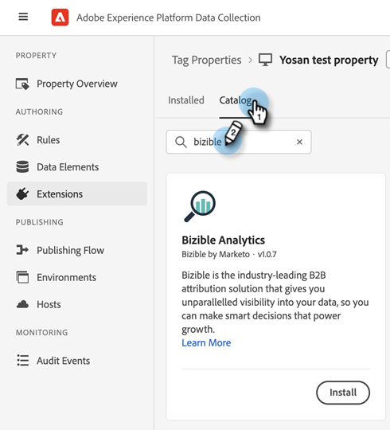
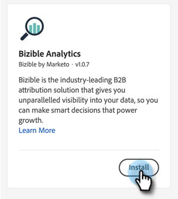
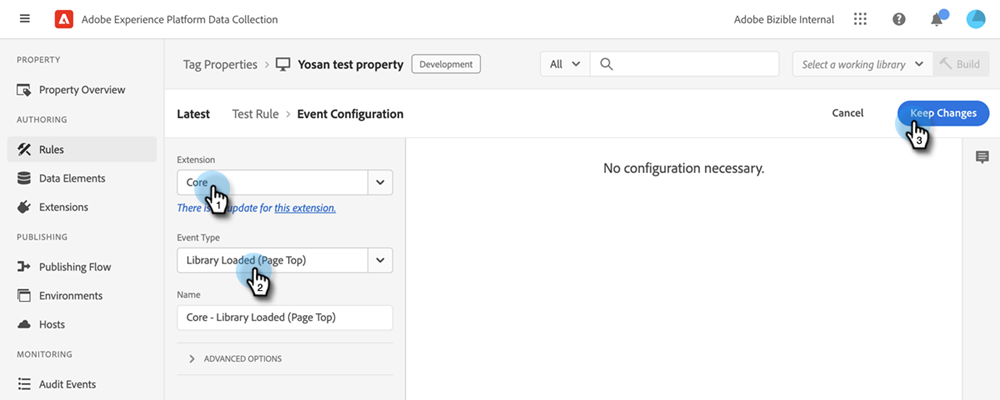

# Adobe Launch와 [!DNL Marketo Measure] 통합 {#marketo-measure-integrations-with-adobe-launch}

Adobe Launch 확장은 이미 웹 사이트에서 Adobe Launch를 사용하는 기존 [!DNL Marketo Measure] 사용자를 위해 설계되었습니다. 확장은 특정 이벤트 및 조건에 따라 페이지에서 스크립트를 구성하고 동적으로 로드하는 데 사용할 수 있는 태그 관리 솔루션 역할을 합니다.

Adobe Launch에 설치 및 구성할 때 [!DNL Marketo Measure] 확장은 Adobe Launch 스크립트가 있는 페이지에 bizible.js 스크립트를 로드합니다. 이렇게 하면 마케터는 웹 페이지를 명시적으로 수정하여 bizible.js 스크립트 태그를 추가하는 대신 Adobe Launch 구성을 통해 bizible.js를 추가할 수 있습니다.

## Adobe Launch 확장 구성 {#configure-the-adobe-launch-extension}

>[!PREREQUISITES]
>
>Adobe Launch 및 그 확장에 대한 자세한 내용은 다음 링크를 확인하십시오.
>
>* [[!DNL Marketo Measure] 확장](https://experienceleague.adobe.com/docs/experience-platform/destinations/catalog/email/bizible.html#catalog){target="_blank"}
>* [Adobe 시작 개요](https://experienceleague.adobe.com/docs/platform-learn/implement-in-websites/overview.html){target="_blank"}
>* [Adobe Launch 확장 개요](https://experienceleague.adobe.com/docs/experience-platform/tags/extension-dev/overview.html){target="_blank"}

1. 이 문서의 [단계에 따라 속성을 만듭니다](https://experienceleague.adobe.com/docs/platform-learn/implement-in-websites/configure-tags/create-a-property.html#go-to-the-data-collection-interface){target="_blank"}.

1. 생성한 속성을 클릭합니다.

   

1. **[!UICONTROL Extensions]**&#x200B;를 클릭합니다.

   

1. **[!UICONTROL Catalog]** 탭을 클릭하고 &quot;[!UICONTROL Bizible]&quot;을(를) 검색합니다.

   

1. [!UICONTROL Bizible Analytics] 타일에서 **[!UICONTROL Install]**&#x200B;을(를) 클릭합니다.

   

1. Bizible AccountId 필드에 웹 사이트의 URL을 입력합니다(예: `adobe.com`).

   의 URL을 입력합니다.

1. **[!UICONTROL Save]**&#x200B;를 클릭합니다.

   

1. **[!UICONTROL Rules]**&#x200B;을(를) 클릭한 다음 **[!UICONTROL Create New Rule]**&#x200B;을(를) 선택합니다.

   

1. **[!UICONTROL Add]** 아래의 [!UICONTROL Events] 단추를 클릭합니다.

   

1. 확장 드롭다운에서 **[!UICONTROL Core]**&#x200B;을(를) 선택합니다. 그런 다음 이벤트 유형 드롭다운에서 **[!UICONTROL Library Loaded (Page Top)]**&#x200B;을(를) 선택합니다. 이벤트에 이름을 지정하지 않으면 기본 이름이 적용됩니다. 완료되면 **[!UICONTROL Keep Changes]**&#x200B;을(를) 클릭합니다.

   에서

1. 작업 아래의 **[!UICONTROL Add]** 단추를 클릭합니다.

   

1. 확장 드롭다운에서 **[!UICONTROL Bizible Analytics]**&#x200B;을(를) 선택합니다. 그런 다음 작업 유형 드롭다운에서 **[!UICONTROL Initialize]**&#x200B;을(를) 선택합니다. 작업에 이름을 지정하지 않으면 기본 이름이 적용됩니다. 완료되면 **[!UICONTROL Keep Changes]**&#x200B;을(를) 클릭합니다.

   

1. **[!UICONTROL Save]**&#x200B;를 클릭합니다.

   

