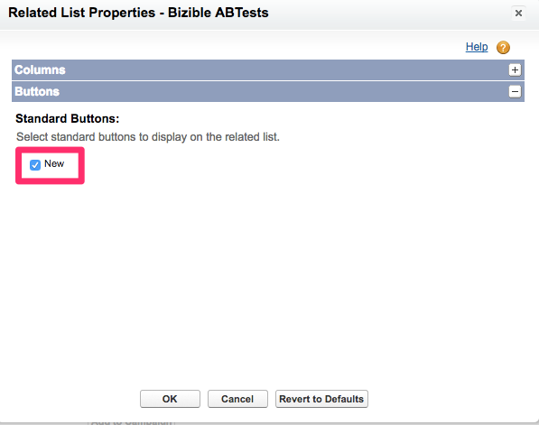
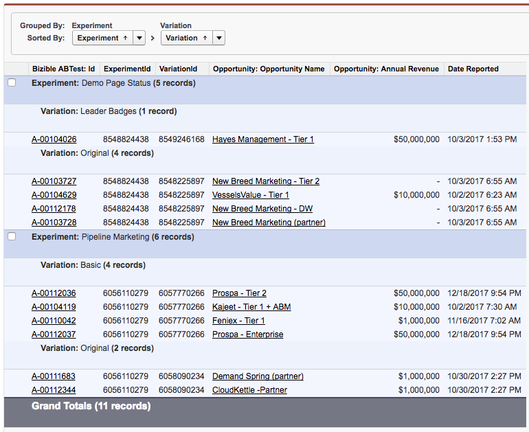

# A/B 테스트 설정 및 보고 {#a-b-testing-set-up-and-reporting}

다음 [!DNL Marketo Measure] A/B 테스트 통합을 통해 의 매출 영향을 추적할 수 있습니다. [최적 상태](https://optimizely.com/){target="_blank"} 및 VWO 사이트 실험. 이 문서 안내서에서는 추가 방법에 대한 지침을 제공합니다 [!DNL Marketo Measure] 잠재 고객에 대한 A/B 테스트 섹션, [!UICONTROL Contact], 대/소문자 및 [!UICONTROL Opportunity] 페이지 레이아웃입니다. 또한 실행에 대한 일반적인 보고 사례 및 권장 사항도 다룹니다 [!DNL Marketo Measure] A/B 보고서 유형.

## 설정 {#set-up}

추가 [!DNL Marketo Measure] Lead, Contact, Case 및 Opportunity에 대한 A/B 테스트 섹션 [!DNL Marketo Measure] A/B 테스트 통합을 통해 의 매출 영향을 추적할 수 있습니다. [최적 상태](https://optimizely.com/){target="_blank"} and [VWO](https://vwo.com/){target="_blank"} 사이트 실험.

1. 패키지를 사용 중인지 확인 [!DNL Marketo Measure] v3.9 이상 다음 위치로 이동하여 이 작업을 수행할 수 있습니다. [!UICONTROL Salesforce] >[!UICONTROL Set Up] > [!UICONTROL Installed packages].
1. 리드 페이지 레이아웃을 편집하고 **[!DNL Marketo Measure]A/B 테스트** 관련 목록을 페이지에 추가합니다.

   

1. 다음을 클릭합니다. [!UICONTROL Wrench] 단추를 클릭합니다. 선택한 필드 목록에서 스톡 &quot;ID&quot; 필드를 제거합니다. 추가 **[!UICONTROL Experiment]**, **[!UICONTROL Variation]**, 및 **[!UICONTROL DateReported]** 필드. 변경&quot;[!UICONTROL Sort by]&quot; 대상 **[!UICONTROL Date Reported]**, 및 선택 **[!UICONTROL Descending]** 을 클릭합니다.

   

1. 아래 [!UICONTROL Buttons], 선택 취소 **[!UICONTROL New]**.

   

1. 다음으로 연락 [!DNL Marketo Measure] rep 또는 [Marketo 지원](https://nation.marketo.com/t5/support/ct-p/Support){target="_blank"} 을 클릭하여 기능을 활성화합니다.

## 보고 {#reporting}

고객은 다음 두 가지 항목에 액세스할 수 있습니다. [!DNL Marketo Measure] 가망 고객, 연락처 및 기회와 관련하여 A/B 테스트에 대해 보고할 수 있는 A/B 보고서 유형은 다음과 같습니다.

* [!DNL Marketo Measure] A/BTests
* [!DNL Marketo Measure] 연락처가 있는 A/BTests
* [!DNL Marketo Measure] 잠재 고객 포함 A/BTests
* [!DNL Marketo Measure] 영업 기회가 있는 A/BTests

A/B 보고서 유형은 A/B 테스트에 노출된 잠재 고객, 연락처 또는 기회를 보고하는 데 사용됩니다. 또한 이러한 보고서는 A/B 테스트에 노출된 Opportunity 와 관련된 매출액을 보여 줍니다.

Optimizely/VWO는 콘텐츠 변형 플랫폼이며 마케팅 채널이 아닙니다. 따라서 [!DNL Marketo Measure] A/B 보고서 유형은 구매자 접점 보고서와 다르게 사용됩니다. 구매자 접점 보고서 유형은 어떤 마케팅 채널(예: 유료 광고, 웹 다이렉트, 소셜)이 잠재 고객 또는 연락처를 특정 페이지로 유도했는지 파악하는 데 사용됩니다. 그러나 [!DNL Marketo Measure] A/B 보고서 유형을 사용하여 변형이 Lead 또는 Opportunity에 미치는 영향을 보고할 수 없습니다. 또한 A/B 테스트 변형은 채널이 아니므로 변형에 대한 세부 사항이 구매자 접점에 표시되지 않습니다.

다음은 A/B 테스트에 대해 보고할 때 명확성과 통찰력을 높이는 데 도움이 되는 몇 가지 일반적인 필드입니다.

* 전환된 잠재 고객
* 실험
* 실험 ID
* Variation
* 변형 ID
* 보고된 날짜

## [!DNL Salesforce] 예제 보고서 {#salesforce-example-reports}

**[!DNL Marketo Measure]리드를 사용한 A/B 테스트**

**[!DNL Marketo Measure]Opportunity 가 있는 A/B 테스트**

