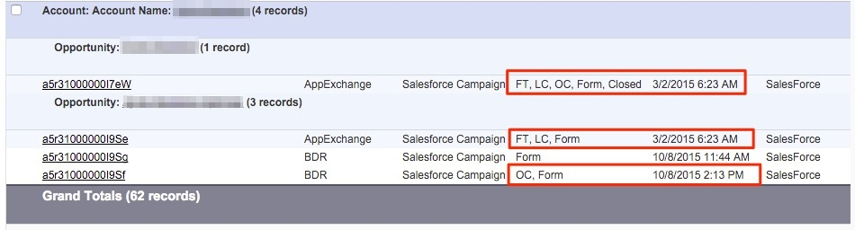

# 계정 기반 속성 {#account-based-attribution}

계정 기반 마케팅(ABM)의 부상과 함께 그 방법을 이해하는 것이 중요합니다 [!DNL Marketo Measure] 는 ABM 전략을 보완할 수 있습니다. [!DNL Marketo Measure] 은(는) 각 리드에 대한 각 터치포인트를 표시하고 귀하의 계정 아래에 연락합니다.

## 다음 [!UICONTROL What] {#the-what}

하나의 계정에 여러 개의 영업 기회가 있는 경우, 서로 다른 영업 기회는 처음 두 터치포인트 (FT) 및 리드 생성 (LC) 을 동일하게 공유합니다. 새로운 Opportunity 가 생성되면 Opportunity 를 더 아래로 이동하는 데 기여한 Touchpoints에 개별 수익 금액이 할당됩니다. 기회와 연결된 터치포인트는 구매자 속성 터치포인트(BAT)로 간주됩니다.

예를 들어 아래 계정에는 두 개의 Opportunity 가 있습니다. 첫 번째 Opportunity 의 경우 터치포인트가 하나만 있습니다. 해당 접점은 FT, LC 및 OC(Opportunity Creation) 접점을 포함합니다. 두 번째 Opportunity 는 첫 번째 Opportunity 와 동일한 FT &amp; LC 를 갖지만 OC Touchpoint 는 다릅니다. 또한 두 번째 Opportunity 에는 첫 번째 Opportunity 의 Closed Date 이후에 발생하는 추가 Touchpoints 로 인해 첫 번째 Opportunity 와 연관되지 않은 몇 가지 추가 Touchpoints 가 있습니다.

## 이 방법이 어떤 도움이 됩니까? {#how-does-this-help}

다음 이후 [!DNL Marketo Measure] 은 계정에 연결된 모든 마케팅 상호 작용을 노출하고, 마케터는 닫을 수 있는 계정, 귀사와 계약한 빈도, 계약 내용, 각 계약의 가치 매출 등에 대해 더 잘 이해합니다.

포함 [!DNL Marketo Measure] 그리고 ABM 접근 방식을 통해 마케팅 성과는 최종적으로 매출에 기반합니다. 계정 기반 마케팅 접근 방식으로 이동하려는 경우 [ABM Orchestration에 대한 CMO 안내서](https://info.bizible.com/cmos-guide-to-abm-orchestration)ABM 오케스트레이션의 계획, 실행 및 측정 단계를 안내합니다.
