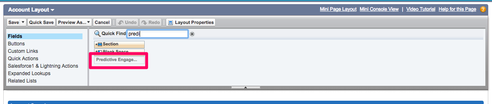

# 계정 기반 마케팅 개요 {#account-based-marketing-overview}

다음 섹션에서는 ABM, [!DNL Marketo Measure] ABM 기능의 구성 요소 및 [!DNL Salesforce] 페이지 레이아웃에 추가하는 방법에 대한 간단한 개요를 제공합니다. ABM에 대해 자세히 알아보려면 Adobe의 [ABM 블로그](https://business.adobe.com/blog/basics/account-based-marketing){target="_blank"}를 검토하세요.

[!DNL Salesforce] 인스턴스 내에서 ABM을 설정하는 방법에 대한 자세한 지침은 [Salesforce에서 ABM 페이지 레이아웃 설정](/help/advanced-marketo-measure-features/account-based-marketing/account-based-marketing-overview.md#setting-up-abm-page-layout-in-salesforce){target="_blank"}으로 이동하십시오.

## ABM이란 {#what-is-abm}

계정 기반 마케팅, ABM은 개인뿐만 아니라 기업 및 계정 전체를 대상으로 하여 판매하는 마케팅 전략입니다. [!DNL Marketo Measure]을(를) 사용하면 마케팅 및 영업 팀이 리드-계정 매핑 기능과 예측 참여 점수를 통해 성공적인 ABM 전략을 실행할 수 있습니다.

계정 기반 마케팅 모델을 CRM에 채우려면 [!DNL Marketo Measure]에서 다음 기준을 충족해야 합니다.

* CRM에는 최소 25개의 계정에 최소 하나의 확정된 영업 기회가 있어야 비즈니스에 대한 &quot;성공적인&quot; 계정/영업 기회의 공통점을 더 잘 측정할 수 있습니다.
* 동전의 반대편인 CRM에는 종결된 성공 기회 없이 최소 25개의 계정이 필요합니다(모든 옵션은 &quot;공개&quot; 단계 범주 또는 &quot;폐쇄됨&quot; 범주에 있어야 함). 이를 통해 조직에서 등급이 낮은 계정을 만드는 이유를 측정할 수 있습니다.

>[!NOTE]
>
>위의 &quot;불량&quot; 계정은 폐쇄 원화 OPP를 누적하지 않고 최소 12개월 동안 개설되어야 합니다. 즉, Opp가 모델의 목적에 따라 부실화되었는지 여부에 대한 기본 지침입니다.

## 리드-계정 매핑 {#lead-to-account-mapping}

리드-계정 매핑은 효과적인 ABM 접근법의 중요한 부분입니다. 리드-계정 매핑, 잠재 고객 또는 리드를 사용하면 브랜드와 관계를 맺을 때 동일한 회사 계정으로 그룹화됩니다. 이를 통해 일관된 방식으로 동일한 회사의 개인에 대해 타겟팅 및 판매를 수행할 수 있습니다. 이 기능을 사용하려면 추가 [!DNL Salesforce] 구성이 필요하지 않습니다. [!DNL Marketo Measure] 리드-계정 매핑에 일치하는 다른 방법이 있습니다.

* 잠재 고객 웹 사이트 - 계정 웹 사이트
* 이메일 도메인을 계정 웹 사이트 도메인으로 리드
* 리드 회사 이름을 계정 이름으로
* 회사를 계정 웹 사이트 도메인으로 안내합니다.
* 계정 담당자의 이메일 도메인으로 웹 사이트 리드
* 잠재 고객 이메일 도메인을 계정 담당자의 이메일 도메인으로
* 계정 리드의 이메일 도메인으로 웹 사이트 리드
* 잠재 고객 이메일 도메인을 계정 잠재 고객의 이메일 도메인으로 전환

고객의 리드/연락처는 이메일/웹 사이트 도메인을 통해 검증되며 리드 이메일/웹 사이트의 도메인 또는 하위 도메인과 일치합니다. 일치하는 항목이 가장 많은 계정이 사용됩니다.

>[!NOTE]
>
>각 Lead 는 위의 방법 순서에 따라 Account에 대응됩니다. 일치하는 항목이 있으면 AccountId가 즉시 리드에 설정되고 다른 방법을 사용하여 일치하지 않습니다.

## 예측 참여 점수 {#predictive-engagement-score}

[!DNL Marketo Measure] 예측 참여 점수(PES)는 특정 계정이 마케팅 활동에 얼마나 참여했는지 보여 주는 동적 값입니다. 이 점수는 계정을 대상으로 세그먼트화하는 데 유용합니다. 보다 효과적이고 효율적으로 타깃팅할 계정을 식별하는 데 귀중한 툴입니다.

PES를 계산하는 알고리즘에는 많은 구성 요소가 들어갑니다. 최신성과 연령은 마지막 터치포인트 활동이나 페이지 조회수와 함께 점수 변화에 큰 영향을 미칩니다. 계정에 새 연락처를 추가하면 PES에도 영향을 줍니다. 다음은 일부 PES 입력 목록입니다.

* 계정의 총 페이지 보기 수
* 평균 페이지 보기 수
* 계정의 평균 사람 수
* 마지막 페이지 보기 나이
* 페이지 조회수의 평균 연령
* 계정의 사용자 수
* 특정 중요 페이지 및 지난 30/60/90일 동안 방문이 있었던 경우
* 계정에 종료된 손실/원 거래
* 손실/원화로 마감될 가능성

>[!NOTE]
>
>일부 계정에 대한 예측 참여 점수에서 &quot;N/A&quot; 또는 &quot;-&quot;(대시 기호)의 등급을 볼 수 있습니다.

_N/A의 등급은 모델에 대한 해당 계정의 데이터가 부족하여 실제 등급을 생성할 수 없다는 의미입니다. 데이터가 많을수록 등급이 부여됩니다._
_등급 &quot;-&quot;(대시 기호)는 시간 제한, 때때로 누락된 프로세스 등으로 인해 이 계정이 ABM 프로세스에서 아직 처리되지 않았음을 의미합니다. 유사한 다른 계정 또는 일정에 따라 계정에 등급이 있어야 한다고 생각되면 [!DNL Marketo Measure]에게 연락하여 알려 주십시오._

## [!DNL Salesforce]에서 ABM 페이지 레이아웃을 설정하는 중 {#setting-up-abm-page-layout-in-salesforce}

PES를 사용하려면 PES 필드 및 관련 목록을 [!DNL Salesforce]의 해당 페이지 레이아웃에 추가해야 합니다.

1. **[!UICONTROL Setup]** > **[!UICONTROL Customize]** > **[!UICONTROL Accounts]** > **[!UICONTROL Page Layout]**(으)로 이동합니다. 그런 다음 편집할 페이지 레이아웃을 선택합니다.
1. [!UICONTROL Fields] (으)로 이동하여 &quot;예측 참여 점수&quot; 필드를 계정 정보 섹션으로 이동하십시오.

   

1. 마지막으로 [!UICONTROL Related Lists] (으)로 이동하여 &quot;잠재 고객&quot; 관련 목록을 페이지 레이아웃으로 이동합니다.

   

1. 그런 다음 **[!UICONTROL Setup]** > **[!UICONTROL Customize]** > **[!UICONTROL Leads]** > **[!UICONTROL Page Layout]**(으)로 이동하여 편집할 페이지 레이아웃을 선택합니다.
1. **[!UICONTROL Fields]**&#x200B;을(를) 클릭하고 페이지에 맞는 [!UICONTROL Account] 필드를 추가합니다.

   

준비가 완료되었습니다!

