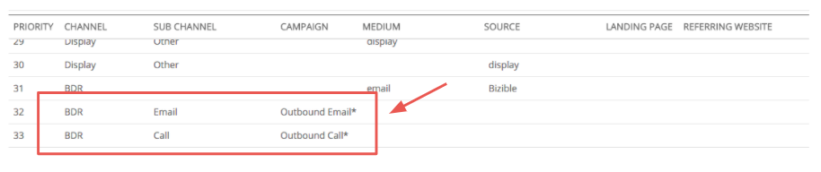

# Salesforce 활동 속성 {#salesforce-activities-attribution}

다음 [!DNL Marketo Measure] Salesforce 활동 통합은 특정 작업 및 이벤트 레코드를 속성 모델에 가져옵니다. 적법한 크레딧을 받지 못한 판매 이메일 또는 판매 전화 등의 항목을 추적하기 시작합니다. 활동 규칙을 구성하려면 다음 위치로 이동합니다. [experience.adobe.com/marketo-measure](https://experience.adobe.com/marketo-measure){target="_blank"}. 여기서 다음 위치로 이동합니다. **[!UICONTROL Settings]** 탭을 클릭하고 **[!UICONTROL Activities]** 탭.

먼저, 라는 새로운 개념을 도입합니다. [!DNL Marketo Measure] 캠페인. 정의하는 각 규칙에 대해 레코드를 버킷으로 [!DNL Marketo Measure] 이름을 지정할 수 있는 캠페인. 필요에 따라 여러 캠페인을 추가합니다. 유료 미디어 캠페인 옆에 있는 아웃바운드 판매 캠페인의 효과를 측정한다고 상상해 보십시오.

이 항목을 사용합니다. [!DNL Marketo Measure] 매핑해야 하는 채널을 알려 주는 캠페인 이름. 여전히 아웃바운드 영업에 대해 생각하고 있다면 모든 아웃바운드 영업 캠페인이 BDR 채널에 머물러야 할 것입니다.

이 계층 구조에 익숙해지십시오.

* 채널
   * 부채널
      * Campaign
      * Campaign
   * 부채널
      * Campaign

>[!TIP]
>
>예를 들어 각 Sales Rep에 대해 고유한 Campaign 을 설정하려면 동적 대체 매개 변수를 사용하여 다음을 입력합니다. [!DNL Marketo Measure] 캠페인 이름. 같은 예에서 다음을 입력할 수 있습니다. `"Outbound Sales - {AssignedTo}"` and it changes변화 it to something like `"Outbound Sales - Jill"` 또는 `"Outbound Sales - Jack."`

한 번 [!DNL Marketo Measure] 캠페인 이름이 설정되었습니다. 활동 규칙을 설정할 차례입니다.

규칙은 어떤 레코드가 속성에 적합한지 알려주는 필터 역할을 합니다. 유사한 논리를 사용하여 CRM에서 보고서를 생성하여 해당 보고서를 생성한다고 가정해 보겠습니다. and/or 구문과 같은 다양한 연산자의 조합을 사용할 수 있는 유연성이 있습니다 `matches any`, `contains`, `starts with`, `ends with`, `is equal to`. 정의 `and` 박스형 규칙 또는 레이어 내의 명령문 `or` 상자 외부의 명령문입니다.

>[!NOTE]
>
>공식 필드는 규칙 내에서 사용할 수 없으며 선택 목록에 표시되지 않습니다. 수식은 백그라운드에서 계산되며 레코드를 수정하지 않으므로 [!DNL Marketo Measure] 레코드가 규칙에 맞는지 여부를 감지할 수 없습니다.
>
>CrmEvent.CreatedById와 같은 ID 필드에 올바른 값을 사용해야 합니다. [!DNL Salesforce IDs] 길이는 18자(0054H000007WmrfQAC)입니다.

마지막으로, 구매자 접점 일자로 사용할 날짜 또는 날짜/시간 필드 중 하나를 선택합니다. 표준 및 사용자 정의 필드 중 하나를 선택할 수 있습니다.

>[!TIP]
>
>패키지를 설치하면 [!DNL Marketo Measure] 활동 레코드에 사용자 정의 구매자 터치포인트 날짜 필드를 포함합니다. 상태가 변경되는 날짜와 같은 동적 날짜를 사용하려면 CRM 워크플로우를 사용하여 &quot;구매자 터치포인트 날짜&quot;를 설정한 다음 이 단계에서 여기에서 구매자 터치포인트 날짜를 선택할 수 있습니다.

작업 또는 이벤트에 대해 다른 규칙을 설정하는 것을 잊지 마십시오. 영업 팀이 활동을 기록하기 위해 사용하는 객체를 알고 있어야 합니다.

이러한 새로운 터치포인트를 적절하게 배치해야 할 것입니다 [마케팅 채널](https://experience.adobe.com/#/marketo-measure/MyAccount/Business?busView=false&amp;id=10#/!/MyAccount/Business/Account.Settings.SettingsHome?tab=Channels.Online%20채널){target="_blank"}. 방금 만든 새 캠페인 매핑으로 채널을 정의하여 이 작업을 수행합니다.

>[!TIP]
>
>채널 정의를 추가할 때 다음과 같이 연산자를 더 쉽게 지정하는 방법인 와일드카드 값을 사용하십시오.
>
>다음으로 시작 ( 아웃바운드&#42; )
>
포함 ( &#42;아웃바운드&#42; )
>
다음으로 끝남( &#42;아웃바운드 )
>
와일드카드는 기본적으로 &quot;같음&quot;을 의미하지 않으므로 필요에 따라 사용하십시오.

| **연산자** | **사용 사례** |
|---|---|
| 다음과 같음 | 단일 값 - 정확한 일치 |
| 포함 | 단일 값 - 값 포함 |
| 임의 항목 일치 | 여러 값 - 정확한 일치 |
| 모두 일치(포함) | 다중 값 - &#42;값&#42;, &#42;값, &#42;값&#42; |

마지막으로, 새 채널에 대한 비용을 입력할 수 있습니다. 다음 [마케팅 지출 업로드](https://experience.adobe.com/#/marketo-measure/MyAccount/Business?busView=false&amp;id=10#/!/MyAccount/Business/Account.Settings.SettingsHome?tab=Reporting.Marketing%20Spent){target="_blank"} 채널 수준, 하위 채널 수준 또는 캠페인 수준에서 지출을 입력할 수 있습니다. 새 항목 포함 [!DNL Marketo Measure] 캠페인에서는 이러한 관련 비용을 월별 추가한 다음 각 캠페인에 대한 ROI를 확인할 수 있습니다.

>[!MORELIKETHIS]
>
[활동 속성 FAQ](/help/advanced-marketo-measure-features/activities-attribution/activities-attribution-faq.md)
