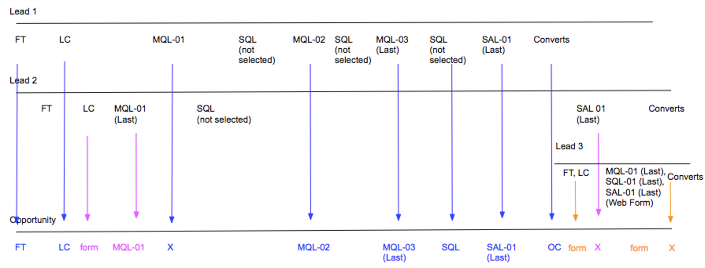

# 부메랑 단계 시나리오 {#boomerang-stage-scenarios}

>[!AVAILABILITY]
>
>부메랑 기능은 계층 2 및 3 고객에게만 활성화됩니다. 더 높은 계정 계층을 요청하려면 Adobe 계정 팀(계정 관리자)에 문의하십시오.

다음은 [!DNL Marketo Measure]이(가) 각 상황에서 터치포인트를 만드는 방법을 이해하는 데 도움이 되는 몇 가지 부메랑 단계 시나리오의 예입니다.

## 단일 리드 시나리오 {#single-lead-scenarios}

**시나리오 1: 리드에 대한 표준 부메랑 터치포인트**

이것이 가장 간단한 부메랑 시나리오입니다. 상단 라인(리드 1로 레이블 지정)은 개별 리드의 여정 및 해당 터치포인트가 리드 레코드에 표시되는 방식을 나타냅니다. 맨 아래 줄(Opportunity 레이블 지정)에는 Lead 의 Touchpoint 가 Opportunity 로 어떻게 변환되는지 표시됩니다. 접점의 진행은 왼쪽에서 오른쪽으로 시간순으로 설명되어 있다.

이 시나리오에서 고객은 **MQL** 및 **SQL** 단계를 Boomerangs로 추적하도록 선택했습니다. 각 부메랑 접점 위치는 단계 및 발생하는 번호(MQL-01, SQL-01, MQL-02)로 레이블이 지정됩니다. 해당 단계에 대한 마지막 부메랑 접점은 접점 위치에 &quot;(마지막)&quot;이 있습니다.

그런 다음 Lead 1은 Opportunity가 있는 Contact로 변환되며, 이는 OC 터치로 간주됩니다.

**시나리오 2: 리드에 대한 Boomerang 터치포인트 및 사용자 지정 단계**

이 시나리오에서는 고객이 부메랑 접점을 사용하여 **SQL 단계**&#x200B;만 추적하도록 선택했습니다. MQL 및 SAL 단계가 계속 추적되고 있지만 [!DNL Marketo Measure] 사용자 지정 단계 기능이 있습니다.

MQL 터치포인트 위치는 숫자로 레이블이 지정되지 않습니다. 부메랑 터치포인트로 추적하도록 선택하지 않았기 때문이다. 사용자 지정 모델에 포함되어 있지만 Boomerang으로 추적되지 않는 단계에 대한 터치포인트를 만들 때 [!DNL Marketo Measure]은(는) 해당 단계의 마지막 항목을 가져옵니다.

SAL 단계의 경우 [!DNL Marketo Measure]에서 이 단계의 처음 두 항목을 무시합니다. [!DNL Marketo Measure]은(는) _last_ 항목에 대한 SAL 터치포인트만 만듭니다. 위의 예에서 이 작업은 OC 터치포인트 바로 전에 발생합니다.

SQL 단계는 Boomerang 터치포인트로 추적되며 3개의 터치포인트가 생성되고 이에 따라 레이블이 지정됩니다.

그런 다음 Lead 1은 Opportunity가 있는 Contact로 변환되며, 이는 OC 터치로 간주됩니다.

**시나리오 3: 잠재 고객이 단계에 도달하거나 건너뛸 수 없는 경우**

이 시나리오에서는 시나리오 2와 동일한 기준을 사용합니다. 고객은 부메랑 접점을 사용하여 SQL 단계만 추적하도록 선택했습니다. MQL 및 SAL이 계속 추적되고 있지만 [!DNL Marketo Measure] 사용자 지정 단계 기능이 있습니다.

이 시나리오에서 Lead 는 실제로 SAL 단계로 전환되지 않습니다. SAL 단계에 도달하기 전에 Contact 로 변환되며, 기본적으로 SAL 단계는 &quot;건너뜀&quot;입니다. 이 상황에서 [!DNL Marketo Measure]은(는) SAL이 OC 터치포인트와 함께 발생하고 SAL 및 OC 위치가 모두 동일한 터치포인트에 나타난다고 가정합니다.

그런 다음 Lead 1은 Opportunity가 있는 Contact로 변환되며, 이는 OC 터치로 간주됩니다.

## 여러 개의 리드가 있는 시나리오 {#scenarios-with-multiple-leads}

다음은 여러 Lead 가 Opportunity 여정에 미치는 영향을 살펴보고 있기 때문에 Boomerang Stage 가 더욱 복잡해질 수 있는 시나리오입니다.

상단 라인(파란색 리드 1 표시)은 개별 리드의 여정 및 해당 터치포인트가 리드 레코드에 표시되는 방식을 나타냅니다. 납 2(분홍색)와 납 3(주황색)도 마찬가지입니다. 이 Lead 의 터치 포인트가 Opportunity 로 변환되는 방식을 나타내는 Opportunity 가 표시됩니다. 접점의 진행은 왼쪽에서 오른쪽으로 시간순으로 설명되어 있다.

**시나리오 1:[!UICONTROL Three Leads with Opportunity]**

이 시나리오에서 고객은 부메랑 터치포인트를 사용하여 **MQL** 및 **SAL 단계**&#x200B;를 추적하도록 선택했습니다. SQL 단계가 표준 사용자 지정 단계에 의해 추적됩니다.

Opportunity 의 FT 및 LC 터치포인트는 Lead 1 (파란색)에서 비롯되는데, 이는 Lead 2 (분홍색)의 FT 및 LC 보다 먼저 발생했기 때문입니다. Lead 2에 대한 LC 터치포인트는 Opportunity에서 &quot;Form&quot; 터치포인트로 표시됩니다.

리드 2의 MQL-01(마지막)이 Opportunity에서 첫 번째 MQL이 됩니다. 리드 2의 MQL이 먼저 발생했으므로 리드 1의 MQL-01은 Opportunity에 대한 터치 포인트로 표시되지 않습니다. 그러나 Lead 1의 MQL-02 및 MQL-03 이 Opportunity에 표시됩니다.

SQL 단계가 부메랑 단계가 아닌 사용자 지정 단계로 추적되고 있습니다. 리드 1과 리드 2 사이에 SQL 단계가 세 번 발생하더라도 마지막 SQL 발생만 Opportunity 의 접점으로 포함됩니다.

리드 1의 SAL-01(마지막) 터치포인트가 Opportunity의 터치포인트로 이월됩니다. 그런 다음 Lead 1은 Opportunity가 있는 Contact로 변환되며, 이는 OC 터치로 간주됩니다. Lead 2의 SAL-01(마지막) 터치포인트는 OC 터치 _후_&#x200B;에 발생했으므로 터치포인트로 생성되지 않습니다.

리드 3의 FT, LC 및 MQL, SQL, SAL 접점(주황색)은 모두 Opportunity의 OC 접점 이후에 발생했습니다. 이러한 터치포인트는 Opportunity에 포함되어 있지만 &quot;중간 터치&quot;로 간주됩니다.

잠재 고객 2와 3이 연락처로 전환되면 [!DNL Marketo Measure]이(가) 다른 OC 접점을 만들지 않습니다. 영업 기회 생성 단계는 하나만 있을 수 있기 때문입니다.

**시나리오 2 - 웹 방문 부메랑 터치포인트**

이 시나리오에서는 고객이 부메랑 접점을 사용하여 **MQL**, **SQL** 및 **SAL** 단계를 추적하도록 선택했습니다. 이 시나리오는 몇 가지 예외를 제외하고 위의 시나리오와 거의 동일합니다.

Lead 1 의 모든 터치포인트는 FT 부터 SAL-01( 마지막 ) 까지 Opportunity에 포함됩니다. 리드 2의 LC 터치포인트는 Opportunity에서 LC와 MQL-01 터치포인트 사이에 Form 터치포인트로 포함됩니다.

리드 2의 MQL-01(마지막)(웹 방문)은 Opp의 터치 포인트로 생성되지 않습니다. 이는 이 접점이 SQL 단계가 마지막으로 발생한 후에 발생하는 웹 방문이었기 때문이며 영업 기회를 추진하는 데 도움이 되지 않습니다.

리드 1의 단계가 SAL로 변경된 다음 Opportunity가 있는 Contact로 변환됩니다. 이 경우 SAL-01(마지막) 및 OC 위치는 동일한 접점에서 결합됩니다.

리드 3의 FT,LC 터치는 Opp의 Form 터치포인트로 생성됩니다. OC 터치 후 양식 채우기 작업만 터치포인트로 생성됩니다. 이러한 이유로 Lead 2에 대한 SQL-01(Last) 및 SAL-01(Last) 스테이지 전환은 이 터치포인트가 웹 방문이므로 터치포인트로 생성되지 않습니다.

리드 3의 MQL, SQL, SAL 터치는 양식 채우기 작업이므로 터치포인트로 포함됩니다.

**시나리오 3 - 부메랑 속성 가중치**

이 시나리오에서는 고객이 부메랑 접점을 사용하여 **MQL**, **SQL** 및 **SAL** 단계를 추적하도록 선택했습니다.

Opportunity 의 FT 및 LC 터치포인트는 Lead 1 (파란색)에서 비롯되는데, 이는 Lead 2 (분홍색)의 FT 및 LC 보다 먼저 발생했기 때문입니다. Lead 2에 대한 LC 터치포인트는 Opportunity에서 &quot;Form&quot; 터치포인트로 표시됩니다.

리드 2의 MQL-01(마지막)이 Opportunity에서 첫 번째 MQL이 되었습니다. 리드 2의 MQL이 먼저 발생했으므로 리드 1의 MQL-01은 Opportunity에 대한 터치 포인트로 표시되지 않습니다.

리드 2의 SQL-01(마지막)이 영업 기회에서 SQL-01이 됩니다. 잠재 고객 1의 SQL-01은 잠재 고객 2의 SQL-01이 먼저 발생했으므로 해당 영업 기회에 대한 접점으로 표시되지 않습니다.

SAL 단계에 도달하기 전에 MQL과 SQL 간 리드 1 부메랑을 두 번 확인하십시오. SQL-01, MQL-02, SQL-02, MQL-03, SQL-03 _은(는) 여정에서 기회를 추진하는 데 도움이 되지 않으므로 기회에 터치포인트로 포함되지 않습니다_.

리드 1의 SAL-01(마지막) 터치포인트가 Opp에 포함될 다음 터치포인트입니다. 그런 다음 리드 1은 기회가 있는 연락처로 전환되어 OC 접점을 만듭니다.

리드 3의 FT 및 LC와 MQL, SQL 및 SAL 터치포인트는 Opportunity에 대한 양식 터치로 표시됩니다.

리드 2의 SQL-01(마지막) 접점은 OC 접점 이후에 발생했으므로 OPP의 접점으로 포함되지 않습니다. 또한 잠재 고객 2의 SQL 단계 전환은 마지막 SAL 단계 전환 _이후에_&#x200B;발생했으며 영업 기회 여정을 추진하는 데 도움이 되지 않습니다.

## 영업 기회 시나리오 {#opportunity-scenarios}

**시나리오 1 - 영업 기회 및 부메랑 추적이 있는 연락처**

이 시나리오에서는 고객이 **연락처**&#x200B;에서 **데모 및 협상 단계 전환**&#x200B;을 추적하도록 선택했습니다. 각 부메랑 스테이지는 최대 2개의 터치포인트를 받을 수 있다. 연락처의 단계 전환과 리드의 단계 전환 간의 차이점은 연락처 단계 전환이 Opportunity _after_&#x200B;의 OC 접점에서 부메랑 접점으로 나타날 수 있다는 것입니다. Lead에서 Form 터치포인트로 표시되므로 발생하는 Stage 전환에는 적용되지 않습니다.

이 예에서는 Contact 1의 데모 및 협상 단계 전환이 Opportunity에 Demo-01 및 Negotiation-01 터치포인트로 포함됩니다. 연락처 2의 데모 단계 전환은 _이후_&#x200B;에 발생하며 연락처 1은 Opportunity에서 Demo-02(마지막) 터치포인트로 표시됩니다.

협상 단계로 넘어가는 두 번째 전환은 없습니다. Opportunity 는 즉시 Demo-02 (Last)에서 Close Won으로 이동합니다. 이 경우 [!DNL Marketo Measure]에 마감된 원화 터치포인트와의 협상 전환이 포함됩니다.
