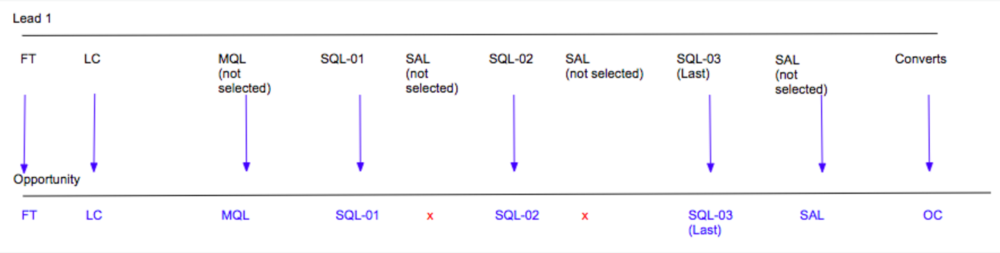

# 부메랑 스테이지 시나리오 {#boomerang-stage-scenarios}

아래는 Boomerang Stage 시나리오의 몇 가지 예로서, [!DNL Marketo Measure] 은 각 상황에서 터치포인트를 만듭니다.

## 단일 리드 시나리오 {#single-lead-scenarios}

**시나리오 1: 리드를 위한 표준 부메랑 터치포인트**

이것은 가장 단순한 부메랑 시나리오입니다. 상단 라인(Lead 1로 레이블이 지정됨)은 개별 Leads의 여정과 Lead 레코드에 Touchpoint가 표시되는 방식을 나타냅니다. 최종 라인(Opportunity 레이블이 지정됨)에는 Lead 터치포인트가 Opportunity 로 변환되는 방식이 표시됩니다. 터치포인트의 진행 상황을 왼쪽에서 오른쪽으로 시간 순서대로 설명합니다.

이 시나리오에서는 고객이 **MQL** 및 **SQL** 부메랑스가 추적한 무대. 각 Boomerang 터치포인트 위치에는 단계 및 이 위치가 발생하는 숫자로 레이블이 지정됩니다(MQL-01, SQL-01, MQL-02). 등) 해당 스테이지의 마지막 부메랑 터치포인트는 터치포인트 위치에 &quot;(마지막)&quot;도 갖게 됩니다.

그런 다음 리드 1이 OC 터치로 간주되는 Opportunity 의 Contact 로 변환됩니다.

**시나리오 2: 부메랑 터치포인트 및 리드의 사용자 정의 단계**

이 시나리오에서는 고객이 **SQL 스테이지** 부메랑 터치포인트. MQL 및 SAL 단계는 계속 추적되지만 [!DNL Marketo Measure] 사용자 지정 단계 기능입니다.

MQL 터치 포인트 위치에 숫자가 추가되어 있지 않습니다. 이것은 그것이 부메랑 터치포인트로 추적되도록 선택되지 않았기 때문입니다. 사용자 지정 모델에 포함된 단계에 대한 터치포인트를 만들 때, 부메랑으로 추적되지 않습니다. [!DNL Marketo Measure] 는 해당 단계에서 마지막 발생 항목을 가져옵니다.

SAL 단계의 경우에는 [!DNL Marketo Measure] 이 단계의 처음 두 항목을 무시합니다. [!DNL Marketo Measure] 에 대한 SAL 터치포인트만 생성 _마지막_ 발생 횟수. 위의 예에서 이 작업은 OC 터치포인트 바로 전에 수행됩니다.

SQL 스테이지는 부메랑 터치포인트로 추적되고 있으며 세 개의 터치포인트가 그에 따라 만들어지고 레이블이 지정됩니다.

그런 다음 리드 1이 OC 터치로 간주되는 Opportunity 의 Contact 로 변환됩니다.

**시나리오 3: 리드가 스테이지에 도달하지 않거나 건너뛸 때**

이 시나리오는 시나리오 2와 동일한 기준을 사용합니다. 고객이 부메랑 터치포인트를 사용하여 SQL 스테이지를 추적하려고 선택한 경우 MQL 및 SAL이 여전히 추적되지만 [!DNL Marketo Measure] 사용자 지정 단계 기능입니다.

이 시나리오에서는 리드가 실제로 SAL 스테이지로 전환되지 않습니다. SAL 단계에 도달하기 전에 Contact로 전환됩니다. 기본적으로 SAL 단계를 &quot;건너뜁니다.&quot; 이런 상황에서 [!DNL Marketo Measure] SAL은 OC 터치포인트에서 발생하며 SAL과 OC 위치가 모두 동일한 터치포인트에 나타납니다.

그런 다음 리드 1이 OC 터치로 간주되는 Opportunity 의 Contact 로 변환됩니다.

## 여러 리드가 있는 시나리오 {#scenarios-with-multiple-leads}

다음 시나리오는 여러 Lead 가 Opportunity 여정에 어떤 영향을 줄 수 있는지 살펴보면서 Boomerang Stage가 더 복잡해질 수 있는 경우입니다.

맨 위 줄(레이블 1, 파란색)은 개별 리드 여정과 해당 터치포인트가 리드 레코드에 표시되는 방식을 나타냅니다. 리드 2(분홍색) 및 리드 3(주황색)에도 적용됩니다. 최종 라인(Opportunity 라고 함)에는 Lead 의 터치포인트가 Opportunity 로 변환되는 방식이 표시됩니다. 터치포인트의 진행 상황을 왼쪽에서 오른쪽으로 시간 순서대로 설명합니다.

**시나리오 1:[!UICONTROL Three Leads with Opportunity]**

이 시나리오에서는 고객이 **MQL** 및 **SAL 단계** 부메랑 터치포인트. SQL 단계는 표준 사용자 지정 단계에 의해 추적됩니다.

Opportunity 의 FT 및 LC 터치포인트는 Lead 1 (파란색)에서 Lead 2 (Pink) 의 FT 및 LC 가 발생하기 전에 Lead 1 (Blue)에서 제공됩니다. Lead 2에 대한 LC 터치포인트는 Opportunity에서 &#39;Form&#39; 터치포인트로 표시됩니다.

Lead 2의 MQL-01(마지막)은 Opportunity에서 첫 번째 MQL이 됩니다. 리드 2의 MQL이 먼저 발생했으므로 리드 1의 MQL-01은 Opportunity에서 터치 포인트로 표시되지 않습니다. 그러나 Lead 1의 MQL-02 및 MQL-03은 Opportunity에 나타납니다.

SQL 스테이지는 부메랑 단계가 아니라 사용자 지정 단계로 추적됩니다. Lead 1과 Lead 2 사이에 SQL 단계가 세 번 발생하더라도 마지막 SQL 발생 사항만 Opportunity에서 터치포인트로 포함됩니다.

리드 1의 SAL-01(마지막) 터치포인트는 Opportunity에서 터치포인트로 전달됩니다. 그런 다음 리드 1이 OC 터치로 간주되는 Opportunity 의 Contact 로 변환됩니다. 리드 2의 SAL-01(마지막) 터치포인트는 이 단계 전환이 발생했으므로 터치포인트로 생성됩니다 _after_ OC 터치.

Opportunity에서 OC 터치포인트 이후에 Lead 3의 FT, LC 및 MQL, SQL, SAL 터치포인트(주황색) 모두 발생했습니다. 이러한 터치포인트는 Opportunity에 포함되지만 &quot;중간 터치&quot;로 간주됩니다.

잠재 고객 2와 3이 연락처로 전환되면, [!DNL Marketo Measure] 하나의 기회 생성 단계만 있을 수 있으므로 다른 OC 터치포인트를 생성하지 않습니다.

**시나리오 2 -[!UICONTROL Three Leads with Opportunity]**

이 시나리오에서는 고객이 **MQL**, **SQL**, 및 **SAL** 부메랑 터치포인트를 갖는 무대

Lead 1의 모든 터치포인트는 FT에서 SAL-01(마지막)으로 Opportunity에 포함됩니다. Lead 2의 LC 터치포인트는 Opportunity의 LC와 MQL-01 터치포인트 간에 Form 터치포인트로 포함됩니다.

Lead 2의 MQL-01(마지막)은 Opportunity의 MQL-04(마지막) 터치포인트가 됩니다. 이 시나리오는 하나의 Opportunity 내에 여러 Lead 의 여정을 보고 있으므로 Lead 터치포인트의 포지셔닝 및 번호 지정은 Opportunity에서 터치포인트로 번역될 때 변경될 수 있습니다. 마찬가지로, 리드 2의 SQL-01(마지막)이 Opp의 SQL-04(마지막)가 됩니다. 리드 2의 SAL-01(마지막)도 Opportunity의 SAL-02(마지막)가 됩니다.

또한 Opportunity에 포함된 SAL 터치포인트는 2개뿐입니다. [!DNL Marketo Measure] 터치 포인트가 실제로 발생하지 않은 경우 스테이지 전환에 대한 터치 포인트를 강제/만들지 않습니다.

리드 3의 터치포인트 여정은 OC 터치가 발생하기 바로 전에 시작되지만 리드 1과 리드 2의 FT 및 LC 터치 후에 시작됩니다. 이 경우 Lead 3의 FT 및 LC는 Opportunity에서 Form 터치포인트로 표시됩니다. 그런 다음 리드 1이 OC 터치로 간주되는 Opportunity 의 Contact 로 변환됩니다.

리드 3의 MQL, SQL 및 SAL 터치 모두 OC 터치 후 동시에 발생합니다. OC 터치포인트 이후에 발생했으므로 이 터치포인트는 부메랑 단계 전환보다는 기회의 양식/중간 터치로 표시됩니다.

**시나리오 2a - 웹 방문 부메랑 터치포인트**

이 시나리오에서는 고객이 **MQL**, **SQL**, 및 **SAL** 부메랑 터치포인트를 갖는 무대 이 시나리오는 몇 가지 예외를 제외하고 위의 시나리오와 거의 동일합니다.

Lead 1의 모든 터치포인트는 FT에서 SAL-01(마지막)으로 Opportunity에 포함됩니다. Lead 2의 LC 터치포인트는 Opportunity의 LC와 MQL-01 터치포인트 간에 Form 터치포인트로 포함됩니다.

리드 2의 MQL-01(마지막)(웹 방문)은 Opp에서 터치포인트로 생성되지 않습니다. 이 터치포인트는 SQL 단계가 마지막으로 발생한 후 발생하는 웹 방문이며 Opportunity 를 앞으로 유도하는 데 도움이 되지 않기 때문입니다.

리드 1의 스테이지가 SAL로 변경되고 Opportunity가 있는 Contact 로 전환됩니다. 이 경우, SAL-01(마지막) 및 OC 위치가 동일한 터치포인트에서 결합됩니다.

리드 3의 FT, LC 터치는 Opp에서 양식 터치포인트로 생성됩니다. 양식 채우기 작업만 OC 터치 후 터치포인트로 생성됩니다. 이러한 이유로, 리드 2에 대한 SQL-01(마지막) 및 SAL-01(마지막) 단계 전환은 이러한 터치포인트가 웹 방문이므로 터치포인트로 생성되지 않습니다.

리드 3의 MQL, SQL, SAL 터치는 양식 채우기 작업이므로 터치포인트로 포함됩니다.

**시나리오 3 - 부메랑 속성 가중치**

이 시나리오에서는 고객이 **MQL**, **SQL**, 및 **SAL** 부메랑 터치포인트를 갖는 무대

Opportunity 의 FT 및 LC 터치포인트는 Lead 1 (파란색)에서 Lead 2 (Pink) 의 FT 및 LC 가 발생하기 전에 Lead 1 (Blue)에서 제공됩니다. Lead 2에 대한 LC 터치포인트는 Opportunity에서 &#39;Form&#39; 터치포인트로 표시됩니다.

Lead 2의 MQL-01(마지막)은 Opportunity에서 첫 번째 MQL이 됩니다. 리드 2의 MQL이 먼저 발생했으므로 리드 1의 MQL-01은 Opportunity에서 터치 포인트로 표시되지 않습니다.

Lead 2의 SQL-01(마지막)은 Opportunity의 SQL-01이 됩니다. Lead 2에서 SQL-01이 먼저 발생했으므로 Lead 1에서 SQL-01이 Opportunity에서 터치포인트로 표시되지 않습니다.

MQL과 SQL 사이의 Lead 1 부메랑이 두 번 표시되어 SAL 스테이지에 도달합니다. SQL-01, MQL-02, SQL-02, MQL-03, SQL-03 _안 함_ 이러한 단계 전환은 여정에서 기회를 전진하는 데 도움이 되지 않으므로 기회의 터치포인트로 포함됩니다.

리드 1의 SAL-01(마지막) 터치포인트는 Opp에 포함할 다음 터치포인트가 됩니다. 그러면 리드 1이 영업 기회의 접촉으로 전환되어 OC 터치포인트를 생성합니다.

Lead 3 의 FT 및 LC 와 MQL, SQL 및 SAL 터치 포인트는 Opportunity 를 터치 한 형태로 나타납니다.

리드 2의 SQL-01(마지막) 터치포인트는 OC 터치포인트 이후에 발생했으므로 Opp에서 터치포인트로 포함되지 않습니다. 또한 리드 2의 SQL 단계 전환이 발생했습니다 _최종 SAL 단계 전환 후_&#x200B;은 영업 기회 여정을 추진하는 데 도움이 되지 않습니다.

## 기회 시나리오 {#opportunity-scenarios}

**시나리오 1 - 기회 및 부메랑 추적을 사용하는 연락처**

이 시나리오에서는 고객이 **데모 및 협상 단계 전환** on **연락처**. 각각의 부메랑 스테이지는 최대 두 개의 터치포인트를 받을 수 있습니다. Contact와 Lead의 Stage 전환 간의 차이점은 Contact Stage 전환이 Opportunity에서 Boomerang 터치포인트로 표시될 수 있다는 것입니다 _after_ OC 터치포인트. 리드에서 발생하는 스테이지 전환은 양식 터치포인트로 표시되므로 이는 사실이 아닙니다.

이 예에서는 Contact 1의 Demo 및 Negotiation Stage 전환은 Opportunity에서 Demo-01 및 Negotiation-01 터치포인트로 포함됩니다. 연락처 2의 데모 단계 전환 발생 _after_ Contact 1을 Opportunity 의 Demo-02 (Last) 터치포인트로 표시합니다.

협상 단계로 두 번째 전환이 없습니다. Demo-02(마지막)에서 Close Won으로 바로 이동합니다. 이 경우 [!DNL Marketo Measure] 에는 마감 원 터치포인트와 함께 협상 전환이 포함됩니다.
