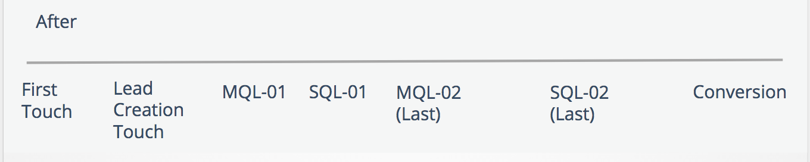

# 부메랑 스테이지 및 터치포인트 {#boomerang-stages-and-touchpoints}

>[!AVAILABILITY]
>
>부메랑 기능은 계층 2 및 3 고객에게만 활성화됩니다. 더 높은 계정 계층을 요청하려면 Adobe 계정 팀(계정 관리자)에 문의하십시오.

[!DNL Marketo Measure]이(가) 부메랑 단계 기능을 릴리스했습니다! 영업 주기가 긴 [!DNL Marketo Measure] 고객의 여정에 대한 가시성을 높이기 위해 부메랑 단계 기능을 만들었습니다. 이 기능을 사용하면 마케터는 연락처 MQL을 이동한 다음 SAL로 이동한 다음 MQL 단계로 되돌리는 경우와 같이 영업 기회 여정에서 발생하는 모든 단계 전환에 대한 터치포인트를 만들 수 있습니다. 연락처가 &quot;MQL 스테이지로 다시 시작&quot; 또는 &quot;MQL을 다시 시작&quot;할 때 MQL은 부메랑 스테이지로 간주됩니다. 부메랑 단계 기능은 [!DNL Marketo Measure] 사용자 지정 단계와 함께 작동합니다.

## 이 기능의 기능 {#what-this-feature-does}

* 영업 기회의 여정에서 발생하는 모든 단계 전환에 대한 &quot;부메랑&quot; 터치포인트를 만듭니다.
* 사용자 지정 단계(예: 연락처 MQL인 경우 SAL로 이동한 다음 MQL 단계로 돌아갑니다.)
* Opportunity에 포함할 Stage 전환 횟수 및 세트 (예: 처음 10개 MQL 또는 마지막 5개 MQL)
* 사용자 지정 모델 사용자인 경우 이러한 각 단계에 할당할 속성 가중치 및 퍼센트 크레딧을 결정할 수 있습니다(예: 첫 번째 또는 마지막 MQL 발생에 속성 가중치를 지정하거나 모든 발생 간에 속성 가중치를 균등하게 분배)

>[!NOTE]
>
>[부메랑 단계를 설정하는 방법에 대한 지침](/help/advanced-marketo-measure-features/boomerang/setting-up-boomerang-stages.md).

## CRM에서 표시되는 부메랑 단계 및 터치포인트 {#what-boomerang-stages-and-touchpoints-look-like-in-your-crm}

부메랑 단계(&quot;이전&quot;)가 없으면 리드/연락처 레코드와 연결된 가장 최근 MQL 또는 가장 최근 SQL 터치포인트만 표시됩니다.

부메랑 단계 및 터치포인트를 사용하면 각 단계 전환에 대해 발생하는 터치포인트를 볼 수 있습니다. 이러한 부메랑 접점에 대한 명명 규칙은 다음과 같습니다.

**[단계 이름]-00.**

아래 예를 사용하여 이 [!DNL Marketo Measure] 계정은 부메랑 단계에 MQL 및 SQL을 포함했으며 단계당 2개의 부메랑 터치포인트를 표시하도록 선택했습니다.

**MQL-01**&#x200B;은(는) 첫 번째 MQL 단계 전환입니다.

접점 위치에서의 숫자 값은 스테이지 전이가 발생한 순서를 나타낸다. 마지막 부메랑 터치포인트는 다음과 같이 스탬프됩니다.

MQL-02 **(마지막)**

## 부메랑 단계가 기존 데이터를 변경하는 방법 {#how-boomerang-stages-change-your-existing-data}

부메랑 단계 영향:

채널별 **기여도 분석**

* [!DNL Boomerang Stages]이(가) 더 많은 터치포인트를 만들기 때문에 현재 데이터에 있는 터치포인트 간에 속성이 배포되는 방식이 변경됩니다. 그 결과, 이는 마케팅 채널 간에 수익 가치가 변동함을 의미할 수 있다. [!DNL Boomerang stages]을(를) 구현하기 전에 이 점을 고려하거나 자세한 내용은 계정 관리자에게 문의하십시오.

**&quot;equals [Touchpoint Position]&quot;을(를) 사용하는 모든 보고서**

* 부메랑 단계에서는 데이터에 새로운 터치포인트 위치를 도입합니다. [!DNL Marketo Measure]이(가) &quot;MQL-01&quot; 또는 &quot;MQL-05(마지막)&quot;와 같은 단계의 발생을 포함하도록 터치포인트 위치의 형식을 변경하고 있습니다. 이 예를 사용하면 부메랑 단계는 &quot;터치포인트 위치가 MQL과 같음&quot;을 사용하는 모든 보고서에 영향을 줍니다. 이러한 보고서를 조정하려면 필터가 대신 &quot;포함&quot; 연산자를 사용해야 합니다.

## FAQ {#faq}

**기여도 분석 모델에 몇 개의 부메랑 단계를 포함할 수 있습니까?**

최대 15개의 단계를 선택할 수 있습니다.

**Q: 단계당 몇 개의 &quot;boomerang&quot; 터치포인트를 사용할 수 있습니까?**

단계당 최대 10개의 부메랑 터치포인트를 선택할 수 있습니다.

**Q: 단계당 10개의 부메랑이 제한되는 이유는 무엇입니까?**

[!DNL Marketo Measure]은(는) 처리 시간을 제어하려면 단계 수를 제한해야 합니다. 기여도 분석 모델에 15개의 부메랑 단계를 모두 포함하고 단계당 10개의 부메랑 터치포인트를 포함하도록 선택하는 경우 리드/연락처 레코드당 150개 이상의 터치포인트를 보유할 수 있습니다.

**Q: Data Warehouse이 있습니다. 데이터를 모두 가져옵니까, 아니면 부메랑 단계 상한도 적용됩니까?**

[!DNL Marketo Measure]에 설정된 처리 제한으로 인해 Data Warehouse 및 CRM에 이 상한이 적용됩니다. Data Warehouse 역시 한 단계당 10개의 터치포인트가 제한되는 것을 보게 된다.

**Q: 사용자 지정 모델링으로 부메랑 단계를 사용하면 어떤 이점이 있습니까?**

사용자 지정 모델링과 함께 [!UICONTROL Boomerang] 단계를 사용하면 [!UICONTROL Boomerang] 접점에 속성 가중치를 할당하여 이 단계에 매출 크레딧을 할당할 수 있습니다.

사용자 지정 모델링 없이 [!DNL Marketo Measure]은(는) 각 부메랑 및 단계 전환에 대한 접점을 만들지만 이러한 접점에 속성 크레딧을 할당하지 않습니다. 속성 크레딧을 받는 유일한 부메랑 터치포인트는 제출 터치포인트에서 가져옵니다. 사용자 지정 모델이 없으면 [!DNL Boomerang] 접점은 &#39;중간 터치&#39;와 동일한 것으로 간주되며 그에 따라 속성 크레딧을 받습니다.
