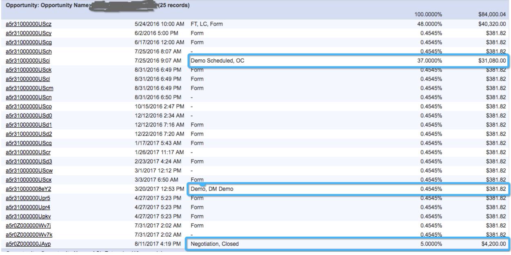

# 사용자 지정 속성 모델 및 설정 {#custom-attribution-model-and-setup}

에 대한 개요를 알려면 아래를 참조하십시오. [!DNL Marketo Measure] 사용자 지정 속성 모델 및 설정 방법.

## 사용자 지정 속성 모델 {#custom-attribution-model}

다음 [!DNL Marketo Measure] 사용자 지정 속성 모델을 사용하면 모델에 포함할 터치포인트 또는 사용자 지정 단계를 선택할 수 있습니다. 사용자는 이러한 터치포인트 및 단계에 속하는 매출 크레딧의 비율을 제어하거나, [!DNL Marketo Measure] 기계 학습 모델.

## 사용자 지정 속성 모델을 설정하는 방법 {#how-to-set-up-your-custom-attribution-model}

1. 사용자 지정 모델에 포함할 단계를 결정합니다.

   사용자 지정 속성 모델 작성을 시작하려면 마케팅 팀에 중요한 단계를 선택해야 합니다. 추가 [!DNL Marketo Measure] 이정표 단계(FT, LC, OC, Closed) 사용자 정의 모델에 최대 6개의 리드/연락처 상태 또는 영업 기회 단계를 추가할 수 있습니다. 예를 들어 MQL 단계가 사용자 지정 모델에 포함되는 것이 일반적입니다. 마케팅 팀은 MQL 단계로 전환을 유도하는 노력이나 채널을 알고 싶을 때가 있습니다.

   에 로그인 [experience.adobe.com/marketo-measure](https://experience.adobe.com/marketo-measure){target=&quot;_blank&quot;}. 이동 [!UICONTROL My Account] > [!UICONTROL Settings] > 및 CRM 섹션 아래에서 을 선택합니다. **[!UICONTROL Stage Mapping]**.

   여기에서, **[!UICONTROL Include in Model]** 상자.

   >[!NOTE]
   >
   >최대 6개의 사용자 지정 단계(기본값을 포함하지 않음)가 허용됩니다. FT, LC, OC, 닫힘).

   

   >[!NOTE]
   >
   >_모두_ Lead/Contact 및 Opportunity 단계는 Stage가 비활성 상태이거나 더 이상 사용되지 않는 경우에도 여기에 나타납니다 [!DNL Salesforce]. 이러한 단계를 제거하려면 [!DNL Salesforce].

   단계를 선택한 경우 **[!UICONTROL Save & Process]** 단추 를 클릭합니다. 이제 단계가 **[!UICONTROL Attribution Settings]** 탭하면 각 단계에 속성 백분율을 할당할 수 있습니다. 사용자 지정 단계는 Marketing Performance Suite에 수요 워터폴 내의 리드 또는 기회 단계로 표시됩니다.

   모델에 포함할 다른 단계가 있지만 [!UICONTROL Lead/Contact Status] 또는 [!UICONTROL Opportunity Stage] 목록을 만들 때 CRM의 필드를 기반으로 하여 고유한 사용자 지정 단계를 정의할 수 있습니다.

   아래 예에서는 사용자 지정 &quot;MQL&quot; 단계가 날짜 필드를 사용하여 정의됩니다. 이 규칙은 MQL 날짜 필드가 비어 있지 않으면 MQL로 간주하여 사용자 지정 모델에 포함해야 한다고 명시합니다. 또한 사용자 지정 단계를 만든 후 판매 주기의 진행 상황을 따르도록 정렬하는 것이 중요합니다.

   

   >[!CAUTION]
   >
   >사용자 지정 필드에 대한 기록 추적을 활성화하는 것을 잊지 마십시오.

사용자 지정 모델에서 사용자 지정 필드를 사용하는 경우 CRM에서 필드 내역 추적을 활성화해야 합니다. 필드 기록 추적을 활성화하는 방법에 대한 지침은 [여기를 클릭하세요.](/help/advanced-marketo-measure-features/custom-attribution-models/custom-model-setup-enable-field-history-tracking.md).

1. 사용자 지정 모델에 대한 속성 백분율을 결정합니다.

   로 이동합니다. **[!UICONTROL Attribution Settings]** in [!DNL Marketo Measure] 앱; 사용자 지정 단계는 속성 테이블에 여기에 표시됩니다. 속성 테이블에는 [!DNL Marketo Measure] 속성 모델 및 각 모델의 속성 가중치입니다. 처음 5개 모델의 속성 비율은 고정되어 있으므로 변경할 수 없습니다.

   맨 오른쪽 열에서 &quot;**[!UICONTROL Custom]**,&quot;사용자 지정 속성 모델에서 각 단계에 대한 비율 가중치를 설정할 수 있습니다. 사용자 지정 열 아래에 각 단계의 값을 입력하면 됩니다. Then **[!UICONTROL Save and Reprocess]** 완료되면 됩니다.

   &quot;사용자 지정&quot; 열의 왼쪽에는 **[!DNL Marketo Measure]기계 학습 모델**. 기계 학습 모델은 각 사용자 지정 단계에서 발생한 사항에 따라 거래를 성사시키기 위한 상대적 중요도에 따라 속성 가중치를 계산합니다. 기계 학습 모델에 대한 자세한 내용은 [여기를 클릭하세요.](/help/advanced-marketo-measure-features/custom-attribution-models/machine-learning-model-faq.md).

   

## 터치포인트 위치 {#touchpoint-positions}

속성 백분율이 저장 및 처리되면, 터치포인트가 업데이트되고 새로운 단계 및 위치를 받습니다. 단계 전환 전에 가장 최근에 발생한 터치포인트는 해당 단계에 대한 크레딧을 받습니다(아래 표시). 사용자 지정 가중치와 수입도 다시 배포됩니다.

## 단계 단계와 사용자 지정 모델 단계 간의 차이점 {#the-difference-between-funnel-stages-and-custom-model-stages}

이제 사용자 지정 모델이 활성화되지 않았더라도 마케팅 단계에서 사용자 지정 단계를 볼 수 있습니다. 단계 단계 단계 기능을 사용하면 됩니다. 단계 단계에서는 단계에 단계를 추가할 수 있지만 이에 대한 속성은 볼 수 없습니다.

단계 단계는 여전히 터치포인트로 추적되고 CRM에서 터치 포인트 위치로 표시됩니다. 사용자 지정 모델이 없으면 이러한 터치포인트는 양식 채우기(중간 터치의 경우 10%)가 있어도 웹 방문일 경우 속성 크레딧이 없는 경우 중간 터치 속성을 받을 수 있습니다.

아래에서 볼 수 있듯이 Dell은 단계 단계 단계 외에도 실사 단계를 포함했습니다. 즉, 이 위치에는 실사가 포함되어 있는 터치포인트가 있지만, 사용자 지정 모델이 활성화되지 않은 경우(최대 10%) 중간 터치 속성 크레딧만 받습니다.

>[!NOTE]
>
>BAT 사용자 정의 모델의 동작은 중간 터치가 없는 경우 다른 단계에서 사용자 정의 모델 중간 터치 비율을 균등하게 나누는 것입니다.
