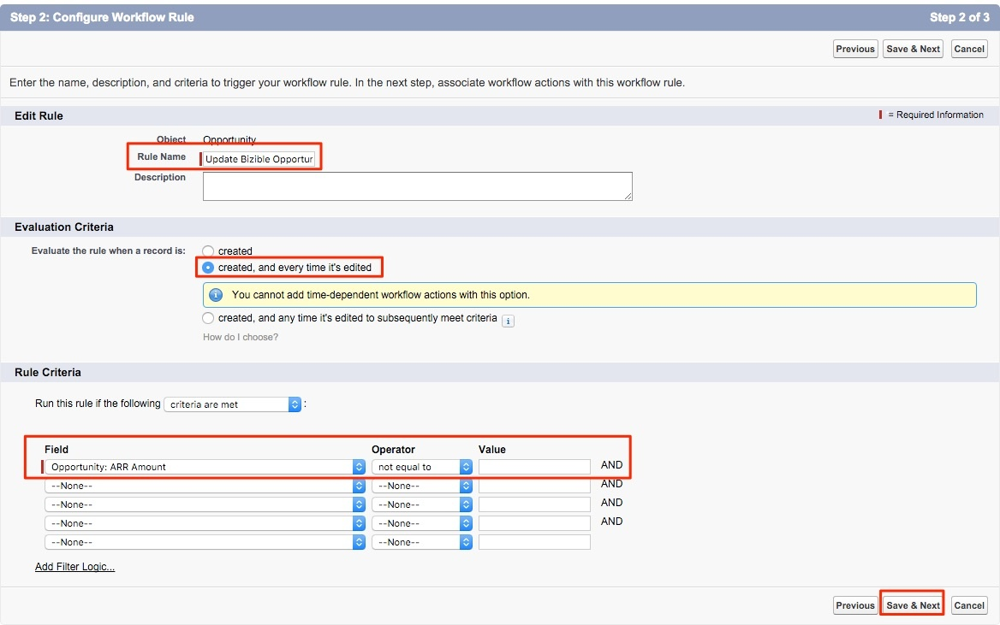

# 사용자 지정 수익 금액 필드 사용 {#using-a-custom-revenue-amount-field}

기본적으로 구매자 속성 터치포인트는 다음 두 필드 중 하나에서 기회 금액을 가져옵니다.

* 금액(SFDC 기본값)
* [!DNL Marketo Measure] 영업 기회 금액(사용자 정의)

Opportunity에서 사용자 지정 금액 필드를 사용하는 경우 Buyer Touchpoint Revenue를 계산하기 위해 워크플로우를 구성해야 합니다. 이것은 [!DNL Salesforce], 따라서 SFDC 관리자의 지원이 필요할 수 있습니다.

먼저 다음 정보가 필요합니다.

* 금액 필드의 API 이름

여기에서 워크플로우 만들기를 시작합니다.

1. 다음으로 이동 **[!UICONTROL Setup]** > **[!UICONTROL Create]** > **[!UICONTROL Workflow & Approvals]** > **[!UICONTROL Workflow Rules]**.

   

1. 선택 **[!UICONTROL New Rule]**&#x200B;를 클릭하고 객체를 &quot;Opportunity&quot;로 설정한 다음 **[!UICONTROL Next]**.

   

   

1. 워크플로우를 구성합니다. 규칙 이름을 &quot;Update&quot;로 설정합니다. [!DNL Marketo Measure] 기회 금액.&quot; 평가 기준을 &quot;작성됨&quot;으로 설정하고 편집할 때마다 설정합니다. 규칙 기준에 대해 사용자 지정 금액 필드를 선택하고 연산자를 선택합니다 [!UICONTROL as "Not Equal To"] &quot;값&quot; 필드를 비워 둡니다.

   

1. 워크플로우 작업을 추가합니다. 이 선택 목록을 &quot;[!UICONTROL New Field Update].&quot;

   

1. 여기 필드 정보를 기입해 드리겠습니다. &quot;이름&quot; 필드에서 다음 이름을 사용하는 것이 좋습니다. &quot;[!DNL Marketo Measure] Opp 금액.&quot; &quot;고유 이름&quot;은 &quot;이름&quot; 필드를 기반으로 자동으로 채워집니다. &quot;업데이트할 필드&quot; 선택 목록에서 &quot;[!DNL Marketo Measure] 기회 금액.&quot; 필드를 선택한 후 &quot;필드 변경 후 워크플로우 규칙 재계산&quot; 상자를 선택합니다. &quot;새 필드 값 지정&quot;에서 &quot;공식을 사용하여 새 값을 설정합니다&quot;를 선택합니다. 빈 상자에서 사용자 지정 금액 필드의 API 이름을 삭제합니다. 클릭 **[!UICONTROL Save]**.

   

1. 워크플로우에 대한 롤업 페이지로 이동되며 &quot;활성화&quot;를 확인하면 됩니다. 활성화하려면 를 클릭합니다. **편집** 새 워크플로우 옆의 를 클릭한 다음 **활성화**.

   이러한 단계를 완료하면 워크플로우를 트리거하여 의 새 값을 갖도록 기회를 업데이트해야 합니다 [!UICONTROL custom opportunity] 필드.

   SFDC 내에서 Data Loader를 통해 영업 기회를 실행하여 이를 수행할 수 있습니다. 에서 데이터 로더 사용에 대한 자세한 내용을 확인하십시오. [이 문서](/help/advanced-marketo-measure-features/custom-revenue-amount/using-data-loader-to-update-marketo-measure-custom-amount-field.md).

이 과정에서 질문이 있는 경우 고객 성공 관리자에게 문의하거나 [[!DNL Marketo] 지원](https://nation.marketo.com/t5/support/ct-p/Support){target=&quot;_blank&quot;}.
