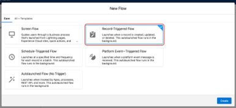

# 사용자 정의 수익 금액 필드 사용 {#using-a-custom-revenue-amount-field}

기본적으로 구매자 속성 터치포인트는 다음 두 필드 중 하나에서 기회 금액을 가져옵니다.

* 금액(SFDC 기본값)
* [!DNL Marketo Measure] 영업 기회 금액(사용자 지정)

기회에서 사용자 정의 금액 필드를 사용하는 경우 Buyer Touchpoint 매출을 계산하기 위해 워크플로우를 구성해야 합니다. 이 작업에는 [!DNL Salesforce]에 대한 고급 지식이 필요하므로 SFDC 관리자의 도움이 필요할 수 있습니다.

시작하려면 다음 정보가 필요합니다.

* 금액 필드의 API 이름

여기부터 워크플로우 만들기를 시작합니다.

## Salesforce Lightning에서 워크플로우 만들기 {#create-the-workflow-in-salesforce-lightning}

다음 단계는 Salesforce Lightning 사용자를 위한 것입니다. 여전히 Salesforce Classic을 사용하는 경우 [ 단계는 아래에 나열됩니다](#create-the-workflow-in-salesforce-classic).

1. 설정에서 [빠른 찾기] 상자에 &quot;흐름&quot;을 입력하고 **[!UICONTROL Flows]**&#x200B;을(를) 선택하여 흐름 빌더를 시작합니다. 오른쪽 패널에서 **[!UICONTROL New Flow]** 단추를 클릭합니다.

   

1. **[!UICONTROL Record-Triggered Flow]**&#x200B;을(를) 선택하고 오른쪽 하단의 **[!UICONTROL Create]**&#x200B;을(를) 클릭합니다.

   

1. Configure Start 창에서 Opportunity 객체를 선택합니다. [!UICONTROL Configure Trigger] 섹션에서 **[!UICONTROL A record is created or updated]**&#x200B;을(를) 선택합니다.

   

1. 시작 조건 설정 섹션의 [!UICONTROL Condition Requirements]에서 **[!UICONTROL Custom Condition Logic Is Met]**&#x200B;을(를) 선택합니다.
   * 검색 필드에서 사용자 정의 금액 필드를 선택합니다.
   * 연산자를 **Is Null**(으)로 설정하고 값을 **[!UICONTROL False]**(으)로 설정합니다.
   * 평가 기준을 **[!UICONTROL Every time a record is updated and meets the condition requirements]**(으)로 설정합니다.

   

1. &quot;다음에 대한 흐름 최적화&quot; 섹션에서 **[!UICONTROL Fast Field Updates]**&#x200B;을(를) 선택합니다. 오른쪽 하단의 **[!UICONTROL Done]**&#x200B;을(를) 클릭합니다.

   

1. 요소를 추가하려면 더하기(+) 아이콘을 클릭하고 **[!UICONTROL Update Triggering Record]**&#x200B;을(를) 선택합니다.

   

1. 신규 레코드 갱신 창에서 다음을 입력합니다.

   * 레이블 입력 - API 이름이 자동으로 생성됩니다.
   * 업데이트할 레코드를 찾고 값을 설정하는 방법 아래에서 **[!UICONTROL Use the opportunity record that triggered the flow]**&#x200B;을(를) 선택합니다.
   * &quot;[!UICONTROL Set Filter Conditions]&quot; 섹션에서 **[!UICONTROL Always Update Record]**&#x200B;을(를) 레코드 업데이트에 대한 조건 요구 사항으로 선택합니다.
   * &quot;[!UICONTROL Set Field Values for the Campaign Record]&quot;의 필드에서 Marketo Measure 영업 기회 금액(**bizible2__Bizible_Opportunity_Amount__c**) 및 from 값을 선택합니다. 그런 다음 사용자 정의 금액 필드를 선택합니다.
   * **[!UICONTROL Done]**&#x200B;을(를) 클릭합니다.

   

1. **[!UICONTROL Save]**&#x200B;을(를) 클릭합니다. 팝업이 나타납니다. 흐름 저장 창에 &quot;흐름 레이블&quot;을 입력합니다(흐름 API 이름이 자동으로 생성됨). **[!UICONTROL Save]**&#x200B;을(를) 다시 클릭합니다.

   

1. 흐름을 활성화하려면 **[!UICONTROL Activate]** 단추를 클릭하십시오.

   

## Salesforce Classic에서 워크플로우 만들기 {#create-the-workflow-in-salesforce-classic}

다음 단계는 Salesforce Classic 사용자를 위한 것입니다. Salesforce Lightning으로 전환한 경우 [ 단계는 위에서 찾을 수 있습니다](#create-the-workflow-in-salesforce-lightning).

1. **[!UICONTROL Setup]** > **[!UICONTROL Create]** > **[!UICONTROL Workflow & Approvals]** > **[!UICONTROL Workflow Rules]**(으)로 이동합니다.

   

1. **[!UICONTROL New Rule]**&#x200B;을(를) 선택하고 개체를 &quot;Opportunity&quot;로 설정한 다음 **[!UICONTROL Next]**&#x200B;을(를) 클릭합니다.

   

   

1. 워크플로우를 구성합니다. 규칙 이름을 &quot;Update [!DNL Marketo Measure] Opportunity Amount&quot;로 설정합니다. 평가 기준을 &quot;만들어짐, 편집할 때마다&quot;로 설정합니다. 규칙 기준에 대해 사용자 지정 금액 필드를 선택하고 연산자 [!UICONTROL as "Not Equal To"]을(를) 선택한 후 &quot;값&quot; 필드를 비워 둡니다.

   

1. 워크플로우 작업을 추가합니다. 이 선택 목록을 &quot;[!UICONTROL New Field Update]&quot;(으)로 설정합니다.
   

1. 여기에서 필드 정보를 입력합니다. &quot;이름&quot; 필드에서는 &quot;[!DNL Marketo Measure] Opp 금액&quot; 이름을 사용하는 것이 좋습니다. &quot;고유 이름&quot;은 &quot;이름&quot; 필드를 기반으로 자동으로 채워집니다. &quot;업데이트할 필드&quot; 선택 목록에서 &quot;[!DNL Marketo Measure] 영업 기회 금액&quot;을 선택합니다. 필드를 선택한 후 &quot;필드 변경 후 워크플로우 규칙 재평가&quot; 상자를 선택합니다. &quot;새 필드 값 지정&quot;에서 &quot;새 값을 설정하려면 수식 사용&quot;을 선택합니다. 빈 상자에 사용자 정의 금액 필드의 API 이름을 놓습니다. **[!UICONTROL Save]**&#x200B;을(를) 클릭합니다.

   

1. 워크플로우의 롤업 페이지로 돌아가서, &quot;활성화&quot;해야 합니다. 계속하셔도 좋습니다. 활성화하려면 새 워크플로우 옆에 있는 **[!UICONTROL Edit]**&#x200B;을(를) 클릭한 다음 **[!UICONTROL Activate]**&#x200B;을(를) 클릭합니다.

   이 단계를 완료하면 [!UICONTROL custom opportunity] 필드의 새 값을 갖도록 워크플로우를 트리거하기 위해 기회를 업데이트해야 합니다.

   SFDC 내의 데이터 로더를 통해 기회를 실행하여 이를 달성할 수 있습니다. [이 문서](/help/advanced-marketo-measure-features/custom-revenue-amount/using-data-loader-to-update-marketo-measure-custom-amount-field.md)에서 데이터 로더를 사용하는 방법에 대한 자세한 내용을 확인하세요.

질문이 있는 경우 주저하지 말고 Adobe 계정 팀(계정 관리자) 또는 [[!DNL Marketo] 지원](https://nation.marketo.com/t5/support/ct-p/Support){target="_blank"}에 문의하세요.
