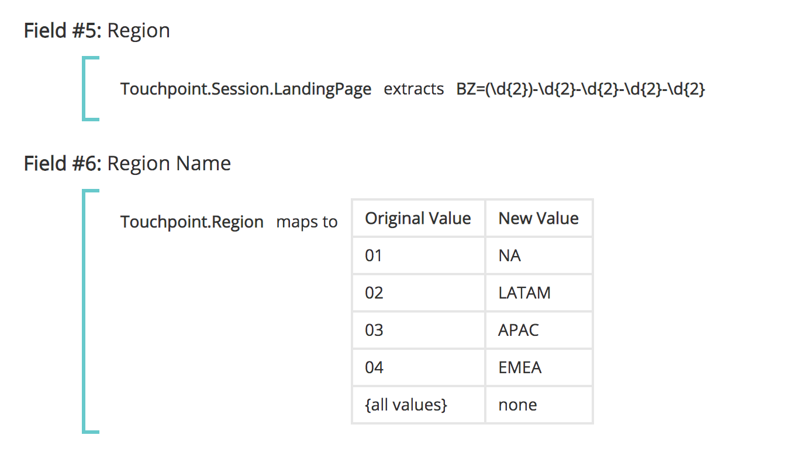
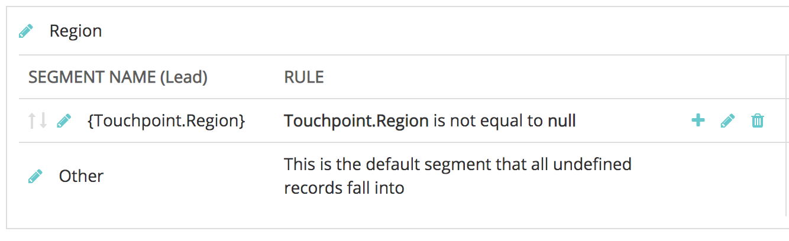

# 접점 필드 {#touchpoint-fields}

지금까지 고객이 [!DNL Marketo Measure]을(를) 사용하여 온보딩하고 직접 태그 지정 통합이 없는 경우 고객 성공 팀은 올바른 UTM 형식을 활용하고 광고를 해결할 수 있도록 고객에게 랜딩 페이지에 적절한 태그 지정 방법을 교육했습니다. 이러한 고객 중 일부는 UTM을 사용하지 않고 자체 태그 지정 매개 변수를 사용하므로, [!DNL Marketo Measure]에서 시행하는 새로운 태그 지정 구조로 모든 광고 네트워크에서 모든 랜딩 페이지를 편집하는 데 시간이 많이 걸릴 수 있습니다. 이제 태그 지정 구조에 적응하기 위해 규칙 정의와 함께 매핑할 수 있는 사용자 지정 매개 변수를 허용합니다. 목표는 고객이 사용자 지정 추적 매개 변수를 사용하는 데 적응하여 URL 구조를 변경할 필요가 없도록 하는 것입니다.

>[!AVAILABILITY]
>
>이제 계층 2 및 계층 3에서 전체 세분화를 통해 사용할 수 있습니다.

>[!NOTE]
>
>이 기능은 고급 기능이며 Professional Services에서만 설정해야 합니다.

## 기능 활성화 {#enabling-the-feature}

[!DNL Marketo Measure] 설정 메뉴에서 터치포인트 필드 페이지로 이동합니다. 여기에서 **계산된 필드 사용**&#x200B;에서 **예**&#x200B;를 선택하여 기능을 사용할 수 있습니다. 이 기능이 활성화되면 터치포인트 필드를 만들 수 있습니다.

## 방법 {#how-to}

계산된 필드를 만들려면 추출, 매핑, 연결 등 사용자가 수행할 수 있는 세 가지 작업을 기억하십시오. 이를 계산된 필드를 정의하는 연산자라고도 합니다.

추출

[!UICONTROL extracts] 연산자는 캠페인 필드, 리드 필드 또는 고급 사용 사례의 경우 [랜딩 페이지에서 사용자 지정 매개 변수를 추출](https://docs.google.com/document/d/1NRViyCsXvPKbCTfGW32Yi2vWBjMDRF7bzkzKj9s2DDA/edit?ts=5e20b482#heading=h.xxwtissvw4){target="_blank"}과 같은 다른 위치의 필드에서 값을 가져옵니다. 그런 다음 터치포인트 필드에 배치합니다([예제에 매핑](https://docs.google.com/document/d/1NRViyCsXvPKbCTfGW32Yi2vWBjMDRF7bzkzKj9s2DDA/edit?ts=5e20b482#heading=h.xxwtissvw4){target="_blank"} #2 참조).

**예 #1**

연락처 campaign_source__c에는 고객이 보고 목적으로 터치포인트에 놓을 사용자 정의 필드가 있습니다. 규칙을 정의하여 &quot;Campaign Source&quot;라는 계산된 필드를 만들고 해당 필드에 값을 드롭할 수 있습니다.

목표: 보다 쉬운 보고를 위해 사용자 지정 필드의 값을 사용하여 터치포인트 오브젝트에 넣습니다.

* 계산된 필드를 만들고 &quot;Campaign Source&quot;로 레이블 지정
* Contact.Campaign_Source__c 필드 검색으로 시작하여 규칙을 정의합니다.
* 매개 변수에서 값을 추출해야 하므로 연산자 &quot;extracts&quot;를 사용합니다.
* 필드에서 전체 문자열을 추출하려면 &quot;(.&#42;)&quot; 식을 사용합니다.

   * **(**&#x200B;은(는) 추출 시작을 표시합니다.
   * **)**&#x200B;이(가) 추출 끝을 표시합니다.
   * **.&#42;**&#x200B;이(가) 전체 문자열을 추출하는 중임을 알려줍니다.

**예 #2**

이 기능을 통해 사용할 수 있는 일반적인 사용 사례는 URL 문자열의 사용자 지정 매개 변수에서 값을 가져오는 것입니다. 이 기능은 UTM 이외의 매개 변수를 사용하지만 터치포인트 필드에 대한 값을 구문 분석하려는 경우 유용합니다.

**링크:** `https://www.adobe.com/blog/marketing-revenue-reporting-overview?promo=5OFF` 또는 `https://www.adobe.com/blog/marketing-revenue-reporting-overview?promo=25OFF`.\
**목표:** &quot;할인 코드&quot;라는 사용자 지정 필드를 만들고 전달된 값이 무엇이든 &quot;5OFF&quot; 또는 &quot;25OFF&quot; 값을 드롭합니다.

* 계산된 필드를 만들고 &quot;할인 코드&quot;로 레이블 지정
* Touchpoint.Session.LandingPage 필드 검색으로 시작하여 규칙을 정의합니다.
* 매개 변수에서 값을 추출해야 하므로 연산자 &quot;extracts&quot;를 사용합니다.
* 프로모션 값을 추출하려면 값을 &quot;promo=(\w+)&quot;로 정의합니다.

   * **(**&#x200B;은(는) 추출 시작을 표시합니다.
   * **)**&#x200B;이(가) 추출 끝을 표시합니다.
   * **\w**&#x200B;은(는) 0-9를 포함하는 &quot;단어&quot;를 추출하고 있음을 알려줍니다.
   * **+**&#x200B;이(가) 문자 제한 없이 매개 변수의 전체 값을 추출합니다.
   * 백슬래시가 아닌 슬래시를 사용하고 있다는 점을 유의하십시오

**예 #3**

`https://www.adobe.com/blog/marketing-revenue-reporting-overview?cid=123456`과(와) 같은 추적 코드를 추출하는 유사한 예를 시도해 보겠습니다.

**목표:** 계산된 필드를 만들고 cid 매개 변수의 값으로 &quot;Adobe Campaign Id&quot;로 레이블을 지정합니다.

* 계산된 필드를 만들고 &quot;Adobe Campaign Id&quot;로 레이블 지정
* Touchpoint.Session.LandingPage 필드 검색으로 시작하여 규칙을 정의합니다.
* 매개 변수에서 값을 추출해야 하므로 연산자 &quot;extracts&quot;를 사용합니다.
* &quot;123456&quot; 값을 추출하려면 값을 &quot;cid=(\d{6})&quot;로 정의합니다.

   * **(**&#x200B;은(는) 추출 시작을 표시합니다.
   * **)**&#x200B;이(가) 추출 끝을 표시합니다.
   * **\d**&#x200B;이(가) &quot;숫자&quot;를 추출하고 있음을 알려줍니다.
   * **{6}**&#x200B;은(는) 추출 중인 문자 수입니다

**예 #4**

랜딩 페이지가 더 복잡해지고 추적 매개 변수가 여러 개 있으므로, 다음과 같이 여러 터치포인트 필드를 작성하고 값을 여러 번 추출해야 할 수 있습니다.
`https://www.adobe.com/blog/marketing-revenue-reporting-overview?trackID=123456&country=US&campaign_ID=7890`.

**목표:** 매개 변수의 해당 값을 사용하여 &quot;대상 국가&quot; 및 &quot;사용자 지정 캠페인 ID&quot;에 대한 계산된 필드를 여러 개 만듭니다.

* 계산된 필드를 만들고 &quot;대상 국가&quot;로 레이블 지정
* Touchpoint.Session.LandingPage 필드 검색으로 시작하여 규칙을 정의합니다.
* 매개 변수에서 값을 추출해야 하므로 연산자 &quot;extracts&quot;를 사용합니다.
* &quot;US&quot; 값을 추출하려면 값을 &quot;country=(\w{2})&quot;로 정의합니다.

   * **(**&#x200B;은(는) 추출 시작을 표시합니다.
   * **)**&#x200B;이(가) 추출 끝을 표시합니다.
   * **\w**&#x200B;은(는) &quot;단어&quot;를 추출하고 있음을 알려줍니다.
   * **{2}**&#x200B;은(는) 추출 중인 문자 수입니다

* 계산된 필드를 만들고 &quot;사용자 지정 캠페인 ID&quot;로 레이블 지정
* Touchpoint.Session.LandingPage 필드 검색으로 시작하여 규칙을 정의합니다.
* 매개 변수에서 값을 추출해야 하므로 연산자 &quot;extracts&quot;를 사용합니다.
* &quot;123456&quot; 값을 추출하려면 값을 &quot;campaign_ID=(\d{6})&quot;로 정의합니다.

   * **(**&#x200B;은(는) 추출 시작을 표시합니다.
   * **)**&#x200B;이(가) 추출 끝을 표시합니다.
   * **\d**&#x200B;이(가) &quot;숫자&quot;를 추출하고 있음을 알려줍니다.
   * **{6}**&#x200B;은(는) 추출 중인 문자 수입니다

**다음에 매핑**

[!UICONTROL maps to] 연산자는 다른 값으로 변환하거나 그룹화해야 하는 값 테이블을 만듭니다. 일반적으로 이는 코드가 친숙한 이름을 나타내고 해당 친숙한 이름에 매핑되어야 하는 키 값 형식을 취합니다.

**예 #1**

여러 채널에서 실행되는 &quot;여름 종료 프로모션&quot;과 &quot;블랙 프라이데이 프로모션&quot;을 위해 만든 캠페인이 있습니다. &quot;이니셔티브&quot;라는 계산된 필드를 만들고 &quot;여름 홍보 종료&quot; 또는 &quot;블랙 프라이데이 홍보&quot;가 있는 터치포인트를 다른 가능한 값 외에 &quot;프로모션&quot;과 같은 이니셔티브 값에 매핑하려고 합니다.

**예 #2**

이제 를 추출하고 필드에 매핑하는 방법에 대해 알아보았으므로, 먼저 매개 변수에서 값을 추출한 다음 좀 더 의미가 있는 친숙한 이름으로 매핑하기 위해 이러한 작업을 결합해 보겠습니다. 이제 랜딩 페이지 `https://www.adobe.com/blog/marketing-revenue-reporting-overview?BZ=04-01-09-03-10`부터 시작하겠습니다.

**목표:** 계산된 필드를 여러 개 만듭니다. 첫 번째 숫자는 지역에, 두 번째 숫자는 제품에, 세 번째 숫자는 이니셔티브에, 네 번째 숫자는 담당자에게, 다섯 번째 숫자는 미디어 플랫폼에 매핑됩니다. 그런 다음 숫자 값을 &quot;친숙한 이름&quot;에 매핑합니다.

* 계산된 필드를 만들고 &quot;지역&quot;으로 레이블 지정
* Touchpoint.Session.LandingPage 필드 검색으로 시작하여 규칙을 정의합니다.
* 매개 변수에서 값을 가져와야 하므로 연산자 &quot;[!UICONTROL extracts]&quot;을(를) 사용합니다.
* &quot;04&quot; 값을 추출하려면 값을 &quot;BZ=(\d{2})-\d{2}-\d{2}-\d{2}-\d{2}&quot;로 정의합니다.

   * **(**&#x200B;은(는) 추출 시작을 표시합니다.

      * 4만 추출하므로 앞 자리 숫자에만 여는 괄호가 있다
   * **)**&#x200B;이(가) 추출 끝을 표시합니다.

      * 우리는 4만 추출하므로 앞 숫자에만 닫힌 괄호가 있다
   * **\d**&#x200B;이(가) &quot;숫자&quot;를 추출하고 있음을 알려줍니다.
   * **{2}**&#x200B;은(는) 추출 중인 문자 수입니다

* [!UICONTROL Save]을(를) 클릭합니다. 새 필드를 다음 규칙에 사용할 수 있으려면 먼저 저장해야 합니다!
* 다음으로, 우리는 첫 숫자에 대해 가능한 모든 값을 친숙한 이름에 매핑하려고 한다
* 계산된 필드를 만들고 &quot;Region_Name&quot; 레이블을 지정합니다.
* 추출된 필드 검색부터 시작하여 규칙을 정의합니다. 이 경우 [!DNL Touchpoint.Region]
* 각 숫자에 대한 매핑을 해당 값에 만들려면 &quot;[!UICONTROL maps to]&quot; 연산자를 사용하십시오.
* 각 매핑을 나열하는 테이블이 표시됩니다. 결국 다음과 같이 표시됩니다.
* 위의 매핑 및 URL에 따라 이 랜딩 페이지가 있는 터치포인트에 대한 &quot;Region_Value&quot;는 &quot;EMEA&quot;가 됩니다.
* 나머지 4자리 숫자 세트에 대해 추출과 매핑을 반복합니다

   * 01을 추출하려면 값을 &quot;BZ=\d{2}-**(\d{2})**-\d{2}-\d{2}-\d{2}&quot;로 정의합니다.
   * 09를 추출하려면 값을 &quot;BZ=\d{2}-\d{2}-**(\d{2})**-\d{2}-\d{2}&quot;로 정의합니다.
   * 03을 추출하려면 값을 &quot;BZ=\d{2}-\d{2}-\d{2}-**(\d{2})**-\d{2}&quot;로 정의합니다.
   * 10을 추출하려면 값을 &quot;BZ=\d{2}-\d{2}-\d{2}-\d{2}-**(\d{2})**&quot;로 정의합니다.

**연결**

[!UICONTROL concatenates] 연산자는 여러 필드의 값을 단일 필드로 결합합니다. 이 메서드는 을 만들기 위해 다양한 필드에 데이터를 가져오는 사용자 지정 값을 만드는 데 유용합니다

**예 #1**

Segment__c 및 Grade__c에 대한 Opportunity 객체에는 보고 목적으로 터치포인트 객체의 단일 필드로 결합하려는 별도의 필드가 있습니다. 필드를 연결하면 Enterprise_A 또는 Mid-Market_B와 같은 값이 표시됩니다.

## 접점 필드 및 세그먼트 {#touchpoint-fields-and-segments}

이제 URL의 값이 구문 분석되어 터치포인트에 있으므로 세그먼트 생성 또는 터치포인트 삭제 규칙 정의와 같이 터치포인트 필드가 사용되는 곳마다 새 필드가 표시됩니다.

이 제품 릴리스에서는 접점 필드를 사용하여 세그먼트를 만드는 기능을 사용할 수 있습니다. 이전에 접점 필드로 세그먼트를 작성할 수 없습니다.

세그먼트를 더 쉽게 작성할 수 있도록 이제 생성된 터치포인트 필드에서 동적 세그먼트를 만들 수 있습니다. 예를 들어, 가능한 각 지역에 대한 세그먼트를 만들지 않고 지리적 지역을 구문 분석한 터치포인트 필드를 만든 경우 하나의 세그먼트를 설정할 수 있으며 모든 인스턴스에 대해 새 값이 표시되는 세그먼트를 만듭니다. 우편 번호와 같은 속성을 구문 분석하여 세그먼트로 사용해야 할 경우 매우 유용합니다.

설치 프로그램은 아래 스크린샷과 비슷합니다. 세그먼트 이름 은 중괄호를 사용하여 터치포인트 필드 값을 동적으로 가져와서 필드를 검색합니다.

규칙은 동일한 접점 필드를 참조하고 &quot;null과 같지 않음&quot;인 값을 검색합니다.

## FAQ {#faq}

**만들 수 있는 터치포인트 필드 수가 최대 한도에 도달했습니다.**

필드는 100개로 제한됩니다.

**선택 목록에 방금 만든 새 터치포인트 필드가 표시되지 않습니다. 위치는 어디입니까?**

규칙을 만든 후 저장하는 것을 잊지 마십시오. 새 필드가 표시되지 않으면 저장했는지 확인하십시오. 새 필드를 다음 규칙에 사용할 수 있으려면 먼저 저장해야 합니다.

>[!NOTE]
>
>복잡성 수준으로 인해 &quot;다음으로 매핑&quot; 연산자를 사용하는 터치포인트 필드는 다른 터치포인트 필드에서 사용할 수 없습니다.

**하나의 랜딩 페이지에서 여러 매개 변수를 추출하는 데 어떤 식을 사용합니까?**

추출 예 #4와 마찬가지로 여러 필드를 만들어 각 매개 변수를 추출해야 합니다. 따라서 5개의 서로 다른 값이 있는 경우 5개의 터치포인트 필드를 만들어 각 값을 추출하게 됩니다.

**[!DNL Marketo Measure] 스키마에 새 필드가 표시되지 않는 이유는 무엇입니까?**

[!DNL Marketo Measure] Data Warehouse 스키마의 새 필드를 표시하는 데 추가 작업이 필요합니다. 현재 설정 및 구성을 통해 필드가 노출되므로 터치포인트 필드를 사용하여 세그먼트를 작성하거나 터치포인트 삭제 규칙을 만들 수 있습니다.

**추출 식이 유효하고 올바른 값을 가져오는지 확인하려면 어떻게 해야 합니까?**

식을 실행하고 테스트할 수 있는 온라인 도구([[!DNL https]://regex101.com/](https://regex101.com/){target="_blank"})가 있습니다. 표현식이 유효하면 녹색, 유효하지 않으면 빨간색으로 표시됩니다. 또한 오른쪽 상단의 [!UICONTROL explanation] 상자는 유용하며 추출 중인 내용을 알려줍니다.

