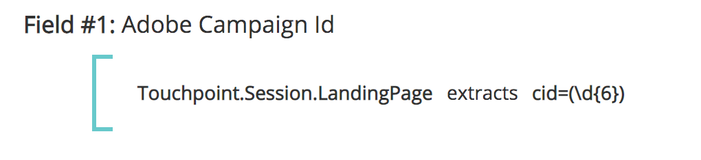

# 터치 포인트 필드 {#touchpoint-fields}

이전에 고객이 [!DNL Marketo Measure] 또한 직접 태그 지정 통합이 없는 경우 고객 성공 팀은 올바른 UTM 형식을 활용하도록 랜딩 페이지에 적절히 태그를 지정하는 방법을 고객에게 교육하여 광고를 해결할 수 있습니다. 이러한 고객 중 일부는 UTM을 사용하지 않고 고유한 태깅 매개 변수를 사용합니다. 즉, 새로운 태깅 구조를 사용하여 모든 광고 네트워크에서 모든 랜딩 페이지를 편집하는 것은 시간이 많이 걸릴 수 있습니다 [!DNL Marketo Measure] 강제 적용. 이제 태깅 구조에 적응하기 위해 규칙 정의와 함께 매핑할 수 있는 사용자 지정 매개 변수를 수락합니다. 목표는 고객이 사용자 지정 추적 매개 변수를 사용하여 URL 구조를 변경할 필요가 없도록 조정하는 것입니다.

>[!AVAILABILITY]
>
>Tier 2 및 Tier 3의 전체 세그먼테이션과 함께 제공됩니다.

>[!NOTE]
>
>이 기능은 고급 기능이므로 Professional Services에서만 설정해야 합니다.

## 기능 활성화 {#enabling-the-feature}

에서 [!DNL Marketo Measure] 설정 메뉴에서 터치 포인트 필드 페이지로 이동합니다. 여기에서 을 선택하여 기능을 활성화할 수 있습니다 **예** 아래에 **계산된 필드 활성화**. 활성화되면 터치 포인트 필드를 만들 수 있습니다.

## 방법 {#how-to}

계산된 필드를 만들려면 사용자가 수행할 수 있는 다음 세 가지 다른 작업이 있음을 염두에 두십시오. 추출, 매핑 및 연결 이러한 필드를 계산된 필드를 정의하는 연산자라고도 합니다.

추출물

추출 연산자는 다음과 같은 다른 위치에서 값을 필드에서 가져옵니다. 캠페인 필드, 리드 필드 또는 고급 사용 사례에서 사용할 수 있습니다. [랜딩 페이지에서 사용자 지정 매개 변수 추출](https://docs.google.com/document/d/1NRViyCsXvPKbCTfGW32Yi2vWBjMDRF7bzkzKj9s2DDA/edit?ts=5e20b482#heading=h.xxwtissvw4){target="_blank"}. It then places it onto a Touchpoint Field (See [Maps To Example](https://docs.google.com/document/d/1NRViyCsXvPKbCTfGW32Yi2vWBjMDRF7bzkzKj9s2DDA/edit?ts=5e20b482#heading=h.xxwtissvw4){target="_blank"} #2).

**예 #1**

Contact, campaign_source__c에 고객이 보고 목적으로 Touchpoint에 드롭하려는 사용자 지정 필드가 있습니다. 규칙을 정의하여 &quot;캠페인 소스&quot;라는 계산된 필드를 만들고 값을 해당 필드에 놓을 수 있습니다.

목표: 사용자 지정 필드의 값을 사용하고 쉽게 보고하려면 Touchpoint 개체에 지정합니다.

* 계산된 필드를 만들고 레이블을 &quot;캠페인 소스&quot;로 지정합니다
* Contact.Campaign_Source__c 필드를 검색하여 규칙을 정의합니다
* 매개 변수에서 값을 끌어와야 하므로 연산자 &quot;extracts&quot;를 사용합니다
* 필드에서 전체 문자열을 추출하려면 &quot;(.&#42;)&quot;

   * **(** 추출 시작을 표시합니다
   * **)** 추출 끝을 표시합니다
   * **.&#42;** 전체 문자열을 추출하고 있음을 알려 줍니다.

**예 #2**

이 기능을 사용할 수 있는 일반적인 사용 사례는 URL 문자열의 사용자 지정 매개 변수에서 값을 가져오는 것입니다. 이 기능은 UTM 이외의 매개 변수를 사용하지만 값을 터치 포인트 필드에 구문 분석하려는 경우 유용합니다.

**링크:** `https://www.adobe.com/blog/marketing-revenue-reporting-overview?promo=5OFF` 또는 `https://www.adobe.com/blog/marketing-revenue-reporting-overview?promo=25OFF`.\
**목표:** &quot;할인 코드&quot;라는 사용자 지정 필드를 만들고 값이 전달되는 모든 항목을 &quot;5OFF&quot; 또는 &quot;25OFF&quot; 값에 놓습니다.

* 계산된 필드를 만들어 &quot;할인 코드&quot;에 레이블을 지정합니다
* Touchpoint.Session.LandingPage 필드를 검색하여 규칙을 정의합니다
* 매개 변수에서 값을 끌어와야 하므로 연산자 &quot;extracts&quot;를 사용합니다
* 프로모션의 값을 추출하려면 값을 &quot;promo=(\w+)&quot;로 정의합니다.

   * **(** 추출 시작을 표시합니다
   * **)** 추출 끝을 표시합니다
   * **\w** 0-9를 포함하는 &quot;word&quot;를 추출하고 있음을 알려드립니다
   * **+** 은 문자 제한 없이 매개 변수의 전체 값을 추출합니다
   * 슬래시가 아닌 슬래시를 사용하고 있다는 점에 주목하십시오

**예 #3**

다음과 같은 추적 코드를 추출하는 유사한 예를 살펴보겠습니다. `https://www.adobe.com/blog/marketing-revenue-reporting-overview?cid=123456`.

**목표:** 계산된 필드를 만들고 cid 매개 변수의 값으로 &quot;Adobe Campaign Id&quot;에 레이블을 지정합니다.

* 계산된 필드를 만들고 레이블을 &quot;Adobe Campaign Id&quot;로 지정합니다
* Touchpoint.Session.LandingPage 필드를 검색하여 규칙을 정의합니다
* 매개 변수에서 값을 끌어와야 하므로 연산자 &quot;extracts&quot;를 사용합니다
* &quot;123456&quot; 값을 추출하려면 값을 &quot;cid=(\d{6})&quot;로 정의합니다.

   * **(** 추출 시작을 표시합니다
   * **)** 추출 끝을 표시합니다
   * **\d** 우리가 &quot;숫자&quot;를 추출하고 있다는 것을 우리에게 말함
   * **{6}** 추출하는 문자 수입니다

**예 #4**

랜딩 페이지가 더 복잡해지고 여러 추적 매개 변수가 있으므로 여러 터치포인트 필드를 작성하고 다음과 같이 값을 여러 번 추출해야 할 수 있습니다.
`https://www.adobe.com/blog/marketing-revenue-reporting-overview?trackID=123456&country=US&campaign_ID=7890`.

**목표:** 매개 변수의 각 값으로 &quot;Target 국가&quot; 및 &quot;사용자 지정 캠페인 ID&quot;에 대한 여러 계산된 필드를 만듭니다.

* 계산된 필드를 만들고 &quot;Target 국가&quot;로 레이블을 지정합니다
* Touchpoint.Session.LandingPage 필드를 검색하여 규칙을 정의합니다
* 매개 변수에서 값을 끌어와야 하므로 연산자 &quot;extracts&quot;를 사용합니다
* &quot;미국&quot; 값을 추출하려면 값을 &quot;country=(\w{2})&quot;로 정의합니다.

   * **(** 추출 시작을 표시합니다
   * **)** 추출 끝을 표시합니다
   * **\w** 우리가 &quot;word&quot;를 추출하고 있다는 걸
   * **{2}** 추출하는 문자 수입니다

* 계산된 필드를 만들고 레이블을 &quot;사용자 지정 캠페인 Id&quot;로 지정합니다
* Touchpoint.Session.LandingPage 필드를 검색하여 규칙을 정의합니다
* 매개 변수에서 값을 끌어와야 하므로 연산자 &quot;extracts&quot;를 사용합니다
* &quot;123456&quot; 값을 추출하려면 값을 &quot;campaign_ID=(\d{6})&quot;로 정의합니다.

   * **(** 추출 시작을 표시합니다
   * **)** 추출 끝을 표시합니다
   * **\d** 우리가 &quot;숫자&quot;를 추출하고 있다는 것을 우리에게 말함
   * **{6}** 추출하는 문자 수입니다

**매핑 대상**

연산자에 매핑하면 변환하거나 다른 값으로 그룹화해야 하는 값 테이블이 만들어집니다. 일반적으로 이는 키 값 형식을 취합니다. 여기서 코드는 친숙한 이름을 나타내며 해당 친숙한 이름에 매핑해야 합니다.

**예 #1**

여러 채널에서 실행되는 &quot;여름 판촉 종료&quot; 및 &quot;블랙 프라이데이 프로모션&quot;을 위해 만든 캠페인이 있습니다. &quot;Initiative&quot;라는 계산된 필드를 만들고, 가능한 다른 값 외에 &quot;여름 판촉 종료&quot; 또는 &quot;블랙 프라이데이 프로모션&quot;과 같은 이니셔티브 값에 모든 터치포인트를 매핑하려고 합니다.

**예 #2**

이제 추출 및 필드에 매핑하는 방법을 배웠으니 이러한 작업을 결합하여 매개 변수에서 값을 추출한 다음 좀 더 이해하기 쉬운 친숙한 이름에 매핑하겠습니다. 이제 랜딩 페이지로 시작하겠습니다. `https://www.adobe.com/blog/marketing-revenue-reporting-overview?BZ=04-01-09-03-10`.

**목표:** 여러 개의 계산된 필드를 만듭니다. 여기서 첫 번째 번호는 한 지역에 매핑되고, 두 번째 번호는 제품에 매핑되고, 세 번째 번호는 이니셔티브에 매핑되고, 네 번째 번호는 성향에 매핑되고, 다섯 번째 필드는 미디어 플랫폼에 매핑됩니다. 그런 다음 숫자 값을 &quot;친숙한 이름&quot;에 매핑합니다.

* 계산된 필드를 만들고 &quot;지역&quot;에 레이블을 지정합니다
* Touchpoint.Session.LandingPage 필드를 검색하여 규칙을 정의합니다
* 연산자 &quot; &quot;를 사용합니다.[!UICONTROL extracts]&quot; 매개 변수에서 값을 인출해야 하므로
* &quot;04&quot; 값을 추출하려면 값을 &quot;BZ=(\d{2})-\d{2}-\d{2}-\d{2}-\d{2}-\d{2}&quot;{2}&quot;로 정의합니다.

   * **(** 추출 시작을 표시합니다

      * 4만 추출하므로 첫 번째 자리에만 여는 괄호가 있습니다
   * **)** 추출 끝을 표시합니다

      * 4만 추출하므로 첫 번째 자리에만 닫는 괄호가 있습니다
   * **\d** 우리가 &quot;숫자&quot;를 추출하고 있다는 것을 우리에게 말함
   * **{2}** 추출하는 문자 수입니다

* 클릭 [!UICONTROL Save]. 다음 규칙에 사용할 수 있으려면 먼저 새 필드를 저장해야 합니다!
* 다음으로, 첫 번째 자릿수의 가능한 모든 값을 친숙한 이름에 매핑하려고 합니다
* 계산된 필드를 만들고 &quot;Region_Name&quot;에 레이블을 지정합니다
* 추출된 필드 검색을 시작하여 규칙을 정의합니다. 이 경우 Touchpoint.Region
* 연산자 &quot; &quot;를 사용합니다.[!UICONTROL maps to]&quot; 각 번호에 대한 매핑을 해당 값에 만들기 위해
* 각 매핑을 나열할 테이블이 제공됩니다. 결국 다음과 같이 표시됩니다.
* 매핑 및 위의 URL을 기반으로 하여 이 랜딩 페이지를 사용하는 터치포인트에 대한 &quot;Region_Value&quot;는 &quot;EMEA&quot;가 됩니다
* 나머지 4자리 집합에 대해 추출 및 매핑을 반복합니다

   * 01을 추출하려면 값을 &quot;BZ=\d{2}-**(\d{2})**-\d{2}-\d{2}-\d{2}&quot;
   * 09를 추출하려면 값을 &quot;BZ=\d{2}-\d{2}-**(\d{2})**-\d{2}-\d{2}&quot;
   * 03을 추출하려면 값을 &quot;BZ=\d{2}-\d{2}-\d{2}-**(\d{2})**-\d{2}&quot;
   * 10을(를) 추출하려면 값을 &quot;BZ=\d{2}-\d{2}-\d{2}-\d{2}-\d{2}-**(\d{2})**&quot;

**연결**

연결된 연산자는 여러 필드의 값을 단일 필드로 결합합니다. 이 기능은 여러 필드에서 데이터를 가져오는 사용자 지정 값을 만드는 데 유용합니다

**예 #1**

Segment__c 및 Grade__c에 대한 Opportunity 객체에는 사용자가 보고를 위해 Touchpoint 개체의 단일 필드로 결합하려는 별도의 필드가 있습니다. 필드를 연결하면 Enterprise_A 또는 Mid-Market_B와 같은 값이 표시됩니다.

## 터치 포인트 필드 및 세그먼트 {#touchpoint-fields-and-segments}

이제 URL의 값이 구문 분석되어 터치포인트에 있으므로 세그먼트 만들기 또는 터치 포인트 삭제 규칙 정의와 같이 터치 포인트 필드가 사용되는 모든 위치에서 새 필드가 표시됩니다.

터치 포인트 필드를 사용하여 세그먼트를 만드는 기능은 이 제품 릴리스에서 사용할 수 있습니다. 이전에 터치 포인트 필드로 세그먼트를 작성할 수 없습니다.

세그먼트 작성을 더 쉽게 하기 위해 이제 만든 터치 포인트 필드에서 동적 세그먼트를 만들 수 있습니다. 예를 들어, 가능한 각 영역에 대해 세그먼트를 만들지 않고 지리적 영역을 구문 분석하는 터치 포인트 필드를 만든 경우 세그먼트 하나를 설정할 수 있고, 새 값이 나타날 때마다 세그먼트를 만듭니다. 이 기능은 zip 코드와 같은 속성을 구문 분석하여 세그먼트로 사용해야 하는 경우에 매우 유용합니다.

설정은 아래 스크린샷과 비슷합니다. 세그먼트 이름은 중괄호를 사용하여 터치포인트 필드 값을 동적으로 가져와 필드를 검색합니다.

이 규칙은 동일한 터치포인트 필드를 참조하고 &quot;null과 같지 않음&quot;이 아닌 값을 검색합니다.

## FAQ {#faq}

**만들 수 있는 최대 터치포인트 필드가 있습니까?**

필드 제한은 100개입니다.

**방금 선택기에서 만든 새 터치포인트 필드가 표시되지 않습니다. 어디 있습니까?**

규칙을 만든 후 규칙을 저장하는 것을 잊지 마십시오. 새 필드가 표시되지 않으면 저장되었는지 확인합니다. 다음 규칙에 사용할 수 있으려면 먼저 새 필드를 저장해야 합니다.

>[!NOTE]
>
>복잡도 때문에 &quot;다음으로 매핑&quot; 연산자를 사용하는 터치포인트 필드는 다른 터치포인트 필드에서 사용할 수 없습니다.

**단일 랜딩 페이지에서 여러 매개 변수를 추출하는 데 어떤 식을 사용해야 합니까?**

추출 예 #4와 같이 각 매개 변수를 추출하려면 여러 필드를 만들어야 합니다. 따라서 5개의 다른 값이 있는 경우 5개의 터치 포인트 필드를 만들어 각 값을 추출합니다.

**내 새 필드가 [!DNL Marketo Measure] 스키마?**

의 새 필드를 노출하는 데 필요한 추가 작업이 있습니다 [!DNL Marketo Measure] Data Warehouse 스키마. 현재, 필드는 설정 및 구성을 통해 노출되므로 세그먼트 작성 또는 터치 포인트 삭제 규칙 만들기에서 터치 포인트 필드를 사용할 수 있습니다.

**추출 표현식이 유효한지 확인하고 올바른 값을 가져오려면 어떻게 해야 합니까?**

온라인 도구([https://regex101.com/](https://regex101.com/){target="_blank"}) 표현식을 실행하고 테스트할 수 있습니다. 표현식은 유효하거나 잘못된 경우 빨간색으로 표시됩니다. 또한 오른쪽 상단에 있는 설명 상자가 유용하며, 추출하는 항목을 알려줍니다.

