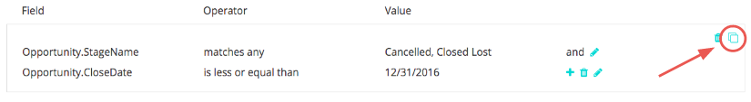
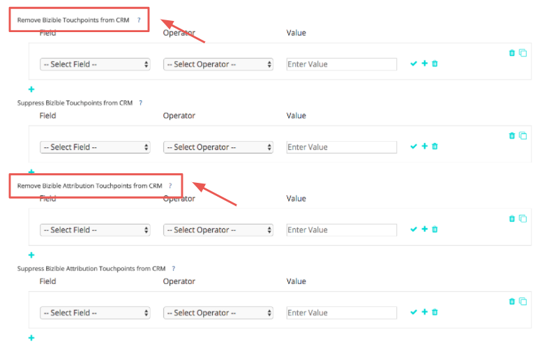

# 접점 제거 및 접점 억제 {#touchpoint-removal-and-touchpoint-suppression}

CRM에서 특정 기준을 충족하는 터치포인트를 제거하거나 표시하지 않는 방법을 알아봅니다. 다음과 같은 경우 데이터 공간을 확보하는 데 유용합니다. [!DNL Salesforce] 데이터 저장 공간 제한.

접점 제거 규칙과 접점 제외 규칙 사이에는 한 가지 주요 차이점이 있습니다.

* 접점 제거 - [!DNL Marketo Measure] 은(는) 규칙 기준에 맞는 CRM의 모든 터치포인트를 제거(즉, 제거합니다. 데이터 _can_ 다음 기간 내에 보고됨: [!DNL Marketo Measure] ROI 대시보드이지만 더 이상 CRM에 없습니다.
* 접점 억제 - 접점 제거와 유사하지만, ROI 대시보드 내에서 데이터를 보고할 수 없습니다.

접점 제거/억제 규칙 만들기를 시작하기 전에 구현 계획을 마케팅 및 판매 운영 팀과 공유하는 것이 좋습니다. 제거할 유형 또는 값에 대한 아이디어가 이미 있어야 합니다. 일반적인 사용 사례 중 일부는 다음과 같습니다.

* 마감된 손실 기회에서 터치포인트 삭제
* 매우 오래된 리드에서 터치포인트 삭제
* 부적격 리드에서 터치포인트 삭제

규칙이 저장되면 [!DNL Marketo Measure] 은 기여도 분석 모델을 정리하고 재배포합니다. 즉, 이정표와 위치가 변경되고 채널의 속성 크레딧이 변경됩니다! 이렇게 하면 데이터가 수정되므로 도움이 필요한 경우 Success Manager에게 문의하십시오.

`1)` 제거/제외 설정에는 두 개의 섹션이 있습니다. 구매자 접점(가망 고객 및 연락처) 또는 구매자 속성 접점(연락처, 기회 및 계정)에 대해 설정할 수 있는 옵션이 있습니다.

규칙을 추가하고 기준을 정의할 필드를 선택하는 것부터 시작하십시오.

다음 열에 추가할 다음 값 세트와 연결할 연산자 목록에서 선택합니다.

>[!TIP]
>
>필드에 여러 값을 추가하려면 각 값을 구분하는 쉼표와 함께 &quot;matches any&quot; 연산자를 사용합니다.

>[!TIP]
>
>필드에서 빈 값이나 NULL 값을 처리하려면 [!UICONTROL Value] 상자가 비어 있습니다. 이는 양식 URL이 없는 터치포인트에 대해 평가하는 것과 같은 시나리오를 고려합니다.

>[!NOTE]
>
>공식 필드는 규칙 내에서 사용할 수 없으며 선택 목록에 표시되지 않습니다. 수식은 백그라운드에서 계산되며 레코드를 수정하지 않으므로 [!DNL Marketo Measure] 레코드가 규칙에 맞는지 여부를 감지할 수 없습니다.

`2)` 명령문에서 &quot;AND&quot; 논리를 활용하려면 동일한 그룹 내에 규칙을 추가하십시오.
또는 그룹 외부에 새 명령문을 추가하여 명령문에서 &quot;OR&quot; 논리를 활용합니다.

`3)` 규칙이 복잡해지고 그룹을 다시 만들고 각 문을 약간 변경해야 하는 경우 [!UICONTROL Clone] 작업을 더 단순하게 만드는 옵션입니다.

실수를 했다면 걱정하지 마세요. 명령문의 개별 행이나 전체 그룹도 삭제할 수 있습니다.

`4)` 구매자 속성 터치포인트를 두 객체에 모두 적용하려면 이 터치포인트에 대한 규칙을 설정합니다. 유연성을 통해 한 오브젝트 또는 두 오브젝트 모두에 대한 규칙을 설정할 수 있으며, 규칙이 적용되는 경우 두 오브젝트에 대한 규칙을 설정하도록 선택할 수 있습니다.

끝내려면 [!UICONTROL Save and Process] 규칙. 많은 변경 작업을 수행하는 경우 그 동안 변경 내용을 저장해야 합니다. [!DNL Marketo Measure] 을 클릭할 때까지 터치포인트 제거를 실제로 시작하지 않습니다.
[!UICONTROL **저장 및 처리**].

| **연산자** | **사용 사례** |
|---|---|
| 다음과 같음 | 단일 값 - 정확한 일치 |
| 포함 | 단일 값 - 값 포함 |
| 임의 항목 일치 | 여러 값 - 정확한 일치 |
| 모두 일치(포함) | 다중 값 - &#42;값&#42;, &#42;값, &#42;값&#42; |

Dynamics를 사용하는 고객 중 상태 및/또는 상태 코드를 기반으로 제외 규칙을 설정하려는 고객의 경우 규칙을 설정할 때 다음 서식이 필요합니다. `[Object].Statecode` 다음과 같음/다음과 같지 않음 `[Status Value]`. 예를 들어 Dynamics 내의 Statecode가 연락처에서 &quot;1&quot;을 읽고 Status가 &quot;비활성&quot;을 읽으며 이러한 모든 연락처를 표시하지 않으려 할 경우 Contact.Statecode가 1과 같으므로 다음 형식이 비표시 규칙에 맞지 않습니다. 대신 Statecode와 Status가 쌍으로 작동하므로 다음 형식을 사용해야 합니다. [!DNL Marketo Measure] 은(는) 쿼리의 Status에서 값을 읽습니다. Contact.Statecode는 Inactive와 같습니다.
