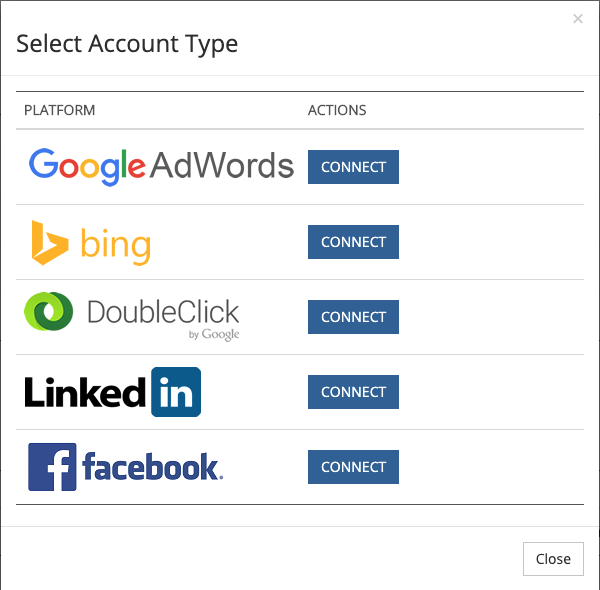

# 통합 광고 플랫폼 {#integrated-ad-platforms}

[!DNL Marketo Measure] Google AdWords, Microsoft BingAds와의 API 연결 있음, [!DNL Facebook] 광고 및 DoubleClick 캠페인 관리자. 이러한 API 연결을 통해 [!DNL Marketo Measure] 외부 구매자 앱과 함께 데이터를 쉽게 가져와서 CRM에 푸시할 수 있습니다. 비용이나 데이터를 수동으로 업로드할 필요가 없습니다. 대신, 계정을 연결 및 [!DNL Marketo Measure] 앱. [!DNL Marketo Measure] 그러면 플랫폼에서 마케팅 비용을 자동으로 다운로드하여 [!DNL Marketo Measure] 앱. AdWords, BingAds 또는 [!DNL Facebook] 광고, [!DNL Marketo Measure] 은 자동으로 해당 매개 변수를 광고 URL에 추가합니다.

## 광고 플랫폼 연결 방법 {#how-to-connect-ad-platforms}

각 플랫폼의 세부 사항을 살펴보기 전에 이러한 계정을 [!DNL Marketo Measure]. 먼저 에 로그인합니다. [!DNL Marketo Measure] 앱을 사용하여 **[!UICONTROL Settings]** 아래의 옵션 **[!UICONTROL My Account]** 화면 왼쪽 상단에 있는 탭입니다. 다음 을 선택합니다. **[!UICONTROL Connections]** 아래에 **[!UICONTROL Integrations]** 섹션에 있습니다.

아래 이미지에 표시된 대로 새 광고 연결을 설정하는 버튼이 표시됩니다.

을(를) 클릭한 후 [!UICONTROL Set up New Ads Connection] 버튼, 4개의 광고가 있는 창(아래 표시)이 표시됩니다 [!UICONTROL connect]이온 유형. 연결을 클릭하면 다른 창이 나타나 자격 증명을 요청합니다. 자격 증명을 입력하고 [!UICONTROL authorize] 계정을 [!DNL Marketo Measure].

## Google AdWords {#google-adwords}

에서 광고를 만들 때 [!DNL Google AdWords]에는 세 가지 방법 중 하나로 캠페인에 태그를 지정하는 것이 좋습니다. 수동 태깅, 자동 태깅 또는 추적 템플릿 작성 AdWords URL에 수동으로 태깅하려면 광고 URL 끝에 매개 변수를 정의하고 추가하십시오. 수동 태깅을 사용하면 Google이 아닌 모든 플랫폼에서 매개 변수로 수집된 데이터를 쉽게 읽을 수 있습니다.

추적 템플릿은 Google에서 ValueTrack 매개 변수라는 것을 추가하기 위해 제공하는 도구입니다. UTM 및 기타 태깅 매개 변수와 동일한 방식으로 작동합니다.

## 자동 태깅이 활성화되면 어떻게 됩니까? {#what-happens-when-auto-tagging-is-enabled}

[!DNL Marketo Measure] 에서 추적 템플릿 검색 [!DNL AdWords] 계정:

* *옵션 A*: 추적 템플릿이 있습니다. [!DNL Marketo Measure] 템플릿에 해당 매개 변수를 추가합니다.
* *옵션 B*: 타사 리디렉션을 찾습니다. 추적 템플릿에 타사 리디렉션이 있는 경우, [!DNL Marketo Measure] 작업을 수행할 수 없습니다. 을(를) 수동으로 추가해야 합니다 [!DNL Marketo Measure] 태그에 다음 코드를 배치하십시오. 타사 리디렉션의 예로는 Kenshoo 또는 Marin과 같은 입찰 관리 도구가 있습니다. 방법에 대해 자세히 알아보기 [입찰 관리 도구가 영향을 [!DNL Marketo Measure]](/help/api-connections/utilizing-marketo-measures-api-connections/how-bid-management-tools-affect-marketo-measure.md){target=&quot;_blank&quot;}.

* *옵션 C*: 추적 템플릿을 찾을 수 없습니다. [!DNL Marketo Measure] 은(는) 모든 광고 대상 URL을 [!DNL Marketo Measure] 매개 변수. 검사를 기준으로 할 경우
   * 매개 변수가 있습니다. 설치가 완료되었습니다!
   * 매개 변수를 찾을 수 없습니다. [!DNL Marketo Measure] 은 해당 매개 변수를 광고 대상 URL의 끝에 추가합니다. [!DNL Marketo Measure] 새 광고를 만든 후 2시간 내에 추가합니다. 매개 변수가 템플릿에 추가되지 않습니다.

추가 정보 [[!DNL AdWords] 자동 태깅 기능](/help/api-connections/utilizing-marketo-measures-api-connections/understanding-marketo-measure-adwords-tagging.md){target=&quot;_blank&quot;}.

## 활성화 방법 [!DNL Marketo Measure] Adwords에 대한 자동 태그 지정 {#how-to-enable-marketo-measure-auto-tagging-for-adwords}

활성화하기 전 [!DNL Marketo Measure] 자동 태깅, **Adwords 계정 내에서 계정, 캠페인 또는 광고 그룹 수준에서 추적 템플릿이 활성화되어 있는지 확인하십시오. 이는 다음과 같은 Adwords 계정에 필요합니다 [!DNL Marketo Measure] 자동 태깅이 활성화되었습니다.** 추적 템플릿을 활성화하면 광고 성능 내역 데이터가 손실되지 않습니다. 키워드, Sitelink 또는 광고 수준에서 추적 템플릿을 활성화하면 광고가 검토 및 승인 프로세스를 통과하고 광고 성능 내역을 잠재적으로 다시 시작할 수 있습니다. 추적 템플릿이 전혀 활성화되지 않은 경우 [!DNL Marketo Measure] 추가 [!DNL Marketo Measure] 매개 변수를 직접 추적하면 광고 기록 데이터가 손실될 수 있는 광고의 &quot;최종 URL&quot;에 다시 연결할 수 있습니다.

추적 템플릿이 준비되면 아래 지침에 따라 활성화하십시오 [!DNL Marketo Measure] 자동 태깅. 참고: [!DNL Marketo Measure] 또한 은 계정에 일시 중지된 모든 광고에 자동으로 태그를 지정합니다.

1. 사용자 [!DNL Marketo Measure] 계정 [experience.adobe.com/marketo-measure](https://experience.adobe.com/marketo-measure){target=&quot;_blank&quot;}.

1. 이동 [!UICONTROL My Account] > [!UICONTROL Settings] > [!UICONTROL Integrations] > [!UICONTROL Connections].

   

1. 사용할 Adwords 계정 옆에 있는 연필 아이콘을 클릭합니다 [!DNL Marketo Measure] 자동 태깅이 활성화되었습니다.

   

1. 오른쪽 상단 모서리에서 을(를) 전환합니다. **[!UICONTROL Autotagging]** 다음으로 전환 **[!UICONTROL Yes]**. 페이지 하단에서 **[!UICONTROL Learn More]** 텍스트 상자를 확장하려면 **[!UICONTROL Save]**. 자동 태그 지정 설정이 완료되었습니다.

   

## AdWords에서 추적 템플릿을 설정하는 방법 [!DNL Marketo Measure] 매개 변수 {#how-to-set-up-a-tracking-template-in-adwords-with-marketo-measure-parameters}

에서 추적 템플릿을 추가해야 한다는 점에 유의하십시오 [!UICONTROL Account], [!UICONTROL Campaign] 또는 AdWords의 광고 그룹 수준입니다. 키워드, Sitelink 또는 광고 수준에 추적 템플릿을 추가하는 경우 광고를 검토 및 승인 프로세스를 진행해야 하며 광고 성능 내역을 다시 시작할 수 있습니다. 추가 정보 [추적 템플릿 만들기](https://support.google.com/adwords/answer/6076199?hl=en#tracking){target=&quot;_blank&quot;}.

1. 에 로그인 [!DNL Google AdWords] 계정.
1. 다음 위치로 이동 [!UICONTROL Campaigns] 왼쪽 탐색 막대에서 보기
1. 다음 위치로 이동합니다.[!UICONTROL Settings]&quot;, 왼쪽 탐색 막대도 있습니다
1. &quot;(으)로 전환합니다.[!UICONTROL Account Settings]&quot; 맨 위에 있는 보기
1. &quot;[!UICONTROL Tracking]&quot; 섹션
1. 추적 템플릿에 다음 텍스트 문자열 중 하나를 붙여넣어 템플릿의 값을 설정합니다.

   * 모든 URL에 물음표가 있는 경우 다음 URL 텍스트를 사용하십시오.

   `{lpurl}&_bt={creative}&_bk={keyword}&_bm={matchtype}&_bn={network}&_bg={adgroupid}`

   * URL에 물음표가 없는 경우 다음 URL 텍스트를 추가합니다.

   `{lpurl}?_bt={creative}&_bk={keyword}&_bm={matchtype}&_bn={network}&_bg={adgroupid}*`

   URL에 수동으로 태그를 지정할 때 오류가 발생하지 않도록 하려면 일반적으로 UTM 매개 변수를 자동으로 생성하는 것이 좋습니다. AdWords 또는 [!DNL Marketo Measure] 매개 변수에는 제공한 정보를 기반으로 URL에 대한 매개 변수를 자동으로 생성하여 프로세스를 간소화하는 여러 도구가 있습니다.

   >[!TIP]
   >
   >추적 템플릿이 잘못되었다는 오류가 발생하면 브라우저 캐시를 지우고 다시 시도하십시오. 이렇게 하면 문제가 해결되는 경우가 많습니다.

## 에 대한 UTM 태그를 자동으로 생성하는 방법 [!DNL Google AdWords] {#how-to-automatically-generate-utm-tags-for-google-adwords}

UTM 태그는 처음에는 만들기 어려울 수 있지만 UTM 매개 변수로 URL을 쉽게 작성할 수 있는 도구가 많이 있습니다. 다음 리소스 중 하나를 사용하거나 웹에서 추가 도구를 검색할 수 있습니다. 주의 사항 [!DNL Marketo Measure] 는 이러한 플랫폼 및 도구를 사용하여 어떤 것도 보증하거나 보증하지 않습니다.

**[!DNL Google URL]빌더**

Google URL Builder 는 UTM 태그로 올바르게 형식이 지정된 URL을 작성하는 표준 도구입니다. 각 매개 변수의 URL과 원하는 값을 입력하고 &quot; &quot;를 클릭하면 됩니다.[!UICONTROL Generate URL]&quot;. 태깅할 URL이 몇 개만 있는 경우 사용할 수 있는 이상적인 도구입니다. 도구 액세스 [여기](https://support.google.com/analytics/answer/1033867?hl=en){target=&quot;_blank&quot;}.

**EpikOne에서 생성된 Google 스프레드시트**

이 스프레드시트에는 태그가 지정된 대상 URL을 자동으로 생성하는 수식이 있습니다. 많은 수의 링크에 태그를 지정해야 하는 경우 사용할 수 있는 훌륭한 도구입니다. 스프레드시트에 액세스합니다 [여기](https://spreadsheets.google.com/ccc?key=p7c_HKcmspSUfEYSO0gskKw&amp;hl=en){target=&quot;_blank&quot;}.

**링크 태깅 도구 트래픽**

Rafflecopter에서 만든 스프레드시트는 [!DNL EpikOne's] 스프레드시트. 또한 사용할 수 있도록 태그가 지정된 대상 링크를 자동으로 생성하는 수식이 포함되어 있습니다.

이러한 각 도구에는 필요에 맞게 사용하고 수정하는 방법에 대한 자세한 지침이 있습니다. 도구를 사용할 수 있습니다 [여기](https://docs.google.com/spreadsheets/d/1QCIr1WUJQHE68cA4VTks2XE7nxuryaUymCEy_23-Oew/edit#gid=0){target=&quot;_blank&quot;}.

**Effin Amazing UTM Builder**

이 도구는 UTM 태그를 신속하게 생성할 수 있는 Chrome 확장 프로그램입니다. 찾기 [여기](https://chrome.google.com/webstore/detail/effin-amazing-utm-builder/eoaapiimcaimddnfhfnifgkinmpcbccp?hl=en){target=&quot;_blank&quot;}.

## Bing 광고 {#bing-ads}

Bing Ads는 URL에 대한 자동 태깅을 활성화하거나 다음과 같은 타사 도구를 사용할 수 있는 통합 플랫폼입니다 [!DNL Marketo Measure], 광고 태그에 태깅 합니다. [!DNL Bing Ads] 는 UTM 매개 변수도 사용합니다.

Bing Ads의 자동 태그 지정 기능은 다음 UTM 매개 변수를 추가합니다.

* Utm_source
* Utm_medium
* Utm_term

Bing Ads의 자동 태깅은 다음 사용자 지정 매개 변수도 추가합니다.

`_bt={adid}`

문자열은 다음과 같습니다.

`{lpurl}?_bt={adid}&utm_term={keyword}&utm_source=Bing_Yahoo&utm_medium=CPC`

중요한 건 [!DNL Bing Ads] 원할 경우 최종 URL에서 사용자 지정 태그를 사용하여 더 많은 매개 변수를 추가할 수 있으므로 더 세분화할 수 있습니다.

추적 템플릿은 필요한 경우 사용할 수 있지만, [!DNL Bing Ads] 및 [!DNL Marketo Measure] 통합합니다. 왜냐하면 [!DNL Bing] 히스토리를 변경하지 않고 광고를 편집할 수 있으므로 [!DNL Marketo Measure] 대상 URL을 업데이트할 수 있습니다.

자동 태그 지정은 [!DNL Marketo Measure] 그래서 [!DNL Marketo Measure] 매개 변수를 자동으로 추가할 수 있습니다. Bing Ads를 사용하면 이전 광고 성능 내역을 잃을 위험이 없습니다.

다음 방문 [[!DNL Bing Ads]](https://advertise.bingads.microsoft.com/en-us/blog/post/august-2016/upgraded-urls-now-available-in-bing-ads-an-easier-way-to-manage-your-tracking-urls)플랫폼에서 태그를 추가하는 방법에 대한 자세한 내용은 {target=&quot;_blank&quot;} 웹 사이트를 참조하십시오.

## Facebook 광고 {#facebook-ads}

다음 [!DNL Marketo Measure] 통합 [!DNL Facebook] 에서는 광고 정보를 자동으로 다운로드하고 매개 변수로 URL에 태그를 지정할 수 있습니다. [!DNL Marketo Measure] 자동 태깅을 통해 캠페인 및 광고 세트 정보를 가져옵니다. 광고 세트가 광고 그룹 이름 필드를 채웁니다. 에서 URL 태그 설정에 대한 자세한 내용은 [!DNL Facebook] 플랫폼, [!DNL Facebook] [비즈니스](https://www.facebook.com/business/help/1016122818401732/?ref=u2u){target=&quot;_blank&quot;} 페이지.

자동 태깅을 사용하기 전에 [!DNL Facebook Ads]이전 성능 내역을 CSV로 내보내는 것이 중요합니다. 이 시점에서 [!DNL Marketo Measure] 태그 [!DNL Facebook Ads] _bf 매개 변수와 함께 [!DNL Facebook] 광고를 새 브랜드로 읽고 성능 내역을 지웁니다. 따라서 사용자와 조직에 중요한 내용이 있는 경우 이전 성과 기록을 내보내는 것이 중요합니다.

귀하의 [!DNL Facebook] 언제든지 [!DNL Marketo Measure] 앱과 데이터가 손실되지 않습니다. 자동 태깅이 활성화된 경우에만 성능 기록이 지워집니다.

[이 문서를 참조하십시오](https://www.facebook.com/business/help/393890194130036)facebook에서 {target=&quot;_blank&quot;} 내보내기에 대한 자세한 내용을 참조하십시오 [!DNL Facebook] 광고 보고서.

## linkedIn 스폰서 콘텐츠 {#linkedin-sponsored-content}

LinkedIn 통합은 [!DNL Marketo Measure] 대상 URL에 태그를 지정하려면 다음을 수행하십시오 [!DNL LinkedIn] 궁극적으로 다음을 허용하는 스폰서 콘텐츠 [!DNL Marketo Measure] 사용자의 전체 터치포인트 여정을 통해 사용자를 따르고 활동을 다시 특정 [!DNL LinkedIn] Campaign과 Creative. 이를 통해 고객에게 ROI에 대한 통찰력을 얻을 수 있습니다 [!DNL LinkedIn] 활동. [!DNL Marketo Measure] 은 고유한 [!DNL LinkedIn] 공유 및 추가 `?_bl={creativeId}` 매개 변수를 끝에 추가합니다.

왜냐면 [!DNL LinkedIn] 공유는 여러 캠페인 및 크리에이티브에서 사용할 수 있습니다. 고객이 기존 크리에이티브를 복제/복제하지 않도록 하여 고유성을 유지할 수 있도록 해야 합니다. 공유를 찾았다가 하나의 크리에이티브에서만 사용하도록 감지된 경우, [!DNL Marketo Measure] 는 크리에이티브 또는 공유 를 다시 작성하지 않고도 공유에 태그를 지정할 수 있으며 모든 광고 기록(노출 횟수, 클릭 수, 공유)은 그대로 유지됩니다.

여러 크리에이티브 간에 공유되는 공유가 발견되는 즉시, [!DNL Marketo Measure] 고유한 세트를 만들려면 일시 정지, 복사 및 다시 태깅 프로세스를 실행해야 합니다. [!DNL Marketo Measure] 은 라이브 크리에이티브를 일시 중지하고 보관합니다. 즉, 노출 횟수, 클릭 수 및 소셜 공유가 포함된 크리에이티브도 보관됩니다.

## 비통합 플랫폼 {#non-integrated-platforms}

와 통합되지 않은 플랫폼의 경우 [!DNL Marketo Measure], [!DNL Marketo Measure] 자동 태그 지정 기능은 사용할 수 없습니다. 매개 변수를 수동으로 추가해야 합니다.
