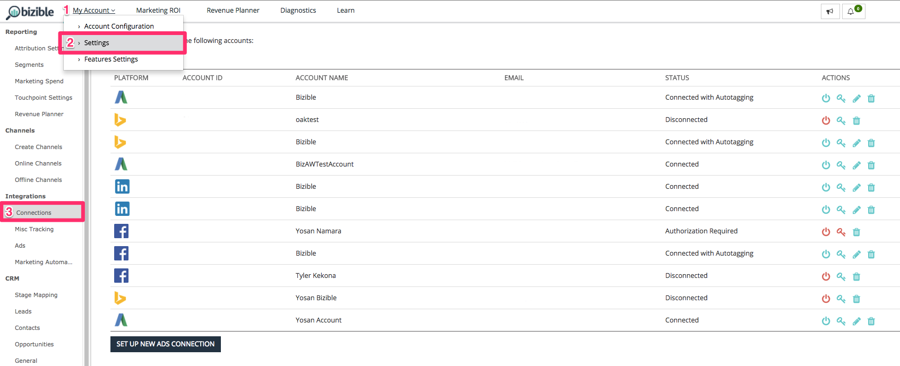

# 통합 광고 플랫폼 {#integrated-ad-platforms}

[!DNL Marketo Measure] Google AdWords, Microsoft BingAds와 API 연결 있음 [!DNL Facebook] 광고 및 DoubleClick 캠페인 관리자. 이러한 API 연결을 통해 [!DNL Marketo Measure] 는 외부 구매자 앱과 함께 데이터를 쉽게 가져와서 CRM에 푸시할 수 있습니다. 비용이나 데이터를 수동으로 업로드할 필요가 없습니다. 대신 계정에 연결하고 권한을 부여하면 됩니다. [!DNL Marketo Measure] 앱. [!DNL Marketo Measure] 그런 다음 플랫폼에서 마케팅 비용을 자동으로 다운로드하고 [!DNL Marketo Measure] 앱. AdWords, BingAds 또는 [!DNL Facebook] 광고, [!DNL Marketo Measure] 는 광고 URL에 매개 변수를 자동으로 추가합니다.

## 광고 플랫폼을 연결하는 방법 {#how-to-connect-ad-platforms}

각 플랫폼의 세부 사항을 살펴보기 전에 이러한 계정을 연결하는 방법을 살펴보겠습니다. [!DNL Marketo Measure]. 에 처음 로그인합니다. [!DNL Marketo Measure] 앱을 실행하고 다음 위치로 이동 **[!UICONTROL Settings]** 옵션 아래에 있는 **[!UICONTROL My Account]** 화면 왼쪽 상단의 탭입니다. 그런 다음 을 선택합니다. **[!UICONTROL Connections]** 다음 아래에 **[!UICONTROL Integrations]** 왼쪽 섹션에 있는 마지막 항목이 될 필요가 없습니다.

아래 이미지에 표시된 것처럼 새 광고 연결을 설정하는 버튼이 표시됩니다.

다음을 클릭하면 [!UICONTROL Set up New Ads Connection] 버튼, 창(아래 표시)에 4개의 광고가 표시됩니다. [!UICONTROL connect]이온 유형. 연결을 클릭하면 자격 증명을 묻는 다른 창이 나타납니다. 자격 증명을 입력하고 [!UICONTROL authorize] 계정을 연결할 대상 [!DNL Marketo Measure].

## Google AdWords {#google-adwords}

에서 광고를 만들 때 [!DNL Google AdWords], 수동 태그 지정, 자동 태그 지정 또는 추적 템플릿 만들기의 세 가지 방법 중 하나로 캠페인에 태그를 지정하는 것이 좋습니다. AdWords URL에 수동으로 태깅하는 것은 광고 URL의 끝에 매개 변수를 정의하고 추가하는 것을 의미합니다. 수동 태깅을 사용하면 Google 이외의 모든 플랫폼에서 매개 변수로 수집된 데이터를 쉽게 읽을 수 있습니다.

추적 템플릿은 Google에서 ValueTrack 매개 변수를 추가하는 데 제공하는 도구입니다. UTM 및 기타 태그 지정 매개 변수와 동일한 방식으로 작동합니다.

## 자동 태깅이 활성화되면 어떻게 됩니까? {#what-happens-when-auto-tagging-is-enabled}

[!DNL Marketo Measure] 에서 추적 템플릿을 검색합니다. [!DNL AdWords] 계정:

* *옵션 A*: 추적 템플릿을 찾을 수 없음. [!DNL Marketo Measure] 는 템플릿에 해당 매개 변수를 추가합니다.
* *옵션 B*: 서드파티 리디렉션을 찾았습니다. 추적 템플릿에 타사 리디렉션이 있는 경우 [!DNL Marketo Measure] 아무 작업도 수행할 수 없습니다. 을(를) 수동으로 추가해야 합니다 [!DNL Marketo Measure] 태그는 서드파티 시스템에 적용됩니다. 서드파티 리디렉션의 예로는 Kenshoo 또는 Marin과 같은 입찰 관리 도구가 있습니다. 자세한 내용 [입찰 관리 도구 영향 [!DNL Marketo Measure]](/help/api-connections/utilizing-marketo-measures-api-connections/how-bid-management-tools-affect-marketo-measure.md){target="_blank"}.

* *옵션 C*: 추적 템플릿을 찾을 수 없습니다. [!DNL Marketo Measure] 은(는) 의 모든 광고 대상 URL을 [!DNL Marketo Measure] 매개 변수. 검사를 기준으로, 다음과 같은 경우
   * 매개 변수를 찾았습니다. 설정이 완료되었습니다.
   * 매개 변수를 찾을 수 없음: [!DNL Marketo Measure] 는 광고 대상 URL의 끝에 매개 변수를 추가합니다. [!DNL Marketo Measure] 새 광고를 만든 후 2시간 이내에 추가합니다. 매개 변수는 템플릿에 추가되지 않습니다.

자세히 알아보기 [[!DNL AdWords] 자동 태그 지정 기능](/help/api-connections/utilizing-marketo-measures-api-connections/understanding-marketo-measure-adwords-tagging.md){target="_blank"}.

## 활성화 방법 [!DNL Marketo Measure] Adwords에 대한 자동 태그 지정 {#how-to-enable-marketo-measure-auto-tagging-for-adwords}

활성화하기 전 [!DNL Marketo Measure] 자동 태그 지정, **Adwords 계정 내의 계정, 캠페인 또는 광고 그룹 수준에서 추적 템플릿이 활성화되었는지 확인합니다. 다음을 보유하게 될 모든 Adwords 계정에 대해 필요합니다. [!DNL Marketo Measure] 자동 태그 지정이 활성화되었습니다.** 추적 템플릿을 활성화하면 광고 성능 기록 데이터가 손실되지 않습니다. 키워드, 사이트링크 또는 광고 수준에서 추적 템플릿을 활성화하면 광고가 검토 및 승인 프로세스를 거치게 되며 광고의 성능 내역을 다시 시작할 수 있습니다. 활성화된 추적 템플릿이 전혀 없으면 [!DNL Marketo Measure] 을(를) 추가합니다. [!DNL Marketo Measure] 매개 변수를 광고의 &quot;최종 URL&quot;에 직접 추적하면 광고 내역 데이터가 손실될 수도 있습니다.

추적 템플릿이 준비되면 아래 지침에 따라 활성화합니다 [!DNL Marketo Measure] 자동 태깅. 참고: [!DNL Marketo Measure] 는 계정에서 일시 중지된 광고에도 자동으로 태그를 지정합니다.

1. 다음에 로그인 [!DNL Marketo Measure] 계정 위치: [experience.adobe.com/marketo-measure](https://experience.adobe.com/marketo-measure){target="_blank"}.

1. 다음으로 이동 [!UICONTROL My Account] > [!UICONTROL Settings] > [!UICONTROL Integrations] > [!UICONTROL Connections].

   

1. 다음 대상이 될 Adwords 계정 옆에 있는 연필 아이콘을 클릭합니다. [!DNL Marketo Measure] 자동 태그 지정이 활성화되었습니다.

   

1. 오른쪽 상단 모서리에서 **[!UICONTROL Autotagging]** 다음으로 전환 **[!UICONTROL Yes]**. 페이지 하단에서 **[!UICONTROL Learn More]** 텍스트 상자를 확장하고 **[!UICONTROL Save]**. 자동 태그 지정 설정이 완료되었습니다.

   

## 을 사용하여 AdWords에서 추적 템플릿을 설정하는 방법 [!DNL Marketo Measure] 매개 변수 {#how-to-set-up-a-tracking-template-in-adwords-with-marketo-measure-parameters}

에 추적 템플릿을 추가해야 합니다. [!UICONTROL Account], [!UICONTROL Campaign] 또는 AdWords의 광고 그룹 수준입니다. 키워드, 사이트 링크 또는 광고 수준에 추적 템플릿을 추가하는 경우 광고는 검토 및 승인 프로세스를 거쳐야 하며 광고의 성능 내역이 다시 시작되는 위험이 있습니다. 자세히 알아보기 [추적 템플릿 만들기](https://support.google.com/adwords/answer/6076199?hl=en#tracking){target="_blank"}.

1. 에 로그인 [!DNL Google AdWords] 계정.
1. 다음으로 이동 [!UICONTROL Campaigns] 왼쪽 탐색 막대에서 보기
1. 다음으로 이동 &quot;[!UICONTROL Settings]&quot;, 왼쪽 탐색 막대에도 있음
1. &quot;(으)로 전환[!UICONTROL Account Settings]&quot;맨 위의 보기
1. 를 확장합니다.[!UICONTROL Tracking]&quot; 섹션
1. 다음 텍스트 문자열 중 하나를 추적 템플릿에 붙여넣어 템플릿의 값을 설정합니다.

   * 모든 URL에 물음표가 있는 경우 다음 URL 텍스트를 사용하십시오.

   `{lpurl}&_bt={creative}&_bk={keyword}&_bm={matchtype}&_bn={network}&_bg={adgroupid}`

   * URL에 물음표가 없는 경우 다음 URL 텍스트를 추가합니다.

   `{lpurl}?_bt={creative}&_bk={keyword}&_bm={matchtype}&_bn={network}&_bg={adgroupid}*`

   URL에 수동으로 태그를 지정할 때 오류가 발생하지 않도록 하려면 일반적으로 UTM 매개 변수를 자동으로 생성하는 것이 좋습니다. 즉, AdWords 또는 [!DNL Marketo Measure] 매개 변수에는 사용자가 제공하는 정보를 기반으로 URL에 대한 매개 변수를 자동으로 생성하여 프로세스를 간소화하는 여러 도구가 있습니다.

   >[!TIP]
   >
   >추적 템플릿이 유효하지 않다는 오류가 발생하면 브라우저 캐시를 지우고 다시 시도해 보십시오. 이렇게 하면 문제가 해결됩니다.

## 에 대한 UTM 태그를 자동으로 생성하는 방법 [!DNL Google AdWords] {#how-to-automatically-generate-utm-tags-for-google-adwords}

UTM 태그는 처음에 만들기가 어려운 것처럼 보일 수 있지만 UTM 매개 변수를 사용하여 URL을 쉽게 빌드하는 데 사용할 수 있는 많은 도구가 있습니다. 다음 리소스 중 하나를 사용하거나 웹에서 추가 도구를 검색할 수 있습니다. 주의 사항 [!DNL Marketo Measure] 는 이러한 플랫폼 및 도구를 사용하여 어떤 것도 보증하거나 보장하지 않습니다.

**[!DNL Google URL]빌더**

Google URL 빌더는 UTM 태그를 사용하여 올바른 형식의 URL을 작성하는 표준 도구입니다. URL과 각 매개 변수의 원하는 값을 입력하고 를 클릭합니다.[!UICONTROL Generate URL]&quot;. 태그할 URL이 소수에 불과한 경우 사용하는 것이 이상적인 도구입니다. 도구 액세스 [여기](https://support.google.com/analytics/answer/1033867?hl=en){target="_blank"}.

**EpikOne에서 생성한 Google 스프레드시트**

이 스프레드시트에는 태그가 지정된 대상 URL을 자동으로 생성하는 공식이 있습니다. 많은 링크에 태그를 지정해야 하는 경우 사용할 수 있는 좋은 도구입니다. 스프레드시트 액세스 [여기](https://spreadsheets.google.com/ccc?key=p7c_HKcmspSUfEYSO0gskKw&amp;hl=en){target="_blank"}.

**Raflectopter 링크 태그 지정 도구**

Rafflecopter에서 만든 스프레드시트는 수정된 버전입니다. [!DNL EpikOne's] 스프레드시트입니다. 여기에는 사용할 태그가 지정된 대상 링크를 자동으로 생성하는 수식도 포함되어 있습니다.

이러한 각 도구에는 사용자의 요구 사항에 맞게 사용 및 수정하는 방법에 대한 자세한 지침이 있습니다. 도구를 사용할 수 있습니다 [여기](https://docs.google.com/spreadsheets/d/1QCIr1WUJQHE68cA4VTks2XE7nxuryaUymCEy_23-Oew/edit#gid=0){target="_blank"}.

**Effin Amazing UTM Builder**

이 도구는 UTM 태그를 빠르게 생성할 수 있는 Chrome 확장 기능입니다. 찾기 [여기](https://chrome.google.com/webstore/detail/effin-amazing-utm-builder/eoaapiimcaimddnfhfnifgkinmpcbccp?hl=en){target="_blank"}.

## Bing Ads {#bing-ads}

Bing Ads는 URL에 대한 자동 태그 지정을 활성화하거나 다음과 같은 서드파티 도구를 사용할 수 있는 통합 플랫폼입니다. [!DNL Marketo Measure]를 클릭하여 광고에 태깅합니다. [!DNL Bing Ads] 는 UTM 매개 변수도 사용합니다.

Bing Ads의 자동 태그 지정 기능은 다음과 같은 UTM 매개 변수를 추가합니다.

* Utm_source
* Utm_medium
* Utm_term

Bing Ads의 자동 태그 지정은 다음 사용자 지정 매개 변수도 추가합니다.

`_bt={adid}`

문자열은 다음과 같이 표시됩니다.

`{lpurl}?_bt={adid}&utm_term={keyword}&utm_source=Bing_Yahoo&utm_medium=CPC`

주의할 점은 다음과 같습니다 [!DNL Bing Ads] 을 사용하면 원하는 경우 최종 URL에서 사용자 지정 태그를 사용하여 더 많은 매개 변수를 추가할 수 있으므로 세부 기간을 늘릴 수 있습니다.

필요한 경우 추적 템플릿을 사용할 수 있지만, 에는 필요하지 않습니다. [!DNL Bing Ads] 및 [!DNL Marketo Measure] 을 참조하십시오. 이유는 다음과 같습니다. [!DNL Bing] 변경 기록을 변경하지 않고 광고를 편집할 수 있으므로 [!DNL Marketo Measure] 대상 URL을 업데이트할 수 있습니다.

자동 태깅은 다음을 통해 활성화되어야 합니다. [!DNL Marketo Measure] 사용자 지정 [!DNL Marketo Measure] 매개 변수는 자동으로 추가될 수 있습니다. Bing Ads를 사용하면 과거 광고 성과 내역을 잃을 위험이 없습니다.

다음 방문: [[!DNL Bing Ads]](https://advertise.bingads.microsoft.com/en-us/blog/post/august-2016/upgraded-urls-now-available-in-bing-ads-an-easier-way-to-manage-your-tracking-urls){target="_blank"} 웹 사이트 를 참조하십시오.

## Facebook 광고 {#facebook-ads}

다음 [!DNL Marketo Measure] 과 통합 [!DNL Facebook] 를 사용하면 광고 정보를 자동으로 다운로드하고 해당 매개 변수로 URL에 태그를 지정할 수 있습니다. [!DNL Marketo Measure] 는 자동 태깅을 통해 캠페인 및 광고 세트 정보를 가져옵니다. 광고 세트로 광고 그룹 이름 필드가 채워집니다. 에서 URL 태그를 설정하는 방법에 대한 자세한 내용은 [!DNL Facebook] 플랫폼, 다음 방문: [!DNL Facebook] [비즈니스](https://www.facebook.com/business/help/1016122818401732/?ref=u2u){target="_blank"} 페이지를 가리키도록 업데이트하는 중입니다.

로 자동 태그 지정을 활성화하기 전에 [!DNL Facebook Ads]: 이전 성능 기록을 CSV로 내보내는 것이 중요합니다. 이 시점에서 [!DNL Marketo Measure] 태그 [!DNL Facebook Ads] _bf 매개 변수와 함께 [!DNL Facebook] 는 광고를 완전히 새로운 광고로 읽고 성능 기록을 지웁니다. 따라서 귀하와 귀하의 조직에 중요한 가치가 있는 경우 이전 성과의 레코드를 내보내는 것이 중요합니다.

다음을 연결할 수 있습니다. [!DNL Facebook] 언제든지 다음 계정으로 계정 보내기 [!DNL Marketo Measure] 앱에서 데이터가 손실되지 않습니다. 자동 태깅이 활성화된 경우에만 성능 기록이 지워집니다.

다음을 참조하십시오 [이 문서](https://www.facebook.com/business/help/393890194130036){target="_blank"} 내보내기에 대한 자세한 내용은 Facebook에서 확인하십시오 [!DNL Facebook] 광고 보고서.

## LinkedIn 후원 콘텐츠 {#linkedin-sponsored-content}

linkedIn 통합을 통해 [!DNL Marketo Measure] 대상 URL에 태그 지정 [!DNL LinkedIn] 궁극적으로 을 허용하는 스폰서 콘텐츠 [!DNL Marketo Measure] 사용자를 팔로우하여 전체 터치포인트 여정을 수행하고 활동을 다시 특정 대상에 매핑하는 방법 [!DNL LinkedIn] Campaign과 Creative. 이를 통해 고객은 의 ROI에 대한 통찰력을 얻을 수 있습니다 [!DNL LinkedIn] 활동. [!DNL Marketo Measure] 은(는) 고유한 를 가진 크리에이티브를 검색합니다. [!DNL LinkedIn] 공유 및 추가 `?_bl={creativeId}` 매개 변수를 끝에 추가합니다.

이유 [!DNL LinkedIn] 여러 캠페인 및 크리에이티브 간에 공유를 사용할 수 있습니다. 고객은 고유성을 유지할 수 있도록 기존 크리에이티브를 복사/복제/복제하지 마십시오. 공유가 발견되고 하나의 Creative에서만 사용되는 것으로 감지되면 [!DNL Marketo Measure] 광고 크리에이티브 또는 공유를 다시 만들지 않고도 공유를 있는 그대로 태그를 지정할 수 있으며 모든 광고 내역(노출 횟수, 클릭 수, 공유)이 유지됩니다.

공유가 여러 크리에이티브 간에 공유되는 즉시 [!DNL Marketo Measure] 고유한 세트를 만들려면 일시 중지, 복사 및 다시 태깅 프로세스를 실행해야 합니다. [!DNL Marketo Measure] 은 라이브 크리에이티브를 일시 중지하고 보관합니다. 즉, 노출 횟수, 클릭 수 및 소셜 공유가 포함된 크리에이티브도 보관됩니다.

## 통합되지 않은 플랫폼 {#non-integrated-platforms}

와 통합되지 않은 플랫폼의 경우 [!DNL Marketo Measure], [!DNL Marketo Measure] 자동 태그 지정 기능은 사용할 수 없습니다. 매개 변수는 수동으로 추가해야 합니다.
