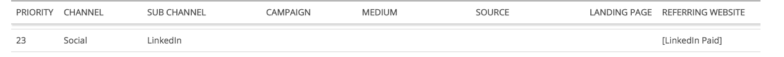

# LinkedIn 통합 {#linkedin-integration}

## 개요 {#overview}

다음 [!DNL Marketo Measure] linkedIn과의 통합은 두 가지 부분으로 이루어집니다.

후원 콘텐츠: 후원 콘텐츠 통합을 통해 [!DNL Marketo Measure] 대상 URL에 태그 지정 [!DNL LinkedIn] 광고, 궁극적으로 [!DNL Marketo Measure] 사용자를 팔로우하여 전체 터치포인트 여정을 수행하고 활동을 다시 특정 대상에 매핑하는 방법 [!DNL LinkedIn] Campaign과 Creative. 이를 통해 고객은 의 ROI에 대한 통찰력을 얻을 수 있습니다 [!DNL LinkedIn] 활동.

리드 세대 Forms: LinkedIn의 리드 세대 Forms과의 통합을 통해 Marketo Measure은 LinkedIn 플랫폼을 통해 제출된 양식에 대한 통찰력을 얻을 수 있습니다. 이러한 양식 채우기는 CRM의 리드와 일치하거나 [!DNL Marketo Engage] 속성을 적용할 수 있도록 인스턴스를 만듭니다. 양식을 생성하는 데 도움이 된 Campaign, Creative 및 Form에 대한 통찰력을 통해 팀은 이제 LinkedIn 마케팅 및 광고 지출을 더욱 최적화할 수 있습니다.

## 사용 가능 {#availability}

모든 고객이 사용할 수 있습니다.

## 요구 사항 {#requirements}

**캠페인 관리자 역할**

대상 [!DNL Marketo Measure] 광고 데이터 및 광고 비용 데이터를 다운로드하려면 캠페인 관리자에 다음 역할 중 하나가 있어야 합니다.

* 청구 관리자
* 계정 관리자
* 캠페인 관리자

자세히 알아보기: [Campaign Manager의 사용자 역할 및 기능](https://www.linkedin.com/help/lms/answer/a425731/user-roles-and-functions-in-campaign-manager).

**유료 미디어 관리자 역할**

대상 [!DNL Marketo Measure] 후원 크리에이티브를 생성/업데이트하려면 다음 유료 미디어 관리자 역할 중 하나가 있어야 합니다.

* 스폰서 콘텐츠 포스터
* 리드 세대 Forms 관리자

자세히 알아보기: [LinkedIn 페이지 관리자 역할](https://www.linkedin.com/help/linkedin/answer/4783/linkedin-page-admin-roles-overview).

다른 항목이 있습니다. [!DNL LinkedIn] 우리가 하는 역할 **아님** 을(를) 통합하기 위해 필요합니다. 이러한 역할은 종종 필수 역할로 오인되므로 차이가 있습니다.

**페이지 관리자 역할**

대상 [!DNL Marketo Measure] lead gen forms에서 lead 를 다운로드/통합하려면 다음 페이지 관리자 역할이 있어야 합니다.

* 수퍼 관리자

자세히 알아보기: [LinkedIn 페이지 관리자 역할](https://www.linkedin.com/help/linkedin/answer/4783/linkedin-page-admin-roles-overview).

## LinkedIn 광고 유형 {#linkedin-ad-types}

[!DNL Marketo Measure] 은(는) 다음을 지원합니다.

**스폰서 콘텐츠:** 후원 콘텐츠를 사용하면 콘텐츠를 다음에 전달할 수 있습니다. [!DNL LinkedIn] 회사를 팔로우하는 멤버 이상의 멤버 피드. 스폰서 콘텐츠는 특정 대상자를 타겟팅할 수 있으며 광고주가 다음 사항에 도달하도록 지원할 수 있습니다. [!DNL LinkedIn] 멤버들이 언제 어디서나 [!DNL LinkedIn] 데스크탑, 모바일 및 태블릿 플랫폼. 리드 세대 Forms의 후원 콘텐츠가 지원됩니다.

에서 지원하는 스폰서 콘텐츠 광고 형식 유형 [!DNL Marketo Measure] 는 단일 이미지 광고 및 비디오 광고입니다(리드 세대 Forms을 통해). 스키마의 복잡성으로 인해 회전식 광고는 지원되지 않습니다.

[!DNL Marketo Measure] 는 스폰서 메시지, 텍스트 광고 또는 다이내믹 광고를 지원하지 않습니다.

>[!TIP]
>
>비후원 콘텐츠 소스(예: &quot;텍스트 광고&quot; 또는 &quot;후원 InMail&quot;의 캠페인 유형)에서 비롯되는 캠페인/지출의 경우, [!DNL Marketo Measure] 다음과 같음 _아님_ 는 기본적으로 이러한 캠페인 유형의 추적을 지원합니다. &quot;후원 콘텐츠&quot; 지출과 함께 이러한 캠페인에 대한 지출을 추적하려면 마케팅 지출 CSV를 사용하여 지출이라는 내용을 수동으로 기록해야 합니다.

## 작동 방법: 스폰서 콘텐츠 {#how-it-works-sponsored-content}

>[!NOTE]
>
>처음 사용하기 전에 로 이동하여 이 기능 설정을 활성화해야 합니다. [!DNL Marketo Measure] [!UICONTROL Settings] > [!UICONTROL Integrations] > [!UICONTROL Ads] > [!UICONTROL Enable LinkedIn Lead Gen Forms].

**[!DNL LinkedIn's]고유한 자동 태그 지정 요구 사항**

[!DNL Marketo Measure] 을(를) 추적하는 데 도움이 될 수 있음 [!DNL LinkedIn] 랜딩 페이지에 자동 태깅하여 캠페인 성과를 높입니다.

[!DNL Marketo Measure] 고유한 LinkedIn 공유로 크리에이티브를 검색하고 다음을 추가합니다. `?_bl={creativeId}` 매개 변수를 끝에 추가합니다.

**공유 복사**

이 [!DNL Marketo Measure/LinkedIn] 통합 시 고객이 기존 크리에이티브를 복제/복제/복제하지 않도록 해야 합니다. 공유가 발견되고 하나의 Creative에서만 사용되는 것으로 감지되면 [!DNL Marketo Measure] 광고 크리에이티브 또는 공유를 다시 만들지 않고도 공유를 있는 그대로 태그를 지정할 수 있으며 모든 광고 내역(노출 횟수, 클릭 수, 공유)이 유지됩니다.

공유가 여러 크리에이티브 간에 공유되는 즉시 [!DNL Marketo Measure] 고유한 세트를 만들려면 일시 중지, 복사 및 다시 태깅 프로세스를 실행해야 합니다. [!DNL Marketo Measure] 는 모든 것을 제대로 자동 태깅하기 위해 라이브 크리에이티브를 일시 중지하고 보관하므로 노출, 클릭 수 및 소셜 공유를 비롯한 광고 내역을 삭제합니다.

앞으로 나아가서 [!DNL Marketo Measure] 은(는) 을(를) 복제하지 않도록 권장합니다. [!DNL LinkedIn] 광고 기록을 삭제하지 않고도 추적을 추가할 수 있도록 모든 크리에이티브 및 공유를 가능한 한 고유하게 공유하고 유지합니다.

**단축된 URL**

추가 단계를 수행하는 이유는 LinkedIn에서 대상 URL을 단축된 URL(bit.ly, google.le 등)로 허용했기 때문입니다. [!DNL Marketo Measure] 은(는) 길고 해결된 URL을 보지 못하며 [!DNL Marketo Measure] 해결된 URL에 추적 매개 변수를 추가해야 합니다. 그 문제를 해결하기 위해서 [!DNL Marketo Measure] 광고를 다시 만들기 전에 단축된 URL을 찾고, URL을 확장한 다음, 확인된 URL 및 모든 해당 매개 변수로 새 광고를 만들어 [!DNL Marketo Measure] 태그를 추가합니다. 새 광고를 만들면 광고 내역(노출 횟수, 클릭 수, 공유)이 지워지므로 단축된 URL에 태그를 지정할 권한이 필요합니다.

단축된 URL을 많이 사용하는 경우 광고 크리에이티브에 심각한 영향을 줄 수 있습니다. 더 이상 단축된 URL을 사용하지 않는 것이 좋습니다. [!DNL Marketo Measure] 는 새 광고를 만들고 광고 기록을 지우지 않고도 랜딩 페이지에 태그를 지정할 수 있습니다.

**프로세스**

몇 가지 예를 들어 보겠습니다. 있다고 가정해 보겠습니다....

크리에이티브 A : 공유 123\
크리에이티브 B : 공유 234\
Creative C : 공유 234\
크리에이티브 D : 공유 234

`1)` [!DNL Marketo Measure] 에서는 먼저 &quot;활성&quot; 상태인 모든 캠페인, 크리에이티브 및 공유를 살펴봅니다. [!DNL Marketo Measure] 일시 중지, 보관 또는 취소된 광고는 태그를 지정하지 않습니다. 광고가 일시 중지된 경우 를 로 설정합니다. [!UICONTROL active], 다시 활성화되면 태깅합니다. 고유한 공유를 찾을 수 있는 경우, 즉 여러 크리에이티브 또는 캠페인(예: Creative A : Share 123)에서 사용되지 않는 경우 [!DNL Marketo Measure] 사용자 지정 매개 변수를 추가합니다. `>> ?_bl={creativeId}` 공유 URL에 매핑할 수도 있습니다.

`2)` 이제 공유가 공유되어 고유성이 상실된 경우(예: Creative B : Share 234 및 Creative C : Share 234 및 Creative D : Share 234), [!DNL Marketo Measure] 는 유사한 모든 크리에이티브(Creative B, Creative C 및 Creative D)를 일시 중지하고 보관합니다.

`3)` [!DNL Marketo Measure] 는 보관된 Creative B의 콘텐츠를 복사하는 Creative E, Creative F 및 Creative G, 3개의 새로운 크리에이티브를 만듭니다.

`4)` [!DNL Marketo Measure] 는 또한 고유한 공유 234의 콘텐츠를 복사하는 3개의 새 공유 공유 공유 345, 공유 456 및 공유 567을 만듭니다. `?_bl` 태그 지정.

`5)` [!DNL Marketo Measure] 공유가 공유되지 않는지 정기적으로 확인해야 하며, 공유가 공유되는 경우 위의 2단계에서 프로세스를 재시작합니다.

>[!NOTE]
>
>이를 구현하면 고객이 Creative B : Share 234, Creative C : Share 234 및 Creative D : Share 234의 광고 내역을 잃게 됩니다. 이는 이제 Creative E : Share 345, Share F : Share 456 및 Creative G : Share 567과 각각 다시 만들어지기 때문입니다.

## 작동 방법: 리드 젠 Forms {#how-it-works-lead-gen-forms}

**프로세스**

까지 [!DNL LinkedIn's] 광고 양식 API 및 광고 양식 응답 API를 사용하면 광고 계정에 대한 양식 제출 데이터를 수집하고 이메일 주소를 CRM 또는 Marketo의 리드에 연결할 수 있습니다.

LinkedIn forms에는 여러 개의 이메일 주소가 포함될 수 있습니다. 양식 응답을 다운로드할 때 작업 이메일, 이메일 주소(기본 양식 필드) 또는 유효한 이메일 값이 있는 사용자 정의 필드 등 우선순위가 있는 이메일 주소를 찾습니다.

Campaign 또는 Creative 상태에 관계없이 모든 양식 응답으로 터치포인트가 발생합니다. [!DNL Marketo Measure] 90일 전환 확인 제한이 있으므로 [!DNL Marketo Measure] 90일 이상 지난 양식 응답에 액세스할 수 없지만 [!DNL Marketo Measure] 및 [!DNL LinkedIn] 통합이 활성화되어 있으면 리드 세대 양식 터치포인트가 다음을 통해 더 많이 표시됩니다. [!DNL Marketo Measure].

>[!NOTE]
>
>LinkedIn 비용은 여전히 스폰서가 있는 콘텐츠 캠페인의 일부로 다운로드됩니다.

**CRM 또는 Marketo에서 리드 세대 Forms 추적**

다음 이전 [!DNL Marketo Measure] 그리고 LinkedIn 리드 젠인 Forms 통합이 존재했으며, 고객이 양식 제출을 Marketo 프로그램 및/또는 CRM 캠페인에 푸시하여 양식을 추적하고 해당 활동에 대한 속성을 받는 것이 일반적인 관례였습니다. 리드 세대 Forms 설정이 활성화되면 이러한 양식 제출이 두 번 계산되지 않도록 해야 합니다. 다음을 확인하십시오.

* CRM 개체의 &quot;구매자 터치포인트 사용&quot; 필드가 &quot;없음&quot; 또는 &quot;모든 캠페인 멤버 제외&quot;로 설정되어 있습니다.
* 관련된 모든 Marketo 프로그램 또는 Marketo 활동 규칙 업데이트
* 관련 CRM Campaign 규칙 업데이트

>[!NOTE]
>
>linkedIn API에는 90일 전환 확인 제한이 있으므로 Marketo 또는 CRM 규칙을 사용하는 경우 규칙의 종료 날짜를 통합을 활성화한 날짜의 90일 전으로 설정하는 것이 좋습니다 [!DNL Marketo Measure].

## 접점 세부 정보 {#touchpoint-details}

한 번 [!DNL Marketo Measure] 이(가) LinkedIn 크리에이티브에 랜딩 페이지를 태그 지정했습니다. 터치 포인트에서 해결된 광고 데이터를 볼 수 있습니다. 다음은 표시될 것으로 예상되는 데이터 값 매핑입니다.

<table> 
 <colgroup> 
  <col> 
  <col> 
 </colgroup> 
 <tbody> 
  <tr> 
   <th>접점 필드</th> 
   <th>샘플 값</th> 
  </tr> 
  <tr> 
   <td>
광고 Id 
</td> 
   <td>
84186224 
</td> 
  </tr> 
  <tr> 
   <td>
광고 콘텐츠 
</td> 
   <td>
copy-1-image-2-man #B2B 마케터의 95%가 수요 창출 전략을 성공으로 간주합니다. 자세히 알아보기: [!DNL https]://lnkd.in/jgdi50vKrgv
</td> 
  </tr> 
  <tr> 
   <td>
광고 그룹 ID 
</td> 
   <td>
(공백) 
</td> 
  </tr> 
  <tr> 
   <td>
광고 그룹 이름 
</td> 
   <td>
(공백) 
</td> 
  </tr> 
  <tr> 
   <td>
광고 캠페인 Id 
</td> 
   <td>
138949954 
</td> 
  </tr> 
  <tr> 
   <td>
광고 캠페인 이름 
</td> 
   <td>
SU - COM 계정 - 수요 기술 
</td> 
  </tr> 
  <tr> 
   <td>
광고 대상 URL 
</td> 
   <td>
https://www.adobe.com/marketing-attribution-for-demand-generation-leaders?_bl=84186217 
</td> 
  </tr> 
  <tr> 
   <td>
양식 URL 
</td> 
   <td>
info.bizible.com/demo 
</td> 
  </tr> 
  <tr> 
   <td>
양식 URL - 원시 
</td> 
   <td>
info.bizible.com/demo 
</td> 
  </tr> 
  <tr> 
   <td>
키워드 ID 
</td> 
   <td>
(공백) 
</td> 
  </tr> 
  <tr> 
   <td>
키워드 일치 유형 
</td> 
   <td>
(공백) 
</td> 
  </tr> 
  <tr> 
   <td>
랜딩 페이지 
</td> 
   <td>
https://www.adobe.com/marketing-attribution-for-demand-generation-leaders 
</td> 
  </tr> 
  <tr> 
   <td>
랜딩 페이지 - 원시 
</td> 
   <td>
https://www.adobe.com/marketing-attribution-for-demand-generation-leaders?_bl=84186217 
</td> 
  </tr> 
  <tr> 
   <td>
마케팅 채널 
</td> 
   <td>
유료 소셜 
</td> 
  </tr> 
  <tr> 
   <td>
마케팅 채널 - 경로 
</td> 
   <td>
유료 Social.LinkedIn 
</td> 
  </tr> 
  <tr> 
   <td>
미디엄 
</td> 
   <td>
"cpc" 또는 "리드 젠 양식"
</td> 
  </tr> 
  <tr> 
   <td>
레퍼러 페이지 
</td> 
   <td>
www.linkedin.com/ 
</td> 
  </tr> 
  <tr> 
   <td>
레퍼러 페이지 - 원시 
</td> 
   <td>
www.linkedin.com/ 
</td> 
  </tr> 
  <tr> 
   <td>
검색 구문 
</td> 
   <td>
(공백) 
</td> 
  </tr> 
  <tr> 
   <td>
접점 유형 
</td> 
   <td>
웹 양식 
</td> 
  </tr> 
  <tr> 
   <td>
접점 소스 
</td> 
   <td>
LinkedIn 
</td> 
  </tr> 
 </tbody> 
</table>

## 비용 {#costs}

이유 [!DNL Marketo Measure] 은(는) 과 직접 통합됩니다. [!DNL LinkedIn], 매일 각 Campaign 및 크리에이티브에 대해 기록된 지출을 다운로드합니다. 고객이 보고할 필요가 없습니다. [!DNL LinkedIn] 다음 기간 내에 지출 [!DNL Marketo Measure] 더 이상 응용 프로그램.

다른 광고 통합과 마찬가지로 [!DNL Marketo Measure] 다음을 모두 배치하는 마케팅 채널 규칙을 정의했습니다. [!DNL LinkedIn] 캠페인, 광고 및 비용. 이 규칙을 사용하기 위해 고객은 결제에 대해 새 행을 삽입하려고 합니다 [!DNL LinkedIn] 노력. 새 채널이거나 기존 채널일 수 있습니다. 레퍼러 열에서 정의 &quot;[[!DNL LinkedIn] Paid]&quot; [!DNL Marketo Measure] 이(가) 을(를) 가진 모든 터치포인트로 정의함 [!DNL Marketo Measure] 태그에 가깝게 배치하십시오.

## [!DNL Marketo Measure] 검색 {#marketo-measure-discover}

에 대한 몇 가지 개선 사항이 있습니다. [!DNL Marketo Measure] 리드 세대 Forms 보고를 지원하기 위해 알아봅니다.

**유료 미디어 보드**

리드 세대 Forms 타일: LinkedIn 양식 채우기 수를 포함하는 새로운 타일입니다. 이 수를 드릴스루하면 활동 ID, 양식 날짜, 양식 이름 및 이메일 주소가 표시됩니다.

**참여 경로 보드**

이벤트 여정: &quot;활동&quot; 이벤트 유형 및 통합을 통해 제공되는 양식에 대한 중간 &quot;리드 세대 양식&quot;이 포함됩니다. 드릴스루 보기에는 캠페인, 크리에이티브 및 양식 세부 사항이 포함됩니다.

## 스폰서 콘텐츠 FAQ {#sponsored-content-faq}

**Dark Share란?**

다크쉐어는 회사 페이지에 게시되지 않고 바로 만들어져 크리에이티브로 바로 추가되는 게시물입니다. 그래서 [!DNL Marketo Measure]&quot;창조된 창조물들은 기업의 페이지 상단에 등장하지 않고, 다시 홍보됩니다.어두운 주식이 사용되기 때문에 뒤에서 출시될 수 있습니다.&quot;

**상태가 수행하는 작업 [!DNL Marketo Measure] 실제로 태그라고?**

에는 네 가지 상태가 있습니다. [!DNL LinkedIn] 캠페인 및 크리에이티브: 활성, 일시 정지됨, 보관됨 및 취소됨. 활성 상태인 캠페인 및 크리에이티브에 태깅합니다. 다른 상태에 태그를 지정하면 해당 상태가 다시 활성으로 설정됩니다. [!DNL Marketo Measure] 일시 중지됨, 보관됨 또는 취소됨 캠페인 또는 크리에이티브에 태깅하지 않지만 상태가 활성으로 변경되면 태깅을 다시 시작합니다.

**어떤 가치가 있죠 [!DNL Marketo Measure] 을 사용하여 태그를 지정하시겠습니까?**

대상 URL의 끝에서 [!DNL Marketo Measure] 매개 변수를 추가하고 있습니다. `&_bl={creativeId}`, 여기서 `{creativeId}` 는 LinkedIn의 크리에이티브 ID입니다. Creative Id로, [!DNL Marketo Measure] 다음 이후 캠페인 ID를 확인할 수도 있습니다. [!DNL LinkedIn] 는 각 Creative가 하나의 Campaign에만 속할 수 있으므로 매우 기본적인 광고 구조를 가지고 있습니다.

**예전 창작물에는 어떤 일이 일어날까요 [!DNL Marketo Measure] 의 새 버전을 만드시겠습니까?**

날짜 [!DNL Marketo Measure] 공유를 다시 만들고 새 Creative에 배치하면 이전 Creative가 보관됩니다. 이것이 바로 이 이유 때문입니다 [!DNL Marketo Measure] 은 보관된 캠페인 또는 크리에이티브에 태그를 지정하지 않으며, 그렇지 않으면 와 반복됩니다. [!DNL Marketo Measure] 무기한으로 태그를 지정하려고 합니다.

**만든 광고의 대상 URL이 원본 광고와 일치하지 않는 이유는 무엇입니까?**

[!DNL Marketo Measure] 는 확인된 URL에 추적 매개 변수를 추가해야 하지만 API에 표시되는 URL은 모든 매개 변수가 없는 단축 URL일 수 있습니다. 그 문제를 해결하기 위해서 [!DNL Marketo Measure] 추가를 다시 만들기 전에 단축된 URL을 찾아 해결한 다음 해결된 URL 및 모든 매개 변수로 새 광고를 만들어 다음을 허용합니다. [!DNL Marketo Measure] 태그를 추가합니다.

**내 광고에 모두 태그 지정 중입니까? 모든 랜딩 페이지에 bl 매개 변수가 표시되지 않습니까?**

일부 마케터가 대상 URL에 이미지 링크를 넣는 것을 발견했습니다. [!DNL Marketo Measure] 태그를 지정할 수 없으므로 광고 콘텐츠 내에서 URL을 검색합니다. If [!DNL Marketo Measure] 는 단축된 URL에 태그를 지정할 수 있는 권한이 있습니다. URL을 확장하고 태그를 지정하지만, LinkedIn의 복사 구조로 인해 텍스트 내에서 자동으로 단축됩니다. 태그는 LinkedIn 단축 URL 내에서 라이브로 표시됩니다. 이 URL은 랜딩 페이지 - 원시 필드가 아닌 터치포인트의 광고 콘텐츠 필드에 표시됩니다.

**이런, 우리 팀 누군가가 실수로 주식을 복제했네요. 잠깐 멈춰도 될까요?**

걱정 마 [!DNL Marketo Measure] 은 더 이상 고유하지 않은, 즉 이후 다른 Creative에 복사되었던 공유를 프로그래밍 방식으로 확인합니다. 복사본이 검색되면 [!DNL Marketo Measure] 는 일반적인 흐름을 따라 태그를 지정하고 새 광고를 만듭니다.

**내 광고는 이전에 리뷰를 보류 중이었습니다. 다음 이후 다시 검토를 보류 중인 이유는 무엇입니까? [!DNL Marketo Measure] 태그 지정했습니까?**

LinkedIn을 사용하려면 만들거나 수정한 모든 광고가 게시되기 전에 일반 보안 프로세스를 거쳐야 합니다. [!DNL Marketo Measure] 는 6시간마다 새 광고를 스캔하므로 가능한 한 빨리 광고를 가로채려고 합니다. [!DNL LinkedIn's] 추가 단계로, 몇 시간 정도 시작을 지연시킬 수 있습니다.

**내 광고에는 2개의 URL이 있습니다. 어떤 게 꼬리표를 붙였나요?**

둘 다. 다음 [!DNL Marketo Measure] 통합을 통해 광고의 클릭스루 이미지에서 대상 URL에 태그를 지정할 수 있지만, 광고 설명에서 단축된 URL도 자동으로 업데이트됩니다.

**다음을 연결했습니다. [!DNL LinkedIn ads] 계정입니다. 이(가) [!DNL Marketo Measure] 내 링크에 태그 지정?**

연결됨 [!DNL LinkedIn] 사용자에게 적절한 편집 액세스 권한이 있어야 합니다. 즉, 계정 관리자, 캠페인 관리자 또는 Creative Manager여야 합니다.

**내 크리에이티브가 복사될지 어떻게 알 수 있습니까? 내 크리에이티브가 동일한 공유를 사용하고 있는지 확인할 수 있습니까?**

공유 ID가 다음에서 제공되지 않음: [!DNL LinkedIn] 따라서 크리에이티브와 공유 간 매핑을 확인하는 명확하고 명확한 방법이 없습니다. 크리에이티브가 복사본일 수 있다고 의심되는 경우 내에서 광고를 열어 수동으로 확인할 수 있습니다. [!DNL LinkedIn] 캠페인 관리자 - 새 탭에서 광고가 열리고 URL에서 공유 ID가 표시됩니다.

## 리드 젠 Forms FAQ {#lead-gen-forms-faq}

**이 개선 사항의 비용은 얼마입니까?**

이 오퍼는 모든 유료 오퍼에 포함됩니다 [!DNL Marketo Measure] 구독.

**통합이 소급 적용됩니까?**

예. 90일 전환 확인 기간으로 제한되어 있지만 LinkedIn에서 내역 광고 양식 응답을 다운로드합니다. 길어질수록 [!DNL Marketo Measure] 그리고 LinkedIn 통합이 활성화되면 리드 세대 양식 터치포인트가 다음을 통해 더 많이 표시됩니다. [!DNL Marketo Measure].

특정 다운로드 날짜를 설정하는 옵션은 없지만, 표시하지 않아야 하는 터치포인트가 있는 경우 선택적으로 터치포인트 삭제 규칙을 설정할 수 있습니다.

**이미 을(를) 사용 중인 경우 자동으로 활성화됩니까? [!DNL Marketo Measure] LinkedIn 광고 통합?**

아니요. 모든 고객을 위해 자동으로 다운로드를 시작하지 않지만 설정에서 이 기능을 활성화하기 위한 매우 간단한 스위치입니다.

**양식 데이터를 사용할 수 있습니까?**

양식 데이터는 다음을 통해 사용할 수 있습니다. [!DNL Marketo Measure] 양식 Id 및 양식 이름을 포함하여 알아봅니다. CRM의 터치포인트 개체에서 양식 세부 사항을 아직 사용할 수 없습니다.

**모든 사용자에게 나타나는 결과 [!DNL LinkedIn] 이전에 Marketo 프로그램 또는 CRM 캠페인에 동기화된 잠재 고객**

다음을 조정하는 것이 좋습니다. [!DNL Marketo Measure] 중복을 방지하기 위해 특정 프로그램 또는 캠페인에서 터치포인트를 생성하는 규칙입니다. linkedIn API에는 90일 전환 확인 제한이 있으므로 Marketo 또는 CRM 규칙을 사용하는 경우 규칙의 종료 날짜를 통합을 활성화한 날짜의 90일 전으로 설정하는 것이 좋습니다 [!DNL Marketo Measure]. 이 시점에서부터 [!DNL Marketo Measure] 은 더 나은 통찰력과 세부 정보를 통해 이러한 리드를 다운로드할 수 있습니다.

**자동 태그 지정 또는 추적이 포함됩니까?**

아니요, 이것은 다른 것과 다릅니다 [!DNL Marketo Measure] 통합. 랜딩 페이지를 수정하지 않고(랜딩 페이지 클릭스루가 없기 때문에) LinkedIn에서 관련 정보를 다운로드하여 내에서 활동으로 취급만 하고 있습니다 [!DNL Marketo Measure].
