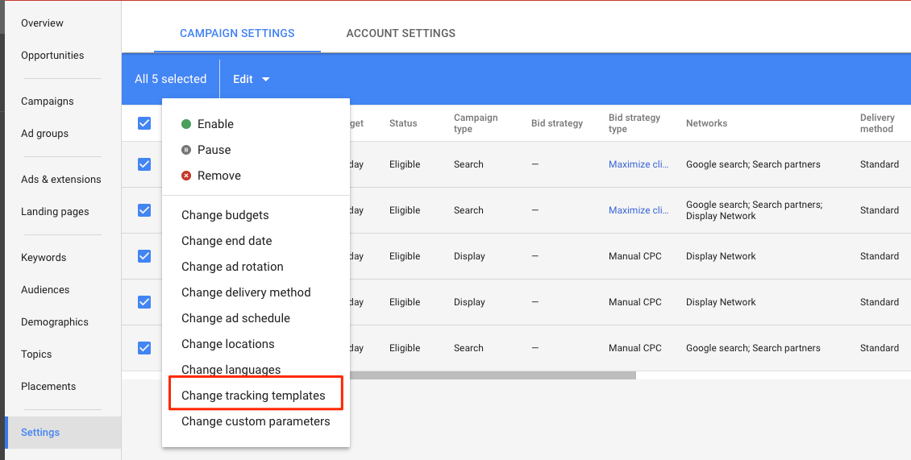

# 이해 [!DNL Marketo Measure] AdWords 태그 지정 {#understanding-marketo-measure-adwords-tagging}

광고를 세분화된 수준에서 추적하려면 광고 대상 URL이 고유해야 합니다. 이 작업을 수행하려면 [!DNL Marketo Measure] 자동 태그 지정은 추적 매개 변수를 의 광고 대상 URL에 자동으로 추가합니다. [!DNL AdWords] 광고. 아래의 예를 살펴보겠습니다.

다음 URL은 세부적인 데이터를 제공하지 않습니다.

* `http://example.com/landing-page?myParam=foo`

하지만, 동일한 URL은 다음과 같은 이유로 세분화된 데이터를 제공합니다. [!DNL Marketo Measure] 매개 변수:

* `http://example.com/landing-page?myParam=foo&_bt={creative}&_bk={keyword}&_bm={matchtype}&_bn={network}&_bg={adgroupid}`

## 방법 [!DNL Marketo Measure] 자동 태그 지정 작동 방식 {#how-marketo-measure-auto-tagging-works}

**If [!DNL Marketo Measure] 추적 템플릿을 찾습니다.**

* [!DNL Marketo Measure] 는 추적 템플릿에 해당 매개 변수를 추가합니다.
* 서드파티 리디렉션이 Kenshoo 또는 Marin과 같은 추적 템플릿에 있는 경우 [!DNL Marketo Measure] 아무 조치도 취하지 않습니다. 대신, [추가 [!DNL Marketo Measure] 계정의 타사 도구에 대한 매개 변수](/help/api-connections/utilizing-marketo-measures-api-connections/how-bid-management-tools-affect-marketo-measure.md){target="_blank"}.

하지만 추적 템플릿을 찾을 수 없으면 [!DNL Marketo Measure] 이(가) 다음을 수행합니다.

* 모든 광고 대상 URL에서 [!DNL Marketo Measure] 매개 변수.
* 발견되면 가셔도 좋습니다.
* 찾을 수 없는 경우, [!DNL Marketo Measure] 는 광고 대상 URL의 끝에 매개 변수를 추가합니다. 새 광고의 경우, [!DNL Marketo Measure] 광고 대상 URL을 만든 후 2시간 이내에 매개 변수를 추가합니다.
* 자동 태그 지정을 활성화하기 전에 추적 템플릿을 준비하여 [!DNL Marketo Measure] 를 첨부하고 광고 내역을 재설정하지 못하도록 할 수 있습니다.

[!DNL Marketo Measure] 는 광고 기록이 중단되거나 삭제될 위험 없이 모든 광고에 대한 매개 변수를 추가하거나 뺄 수 있으므로 계정 수준, 캠페인 수준 또는 광고 그룹 수준 추적 템플릿을 사용할 것을 권장합니다.

## 추적 템플릿 {#tracking-templates}

에 의해 설명됨 [!DNL Google AdWords], 추적 템플릿은 랜딩 페이지에 도달하기 위해 사용되는 URL입니다. 수집된 추적 정보는 광고 트래픽을 이해하는 데 사용됩니다. [여기를 클릭하십시오.](https://support.google.com/adwords/answer/7197008?hl=en){target="_blank"} Google에서 추가 정보를 확인하십시오.

[!DNL Marketo Measure] 는 광고 기록이 중단되거나 삭제될 위험 없이 모든 광고에 대한 매개 변수를 추가하거나 뺄 수 있으므로 계정 수준, 캠페인 수준 또는 광고 그룹 수준 추적 템플릿을 사용할 것을 권장합니다.

두 개의 추적 템플릿이 있습니다 [!DNL Marketo Measure] 는 를 사용할 것을 권장합니다. 적합한 버전을 결정하려면 다음 사항을 사용하십시오.

* 모든 광고 URL에 &quot;?&quot;가 있는 경우 여기에서 다음 URL을 사용합니다.

`{lpurl}&_bt={creative}&_bk={keyword}&_bm={matchtype}&_bn={network}&_bg={adgroupid}`

* 광고 URL 중 &quot;?&quot;가 없는 경우 여기에서 다음 URL을 사용합니다.

`{lpurl}?_bt={creative}&_bk={keyword}&_bm={matchtype}&_bn={network}&_bg={adgroupid}`

## 계정 레벨에서 추적 템플릿 설정 {#setting-up-a-tracking-template-at-the-account-level}

1. 에 로그인 [!DNL Google AdWords] 계정.

1. 클릭 **[!UICONTROL All campaigns]** 그런 다음 **[!UICONTROL Settings]** 확장 창에서 을 클릭합니다.

   

1. 클릭 **[!UICONTROL Account Settings]** 맨 위에 **[!UICONTROL Tracking Template]**. 다음을 입력합니다. [!DNL Marketo Measure] 추적 템플릿.

   

1. 클릭 **[!UICONTROL Save]**.

## 캠페인 수준에서 추적 템플릿 설정 {#setting-up-a-tracking-template-at-the-campaign-level}

1. 클릭 **[!UICONTROL All campaigns]** 그런 다음 **[!UICONTROL Campaigns]** 확장 창에서 을 클릭합니다.

   

1. 적용 가능한 모든 캠페인 선택 또는 **[!UICONTROL Select All]**, 클릭 **[!UICONTROL Edit]**&#x200B;을 클릭한 다음 을 클릭합니다 **[!UICONTROL Change Tracking Templates]**.

   

1. 다음을 입력합니다. [!DNL Marketo Measure] 추적 템플릿 및 클릭 **[!UICONTROL Apply]**.

## 광고 그룹 수준에서 추적 템플릿 설정: {#setting-up-a-tracking-template-at-the-ad-group-level}

1. 클릭 **[!UICONTROL All campaigns]** 그런 다음 **[!UICONTROL Ad Groups]** 확장 창에서 을 클릭합니다.

   

1. 적용 가능한 광고 그룹을 모두 선택하거나 모두 선택 을 클릭하고 **[!UICONTROL Edit]** 그런 다음 을 클릭합니다. **[!UICONTROL Change Tracking Templates]**.

1. 다음을 입력합니다. [!DNL Marketo Measure] 추적 템플릿 및 클릭 **[!UICONTROL Apply]**.

   

## FAQ {#faq}

**Q: 연결된 사용자에게 필요한 권한은 무엇입니까?**

A: userinfo.email

**Q: 지출 데이터를 가져오는 데 얼마나 걸릴 수 있습니까?**

A: 6시간

**Q: 광고 데이터를 가져오는 데 얼마나 걸릴 수 있습니까?**

A: 4시간

**Q: Dynamic Search Ads의 경우, 제공된 크리에이티브에서 헤드라인, 설명 등의 조합을 추적할 수 있습니까?**

A: 동적 검색 광고에 대한 개별 크리에이티브 세부 정보를 검색할 수 없지만 자동 태깅이 활성화된 경우 크리에이티브 ID 및 속성 매출을 가져올 수 있습니다.

>[!NOTE]
>
>변경이 완료되면 완료됩니다. 다음에 언제든지 연락하십시오. [Marketo 지원](https://nation.marketo.com/t5/support/ct-p/Support){target="_blank"} 설정하는 동안 질문이 있는 경우.

[여기를 클릭하십시오.](https://support.google.com/adwords/answer/6076199?hl=en#tracking){target="_blank"} 계정 수준 추적 템플릿 만들기에 대한 Google의 지침.
