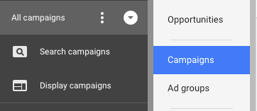

# 이해 [!DNL Marketo Measure] AdWords 태그 지정 {#understanding-marketo-measure-adwords-tagging}

매우 세분화된 수준에서 광고를 추적하려면 광고 대상 URL이 고유해야 합니다. 이를 실현하려면 [!DNL Marketo Measure] 자동 태그 지정은 추적 매개 변수를 자동으로 광고 대상 URL에 추가합니다 [!DNL AdWords] 광고. 아래 예를 살펴보겠습니다.

다음 URL은 세부적인 데이터를 제공하지 않습니다.

* `http://example.com/landing-page?myParam=foo`

하지만 동일한 URL은 [!DNL Marketo Measure] 매개 변수:

* `http://example.com/landing-page?myParam=foo&_bt={creative}&_bk={keyword}&_bm={matchtype}&_bn={network}&_bg={adgroupid}`

## 방법 [!DNL Marketo Measure] 자동 태그 지정 작동 {#how-marketo-measure-auto-tagging-works}

**If [!DNL Marketo Measure] 추적 템플릿을 찾습니다.**

* [!DNL Marketo Measure] 은 추적 템플릿에 해당 매개 변수를 추가합니다.
* Kenshoo 또는 Marin과 같은 추적 템플릿에 타사 리디렉션이 있는 경우, [!DNL Marketo Measure] 아무 조치도 취하지 않을 것입니다. 대신 다음을 수행해야 합니다. [추가 [!DNL Marketo Measure] 계정에서 타사 도구에 매개 변수를 채우는 방법을 설명합니다.](/help/api-connections/utilizing-marketo-measures-api-connections/how-bid-management-tools-affect-marketo-measure.md){target=&quot;_blank&quot;}.

그러나 추적 템플릿이 없으면 [!DNL Marketo Measure] 다음 작업을 수행합니다.

* Adobe의 모든 광고 대상 URL 검색 [!DNL Marketo Measure] 매개 변수.
* 만약 발견된다면, 가도 좋다.
* 찾을 수 없으면 [!DNL Marketo Measure] 은 해당 매개 변수를 광고 대상 URL의 끝에 추가합니다. 새 광고의 경우, [!DNL Marketo Measure] 은(는) 작성 후 2시간 내에 광고 대상 URL에 매개 변수를 추가합니다.
* 자동 태깅을 활성화하기 전에 추적 템플릿이 적절하게 있어야 합니다 [!DNL Marketo Measure] 에 연결하고 광고 기록이 재설정되지 않도록 할 수 있습니다.

[!DNL Marketo Measure] 광고 기록 중단 또는 삭제 위험 없이 모든 광고에 대한 매개 변수를 추가 및 빼는 것을 허용하므로 계정 수준, 캠페인 수준 또는 광고 그룹 수준 추적 템플릿을 사용하는 것이 좋습니다.

## 추적 템플릿 {#tracking-templates}

설명 [!DNL Google AdWords]: 추적 템플릿은 랜딩 페이지에 도달하는 데 사용되는 URL입니다. 수집된 추적 정보는 광고 트래픽을 이해하는 데 사용됩니다. [여기를 클릭하십시오.](https://support.google.com/adwords/answer/7197008?hl=en){target=&quot;_blank&quot;} 을 참조하십시오. Google

[!DNL Marketo Measure] 광고 기록 중단 또는 삭제 위험 없이 모든 광고에 대한 매개 변수를 추가 및 감산할 수 있으므로 계정 수준, 캠페인 수준 또는 광고 그룹 수준 추적 템플릿을 사용하는 것이 좋습니다.

두 개의 추적 템플릿이 있습니다 [!DNL Marketo Measure] 을 사용하는 것이 좋습니다. 적합한 버전을 확인하려면 다음을 사용하십시오.

* 모든 광고 URL에 &quot;?&quot;가 있는 경우 이 URL에서 다음 URL을 사용합니다.

`{lpurl}&_bt={creative}&_bk={keyword}&_bm={matchtype}&_bn={network}&_bg={adgroupid}`

* 광고 URL에 &quot;?&quot;가 없는 경우 이 URL에서 다음 URL을 사용합니다.

`{lpurl}?_bt={creative}&_bk={keyword}&_bm={matchtype}&_bn={network}&_bg={adgroupid}`

## 계정 수준에서 추적 템플릿 설정 {#setting-up-a-tracking-template-at-the-account-level}

1. 에 로그인합니다. [!DNL Google AdWords] 계정.

1. 클릭 **[!UICONTROL All campaigns]** 그리고 **[!UICONTROL Settings]** 확장 창

   

1. 클릭 **[!UICONTROL Account Settings]** 그리고 나서 **[!UICONTROL Tracking Template]**. 을(를) 입력합니다. [!DNL Marketo Measure] 추적 템플릿.

   

1. 클릭 **[!UICONTROL Save]**.

## 캠페인 수준에서 추적 템플릿 설정 {#setting-up-a-tracking-template-at-the-campaign-level}

1. 클릭 **[!UICONTROL All campaigns]** 그리고 **[!UICONTROL Campaigns]** 확장 창

   

1. 적용 가능한 모든 캠페인 선택 또는 **[!UICONTROL Select All]**&#x200B;를 클릭합니다. **[!UICONTROL Edit]**&#x200B;를 클릭한 다음 **[!UICONTROL Change Tracking Templates]**.

   

1. 을(를) 입력합니다. [!DNL Marketo Measure] 템플릿 추적 을 클릭하고 **[!UICONTROL Apply]**.

## 광고 그룹 수준에서 추적 템플릿 설정: {#setting-up-a-tracking-template-at-the-ad-group-level}

1. 클릭 **[!UICONTROL All campaigns]** 그리고 **[!UICONTROL Ad Groups]** 확장 창

   

1. 적용 가능한 모든 광고 그룹을 선택하거나 모두 선택에서 **[!UICONTROL Edit]** 을 클릭한 다음 **[!UICONTROL Change Tracking Templates]**.

1. 을(를) 입력합니다. [!DNL Marketo Measure] 템플릿 추적 을 클릭하고 **[!UICONTROL Apply]**.

   

## FAQ {#faq}

**Q: 연결된 사용자에게 필요한 권한은 무엇입니까?**

A: userinfo.email

**Q: 지출 데이터를 가져오는 데 얼마나 걸립니까?**

A: 6시간

**Q: 광고 데이터를 가져오는 데 얼마나 걸립니까?**

A: 4시간

>[!NOTE]
>
>변경 사항이 적용되면 작업이 수행됩니다. 언제든지 연락하여 [Marketo 지원](https://nation.marketo.com/t5/support/ct-p/Support)설정 중에 질문이 있는 경우 {target=&quot;_blank&quot;}.

[여기를 클릭하십시오.](https://support.google.com/adwords/answer/6076199?hl=en#tracking)계정 수준 추적 템플릿 만들기에 대한 Google의 지침에 대해 {target=&quot;_blank&quot;}.
