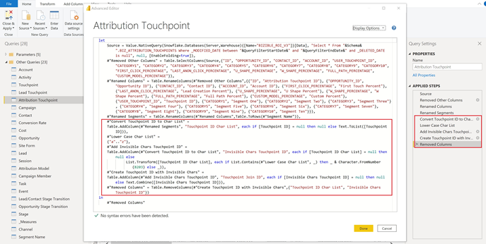
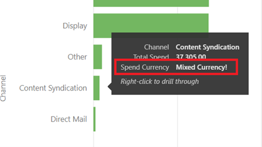

# [!DNL Marketo Measure] 보고서 템플릿 - Power BI {#marketo-measure-report-template-power-bi}

## 시작하기 {#getting-started}

Power BI 보고서 템플릿에 액세스할 수 있습니다 [여기](https://github.com/adobe/Marketo-Measure-BI-Templates){target="_blank"}.

Adobe 열기 [!DNL Marketo Measure] 보고 템플릿 Power BI 파일입니다.

에서 특정 서버, 웨어하우스 및 스키마 정보를 찾을 수 있습니다 [!DNL Marketo Measure] 의 UI [!DNL Data Warehouse] 정보 페이지. 이 페이지를 찾는 방법에 대한 지침은 자세히 설명되어 있습니다 [여기](/help/marketo-measure-data-warehouse/data-warehouse-access-reader-account.md){target="_blank"}.

가져온 데이터의 양을 제한하는 데 QueryFilterStartDate 및 QueryFilterEndDate 매개 변수를 사용합니다. 이러한 매개 변수는 보낸 쿼리에 사용되는 대로 SQL 형식이어야 합니다 [!DNL Snowflake]. 예를 들어 지난 2년으로 데이터를 제한하려면 QueryFilterStartDate는 dateadd(year,-2,current_date())입니다. 이러한 매개 변수는 datetime 데이터 형식과 비교되므로 QueryFilterEndDate에 dateadd(day,1,current_date())를 사용하여 모든 데이터를 현재 시간으로 반환하는 것이 좋습니다.

## 데이터 연결 {#data-connection}

파일을 열 때 입력한 매개 변수는 Data Warehouse에서 테이블을 가져오는 기본 쿼리를 구성하는 데 사용됩니다. 에 대한 데이터 연결을 설정해야 합니다 [!DNL Snowflake] 인스턴스. 이를 위해서는 사용자 이름 및 암호와 함께 동일한 서버 및 웨어하우스 이름이 필요합니다. 사용자 이름을 찾고 암호를 재설정할 위치에 대한 자세한 내용은 문서화되어 있습니다 [여기](/help/marketo-measure-data-warehouse/data-warehouse-access-reader-account.md){target="_blank"}.

## 데이터 가져오기 {#data-import}

보고서 성능을 향상시키고 Power Query의 변환 기능을 활용하기 위해 가져오기 저장 방법을 사용하여 이 템플릿을 설정하도록 선택했습니다.

### 쿼리 매개 변수 {#query-parameters}

모델로 가져온 데이터를 제한하려면 각 테이블이 기본 쿼리를 소스로 사용하여 설정됩니다. 기본 쿼리를 실행하려면 승인이 필요합니다. 각 쿼리에 대해 실행을 클릭해야 합니다. 이 단계는 쿼리를 처음 실행할 때 또는 매개 변수가 변경되는 경우에만 필요합니다.

모든 쿼리는 삭제된 행 및 [!UICONTROL facts] 표는 매개 변수로 입력한 시작 날짜와 종료 날짜 사이의 수정된 날짜가 있는 행으로 필터링하도록 설정됩니다.

>[!NOTE]
>
>날짜 필터는 행의 수정된 날짜에 적용되므로 제한된 날짜 범위를 벗어나는 날짜에 대해 보고할 때 주의하십시오. 예를 들어 수정된 날짜 범위는 최근 2년으로 제한됩니다. 여기에는 이벤트 날짜가 3년 전이지만 최근에 수정된 이벤트가 포함될 수 있습니다. 그러나 3년 전의 이벤트에 대한 보고에서는 2년 기간 내에 모든 행이 수정되지는 않으므로 불완전한 결과를 반환합니다.

다음 표는 사실 표로 처리됩니다. 수정된 날짜에 대한 날짜 제한이 이러한 쿼리에 추가되었습니다.

* 활동
* 터치 포인트
* 리드 터치포인트
* 속성 터치포인트
* 비용
* 사이트 양식
* Session
* 캠페인 구성원
* 작업
* Event
* 리드/연락처 단계 전환
* 영업 기회 단계 전환

다음 테이블은 차원 테이블로 처리됩니다. 이러한 쿼리에 대해 날짜 제한이 설정되지 않습니다.

* 계정
* 캠페인
* 연락처
* 전환율
* 기회
* 리드
* 단계
* 채널

## 데이터 변환 {#data-transformations}

Power Query의 데이터에 몇 가지 변형이 적용되었습니다. 테이블에 대한 특정 변환을 보려면 Power Query를 열고 테이블로 이동한 다음 창의 왼쪽에 적용된 단계를 확인합니다. 특정 변형 중 일부는 아래에 요약되어 있습니다.

### 제거된 열 {#removed-columns}

데이터 모델을 단순화하고 중복 및 불필요한 데이터를 제거하기 위해 원본에서 Power BI으로 가져온 열 수를 줄였습니다 [!DNL Snowflake] 테이블. 제거된 열에는 불필요한 외래 키, 모델의 다른 테이블, 감사 열 및 내부용으로 사용되는 필드에 대한 관계를 통해 더 잘 활용되는 비정규화된 차원 데이터가 포함됩니다 [!DNL Marketo Measure] 처리 중입니다. 비즈니스 요구 사항에 따라 열을 추가하거나 제거할 수 있습니다. 테이블의 &quot;소스&quot; 단계 후 &quot;제거된 다른 열&quot; 단계로 이동하고 톱니바퀴 아이콘을 클릭하고 제공된 목록에서 선택한 열을 업데이트합니다.

>[!NOTE]
>
>* 외래 키 값을 추가할 때는 주의하십시오. Power BI은 종종 모델의 관계를 자동으로 검색하도록 설정되어 있고 외래 키 값을 추가하면 테이블 간의 불필요한 링크가 발생하거나 기존 관계가 비활성화될 수 있습니다.
>
>* 의 대부분의 표 [!DNL Marketo Measure] 데이터 웨어하우스에 비정규화된 차원 데이터가 포함되어 있습니다. Dell은 성능 및 데이터 정확성을 향상시키기 위해 Power BI에서 모델을 최대한 정규화하고 정리하기 위해 노력하고 있습니다. 따라서 팩트 테이블에 추가로 비정규화된 필드를 포함할 때 주의하십시오. 이 경우 테이블 간의 차원 필터링이 중단되며 부정확한 보고가 발생할 수도 있습니다.

### 이름이 변경된 열 {#renamed-columns}

테이블 및 열의 이름을 사용자 친화적으로 변경하고 이름 지정 규칙을 표준화했습니다. 열 이름 변경 사항을 보려면 테이블의 &quot;제거된 다른 열&quot; 단계 후 &quot;이름이 변경된 열&quot; 단계로 이동합니다.

### 이름이 변경된 세그먼트 {#renamed-segments}

세그먼트 이름은 사용자 지정할 수 있으므로 Snowflake 데이터 웨어하우스에 일반 열 이름이 있습니다. [!DNL BIZ_SEGMENT_NAMES] 는 의 세그먼트 섹션에 정의된 일반 세그먼트 이름과 매핑된 사용자 지정 세그먼트 이름을 나열하는 매핑 테이블입니다 [!DNL Marketo Measure] UI. 세그먼트 이름 테이블은 리드 터치 포인트 및 속성 터치 포인트 테이블의 세그먼트 열 이름을 바꾸는 데 사용됩니다. 사용자 지정된 세그먼트가 없는 경우 일반 세그먼트 이름은 그대로 유지됩니다.

### 대/소문자 구분 ID 전환 {#case-sensitive-id-conversion}

[!DNL Marketo Measure] 데이터에는 기본 키(ID) 값이 대소문자를 구분하는 두 개의 테이블, 즉 Touchpoint 및 Campaign이 있습니다. Power BI 모델링 레이어를 구동하는 데이터 엔진은 대/소문자를 구분하지 않으므로 &quot;중복된&quot; ID 값이 발생합니다. 이러한 키 값의 대/소문자 구분을 보존하기 위해 데이터 엔진 계층에서 평가할 때 ID의 고유성을 유지하면서 소문자로 보이지 않는 문자를 첨부하는 변환 단계를 구현했습니다. 문제에 대한 자세한 내용과 우리가 사용한 방법에 대한 자세한 단계는 찾을 수 있습니다 [여기] (https://blog.crossjoin.co.uk/2019){target="_blank"}. 이러한 대/소문자 구분 ID 값은 &quot;조인 ID&quot;로 레이블이 지정되며, 관계 계층에서 조인 키로 사용됩니다. 보이지 않는 문자가 잘라내기/붙여넣기 함수 및 필터링을 방해할 수 있으므로 보고 레이어에서 조인 ID를 숨겨 원래 ID 값을 보고에 사용할 수 있도록 했습니다.

### 추가된 행 {#rows-added}

모델의 계산에 통화 변환 기능을 추가하기 위해 Opportunity 및 Cost 테이블에 회사 변환율 열을 추가했습니다. 이 열의 값은 행 수준에서 추가되며 날짜 및 통화 ID에서 변환율 테이블에 가입하여 평가됩니다. 이 모델에서 통화 전환이 작동하는 방식에 대한 자세한 내용은 [통화 전환](#currency-conversion) 섹션을 참조하십시오.

에 저장된 변환율 테이블 [!DNL Snowflake] 각 변환에 대한 날짜 범위를 포함합니다. Power BI은 계산에 대한 조인 기준(예: 날짜 범위 사이)을 허용하지 않습니다. 날짜에 조인하기 위해 전환 비율 테이블에 단계를 추가하여 변환 날짜 범위에 있는 각 날짜에 대해 하나의 행이 있도록 행을 확장했습니다.

## 데이터 모델 {#data-model}

전체 크기 버전을 보려면 아래 이미지를 클릭하십시오.

{target="_blank"}

### 관계 및 데이터 흐름 {#relationships-and-data-flow}

터치포인트를 만드는 데 사용되는 이벤트 데이터는 [!UICONTROL Session], [!UICONTROL Task], [!UICONTROL Event], [!UICONTROL Activity], 및 Campaign Member 테이블 을 참조하십시오. 이러한 이벤트 테이블은 해당 ID를 통해 터치포인트 테이블에 결합하고, 이벤트가 터치포인트를 일으킨 경우 세부 사항이 터치포인트 테이블에 저장됩니다.

리드 접점 및 속성 접점은 터치포인트 테이블에 대한 링크와 함께 자체 테이블에 저장됩니다. 리드 및 기여도 분석 접점에 대한 대부분의 차원 데이터는 해당 접점으로의 링크에서 소싱됩니다.

이 모델에서 Campaign 및 채널 차원은 터치 포인트에 연결되어 있으므로 이러한 차원에 대한 모든 보고는 이 링크를 통해 수행되며, 이벤트 데이터에 대한 차원 보고가 불완전할 수 있습니다. 이것은 많은 이벤트가 터치 포인트로 처리된 후에 이러한 차원에 대한 링크가 없기 때문입니다. 참고: 세션 과 같은 일부 이벤트에는 캠페인 및 채널 차원에 대한 직접 링크가 있습니다. 이러한 차원에 대한 세션 수준에서 보고가 필요한 경우, 이를 위해 별도의 데이터 모델을 만드는 것이 좋습니다.

비용 데이터는 [!DNL Snowflake] data warehouse 비용 테이블. 모든 광고 공급자에 대해 캠페인 수준 데이터를 채널 수준으로 롤업할 수 있습니다. 이러한 이유로 이 모델은 &quot;campaign_is_aggregatable_cost&quot; 플래그를 기반으로 비용 데이터를 가져옵니다. 자체 보고된 비용은 채널 수준에서만 제출할 수 있으며 Campaign 데이터가 필요하지 않습니다. 가장 정확한 원가 보고를 제공하기 위해 &quot;channel_is_aggregatable_cost&quot; 플래그를 기반으로 자동 보고된 비용을 가져옵니다. 비용 데이터를 가져오는 쿼리는 다음 논리를 사용하여 작성됩니다. ad_provider = &quot;SelfReported&quot;일 경우 channel_is_aggregatable_cost = true, else campaign_is_aggregatable_cost = true입니다.

비용 데이터 및 터치 포인트 데이터에는 몇 가지 공통 차원이 있으므로 두 사실 테이블은 캠페인 및 채널 차원 테이블과 관계를 갖습니다.

이 모델의 컨텍스트 내에서 [!UICONTROL Lead], [!UICONTROL Contact], [!UICONTROL Account], 및 [!UICONTROL Opportunity] 데이터는 차원 데이터로 간주되며, 에 직접 연결됩니다 [!UICONTROL Lead] 터치 포인트 및 [!UICONTROL Attribution] 터치포인트 테이블.

### 추가된 표 {#added-tables}

**날짜**

Power BI은 한 열의 테이블 간 관계만 허용하므로 금액(기회 및 비용)이 포함된 테이블과 전환율 테이블 간에 필요한 조인을 용이하게 하기 위해 날짜 차원 테이블이 추가되었습니다. 이 모델에서 통화 변환을 계산하는 방법에 대한 자세한 내용은 통화 변환 섹션을 참조하십시오.

**측정**

모든 측정 단위가 전용 측정 단위 테이블에 추가되었습니다. 이 모델은 모델에 연결되어 있지 않지만 모든 측정값을 쉽게 저장할 수 있는 단일 위치 역할을 합니다.

**속성 모델**

속성 모델의 이름을 저장하기 위해 별도의 테이블이 추가되었습니다. 이 표는 사용자가 속성 수입 계산을 위해 속성 모델 간을 전환할 수 있는 필터를 만드는 데 사용됩니다.

### 통화 전환 {#currency-conversion}

변환율 테이블의 환율은 법인 통화에서 금액을 변환하는 데 필요한 값을 나타냅니다. 모든 통화로 전환하려면 먼저 원래 통화에서 법인 통화로 전환한 다음 회사 통화에서 선택한 통화로 이중 전환이 필요합니다. 모델의 이 체인에서 첫 번째 단계는 변환 비율이 있는 열을 금액, 기회 및 비용이 있는 테이블에 추가하는 것입니다. 이러한 단계는 이 문서의 데이터 변환 섹션의 추가된 행 헤더에 자세히 설명되어 있습니다. 원래 통화에서 회사 통화로 전환하는 것은 값을 이 추가된 열로 나누는 것으로 구성됩니다. 다음 단계는 선택한 통화에 해당하는 [변환율] 테이블의 환율에 회사 통화 값을 곱하는 것입니다.

* 원래 값을 법인 통화 값/회사 전환율 = 법인 통화로 변환합니다.
* 법인 통화에서 선택한 통화 값으로 값을 변환합니다 `*` 선택한 통화의 전환율 = 선택한 통화로 표시된 값

전환율은 정적이 아니어야 하며, 지정된 날짜 범위에 따라 변경할 수 있으므로 모든 통화 변환 계산은 행 수준에서 수행해야 합니다. 다시 말하지만, 전환율은 특정 날짜 범위에 속하므로, 측정 단위의 DAX 내에서 조회 계산을 수행해야 하므로, 통화 코드와 날짜 모두에서 관계를 정의할 수 있습니다.

이 모델의 통화 변환 측정은 변환율을 식별할 수 없는 경우 환율을 1.0으로 바꿉니다. 측정값에 대한 통화 값을 표시하기 위해 별도의 측정값이 생성되었으며, 계산에 둘 이상의 통화 값이 포함되어 있는 경우(즉, 값을 선택한 통화로 변환할 수 없음) 경고가 표시됩니다.

## 데이터 정의 {#data-definitions}

테이블, 사용자 정의 열 및 측정에 대한 Power BI 모델에 정의가 추가되었습니다.

에서 바로 오는 열에 대한 정의를 보려면 [!DNL Snowflake]를 보려면 [data warehouse 설명서](/help/marketo-measure-data-warehouse/data-warehouse-schema.md){target="_blank"}

## 템플릿과 검색 간의 불일치 {#discrepancies-between-templates-and-discover}

### 귀속 수입 {#attributed-revenue}

리드 터치포인트 및 속성 터치포인트는 원래 터치포인트에서 차원 데이터를 상속합니다. 보고 템플릿 모델은 관계에서 터치 포인트에 대해 상속된 모든 차원 데이터를 제공하는 반면, 검색 모델에서 차원 데이터는 리드 및 속성 터치 포인트 레코드에 정규화됩니다. 전체 예상 매출액 또는 특성 파이프라인 수익 값은 두 보고서 간에 정렬되어야 합니다. 하지만 매출이 차원 데이터(채널, 하위 채널 또는 캠페인)로 분류되거나 필터링되면 불일치를 관찰할 수 있습니다. 차원 매출 금액이 템플릿과 검색 간에 일치하지 않는 경우 템플릿 보고서 데이터 세트에 터치 포인트 레코드가 누락될 수 있습니다. 이 문제는 리드 또는 속성 터치 포인트 레코드가 있지만 보고서로 가져온 데이터 세트 내의 터치 포인트 테이블에 해당 레코드가 없을 때 발생합니다. 이러한 표는 수정된 날짜로 필터링되므로 리드/기여도 분석 터치포인트 레코드가 터치포인트 레코드보다 더 최근에 수정되었을 수 있으며, 따라서 리드/기여도 분석 터치포인트를 원래 터치포인트 레코드가 아닌 데이터 세트로 가져올 수 있습니다. 이 문제를 해결하려면 터치 포인트 테이블의 필터링된 날짜 범위를 확장하거나 날짜 제한을 모두 함께 제거하는 것이 좋습니다. 참고: Touchpoint는 큰 테이블이므로 더 완전한 데이터 세트와 가져와야 하는 데이터의 양을 고려해 보십시오.

### 비용 {#cost}

템플릿의 비용 보고는 캠페인 및 채널 수준에서만 사용할 수 있지만, Discover에서는 일부 광고 공급자(예: 광고, 키워드, 광고 그룹 등)에 대해 더 낮은 수준의 세부기간 보고를 제공합니다. 템플릿에서 비용 데이터를 모델링하는 방법에 대한 자세한 내용은 이 설명서의 데이터 모델 섹션을 참조하십시오. 차원 필터인 경우 [!UICONTROL Discover] 가 채널 또는 캠페인으로 설정되면, 채널, 하위 채널 및 캠페인 수준의 비용이 Discover와 보고서 템플릿 간에 연결되어야 합니다.

### ROI {#roi}

ROI는 속성 수익과 비용으로 계산되므로, 해당 섹션에서 설명한 바와 같이 ROI와 동일한 이유로 인해 이러한 계산에서 발생할 수 있는 동일한 불일치가 발생할 수 있습니다.

### 터치포인트 {#touchpoints}

보고 템플릿에 표시된 대로 이러한 지표는 Discover에서 미러링되지 않습니다. 현재 그 둘 사이에는 직접적인 비교가 없다.

### 웹 트래픽 {#web-traffic}

보고 템플릿 데이터 모델은 세션과 터치포인트 간의 관계를 통해 채널, 하위 채널 및 캠페인 차원 데이터를 표준화합니다. 이 차원은 세션으로 비정규화하는 Discover 데이터 모델과 다릅니다. 이러한 차이로 인해 방문 및 방문자에 대한 전체 카운트는 Discover와 보고 템플릿 간에 일치해야 하지만, 차원별로 표시되거나 필터링되면 이러한 숫자가 일치하지 않을 수 있습니다. 템플릿의 차원 데이터는 터치포인트를 초래한 웹 이벤트(즉, 익명의 이벤트가 아닌 이벤트)에만 사용할 수 있기 때문입니다. 자세한 내용은 [데이터 모델](#data-model) 섹션을 참조하십시오.

총 사이트 양식 수 간에 불일치가 약간 있을 수 있습니다 [!DNL Discover] 및 템플릿을 선택합니다. 보고 템플릿의 데이터 모델이 세션 및 터치 포인트에 대한 관계를 통해 사이트 양식에 대한 차원 데이터를 가져오기 때문입니다. 사이트 양식 데이터에 상관 관계가 있는 세션이 없는 인스턴스가 몇 개 있습니다.

### 리드 및 계정 {#leads-and-accounts}

터치된 계정에 대한 차원 보고는 Discover와 템플릿 간에 약간 다를 수 있으며, 이것은 Touchpoint와 Lead Touchpoint 또는 Attribution Touchpoint 간의 관계에서 나오는 차원 모델링으로 인해 다시 발생합니다. 자세한 내용은 특성 매출 섹션에 설명된 세부 사항을 참조하십시오.

Discover의 모든 리드 수는 리드 카운트로 분류되며, 보고 템플릿에서 지표가 리드를 터치합니다. 따라서 이 측정값에 대한 두 보고서 간에는 직접적인 비교가 없습니다.

### 참여 경로 {#engagement-path}

와 는 직접적인 비교가 없다 [!UICONTROL Engagement Path] 검색 및 템플릿의 보고서. 의 보고서 [!DNL Discover] 은 터치 포인트를 모델링하고 템플릿의 보고서는 속성 터치 포인트를 모델링합니다. 템플릿은 모든 터치 포인트 데이터를 표시하는 대신 기회와 관련 터치 포인트에 중점을 둡니다.

### 거래 속도 {#deal-velocity}

템플릿의 이 보고서와 Discover의 Velocity 대시보드의 Deal Velocity 타일 간에 차이가 없어야 합니다.
