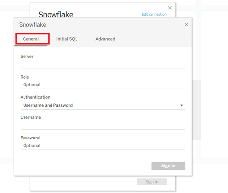

# [!DNL Marketo Measure] 보고서 템플릿 - 타블로 {#marketo-measure-report-template-tableau}

## 시작 {#getting-started}

다음에 액세스할 수 있습니다. [!DNL Tableau] 보고서 템플릿 [여기](https://github.com/adobe/Marketo-Measure-BI-Templates){target="_blank"}.

를 엽니다. [!DNL Adobe Marketo Measure] 보고 템플릿 타블로 통합 문서 파일.

기존 연결 데이터를 특정 Snowflake 연결 정보로 업데이트해야 합니다. 다음을 클릭합니다. [!UICONTROL Edit Connection] 버튼을 누르고 다음에 설명된 단계를 수행합니다. [[!UICONTROL Data Connection]](#data-connection) 섹션에 자세히 설명되어 있습니다.


## 데이터 연결 {#data-connection}

Snowflake 인스턴스에 데이터 연결을 설정해야 합니다. 이 경우 사용자 이름 및 암호와 함께 서버 이름이 필요합니다. 필요한 경우 이 정보를 찾고 암호를 재설정하는 위치에 대한 세부 정보가 문서화되어 있습니다 [여기](/help/marketo-measure-data-warehouse/data-warehouse-access-reader-account.md){target="_blank"}.



초기 SQL 명령도 입력해야 합니다. 이렇게 하면 이 데이터 모델에서 사용자 지정 쿼리를 사용할 수 있습니다. 입력할 명령은 &quot;스키마 사용&quot;입니다. `<your schema name>`&quot;. 에서 스키마 이름을 찾을 수 있습니다. [!UICONTROL data warehouse connections] 페이지. 위에서 참조한 설명서를 참조하십시오.


### 사용자 지정 SQL 쿼리 {#custom-sql-queries}

이유 [!DNL Tableau] 데이터 소스 필터를 필터가 설정된 개별 테이블이 아닌 전체 쿼리에 적용합니다. 모델의 각 테이블에 대해 사용자 지정 SQL을 사용하도록 선택했습니다. 이렇게 하면 모델이 테이블 수준에서 삭제 및 중복 행을 필터링할 수 있습니다. 예를 들어 데이터 소스 필터로 적용되는 경우 세션입니다._deleted_date is null이 쿼리의 where 절에 추가되어 다음 쿼리가 생성됩니다.

**데이터 소스에 추가된 필터**

```
--A deleted session removes this row completely and the touchpoint data is lost. Select *
   From Touchpoint    tp
      join Session sn
      on tp.session_id = sn.session_id 
 Where tp._deleted_date is null
    and sn._deleted_date is null
```

단, 세션이 삭제되었지만 해당 터치포인트가 삭제되지 않은 경우 터치포인트 데이터가 데이터 세트에서 제거된다는 점에서 올바르지 않습니다. 터치포인트가 삭제되지 않았으므로 데이터 세트에 터치포인트 데이터가 있기를 바랍니다. 사용자 정의 SQL을 추가하면 필터 기준이 테이블 수준에서 적용되므로 다음 쿼리가 생성됩니다.

**맞춤형 SQL을 통해 적용된 필터**

```
--A deleted session only removes the session related data, and the touchpoint data is preserved. Select *
   From Touchpoint       tp
      join Session sn
      on tp.session_id          = sn.session_id 
      and sn._deleted_date      is null
  Where tp._deleted_date is null
```

## 데이터 변환 {#data-transformations}

의 데이터에 몇 가지 변형이 적용되었습니다. [!DNL Tableau] snowflake의 원래 상태에서. 이러한 변환의 대부분은 사용자 정의 SQL 쿼리에 적용되며 [!DNL Tableau] 모델. 테이블을 생성하는 데 사용되는 사용자 정의 SQL을 보려면 테이블 이름을 마우스 오른쪽 단추로 누르고 &quot;사용자 정의 SQL 쿼리 편집&quot;을 선택합니다. 구체적인 변환의 일부는 아래에 요약되어 있습니다.


### 제거된 열 {#removed-columns}

데이터 모델을 단순화하고 중복되고 불필요한 데이터를 제거하기 위해 원래 Snowflake 테이블에서 Tableau로 가져온 열의 수를 줄였습니다. 제거된 열에는 불필요한 외래 키, 모델의 다른 테이블과의 관계를 통해 더 잘 활용되는 비정규화된 차원 데이터, 감사 열 및 내부용으로 사용되는 필드가 포함됩니다 [!DNL Marketo Measure] 처리 중입니다. 사용자 정의 SQL의 선택 섹션에서 가져온 열 목록을 편집하여 비즈니스 요구에 맞게 열을 추가하거나 제거할 수 있습니다.

>[!NOTE]
>
>Data Warehouse의 대부분의 테이블에는 비정규화된 차원 데이터가 포함되어 있습니다. 의 모델을 정상화하고 정리하기 위해 노력했습니다. [!DNL Tableau] 가능한 한 성능 및 데이터 정확도를 향상시킵니다. 팩트 테이블에 비정규화된 필드를 추가로 포함할 때 주의하십시오. 이렇게 하면 테이블 간 차원 필터링이 중단되고 보고가 부정확해질 수 있습니다.

### 이름이 변경된 열 {#renamed-columns}

표 및 열의 이름을 사용자 친화적으로 변경하고 이름 지정 규칙을 표준화하기 위해 변경했습니다. 열 이름 변경 사항을 보려면 테이블을 생성하는 사용자 지정 SQL 문을 참조하십시오.

### 행 추가됨 {#rows-added}

모델의 계산에 통화 변환 기능을 추가하기 위해 회사 변환율과 대상 변환율 열을 영업 기회 및 비용 테이블 모두에 추가했습니다. 이 열의 값은 행 수준에서 추가되며 날짜 및 통화 ID의 전환율 테이블에 연결하여 평가됩니다. Tableau에서는 팩트 테이블이 두 개 이상의 차원 테이블을 공유할 수 없으므로 변환율은 이를 사용하는 테이블에 직접 추가되었습니다. 이 모델에서 통화 변환이 작동하는 방식에 대한 자세한 내용은 [통화 전환](#currency-conversion) 섹션 을 참조하십시오.


두 개의 테이블이 있는 곳이 몇 군데 있습니다 [!DNL Snowflake] 이(가) 조합과 결합하여 [!DNL Tableau] 데이터 모델. 이러한 경우, &quot;유형&quot; 열이 추가되어 [!DNL Snowflake] 출처 테이블 및 행이 나타내는 엔티티를 지정합니다. 결합된 테이블에 대한 자세한 내용은 이 설명서의 관계 및 데이터 흐름 섹션을 참조하십시오.


### 세그먼트 이름 {#segment-names}

세그먼트 이름은 사용자 지정할 수 있으므로 Snowflake 데이터 웨어하우스에 일반 열 이름이 있습니다. [!DNL BIZ_SEGMENT_NAMES] 는 의 세그먼트 섹션에 정의된 대로 매핑되어 있는 사용자 정의된 세그먼트 이름과 일반 세그먼트 이름을 나열하는 매핑 테이블입니다. [!DNL Marketo Measure] UI. 사용자 정의 세그먼트 이름을 사용하고 [!DNL Tableau] 모델을 통합하려면 이 표를 사용하고 타블로 모델 내의 열 이름을 수동으로 바꾸십시오. 세그먼트 열은 리드 및 속성 접점 테이블에 있으며, 이름을 한 번만 변경하면 됩니다.

다음 [!UICONTROL CATEGORY] 열에는 범주 번호가 나열되며 SEGMENT_NAME 열에는 매핑되는 사용자 정의 세그먼트 이름이 있습니다.


이름은 두 가지 방법으로 업데이트할 수 있습니다. 첫 번째 옵션은 사용자 지정 SQL을 업데이트하는 것입니다. 이 예에서 카테고리 1-6의 이름은 세그먼트 이름 테이블의 매핑을 기반으로 변경되었습니다.


다른 옵션은 의 열 이름을 직접 바꾸는 것입니다. [!DNL Tableau] 테이블.


## 데이터 모델 {#data-model}

전체 크기 버전을 보려면 아래 이미지를 클릭하십시오.

[](/help/bi-report-templates/assets/tableau-data-model.png){target="_blank"}

### 관계 및 데이터 흐름 {#relationships-and-data-flow}

터치포인트를 만드는 데 사용되는 이벤트 데이터는 [!UICONTROL Session], [!UICONTROL Task], [!UICONTROL Event], [!UICONTROL Activity], 및 [!UICONTROL Campaign Member] 테이블. 이러한 이벤트 테이블은 해당 ID를 통해 터치포인트 테이블에 연결되며, 이벤트에서 터치포인트가 발생한 경우 세부 사항이 터치포인트 테이블에 저장됩니다.

리드 터치포인트 및 속성 터치포인트는 터치포인트 테이블에 대한 링크가 있는 이 모델의 한 테이블에 결합됩니다. 행이 잠재 고객 또는 속성 터치포인트인지 여부를 지정하기 위해 &quot;터치포인트 유형&quot; 열이 추가되었습니다. 리드 및 속성 터치포인트에 대한 대부분의 차원 데이터는 해당 링크에서 해당 터치포인트로 가져온 것입니다.

Opportunity Stage Transitions 및 Lead Stage Transitions 는 다음 링크와 함께 이 모델의 한 테이블에 결합됩니다. [!UICONTROL Lead and Attribution] 접점 테이블. 행이 Opportunity 또는 Lead 단계 전환인지 여부를 지정하기 위해 &quot;Transition Type&quot; 열이 추가되었습니다.

비용 및 접점 데이터 모두 채널 및 캠페인 차원을 공유합니다. 그러나 Tableau는 팩트 테이블 간의 공유 차원을 모델링하는 기능이 제한됩니다. 공유된 차원 테이블은 하나로만 제한되므로 채널 및 캠페인 데이터가 하나의 테이블로 결합되었습니다. 두 차원은 Tableau에서 채널 및 캠페인의 두 차원의 상호 결합을 사용하여 하나의 테이블로 결합됩니다. 채널 ID와 캠페인 ID를 연결하여 고유 ID를 만듭니다. 동일한 id 값이 접점 및 비용 테이블 모두에 추가되어 이 결합된 차원 테이블에 대한 관계를 만듭니다.


이 모델에서 Campaign 및 채널 차원은 터치포인트에 연결되어 있으므로 이러한 차원에 대한 모든 보고는 이 링크를 통해 이루어지며 이벤트 데이터에 대한 차원 보고가 불완전할 수 있음을 의미합니다. 이는 많은 이벤트가 터치포인트로 처리된 후까지 이러한 차원에 대한 링크를 가지고 있지 않기 때문입니다.

>[!NOTE]
>
>세션 과 같은 일부 이벤트에는 Campaign 및 채널 차원으로 직접 연결되는 링크가 있습니다. 이러한 차원에 대한 세션 수준에서 보고하려는 경우 이를 위해 별도의 데이터 모델을 만드는 것이 좋습니다.

원가 데이터는 Snowflake 데이터 웨어하우스 원가 테이블 내의 서로 다른 총괄 레벨에 저장됩니다. 모든 광고 공급자의 경우 캠페인 수준 데이터를 채널 수준으로 롤업할 수 있습니다. 이러한 이유로 이 모델은 &quot;campaign_is_aggregatable_cost&quot; 플래그를 기반으로 비용 데이터를 가져옵니다. 자가 보고된 비용은 채널 수준에서만 제출할 수 있으며 캠페인 데이터가 필요하지 않습니다. 가능한 가장 정확한 비용 보고를 제공하기 위해 자체 보고된 비용은 &quot;channel_is_aggregatable_cost&quot; 플래그를 기반으로 가져옵니다. 비용 데이터를 가져오는 쿼리는 다음 논리로 작성됩니다. ad_provider = &quot;SelfReported&quot;일 경우 channel_is_aggregatable_cost = true, else campaign_is_aggregatable_cost = true.

이 모델의 맥락에서 리드 [!UICONTROL Contact], [!UICONTROL Account], 및 [!UICONTROL Opportunity] 데이터는 차원 데이터로 간주되며 리드 및 속성 터치포인트 테이블에 직접 결합됩니다.

### 통화 전환 {#currency-conversion}

전환율 테이블의 환율은 금액을 법인 통화로 변환하는 데 필요한 값을 나타냅니다. 모든 통화로 전환하려면 먼저 원래 통화에서 회사 통화로 전환한 다음 회사 통화에서 선택한 통화로 이중 전환을 해야 합니다. 이 모델의 첫 번째 단계는 금액, 기회 및 비용이 포함된 테이블에 이러한 전환율이 포함된 두 개의 열을 추가하는 것입니다. 이러한 단계는 이 문서의 추가된 행 섹션에 자세히 설명되어 있습니다. 전환율은 정적일 필요가 없으며 지정된 날짜 범위별로 변경될 수 있으므로 모든 통화 전환 계산을 행 레벨에서 수행해야 합니다. 원래 통화에서 기업 통화로 전환하는 것은 값을 기업 전환율로 나눈 후 목표 전환율을 곱하는 것으로 구성된다. 대상 전환율은 선택한 통화 매개 변수 값에 의해 결정됩니다.

* 원래 값을 법인 통화 가치/법인 전환율 = 법인 통화 가치로 변환
* 기업 통화 값을 선택한 통화 값으로 변환합니다. `*` 선택한 통화의 전환율 = 선택한 통화 단위의 값


이 모델의 통화 전환 측정값은 전환율을 식별할 수 없는 경우 환율로 1.0 값으로 대체됩니다. 별도의 측정값을 만들어 측정값에 대한 통화 값을 표시하고 계산에 둘 이상의 통화 값이 포함된 경우 이를 경고합니다(즉, 값을 선택한 통화로 변환할 수 없음). 비용 또는 수익 데이터를 표시하는 모든 시각화에서 비용 통화 및 수익 통화와 같은 이러한 측정값이 툴팁으로 포함됩니다.


## 데이터 정의 {#data-definitions}

정의에 추가되었습니다. [!DNL Tableau model] 매개 변수, 사용자 지정 열 및 측정값의 경우.


에서 직접 열 정의를 보려면 다음과 같이 하십시오. [!DNL Snowflake], 다음을 참조하십시오. [data warehouse 설명서](/help/marketo-measure-data-warehouse/data-warehouse-schema.md){target="_blank"}.

## 템플릿과 검색 간의 불일치 {#discrepancies-between-templates-and-discover}

### 속성 수익 {#attributed-revenue}

리드 터치포인트 및 속성 터치포인트는 원래 터치포인트에서 차원 데이터를 상속합니다. 보고 템플릿 모델은 관계에서 터치 포인트로의 모든 상속된 차원 데이터를 소스화하지만, 검색 모델에서는 차원 데이터가 리드 및 기여도 터치 포인트 레코드로 비정규화됩니다. 전체 속성 수익 또는 속성 파이프라인 수익 값은 두 보고서 간에 정렬되어야 합니다. 그러나 수입이 차원 데이터(채널, 하위 채널 또는 캠페인)로 분류되거나 필터링될 때 불일치가 관찰될 수 있습니다. 템플릿과 검색 간에 차원 수익 금액이 일치하지 않는 경우 템플릿 보고서 데이터 세트에 접점 레코드가 누락될 수 있습니다. 이 문제는 리드 또는 속성 터치포인트 레코드가 있지만 보고서로 가져온 데이터 세트 내의 터치포인트 테이블에 해당 레코드가 없는 경우에 발생합니다. 이 테이블들은 수정된 날짜로 필터링되므로 리드/속성 터치포인트 레코드가 터치포인트 레코드보다 최근에 수정되었을 수 있으므로 리드/속성 터치포인트를 데이터 세트로 가져오고 원래 터치포인트 레코드는 가져올 수 없습니다. 이 문제를 해결하려면 터치포인트 테이블에 대해 필터링된 날짜 범위를 넓히거나 날짜 제한을 모두 함께 제거하는 것이 좋습니다.

>[!NOTE]
>
>접점은 큰 테이블이므로 더 완전한 데이터 세트와 가져와야 하는 데이터 양의 장단점을 고려하십시오.

### 비용 {#cost}

템플릿에서의 비용 보고는 캠페인 및 채널 수준에서만 사용할 수 있지만, 검색 은 일부 광고 공급자(예: 크리에이티브, 키워드, 광고 그룹 등)에 대해 더 낮은 수준의 세부 기간으로 보고를 제공합니다. 비용 데이터가 템플릿에서 모델링되는 방법에 대한 자세한 내용은 다음을 참조하십시오. [!UICONTROL Data Model] 섹션에 자세히 설명되어 있습니다. 차원 필터가 [!UICONTROL Discover] 가 채널 또는 캠페인으로 설정되어 있으면 채널, 하위 채널 및 캠페인 수준의 비용이 검색 과 보고서 템플릿 사이에 정렬되어야 합니다.

### ROI {#roi}

ROI는 속성 수익 및 비용에서 계산되므로, 이러한 계산에서 발생할 수 있는 동일한 불일치가 해당 섹션에서 언급한 것과 동일한 이유로 ROI에 발생할 수 있습니다.

### 접점 {#touchpoints}

보고 템플릿에 표시된 이러한 지표는 검색에서 미러링되지 않습니다. 현재 둘 사이에는 직접적인 비교가 불가능하다.

### 웹 트래픽 {#web-traffic}

보고 템플릿 데이터 모델은 세션과 접점 간의 관계를 통해 채널, 하위 채널 및 캠페인 차원 데이터를 표준화합니다. 이는 이러한 차원을 세션으로 비정규화하는 Discover 데이터 모델과는 다릅니다. 이러한 차이로 인해 방문 및 방문자에 대한 전체 횟수는 검색 과 보고 템플릿 간에 일치해야 하지만 차원으로 표시되거나 필터링되면 이러한 숫자는 정렬되지 않을 것입니다. 템플릿의 차원 데이터는 터치포인트를 초래한 웹 이벤트(즉, 익명이 아닌 이벤트)에만 사용할 수 있기 때문입니다. 자세한 내용은 다음을 참조하십시오. [데이터 모델](#data-model) 섹션에 자세히 설명되어 있습니다.

다음 사이에 총 사이트 양식 수에 작은 불일치가 있을 수 있습니다. [!DNL Discover] 템플릿도 사용할 수 있습니다. 이는 보고 템플릿의 데이터 모델이 세션 및 터치포인트에 대한 관계를 통해 사이트 양식에 대한 차원 데이터를 가져오기 때문입니다. 사이트 양식 데이터에 상관 관계가 있는 세션이 없는 인스턴스가 몇 가지 있습니다.

### 리드 및 계정 {#leads-and-accounts}

터치된 계정에 대한 차원 보고는 약간 다를 수 있습니다. [!DNL Discover] 그리고 템플릿은 접점 및 리드 접점 또는 속성 접점 간의 관계에서 발생하는 차원 모델링 때문에 다시 발생합니다. 자세한 내용은 속성 수익 섹션에 설명된 세부 정보를 참조하십시오.

의 모든 리드 카운트 [!UICONTROL Discover] 는 속성 리드 카운트이고 보고 템플릿에서 지표는 입니다. [!UICONTROL leads] 손 댔어요 따라서 이 조치에 대한 두 보고서 간에 직접적인 비교는 불가능합니다.

### 참여 경로 {#engagement-path}

다음 사이에는 직접적인 비교가 없습니다. [!UICONTROL Engagement Path] 보고서 위치: [!DNL Discover] 템플릿도 사용할 수 있습니다. 의 보고서 [!DNL Discover] 는 터치 포인트를 모델링하는 반면 템플릿의 보고서는 속성 터치 포인트를 모델링합니다. 템플릿은 모든 터치포인트 데이터를 표시하는 대신 기회와 관련 터치포인트에만 중점을 둡니다.

### 거래 속도 {#deal-velocity}

템플릿의 이 보고서와 Discover의 Velocity 대시보드의 Deal Velocity 타일 간에 불일치가 없어야 합니다.
