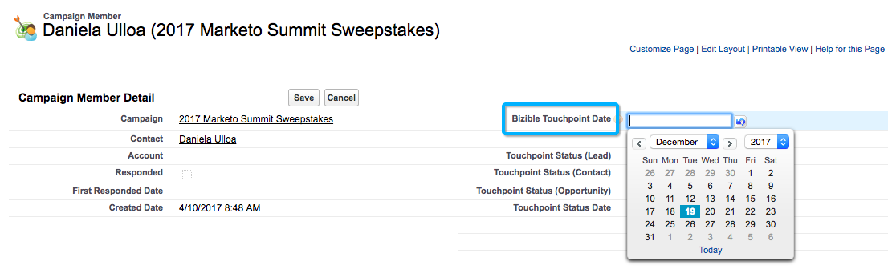

# 캠페인 및 캠페인 구성원 {#campaigns-and-campaign-members}

[!DNL Salesforce] Campaign은 마케팅 프로그램 또는 활동과 연관된 Lead 및 Contact 목록을 추적하기 위한 것입니다. 일반적으로 웨비나 등록 또는 두 번의 방문(예: 마케터는 캠페인이 터치 포인트 여정에서 크레딧을 받아야 하는지 여부를 선택할 수 있습니다.

## 터치포인트 활성화 {#enabling-touchpoints}

다음 [!DNL Marketo Measure] [!DNL Salesforce] 패키지에는 Campaign 개체에 &quot;구매자 터치포인트 활성화&quot;라는 레이블이 지정된 필드가 포함됩니다. 페이지 레이아웃에 필드가 추가되면 다음과 유사하게 표시됩니다.

선택 목록에서 사용할 수 있는 옵션은 다음과 같습니다.

* 모든 캠페인 구성원 포함 - 캠페인에 추가된 모든 단일 리드 또는 연락처는 해당 캠페인과 연관된 터치포인트를 수신합니다.
* 응답한 캠페인 멤버만 포함 - 캠페인 구성원 상태가 &quot;응답함&quot;인 리드나 연락처만 해당 캠페인에 연결된 터치포인트를 수신하게 됩니다.
* 모든 캠페인 구성원 제외 - 리드 또는 연락처는 해당 캠페인과 연관된 터치포인트를 받지 않습니다.

Campaign 구성원에게는 Adobe Campaign의 레코드와 연결된 이메일 주소가 있어야 합니다. [!DNL Marketo Measure] 터치 포인트를 만들려면 이메일 주소가 없으면, [!DNL Marketo Measure] 터치 포인트를 캠페인 구성원에게 할당하지 않습니다.

## 캠페인 동기화 날짜 {#campaign-sync-dates}

패키지 설치 시 [!DNL Marketo Measure] 또한 캠페인 개체에 두 개의 날짜 필드가 포함됩니다. 터치 포인트 시작 날짜 및 터치 포인트 종료 날짜입니다.

이 날짜는 [!DNL Marketo Measure] campaign의 캠페인 구성원을 터치포인트 여정에 포함시키는 것을 시작하거나 중지해야 하는 경우. 날짜를 하나 또는 둘 다 설정하거나, 전혀 설정할 수 없습니다.

## 터치 포인트 시작 날짜에 대한 사용 사례 {#use-case-for-touchpoint-start-date}

시작 날짜는 기존 Campaign이 리드 및 연락처를 추적하는 데 사용되지만, 새 시스템 또는 프로세스가 실행된 후에만 측정을 시작하려고 하므로 시작 날짜를 한 번 설정하기로 결정하는 경우에 사용할 수 있습니다 [!DNL Marketo Measure] 는 해당 캠페인 구성원 추적을 시작해야 합니다.

## 터치 포인트 종료 날짜에 대한 사용 사례 {#use-case-for-touchpoint-end-date}

사용 전에 [!DNL Marketo Measure]를 작성한 후 리드의 디지털 상호 작용(IE 양식 제출)을 추적한 다음 해당 리드를 [!DNL Saleforce] Campaign에서는 터치포인트 종료 날짜 필드를 활용할 수 있습니다. 터치 포인트 종료 날짜를 을 사용하여 시작 날짜로 설정합니다. [!DNL Marketo Measure] 구매자 터치포인트를 활성화하면 이러한 리드의 디지털 상호 작용이 터치포인트로 생성됩니다. 터치 포인트 종료 날짜를 시작 날짜로 설정하는 이유 [!DNL Marketo Measure] 왜냐하면, 계속 진행하면 Adobe에서는 Javascript를 통해 이러한 디지털 상호 작용을 추적할 것이기 때문입니다.

## 캠페인 구성원 {#campaign-members}

캠페인 구성원은 아래에 중첩됩니다. [!UICONTROL Campaigns], 및 은 Lead 또는 Contact 와 관련되어 있습니다. 리드나 연락처는 캠페인에 한 번만 추가할 수 있으므로, 캠페인의 사용 사례에 따라 문제가 될 수 있습니다. 캠페인이 동기화되면 캠페인 멤버십은 터치포인트 여정에 배치되고 양식 채우기로 처리되는 마케팅 활동으로 사용됩니다.

## 구매자 터치포인트 상태 {#buyer-touchpoint-status}

활성화된 경우 [!DNL Marketo Measure] 은 설치된 패키지에 포함된 4개의 서로 다른 필드에 걸쳐 상태 값을 캠페인 구성원에게 푸시합니다. 터치 포인트 상태(리드), 터치 포인트 상태(연락처), 터치 포인트 상태(기회) 및 터치 포인트 상태 날짜 터치 포인트가 관련 개체에 따라 구매자 터치 포인트 또는 구매자 속성 터치 포인트로 생성되었는지 여부를 고객이 감사할 수 있도록 해줍니다. 터치 포인트 상태 날짜는 캠페인 구성원에서 상태가 업데이트된 마지막 날짜입니다.

## 구매자 터치포인트 일자 {#buyer-touchpoint-date}

패키지 설치 시 [!DNL Marketo Measure] 캠페인 구성원의 &quot;구매자 터치포인트 날짜&quot;라는 필드도 포함합니다. 이렇게 하면 사용자가 해당 날짜를 재정의할 수 있습니다 [!DNL Marketo Measure] 터치 포인트 레코드의 터치 포인트 날짜에 을 사용합니다.

이벤트가 실제로 발생한 후 일/주/개월 후에 목록이 업로드된 경우 이러한 작업이 필요할 수 있습니다. 아래에 설명된 모든 레코드를 한 번에 업데이트하는 방법이 있습니다.

구매자 터치포인트 일자를 사용해야 하는지 여부를 알려면, 이 방법으로 일자가 결정됩니다 [!DNL Marketo Measure] 에 따라 [!UICONTROL Sync Type] 캠페인에 대해 선택된 것입니다.

만약 [!UICONTROL Sync Type] 이 &quot;모든 캠페인 구성원 포함&quot;으로 설정되어 있는 경우 터치 포인트 날짜 설정의 우선 순위는 위에서 아래로 입니다.

* 구매자 터치포인트 일자
* 캠페인 구성원 만든 날짜

만약 [!UICONTROL Sync Type] 이 &quot;응답한 캠페인 멤버만 포함&quot;으로 설정되어 있는 경우 터치 포인트 날짜 설정의 우선 순위는 위쪽부터 아래쪽입니다.

* 구매자 터치포인트 일자
* 첫 번째 응답 날짜
   * 상태가 &quot;응답함&quot;으로 변경되고 표준이 되는 즉시 첫 번째 응답 날짜가 자동으로 설정됩니다 [!DNL Salesforce] 변경할 수 없는 필드

* 캠페인 구성원 만든 날짜

## 벌크 업데이트 터치 포인트 날짜 {#bulk-update-touchpoint-date}

벌크 업데이트 터치 포인트 날짜는 설치된 페이지에 포함됩니다 [!DNL Marketo Measure] [!DNL Salesforce] 패키지 및 단추를 페이지 레이아웃에 추가해야 합니다.

많은 수의 캠페인 구성원 레코드를 업데이트해야 하는 경우 [!UICONTROL Bulk Update Touchpoint Date] 일괄 편집 단추.

이 인터페이스에 포함되지 않은 고유한 사용 사례가 있는 경우 [Data Loader](https://dataloader.io/)레코드를 내보내고 변경하고 레코드를 다시 업로드하려면 {target=&quot;_blank&quot;}.

먼저 레코드를 검색하고 구매자 터치포인트 일자를 설정할 레코드를 필터링합니다.

>[!CAUTION]
>
>작동하지 않는 검색 기능이 한 개 있으며 아래 예제에 표시됩니다. UI는 null Buyer Touchpoint 날짜 검색을 지원하지 않습니다(아래 검색이 작동하지 않음).

검색을 사용하고 모든 캠페인 구성원 레코드에 날짜를 적용할 필요가 없는 경우 &quot;[!UICONTROL Include All Records]모든 페이지의 모든 레코드를 확인하는 확인란(아래 스크린샷 참조).

달력 선택기에서 날짜 및 시간을 선택합니다. 현재 날짜와 시간을 선택하려면 달력 선택기 옆에 표시되는 날짜/시간을 클릭합니다.

날짜와 시간이 설정되면 **[!UICONTROL Update Selected Records]** 단추를 클릭하여 변경 사항을 적용합니다.

## 캠페인 비용 {#campaign-costs}

캠페인 비용에 대한 모든 정보 [이 문서](/help/marketing-spend/spend-management/crm-campaign-costs.md).

## 캠페인 구성원 제거 {#campaign-member-removal}

그렇게 [!DNL Marketo Measure] 는 Salesforce에서 삭제된 레코드를 보관합니다. Lead 또는 Account 또는 Opportunity가 삭제되었는지 여부에 관계없이 API에서 해당 레코드를 확인하고 항목이 &quot;IsDeleted&quot;로 표시되는지 추적합니다. 안타깝게도 Salesforce는 Campaign 멤버와 함께 이러한 Campaign 구성원을 캠페인에서 삭제하는 다른 방법을 도입했으며 &quot;삭제&quot;와 대조적으로 &quot;제거&quot;로 표시되므로 삭제된 Campaign 멤버와 관련된 Salesforce에서 터치포인트가 계속 사용되고 있다는 문제가 발생합니다.

이 문제를 해결하기 위해 [!DNL Marketo Measure] 생성됨 [!DNL Marketo Measure] Campaign 구성원이 제거될 때마다 추적하기 위한 작업 내역 개체 및 트리거입니다. 그런 다음 해당 터치 포인트를 삭제합니다. **필요한 경우 [!DNL Marketo Measure] Marketing Analytics 패키지 V6.15 이상** 을 클릭하여 이 기능을 사용할 수 있습니다.

>[!CAUTION]
>
>이 트리거는 이전에 제거된 캠페인 구성원을 추적하지 않으므로 이 작업은 앞으로 진행될 수만 있습니다. 과거 캠페인 구성원의 터치포인트를 많이 제거해야 하는 경우 [Marketo 지원](https://nation.marketo.com/t5/support/ct-p/Support){target=&quot;_blank&quot;}.

>[!MORELIKETHIS]
>
>[[!DNL Marketo Measure] 대학: 캠페인 개체 필드](https://universityonline.marketo.com/courses/bizible-fundamentals-channel-management/#/page/5c63007334d9f0367662b758)
>
>[[!DNL Marketo Measure] 대학: 오프라인 채널 매핑](https://universityonline.marketo.com/courses/bizible-fundamentals-channel-management/#/page/5c630eca34d9f0367662b77f)
