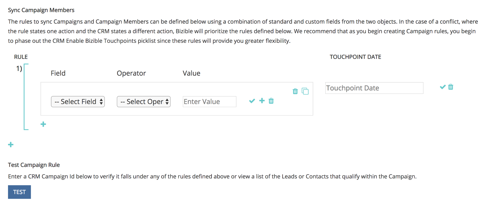

# 사용자 지정 캠페인 동기화 {#custom-campaign-sync}

오늘 설치된 [!DNL Marketo Measure] 패키지를 통해 적격 접점으로 포함할 캠페인을 표시할 수 있습니다. 여기에는 이전에 존재했던 것처럼 여러 가지 장애물이 있다. [!DNL Marketo Measure] 패키지가 CRM에 설치되면 보안 팀에서 승인하는 데 시간이 걸릴 수 있습니다. 또한 Campaign 개체에서 단일 선택 목록을 사용할 때 유연성이 부족합니다. 이 새로운 기능을 사용하면 Campaign 및 캠페인 멤버 레코드를 사용하기 시작할 때 패키지를 설치할 필요가 없습니다. 규칙을 작성하여 적격한 레코드를 정확히 정의하기 위해 작성할 수 있는 레코드를 정확하게 정의할 수 있습니다.

## 요구 사항 {#requirements}

* Campaign 동기화는 모든 계층에서 사용할 수 있습니다.
* 데이터를 가져오려면 CRM을 [!DNL Marketo Measure] 계정에 연결해야 합니다

## 작동 방법 {#how-it-works}

1. AccountAdmin 권한을 사용하여 **[!UICONTROL Settings]** > **[!UICONTROL Campaigns]**(으)로 이동하여 Sync Campaign 구성원 규칙 UI를 볼 수 있습니다.
1. **+** 아이콘을 클릭하여 규칙 만들기를 시작합니다.

   

1. [!UICONTROL Campaign] 또는 [!UICONTROL Campaign Member] 필드에서 규칙을 만들 수 있습니다. 유효성 검사가 예상되는 연산자 및 값으로 규칙의 나머지 부분을 채웁니다. 아래 예에서는 이름으로 특정 Campaign을 확인하고 있습니다.

   

   >[!NOTE]
   >
   >공식 필드는 규칙 내에서 사용할 수 없으며 선택 목록에 표시되지 않습니다. 수식은 백그라운드에서 계산되며 레코드를 수정하지 않으므로 [!DNL Marketo Measure]은(는) 레코드가 규칙에 맞는지 여부를 검색할 수 없습니다.

1. 접점 날짜를 선택합니다. 중괄호 `{`을(를) 입력한 후 가능한 날짜 목록이 나타납니다. 그러면 규칙에서 만든 모든 터치포인트에 적용할 날짜를 선택할 수 있습니다.

   

   >[!NOTE]
   >
   >사용자 지정 Campaign 동기화 규칙을 사용하는 경우 [!DNL Marketo Measure]은(는) 터치포인트 날짜 일괄 업데이트 단추를 사용하여 수행한 업데이트를 읽지 않습니다.

1. 확인 표시를 클릭한 다음 필요에 따라 추가 캠페인에 대한 규칙을 추가합니다.

   

   >[!NOTE]
   >
   >이제 CRM 동기화와 함께 규칙이 정의되므로, 언급된 규칙은 자연스럽게 충돌하기 시작합니다. 사용자 지정 Campaign 동기화 _과(와)_&#x200B;의 CRM 동기화 유형을 계속 사용하려면 CRM 동기화 유형이 무시되지 않도록 규칙을 만드는 것이 중요합니다.

   

   >[!NOTE]
   >
   >[!UICONTROL CRM Sync Type]의 사용자를 중지하려는 경우 &quot;동기화 유형&quot;을 참조하지 않지만 _여전히_&#x200B;은(는) 현재 CRM 접점을 유지하는 규칙을 만드는 것이 좋습니다. 이렇게 하면 해당 스위치가 만들어졌을 때 규칙이 계속 작동합니다.

다음은 기존 CRM 터치포인트를 손실하지 않도록 표시되는 모습의 예입니다.

## 유효성 검사 {#validation}

캠페인 내의 구매자 터치포인트 및 Buyer Attribution Touchpoint 레코드를 쉽게 확인하여 규칙이 제대로 작동하는지 확인할 수 있습니다. [!DNL Marketo Measure]이(가) 캠페인에서 가져온 적절한 동적 터치포인트 날짜로 만든 BAT입니다. 만든 날짜 필드는 아래 이미지에 있습니다.

## 테스트 {#testing}

1. Campaign 동기화 기능에는 테스트 기능이 포함되어 있으므로 만든 규칙이 실제로 Campaign 기준에 맞는지 확인할 수 있습니다. [!UICONTROL Test] 단추를 클릭하여 시작합니다. 테스트를 시작하려면 먼저 규칙을 저장해야 합니다.

   

   테스트할 캠페인 ID(CRM에서 15자 또는 18자)를 입력할 수 있는 팝업이 나타납니다. 중요한 것은 동기화하려는 CRM에서 Campaign ID를 입력하여 자신이 만든 규칙과 일치하는지 확인하는 것입니다.

   

1. [!UICONTROL Test]을(를) 클릭하면 터치포인트에 적합한 캠페인 이름과 캠페인 멤버 수가 표시됩니다. Campaign ID와 일치하는 모든 규칙을 보여 주는 표가 아래에 나타납니다. 일치 항목만 표시됩니다.

   

1. Campaign 규칙 자격 요건에 속하는 잠재 고객 및 연락처 목록과 해당 ID를 보려면 구성원 수를 클릭할 수도 있습니다. 이는 샘플 세트이며 최대 50개까지 표시되어 어떤 레코드가 자격이 있는지 알 수 있습니다.

   
