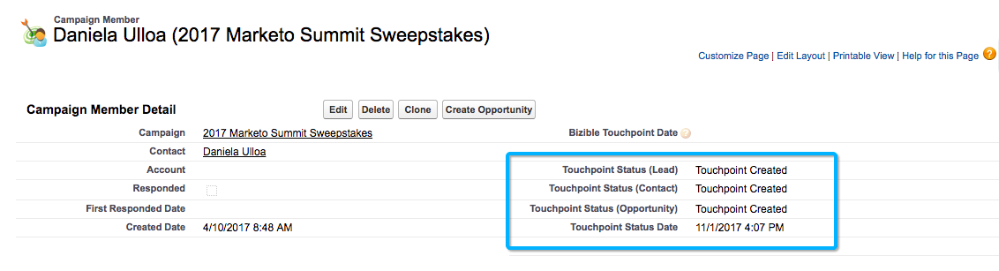

# 캠페인 및 캠페인 멤버 {#campaigns-and-campaign-members}

[!DNL Salesforce] 캠페인은 마케팅 프로그램 또는 활동과 연결된 잠재 고객 및 연락처 목록을 추적하기 위한 것입니다. 예를 들어 이것은 일반적으로 웨비나 등록 또는 부스 방문입니다. 마케터는 터치포인트 여정에서 캠페인이 크레딧을 받아야 하는지 여부를 선택할 수 있습니다.

>[!NOTE]
>
>이 문서에서는 오래된 프로세스를 다룹니다. 사용자가 [새롭고 개선된 인앱 프로세스](/help/channel-tracking-and-setup/offline-channels/custom-campaign-sync.md){target="_blank"}를 사용하는 것이 좋습니다.

## 접점 활성화 {#enabling-touchpoints}

[!DNL Marketo Measure] [!DNL Salesforce] 패키지에는 캠페인 개체에 &quot;구매자 터치포인트 사용&quot;이라는 레이블이 지정된 필드가 포함됩니다. 필드가 페이지 레이아웃에 추가되면 다음과 유사하게 표시됩니다.

선택 목록에서 사용할 수 있는 옵션은 다음과 같습니다.

* 모든 캠페인 멤버 포함 - 캠페인에 추가된 모든 개별 리드 또는 연락처는 해당 캠페인과 연결된 터치포인트를 받게 됩니다.
* &quot;응답한&quot; 캠페인 멤버만 포함 - 캠페인 멤버 상태가 &quot;응답됨&quot;인 잠재 고객 또는 연락처만 해당 캠페인과 연결된 터치포인트를 받습니다.
* 모든 캠페인 멤버 제외 - 리드나 연락처 중 해당 캠페인과 연결된 터치포인트를 받는 사람은 없습니다.

[!DNL Marketo Measure]이(가) 터치포인트를 만들려면 캠페인 구성원의 레코드와 연결된 전자 메일 주소가 있어야 합니다. 전자 메일 주소가 없으면 [!DNL Marketo Measure]은(는) 캠페인 멤버에게 터치포인트를 할당하지 않습니다.

## Campaign 동기화 날짜 {#campaign-sync-dates}

패키지를 설치하면 [!DNL Marketo Measure]에 Campaign 개체에 터치포인트 시작 날짜와 터치포인트 종료 날짜의 두 날짜 필드도 포함됩니다.

이 날짜는 [!DNL Marketo Measure]에게 Campaign의 캠페인 멤버를 터치포인트 여정에 포함하는 것을 시작하거나 중지해야 하는 시기를 알려 줍니다. 날짜를 하나 또는 둘 다 설정하거나 전혀 설정할 수 없습니다.

## 접점 시작 날짜에 대한 사용 사례 {#use-case-for-touchpoint-start-date}

기존 캠페인이 잠재 고객 및 연락처 추적에 사용되지만 사용자가 새 시스템 또는 프로세스가 갖추어진 후에만 측정을 시작하려는 경우 시작 날짜를 사용할 수 있습니다. 따라서 [!DNL Marketo Measure]이(가) 해당 캠페인 구성원 추적을 시작해야 하므로 시작 날짜를 설정합니다.

## 접점 종료 날짜에 대한 사용 사례 {#use-case-for-touchpoint-end-date}

[!DNL Marketo Measure]을(를) 사용하기 전에 잠재 고객의 디지털 상호 작용(IE 양식 제출)을 추적한 다음 해당 잠재 고객을 [!DNL Saleforce] 캠페인에 업로드하는 Marketing Automation 플랫폼을 사용한 경우 접점 종료 날짜 필드를 사용할 수 있습니다. 터치포인트 종료 날짜를 [!DNL Marketo Measure] (으)로 시작 날짜로 설정하고 구매자 터치포인트를 활성화한 다음 이러한 리드의 디지털 상호 작용이 각각 터치포인트로 만들어집니다. 터치포인트 종료 날짜를 [!DNL Marketo Measure]의 시작 날짜로 설정하는 이유는 앞으로 JavaScript를 통해 이러한 디지털 상호 작용을 추적할 것이기 때문입니다.

## 캠페인 멤버 {#campaign-members}

캠페인 멤버는 [!UICONTROL Campaigns] 아래에 중첩되며 잠재 고객 또는 연락처와 관련되어 있습니다. 잠재 고객 또는 연락처는 캠페인에 한 번만 추가할 수 있으며, 이는 캠페인의 사용 사례에 따라 문제가 될 수 있습니다. 캠페인이 동기화되면 캠페인 멤버십은 터치포인트 여정에 추가되고 양식 채우기처럼 처리되는 마케팅 활동으로 사용됩니다.

## Buyer Touchpoint 상태 {#buyer-touchpoint-status}

활성화된 경우 [!DNL Marketo Measure]은(는) 설치된 패키지에 포함된 4개의 다른 필드(접점 상태(리드), 접점 상태(연락처), 접점 상태(기회) 및 접점 상태 날짜)에 걸쳐 캠페인 멤버에 상태 값을 푸시합니다. 이렇게 하면 고객이 터치포인트가 관련된 오브젝트에 따라 Buyer Touchpoint 또는 Buyer Attribution Touchpoint으로 만들어졌는지 여부를 감사하는 데 도움이 됩니다. 접점 상태 날짜는 캠페인 멤버에서 상태가 마지막으로 업데이트된 날짜일 뿐입니다.

## Buyer Touchpoint 날짜 {#buyer-touchpoint-date}

패키지를 설치하면 [!DNL Marketo Measure]에 &quot;Buyer Touchpoint 날짜&quot;라는 레이블이 지정된 캠페인 멤버의 필드도 포함됩니다. 이를 통해 사용자는 [!DNL Marketo Measure]이(가) 접점 레코드의 접점 날짜에 사용할 날짜를 재정의할 수 있습니다.

이벤트가 실제로 발생한 후 일/주/개월 후에 목록이 업로드된 경우 이 작업이 필요할 수 있습니다. 모든 레코드를 한 번에 업데이트하는 방법이 있는데, 아래에 설명되어 있습니다.

Buyer Touchpoint 날짜를 사용해야 하는지 여부를 확인하려면 캠페인에 대해 선택한 [!UICONTROL Sync Type]에 따라 [!DNL Marketo Measure]에 의해 날짜가 결정되는 방법을 알아보세요.

[!UICONTROL Sync Type]이(가) &quot;모든 캠페인 멤버 포함&quot;으로 설정된 경우 터치포인트 날짜 설정의 우선 순위는 위에서 아래로 설정됩니다.

* Buyer Touchpoint 날짜
* 캠페인 멤버 생성 날짜

[!UICONTROL Sync Type]이(가) &quot;응답한 캠페인 멤버만 포함&quot;으로 설정된 경우 터치포인트 날짜 설정의 우선 순위는 위에서 아래입니다.

* Buyer Touchpoint 날짜
* 첫 번째 응답일
   * 첫 번째 응답한 날짜는 상태가 &quot;응답됨&quot;으로 바뀌자마자 자동으로 설정되며 변경할 수 없는 표준 [!DNL Salesforce] 필드입니다

* 캠페인 멤버 생성 날짜

## 접점 날짜 벌크 업데이트 {#bulk-update-touchpoint-date}

대량 업데이트 터치포인트 날짜가 설치된 [!DNL Marketo Measure] [!DNL Salesforce] 패키지에 포함되어 있으므로 페이지 레이아웃에 단추를 추가해야 합니다.

많은 수의 캠페인 멤버 레코드를 업데이트해야 하는 경우 [!UICONTROL Bulk Update Touchpoint Date] 단추를 사용하여 일괄 편집할 수 있습니다.

이 인터페이스에서 다루지 않는 고유한 사용 사례가 있는 경우 [데이터 로더](https://dataloader.io/){target="_blank"}를 사용하여 레코드를 내보내고 변경하고 레코드를 다시 업로드할 수도 있습니다.

먼저 레코드를 검색하고 Buyer Touchpoint 날짜를 설정할 레코드를 필터링합니다.

>[!CAUTION]
>
>작동하지 않는 검색이 한 개 있으며 이는 아래 예에 표시됩니다. UI는 null Buyer Touchpoint 날짜 검색을 지원하지 않습니다(아래 검색은 작동하지 않음).

검색을 사용하지 않고 모든 캠페인 멤버 레코드에 날짜를 적용할 필요가 없는 경우 모든 페이지의 모든 레코드를 확인하는 &quot;[!UICONTROL Include All Records]&quot; 확인란(아래 스크린샷 참조)을 사용합니다.

달력 선택기에서 날짜 및 시간을 선택합니다. 현재 날짜 및 시간을 선택하려면 달력 선택기 옆에 표시된 날짜/시간을 클릭합니다.

날짜 및 시간이 설정되면 **[!UICONTROL Update Selected Records]** 단추를 클릭하여 변경 내용을 적용합니다.

## 캠페인 비용 {#campaign-costs}

이 문서[&#128279;](/help/marketing-spend/spend-management/crm-campaign-costs.md){target="_blank"}에서 캠페인 비용 에 대해 모두 알아보세요.

## 캠페인 멤버 제거 {#campaign-member-removal}

[!DNL Marketo Measure]이(가) 삭제된 Leads, Accounts 또는 Opportunities에 관계없이 Salesforce에서 삭제된 레코드를 계속 사용하는 방법은 API에서 해당 레코드를 보고 항목이 &quot;IsDeleted&quot;로 표시되는지 추적하는 것입니다. 불행히도 캠페인 멤버와 함께 Salesforce는 캠페인에서 이러한 캠페인 멤버를 삭제하는 다른 방법을 도입했으며 실제로 &quot;삭제됨&quot;이 아닌 &quot;제거됨&quot;으로 표시되므로, 문제는 터치포인트가 삭제된 캠페인 멤버와 관련된 Salesforce에 여전히 존재하고 있었다는 것입니다.

이 문제를 해결하기 위해 [!DNL Marketo Measure]은(는) 캠페인 멤버가 제거될 때마다 추적할 [!DNL Marketo Measure] 기록 개체와 트리거를 만든 다음 해당 터치포인트를 삭제합니다. **이 기능을 사용하려면 [!DNL Marketo Measure] Marketing Analytics 패키지 V6.15 이상이 필요합니다**.

>[!CAUTION]
>
>이 트리거는 이전에 제거된 캠페인 멤버를 추적하지 않으므로 앞으로 진행만 작동합니다. 많은 과거 캠페인 멤버의 터치포인트를 제거해야 하는 경우 [Marketo 지원](https://nation.marketo.com/t5/support/ct-p/Support){target="_blank"}에 문의하십시오.

>[!MORELIKETHIS]
>
>[[!DNL Marketo Measure] Tutorials: Campaign 개체 필드](https://experienceleague.adobe.com/en/docs/marketo-measure-learn/tutorials/onboarding/marketo-measure-salesforce/campaign-object-fields){target="_blank"}
>
>[[!DNL Marketo Measure] Tutorials: 오프라인 채널 매핑](https://experienceleague.adobe.com/en/docs/marketo-measure-learn/tutorials/onboarding/marketo-measure-salesforce/mapping-offline-channels){target="_blank"}
