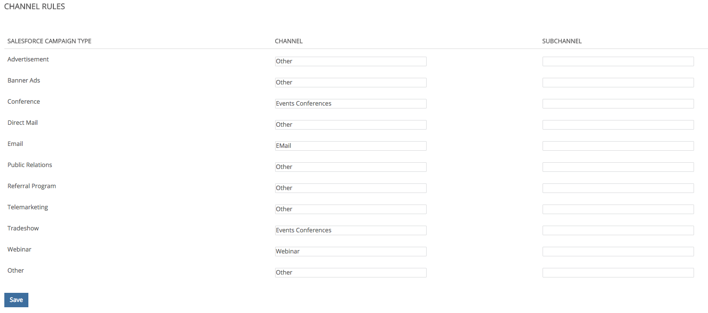

# 오프라인 사용자 지정 채널 설정 {#offline-custom-channel-setup}

## 시작하기 {#getting-started}

[!DNL Marketo Measure]이(가) 온라인 채널 규칙을 처리하는 방식과 비교하면 오프라인 채널 규칙은 스프레드시트를 사용할 필요가 없습니다. 하지만, 오프라인 채널을 정리하는 방법을 통해 생각하는 데 도움이 될 수 있기 때문에 구현 계획에는 여전히 시트가 제공됩니다.

스프레드시트에는 세 개의 열이 있습니다.

**[!UICONTROL Salesforce]캠페인 유형** - 여기에 [!DNL Salesforce]에서 식별된 캠페인 유형 추가

* 예를 들어 이메일, 웨비나, 회의 또는 터치포인트를 연결할 이 필드에 대해 만든 모든 값일 수 있습니다.

**[!UICONTROL Channel]** - 여기에 다양한 마케팅 채널 추가

**[!UICONTROL Subchannel]** - 여기에 해당 하위 채널 추가

## 오프라인 채널 논리 {#offline-channel-logic}

[!DNL Marketo Measure] 오프라인 채널 논리는 Campaign 개체, 특히 [!DNL Salesforce] 캠페인 유형에 의해 결정됩니다. [!DNL Marketo Measure]은(는) 이 필드를 사용하여 매핑할 채널 및 하위 채널을 이해하기 때문에 각 오프라인 작업에는 저녁 식사 또는 박람회 같은 [!DNL Salesforce] 캠페인 유형이 있어야 합니다.

SFDC 캠페인 유형은 오프라인 채널의 탭에 [!DNL Salesforce] 캠페인 유형 아래에 나열됩니다. [!DNL Marketo Measure]은(는) 구매자 터치포인트가 연결된 캠페인에 대한 SFDC 캠페인 유형만 가져올 수 있습니다.

여기에서 [!DNL Marketo Measure] 앱에서 채널/하위 채널 매핑을 만들 수 있습니다. 이 작업에는 [!DNL Marketo Measure] 앱에서 새 채널 및 하위 채널을 만드는 작업이 포함될 수 있습니다. 이 작업은 아래 이미지에 표시된 앱의 [채널 만들기] 섹션에서 수행됩니다. 터치포인트를 푸시할 위치를 이해하려면 [!DNL Marketo Measure]에 대해 새 채널과 하위 채널을 만들어야 합니다. 캠페인 유형을 매핑할 방법을 결정할 수 있습니다.

## 채널 매핑 예 {#channel-mapping-example}

예를 들어, 1년에 두 개의 [!DNL Salesforce] 회의에 참석한다고 가정해 보겠습니다. 그러나 각 컨퍼런스는 매우 다르고 고유한 타겟 대상자가 있습니다. 둘 중 어떤 것이 더 많은 가치를 가져오는지 알고 싶을 것이다. [!DNL Salesforce] 환경에서는 1월 이벤트에 캠페인 유형 &quot;Conference&quot;를 지정하고 채널 이름을 &quot;[!DNL Salesforce]&quot;로 지정하고 하위 채널 &quot;January Conference&quot;를 지정할 수 있습니다.

이제 당신은 6월 학회에도 같은 것을 하기를 원합니다. 이것은 또한 회의이므로 동일한 캠페인 유형(이 경우 &quot;회의&quot;라고 함)이 제공될 수 있습니다. 채널은 동일한 [!DNL Salesforce]이며 이 두 번째 전화 회의의 하위 채널은 &quot;6월 전화 회의&quot;입니다. 이는 조직적 관점에서 의미가 있다. 그러나 두 캠페인의 캠페인 유형이 동일하기 때문에 이러한 규칙을 읽고 적용하는 것은 [!DNL Marketo Measure] 논리에 매우 혼란스럽습니다. [!DNL Marketo Measure] 스크립트는 한 형식의 데이터를 두 개의 다른 하위 채널에 매핑할 수 없습니다. 즉, 각 하위 채널에 대해 새 캠페인 유형을 만들어야 하지만 하위 채널은 동일한 채널을 가질 수 있습니다.

다음은 [!DNL Marketo Measure]에서 읽을 수 없는 논리의 예입니다.

위의 시나리오에서는 동일한 캠페인 유형을 두 개의 서로 다른 하위 채널에 매핑할 수 없으므로 고유한 캠페인 유형을 만들려고 합니다. 대신 다음과 같은 고유한 유형을 설정해야 합니다.

기존 캠페인 유형은 채널 맵에 포함해야 하며 &quot;NULL&quot;을 채널로 추가해야 합니다.

[!DNL Salesforce] (으)로 이동하여 포함할 기존 레코드 종류의 수와 특성 및 위의 정보를 기반으로 추가 캠페인을 만들어야 하는지 여부를 결정하십시오. 필요한 정보를 모두 작성했으면 업로드할 준비가 된 것입니다.

[오프라인 동기화 [!DNL Salesforce] 캠페인  [!DNL Marketo Measure]](/help/channel-tracking-and-setup/offline-channels/legacy-processes/syncing-offline-campaigns.md)에 대해 자세히 알아보세요.

## 온라인 마케팅 활동을 위한 SFDC 캠페인 처리 {#handling-sfdc-campaigns-for-online-marketing-efforts}

마케팅 팀은 다양한 디지털 마케팅 활동을 추적하기 위해 [!DNL Salesforce] 캠페인을 만드는 것이 일반적입니다. 이 방법에는 문제가 없습니다. 그러나 이러한 캠페인을 DM이나 전화 회의와 같은 실제 오프라인 캠페인과 다르게 처리하는 것이 중요합니다. 디지털 이벤트와 관련된 캠페인(웹 사이트에서 수행되는 상호 작용)은 [!DNL Marketo Measure]과(와) 동기화하면 안 됩니다. [!DNL Marketo Measure] JavaScript에서 이미 온라인 노력을 추적하고 있으므로 이러한 캠페인을 동기화하면 터치포인트가 중복됩니다.

온라인 활동에 대한 캠페인을 처리하기 위한 또 다른 팁은 [!DNL Salesforce] 캠페인 유형을 NULL로 매핑하는 것입니다. 이렇게 하려면 먼저 아래 이미지에 표시된 대로 NULL이라는 [!DNL Marketo Measure] 앱에 채널을 만듭니다. **채널 만들기** 섹션 아래의 [!DNL Marketo Measure] 앱에서 찾을 수 있습니다. 이렇게 하면 동기화해서는 안 되는 캠페인이 실수로 동기화된 경우에 유용합니다. NULL 아래에 그룹화된 모든 항목을 확인하여 캠페인을 찾고 동기화 상태를 수정합니다.

## 앱에 오프라인 채널 규칙 입력 {#entering-your-offline-channel-rules-to-the-app}

사용자 지정 규칙을 사용하여 스프레드시트를 편집하고 업데이트했다면 다음 단계는 [!DNL Marketo Measure] 앱에서 이 채널 매핑을 다시 만드는 것입니다. 오프라인 채널용 스프레드시트는 실제로 업로드되지 않습니다. 대신 아래 이미지에 표시된 대로 선택 목록 상자에 정보를 입력합니다. **[!UICONTROL Channels]** 섹션 아래에서 **[!UICONTROL Offline Channels]**&#x200B;을(를) 클릭하여 찾을 수 있습니다.

>[!TIP]
>
>[!DNL Salesforce] 캠페인 유형을 [!DNL Marketo Measure] 채널 매핑으로 가져오는 _시기_&#x200B;를 결정하시겠습니까? **[!UICONTROL Setup]** > **[!UICONTROL Campaigns]** > **[!UICONTROL Fields]** > **[!UICONTROL Type]**(으)로 이동합니다. 그러면 선택 목록에 있는 값과 비활성 값을 확인할 수 있습니다. 비활성 항목은 &quot;[!UICONTROL Offline Channels]&quot; 섹션에서 선택 가능한 유형으로 표시되지 않습니다. 이 프로세스는 몇 분에서 최대 48시간 정도 소요될 수 있습니다.

완료되면 **[!UICONTROL Save]**&#x200B;을(를) 클릭하면 [!DNL Marketo Measure]이(가) 변경 내용을 업로드하고 데이터를 다시 처리합니다.

>[!MORELIKETHIS]
>
>* [[!DNL Marketo Measure] Tutorials: 오프라인 채널 매핑](https://experienceleague.adobe.com/ko/docs/marketo-measure-learn/tutorials/onboarding/marketo-measure-salesforce/mapping-offline-channels){target="_blank"}
>
>* [[!DNL Marketo Measure] Tutorials: 오프라인 캠페인 동기화](https://experienceleague.adobe.com/ko/docs/marketo-measure-learn/tutorials/onboarding/marketo-measure-salesforce/syncing-offline-campaigns){target="_blank"}
>
>* [Marketo Engage 프로그램 통합](/help/marketo-measure-and-marketo/marketo-measure-integrations-with-marketo/marketo-engage-programs-integration.md#channel-mapping){target="_blank"}
