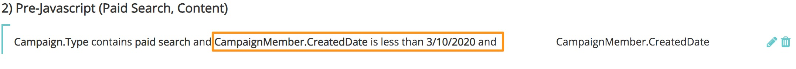

# 이전 데이터 동기화 {#syncing-historical-data}

[!DNL Marketo Measure] 는 가장 세부적인 실행 가능한 데이터를 제공하는 솔루션입니다. 그러나 기여도 분석이 필요한 기존 데이터가 있을 수 있음을 이해합니다. 이전 데이터에 대한 터치포인트를 생성할 수 있지만 이 프로세스를 계속 진행하기 전에 몇 가지 요소를 고려하는 것이 중요합니다.

## 고려해야 할 요소 {#factors-to-consider}

**데이터가 이미 캠페인에 구성되어 있습니까?**

a. 데이터를 동기화하려면 캠페인에 구성해야 합니다 [!DNL Marketo Measure] 터치포인트를 생성하기 위해 현재 Campaign으로 구성되지 않은 경우 데이터를 적절한 캠페인으로 세그먼트화하는 데 필요한 시간과 리소스를 사용해야 하는지 평가해야 합니다.

나. 구성원이 캠페인에 추가되거나 응답으로 표시된 날짜는 터치 포인트 날짜에 사용되므로 이 날짜도 정확해야 합니다. [!DNL Marketo Measure] 은 날짜를 업데이트하기 위해 SFDC 및 MSD 모두에서 해결 방법을 제공하지만 볼륨에 따라 시간이 많이 걸릴 수 있습니다.

**모든 채널(유료 검색, 이벤트, 유기 등)에 대한 캠페인으로 구성된 상당한 양의 데이터가 있습니까?**

정확하고 &quot;공정한&quot; 보고를 얻기 위해서는 기여도 분석에 대한 균형 잡힌 그림을 갖는 것이 중요합니다. 예를 들어 Events와 같은 역사적인 오프라인 채널 작업에 대한 데이터만 보유한 경우 데이터는 데이터를 보완하기 위한 내역 온라인 데이터 없이 기본적으로 편향됩니다.

**어떤 수준의 세부기간을 예상하고 있습니까?**

기본적으로 채널, 하위 채널 및 캠페인 이름만 알 수 있습니다.

**향후 보고 목표는 무엇입니까?**

이 데이터는 제한되므로 사용 방법을 고려하는 것이 중요합니다. 이전 데이터를 향후 데이터와 비교하는 것은 적절하지 않을 수 있습니다.

**얼마나 오래 전에 가고 싶으세요?**

[!DNL Marketo Measure] 는 이전 연도를 지나치지 않도록 권장합니다.

이 주제는 귀하와 함께 논의할 것을 강력히 권장하고 있습니다 [!DNL Marketo Measure] 먼저 문의하십시오. 위의 내용을 검토한 후 계속 진행하려면 일반 지침(에 대해 별도)을 [!DNL Salesforce] 및 [!DNL Microsoft Dynamics])은 아래에 있습니다.

## 의 내역 캠페인 동기화 [!DNL Salesforce] {#syncing-historic-campaigns-in-salesforce}

**온라인:**

이전 온라인 데이터를 동기화하려면 데이터를 Salesforce 캠페인으로 구성하고 다음에 동기화해야 합니다 [!DNL Marketo Measure] via [!DNL Salesforce] 의 Campaign Sync 규칙 [!DNL Marketo Measure] 앱. JavaScript가 라이브로 전환된 날짜 이후 이러한 캠페인에서 터치포인트를 생성하지 않도록 하는 것이 중요합니다. 이유는 중복 터치 포인트를 방지하기 위한 것입니다. JavaScript가 라이브되면 온라인 작업이 자동으로 추적되므로 SFDC 캠페인을 통해서도 추적하지 않으려고 합니다. 이 문제를 방지하려면 반드시 규칙에 시간을 추가해야 합니다. &quot;캠페인 구성원 만든 날짜가 다음 보다 작음&quot;과 같은 것일 수 있습니다. [JavaScript Go-Live 날짜]&quot;.

이전 온라인 데이터에 대한 채널 매핑 구성 요소는 약간 까다로울 수 있습니다. Adobe에서는 정리 보고를 위해 현재 온라인 채널 규칙(온라인 규칙 시트에서)을 가능한 한 가깝게 일치시키려고 합니다. 다음은 이상적인 채널 매핑의 예입니다.

>[!NOTE]
>
>이 채널 매핑은 [!UICONTROL Offline Channels] 섹션 [!DNL Marketo Measure] SFDC 캠페인을 사용하고 있으므로 앱을 사용할 수 있습니다.

| Salesforce 캠페인 유형 | 채널 | 하위 채널 |
|---|---|---|
| 유료 검색 - AdWords | 유료 검색 | AdWords |
| 유료 검색 - Bing | 유료 검색 | Bing |
| 유료 검색 - Yahoo | 유료 검색 | Yahoo |

이러한 방식으로 추가된 온라인 데이터는 기본적으로 온라인 데이터보다 덜 세분화됩니다 [!DNL Marketo Measure] 는 JavaScript를 통해 추적합니다. 예를 들어 양식 URL, 랜딩 페이지, 레퍼러 페이지 등과 같은 필드는 채워지지 않습니다. 따라서 가능하면 각 소스로 캠페인을 세분화하는 것이 좋습니다. 위의 예에서 보듯이, 보고의 세부기간을 갖도록 하려면 각 소스에 대해 여러 캠페인 유형이 있어야 합니다.

세분화된 채널 매핑을 지원하는 SFDC 캠페인 유형 수를 보유하는 것은 불가능하거나 합리적일 수 있으므로 채널 수준에 대한 매핑으로 보고 하위 채널을 무시하도록 할 수 있습니다. 채널 수준을 알 수 없는 경우, &quot;히스토리 디지털&quot;과 같은 프록시 채널을 설정하여 온라인 터치였다는 것을 적어도 알 수 있습니다.

이러한 이전 온라인 활동에 대해 푸시될 터치포인트 날짜를 일괄 편집해야 하는 경우 [!DNL Marketo Measure] 사용자 지정 &quot;[!UICONTROL Bulk Update Touchpoint Date]&quot; 단추(SFDC의 Campaign 개체에서 사용자 지정 필드로 사용할 수 있음). Campaign에 짧은 시간 범위가 있는 경우 하루별 간격으로 터치포인트 날짜를 대량 편집하는 것이 유용할 수 있지만, Campaign에 긴 시간 범위가 있는 경우 매주 업데이트되는 것이 적절할 수 있습니다. 대량 업데이트 터치 포인트 날짜 기능을 활용하는 경우, 날짜 필드에서 구매자 터치 포인트 날짜를 사용하도록 캠페인 동기화 규칙을 업데이트해야 합니다. 이는 캠페인에만 적용되며 2개만 적용되는 경우에는 캠페인 동기화 규칙을 사용하여 크리에이티브를 가져와야 합니다.

**오프라인:**

오프라인 마케팅 활동의 내역 데이터(JavaScript를 통해 추적할 수 없는 데이터)도 SFDC 캠페인으로 구성해야 합니다. SFDC 캠페인은 [!DNL Marketo Measure] 활동이 &quot;기록&quot; 또는 &quot;현재/사후&quot;인지 여부에 관계없이 오프라인 작업을 추적합니다[!DNL Marketo Measure] 구현&quot;을 클릭하십시오. 원본 오프라인 채널 구성 교육에서 결정된 것과 동일한 채널 매핑을 따르십시오.

필요한 경우 &quot;터치 포인트 날짜 대량 업데이트&quot; 버튼을 사용하여 캠페인 구성원의 터치 포인트 날짜를 대량 편집합니다. 예를 들어 이벤트가 발생한 후 SFDC 캠페인을 만드는 경우 올바른 날짜에 대해 대량 편집하려고 합니다. 대량 업데이트 터치 포인트 날짜 기능을 활용하는 경우, 날짜 필드에서 구매자 터치 포인트 날짜를 사용하도록 캠페인 동기화 규칙을 업데이트해야 합니다. 이는 캠페인에만 적용되며 2개만 적용되는 경우에는 캠페인 동기화 규칙을 사용하여 크리에이티브를 가져와야 합니다.

## 의 내역 캠페인 동기화 [!DNL Dynamics] {#syncing-historic-campaigns-in-dynamics}

[!DNL Marketo Measure] 는 내에서 캠페인으로 구성된 한 과거에 발생한 상호 작용에 대한 터치포인트를 소급하여 생성할 수 있습니다 [!DNL Dynamics].

이 작업에는 일반적으로 이전 날짜를 설명하기 위해 CRM에서 작업이 포함됩니다. 온라인 작업(JS로 추적됨)과 오프라인 작업(JS로 추적할 수 없음)에도 처리가 다릅니다.

내역 데이터를 구성하려면 아래 지침을 따르십시오. [!DNL Dynamics] 에 동기화할 수 있는 형식으로 [!DNL Marketo Measure].

**온라인:**

역사적인 디지털 데이터는 [!DNL Dynamics] 캠페인을 채울 수 있습니다. 이상적으로는, 이 구조가 이미 제자리에 있습니다.

데이터가 다른 곳에 수용되는 경우(예: Marketing Automation에서 계속 작업) [!DNL Dynamics] 를 사용하여 적절한 캠페인으로 구성합니다. 그런 다음 터치포인트 날짜를 고려해서 지정한 날짜가 아니라 과거의 날짜를 반영해야 합니다 [!DNL Dynamics]. 이 일자를 대체하려면 사용자 지정 &quot;구매자 터치포인트 일자&quot; 필드를 사용하여 일자를 변경할 수 있습니다. 마케팅 목록 양식에 추가해야 합니다.

그 결과, 터치 포인트 날짜에 사용될 마케팅 목록의 모든 사람에 대한 날짜를 대량 설정할 수 있습니다. 보다 정확한 내역 날짜를 만들려면 동일한 캠페인에 대해 여러 마케팅 목록(각각 고유한 터치 포인트 날짜 포함)을 만드십시오. Campaign에 짧은 시간 범위가 있는 경우 매일 마케팅 목록을 만드는 것이 유용할 수 있습니다. 캠페인의 시간 범위가 긴 경우 매주 마케팅 목록을 만드는 것이 적절할 수 있습니다.

마케팅 목록 동기화에 대한 자세한 내용은 다음을 참조하십시오. [[!DNL Dynamics] 캠페인 및 마케팅 목록](/help/marketo-measure-and-dynamics/dynamics-reporting/dynamics-campaigns-and-marketing-lists.md)

>[!NOTE]
>
>어떤 이유로든 JavaScript 라이브 날짜 이후에 활성 상태인 캠페인 추적 온라인 활동이 있는 경우, &quot;[!UICONTROL Touchpoint End Date]&quot; JS가 라이브로 설정된 날짜까지의 필드. 동일한 상호 작용에 대해 중복 터치포인트를 사용하지 않기 위한 것입니다.

고려 사항: 이러한 방식으로 추가된 온라인 데이터는 기본적으로 온라인 데이터보다 덜 세분화됩니다 [!DNL Marketo Measure] 는 JavaScript를 통해 추적합니다. 예를 들어 다음과 같은 필드가 있습니다. 양식 URL, 랜딩 페이지, 레퍼러 페이지 등은 채워지지 않습니다. 따라서 가능하면 각 소스로 캠페인을 세분화하는 것이 좋습니다. 아래는 이상적인 매핑의 예입니다.

| Dynamics 캠페인 유형 | 채널 | 하위 채널 |
|---|---|---|
| 유료 검색 - AdWords | 유료 검색 | AdWords |
| 유료 검색 - Bing | 유료 검색 | Bing |
| 유료 검색 - Yahoo | 유료 검색 | Yahoo |

소스를 식별할 수 있는 방법이 없거나 시간과 노력을 들일 필요가 없는 경우 &quot;이전 디지털&quot; 또는 &quot;기록 웹 사이트&quot;와 같은 채널에 매핑된 하나의 캠페인 유형을 사용할 수 있습니다.

**오프라인:**

과거에 오프라인 마케팅 활동을 위해 터치포인트를 가져오려면 데이터를 [!DNL Dynamics] 캠페인 및 에 동기화됨 [!DNL Marketo Measure]. 프로세스는 현재 오프라인 채널에 대해 동일합니다(마케팅 목록 또는 캠페인 응답을 통해 캠페인을 동기화). 다음은 채널 매핑의 예입니다.

| Dynamics 캠페인 유형 | 채널 | 하위 채널 |
|---|---|---|
| 이벤트 - 후원 회의 | 이벤트 | 후원 회의 |
| 이벤트 - 파트너 이벤트 | 이벤트 | 파트너 이벤트 |
| 이벤트 - 호스팅된 이벤트 | 이벤트 | 호스팅된 이벤트 |
| 웨비나 - 파트너 웨비나 | 웨비나 | 파트너 웨비나 |

이 데이터가 올바른 날짜 세트가 있는 캠페인으로 아직 구성되지 않은 경우 &quot;구매자 터치 포인트 날짜&quot; 필드를 사용하여 과거 오프라인 활동의 정확한 날짜를 반영할 수 있습니다.

