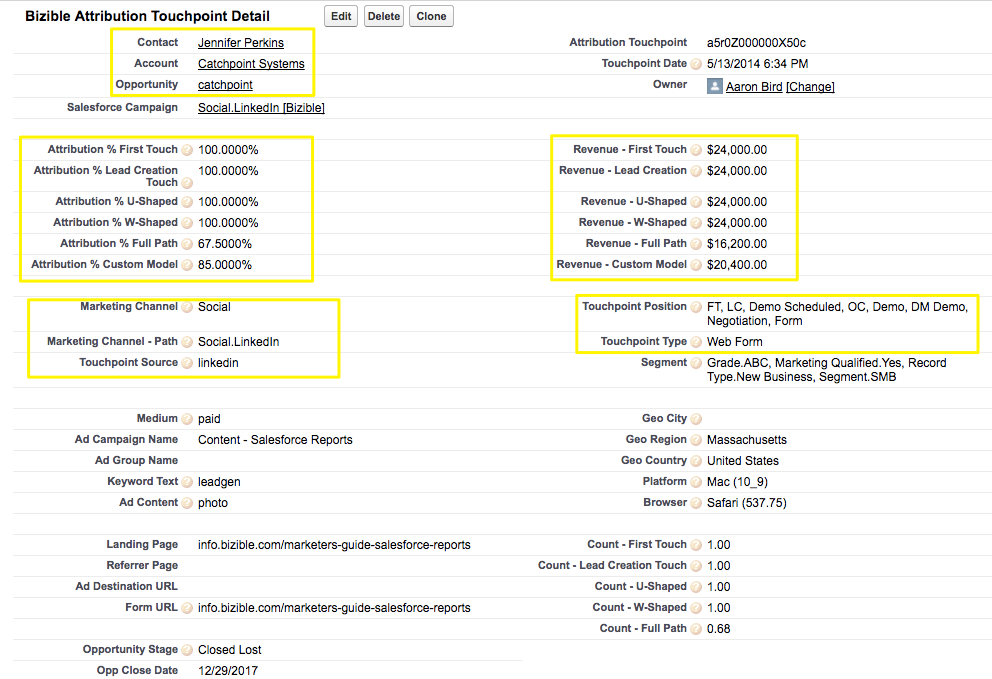

# 구매자 터치포인트와 구매자 속성 터치포인트 간의 차이 {#difference-between-buyer-touchpoints-and-buyer-attribution-touchpoints}

구매자 터치포인트(BT)와 구매자 기여도 분석 터치포인트(BAT)를 정의하는 것, 두 가지 차이점, 일반적으로 묻는 질문에 대답하는 방법을 알아봅니다.

구매자 터치포인트와 구매자 기여도 분석 터치포인트 간의 주요 식별자는 구매자 기여도 분석과의 관계입니다 [!DNL Salesforce] 개체. Opportunity 객체가 아닌 Lead, Contact 및 Case 객체와 관련된 BT 즉, 구매자 터치포인트와 연관된 수익은 없을 것입니다.

구매자 속성 터치포인트 객체는 연락처, 계정 및 기회 객체와 관련되지만 리드 객체는 연관되지 않습니다. 이것은 리드에 연결된 구매자 기여도 분석 터치포인트가 없음을 의미합니다. BAT 객체는 특정 마케팅 상호 작용과 연관된 수익을 확인할 수 있습니다.

BT와 BAT의 차이점:

<table> 
 <colgroup> 
  <col> 
  <col> 
 </colgroup> 
 <tbody> 
  <tr> 
   <td>구매자 터치 포인트(BT)</td> 
   <td>구매자 속성 터치포인트(BAT)</td> 
  </tr> 
  <tr> 
   <td> 
    <ul> 
     <li>리드, 연락처 및 케이스 개체에 대한 정보입니다</li> 
     <li>Opportunity Object 와 관련이 없습니다.</li> 
     <li>매출액은 구매자 터치포인트와 연관되지 않습니다</li> 
    </ul></td> 
   <td> 
    <ul> 
     <li>Contact, Account 및 Opportunity Object에 대한 정보</li> 
     <li>리드 객체와 관련되지 않음</li> 
     <li>구매자 기여도 분석 터치포인트가 Opportunity와 연관되어 있으므로 모든 BAT는 Opportunity와 연관된 수익을 가집니다</li> 
    </ul></td> 
  </tr> 
 </tbody> 
</table>

## FAQ {#faq}

**구매자 터치포인트는 언제 구매자 속성 터치포인트가 됩니까?**

이 BT가 연관된 Opportunity가 있는 Contact와 연결되면 BT가 BAT가 됩니다. 이해해야 할 매우 중요한 것은 하나의 특정 마케팅 상호 작용이 BT와 BAT일 수 있다는 것입니다.

**구매자 터치포인트가 OC(Touchpoint Position of Opportunity Creation)를 가질 수 있습니까?**

구매자 터치포인트는 첫 번째 터치(FT), 리드 생성(LC) 또는 양식 제출(중간 터치포인트)의 터치포인트 위치만 갖습니다. BT는 Opportunity와 관련이 없으므로 BT가 Opportunity Creation 또는 Closed의 Touchpoint Position을 가질 수는 없습니다.

**Buyer Touchpoint 데이터는 어떻게 활용됩니까?**

일반적으로 고객은 Buyer Touchpoint 데이터를 활용하여 단계 참여의 단계 및 중간 단계를 이해합니다. 의미 [!DNL Marketo Measure] 사용자는 양식을 제출하는 사람, 사이트를 보는 사람, 블로그 게시물이 성과가 좋은 항목, AdWords가 리드를 전환하도록 유도하는 항목 등을 알고 있습니다. 구매자 접점 데이터는 리드 및 연락처의 참여를 이해하는 데 유용합니다.

**Salesforce에서 Buyer Touchpoint는 어떤 모습입니까?**

여기 BT의 스크린샷이 있습니다 [!DNL Salesforce]:

**Salesforce에서는 구매자 속성 터치포인트가 어떻게 표시됩니까?**

여기 BAT의 스크린샷이 있습니다 [!DNL Salesforce]:

