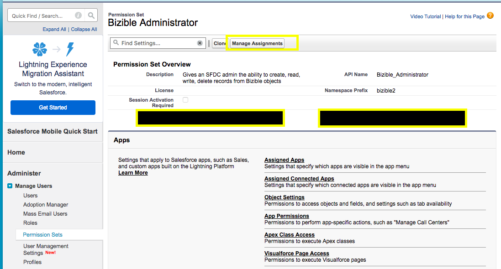

# [!DNL Marketo Measure]개의 권한 집합 {#marketo-measure-permission-sets}

Salesforce에서 [!DNL Marketo Measure] 권한 집합에 액세스하고 할당하는 방법을 알아봅니다.

## [!DNL Marketo Measure]개의 권한 집합 {#marketo-measure-permission-sets-1}

[!DNL Marketo Measure] Salesforce 패키지에 3개의 권한 집합이 포함되어 있습니다. 이 권한 집합은 관리자, 마케터 및 표준 사용자의 [!DNL Marketo Measure]에 대한 액세스 권한을 제공합니다.

Salesforce에서 권한 집합에 액세스하고 할당하려면 다음을 수행하십시오.

1. **[!UICONTROL Setup]**&#x200B;을(를) 클릭합니다.
1. 왼쪽 여백에서 **[!UICONTROL Users]**&#x200B;을(를) 클릭한 다음 **[!UICONTROL Permission Sets]**&#x200B;을(를) 클릭합니다.
1. 할당할 [!DNL Marketo Measure] 권한 집합을 선택하십시오.
1. **[!UICONTROL Manage Assignments]**&#x200B;을(를) 클릭한 다음 **[!UICONTROL Add Assignments]**&#x200B;을(를) 클릭합니다.
1. 사용 권한 집합의 사용자를 선택하고 **[!UICONTROL Assign]**&#x200B;을(를) 클릭합니다.

   

## [!DNL Marketo Measure]개의 권한 집합 설명 {#marketo-measure-permission-sets-explained}

<table> 
 <tbody> 
  <tr> 
   <td><strong>[!DNL Marketo Measure] 관리자</strong></td> 
   <td>SFDC 관리자에게 [!DNL Marketo Measure] 개체에서 레코드를 만들고, 읽고, 쓰고, 삭제할 수 있는 기능을 제공합니다. [!DNL Marketo Measure]이(가) 데이터를 SFDC로 푸시하는 라이선스에는 이 사용 권한 집합이 활성화되어 있어야 합니다. 또한 이 라이선스에는 [!DNL Marketo Measure]이(가) 레코드에 데이터를 적용하기 전에 잠재 고객이 전환되는 시나리오에서 전환된 잠재 고객을 편집할 수 있는 기능이 있는 것이 좋습니다. 이렇게 하면 Salesforce와 [!DNL Marketo Measure] 간 보고의 정확성을 보장할 수 있습니다. <a href="https://help.salesforce.com/articleView?id=release-notes.rn_sales_leads_view_converted.htm&amp;type=5&amp;release=206&amp;language=en_us">자세한 내용</a>.</td> 
  </tr> 
  <tr> 
   <td><strong>[!DNL Marketo Measure] 마케팅 사용자</strong></td> 
   <td>마케팅 사용자에게 [!DNL Marketo Measure] 개체에서 레코드를 읽고 쓸 수 있는 기능을 제공합니다. 마케팅 팀의 모든 구성원은 [!DNL Marketo Measure] 마케팅 사용자 권한 집합을 사용하도록 설정해야 합니다.  </td> 
  </tr> 
  <tr> 
   <td><strong>[!DNL Marketo Measure] 표준 사용자</strong></td> 
   <td>사용자에게 [!DNL Marketo Measure] 개체에서 레코드를 읽을 수 있는 기능을 제공합니다.</td> 
  </tr> 
 </tbody> 
</table>

인바운드 영업 개발 팀 및 계정 경영진은 [!DNL Marketo Measure] 데이터를 활용할 수 있습니다. 이러한 역할에서 보고에 [!DNL Marketo Measure] 데이터를 사용하려면 [!DNL Marketo Measure] 표준 사용자 권한 집합을 사용하도록 설정하십시오.

>[!NOTE]
>
>또한 연결된 사용자가 Campaign 개체에 액세스하려면 사용자 수준에서 &quot;마케팅 사용자&quot; [!DNL Salesforce] 프로필을 사용하도록 설정해야 합니다. 이를 확인하려면 **[!UICONTROL Setup]** > **[!UICONTROL Manage Users]** > **[!UICONTROL Profiles]** > **[!UICONTROL Marketing User]** > **할당된 사용자**&#x200B;를 클릭합니다.
