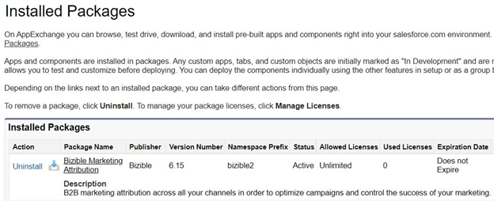

# [!DNL Marketo Measure] Salesforce 패키지 설치 및 설정 {#marketo-measure-salesforce-package-installation-and-set-up}

[!DNL Marketo Measure] [!DNL Salesforce] 기본 패키지를 설치하기 전에 Salesforce 프로덕션 인스턴스로 이동하기 전에 먼저 [!DNL Salesforce] 샌드박스에 기본 패키지를 설치하는지 확인해야 합니다.

>[!NOTE]
>
>[!DNL Marketo Measure] 계정이 [!DNL Salesforce] 프로덕션 인스턴스에 연결되면 뒤로 이동하여 샌드박스에 연결할 수 없습니다. 또한 [!DNL Marketo Measure] 계정은 하나의 [!DNL Salesforce] 프로덕션 인스턴스에만 연결할 수 있습니다.

[!DNL Marketo Measure] 기본 패키지에 포함된 항목:

* 사용자 지정 [!DNL Marketo Measure] 개체 7개
* 사용자 지정 [!DNL Marketo Measure] 필드
* 25개의 [!DNL Stock]개 보고서

[!DNL Marketo Measure]이(가) 표준 [!DNL Salesforce]개의 개체, 필드 및 레코드를 읽을 수 있지만 [!DNL Marketo Measure]은(는) 데이터를 업데이트하거나 푸시하지 않습니다. [!DNL Marketo Measure] JavaScript에서 수집한 모든 데이터는 [!DNL Marketo Measure] 사용자 지정 개체 및 필드에 표시됩니다.

[!DNL Marketo Measure Salesforce] 기본 패키지를 설치하려면 아래 단계를 따르십시오.

1. 시크릿 브라우저를 사용하여 [Salesforce AppExchange](https://appexchange.salesforce.com/appxListingDetail?listingId=a0N3000000B3KLuEAN){target="_blank"}(으)로 이동한 다음 로그인합니다.

1. 샌드박스 또는 프로덕션의 [!DNL Marketo Measure] 패키지에 설치합니다.

1. [!DNL Salesforce]에 관리자로 로그인합니다.

1. 모든 사용자에 대해 **[!UICONTROL Install]을(를) 선택합니다**.

   

1. 설치가 완료되면 이를 볼 수 있습니다.

   

설치를 완료한 후 원하는 경우 [!DNL Marketo Measure] 필드로 [[!DNL Salesforce] 페이지 레이아웃](/help/configuration-and-setup/marketo-measure-and-salesforce/page-layout-instructions.md){target="_blank"}을 업데이트할 수 있습니다.

>[!NOTE]
>
>만들어진 [!DNL Marketo Measure]개의 권한 집합 및 [사용 방법](/help/configuration-and-setup/marketo-measure-and-salesforce/marketo-measure-permission-sets.md){target="_blank"}에 대해 읽어 보십시오.

## [!DNL Marketo Measure] 프로필 및 사용자 만들기 {#creating-a-marketo-measure-profile-and-user}

[!DNL Marketo Measure]은(는) [!DNL Marketo Measure] 앱 내에서 연결된 [!DNL Salesforce] 사용자를 통해 데이터를 보내고 받습니다.

터치포인트 데이터를 [!DNL Salesforce] 인스턴스로 푸시하려면 연결된 사용자가 [!DNL Marketo Measure]개의 사용자 지정 개체(예: Buyer Touchpoint 및 Buyer Attribution Touchpoint)와 리드 및 연락처와 같은 표준 [!DNL Salesforce]개 개체에 액세스할 수 있어야 합니다.

Salesforce로 데이터를 푸시할 때 유효성 검사 오류가 발생하지 않도록 [!DNL Marketo Measure] 프로필을 만드십시오.

1단계: 특정 [!DNL Marketo Measure] 프로필 만들기

1. 다음 권한을 할당합니다.

* &quot;[!DNL Marketo Measure] 관리자 권한 집합&quot;
   * 관리되는 권한 집합을 사용하면 SFDC 관리자는 [!DNL Marketo Measure] 개체에서 레코드를 만들고, 읽고, 쓰고, 삭제할 수 있습니다.
* &quot;전환된 잠재 고객 권한 집합 보기 및 편집&quot;
   * 이를 통해 [!DNL Marketo Measure]이(가) 연락처로 전환된 후 리드를 장식할 수 있습니다. 이 권한 집합을 활성화하지 않으면 상당한 데이터 추적 간격이 발생할 수 있습니다.

>[!NOTE]
>
>이 프로필은 시스템 관리자 프로필의 복제본일 수 있습니다.

2단계: [!DNL Marketo Measure]이(가) [!DNL Salesforce] 인스턴스에 미치는 영향을 추적할 수 있도록 전용 [!DNL Marketo Measure] 사용자를 만드십시오.

1. 해당 사용자에게 새 [!DNL Marketo Measure] 프로필을 할당하십시오.

1. 사용자 수준 권한으로 &quot;마케팅 사용자&quot;를 활성화합니다.

* [!UICONTROL Marketing User] 확인란을 통해 사용자는 캠페인을 만들고 캠페인 가져오기 마법사를 사용할 수 있습니다. 이 옵션을 선택하지 않으면 사용자는 캠페인 및 고급 캠페인 설정만 보고, 단일 리드 또는 연락처에 대한 캠페인 내역을 편집하고, 캠페인 보고서를 실행할 수 있습니다. [!DNL Marketo Measure]은(는) campaign 개체를 읽고 쓸 수 있어야 합니다.

3단계: 모든 트리거, 워크플로우 및 프로세스에서 이 프로필 제외

4단계: [!DNL Marketo Measure] 계정에 로그인하고 새 사용자와의 [!DNL Salesforce] 연결을 다시 승인합니다.

1. apps.bizible.com으로 이동하여 새 사용자 프로덕션 [!DNL Salesforce] 자격 증명으로 로그인합니다.

1. **[!UICONTROL My Account]** 드롭다운에서 **[!UICONTROL Settings]**&#x200B;을(를) 선택합니다.

1. **[!UICONTROL Integrations]** 그룹화 내에서 **[!UICONTROL Connections]**&#x200B;을(를) 선택합니다.

1. 현재 연결된 [!DNL Salesforce] 연결 오른쪽에 있는 키 아이콘을 클릭하고 **프로덕션으로 재인증**&#x200B;을 선택합니다. 새 사용자 자격 증명으로 다시 로그인합니다(메시지가 표시되면).

>[!MORELIKETHIS]
>
>* [통합 권한 개요](/help/api-connections/utilizing-marketo-measures-api-connections/integration-permissions-overview.md){target="_blank"}
>
>* [Adobe Admin Console 설치](/help/configuration-and-setup/getting-started-with-marketo-measure/adobe-admin-console-setup.md){target="_blank"}
