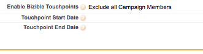

# 페이지 레이아웃 지침 {#page-layout-instructions}

>[!NOTE]
>
>&quot;[!DNL Marketo Measure]&quot;은 설명서이지만 CRM에서 &quot;Bizible&quot;을 참조하십시오. 업데이트를 위해 노력하고 있으며 리브랜딩이 곧 CRM에 반영됩니다.

쉽게 확인 [!DNL Marketo Measure] 데이터는에 대한 페이지 레이아웃을 업데이트하는 것이 좋습니다 [!UICONTROL Account], [!UICONTROL Contact], [!UICONTROL Lead], [!UICONTROL Opportunity], 및 [!UICONTROL Campaign] 개체. 지침은 아래의 각 개체 페이지 레이아웃에 대해 분류됩니다.

시작하려면 먼저 [!DNL Salesforce] 설정 및 을(를) 찾습니다. [!UICONTROL Customize] 탭.

## Campaign 개체 {#campaign-object}

을 추가하는 것이 좋습니다 [!DNL Marketo Measure] 샌드박스에만 사용할 SFDC Campaign에 필드를 추가합니다. 필드를 사용하여 터치 포인트 생성을 테스트할 수 있습니다. 프로덕션 환경에서는 [!DNL Marketo Measure] 터치 포인트 날짜 벌크 업데이트 단추. 을 추가하지 않는 것이 좋습니다 [!DNL Marketo Measure] campaign 동기화 규칙 규칙을 만들 수 있으므로 필드를 프로덕션에 추가할 수 있습니다.

1. 빌드 옵션에서 **[!UICONTROL Campaigns]**.

1. 클릭 **[!UICONTROL Page Layouts]**.

   

1. 클릭 **[!UICONTROL Edit]** 를 클릭합니다.

   

1. 내 [!UICONTROL fields] 옵션을 선택하고 **[!UICONTROL Enable Buyer Touchpoints]** 필드를 만들어 페이지에서 원하는 위치에 끌어서 놓습니다. 그런 다음 **[!UICONTROL Touchpoint Start Date]** 및 **[!UICONTROL Touchpoint End Date]** 필드.

   

1. 그런 다음 페이지 상단에서 &quot;[!UICONTROL Buttons]빠른 찾기 메뉴 내의 &quot; 옵션.

1. 을(를) 드래그합니다. **[!UICONTROL Bulk Update Touchpoint Date]** 단추를 사용자 지정 단추 섹션에 추가합니다.

   

1. 클릭 **[!UICONTROL Save]**.

   >[!NOTE]
   >
   >여러 캠페인 레코드 유형을 사용하는 경우, **[!UICONTROL Enable Buyer Touchpoints]** 필드를 업데이트해야 합니다. 참조 [이 문서](/help/channel-tracking-and-setup/offline-channels/configurations-for-multiple-campaign-record-types.md) 참조하십시오.

## 리드 {#leads}

1. 빌드 옵션에서 **[!UICONTROL Leads]**.

1. 클릭 **[!UICONTROL Page Layouts]**.

1. 클릭 **[!UICONTROL Edit]** 를 클릭합니다. 여러 페이지 레이아웃에 구매자 터치포인트 섹션이 포함될 수 있음을 명심하십시오.

1. 빠른 찾기 메뉴 내에서 왼쪽의 VisualForce 페이지 옵션을 클릭합니다.

1. 새 섹션을 만들고 이름을 &quot;구매자 터치포인트&quot;로 지정합니다.

   >[!NOTE]
   >
   >이러한 각 섹션에 대해 &quot;하나의 열&quot; 형식을 선택합니다.

1. 을(를) 드래그합니다. **[!UICONTROL Marketo Measure Lead Related List]** 페이지를 페이지 레이아웃 섹션에 강제 적용합니다.

   

1. 아래의 렌치를 클릭합니다. [!DNL VisualForce] 페이지를 표시하고 높이를 100으로 변경하고 스크롤 막대를 활성화합니다.

1. 메뉴에서 [!UICONTROL Canvas Apps] 섹션을 보고 터치포인트 아래에 &quot;Marketo 측정 인사이트&quot;라는 새 섹션을 만듭니다 [!DNL VisualForce] 방금 만든 섹션을 참조하십시오.

   >[!NOTE]
   >
   >이러한 각 섹션에 대해 &quot;하나의 열&quot; 형식을 선택합니다.

1. 을(를) 드래그합니다. [!DNL Marketo Measure Insights] 캔버스 앱을 새로 만든 섹션으로 이동합니다. 클릭 **저장**. Salesforce에서 즉시 인식하지 못하므로 캔버스 앱에 저장하기 전에 먼저 페이지 레이아웃을 저장해야 하는 경우가 있습니다. 따라서 새 섹션을 만든 후 페이지 레이아웃을 저장한 다음 다시 편집하여 해당 섹션 내에 캔버스 앱을 드래그합니다. 이는 모든 객체에 적용됩니다.

   >[!NOTE]
   >
   >대상 [!DNL Marketo Measure Insights] 캔버스 앱이 제대로 작동하지 않는 경우 [권한을 올바르게 구성해야 합니다.](/help/configuration-and-setup/marketo-measure-insights-canvas-app/marketo-measure-insights-configuration.md).

   >[!TIP]
   >
   >대부분의 고객은 이전 의 기존 필드이므로 (FT) 또는 (LC)로 끝나는 필드를 사용하지 않습니다 [!DNL Marketo Measure] 터치 포인트가 개체로 존재합니다.

다음을 활용하는 경우 [!DNL Marketo Measure] ABM 기능, [추가적인 페이지 레이아웃 지침을 보려면 여기를 클릭하십시오.](/help/advanced-marketo-measure-features/account-based-marketing/account-based-marketing-overview.md).

## 연락처 {#contacts}

1. 빌드 옵션에서 **[!UICONTROL Contacts]**.

1. 클릭 **[!UICONTROL Page Layouts]**.

1. 편집할 페이지 레이아웃 을 선택합니다.

   빠른 찾기 메뉴 내에서 관련 목록 옵션으로 이동하고 **[!UICONTROL Buyer Touchpoints]** 관련 목록

1. 공구아이콘을 클릭하고 다음 열을 순서대로 추가합니다.

   * 구매자 터치포인트
   * 마케팅 채널
   * 터치 포인트 소스
   * 광고 캠페인 이름
   * 터치 포인트 위치
   * 터치 포인트 날짜

1. 정렬 기준: 터치포인트 날짜, 오름차순.

   

1. [단추] 옵션을 확장하고 선택 취소합니다 **[!UICONTROL New]**.

   

1. 로 돌아갑니다. [!UICONTROL Related List] 메뉴에서 옵션을 선택한 다음 **[!UICONTROL Buyer Attribution Touchpoint]** 관련 목록

1. 공구아이콘을 클릭하고 다음 열을 순서대로 추가합니다.

   * 속성 터치포인트
   * 마케팅 채널
   * 기회
   * 광고 캠페인 이름
   * 터치 포인트 유형
   * 터치 포인트 위치
   * 속성 % W자형(_전체 경로 또는 사용자 지정과 같은 가장 강력한 속성 모델_)
   * 매출 W자형(_전체 경로 또는 사용자 지정과 같은 가장 강력한 속성 모델_)
   * 터치 포인트 날짜

1. 터치 포인트별 정렬 [!UICONTROL Date] > [!UICONTROL Ascending].

1. [단추] 섹션을 확장하고 선택을 취소합니다 **[!UICONTROL New]**.

1. 클릭 **[!UICONTROL Save]**.

## 기회 {#opportunities}

1. 빌드 옵션에서 **[!UICONTROL Opportunities]**.

1. 클릭 **[!UICONTROL Page Layouts]**.

1. 편집할 페이지 레이아웃 을 선택합니다.

1. 추가 **[!UICONTROL Buyer Attribution Touchpoint]** 관련 목록 및 공구를 눌러 Opportunity에 대해 다음 열을 추가합니다.

   * 속성 터치포인트
   * 마케팅 채널
   * 연락처
   * 광고 캠페인 이름
   * 터치 포인트 유형
   * 터치 포인트 위치
   * 속성 % W자형(_전체 경로 또는 사용자 지정과 같은 가장 강력한 속성 모델_)
   * 매출 W자형(_전체 경로 또는 사용자 지정과 같은 가장 강력한 속성 모델_)
   * 터치 포인트 날짜

1. 정렬 기준 [!UICONTROL Touchpoint Date] > [!UICONTROL Ascending].

1. 선택 취소 **[!UICONTROL New]** 내 [!UICONTROL Buttons] 섹션을 참조하십시오.

1. 클릭 **[!UICONTROL Save]**.

## 계정 {#accounts}

1. 빌드 옵션에서 **[!UICONTROL Accounts]**.

1. 클릭 **[!UICONTROL Page Layouts]**.

1. 편집할 페이지 레이아웃 을 선택합니다.

1. 추가 **[!UICONTROL Buyer Attribution Touchpoint]** 관련 목록 및 렌치를 눌러 다음 열을 추가합니다.

   * 속성 터치포인트
   * 마케팅 채널
   * 기회
   * 광고 캠페인 이름
   * 터치 포인트 유형
   * 터치 포인트 위치
   * 속성 % W자형(_전체 경로 또는 사용자 지정과 같은 가장 강력한 속성 모델_)
   * 매출 W자형(_전체 경로 또는 사용자 지정과 같은 가장 강력한 속성 모델_)
   * 터치 포인트 날짜

1. 터치 포인트 날짜 > 오름차순으로 정렬합니다.

1. 선택 취소 **[!UICONTROL New]** 내 [!UICONTROL Buttons] 섹션을 참조하십시오.

1. 클릭 **[!UICONTROL Save]**.

를 활용하는 경우 [!DNL Marketo Measure] ABM 기능,  [추가적인 페이지 레이아웃 지침을 보려면 여기를 클릭하십시오.](/help/advanced-marketo-measure-features/account-based-marketing/account-based-marketing-overview.md).
