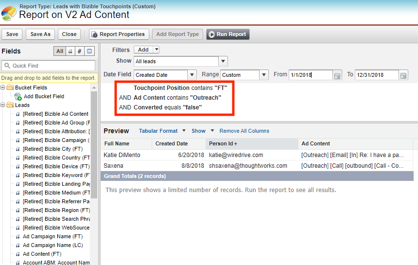

# [!DNL Salesforce] 패키지 통합 {#salesforce-package-consolidation}

사용자 경험을 향상시키고 사용을 단순화하기 위해 기존 패키지를 포괄적인 단일 패키지로 컴파일하고 있습니다.

## 패키지 사용 중지 {#package-retirement}

이 통합의 결과로 현재 V1, V2_EXT, V2_Security 및 모든 보고 패키지는 2023년 8월 이후 중단됩니다. V2 패키지가 이미 설치되어 있는 경우 새 통합 버전으로 업데이트해야 합니다.

## 새로운 통합 패키지 {#new-consolidated-package}

새로운 통합 V2 패키지는 이전 패키지의 모든 기능과 결합되어 향상된 사용자 경험을 제공합니다. 이 업데이트된 패키지를 통해 보다 효율적인 마케팅 및 판매 성과 추적을 가능하게 하고 고객 행동에 대한 심층적인 통찰력을 얻을 수 있습니다.

보고 기능을 향상시키는 두 가지 새로운 필드가 있습니다.

* form_name: 이제 BT/BAT 개체에서 사용할 수 있으며, 이 필드를 통해 사용자는 양식 이름을 기반으로 보고서를 만들 수 있습니다.
* user_touchpoint_id: 이 필드를 사용하면 사용자가 고유한 사용자 접점 카운트로 보고서를 만들 수 있습니다(Salesforce의 `bizible2__User_Touchpoint_V2__c`).

## 지원 및 전환 {#support-and-transition}

[지원 팀](https://nation.marketo.com/t5/support/ct-p/Support){target="_blank"}은(는) 모든 질문에 답변할 수 있으며 새로운 통합 패키지로 원활하게 전환할 수 있도록 지원합니다.

## 필수 작업 {#retired-actions}

* V2 패키지가 이미 설치되어 있는 경우 새 통합 버전으로 업데이트해야 합니다.
* 보고 패키지의 보고서나 대시보드가 있는 경우 모든 필드가 통합 패키지에 있으므로 수정하지 않고도 쉽게 다시 만들 수 있습니다.
* V2_EXT 패키지의 필드를 사용하는 보고서가 있는 경우 아래 단계를 통해 통합 패키지에서 보고서를 다시 만들 수 있습니다.
   * V2_EXT 필드의 모든 데이터는 터치포인트 필드에서 사용할 수 있으므로, 터치포인트 위치에 필터를 추가하여 해당 V2 터치포인트 필드에서 데이터를 가져오도록 보고서를 수정할 수 있습니다.
   * &quot;Outreach&quot; 텍스트가 포함된 광고 콘텐츠 FT를 사용하는 모든 리드를 가져오는 보고서 예.
      * V2_EXT 쿼리:
         * bizible2_ext__Ad_Content_FT__c에 Outreach 포함

* 통합 패키지의 해당 쿼리:
   * bizible2__Touchpoint_Position__c에 FT 및
   * bizible2__Ad_Content__c에 Outreach 포함

## FAQ {#faq}

**통합 패키지가 기존 패키지의 필드와 충돌합니까?**

통합 패키지를 설치하기 전에 패키지를 제거할 필요가 없습니다. 다른 네임스페이스에 있으므로 필드에는 충돌이 없습니다.

**현재 패키지에서 데이터를 채우려면 어떻게 해야 합니까?**

터치포인트 ID 및 양식 ID 필드를 채우기 위한 BT/BAT 데이터 다시 채우기 및 재처리에 대해 [지원으로 &#x200B;](https://nation.marketo.com/t5/support/ct-p/Support){target="_blank"} 티켓을 제출할 수 있습니다.

**V1 및 V2_EXT 패키지의 필드를 통합 패키지에서 사용할 수 있습니까?**

예. 통합 패키지는 V1에서 동일한 필드를 포함하며 객체별로 추가 분류되고 접점 필드를 통한 V2_EXT 필드가 포함됩니다.

**V2_EXT 필드를 사용하는 보고서를 통합 패키지에서 다시 만들 수 있습니까?**

예. [필수 작업](#retired-actions) 섹션의 단계를 따릅니다.
