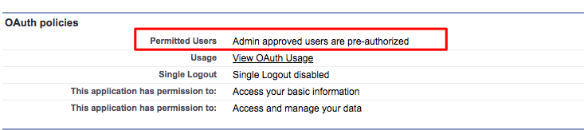

# [!DNL Marketo Measure] Insights 구성 {#marketo-measure-insights-configuration}

[!DNL Marketo Measure] 인사이트 캔버스 앱을 리드 페이지 레이아웃에 추가해야 하지만 [!DNL Salesforce] 설정의 연결된 앱 섹션에서 추가 설정이 필요합니다. 다음 지침에 따라 Canvas 앱에 적절한 권한이 있는지 확인하십시오.

1. [!DNL Salesforce] 설정으로 이동하여 [!UICONTROL Manage Apps] 탭에서 **[!UICONTROL Connected Apps]**&#x200B;을(를) 클릭합니다.

1. 채우는 목록에서 [!DNL Marketo Measure Insights]을(를) 선택합니다.

1. [!UICONTROL OAuth] 정책 섹션에서 허용된 사용자 설정을 &quot;관리자가 승인한 사용자는 사전 승인됨&quot;으로 변경합니다. 팝업이 나타납니다. **[!UICONTROL OK]**&#x200B;을(를) 클릭한 다음 **[!UICONTROL Save]**&#x200B;을(를) 클릭합니다.

   

1. 페이지가 저장되면 **[!UICONTROL Manage Profiles]** 단추를 클릭할 수 있습니다.

   

1. [!DNL Marketo Measure] 인사이트에 액세스할 수 있는 모든 프로필을 선택하고 **[!UICONTROL Save]**&#x200B;을(를) 클릭합니다.
