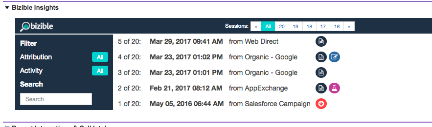

# [!DNL Marketo Measure] 인사이트 설명 {#marketo-measure-insights-explained}

에 대해 알아보기 [!DNL Marketo Measure] 에서 인사이트 보기 [!DNL Salesforce]: 다양한 아이콘이 나타내는 내용 및 기능 사용 방법을 포함합니다. 이 기능은 잠재 고객, 연락처 또는 계정의 처음 20개 세션을 보는 데 가장 유용합니다.

누군가가 다음을 통해 추적되면 [!DNL Marketo Measure] JavaScript를 실행하고 웹 사이트에서 양식을 작성하면 해당 사람이 시스템의 잠재 고객이 되고 해당 디지털 마케팅 데이터가 Salesforce(SFDC) 조직으로 전송됩니다. 이 경우 터치포인트 데이터가 [!DNL Marketo Measure] 잠재 고객/연락처/영업 기회/계정 오브젝트의 잠재 고객 인사이트 섹션(캔버스 앱)

먼저, 통찰력의 중간 부분에서 사용자가 웹 사이트에서 진행한 세션 수를 볼 수 있습니다. 이러한 세션을 스크롤하여 원하는 대로 탐색할 수 있습니다.

통찰력의 중간 상단 부분에 있는 &quot;모두&quot;를 클릭하면 모든 세션의 롤업을 볼 수 있습니다. 여기에서 개별 세션의 날짜, 이러한 세션을 유도한 채널 또는 소스, 추가 정보를 지정하는 아이콘 세트를 이해할 수 있습니다.

가장 먼저 FT 또는 LC 아이콘을 볼 수 있습니다. 나열된 세션의 터치포인트 위치를 나타냅니다. 구체적으로, FT는 First Touch를 의미하며 LC는 Lead Creation을 의미합니다. 여러 세션을 가질 수 있지만, 하나의 터치포인트만 FT 또는 LC일 수 있습니다. 한 사용자와 관련된 여러 FT 또는 LC를 찾을 수 없습니다.

종이처럼 보이는 아이콘은 세션 내에서 페이지 보기가 발생했음을 나타냅니다. 모든 세션에 이 아이콘이 포함되어 있을 수 있습니다.

비커처럼 보이는 아이콘은 A/B 테스트 실험이 발생했음을 나타냅니다. 이 시점에서 Optimizely 및 VWO와 통합됩니다. 이 통합을 통해 사용자가 특정 세션에서 확인한 실험과 변형을 푸시할 수 있습니다.

특정 세션을 클릭하면(세션의 실제 날짜를 클릭하거나 그룹화된 세션의 상단 가운데 부분에서 클릭 가능) 세션 세부 정보를 볼 수 있습니다. 각 세션에서 날짜 및 시간별로 사용자가 본 특정 페이지를 모두 볼 수 있습니다.

각 세션의 오른쪽에는 를 푸시하는 더 많은 세분화된 마케팅 데이터가 표시됩니다. [!DNL Marketo Measure] SFDC의 필드. 이 예에서는 광고 그룹, 광고 컨텐츠, 캠페인, 키워드 및 미디어를 볼 수 있습니다. 아래로 스크롤하여 [!DNL Marketo Measure] 우리가 제공하는 데이터.

마지막으로, 한 사람이 무수히 많은 세션을 가진다면 [!UICONTROL Insights] 사이트에서 참여의 특정 부분을 찾습니다. 다음을 기준으로 필터링할 수 있습니다. [!UICONTROL Touchpoint Position] 예.

페이지 보기 수, AB 테스트 또는 Forms으로 검색할 수도 있습니다.
