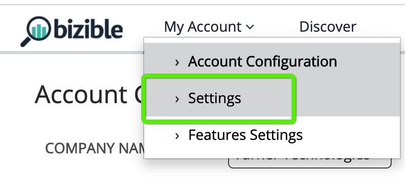

# 이메일 추적 매개 변수 {#email-tracking-parameter}

[!DNL Marketo Measure] 전자 메일 추적 매개 변수를 사용하면 마케터가 전자 메일 클릭을 양식 제출로 취급하여 해당 작업에 대한 터치포인트를 생성할 수 있습니다. 이메일 추적 매개 변수를 사용하지 않으면 사용자가 양식 제출 또는 웹 채팅을 통해 사이트에 실제로 관여할 때까지 이메일의 클릭스루는 &quot;웹 방문&quot;으로만 처리됩니다.

## 사용 사례  {#use-cases}

**웨비나 등록**: 마케팅 팀이 웨비나 등록을 위해 단추 하나로 전자 메일 초대를 보냅니다. 이메일에 이미 개인의 정보가 포함되어 있으므로 한 번의 클릭으로 해당 정보가 자동 등록됩니다. 랜딩 페이지에는 전자 메일 추적 매개 변수가 포함되어 있으므로 [!DNL Marketo Measure]이(가) 클릭스루하여 확인 페이지에 연결할 때 전자 메일 주소를 캡처하고 클릭스루를 양식 채우기로 처리하여 터치포인트를 생성할 수 있습니다.

**콘텐츠 다운로드**: 콘텐츠 마케팅 팀이 전자 메일의 직접 다운로드 링크를 사용하여 최근 게시한 전자 책을 홍보하려고 합니다. 전자 메일 서식 파일이 빌드되면 다운로드 확인 페이지에 전자 메일 추적 매개 변수가 포함되어 있으므로 클릭스루할 때 [!DNL Marketo Measure]에서 전자 메일 주소를 캡처할 수 있습니다. [!DNL Marketo Measure]은(는) 사이트에서 양식을 작성할 필요 없이 콘텐츠 다운로드를 위한 터치포인트를 생성할 수 있습니다. 이메일이 이메일 추적 매개 변수와 함께 확인 페이지에 랜딩했기 때문입니다.

## 작동 방법 {#how-it-works}

방문자가 사이트에 도달하면 [!DNL Marketo Measure]은(는) 전자 메일 주소 또는 [!DNL Salesforce] ID가 있는 랜딩 페이지를 찾아야 하므로 해당 방문을 &quot;양식 제출&quot;과 연결하고 해당 활동에 대한 터치포인트를 생성할 수 있습니다.

고객은 일반적인 방법으로 이메일 템플릿을 작성합니다. 추적할 작업의 랜딩 페이지에 추가할 시간이 되면 Marketing Automation 플랫폼에서 허용하는 토큰, 변수 태그 또는 매크로를 확인하여 각 개인에 대한 값을 동적으로 표시해야 합니다.

Marketo Measure은 이메일 주소, Salesforce 잠재 고객 ID 또는 Salesforce 연락처 ID 값을 허용합니다.

## 태그 예 {#tag-examples}

| 마케팅 자동화 | 토큰/태그/매크로 | 예 | 지원 자료 |
| --- | --- | --- | --- |
| Marketo | {{lead.Email Address}} | <https://engage.marketo.com/rs/460-TDH-945/images/BZ-B2B-Marketing-Attribution-101-ebook.pdf?mailId={{lead.EmailAddress}}> | [토큰 개요](https://experienceleague.adobe.com/docs/marketo/using/product-docs/demand-generation/landing-pages/personalizing-landing-pages/tokens-overview.html) |
| 파르도 | %%email%% 또는 %%user_crm_id%% | <https://engage.marketo.com/rs/460-TDH-945/images/BZ-B2B-Marketing-Attribution-101-ebook.pdf?mailId=%%email%%> | [Pardot 변수 태그 참조](https://help.salesforce.com/s/articleView?language=en_US&id=pardot_variable_tags_reference.htm&type=5) |
| Hubspot | (편집기를 통해 삽입됨) | 해당 사항 없음 | [HubSpot 콘텐츠 개인화](https://knowledge.hubspot.com/website-pages/personalize-your-content) |
| 실제 | (메시지 작성기를 통해 삽입됨) | 해당 사항 없음 | [실제 전자 메일 콘텐츠 개인화](https://connect.act-on.com/hc/en-us/articles/360033436074-How-to-Personalize-Email-Content-with-CRM-Data) |

마지막으로 [!DNL Marketo Measure] 내에서 추적 매개 변수를 지정해야 [!DNL Marketo Measure]이(가) 전자 메일 또는 ID 값을 찾을 수 있습니다. 기본값은 위의 예와 아래 스크린샷에 표시된 대로 &quot;mailId&quot;입니다. [!DNL Marketo Measure]의 설정에 값을 입력한 다음 **[!UICONTROL Save]**&#x200B;을(를) 클릭합니다.

