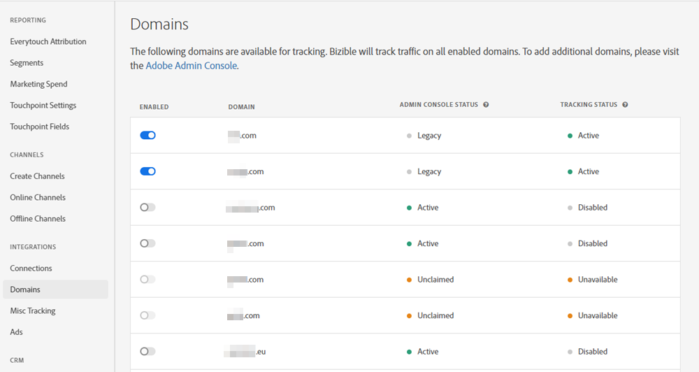
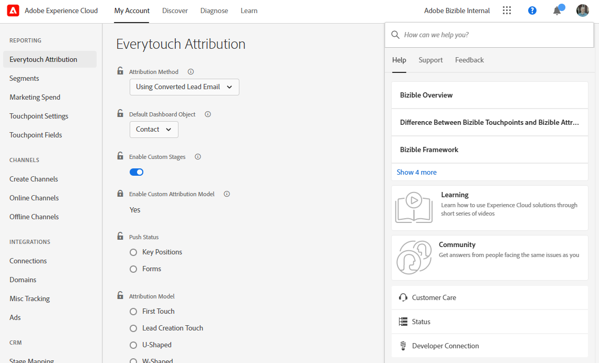
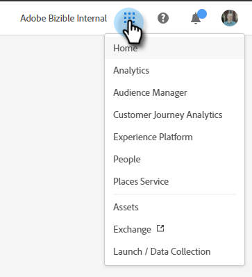
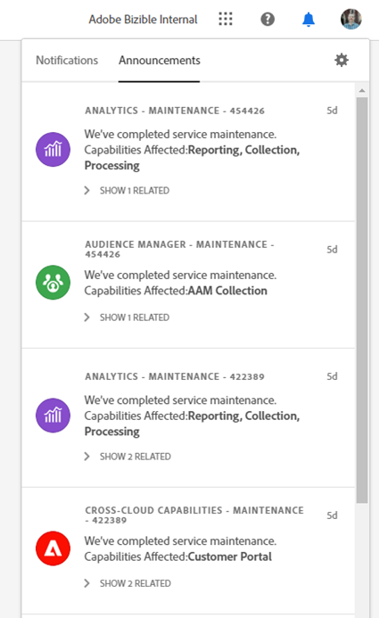
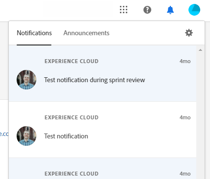

# Adobe Experience Cloud 인터페이스 개요 {#experience-cloud-interface-overview}

Adobe Experience Cloud 인터페이스는 Adobe Experience Cloud 애플리케이션 및 서비스의 모양과 느낌을 조정합니다. 하지만 단순한 새로운 디자인 그 이상입니다. 단일 인스턴스에서 사용자 경험을 제공하는 단일 페이지 애플리케이션입니다.

## 사용자 플로우 {#user-flow}

Adobe Experience Cloud 제품에 이미 로그인한 경우 메뉴 아이콘을 클릭하고 **[!DNL Marketo Measure]**&#x200B;을(를) 선택합니다.

>[!NOTE]
>
>구독 중인 Adobe Experience Cloud 제품에 따라 드롭다운 메뉴가 다르게 보일 수 있습니다.

Adobe Experience Cloud _아직_&#x200B;하지 않은 경우 [!DNL Marketo Measure]https://experience.adobe.com/marketo-measure[에서 ](https://experience.adobe.com/marketo-measure)에 직접 로그인하십시오.

## 새로운 기능 {#new-features}

업데이트된 모양과 느낌 외에도 다음 기능에 주목하십시오.

**도메인 관리**

[의 도움 없이  [!DNL Marketo Measure] 도메인](/help/domain-management.md)관리[!DNL Marketo Measure]를 하세요.

**통합 도움말 센터**

[!DNL Marketo Measure] 응용 프로그램에서 지원 문서를 검색하고 티켓을 제출하고 피드백을 제공합니다.

**애플리케이션 전환기**

여러 Adobe 제품에 액세스할 수 있는 사용자는 쉽게 전환할 수 있습니다.

**알림 및 공지**

제품별 알림 및 일반 Adobe 제품 공지를 애플리케이션에서 직접 보고 상호 작용할 수 있습니다.

**Adobe 설정**

언어 또는 기타 Adobe 환경 설정을 변경하려면 프로필 아이콘을 클릭합니다. [!DNL Marketo Measure]내 설정&#x200B;**을 클릭하여**&#x200B;별 변경을 수행할 수도 있습니다.

## FAQ {#faq}

**내 책갈피가 어떻게 됩니까?**

책갈피가 리디렉션됩니다. 예를 들어, https://apps.marketo-measure.com/Discover/391으로 이동하려면 인증을 완료한 후 https://experience.adobe.com/marketo-measure/Discover/391으로 리디렉션됩니다.

**Experience Cloud 인터페이스를 통해 [!DNL Marketo Measure]에 로그인할 수 없습니다. 문제가 무엇입니까?**

Adobe Experience Cloud에 로그인할 수 있지만 다음과 같은 페이지가 표시되면 [!DNL Marketo Measure]측에서 문제가 발생할 수 있습니다.

이(가) 표시되는 경우

위의 오류가 표시되면 [지원팀에 문의](https://nation.marketo.com/t5/support/ct-p/Support)하여 도움을 받으십시오.
