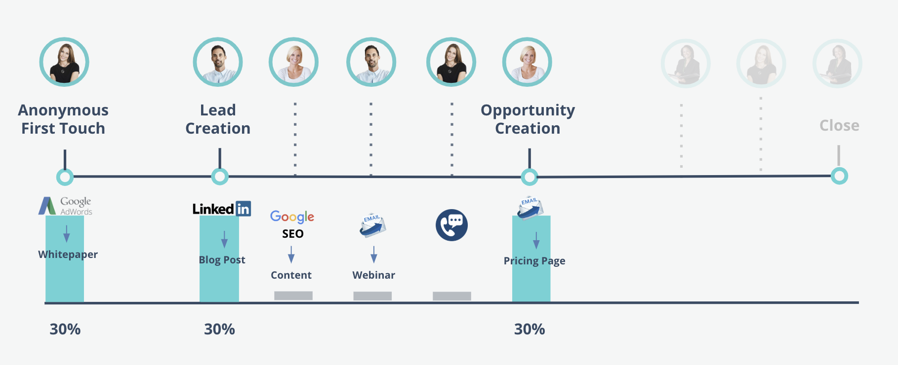

# Marketo Measure 속성 모델 {#marketo-measure-attribution-models}

Marketo Measure은 6가지 유형의 속성 모델을 제공합니다.

* 첫 번째 터치
* 리드 만들기
* U자형
* W자형
* 전체 경로
* 사용자 정의 모델

이러한 모델은 복잡성이 높습니다. 첫 번째 터치 및 리드 생성은 간단한 단일 터치 모델입니다. 나머지 4개는 더 복잡하고 멀티 터치 모델입니다. Marketo Measure의 기여도 분석 모델 구조는 고객 여정에서 발생하는 4가지 주요 접점을 반영합니다.

* 첫 번째 터치(FT)
* 리드 생성(LC)
* 기회 생성(OC)
* 마감 거래(CW)

에서 **단일 터치 모델**, 속성 크레딧은 하나의 이정표 터치포인트에만 적용됩니다. 따라서 &#39;단일 터치&#39;라는 이름이 사용됩니다.
에서 **멀티 터치 모델**&#x200B;를 입력하면 대부분의 속성 크레딧이 두 개 이상의 이정표 터치포인트에 할당됩니다. 나머지 크레딧은 이정표 터치포인트 간에 발생하는 터치포인트에 귀속됩니다.

다음 몇 가지 섹션에서는 각 속성 모델과 속성 크레딧을 할당하는 방법을 다룹니다.

## 단일 터치 모델 {#single-touch-models}

**첫 번째 터치 모델**

첫 번째 터치 모델은 리드가 조직과 가진 첫 번째 상호 작용에만 중점을 둡니다. 이 모델은 리드가 귀사인 첫 번째 터치(FT)를 처음 인식했을 때 속성 크레딧의 100%를 기여합니다.

Adwords Ad를 통해 Kate가 처음으로 www.adobe.com을 방문하며 백서를 본다고 가정하십시오. Adwords 채널은 해당 Opportunity에서 속성 크레딧의 100%를 받습니다.

**리드 생성 모델**

잠재 고객이 연락처 정보를 제공하고 리드가 될 때 리드 생성 모델은 속성 크레딧의 100%를 LC 터치포인트에 기여합니다.

이전 예로부터, 케이트가 Adwords를 통해 www.adobe.com을 처음 방문한 후, 오스틴은 Linkedin 게시물을 통해 웹 사이트를 방문합니다. Austin은 하나의 양식을 작성하고 Lead 가 됩니다. 이 모델에서 Linkedin은 속성 크레딧의 100%를 받습니다.

## 다중 터치 모델 {#multi-touch-models}

멀티터치 모델은 더 길고 복잡한 판매 주기에 사용됩니다. 이러한 모델은 계정/회사의 여러 사람이 구매자의 여정에 관련된 경우 특히 유용합니다.

**U자형 모델**

U자형 모델은 FT 및 LC 터치포인트 모두에 중점을 둡니다. 이 모델에서 FT 및 LC 터치포인트는 각각 매출 크레딧의 50%를 받습니다.

Adwords 광고를 통해 www.adobe.com에 대한 케이트의 첫 번째 방문은 속성 크레딧의 50%를 받게 됩니다. 나머지 50%는 Linkedin 게시물이 Austin이 양식을 작성하고 주도자가 되도록 만든 결과일 것입니다.

**W자형 모델**

이정표 터치포인트 중 세 개는 W자 모델에 포함되어 있습니다. 이 모델에서는 FT, LC 및 OC 터치포인트가 속성 크레딧의 각각 30%로 분류됩니다. 나머지 10%는 3개의 이정표 터치포인트 사이에 발생하는 임의의 중간 터치포인트에 비례적으로 계산됩니다.

케이트와 오스틴은 동료인 힐러리에게 Marketo Measure을 언급했다. 그녀는 구글 검색을 통해 컨텐츠를 찾고 양식을 작성한다. 나중에 Austin은 웨비나 등록을 위한 이메일을 받고 웹 사이트에서 등록 양식을 작성합니다. 케이트는 Marketo Measure 제품에 대해 판매 대표자와 대화를 나누고 있다.

Hillary 는 가격 책정 페이지에 대한 링크가 있는 이메일을 받고 페이지를 방문합니다. 그러면 해당 계정에 대해 Opportunity 가 생성됩니다. Opportunity Creation 날짜에 가장 가까운 마케팅 상호 작용이었기 때문에 가격 책정 페이지에 대한 Hillary의 웹 방문이 Opportunity Creation에 대한 크레딧을 받습니다. 각 이정표 터치포인트는 속성 크레딧의 30%가 할당되고, 중간 터치포인트는 나머지 10%에 귀속됩니다.

**전체 경로 모델**

전체 경로 모델에는 4개의 이정표 터치포인트가 포함되어 있습니다. FT, LC, OC 및 CW는 각각 수익 크레딧의 22.5%를 부여하며 나머지 10%는 중간 터치 간에 균등하게 분배된다.

기회 창출 후, 케이트, 오스틴, 그리고 힐러리는 Marketo Measure을 그들의 CMO, Elizabeth에게 홍보하기로 결정했다. Elizabeth는 Marketo Measure이 행사를 주최하는 컨퍼런스에 참석합니다. 케이트는 사례 연구에 대한 Linkedin 게시물을 보고 내용을 다운로드할 양식을 작성한다. Elizabeth는 Marketo Measure이 주최하는 영업 만찬에 참석한다. 저녁식사 후에, 그녀는 Marketo Measure을 구입하기로 결정하고 고객이 된다. 이 시나리오에서, 판매 저녁은 마감된 거래 수익 실적의 22.5%가 됩니다. FT, LC 및 OC 터치포인트도 크레딧의 22.5%를 받습니다. 중간 접점에는 나머지 10%의 수익 크레딧이 동일하게 할당됩니다.

**사용자 지정 속성 모델**

또한 Marketo Measure에서는 사용자가 모델에 포함할 터치포인트 또는 사용자 지정 단계를 선택할 수 있는 사용자 지정 속성 모델을 제공합니다. 또한 사용자는 이러한 터치포인트 및 단계에 속하는 속성 크레딧의 비율을 제어할 수 있습니다.
