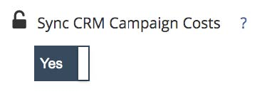

# 지출 관리 방법 {#spend-management-methods}

데이터 소비는 를 통한 ROI 보고의 성공에 핵심입니다. [!DNL Marketo Measure]. 모든 채널 및 하위 채널에 걸쳐 정확하고 포괄적인 ROI 보고를 수행하려면 적절한 지출 데이터가 있는지 확인해야 합니다 [!DNL Marketo Measure].

지출 데이터를 가져올 수 있는 방법에는 세 가지가 있습니다 [!DNL Marketo Measure]. 각 방법은 특정 데이터 입력에서 지출 데이터를 가져오도록 설계된다.

**API 연결 계정 1개**

연결한 모든 광고 계정 [!DNL Marketo Measure] api를 통해 해당 지출은 자동으로 로 전달됩니다. [!DNL Marketo Measure] roi 보고용. 연결된 계정을 확인하여 지출을 늘리려면 다음으로 이동하십시오. [!DNL Marketo Measure] 앱 및 선택 [!UICONTROL Connections] 탭 아래에 있는 [!UICONTROL Integrations] 섹션. API 연결 설정에 대한 자세한 내용은 [통합 광고 플랫폼](/help/api-connections/utilizing-marketo-measures-api-connections/integrated-ad-platforms.md#how-to-connect-ad-platforms).

**2 CRM Campaign 비용 동기화**

매 [!DNL Marketo Measure] 계정은 이라는 기능에 액세스할 수 있습니다. [CRM 캠페인 비용 동기화](/help/marketing-spend/spend-management/crm-campaign-costs.md#availability). 기본적으로 이 기능 비트는 &quot;아니요&quot;로 설정되지만 언제든지 켤 수 있습니다.

활성화되면 이 기능은 다음 기준을 충족하는 CRM 캠페인/프로그램에서 자동으로 사용됩니다.

난... [!DNL Marketo Measure] 먼저 Campaign/Program이 일치에서 터치포인트를 만들고 있는지 확인합니다 [Campaign 동기화 규칙](/help/channel-tracking-and-setup/offline-channels/custom-campaign-sync.md) 을(를) 만들었거나 일치시킵니다. [프로그램 동기화 규칙](/help/marketo-measure-and-marketo/marketo-measure-integrations-with-marketo/marketo-engage-programs-integration.md) 또는 을(를) 만들었습니다. [구매자 접점 값 활성화](/help/channel-tracking-and-setup/offline-channels/legacy-processes/syncing-offline-campaigns.md#how-to-create-a-campaign-and-sync-buyer-touchpoints) 는 &quot;모든 캠페인 멤버 포함&quot; 또는 &quot;응답한&quot; 캠페인 멤버 포함&quot;입니다.

아.. 캠페인/프로그램에 시작 날짜를 채워야 합니다.

iii. 캠페인/프로그램에서 종료 날짜를 채워야 합니다.

iv. 실제 비용(SFDC의 캠페인) 또는 기간 비용(Marketo의 프로그램)을 지정해야 합니다.

**3 수동 비용 업로드**

이 방법을 사용하면 다음 작업을 수행할 수 있습니다. [지출 데이터 수동으로 업로드](/help/marketing-spend/spend-management/marketing-channel-costs.md#uploading-marketing-costs) API 연결 계정 또는 CRM Campaign 비용 동기화에서 다루지 않는 채널 및 하위 채널의 경우. 의 마케팅 지출 섹션으로 이동 [!DNL Marketo Measure] 모든 채널에 대한 CSV 파일을 통해 지출 데이터를 업로드할 수 있습니다.

고객은 의 특정 설정에 따라 이러한 세 가지 방법을 모두 조합하여 사용하여 지출을 관리할 수 있습니다 [!DNL Marketo Measure]. 지출을 로 가져오는 방법에는 세 가지가 있기 때문입니다 [!DNL Marketo Measure], 검색 위치에 있는 마케팅 지출 보드를 사용하여 모든 지출 데이터를 종합적으로 볼 수 있습니다. 이 보드는 모든 채널과 관련 지출을 볼 수있는 유일한 장소입니다. 마케팅 지출 보드는 지출 데이터에 차이가 있을 수 있는 위치와 ROI 보고를 향상시킬 수 있는 방법을 신속하게 식별하는 데 도움이 될 수 있습니다.
