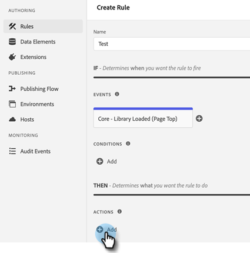

# [!DNL Marketo Measure] Adobe Launch와 통합 {#marketo-measure-integrations-with-adobe-launch}

Adobe Launch 확장은 기존 사용자를 위해 설계되었습니다 [!DNL Marketo Measure] 웹 사이트에서 이미 Adobe Launch를 사용하는 사용자. 확장은 특정 이벤트 및 조건에 따라 페이지에서 스크립트를 구성하고 동적으로 로드하는 데 사용할 수 있는 태그 관리 솔루션 역할을 합니다.

Adobe Launch에 설치하고 구성하는 경우 [!DNL Marketo Measure] 확장은 Adobe Launch 스크립트가 있는 페이지에 bizible.js 스크립트를 로드합니다. 이렇게 하면 마케터는 웹 페이지를 명시적으로 수정하여 bizible.js 스크립트 태그를 추가하는 대신 Adobe Launch 구성을 통해 bizible.js를 추가할 수 있습니다.

## Adobe Launch 확장 구성 {#configure-the-adobe-launch-extension}

>[!PREREQUISITES]
>
>Adobe Launch 및 그 확장에 대한 자세한 내용은 다음 링크를 확인하십시오.
>
>* [[!DNL Marketo Measure] 확장](https://experienceleague.adobe.com/docs/experience-platform/destinations/catalog/email/bizible.html#catalog){target="_blank"}
>* [Adobe Launch 개요](https://experienceleague.adobe.com/docs/platform-learn/implement-in-websites/overview.html){target="_blank"}
>* [Adobe Launch 확장 개요](https://experienceleague.adobe.com/docs/experience-platform/tags/extension-dev/overview.html){target="_blank"}

1. 단계에 따라 속성을 만듭니다. [이 문서에서](https://experienceleague.adobe.com/docs/platform-learn/implement-in-websites/configure-tags/create-a-property.html#go-to-the-data-collection-interface){target="_blank"}.

1. 생성한 속성을 클릭합니다.

   

1. 클릭 **[!UICONTROL Extensions]**.

   

1. 다음을 클릭합니다. **[!UICONTROL Catalog]** 탭을 클릭하고 &quot;[!UICONTROL Bizible].&quot;

   

1. 다음에서 [!UICONTROL Bizible Analytics] 타일, 클릭 **[!UICONTROL Install]**.

   

1. Bizible AccountId 필드에 웹 사이트의 URL을 입력합니다(예: `adobe.com`).

   

   >[!NOTE]
   >
   >이 필드는 Business_Prod.Business 테이블의 &quot;계정 ID&quot;가 아닙니다. 주어진 URL의 모든 웹 활동(예: `adobe.com`)에 매핑됩니다 [!DNL Marketo Measure] 테넌트.

1. 클릭 **[!UICONTROL Save]**.

   

1. 클릭 **[!UICONTROL Rules]**&#x200B;을 선택한 다음 을 선택합니다. **[!UICONTROL Create New Rule]**.

   

1. 다음을 클릭합니다. **[!UICONTROL Add]** 아래에 있는 단추 [!UICONTROL Events].

   

1. 확장 드롭다운에서 을 선택합니다. **[!UICONTROL Core]**. 그런 다음 이벤트 유형 드롭다운에서 **[!UICONTROL Library Loaded (Page Top)]**. 이벤트에 이름을 지정하지 않으면 기본 이름이 적용됩니다. 클릭 **[!UICONTROL Keep Changes]** 완료 시.

   

1. 다음을 클릭합니다. **[!UICONTROL Add]** 단추 아래에 있는 단추를 클릭합니다.

   

1. 확장 드롭다운에서 을 선택합니다. **[!UICONTROL Bizible Analytics]**. 그런 다음 작업 유형 드롭다운에서 을 선택합니다. **[!UICONTROL Initialize]**. 작업에 이름을 지정하지 않으면 기본 이름이 적용됩니다. 클릭 **[!UICONTROL Keep Changes]** 완료 시.

   

1. 클릭 **[!UICONTROL Save]**.

   
