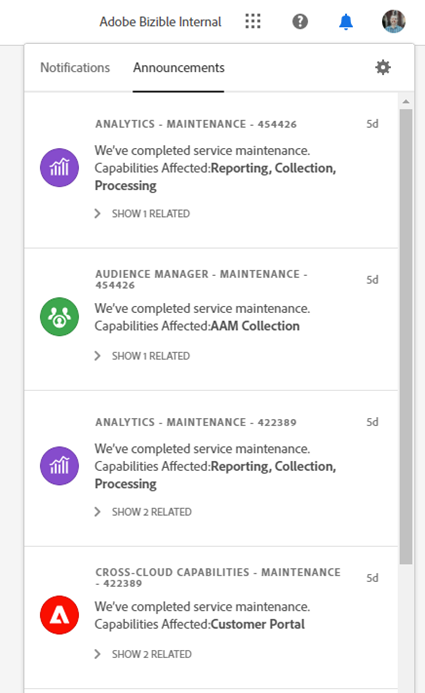

# 통합 셸 개요 {#unified-shell-overview}

통합 셸은 Adobe Experience Cloud 애플리케이션 및 서비스의 &quot;셸&quot; 모양과 느낌을 조정합니다. 하지만, 그것은 단지 새로운 디자인 그 이상입니다. 단일 인스턴스에서 사용자 경험을 제공하는 단일 페이지 애플리케이션입니다.

## 사용자 흐름 {#user-flow}

**통합 셸 흐름**

Adobe Experience Cloud 제품에 이미 로그인한 경우 메뉴 아이콘을 클릭하고 을 선택합니다 **[!DNL Marketo Measure]**.

>[!NOTE]
>
>드롭다운 메뉴는 가입한 Adobe Experience Cloud 제품에 따라 다르게 표시될 수 있습니다.

만약 _not_ 이미 Adobe Experience Cloud 제품에 로그인되어 있는 경우,에 직접 로그인합니다 [!DNL Marketo Measure] 여기: [https://experience.adobe.com/marketo-measure](https://experience.adobe.com/marketo-measure).

## 새로운 기능 {#new-features}

업데이트된 모양 및 느낌 외에 다음 기능이 표시됩니다.

**도메인 관리**

[관리 [!DNL Marketo Measure] 도메인](/help/marketo-measure-and-adobe/domain-management.md) 도움 없이 [!DNL Marketo Measure].

**통합 도움말 센터**

지원 문서 검색, 티켓 제출, 피드백 제공 등의 모든 작업을 [!DNL Marketo Measure] 응용 프로그램.

**응용 프로그램 전환기**

여러 Adobe 제품에 액세스할 수 있는 사용자는 이러한 제품 간에 쉽게 전환할 수 있습니다.

**알림 및 공지**

애플리케이션에서 바로 제품별 알림 및 일반 Adobe 제품 알림을 보고 상호 작용할 수 있습니다.

**Adobe 설정**

언어 또는 기타 Adobe 전체 환경 설정을 변경하려면 프로필 아이콘을 클릭하십시오. 다음을 수행할 수도 있습니다 [!DNL Marketo Measure]을 클릭하여 특정 변경 사항 **내 설정**.

## FAQ {#faq}

**책갈피는 어떻게 됩니까?**

책갈피가 리디렉션됩니다. 예를 들어 https://apps.marketo-measure.com/Discover/391으로 이동하는 경우 인증을 완료한 후 https://experience.adobe.com/marketo-measure/Discover/391으로 리디렉션됩니다.

**에 로그인할 수 없습니다. [!DNL Marketo Measure] 통합 셸을 통해 어떤 문제가 될 수 있습니까?**

Adobe Experience Cloud에 로그인할 수 있지만 다음과 같은 페이지가 표시되면 문제가 [!DNL Marketo Measure] 측면:

위의 오류를 받으시면, [지원 문의](https://nation.marketo.com/t5/support/ct-p/Support) 지원 요청.
