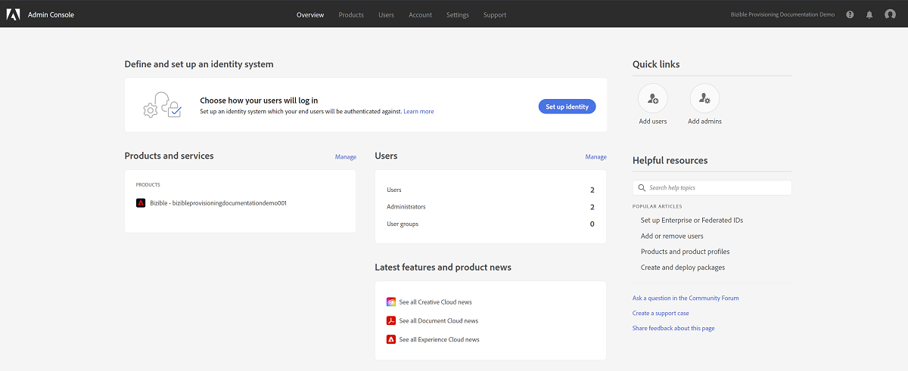

# [!DNL Microsoft Dynamics] CRM 설치 안내서 {#microsoft-dynamics-crm-installation-guide}

>[!NOTE]
>
>&quot;[!DNL Marketo Measure]&quot;은 설명서이지만 CRM에서 &quot;Bizible&quot;을 참조하십시오. 업데이트를 위해 노력하고 있으며 리브랜딩이 곧 CRM에 반영됩니다.

## 지원되는 버전 {#supported-versions}

[!DNL Marketo Measure] 은 다음을 지원합니다 [!DNL Microsoft Dynamics CRM] 버전:

* [!DNL Microsoft Dynamics 2016] (온라인 및 온-프레미스)
* [!DNL Microsoft Dynamics 365] (온라인 및 온-프레미스)

연결 및 인증을 위해 [!DNL Marketo Measure] 에서는 다음 ADFS(Active Directory Federated Services) 버전을 지원합니다.

* ADFS 4.0 - [!DNL Windows Server 2016]
* ADFS 5.0 - [!DNL Windows Server 2019]

## 관리 솔루션 설치 {#install-the-managed-solution}

[다운로드 및 설치](assets/marketo-measure-dynamics-extension.zip) dynamics CRM 내의 zip 파일입니다.

**[!UICONTROL Settings]** > **[!UICONTROL Customizations]** > **[!UICONTROL Solutions]** > **[!UICONTROL Import]** (단추) > **[!UICONTROL Choose File]**.

>[!NOTE]
>
>다음 두 스크린샷은 솔루션 업그레이드 중에 촬영되었으므로 사용자와 약간 다를 수 있습니다.

## [!DNL Marketo Measure] 사용자 권한 {#marketo-measure-user-permissions}

전용 을 만드는 것이 좋습니다 [!DNL Marketo Measure] Dynamics 내의 사용자는 CRM에서 다른 사용자와 문제가 발생하지 않도록 데이터를 내보내고 가져옵니다. 을 만들 때 사용할 엔드포인트 URL과 사용자 이름 및 암호를 기록해 두십시오 [!DNL Marketo Measure] 계정이 필요합니다.

## 보안 역할 {#security-roles}

조직에서 Dynamics 보안 역할을 사용하는 경우 연결된 사용자 또는 전용 사용자를 확인하십시오 [!DNL Marketo Measure] 사용자에게 필요한 엔터티에 대한 충분한 읽기/쓰기 권한이 있습니다.

보안 역할은 다음과 같습니다. **[!UICONTROL Settings]** > **[!UICONTROL Security]** > **[!UICONTROL Security Roles]**.

대상 [!DNL Marketo Measure] 사용자 지정 엔티티, 모든 엔티티에 대한 전체 권한이 필요합니다.

>[!NOTE]
>
>기회를 종료하게 될 사용자에게도 전체 권한이 필요합니다.

Dynamics 표준 엔터티의 경우 다음을 참조하십시오. [!DNL Marketo Measure] Dynamics 스키마 문서입니다. 높은 수준에서 [!DNL Marketo Measure] 적절한 데이터를 수집하고 관리 솔루션과 함께 설치되는 사용자 지정 필드에 쓰기 위해 특정 엔터티에서 읽기만 하면 됩니다. 새 표준 레코드를 만들지 않으며 표준 필드를 업데이트하지도 않습니다.

## 페이지 레이아웃에 터치포인트 포함: {#include-touchpoints-on-page-layouts}

1. 각 엔티티에 대해 양식 편집기로 이동합니다. 아래에서 찾을 수 있습니다. **[!UICONTROL Settings]** > **[!UICONTROL Customizations]** > **[!UICONTROL Customize the System]** > `[Entity]` > **[!UICONTROL Forms]**. 또는 레코드를 보는 동안 설정에서 찾을 수 있습니다.

   * 구성할 엔티티: Account, Opportunity, Contact, Lead 및 Campaign

   * 캠페인을 구성하려면, **[!UICONTROL CRM]** > **[!UICONTROL Campaigns]**.

   

1. 페이지 레이아웃: 먼저 &quot;[!UICONTROL One Column]터치포인트를 활성화할 섹션의 타일에 결합합니다. 새 열 내에서 Account, Opportunity, Contact 및 Lead 엔티티 내의 각 양식에 하위 그리드가 추가되어야 합니다.

   

   

1. 개체 관계에 따라 하위 그리드에서 렌더링해야 하는 개체(구매자 기여도 분석 터치포인트 또는 구매자 터치포인트)를 선택합니다. 편집 단추를 눌러 표시할 열을 변경합니다(선택적). 관리 솔루션에 의해 기본 레이아웃이 설정되었습니다.

   구매자 속성 터치포인트 하위 그리드 - 계정, 기회 및 연락처\
   구매자 터치포인트 하위 그리드 - 리드 및 연락처

   

1. 양식 업데이트를 완료하면 변경 사항을 게시하고 저장합니다.

## 스키마 관련 고려 사항 {#schema-related-considerations}

**매출**

[!DNL Marketo Measure] 기본적으로 표준 실제 수익 필드를 가리킵니다. 이 기능을 사용하지 않는 경우 사용자 지정 워크플로우로서 솔루션 엔지니어 또는 성공 관리자에게 수입에 대해 보고하는 방법을 설명하십시오.

**종료 날짜**

[!DNL Marketo Measure] 실제 마감 날짜 필드를 즉시 가리킵니다. 이 프로그램을 사용하지 않거나 예상 마감 날짜 필드를 사용하는 경우 솔루션 엔지니어 또는 성공 관리자에게 프로세스를 설명하십시오. 사용자 지정 워크플로우는 두 필드를 모두 고려해야 할 수 있습니다.

## Adobe Admin Console 및 ID 공급자 설정 {#set-up-your-adobe-admin-console-and-identity-provider}

를 사용하는 첫 번째 단계입니다 [!DNL Marketo Measure] 프로비저닝된 Adobe Admin Console을 만들고 로그인하기 위한 것입니다. 로그인 지침이 포함된 이메일을 아직 받지 못한 경우 [!DNL Marketo Measure] 계정 담당자.

Adobe 세트 내의 제품으로, [!DNL Marketo Measure] 은 Identity Management용 Adobe Admin Console의 전체 기능을 활용합니다. 추가 리소스 [여기에서](https://helpx.adobe.com/enterprise/using/admin-console.html).

사용할 수 있는 모든 리소스, 모범 사례 및 옵션을 검토하는 것이 좋습니다 [Identity Management](https://helpx.adobe.com/enterprise/using/set-up-identity.html).

Adobe Admin Console 내에서 Identity Management 설정을 위한 지침과 검토를 위해 [!DNL Marketo Measure] 계정 담당자.

을 통해 사용자 인증 및 인증을 쉽게 수행할 수 있습니다. [!DNL Marketo Measure] 인스턴스. Adobe Admin Console 내에서는 다음 단계가 필요합니다.

**설정 [!DNL Marketo Measure] 제품 카드**

Adobe Admin Console에 액세스하면 [!DNL Marketo Measure] 개요 섹션에 있는 제품 인스턴스.

클릭 [!DNL Marketo Measure] 제품 카드가 모든 사용자 [!DNL Marketo Measure] 인스턴스. 기본적으로 각 [!DNL Marketo Measure] 인스턴스에 접두사가 있는 자체 프로필이 있습니다. &#39;[!DNL Marketo Measure]&#39; 이 인스턴스 또는 이 인스턴스 내의 다른 프로필에 추가된 모든 관리자 또는 사용자는 [!DNL Marketo Measure].

에서 새 프로필을 만드는 데는 별도의 작업이 필요하지 않습니다 [!DNL Marketo Measure] 제품 인스턴스.

액세스할 수 있는 사용자를 추가하려면 [!DNL Marketo Measure]을(를) 참조하십시오. [추가 중 [!DNL Marketo Measure] 관리자 및 [!DNL Marketo Measure] 사용자](#adding-marketo-measure-admins-and-marketo-measure-users) 섹션을 참조하십시오.

## 추가 중 [!DNL Marketo Measure] 관리자 및 [!DNL Marketo Measure] 사용자 {#adding-marketo-measure-admins-and-marketo-measure-users}

다음 단계는 [!DNL Marketo Measure] 사용자를 추가하여 애플리케이션을 설정합니다. 이 작업은 의 관리자 및 사용자 디렉토리에서 수행할 수 있습니다 [!DNL Marketo Measure] 제품 카드.

| 사용자 유형 | 설명 |
|---|---|
| 관리자 | 이들은 [!DNL Marketo Measure] 업데이트 및 관리 기능을 갖춘 애플리케이션 [!DNL Marketo Measure]-특정 구성 옵션 |
| 사용자 | 표준 사용자 [!DNL Marketo Measure] 내에서 읽기 전용 권한이 있는 애플리케이션 [!DNL Marketo Measure] 애플리케이션 |

각 그룹에 사용자를 추가하면 해당 그룹의 [나열된 ID 유형](https://helpx.adobe.com/enterprise/admin-guide.html/enterprise/using/set-up-identity.ug.html).

>[!NOTE]
>
>다음을 수행하려면 [!DNL Marketo Measure] 관리자(위치 [experience.adobe.com/marketo-measure](https://experience.adobe.com/marketo-measure){target="_blank"}), 사용자를 사용자로 추가해야 합니다 _및_ 모든 사용자에게 관리자 [!DNL Marketo Measure] 내 제품 프로필 [!DNL Marketo Measure] 제품 카드.

**에 로그인[!DNL Marketo Measure]**

사용자가 제품 프로필에 추가되면 해당 사용자에 액세스할 수 있습니다 [!DNL Marketo Measure] 인스턴스를 선택하여 **Adobe ID으로 로그인** 옵션 [experience.adobe.com/marketo-measure](https://experience.adobe.com/marketo-measure){target="_blank"}.

## 연결 및 데이터 공급자 구성 {#configuring-your-connections-and-data-providers}

에 로그인한 후 [!DNL Marketo Measure] 애플리케이션 및 이 Adobe Admin Console에서 사용자로 설정되면 다음 단계는 다양한 데이터 연결을 설정하는 것입니다.

**CRM as a Data Provider**

1. 사용자 [!DNL Marketo Measure] 계정, **[!UICONTROL My Account]** 드롭다운 및 선택 **[!UICONTROL Settings]**.

   

1. 아래 [!UICONTROL Integrations] 왼쪽 탐색 메뉴에서 **[!UICONTROL Connections]**.

   

1. 을(를) 클릭합니다. **[!UICONTROL Set Up New CRM Connection]** 버튼을 클릭합니다.

   

1. 다음 [!UICONTROL Microsoft Dynamics CRM]를 클릭하고 **[!UICONTROL Connect]** 버튼을 클릭합니다.

   

1. 선택 [!UICONTROL Credentials] 또는 [!UICONTROL OAuth].

   

   >[!NOTE]
   >
   >OAuth에 대한 자세한 내용은 다음을 참조하십시오. [이 문서](/help/marketo-measure-and-dynamics/getting-started-with-marketo-measure-and-dynamics/oauth-with-azure-active-directory-for-dynamics-crm.md). 프로세스에 대한 질문이 있는 경우 [!DNL Marketo Measure] 계정 담당자.

1. 이 예에서는 자격 증명을 선택했습니다. 자격 증명을 입력하고 **[!UICONTROL Next]**.

연결 후 CRM/MAP 연결 목록에 Dynamics 연결 세부 정보가 표시됩니다.

**광고 계정 연결**

광고 계정을 [!DNL Marketo Measure], 다음으로 시작 [!UICONTROL Connections] 내의 탭 [!DNL Marketo Measure] 응용 프로그램.

1. 위의 단계 1 및 2를 따르십시오 _CRM as a Data Provider_ 섹션을 참조하십시오.

1. 을(를) 클릭합니다. **[!UICONTROL Set up New CRM Connection]** 버튼을 클릭합니다.

   

1. 원하는 플랫폼을 선택합니다.

   

**[!DNL Marketo Measure]Javascript**

대상 [!DNL Marketo Measure] 웹 활동을 추적하려면 여러 단계를 설정해야 합니다.

1. 을(를) 클릭합니다. **[!UICONTROL My Account]** 드롭다운 및 선택 **[!UICONTROL Account Configuration]**.

   

1. 전화 번호를 입력합니다. 웹 사이트에 사용할 기본 루트 도메인을 입력합니다 [!DNL Marketo Measure] 추적해야 합니다. 클릭 **[!UICONTROL Save]** 완료 시.

   

   >[!NOTE]
   >
   >여러 루트 도메인을 추가하려면 [!DNL Marketo Measure] 계정 담당자.

1. 다음 [[!DNL Marketo Measure] JavaScript](/help/marketo-measure-tracking/setting-up-tracking/adding-marketo-measure-script.md) 그런 다음 전체 사이트 및 랜딩 페이지에 배치해야 합니다. 랜딩 페이지의 헤드 내에 스크립트를 하드코딩하거나 다음과 같은 Tag Management 시스템을 통해 추가하는 것이 좋습니다 [Google 태그 관리자](/help/marketo-measure-tracking/setting-up-tracking/adding-marketo-measure-script-via-google-tag-manager.md).

   >[!NOTE]
   >
   >기본적으로 [!DNL Marketo Measure] 작업이 CRM에 데이터를 보낼 때마다 API 크레딧당 200개의 레코드를 내보냅니다. 대부분의 고객의 경우 이 API 크레딧은 [!DNL Marketo Measure] 및 CRM의 CPU 리소스 요구 사항입니다. 그러나 워크플로우 및 트리거와 같은 복잡한 CRM 구성이 있는 고객의 경우 일괄 처리 크기를 작게 지정하면 CRM 성능을 향상시키는 데 도움이 될 수 있습니다. 이를 위해 [!DNL Marketo Measure] 고객이 CRM 내보내기 배치 크기를 구성할 수 있습니다. 이 설정은 페이지의 설정 > CRM > 일반 페이지에서 사용할 수 있습니다 [!DNL Marketo Measure] 웹 애플리케이션 및 고객은 일괄 처리 크기 200(기본값), 100, 50 또는 25 중에서 선택할 수 있습니다.
   >
   >이 설정을 수정할 때는 작은 일괄 처리 크기가 CRM에서 더 많은 API 크레딧을 사용한다는 점에 유의하십시오. CRM에서 CPU 시간 초과 또는 높은 CPU 로드가 발생하는 경우에만 일괄 처리 크기를 줄이는 것이 좋습니다.

   >[!NOTE]
   >
   >Marketo Measure에서 Dynamics로 데이터 내보내기를 비활성화하면 기존 데이터가 제거되지 않습니다. 기존 데이터 제거에 대한 도움말을 보려면 Dynamics 지원 팀에 문의하십시오.
