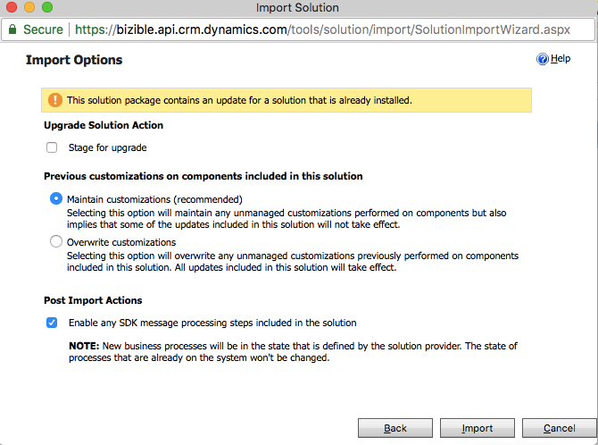
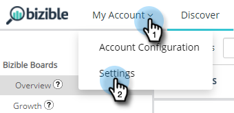

# [!DNL Microsoft Dynamics] CRM 설치 안내서 {#microsoft-dynamics-crm-installation-guide}

>[!NOTE]
>
>설명서에 &quot;[!DNL Marketo Measure]&quot;을(를) 지정하는 지침이 표시될 수 있지만 CRM에는 &quot;Bizible&quot;이 표시됩니다. 이를 업데이트하고 리브랜딩이 곧 CRM에 반영되도록 노력하고 있습니다.

## 지원되는 버전 {#supported-versions}

[!DNL Marketo Measure]은(는) 다음 [!DNL Microsoft Dynamics CRM] 버전을 지원합니다.

* [!DNL Microsoft Dynamics 2016](온라인 및 온-프레미스)
* [!DNL Microsoft Dynamics 365](온라인 및 온-프레미스)

연결 및 인증의 경우 [!DNL Marketo Measure]은(는) 다음 ADFS(Active Directory Federated Services) 버전을 지원합니다.

* ADFS 4.0 - [!DNL Windows Server 2016]
* ADFS 5.0 - [!DNL Windows Server 2019]

## 관리 솔루션 설치 {#install-the-managed-solution}

Dynamics CRM에서 zip 파일을 [다운로드하여 설치](assets/marketo-measure-dynamics-extension.zip)합니다.

**[!UICONTROL Settings]** > **[!UICONTROL Customizations]** > **[!UICONTROL Solutions]** > **[!UICONTROL Import]**(단추) > **[!UICONTROL Choose File]**.

>[!NOTE]
>
>다음 두 스크린샷은 솔루션 업그레이드 중에 촬영되었기 때문에 사용자 스크린샷과 약간 다를 수 있습니다.

## [!DNL Marketo Measure] 사용자 만들기 {#creating-a-marketo-measure-user}

CRM에 있는 다른 사용자와 관련된 문제를 방지하기 위해 데이터를 내보내고 가져올 Dynamics 내에서 &quot;애플리케이션 사용자&quot;로 전용 Marketo Measure 사용자를 만드는 것이 좋습니다. [!DNL Marketo Measure] 계정을 만들 때 사용할 사용자 이름, 암호 및 끝점 URL을 참고하십시오.

## 보안 역할 {#security-roles}

조직에서 Dynamics 보안 역할을 사용하는 경우 연결된 사용자 또는 전용 [!DNL Marketo Measure] 사용자에게 필요한 엔터티에 대한 충분한 읽기/쓰기 권한이 있는지 확인하십시오.

보안 역할은 **[!UICONTROL Settings]** > **[!UICONTROL Security]** > **[!UICONTROL Security Roles]**&#x200B;에 있습니다.

[!DNL Marketo Measure] 사용자 지정 엔터티의 경우 모든 엔터티에 대한 전체 권한이 필요합니다.

표준 엔티티에 대한 읽기/쓰기 권한 외에 Campaign &quot;만들기&quot; 권한도 필요합니다.

>[!NOTE]
>
>영업 기회를 종료하는 사용자도 전체 권한이 필요합니다.

Dynamics 표준 엔터티의 경우 [!DNL Marketo Measure] Dynamics 스키마 문서를 참조하십시오. [!DNL Marketo Measure]은(는) 높은 수준에서 특정 엔터티를 읽어 적절한 데이터를 수집하고 관리 솔루션이 설치된 사용자 지정 필드에 씁니다. 표준 레코드는 생성되지 않으며 표준 필드는 업데이트되지 않습니다.

## 페이지 레이아웃에 터치포인트 포함: {#include-touchpoints-on-page-layouts}

1. 각 엔티티에 대해 양식 편집기로 이동합니다. **[!UICONTROL Settings]** > **[!UICONTROL Customizations]** > **[!UICONTROL Customize the System]** > `[Entity]` > **[!UICONTROL Forms]**&#x200B;에서 찾을 수 있습니다. 또는 레코드를 보는 동안 설정에서 찾을 수 있습니다.

   * 구성할 엔티티: Account, Opportunity, Contact, Lead 및 Campaign

   * 캠페인을 구성하려면 **[!UICONTROL CRM]** > **[!UICONTROL Campaigns]**&#x200B;에서 &quot;캠페인 동기화&quot; 옵션을 켜야 합니다.

   

1. 페이지 레이아웃: 먼저 터치포인트를 활성화할 섹션에 &quot;[!UICONTROL One Column]&quot; 타일을 추가합니다. 이 새 열에서 Account, Opportunity, Contact 및 Lead 엔티티 내의 각 양식에 추가된 하위 그리드가 필요합니다.

   

   

1. 서브그리드에서 렌더링해야 하는 개체(구매자 속성 접점 또는 구매자 접점)를 선택합니다. 이는 개체 관계에 따라 다릅니다. 필요한 경우 [편집] 단추를 눌러 표시되는 열을 변경합니다. 기본 레이아웃은 관리되는 솔루션에 의해 설정됩니다.

   Buyer Attribution Touchpoint 하위 그리드 - 계정, 기회 및 연락처\
   Buyer Touchpoint 하위 그리드 - 리드 및 연락처

   

1. 양식 업데이트가 완료되면 변경 사항을 게시하고 저장합니다.

## 스키마 관련 고려 사항 {#schema-related-considerations}

**매출**

[!DNL Marketo Measure]은(는) 기본적으로 표준 실제 수익 필드를 가리킵니다. 이 옵션을 사용하지 않는 경우 맞춤형 워크플로우가 필요하므로 매출에 대해 솔루션 엔지니어나 성공 관리자에게 보고하는 방법을 설명합니다.

**날짜 닫기**

[!DNL Marketo Measure]은(는) 기본적으로 실제 종료 날짜 필드를 가리킵니다. 이 필드를 사용하지 않거나 예상 종료 날짜 필드도 사용하는 경우 솔루션 엔지니어나 성공 관리자에게 프로세스를 설명하십시오. 두 필드를 모두 처리하려면 사용자 지정 워크플로우가 필요할 수 있습니다.

## 연결 및 데이터 공급자 구성 {#configuring-your-connections-and-data-providers}

[!DNL Marketo Measure] 응용 프로그램에 로그인하고 Adobe Admin Console에서 사용자로 설정된 후 다음 단계는 다양한 데이터 연결을 설정하는 것입니다.

**데이터 공급자로서의 CRM**

1. [!DNL Marketo Measure] 계정에서 **[!UICONTROL My Account]** 드롭다운을 클릭하고 **[!UICONTROL Settings]**&#x200B;을(를) 선택합니다.

   

1. 왼쪽 탐색 메뉴의 [!UICONTROL Integrations] 아래에서 **[!UICONTROL Connections]**&#x200B;을(를) 클릭합니다.

   

1. **[!UICONTROL Set Up New CRM Connection]** 단추를 클릭합니다.

   

1. [!UICONTROL Microsoft Dynamics CRM] 옆에 있는 **[!UICONTROL Connect]** 단추를 클릭합니다.

   

1. [!UICONTROL Credentials] 또는 [!UICONTROL OAuth]을(를) 선택하십시오.

   

   >[!NOTE]
   >
   >OAuth에 대한 자세한 내용은 [이 문서](/help/marketo-measure-and-dynamics/getting-started-with-marketo-measure-and-dynamics/oauth-with-azure-active-directory-for-dynamics-crm.md)를 참조하세요. 프로세스에 대한 질문이 있는 경우 [!DNL Marketo Measure] 계정 담당자에게 문의하십시오.

1. 이 예에서는 자격 증명을 선택했습니다. 자격 증명을 입력하고 **[!UICONTROL Next]**&#x200B;을(를) 클릭합니다.

연결 후 CRM/맵 연결 목록에 Dynamics 연결의 세부 정보가 표시됩니다.

**광고 계정 연결**

광고 계정을 [!DNL Marketo Measure]과(와) 연결하려면 [!DNL Marketo Measure] 응용 프로그램의 [!UICONTROL Connections] 탭을 방문하여 시작하십시오.

1. 위의 _데이터 공급자로서 CRM_ 섹션에서 1~2단계를 수행합니다.

1. **[!UICONTROL Set up New CRM Connection]** 단추를 클릭합니다.

   

1. 원하는 플랫폼을 선택합니다.

   

**[!DNL Marketo Measure]Javascript**

[!DNL Marketo Measure]이(가) 웹 활동을 추적할 수 있도록 설정하는 단계는 여러 가지가 있습니다.

1. **[!UICONTROL My Account]** 드롭다운을 클릭하고 **[!UICONTROL Account Configuration]**&#x200B;을(를) 선택합니다.

   

1. 전화 번호를 입력합니다. 웹 사이트의 경우 웹 사이트에서 [!DNL Marketo Measure] 추적에 사용되는 주 루트 도메인을 입력하십시오. 완료되면 **[!UICONTROL Save]**&#x200B;을(를) 클릭합니다.

   

   >[!NOTE]
   >
   >여러 루트 도메인을 추가하려면 [!DNL Marketo Measure] 계정 담당자에게 문의하십시오.

1. [[!DNL Marketo Measure] JavaScript](/help/marketo-measure-tracking/setting-up-tracking/adding-marketo-measure-script.md)을(를) 전체 사이트 및 랜딩 페이지에 배치해야 합니다. 랜딩 페이지의 헤드 내에서 스크립트를 하드코딩하거나 [Google 태그 관리자](/help/marketo-measure-tracking/setting-up-tracking/adding-marketo-measure-script-via-google-tag-manager.md)와 같은 Tag Management 시스템을 통해 추가하는 것이 좋습니다.

   >[!NOTE]
   >
   >기본적으로 [!DNL Marketo Measure]은(는) 작업이 데이터를 CRM으로 보낼 때마다 API 크레딧당 200개의 레코드를 내보냅니다. 대부분의 고객의 경우 [!DNL Marketo Measure]에서 사용하는 API 크레딧과 CRM의 CPU 리소스 요구 사항 간의 최적의 균형을 제공합니다. 그러나 워크플로우 및 트리거와 같이 복잡한 CRM 구성을 사용하는 고객의 경우 배치 크기를 줄이면 CRM 성능을 향상시키는 데 도움이 될 수 있습니다. 이를 위해 [!DNL Marketo Measure]에서 고객이 CRM 내보내기 일괄 처리 크기를 구성할 수 있습니다. 이 설정은 [!DNL Marketo Measure] 웹 응용 프로그램의 설정 > CRM > 일반 페이지에서 사용할 수 있으며 고객은 배치 크기 200(기본값), 100, 50 또는 25 중에서 선택할 수 있습니다.
   >
   >이 설정을 수정할 때는 배치 크기가 작을수록 CRM에서 더 많은 API 크레딧을 사용한다는 점을 유의하십시오. CRM에서 CPU 시간 초과 또는 높은 CPU 로드가 발생하는 경우에만 배치 크기를 줄이는 것이 좋습니다.

   >[!NOTE]
   >
   >Marketo Measure에서 Dynamics로 데이터 내보내기를 비활성화하면 기존 데이터가 제거되지 않습니다. 기존 데이터를 제거하는 데 도움이 필요하면 Dynamics 지원에 문의하십시오.

   >[!MORELIKETHIS]
   >
   >[오류 알림](/help/configuration-and-setup/getting-started-with-marketo-measure/error-notifications.md){target="_blank"}
