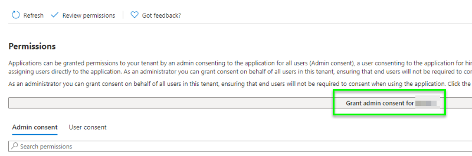

# OAuth 포함 [!DNL Azure Active Directory] Dynamics CRM용 {#oauth-with-azure-active-directory-for-dynamics-crm}

## 영향을 받는 사용자 {#who-s-affected}

이 설정은 새로운 을 위한 것입니다. [!DNL Marketo Measure] 다음을 통해 Dynamics CRM을 사용하는 고객 [!DNL Azure Active Directory] (AAD) 계정 또는 기존 사용자 이름 및 암호에서 (으)로 마이그레이션하려는 고객의 경우 [!DNL Azure Active Directory] (OAuth 포함)

>[!NOTE]
>
>이러한 두 시나리오 모두에서 Dynamics 인스턴스 연결을 용이하게 하기 위해 AAD가 여기에 설정됩니다. [!DNL Marketo Measure] 를 데이터 공급자로 사용하십시오.

## 새 애플리케이션 설정 {#set-up-new-application}

1. 다음에 로그인 [Azure 포털](https://portal.azure.com/#home).

1. 페이지 오른쪽 상단에서 계정을 클릭한 다음 디렉터리 전환 탐색을 클릭하고 적절한 테넌트를 선택하여 Azure AD 테넌트를 선택합니다. 계정에 Azure AD 테넌트가 하나만 있거나 이미 적절한 Azure AD 테넌트를 선택한 경우 이 단계를 건너뜁니다.

   

1. 검색 대상[!DNL Azure Active Directory]검색 막대에서 &quot;을(를) 클릭하고 이름을 클릭하여 엽니다.

   

1. 클릭 **[!UICONTROL App Registrations]** 왼쪽 메뉴에서 을 클릭합니다.

   

1. 클릭 **[!UICONTROL New Registration]** 맨 위에

   

1. 프롬프트에 따라 응용 프로그램을 만듭니다. 웹 애플리케이션이든 공용 클라이언트(모바일 및 데스크탑) 애플리케이션이든 상관없지만, 웹 애플리케이션이나 공용 클라이언트 애플리케이션에 대한 특정 예제를 원하는 경우 [빠른 시작](https://learn.microsoft.com/en-us/azure/active-directory/develop/v2-overview).\
   a. 이름은 애플리케이션 이름이며 최종 사용자에게 애플리케이션에 대해 설명합니다.\
   b. 지원되는 계정 유형에서 조직 디렉터리와 개인 Microsoft 계정의 계정을 선택합니다.\
   c. 리디렉션 URI를 제공합니다. 웹 애플리케이션의 경우 사용자가 로그인할 수 있는 앱의 기본 URL입니다. 예를 들어, `http://localhost:12345`. 공용 클라이언트(모바일 및 데스크톱)의 경우 Azure AD는 토큰 응답을 반환하는 데 이 토큰을 사용합니다. 응용 프로그램에 해당하는 값을 입력합니다. 예를 들어, `http://MyFirstAADApp`.

1. 등록을 완료하면 Azure AD는 응용 프로그램에 고유한 클라이언트 식별자(응용 프로그램 ID)를 할당합니다. 다음 섹션에서 이 값이 필요하므로 애플리케이션 페이지에서 이 값을 복사합니다.

1. Azure 포털에서 응용 프로그램을 찾으려면 **[!UICONTROL App Registrations]**&#x200B;을 클릭한 다음 을 클릭합니다 **[!UICONTROL All Applications]**. 새로 만든 응용 프로그램을 엽니다.

1. 클릭 **[!UICONTROL Authentication]** 왼쪽 메뉴에서 을 클릭합니다.

   

1. 추가 [!DNL Marketo Measure] 리디렉션 URL: `https://apps.bizible.com/OAuth2` 및 `https://apps.bizible.com/OAuth2?identityOnly=true` 리디렉션 URL 목록으로 이동합니다.

   

1. API 권한 탭으로 이동하여 애플리케이션에 올바른 권한이 할당되었는지 확인합니다.

   

1. 여기에서 &quot;[!UICONTROL enterprise]검색 상자에서 &quot;&quot;를 클릭하고 **[!UICONTROL Enterprise Applications]**.

   

1. 다시, 응용 프로그램 목록에서 새 응용 프로그램을 찾아 엽니다.

1. 권한 탭에서 **[!UICONTROL Grant Admin Consent for (instance name)]**.

   

1. 클릭 **[!UICONTROL Accept]**.

   

1. 의 &quot;[!UICONTROL Users and Groups]&quot; 탭에서 유효한 &quot;사용자 및 그룹&quot;이 애플리케이션에 할당되었는지 확인하십시오.

   

## 응용 프로그램 사용자 생성 {#creating-an-application-user}

애플리케이션 등록이 완료되면 애플리케이션 사용자를 생성할 수 있습니다.

1. 공통 데이터 서비스 환경(`https://[org].crm.dynamics.com`).

1. 다음으로 이동 **[!UICONTROL Settings]** > **[!UICONTROL Security]** > **[!UICONTROL Users]**.

1. 선택 **[!UICONTROL Application Users]** 를 입력합니다.

1. 선택 **[!UICONTROL + New]**.

1. 응용 프로그램 사용자 양식에 필요한 정보를 입력합니다.

   >[!NOTE]
   >
   >* 사용자 이름 정보는에 있는 사용자와 일치하지 않아야 합니다. [!DNL Azure Active Directory].
   >
   >* 응용 프로그램 ID 필드에 Azure AD에서 이전에 등록한 앱의 응용 프로그램 ID를 입력합니다.

1. 설정이 올바르면 을(를) 선택한 후 **[!UICONTROL Save]**, **[!UICONTROL Application ID URI]** 및 **[!UICONTROL Azure AD Object Id]** 필드는 올바른 값으로 자동 채워집니다.

1. 사용자 양식을 종료하기 전에 **[!UICONTROL Manage Roles]** 애플리케이션 사용자가 원하는 조직 데이터에 액세스할 수 있도록 이 애플리케이션 사용자에게 보안 역할을 할당합니다.

## OAuth를 통해 Dynamics 인스턴스 연결 {#connecting-your-dynamics-instance-via-oAuth}

1. Dynamics 연결을 처음 설정할 때 의 &quot;데이터 공급자로서 CRM&quot; 섹션의 1-5단계를 따릅니다 [이 문서](/help/marketo-measure-and-dynamics/getting-started-with-marketo-measure-and-dynamics/microsoft-dynamics-crm-installation-guide.md).

1. OAuth 자격 증명을 입력하라는 메시지가 표시되면 위의 섹션에 설정된 클라이언트 ID, 클라이언트 암호 및 애플리케이션 ID URI를 입력합니다.

a. Client Id는 위 섹션의 #7단계에 있는 ID입니다. 기록하지 않은 경우 앱 등록 설정에 애플리케이션 ID가 표시됩니다.

b. 클라이언트 암호는 Azure 포털에서 인증서 및 암호로 응용 프로그램에 대해 만든 응용 프로그램 암호입니다.

c. 애플리케이션 ID URI는 대상 웹 API(보안 리소스)의 URL입니다. 앱 ID URL을 찾으려면 Azure 포털에서 [!DNL Azure Active Directory]에서 응용 프로그램 등록을 클릭하고 응용 프로그램의 설정 페이지를 연 다음 속성을 클릭합니다. 다음과 같은 외부 리소스일 수도 있습니다. `https://graph.microsoft.com`. 일반적으로 Dynamics 인스턴스의 URL입니다.

1. 을(를) 클릭한 후 **[!UICONTROL Submit]**&#x200B;로 로그인하라는 메시지가 표시됩니다. [!DNL Azure Active Directory]. 인증이 성공하면 Dynamics 계정이 내의 데이터 공급자로 연결됩니다 [!DNL Marketo Measure].

## Dynamics 계정 재인증 {#re-authenticating-your-dynamics-account}

1. 다음에 있을 때 [!DNL Marketo Measure] 응용 프로그램, 이동 **[!UICONTROL My Settings]** > **[!UICONTROL Settings]** > **[!UICONTROL Connections]**.

1. Dynamics 연결 옆에 있는 CRM 섹션에서 키 아이콘을 클릭합니다.

1. 키를 클릭하면 팝업이 나타나고 등록 흐름과 유사하게 클라이언트 ID, 클라이언트 암호 및 애플리케이션 ID URI를 입력하라는 메시지가 표시됩니다.

   

1. 을(를) 클릭한 후 **[!UICONTROL Submit]**&#x200B;로 로그인하라는 메시지가 표시됩니다. [!DNL Azure Active Directory]. 인증에 성공하면 내 Dynamics 계정이 다시 인증됩니다. [!DNL Marketo Measure].
