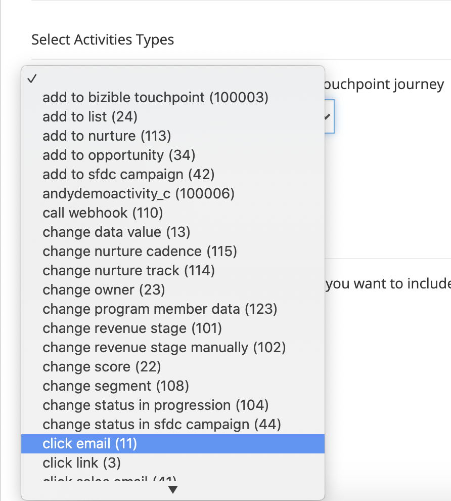

# [!DNL Marketo Engage] 활동 통합 {#marketo-engage-activities-integration}

전체 [!DNL Marketo Measure] 및 [!DNL Marketo Engage] 통합, Marketo 활동을 끌어들이려는 이 노력은 큰 역할을 합니다. Marketo 활동을 통해 시스템에서 클릭 이메일, 점수 변경 또는 승급 상태의 변경 상태와 같은 이벤트를 추적합니다. 이러한 활동 유형을 축소하고 정의하여 터치 포인트에 적합한 하위 집합을 선택할 수 있습니다. 이러한 활동에 대해 터치포인트를 만들면, 참여 여정에서 추적되고 유료 검색 또는 파트너 마케팅과 같은 다른 마케팅 채널과 함께 측정됩니다.

## 요구 사항 {#requirements}

* 프로덕션 Marketo 인스턴스
* 프로덕션 [!DNL Salesforce] 또는 [!DNL Microsoft Dynamics] 인스턴스
* 모든 유료 [!DNL Marketo Measure] 구독
* Marketo 사용자 동기화 사용([!DNL Marketo Measure] 설정)
* Marketo 프로그램 사용([!DNL Marketo Measure] 설정)
* Marketo 활동 활성화됨([!DNL Marketo Measure] 설정)

## 설정 {#setup}

1. Marketo 활동 설정을 시작하려면 다음 위치로 이동합니다 **내 계정** > **설정** > **활동**.

   

   

   먼저 규칙을 작성할 활동 유형 목록을 선택하는 것이 필요합니다. 필요한 하드 유형의 활동 유형은 없지만 터치 포인트를 과부하가 하지 않고 중요한 이정표의 중요도를 희석하지 않는 것이 좋습니다. 따라서 관련 계약을 추적하는 데 5개 이상의 활동 유형이 필요하지 않을 수 있습니다.

1. 아래의 드롭다운 메뉴를 클릭합니다 [!UICONTROL Select Activities Types] 다양한 유형을 선택하기 시작합니다.

   

1. 필요한 모든 활동을 선택하면 [!UICONTROL Selected Activities List] 그 이하도 [!UICONTROL Define Rules].

   

1. 각 활동 유형에 대해 터치 포인트에 적합한 레코드를 결정하는 규칙을 하나 이상 정의해야 합니다. 예를 들어, Marketo 사람이 90점 이상에 도달하면 시스템이 터치포인트를 만들 수 있도록 &quot;점수 변경&quot; 활동 유형에 대한 규칙을 추가합니다.

1. 먼저, 활동 유형에 따라 [!DNL Marketo Measure] 나중에 채널 매핑에 사용할 수 있는 캠페인 이름입니다. [!DNL Marketo Measure] 캠페인 이름은 여러 규칙에서 다시 사용할 수 있습니다. 이렇게 하면 단일 채널 규칙에서 사용할 수 있는 더 광범위한 이름이 있습니다. 일부 활동 유형에는 Marketo 프로그램이 포함되어 있지 않으므로, 이 첫 번째 단계로서 이름이 필요합니다.

   다음은 이러한 추가 단계가 어떤 모습인지에 대한 예입니다.

   

1. &quot;점수 변경&quot; 예에서는 Marketo 프로그램에서 해당 정보를 가져올 수 있으므로 캠페인 이름을 입력할 필요가 없습니다. 이제 규칙 표현식을 만들 수 있습니다. 예제에서는 &quot; 필드를 선택하겠습니다.[!UICONTROL New Value]&quot;(&quot;[!UICONTROL is greater than]&quot; 값을 90으로 묶습니다.

   규칙에서 확장하고 &quot;and&quot; 또는 &quot;or&quot; 문을 추가하여 결과 범위를 좁힐 수 있습니다.

   

   

1. 마지막으로 터치 포인트 날짜로 사용해야 하는 사항을 선택합니다. 사용 가능한 모든 날짜 또는 날짜/시간 필드가 Marketo에서 여기에 표시됩니다. 사용자 지정 날짜 필드가 없으면 &quot;[!UICONTROL Activity Date].&quot;

   

1. 을(를) 클릭합니다. **[!UICONTROL Save As Draft]** 변화를 잃지 않도록 하는 길입니다.

   

1. 로 이동합니다 **[!UICONTROL Attribute Mapping]** 탭.

   

1. 선택한 각 활동 유형에 대해 추가적인 Marketo 속성을 터치포인트 필드에 매핑하여 여기에서 해당 값을 보고 보고할 수 있습니다 [!DNL Marketo Measure Discover] 또는 CRM에서 사용할 수 있습니다.

   많은 필드가 자동으로 매핑되므로 다른 통합과 일치하도록 변경할 수 없습니다. 아래의 필드 매핑 섹션을 참조하여 이러한 값을 찾습니다. 일부 활동 유형의 경우, Marketo에는 랜딩 페이지용 특성, 레퍼러 페이지 또는 선택적으로 터치포인트 필드에 매핑할 수 있는 브라우저가 포함됩니다. 아래 예에서는 제거할 수 있는 몇 가지 추가 제안을 했습니다.

1. 매핑할 왼쪽 열에서 구매자 터치포인트 필드를 선택합니다. 그런 다음 구매자 터치포인트 필드에 채울 Marketo 속성을 선택합니다. 이러한 매핑은 선택 사항이며 이러한 매핑 위에 추가 매핑이 있어야 합니다 [!DNL Marketo Measure] 은(는) 이미 설정되어 있습니다.

   매핑 가능한 필드:

   * 도시
   * 국가
   * 지역
   * 랜딩 페이지
   * 레퍼러 페이지
   * 양식 페이지
   * 양식 날짜
   * 플랫폼
   * 브라우저

   >[!NOTE]
   >
   >광고 콘텐츠 또는 키워드와 같은 광고 필드는 광고 플랫폼 통합용으로 예약되어 있으므로 이 목록에서 사용할 수 없습니다.

## 활동 유형 {#activity-types}

일부 활동 유형은 프로그램 ID와 프로그램 이름을 제공하므로 구매자 터치포인트의 캠페인 ID 및 캠페인 이름에 쉽게 매핑할 수 있습니다. 다른 사용자의 경우 프로그램 연결이 없으므로 규칙 정의 일부를 사용하여 [!DNL Marketo Measure] 캠페인 이름. 다음은 각 카테고리 목록입니다.

**프로그램 ID가 있는 활동 유형**

이메일 보내기(6)\
배달된 이메일(7)\
이메일 바운스됨(8)\
이메일 구독 취소(9)\
이메일 열기(10)\
이메일(11)을 클릭합니다\
데이터 값 변경(13)\
점수 변경(22)\
목록에 추가(24)\
진행 상태 변경(104)\
양육에 추가(113)\
Remotive Cadence 변경(115)

>[!NOTE]
>
>프로그램 없이 활동이 감지되는 경우 프로그램 ID가 예상되는 활동 유형 중에서 [!DNL Marketo Measure] null Campaign 값을 가질 수 없으므로 은 이 값을 적절한 터치포인트로 허용하지 않습니다.

**프로그램 ID가 없는 활동 유형**

링크(3)를 클릭합니다\
새 리드(12)\
SFDC로 동기화(19)\
리드 변환(21)\
소유자 변경(23)\
목록에서 제거(25)\
SFDC 활동(26)\
이메일 바운스됨 소프트(27)\
SFDC(29)에서 리드 삭제\
리드 병합(32)\
Opportunity에 추가 (34)\
Opportunity에서 제거(35)\
영업 기회 업데이트(36)\
리드 삭제(37)\
경고 보내기(38)\
영업 전자 메일 보내기(39)\
영업 전자 메일 열기(40)\
Sales Email (41) 을 클릭합니다.\
SFDC Campaign에 추가(42)\
SFDC Campaign에서 제거(43)\
SFDC Campaign에서 상태 변경(44)\
영업 이메일 수신(45)\
캠페인 요청(47)\
판매 이메일 바운스됨(48)\
매출 단계 변경(101)\
수동으로 매출 단계 변경(102)\
세그먼트 변경(108)\
전화 웹 후크(110)\
친구 이메일로 전송(111)\
친구 전자 메일 수신(112)\
Reductor 트랙 변경(114)\
Marketo으로 리드 푸시(145)\
Microsoft으로 리드 동기화(300)\
(159) 예약된 대화 상자 약속(160) 대화 상자 목표에 도달함(161) 사용자 지정 활동(xxx)에 연결된 콘텐츠 공유(400) 대화 상자 참여(158) 문서

## 채널 매핑 {#channel-mapping}

프로그램 ID가 있는 활동 유형의 모든 규칙에 대해 Marketo 프로그램 채널은 프로그램에서 결정됩니다. 프로그램 채널을 사용하여 사용자 지정 오프라인 채널에 매핑하므로 채널이 올바르게 구성되어 있는지 확인해야 합니다 [여기에 지시된 대로](/help/marketo-measure-and-marketo/marketo-measure-integrations-with-marketo/marketo-engage-programs-integration.md#channel-mapping).

그리고 프로그램 ID가 없는 활동 유형의 모든 규칙에 대해 첫 번째 단계는 캠페인 이름을 만드는 것입니다. 이 캠페인 이름을 사용하여 사용자 지정 온라인 채널을 설정합니다 [여기에 누워](/help/channel-tracking-and-setup/online-channels/online-custom-channel-setup.md).

Marketo 활동에 대한 채널이 올바르게 구성되지 않으면 새 터치포인트가 &quot;기타&quot; 채널에 속할 수 있습니다.

## 프로그램 비용 {#program-costs}

Marketo 프로그램의 데이터 가져오기를 통해 비용은 기간 비용에서 자동으로 다운로드되며 Marketo에서 보고된 비용이 지정된 달 전체에 배포됩니다. 예를 들어 2021년 1월에 $1000가 보고되는 경우 $1000가 31일로 분할됩니다. 비용은 [!DNL Marketo Measure Discover].

## 쿠키 매핑 {#cookie-mapping}

의 결과로 [!DNL Marketo Measure] Marketo과 통합, [!DNL Marketo Measure] 이제 쿠키 ID도 매핑되고 와 동기화됩니다 [!DNL Marketo Munchkin Id]. 이렇게 하면 FT 및 LC 터치를 Marketo 활동에 적용하는 대신 익명의 첫 번째 터치를 웹 세션에 연결하도록 간극을 닫는 데 도움이 됩니다. 다음 시나리오를 상상해 보십시오.

Mark는 Facebook 광고를 클릭하고 그가 쿠키된 wayneenterprises.com에 도달합니다. [!DNL Marketo Measure] Id 123 및 [!DNL Marketo Munchkin Id] 456. 양식 채우기가 수행되지 않습니다.

Wayne Enterprises 마케팅 팀은 특정 타겟팅된 리드에 대한 이메일을 전송합니다. 그 중 하나는 다음과 같습니다 `mark@email.com`.

`mark@email.com` 이메일 및 클릭스루 및 랜딩을 수신합니다. `wayneenterprises.com`. 이렇게 됩니다 `mark@email.com's` 두 번째 방문 `wayneenterprise.com` 쿠키 Id가 동일하지만 양식 채우기가 없으므로 [!DNL Marketo Measure]하지만 여전히 익명의 방문자입니다.

Wayne Enterprises 마케팅 팀은 &quot;이메일 클릭&quot; 활동 유형에 대한 터치포인트를 생성하는 Marketo 활동 규칙을 만듭니다.

오늘의 구현은 `mark@email.com` 이메일 클릭 활동 유형의 Marketo 활동에서 을 참조하십시오.

이 쿠키 매핑 개선 사항으로 인해 FT는 다시 돌아가서 Facebook 광고에 대한 차감되고 LC가 이메일에 반영됩니다.

>[!NOTE]
>
>쿠키 매핑 동작을 사용하면 웹 방문에서 오는 일부 LC 터치포인트를 찾을 수 있습니다. 연결된 활동 없이 Marketo에 리드가 표시될 수 있습니다 [!DNL Marketo Measure] 리드를 다운로드했고 연결된 쿠키와 일치한 다음 리드를 만든 양식 활동이 없는 경우에도 가장 최근 웹 세션으로 추적했습니다.

## FAQ {#faq}

**Marketo 프로그램 규칙을 만들지 Marketo 활동 규칙을 만드는지 어떻게 알 수 있습니까?**

다음 [!DNL Marketo Engage] 프로그램 통합은 개인이 프로그램의 프로그램 멤버인지 여부에 따라 터치포인트를 생성하는 간단한 방법입니다. 개인이 특정 프로그램 상태로 변경되는 시간을 기준으로 규칙을 정의하는 데 관심이 있다면 [!DNL Marketo Engage] 활동 통합은 원하는 설정입니다. 특히 &quot;진행 상태 변경&quot; 활동 유형에서 터치 포인트 날짜를 시스템에서 생성한 활동 날짜에 매핑할 수 있습니다.

**터치 포인트 유형의 이름이 잘리는 이유는 무엇입니까?**

터치 포인트 유형 필드가 [!DNL Marketo Measure] 패키지(16자) 안타깝게도 필드의 문자 제한을 변경하려면 기존 필드를 더 이상 사용하지 않고 새 필드를 만들어야 합니다. 터치 포인트 유형의 값은 활동 유형이며, 중간 필드에서도 설정됩니다.

**사용 가능한 활동 목록에 내 사용자 지정 활동 유형이 표시되지 않는 이유는 무엇입니까?**

초안 또는 초안이 있는 승인되지 않은 &quot;승인됨&quot; 사용자 지정 활동 유형만 표시됩니다.

**터치 포인트를 생성할 활동 유형을 어떻게 결정합니까?**

만들 수 있는 활동 유형 수에는 제한이 없지만 일반적으로 5개 이하의 활동 유형을 사용하는 것이 좋습니다. 터치 포인트 여정에 포함될 만큼 적절한 마케팅 활동을 파악하려면 시간이 걸립니다. 예를 들어 &quot;이메일 가입 해지됨&quot;은 추적하기 중요한 터치포인트가 될 수 없지만 추가 필터가 있는 &quot;이메일 클릭&quot;이 좋은 것일 수 있습니다. 이것은 각 조직 및 각 팀에 따라 다르므로 여기에서 가장 적합한 방법에 대해 브레인스토밍하도록 팀과 작업하는 것이 좋습니다.

**브라우저 이름이 잘리는 이유는 무엇입니까?**

다음 [!DNL Marketo Measure] Marketo에서 가져오는 사용자 에이전트 값은 더 긴 문자열인 경향이 있지만 브라우저 이름은 20자로 제한됩니다.

BrowserInfo.Name\
BrowserInfo.Version\
PlatformInfo.Name\
PlatformInfo.Version
