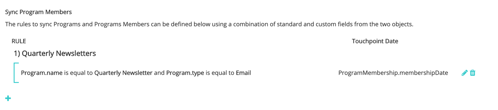

# [!DNL Marketo Engage] 프로그램 통합 {#marketo-engage-programs-integration}

사용 [!DNL Marketo Measure] 통합 [!DNL Marketo Engage] 프로그램, 고객은 Marketo 프로그램 멤버십에서 속성 추적을 위한 터치포인트를 만들 수 있습니다. 이 기능을 통해 마케터는 이메일 또는 참여 프로그램에서 볼 수 없는 프로그램 멤버십 추적을 시작할 수 있습니다 [!DNL Marketo Measure] javascript이고 속성 여정 내에서 측정해야 합니다.

## 사용 가능 {#availability}

모든 계층.

## 요구 사항 {#requirements}

* 프로덕션 Marketo 인스턴스
* Production Salesforce 또는 Microsoft Dynamics 인스턴스
* 모든 유료 [!DNL Marketo Measure] 구독
* Marketo 사용자 동기화 사용([!DNL Marketo Measure] 설정)
* Marketo 프로그램 사용([!DNL Marketo Measure] 설정)

## 설정 {#setup}

**규칙**

1. Marketo 프로그램에서 규칙 설정을 시작하려면 다음 위치로 이동합니다 **[!UICONTROL My Account]** > **[!UICONTROL Settings]** > **[!UICONTROL Programs]**. 을(를) 클릭합니다. **+** 아이콘을 사용하여 첫 번째 규칙 만들기를 시작합니다.

   

   

1. 규칙 이름을 추적하는 데 도움이 되는 경우 선택적으로 규칙 이름을 설정할 수 있습니다. 먼저 프로그램 및 프로그램 멤버십 필드 목록에서 규칙을 정의할 필드를 선택합니다. 확인할 연산자와 예상 값을 선택하여 규칙 작성을 계속합니다.

   

1. 동일한 상자 내에 다른 문을 추가하여 규칙에서 &quot;and&quot; 기준을 설정하거나 상자 외부의 + 아이콘을 클릭하여 &quot;or&quot; 문을 설정합니다.

   

1. 터치 포인트 날짜에 매핑하는 데 사용할 날짜 또는 날짜/시간 필드를 선택합니다. Marketo에서 사용할 수 있는 값 목록을 보려면 중괄호를 입력합니다 `{` 사용 가능한 필드를 표시합니다.

   

   >[!NOTE]
   >
   >규칙이 활동 날짜 또는 프로그램 구성원이 특정 상태에 도달한 날짜를 캡처하려는 경우 [!DNL Marketo Engage] 활동 통합을 실행하고 &quot;진행 상태 변경&quot; 활동 유형에 대한 규칙을 설정합니다.

   

완료된 규칙은 다음과 같습니다.

## 테스트 {#test}

일부 규칙을 만든 후 테스트하여 문이 프로그램과 일치하는지 확인할 수 있습니다.

1. 테스트를 실행하려면 **[!UICONTROL TEST]** 아래와 같이 버튼을 클릭합니다.

   

1. Marketo의 프로그램 ID에 를 입력할 수 있는 모달이 나타납니다.

   

   ID를 입력하고 [!UICONTROL Test] 버튼을 클릭하면 규칙 엔진은 각 규칙을 살펴보고 프로그램이 규칙에 적합한지 여부를 결정합니다. 아래 예에서는 프로그램 1002가 [!DNL Marketo Measure] Ebook에는 5개의 프로그램 구성원이 있으며 표시되는 규칙으로 인해 사용할 수 있습니다.

   규칙은 5000명의 멤버의 샘플 크기에 따라 실행됩니다. 프로그램에 5000명 이상의 구성원이 포함되어 있는 경우 모든 구성원의 호환성을 확인하지 않을 수 있습니다. 이 도구는 규칙이 올바로 구성되어 있는지 확인하는 방법으로 사용됩니다.

   

   멤버 수를 클릭하여 프로그램 내에 적합한 Marketo 사람 ID 목록을 볼 수 있습니다.

   

## 채널 매핑 {#channel-mapping}

Marketo 프로그램 채널 목록에서 값을 [!DNL Marketo Measure] 설정 내에서 만든 사용자 지정 마케팅 채널입니다. 이러한 프로그램에서 생성된 모든 터치포인트는 여기에서 선택하는 채널 및 하위 채널 이름을 상속합니다.

1. 다음으로 이동 **[!UICONTROL My Account]** > **[!UICONTROL Settings]** > **[!UICONTROL Offline Channels]**.

1. 맨 위에는 CRM 캠페인 유형에 매핑할 수 있는 옵션이 있고, 아래에 Marketo 프로그램 채널에 대한 옵션이 표시됩니다.

1. 먼저 값에 매핑해야 하는 채널 을 선택한 다음, 선택적으로 하위 채널을 선택합니다. 완료되면 을(를) 클릭합니다. **[!UICONTROL Save]** 아래에 있습니다.

   

## 프로그램 비용 {#program-costs}

Marketo 프로그램의 데이터 가져오기를 통해 비용은 기간 비용에서 자동으로 다운로드되며 Marketo에서 보고된 비용이 지정된 달 전체에 배포됩니다. 예를 들어 2021년 1월에 $1000가 보고되는 경우 $1000가 31일로 분할됩니다. 비용은 [!DNL Marketo Measure Discover].

## 작동 방법 {#how-it-works}

**필드 매핑**

<table> 
 <colgroup> 
  <col> 
  <col> 
 </colgroup> 
 <tbody> 
  <tr> 
   <th>biz_ad_campaigns</th> 
   <th>Marketo</th> 
  </tr> 
  <tr> 
   <td>ID</td> 
   <td>ID</td> 
  </tr> 
  <tr> 
   <td>IS_DELETED</td> 
   <td>(API를 통해 프로그램이 여전히 있는지 확인)</td> 
  </tr> 
  <tr> 
   <td>
이름
</td> 
   <td>이름</td> 
  </tr> 
 </tbody> 
</table>

| biz_campaign_members | Marketo |
|---|---|
| ID | &quot;MarketoProgramMembership&quot;_ProgramId_Lead Id |
| MODIFIED_DATE | updatedAt |
| CREATED_DATE | membershipDate |
| LEAD_ID | Id(목록 멤버십) |
| LEAD_EMAIL | 이메일(목록 멤버십) |
| 상태 | progressionStatus |
| HAS_RESPONSE | reachStatus |
| CAMPAIGN_NAME | programName |
| CAMPAIGN_ID | programId |
| CAMPAIGN_TYPE | channel |

## 쿠키 매핑 {#cookie-mapping}

의 결과로 [!DNL Marketo Measure] Marketo과 통합, [!DNL Marketo Measure] 이제 쿠키 ID도 매핑되고 와 동기화됩니다 [!DNL Marketo Munchkin Id]. 이렇게 하면 FT 및 LC 터치를 Marketo 활동에 적용하는 대신 익명의 첫 번째 터치를 웹 세션에 연결하도록 간극을 닫는 데 도움이 됩니다. 다음 시나리오를 상상해 보십시오.

클릭 수를 [!DNL Facebook] ad and land on wayneenterprises.com에서 그가 쿠키를 받는 [!DNL Marketo Measure] Id 123 및 [!DNL Marketo Munchkin Id] 456. 양식 채우기가 수행되지 않습니다.

Wayne Enterprises 마케팅 팀은 특정 타겟팅된 리드에 대한 이메일을 전송합니다. 그 중 하나는 다음과 같습니다 `mark@email.com`.

`mark@email.com` 은 이메일을 수신하고 를 클릭하여 wayneenterprises.com에 도달합니다. 이렇게 됩니다 `mark@email.com's` 두 번째 방문 `wayneenterprise.com` 쿠키 Id가 동일하지만 양식 채우기가 없으므로 [!DNL Marketo Measure]하지만 여전히 익명의 방문자입니다.

Wayne Enterprises 마케팅 팀은 &quot;이메일 클릭&quot; 활동 유형에 대한 터치포인트를 생성하는 Marketo 활동 규칙을 만듭니다.

오늘의 구현은 `mark@email.com` 이메일 클릭 활동 유형의 Marketo 활동에서 을 참조하십시오.

이 쿠키 매핑 개선 사항으로 인해 FT는 다시 돌아가서 [!DNL Facebook] 및 LC가 이메일에 반영됩니다.

>[!NOTE]
>
>쿠키 매핑 동작을 사용하면 웹 방문에서 오는 일부 LC 터치포인트를 찾을 수 있습니다. 연결된 활동 없이 Marketo에 리드가 표시될 수 있습니다 [!DNL Marketo Measure] 리드를 다운로드했고 연결된 쿠키와 일치한 다음 리드를 만든 양식 활동이 없는 경우에도 가장 최근 웹 세션으로 추적했습니다.

## FAQ {#faq}

**터치 포인트 일자를 진행 일자로 설정하려면 어떻게 합니까? 또는 프로그램 구성원에게 상태 변경이 발생한 일자입니다.**

규칙이 활동 날짜 또는 프로그램 구성원이 특정 상태에 도달한 날짜를 캡처하려는 경우 [!DNL Marketo Engage] 활동 통합을 실행하고 &quot;진행 상태 변경&quot; 활동 유형에 대한 규칙을 설정합니다. 그렇지 않으면 [!DNL Marketo Engage] 프로그램 통합은 멤버십 날짜만 사용할 수 있도록 합니다. 이 날짜는 여러 상태가 있더라도 Marketo 사용자를 프로그램으로 가져온 첫 번째 날짜입니다.

**터치 포인트 날짜에 대한 날짜 옵션 선택 목록을 받을 수 있습니까?**

자동 완료를 트리거하려면 중괄호를 입력하여 시작합니다 `{` 텍스트 필드에 사용 가능한 필드가 나타납니다.

**Marketo 프로그램 규칙을 만들고 CRM 캠페인 규칙도 있는 경우 두 번 계산됩니까?**

규칙 정의에 따라 다르지만 네 Adobe에서 유사한 멤버십을 중복 취소하거나 탐지하지 않으므로 프로그램 및 캠페인에 적용되는 규칙이 없도록 규칙 세트를 평가하게 됩니다. 한 가지 가능한 방법은 Marketo이 하나의 정확한 소스가 되도록 하려면 Campaign 규칙을 Program에 복사한 다음 Campaign 규칙을 제거하는 것입니다. 다른 옵션은 특정 날짜 이전의 규칙이 캠페인 규칙과 규칙을 사용하고 특정 날짜 이후에 규칙이 프로그램 규칙을 사용하도록 규칙에 &quot;CreatedOn&quot; 또는 &quot;CreatedDate&quot; 기준을 추가하는 것입니다. 거기에는 많은 해결 방법이 있지만, 그것은 약간의 계획과 조정이 필요할 것입니다.

**Marketo의 프로그램 멤버십 사용자 정의 필드를 정의할 수 있습니까?**

기술 제한으로 인해 지금은 프로그램 멤버십 사용자 정의 필드를 지원할 수 없습니다. 이러한 필드를 추가 Marketo API를 통해 사용할 수 있으면 Adobe에 노출되고 사용자가 사용할 수 있습니다.

**프로그램 또는 활동 사용 여부를 어떻게 알 수 있습니까?**

다음 [!DNL Marketo Engage] 프로그램 통합은 개인이 프로그램의 프로그램 멤버인지 여부에 따라 터치포인트를 생성하는 간단한 방법입니다. 개인이 특정 프로그램 상태로 변경되는 시간을 기준으로 규칙을 정의하는 데 관심이 있다면 [!DNL Marketo Engage] 활동 통합은 원하는 설정입니다. 특히 &quot;진행 상태 변경&quot; 활동 유형입니다.
