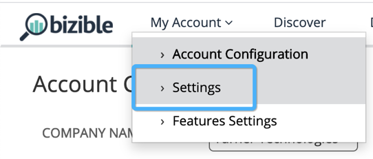

# [!DNL Marketo Engage] 프로그램 통합 {#marketo-engage-programs-integration}

[!DNL Marketo Engage] 프로그램과의 [!DNL Marketo Measure] 통합을 통해 고객은 Marketo 프로그램 멤버십에서 속성 추적을 위한 터치포인트를 만들 수 있습니다. 이 기능을 사용하면 마케터는 [!DNL Marketo Measure] javascript에서 볼 수 없으며 속성 여정 내에서 측정해야 하는 전자 메일 또는 참여 프로그램에서 프로그램 멤버십을 추적할 수 있습니다.

## 가용성 {#availability}

모든 계층.

## 요구 사항 {#requirements}

* 프로덕션 Marketo 인스턴스
* 프로덕션 Salesforce 또는 Microsoft Dynamics 인스턴스
* 모든 유료 [!DNL Marketo Measure] 구독
* Marketo People 동기화가 활성화됨([!DNL Marketo Measure] 설정)
* Marketo 프로그램 사용([!DNL Marketo Measure] 설정)

## 설정 {#setup}

**규칙**

1. Marketo 프로그램에 대한 규칙 설정을 시작하려면 **[!UICONTROL My Account]** > **[!UICONTROL Settings]** > **[!UICONTROL Programs]**(으)로 이동합니다. **+** 아이콘을 클릭하여 첫 번째 규칙 만들기를 시작합니다.

   

   

1. 규칙 추적에 도움이 되는 경우 선택적으로 규칙 이름을 설정할 수 있습니다. 먼저 프로그램 및 프로그램 멤버십 필드 목록에서 규칙을 정의할 필드를 선택합니다. 확인할 연산자 및 예상 값을 선택하여 규칙 작성을 계속합니다.

   

1. 동일한 상자 내에 다른 문을 추가하여 규칙의 &quot;and&quot; 기준을 설정하거나 상자 외부의 + 아이콘을 클릭하여 &quot;or&quot; 문을 설정합니다.

   

1. 터치포인트 날짜에 매핑하는 데 사용할 날짜 또는 날짜/시간 필드를 선택합니다. Marketo에서 사용할 수 있는 값 목록을 보려면 중괄호 `{`을(를) 입력하면 사용 가능한 필드가 표시됩니다.

   

   >[!NOTE]
   >
   >규칙에서 활동 날짜 또는 프로그램 구성원이 특정 상태에 도달한 날짜를 캡처하려는 경우 [!DNL Marketo Engage] 활동 통합을 활용하고 &quot;진행 상태 변경&quot; 활동 유형에 대한 규칙을 설정하려고 합니다.

   

완료된 규칙은 다음과 같아야 합니다.

## 테스트 {#test}

몇 가지 규칙을 만든 후에는 이를 테스트하여 명령문이 프로그램과 일치하는지 확인할 수 있습니다.

1. 테스트를 실행하려면 아래와 같이 **[!UICONTROL TEST]** 단추를 클릭하십시오.

   

1. Marketo에서 프로그램 ID를 입력할 수 있는 모달이 나타납니다.

   

   ID를 입력하고 [!UICONTROL Test] 단추를 클릭하면 규칙 엔진에서 각 규칙을 살펴보고 프로그램이 규칙에 맞는지 여부를 결정합니다. 아래 예제에서 [!DNL Marketo Measure] Ebook이라고 하는 프로그램 1002에 5명의 프로그램 구성원이 있으며 표시된 규칙으로 인해 자격이 있음을 알 수 있습니다.

   규칙은 5000명의 멤버 샘플 크기로 실행됩니다. 프로그램에 5000명 이상의 멤버가 포함되어 있는 경우 모든 멤버의 호환성을 확인하지 않을 수 있습니다. 이 도구는 규칙이 올바르게 구성되었는지 확인하는 데 사용됩니다.

   

   멤버 수를 클릭하여 프로그램 내에서 적격한 Marketo 사용자 ID 목록을 볼 수 있습니다.

   

## 채널 매핑 {#channel-mapping}

Marketo 프로그램 채널 목록에서 설정 내에서 만든 [!DNL Marketo Measure] 사용자 지정 마케팅 채널에 값을 매핑할 수 있습니다. 이 프로그램에서 생성한 모든 터치포인트는 여기에서 선택하는 채널 및 하위 채널 이름을 상속합니다.

1. **[!UICONTROL My Account]** > **[!UICONTROL Settings]** > **[!UICONTROL Offline Channels]**(으)로 이동하여 시작합니다.

1. 맨 위에는 CRM 캠페인 유형에 매핑하는 옵션이 있고, 그 아래로 Marketo 프로그램 채널에 대한 옵션이 표시됩니다.

1. 먼저 값에 매핑할 채널을 선택한 다음 선택적으로 하위 채널을 선택합니다. 완료되면 하단의 **[!UICONTROL Save]**&#x200B;을(를) 클릭합니다.

   

## 프로그램 비용 {#program-costs}

Marketo 프로그램의 데이터 가져오기를 통해 비용은 기간 원가에서 자동으로 다운로드되고 Marketo의 보고된 비용은 할당된 달 내내 배포됩니다. 예를 들어 $1000가 2021년 1월에 보고되면 $1000는 31일에 걸쳐 분할됩니다. 비용은 [!DNL Marketo Measure Discover]에서 찾을 수 있습니다.

>[!NOTE]
>
>Marketo Measure은 한 달에 하나의 기간 원가 입력만 지원합니다. 모든 비용을 가져오려면 월별 총 비용을 단일 항목으로 합산합니다. 동일한 월에 대한 여러 기간 비용 입력은 지원되지 않습니다.

## 작동 방법 {#how-it-works}

**필드 매핑**

<table><thead>
  <tr> 
   <th>biz_ad_campaigns</th> 
   <th>Marketo</th> 
  </tr></thead>
<tbody>
  <tr> 
   <td>ID</td> 
   <td>ID</td> 
  </tr> 
  <tr> 
   <td>IS_DELETED</td> 
   <td>(API를 통해 프로그램이 여전히 존재하는지 확인)</td> 
  </tr> 
  <tr> 
   <td>이름</td> 
   <td>이름</td> 
  </tr> 
 </tbody> 
</table>

<table><thead>
  <tr>
    <th>biz_campaign_members</th>
    <th>Marketo</th>
  </tr></thead>
<tbody>
  <tr>
    <td>ID</td>
    <td>"MarketoProgramMembership"_ProgramId_Lead Id</td>
  </tr>
  <tr>
    <td>MODIFIED_DATE</td>
    <td>updatedAt</td>
  </tr>
  <tr>
    <td>CREATED_DATE</td>
    <td>membershipDate</td>
  </tr>
  <tr>
    <td>리드 ID</td>
    <td>Id(목록 멤버십)</td>
  </tr>
  <tr>
    <td>LEAD_EMAIL</td>
    <td>이메일(목록 멤버십)</td>
  </tr>
  <tr>
    <td>상태</td>
    <td>progressionStatus</td>
  </tr>
  <tr>
    <td>HAS_RESPONDED</td>
    <td>도달 상태</td>
  </tr>
  <tr>
    <td>캠페인 이름</td>
    <td>programName</td>
  </tr>
  <tr>
    <td>캠페인 ID</td>
    <td>programId</td>
  </tr>
  <tr>
    <td>CAMPAIGN_TYPE</td>
    <td>channel</td>
  </tr>
</tbody>
</table>

## 쿠키 매핑 {#cookie-mapping}

[!DNL Marketo Measure]이(가) Marketo과 통합됨에 따라 이제 [!DNL Marketo Measure] 쿠키 ID도 [!DNL Marketo Munchkin Id]과(와) 매핑되고 동기화됩니다. 이렇게 하면 FT 및 LC 터치를 모두 Marketo 활동에 귀속시키지 않고 간격을 닫아 익명의 첫 번째 터치를 웹 세션에 귀속시킵니다. 이 시나리오를 상상해 보십시오.

마크는 [!DNL Facebook] 광고를 클릭하고 wayneenterprises.com에 도달하여 [!DNL Marketo Measure] ID 123 및 [!DNL Marketo Munchkin Id] 456으로 쿠키를 가져옵니다. 양식 채우기가 수행되지 않습니다.

Wayne Enterprises 마케팅 팀이 특정 타겟팅된 잠재 고객에게 이메일 전송량을 전송하며, 해당 잠재 고객 중 하나는 `mark@email.com`개입니다.

`mark@email.com`이(가) 이메일을 받고 클릭하여 wayneenterprises.com에 도달합니다. 쿠키 ID가 동일한 `wayneenterprise.com`에 대한 `mark@email.com's`초 방문이 되지만 양식 채우기가 없으므로 [!DNL Marketo Measure]에게는 여전히 익명 방문자입니다.

Wayne Enterprises 마케팅 팀은 &quot;이메일 클릭&quot; 활동 유형에 대한 터치포인트를 생성하는 Marketo 활동 규칙을 만듭니다.

오늘의 구현에서는 &quot;이메일 클릭&quot; 활동 유형의 Marketo 활동에서 `mark@email.com`에 대한 단일 FT 및 LC 터치포인트를 만듭니다.

이 쿠키 매핑 기능이 향상되면 FT는 돌아가서 [!DNL Facebook] 광고에 크레딧을 받고 LC는 이메일에 크레딧을 받습니다.

>[!NOTE]
>
>쿠키 매핑 비헤이비어를 사용하면 웹 방문에서 발생하는 일부 LC 터치포인트를 찾을 수 있습니다. 리드를 만든 양식 활동이 없어도 연결된 활동 없이 Marketo에 리드가 나타난 다음 [!DNL Marketo Measure]에서 해당 리드를 다운로드하고 연결된 쿠키와 일치시킨 다음 가장 최근 웹 세션으로 추적했을 수 있습니다.

## FAQ {#faq}

**터치포인트 날짜를 진행일 또는 내 프로그램 구성원의 상태 변경 날짜가 되도록 설정하려면 어떻게 해야 합니까?**

규칙에서 활동 날짜 또는 프로그램 구성원이 특정 상태에 도달한 날짜를 캡처하려는 경우 [!DNL Marketo Engage] 활동 통합을 활용하고 &quot;진행 상태 변경&quot; 활동 유형에 대한 규칙을 설정하려고 합니다. 그렇지 않은 경우 [!DNL Marketo Engage] 프로그램 통합에서는 여러 상태가 있는 경우에도 Marketo 사용자를 프로그램으로 가져온 첫 번째 날짜인 멤버십 날짜만 사용할 수 있습니다.

**터치포인트 날짜에 대한 날짜 옵션 선택 목록을 받을 수 있습니까?**

자동 완성을 트리거하려면 먼저 텍스트 필드에 중괄호 `{`을(를) 입력하면 사용 가능한 필드가 표시됩니다.

**Marketo 프로그램 규칙을 만들고 CRM Campaign 규칙도 있으면 두 번 계산됩니까?**

규칙 정의에 따라 다르지만, 가능합니다. 유사한 멤버십에 대해 중복 제거를 수행하거나 검색하지 않으므로 프로그램 및 캠페인에 적용되는 규칙이 없도록 규칙 세트를 평가할 수 있습니다. Marketo을 신뢰할 수 있는 단일 소스로 사용하려면 Campaign 규칙을 프로그램에 복사한 다음 Campaign 규칙을 제거하는 것이 한 가지 가능한 솔루션입니다. 또 다른 옵션은 규칙에 &quot;CreatedOn&quot; 또는 &quot;CreatedDate&quot; 기준을 추가하여 특정 날짜 이전의 규칙은 Campaign 규칙을 사용하고 특정 날짜 이후의 규칙은 프로그램 규칙을 사용하도록 하는 것입니다. 거기에는 많은 해결책들이 있지만, 그것은 약간의 계획과 조정이 필요할 것입니다.

**Marketo의 프로그램 멤버십 사용자 지정 필드를 정의할 수 있습니까?**

기술적 제한으로 인해 지금은 프로그램 멤버십 사용자 정의 필드를 지원할 수 없습니다. 추가 Marketo API를 통해 이러한 필드를 사용할 수 있게 되면, 해당 필드가 당사에 노출되고 사용자가 사용할 수 있게 됩니다.

**프로그램 또는 활동 사용 여부를 어떻게 알 수 있습니까?**

[!DNL Marketo Engage] 프로그램 통합은 개인이 프로그램의 프로그램 구성원인지 여부에 따라 터치포인트를 생성하는 간단한 방법입니다. 개인이 특정 프로그램 상태로 변경되는 시간을 기준으로 규칙을 정의하는 데 관심이 있는 경우 [!DNL Marketo Engage] 활동 통합은 사용자가 원하는 설정, 특히 &quot;진행 상태 변경&quot; 활동 유형이 됩니다.
