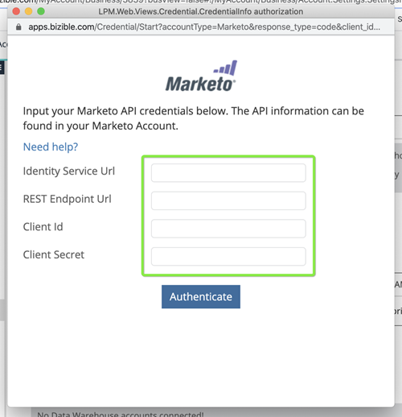

# Marketo 연결 설정 {#set-up-marketo-connection}

Marketo에 대한 연결을 설정하는 방법은 다음과 같습니다.

>[!PREREQUISITES]
>
>[!DNL Marketo Measure]/Marketo Engage 연결에 대해 [API 전용 사용자 역할을 만듭니다](https://experienceleague.adobe.com/docs/marketo/using/product-docs/administration/users-and-roles/create-an-api-only-user.html?lang=ko){target="_blank"}.

1. [!DNL Marketo Measure]에서 **[!UICONTROL My Account]** 드롭다운을 클릭하고 **[!UICONTROL Settings]**&#x200B;을(를) 선택합니다.

   

1. [!UICONTROL Integrations]에서 **[!UICONTROL Connections]**&#x200B;을(를) 클릭합니다.

   

1. **[!UICONTROL Set Up New CRM Connection]**&#x200B;을(를) 클릭합니다.

   

1. Marketo 옆에 있는 **[!UICONTROL Connect]** 단추를 클릭합니다.

   

1. 새 탭에서 Marketo Engage 계정에 로그인합니다. **관리자** > **웹 서비스**(으)로 이동합니다. REST API로 스크롤합니다. 끝점 및 ID 서비스 URL을 강조 표시하고 저장합니다. 다음 단계에서 필요합니다.

   

1. 계속 Marketo Engage 중이면 왼쪽의 트리에서 **LaunchPoint**&#x200B;을(를) 선택하십시오. Marketo Measure에 연결할 사용자 지정 서비스를 찾은 다음 **세부 정보 보기**&#x200B;를 클릭합니다.

   

1. 클라이언트 ID 및 클라이언트 암호를 강조 표시하고 저장합니다. Click **Close**.

   

1. [!DNL Marketo Measure] (으)로 돌아가서 수집한 데이터로 필드를 채웁니다.

   

1. 값을 입력한 후 **[!UICONTROL Authenticate]**&#x200B;을(를) 클릭합니다. Marketo Engage 계정이 [!DNL Marketo Measure]에 연결되어 있습니다.

   

   >[!NOTE]
   >
   >[!DNL Marketo Measure]은(는) Marketo API 제한을 사용하지 않고 대신 Marketo API를 호출하므로 다른 통합으로 최대 한도와 크레딧 할당에 대해 걱정할 필요가 없습니다.
