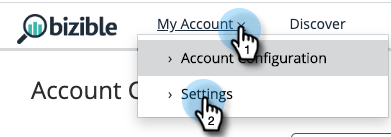

# Marketo 연결 설정 {#set-up-marketo-connection}

Marketo에 대한 연결을 설정하는 방법은 다음과 같습니다.

>[!PREREQUISITES]
>
>[API 전용 사용자 역할 만들기](https://experienceleague.adobe.com/docs/marketo/using/product-docs/administration/users-and-roles/create-an-api-only-user.html) 대상: [!DNL Marketo Measure]/Marketo Engage 연결.

1. 위치 [!DNL Marketo Measure]를 클릭하고 **[!UICONTROL My Account]** 드롭다운 및 선택 **[!UICONTROL Settings]**.

   

1. 아래 [!UICONTROL Integrations], 클릭 **[!UICONTROL Connections]**.

   

1. 클릭 **[!UICONTROL Set Up New CRM Connection]**.

   

1. 다음을 클릭합니다. **[!UICONTROL Connect]** Marketo 옆에 있는 단추입니다.

   

1. 새 탭에서 Marketo Engage 계정에 로그인합니다. 다음으로 이동 **관리자** > **웹 서비스**. REST API로 스크롤합니다. 끝점 및 ID 서비스 URL을 강조 표시하고 저장합니다. 조금 있으면 필요할 거예요.

   

1. 아직 Marketo Engage 상태입니다. **시작 지점** 왼쪽에 있는 나무에 있습니다. Marketo Measure에 연결할 사용자 지정 서비스를 찾은 다음 **세부 사항 보기**.

   

1. 클라이언트 ID 및 클라이언트 암호를 강조 표시하고 저장합니다. Click **Close**.

   

1. 다시 시작 [!DNL Marketo Measure]를 클릭하고 방금 수집한 데이터로 필드를 채웁니다.

   

1. 값을 입력한 후 **[!UICONTROL Authenticate]**. 그러면 Marketo Engage 계정이 [!DNL Marketo Measure].

   

   >[!NOTE]
   >
   >[!DNL Marketo Measure] 는 Marketo API 제한을 사용하지 않고 사용자를 대신하여 Marketo API를 호출하므로 다른 통합과의 최대 가용량 및 크레딧 할당에 대해 걱정할 필요가 없습니다.
