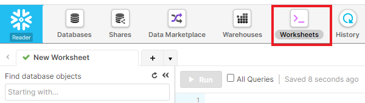
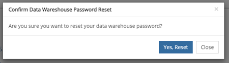

# Data Warehouse 액세스 - Reader 계정 {#data-warehouse-access-reader-account}

## Snowflake 액세스 링크 {#snowflake-access-link}

Snowflake 데이터 웨어하우스에 액세스하려면 Snowflake 계정의 특정 URL로 이동해야 합니다. 로그인하면 이 액세스 링크를 찾을 수 있습니다 [!DNL Marketo Measure] 및 아래 단계에 따라 Data Warehouse 정보 페이지로 이동합니다.

1. in [!DNL Marketo Measure]를 클릭한 다음 **[!UICONTROL My Account]** > **[!UICONTROL Settings]**.

   

1. 왼쪽 메뉴의 보안 아래에서 **[!UICONTROL Data Warehouse]**.

   

1. 이 페이지에서 Snowflake 데이터 웨어하우스 및 사용자 이름에 대한 링크를 찾을 수 있습니다.

   

   >[!NOTE]
   >
   >개별 사용자뿐만 아니라 조직에서 사용할 수 있는 읽기 전용 계정입니다. 조직 내에서 액세스 권한이 있는 모든 사용자 [!DNL Marketo Measure] 이 계정을 사용하여 Snowflake Data Warehouse 리더 계정에 로그인할 수 있습니다.

1. Snowflake URL에 제공된 링크를 클릭합니다. 그러면 사용자 이름과 암호를 입력할 Snowflake 로그인 페이지가 표시됩니다. _암호가 없는 경우 아래 단계를 참조하여 암호를 재설정하십시오_.

   

1. 로그인하고 나면 **[!UICONTROL Worksheets]** 를 클릭합니다.

   

1. BIZIBLE_ROI_V3 데이터베이스 개체는 화면 왼쪽에 있습니다. 쿼리 창 위쪽에 있는 드롭다운 옵션에서 웨어하우스, 데이터베이스 및 스키마를 입력합니다. 각 옵션에는 하나만 있어야 합니다. 이제 Snowflake 쿼리 편집기 내에서 쿼리를 실행할 준비가 되었습니다.

   

## 암호 재설정 {#reset-your-password}

[!DNL Marketo Measure] Snowflake 로그인 암호에 액세스할 수 없습니다. 암호를 재설정해야 하는 경우 [!UICONTROL Reset Password] Data Warehouse 정보 페이지에서 버튼을 클릭하고 지침을 따릅니다. 임시 암호가 UI에 즉시 표시됩니다. 다음 Data Warehouse 로그인 시 고유한 암호를 만들라는 메시지가 표시됩니다.

>[!NOTE]
>
>* 암호를 재설정하면 모든 항목에 대해 재설정됩니다. [!DNL Marketo Measure] 현재 로그인한 사용자뿐만 아니라 조직의 사용자도 있습니다.
>* 임시 비밀번호는 UI에만 표시됩니다. 이메일이 전송되지 않습니다.

## 타사 도구를 통해 Snowflake에 연결 {#connecting-to-snowflake-via-third-party-tools}

Snowflake 데이터 웨어하우스를 타사 도구에 연결하려면 몇 가지 정보를 입력해야 합니다.

>[!NOTE]
>
>각 도구에는 서로 다른 연결 요구 사항이 있습니다. 연결하려는 특정 도구에 대한 설명서를 참조하는 것이 좋습니다.

* **URI** (항상 필수)
   * Snowflake 계정의 도메인 이름입니다.  이 정보는 Snowflake 로그인 링크의 일부 내에 포함되어 있습니다.
* **사용자 이름** (항상 필수)
   * 사용자 이름은 의 Data Warehouse 정보 페이지에 나열됩니다. [!DNL Marketo Measure].
* **암호** (항상 필수)
   * Snowflake 계정에 처음 로그인할 때 설정한 암호입니다.  암호를 재설정하려면 위에 설명된 단계를 참조하십시오.
* **데이터베이스 이름** (항상 필요한 것은 아님)
   * 데이터베이스는 데이터를 Snowflake에 저장하는 것입니다. 스토리지 리소스입니다. 데이터베이스 이름은 의 Data Warehouse 정보 페이지에 나열됩니다. [!DNL Marketo Measure].
* **웨어하우스 이름** (항상 필요한 것은 아님)
   * 웨어하우스는 Snowflake에서 쿼리를 실행하는 항목입니다. 계산 리소스입니다.  웨어하우스 이름은 다음 Data Warehouse 정보 페이지에 나열됩니다 [!DNL Marketo Measure].
   
