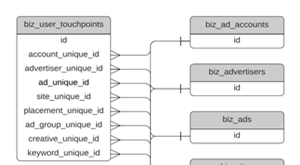

# Data Warehouse 스키마 {#data-warehouse-schema}

Data Warehouse을 사용하면 원하는 만큼 추적하고 원하는 곳에 있는 속성 데이터에 대해 보고하고 다른 데이터 세트에 연결할 수 있습니다.

>[!IMPORTANT]
>
>_DELETED_DATE 값이 있는 행은 15일 동안 유지된 후 Snowflake에서 제거됩니다. Snowflake 시간대는 UTC입니다.

>[!NOTE]
>
>[여기를 클릭하십시오.](#sample-queries) 이 문서의 하단에서 샘플 쿼리를 보려면

## 엔티티 관계 다이어그램 {#entity-relationship-diagrams}

다음 _Data Warehouse 데이터 모델_ ERD는 Data Warehouse의 데이터가 어떻게 흐름과 함께 연결되는지를 보여줍니다. 이 다이어그램은 매핑 테이블, 이미 있는 다른 테이블의 보기 또는 더 이상 사용하지 않는 사용 중단된 테이블을 나타내므로 데이터 웨어하우스에서 사용할 수 있는 모든 테이블을 포함하지 않습니다. 아래의 데이터 웨어하우스에 있는 테이블 및 열에 대한 자세한 설명을 참조하십시오. 이러한 테이블 중 다수는 비정규화된 필드를 포함하지만 이 다이어그램은 차원 테이블의 데이터를 대신 활용하여 권장되는 데이터 모델입니다.

추가 _광고 차원 데이터 모델_ ERD는 기본 데이터 모델의 테이블에 특정 차원의 표를 가장 잘 연결할 수 있는 방법에 대한 보기를 제공합니다. 광고 차원은 다른 테이블에서도 일반화되지만 이 차원은 이러한 차원을 결합하는 데 권장되는 모델을 나타냅니다.

_전체 크기 버전의 이미지를 클릭합니다_

<table style="table-layout:auto"> 
 <colgroup> 
  <col> 
  <col> 
 </colgroup> 
 <tbody> 
  <tr> 
   <td><strong>Data Warehouse 데이터 모델</strong></td> 
   <td><strong>광고 차원 데이터 모델</strong></td> 
  </tr> 
  <tr> 
   <td> 
    <div> 
     <p><a href="assets/data-warehouse-data-model.pdf"></a></p> 
    </div></td>
   <td> 
    <div> 
     <p><a href="assets/ads-dimensional-data-model.pdf"></a></p>
    </div></td> 
  </tr> 
 </tbody> 
</table>

## 보기 횟수 {#views}

### BIZ_ACCOUNTS {#biz-accounts}

소스 시스템에서 가져온 계정

<table>
  <tbody>
    <tr>
      <th><strong>열</strong></th>
      <th><strong>데이터 유형</strong></th>
      <th><strong>설명</strong></th>
      <th><strong>샘플 데이터</strong></th>
    </tr>
    <tr>
      <td>ID</td>
      <td>varchar</td>
      <td>소스 시스템의 계정 ID입니다.</td>
      <td>0013100001kpAZxAAM</td>
    </tr>
    <tr>
      <td>CREATED_DATE</td>
      <td>timestamp_ntz</td>
      <td>소스 시스템에서 계정의 생성 날짜입니다.</td>
      <td>2016-08-28 00:32:55.000</td>
    </tr>
    <tr>
      <td>MODIFIED_DATE</td>
      <td>timestamp_ntz</td>
      <td>소스 시스템에서 계정의 마지막 수정 날짜입니다.</td>
      <td>2018-08-01 17:38:30.000</td>
    </tr>
    <tr>
      <td>이름</td>
      <td>varchar</td>
      <td>소스 시스템의 계정 이름입니다.</td>
      <td>[!DNL Marketo Measure]</td>
    </tr>
    <tr>
      <td>WEB_SITE</td>
      <td>varchar</td>
      <td>Lead to Account 매핑에 사용되는 소스 시스템에 기록된 계정의 웹 사이트입니다.</td>
      <td>www.adobe.com</td>
    </tr>
    <tr>
      <td>ENGAGEMENT_RATING</td>
      <td>varchar</td>
      <td>A, B, C, D, N/A에서 생성된 문자 등급 [!DNL Marketo Measure] 기계 학습 모델. ABM이 비활성화되어 있으면 null입니다.</td>
      <td>B</td>
    </tr>
    <tr>
      <td>ENGAGEMENT_SCORE</td>
      <td>number(38,19)</td>
      <td>에 의해 계산된 숫자 점수 [!DNL Marketo Measure] 예측 참여 점수(Engagement_Rating)를 생성하기 위한 기계 학습. ABM이 비활성화되어 있으면 null입니다.</td>
      <td>0.1417350147058800000</td>
    </tr>
    <tr>
      <td>도메인</td>
      <td>varchar</td>
      <td>웹 사이트의 구문 분석된 다운 버전으로서 도메인만 저장합니다.</td>
      <td>adobe</td>
    </tr>
    <tr>
      <td>IS_DELETED</td>
      <td>부울</td>
      <td>레코드가 소스 시스템에서 삭제되었는지 여부</td>
      <td>false</td>
    </tr>
    <tr>
      <td>CUSTOM_PROPERTIES</td>
      <td>varchar</td>
      <td>다음과 같은 사용자 지정 속성 [!DNL Marketo Measure] 는 소스 시스템에서 JSON 형식으로 가져옵니다.</td>
      <td>{"Account_Type__c": "Security", "Foo":"Bar"}</td>
    </tr>
    <tr>
      <td>_CREATED_DATE</td>
      <td>timestamp_ntz</td>
      <td>Snowflake에서 레코드가 생성된 날짜입니다.</td>
      <td>2020-01-01 01:01:00.000</td>
    </tr>
    <tr>
      <td>_MODIFIED_DATE</td>
      <td>timestamp_ntz</td>
      <td>Snowflake에서 레코드가 마지막으로 수정된 날짜입니다.</td>
      <td>2020-01-01 01:01:00.000</td>
    </tr>
    <tr>
      <td>_DELETED_DATE</td>
      <td>timestamp_ntz</td>
      <td>레코드가 Snowflake에서 삭제된 것으로 표시된 날짜입니다.</td>
      <td>2020-01-01 01:01:00.000</td>
    </tr>
  </tbody>
</table>

### BIZ_ACCOUNT_TO_EMAILS {#biz-account-to-emails}

알려진 리드/연락처 이메일 주소와 계정 간의 매핑 테이블. ABM이 비활성화되어 있으면 이 테이블이 비어 있습니다.

<table>
  <tbody>
    <tr>
    <th><strong>열</strong></th>
      <th><strong>데이터 유형</strong></th>
      <th><strong>설명</strong></th>
      <th><strong>샘플 데이터</strong></th>
    </tr>
    <tr>
      <td>ID</td>
      <td>varchar</td>
      <td>레코드에 대한 고유 ID입니다.</td>
      <td>0013800001MMPPiAAP_person@adobe.com|2022-01-05 17:22:13.000</td>
    </tr>
    <tr>
      <td>
        <p>ACCOUNT_ID</p>
      </td>
      <td>
        <p>varchar</p>
      </td>
      <td>
        <p>소스 시스템 계정 ID입니다.</p>
      </td>
      <td>
        <p>0013100001phrBAAAY</p>
      </td>
    </tr>
    <tr>
      <td>
        <p>이메일</p>
      </td>
      <td>
        <p>varchar</p>
      </td>
      <td>
        <p>연락처 관계 또는 계정 간 매핑을 통해 계정에 매핑된 이메일 주소입니다.</p>
      </td>
      <td>
        <p>person@adobe.com</p>
      </td>
    </tr>
    <tr>
      <td>
        <p>MODIFIED_DATE</p>
      </td>
      <td>
        <p>timestamp_ntz</p>
      </td>
      <td>
        <p>소스 시스템에서 계정의 마지막 수정 날짜입니다.</p>
      </td>
      <td>
        <p>2018-08-31 23:53:39.000</p>
      </td>
    </tr>
    <tr>
      <td>
        <p>CREATED_DATE</p>
      </td>
      <td>
        <p>timestamp_ntz</p>
      </td>
      <td>
        <p>소스 시스템에서 계정의 생성 날짜입니다.</p>
      </td>
      <td>
        <p>2018-08-18 22:01:32.000</p>
      </td>
    </tr>
    <tr>
      <td>
        <p>IS_DELETED</p>
      </td>
      <td>
        <p>부울</p>
      </td>
      <td>
        <p>레코드가 삭제되었는지 여부.</p>
      </td>
      <td>
        <p>false</p>
      </td>
    </tr>
    <tr>
      <td>_CREATED_DATE</td>
      <td>timestamp_ntz</td>
      <td>Snowflake에서 레코드가 생성된 날짜입니다.</td>
      <td>2020-01-01 01:01:00.000</td>
    </tr>
    <tr>
      <td>_MODIFIED_DATE</td>
      <td>timestamp_ntz</td>
      <td>Snowflake에서 레코드가 마지막으로 수정된 날짜입니다.</td>
      <td>2020-01-01 01:01:00.000</td>
    </tr>
    <tr>
      <td>_DELETED_DATE</td>
      <td>timestamp_ntz</td>
      <td>레코드가 Snowflake에서 삭제된 것으로 표시된 날짜입니다.</td>
      <td>2020-01-01 01:01:00.000</td>
    </tr>
  </tbody>
</table>

### BIZ_ACTIVITIES {#biz-activities}

소스 시스템 또는 연결된 광고 계정에서 가져온 활동.

<table>
  <tbody>
  <tr>
    <th><strong>열</strong></th>
    <th><strong>데이터 유형</strong></th>
    <th><strong>설명</strong></th>
    <th><strong>샘플 데이터</strong></th>
    </tr>
    <tr>
      <td>
        <p>ID</p>
      </td>
      <td>
        <p>varchar</p>
      </td>
      <td>
        <p>소스 시스템의 활동 ID입니다.</p>
      </td>
      <td>
        <p>1678625515</p>
      </td>
    </tr>
    <tr>
      <td>
        <p>LEAD_ID</p>
      </td>
      <td>
        <p>varchar</p>
      </td>
      <td>활동과 연관된 리드의 ID입니다.</td>
      <td>
        <p>15530482</p>
      </td>
    </tr>
    <tr>
      <td>
        <p>CONTACT_ID</p>
      </td>
      <td>
        <p>varchar</p>
      </td>
      <td>
        <p>활동과 연관된 연락처의 ID입니다.</p>
      </td>
      <td>
        <p>13792552</p>
      </td>
    </tr>
    <tr>
      <td>
        <p>ACTIVITY_TYPE_ID</p>
      </td>
      <td>
        <p>varchar</p>
      </td>
      <td>
        <p>소스 시스템의 활동 유형에 대한 ID입니다.</p>
      </td>
      <td>
        <p>104</p>
      </td>
    </tr>
    <tr>
      <td>ACTIVITY_TYPE_NAME</td>
      <td>varchar</td>
      <td>소스 시스템의 활동 이름입니다.</td>
      <td>
        <p>진행 중인 상태 변경</p>
      </td>
    </tr>
    <tr>
      <td>START_DATE</td>
      <td>timestamp_ntz</td>
      <td>소스 시스템에서 활동의 시작 날짜입니다.</td>
      <td>2020-01-01 01:01:00.000</td>
    </tr>
    <tr>
      <td>END_DATE</td>
      <td>timestamp_ntz</td>
      <td>소스 시스템에서 활동의 종료 날짜입니다.</td>
      <td>2020-01-01 01:01:00.000</td>
    </tr>
    <tr>
      <td>CAMPAIGN_ID</td>
      <td>varchar</td>
      <td>활동이 소스 시스템의 일부인 캠페인의 ID입니다.</td>
      <td>
        <p>li.508038570.147643566</p>
      </td>
    </tr>
    <tr>
      <td>SOURCE_SYSTEM</td>
      <td>varchar</td>
      <td>소스 시스템 유형을 식별합니다.</td>
      <td>Marketo</td>
    </tr>
    <tr>
      <td>CREATED_DATE</td>
      <td>timestamp_ntz</td>
      <td>소스 시스템에서 행이 생성된 날짜입니다.</td>
      <td>2020-01-01 01:01:00.000</td>
    </tr>
    <tr>
      <td>MODIFIED_DATE</td>
      <td>timestamp_ntz</td>
      <td>소스 시스템에서 행이 마지막으로 수정된 날짜입니다.</td>
      <td>2020-01-01 01:01:00.000</td>
    </tr>
    <tr>
      <td>IS_DELETED</td>
      <td>부울</td>
      <td>레코드가 소스 시스템에서 삭제되었는지 여부</td>
      <td>false</td>
    </tr>
    <tr>
      <td>AD_FORM_ID</td>
      <td>varchar</td>
      <td>활동 이 소스 시스템의 일부인 광고 양식에 대한 ID입니다.</td>
      <td>li.507063119.3757704</td>
    </tr>
    <tr>
      <td>_CREATED_DATE</td>
      <td>timestamp_ntz</td>
      <td>Snowflake에서 레코드가 생성된 날짜입니다.</td>
      <td>2020-01-01 01:01:00.000</td>
    </tr>
    <tr>
      <td>_MODIFIED_DATE</td>
      <td>timestamp_ntz</td>
      <td>Snowflake에서 레코드가 마지막으로 수정된 날짜입니다.</td>
      <td>2020-01-01 01:01:00.000</td>
    </tr>
    <tr>
      <td>_DELETED_DATE</td>
      <td>timestamp_ntz</td>
      <td>레코드가 Snowflake에서 삭제된 것으로 표시된 날짜입니다.</td>
      <td>2020-01-01 01:01:00.000</td>
    </tr>
  </tbody>
</table>

### BIZ_ADS {#biz-ads}

연결된 광고 계정에서 가져온 광고입니다.

<table>
  <tbody>
    <tr>
      <th>
        <p><strong>열</strong></p>
      </th>
      <th>
        <p><strong>데이터 유형</strong></p>
      </th>
      <th>
        <p><strong>설명</strong></p>
      </th>
      <th>
        <p><strong>샘플 데이터</strong></p>
      </th>
    </tr>
    <tr>
      <td>
        <p>ID</p>
      </td>
      <td>
        <p>varchar</p>
      </td>
      <td>
        <p>광고에 대한 고유 ID입니다.</p>
      </td>
      <td>
        <p>fb.106851586409075.6052044288804.6052044290004.6053457066804</p>
      </td>
    </tr>
    <tr>
      <td>
        <p>DISPLAY_ID</p>
      </td>
      <td>
        <p>varchar</p>
      </td>
      <td>
        <p>소스 시스템의 광고 ID입니다.</p>
      </td>
      <td>
        <p>6053457066804</p>
      </td>
    </tr>
    <tr>
      <td>
        <p>AD_ACCOUNT_UNIQUE_ID</p>
      </td>
      <td>
        <p>varchar</p>
      </td>
      <td>
        <p>광고를 가져온 광고 계정의 ID입니다.</p>
      </td>
      <td>
        <p>fb.106851586409075</p>
      </td>
    </tr>
    <tr>
      <td>
        <p>AD_ACCOUNT_NAME</p>
      </td>
      <td>
        <p>varchar</p>
      </td>
      <td>
        <p>광고를 가져온 광고 계정의 이름입니다.</p>
      </td>
      <td>
        <p>[!DNL Marketo Measure] 계정</p>
      </td>
    </tr>
    <tr>
      <td>
        <p>ADVERTISER_UNIQUE_ID</p>
      </td>
      <td>
        <p>varchar</p>
      </td>
      <td>
        <p>특히 Doubleclick용 광고에 대한 광고주의 ID입니다.</p>
      </td>
      <td>
        <p>300181641</p>
      </td>
    </tr>
    <tr>
      <td>
        <p>ADVERTISER_NAME</p>
      </td>
      <td>
        <p>varchar</p>
      </td>
      <td>
        <p>특히 Doubleclick용 광고에 대한 광고주의 이름입니다.</p>
      </td>
      <td>
        <p>Marketing Analytics</p>
      </td>
    </tr>
    <tr>
      <td>
        <p>AD_GROUP_UNIQUE_ID</p>
      </td>
      <td>
        <p>varchar</p>
      </td>
      <td>
        <p>광고에 대한 광고 그룹의 ID입니다.</p>
      </td>
      <td>
        <p>fb.106851586409075.6052044288804.6052044290004</p>
      </td>
    </tr>
    <tr>
      <td>
        <p>AD_GROUP_NAME</p>
      </td>
      <td>
        <p>varchar</p>
      </td>
      <td>
        <p>광고에 대한 광고 그룹의 이름입니다.</p>
      </td>
      <td>
        <p>광고 B에 대한 광고 세트</p>
      </td>
    </tr>
    <tr>
      <td>
        <p>AD_CAMPAIGN_UNIQUE_ID</p>
      </td>
      <td>
        <p>varchar</p>
      </td>
      <td>
        <p>광고에 대한 캠페인 ID입니다.</p>
      </td>
      <td>
        <p>fb.106851586409075.6052044288804</p>
      </td>
    </tr>
    <tr>
      <td>
        <p>AD_CAMPAIGN_NAME</p>
      </td>
      <td>
        <p>varchar</p>
      </td>
      <td>
        <p>광고에 대한 캠페인의 이름입니다.</p>
      </td>
      <td>
        <p>리드 생성 캠페인</p>
      </td>
    </tr>
    <tr>
      <td>
        <p>IS_ACTIVE</p>
      </td>
      <td>
        <p>부울</p>
      </td>
      <td>
        <p>소스 시스템에서 광고가 여전히 활성 상태인지 여부.</p>
      </td>
      <td>
        <p>false</p>
      </td>
    </tr>
    <tr>
      <td>
        <p>IS_DELETED</p>
      </td>
      <td>
        <p>부울</p>
      </td>
      <td>
        <p>소스 시스템에서 광고가 삭제되었는지 여부.</p>
      </td>
      <td>
        <p>false</p>
      </td>
    </tr>
    <tr>
      <td>
        <p>MODIFIED_DATE</p>
      </td>
      <td>
        <p>timestamp_ntz</p>
      </td>
      <td>
        <p>레코드가 마지막으로 수정된 날짜입니다.</p>
      </td>
      <td>
        <p>2018-08-02 06:35:59.000</p>
      </td>
    </tr>
    <tr>
      <td>
        <p>FIRST_IMPORTED</p>
      </td>
      <td>
        <p>timestamp_ntz</p>
      </td>
      <td>
        <p>소스 시스템에서 레코드를 처음 가져온 날짜</p>
      </td>
      <td>
        <p>2018-08-02 06:35:59.000</p>
      </td>
    </tr>
    <tr>
      <td>
        <p>이름</p>
      </td>
      <td>
        <p>varchar</p>
      </td>
      <td>
        <p>소스 시스템의 광고 이름입니다.</p>
      </td>
      <td>
        <p>광고 2</p>
      </td>
    </tr>
    <tr>
      <td>
        <p>NEEDS_UPDATE</p>
      </td>
      <td>
        <p>부울</p>
      </td>
      <td>
        <p>광고를 업데이트해야 하는지 여부 [!DNL Marketo Measure] 태깅합니다.</p>
        <p>(진단 필드, 내부 처리에 사용됨)</p>
      </td>
      <td>
        <p>false</p>
      </td>
    </tr>
    <tr>
      <td>
        <p>GROUPING_KEY</p>
      </td>
      <td>
        <p>varchar</p>
      </td>
      <td>내부 처리에 사용되는 진단 필드입니다.</td>
      <td>
        <p>fb.106851586409075.6052044288804.6052044290004</p>
      </td>
    </tr>
    <tr>
      <td>
        <p>ENTITY_TYPE</p>
      </td>
      <td>
        <p>varchar</p>
      </td>
      <td>
        <p>이 테이블의 기본 개체 또는 엔터티입니다. 이 경우, "광고".</p>
      </td>
      <td>
        <p>광고</p>
      </td>
    </tr>
    <tr>
      <td>
        <p>PROVIDER_TYPE</p>
      </td>
      <td>
        <p>varchar</p>
      </td>
      <td>
        <p>광고에 대한 광고 공급자의 이름입니다.</p>
      </td>
      <td>
        <p>Facebook</p>
      </td>
    </tr>
    <tr>
      <td>
        <p>URL_CURRENT</p>
      </td>
      <td>
        <p>varchar</p>
      </td>
      <td>
        <p>랜딩 페이지의 URL입니다.</p>
        <p>(내부 처리를 위한 진단 필드)</p>
      </td>
      <td></td>
    </tr>
    <tr>
      <td>
        <p>URL_OLD</p>
      </td>
      <td>
        <p>varchar</p>
      </td>
      <td>
        <p>URL_CURRENT에 대한 이전 값입니다.</p>
        <p>(내부 처리를 위한 진단 필드)</p>
      </td>
      <td></td>
    </tr>
    <tr>
      <td>
        <p>URL_REQUESTED</p>
      </td>
      <td>
        <p>varchar</p>
      </td>
      <td>
        <p>URL은 무엇으로 장식됩니까 [!DNL Marketo Measure] 매개 변수.</p>
        <p>(내부 처리를 위한 진단 필드)</p>
      </td>
      <td></td>
    </tr>
    <tr>
      <td>
        <p>URL_ALTENTIES</p>
      </td>
      <td>
        <p>varchar</p>
      </td>
      <td>
        <p>소스 시스템에서 가져옵니다.</p>
        <p>(내부 처리를 위한 진단 필드)</p>
      </td>
      <td></td>
    </tr>
    <tr>
      <td>
        <p>ROW_KEY</p>
      </td>
      <td>
        <p>number(38,0)</p>
      </td>
      <td>
        <p>Biz_Facts 보기에 대한 외래 키입니다.</p>
      </td>
      <td>
        <p>6008900572523230000</p>
      </td>
    </tr>
    <tr>
      <td>_CREATED_DATE</td>
      <td>timestamp_ntz</td>
      <td>Snowflake에서 레코드가 생성된 날짜입니다.</td>
      <td>2020-01-01 01:01:00.000</td>
    </tr>
    <tr>
      <td>_MODIFIED_DATE</td>
      <td>timestamp_ntz</td>
      <td>Snowflake에서 레코드가 마지막으로 수정된 날짜입니다.</td>
      <td>2020-01-01 01:01:00.000</td>
    </tr>
    <tr>
      <td>_DELETED_DATE</td>
      <td>timestamp_ntz</td>
      <td>레코드가 Snowflake에서 삭제된 것으로 표시된 날짜입니다.</td>
      <td>2020-01-01 01:01:00.000</td>
    </tr>
  </tbody>
</table>

### BIZ_ADVERTISERS {#biz-advertisers}

연결된 광고 계정에서 가져온 광고주입니다.

<table>
  <tbody>
    <tr>
      <th>
        <p>열</p>
      </th>
      <th>
        <p>데이터 유형</p>
      </th>
      <th>
        <p>설명</p>
      </th>
      <th>
        <p>샘플 데이터</p>
      </th>
    </tr>
    <tr>
      <td>
        <p>ID</p>
      </td>
      <td>
        <p>varchar</p>
      </td>
      <td>
        <p>광고주의 고유 ID입니다.</p>
      </td>
      <td>
        <p>dc.6114.9143143</p>
      </td>
    </tr>
    <tr>
      <td>
        <p>DISPLAY_ID</p>
      </td>
      <td>
        <p>varchar</p>
      </td>
      <td>소스 시스템의 광고주 ID입니다.</td>
      <td>9143143</td>
    </tr>
    <tr>
      <td>
        <p>AD_ACCOUNT_UNIQUE_ID</p>
      </td>
      <td>
        <p>varchar</p>
      </td>
      <td>
        <p>광고를 가져온 광고 계정의 ID입니다.</p>
      </td>
      <td>
        <p>fb.106851586409075</p>
      </td>
    </tr>
    <tr>
      <td>
        <p>AD_ACCOUNT_NAME</p>
      </td>
      <td>
        <p>varchar</p>
      </td>
      <td>
        <p>광고를 가져온 광고 계정의 이름입니다.</p>
      </td>
      <td>
        <p>[!DNL Marketo Measure] 계정</p>
      </td>
    </tr>
    <tr>
      <td>
        <p>ADVERTISER_UNIQUE_ID</p>
      </td>
      <td>
        <p>varchar</p>
      </td>
      <td>
        <p>Doubleclick용 광고주의 ID입니다.</p>
      </td>
      <td>
        <p>300181641</p>
      </td>
    </tr>
    <tr>
      <td>
        <p>ADVERTISER_NAME</p>
      </td>
      <td>
        <p>varchar</p>
      </td>
      <td>
        <p>Doubleclick용 광고주의 이름입니다.</p>
      </td>
      <td>
        <p>[!DNL Marketo Measure] Marketing Analytics</p>
      </td>
    </tr>
    <tr>
      <td>
        <p>AD_GROUP_UNIQUE_ID</p>
      </td>
      <td>
        <p>varchar</p>
      </td>
      <td>
        <p>광고 계층 구조에서 광고주 위에 광고 그룹이 없으므로 null이어야 합니다.</p>
      </td>
      <td>
        <p>null</p>
      </td>
    </tr>
    <tr>
      <td>
        <p>AD_GROUP_NAME</p>
      </td>
      <td>
        <p>varchar</p>
      </td>
      <td>
        <p>광고 계층 구조에서 광고주 위에 광고 그룹이 없으므로 null이어야 합니다.</p>
      </td>
      <td>
        <p>null</p>
      </td>
    </tr>
    <tr>
      <td>
        <p>AD_CAMPAIGN_UNIQUE_ID</p>
      </td>
      <td>
        <p>varchar</p>
      </td>
      <td>
        <p>광고 계층 구조에서 광고주 위에 광고 캠페인이 없으므로 null이어야 합니다.</p>
      </td>
      <td>
        <p>null</p>
      </td>
    </tr>
    <tr>
      <td>
        <p>AD_CAMPAIGN_NAME</p>
      </td>
      <td>
        <p>varchar</p>
      </td>
      <td>
        <p>광고 계층 구조에서 광고 광고주 위에 캠페인이 없으므로 null이어야 합니다.</p>
      </td>
      <td>
        <p>null</p>
      </td>
    </tr>
    <tr>
      <td>
        <p>IS_ACTIVE</p>
      </td>
      <td>
        <p>부울</p>
      </td>
      <td>
        <p>광고주가 소스 시스템에서 여전히 활성 상태인지 여부.</p>
      </td>
      <td>
        <p>true</p>
      </td>
    </tr>
    <tr>
      <td>
        <p>IS_DELETED</p>
      </td>
      <td>
        <p>부울</p>
      </td>
      <td>
        <p>광고주가 소스 시스템에서 삭제되었는지 여부.</p>
      </td>
      <td>
        <p>false</p>
      </td>
    </tr>
    <tr>
      <td>
        <p>MODIFIED_DATE</p>
      </td>
      <td>
        <p>timestamp_ntz</p>
      </td>
      <td>
        <p>레코드가 마지막으로 수정된 날짜입니다.</p>
      </td>
      <td>
        <p>2018-08-02 06:35:59.000</p>
      </td>
    </tr>
    <tr>
      <td>
        <p>FIRST_IMPORTED</p>
      </td>
      <td>
        <p>timestamp_ntz</p>
      </td>
      <td>
        <p>소스 시스템에서 레코드를 처음 가져온 날짜</p>
      </td>
      <td>
        <p>2018-08-02 06:35:59.000</p>
      </td>
    </tr>
    <tr>
      <td>
        <p>이름</p>
      </td>
      <td>
        <p>varchar</p>
      </td>
      <td>
        <p>소스 시스템의 광고주 이름입니다.</p>
      </td>
      <td>
        <p>[!DNL Marketo Measure] Marketing Analytics</p>
      </td>
    </tr>
    <tr>
      <td>
        <p>NEEDS_UPDATE</p>
      </td>
      <td>
        <p>부울</p>
      </td>
      <td>
        <p>광고주를 업데이트해야 하는지 여부 [!DNL Marketo Measure] 태깅합니다.</p>
        <p>(진단 필드, 내부 처리에 사용됨)</p>
      </td>
      <td>
        <p>false</p>
      </td>
    </tr>
    <tr>
      <td>
        <p>GROUPING_KEY</p>
      </td>
      <td>
        <p>varchar</p>
      </td>
      <td>내부 처리에 사용되는 진단 필드입니다.</td>
      <td></td>
    </tr>
    <tr>
      <td>
        <p>ENTITY_TYPE</p>
      </td>
      <td>
        <p>varchar</p>
      </td>
      <td>
        <p>이 테이블의 기본 개체 또는 엔터티입니다. 이 경우 "광고주"입니다.</p>
      </td>
      <td>
        <p>광고주</p>
      </td>
    </tr>
    <tr>
      <td>
        <p>PROVIDER_TYPE</p>
      </td>
      <td>
        <p>varchar</p>
      </td>
      <td>
        <p>광고주의 광고 공급자입니다.</p>
      </td>
      <td>
        <p>Doubleclick</p>
      </td>
    </tr>
    <tr>
      <td>
        <p>ROW_KEY</p>
      </td>
      <td>
        <p>number(38,0)</p>
      </td>
      <td>
        <p>Biz_Facts 보기에 대한 외래 키입니다.</p>
      </td>
      <td>
        <p>6008900572523230000</p>
      </td>
    </tr>
    <tr>
      <td>_CREATED_DATE</td>
      <td>timestamp_ntz</td>
      <td>Snowflake에서 레코드가 생성된 날짜입니다.</td>
      <td>2020-01-01 01:01:00.000</td>
    </tr>
    <tr>
      <td>_MODIFIED_DATE</td>
      <td>timestamp_ntz</td>
      <td>Snowflake에서 레코드가 마지막으로 수정된 날짜입니다.</td>
      <td>2020-01-01 01:01:00.000</td>
    </tr>
    <tr>
      <td>_DELETED_DATE</td>
      <td>timestamp_ntz</td>
      <td>레코드가 Snowflake에서 삭제된 것으로 표시된 날짜입니다.</td>
      <td>2020-01-01 01:01:00.000</td>
    </tr>
  </tbody>
</table>

### BIZ_AD_ACCOUNTS {#biz-ad-accounts}

연결된 광고 계정에서 가져온 광고 계정.

<table>
  <tbody>
    <tr>
      <th>
        <p>열</p>
      </th>
      <th>
        <p>데이터 유형</p>
      </th>
      <th>
        <p>설명</p>
      </th>
      <th>
        <p>샘플 데이터</p>
      </th>
    </tr>
    <tr>
      <td>
        <p>ID</p>
      </td>
      <td>
        <p>varchar</p>
      </td>
      <td>
        <p>광고 계정에 대한 고유 식별자입니다.</p>
      </td>
      <td>
        <p>aw.6601259029</p>
      </td>
    </tr>
    <tr>
      <td>
        <p>DISPLAY_ID</p>
      </td>
      <td>
        <p>varchar</p>
      </td>
      <td>소스 시스템의 광고 계정 ID입니다.</td>
      <td>
        <p>6601259029</p>
      </td>
    </tr>
    <tr>
      <td>
        <p>AD_ACCOUNT_UNIQUE_ID</p>
      </td>
      <td>
        <p>varchar</p>
      </td>
      <td>광고 계층 구조의 광고 계정에 대한 레코드이므로 이것은 null이어야 합니다.</td>
      <td>null</td>
    </tr>
    <tr>
      <td>
        <p>AD_ACCOUNT_NAME</p>
      </td>
      <td>
        <p>varchar</p>
      </td>
      <td>광고 계층 구조의 광고 계정에 대한 레코드이므로 이것은 null이어야 합니다.</td>
      <td>null</td>
    </tr>
    <tr>
      <td>
        <p>ADVERTISER_UNIQUE_ID</p>
      </td>
      <td>
        <p>varchar</p>
      </td>
      <td>
        <p>광고 계층 구조에서 광고 계정 위에 광고주가 없으므로 null이어야 합니다.</p>
      </td>
      <td>null</td>
    </tr>
    <tr>
      <td>
        <p>ADVERTISER_NAME</p>
      </td>
      <td>
        <p>varchar</p>
      </td>
      <td>
        <p>광고 계층 구조에서 광고 계정 위에 광고주가 없으므로 null이어야 합니다.</p>
      </td>
      <td>null</td>
    </tr>
    <tr>
      <td>
        <p>AD_GROUP_UNIQUE_ID</p>
      </td>
      <td>
        <p>varchar</p>
      </td>
      <td>
        <p>광고 계층 구조의 광고 계정 위에 광고 그룹이 없으므로 null이어야 합니다.</p>
      </td>
      <td>null</td>
    </tr>
    <tr>
      <td>
        <p>AD_GROUP_NAME</p>
      </td>
      <td>
        <p>varchar</p>
      </td>
      <td>
        <p>광고 계층 구조의 광고 계정 위에 광고 그룹이 없으므로 null이어야 합니다.</p>
      </td>
      <td>null</td>
    </tr>
    <tr>
      <td>
        <p>AD_CAMPAIGN_UNIQUE_ID</p>
      </td>
      <td>
        <p>varchar</p>
      </td>
      <td>
        <p>광고 계층 구조의 광고 계정 위에 광고 캠페인이 없으므로 null이어야 합니다.</p>
      </td>
      <td>null</td>
    </tr>
    <tr>
      <td>
        <p>AD_CAMPAIGN_NAME</p>
      </td>
      <td>
        <p>varchar</p>
      </td>
      <td>
        <p>광고 계층 구조의 광고 계정 위에 광고 캠페인이 없으므로 null이어야 합니다.</p>
      </td>
      <td>null</td>
    </tr>
    <tr>
      <td>
        <p>IS_ACTIVE</p>
      </td>
      <td>
        <p>부울</p>
      </td>
      <td>
        <p>소스 시스템에서 광고 계정이 아직 활성 상태인지 여부.</p>
      </td>
      <td>
        <p>true</p>
      </td>
    </tr>
    <tr>
      <td>
        <p>IS_DELETED</p>
      </td>
      <td>
        <p>부울</p>
      </td>
      <td>
        <p>소스 시스템에서 광고 계정이 삭제되었는지 여부.</p>
      </td>
      <td>
        <p>false</p>
      </td>
    </tr>
    <tr>
      <td>
        <p>MODIFIED_DATE</p>
      </td>
      <td>
        <p>timestamp_ntz</p>
      </td>
      <td>
        <p>레코드가 마지막으로 수정된 날짜입니다.</p>
      </td>
      <td>
        <p>2018-09-06 12:54:37.000</p>
      </td>
    </tr>
    <tr>
      <td>
        <p>FIRST_IMPORTED</p>
      </td>
      <td>
        <p>timestamp_ntz</p>
      </td>
      <td>
        <p>소스 시스템에서 레코드를 처음 가져온 날짜</p>
      </td>
      <td>
        <p>2018-08-02 06:35:58.000</p>
      </td>
    </tr>
    <tr>
      <td>
        <p>이름</p>
      </td>
      <td>
        <p>varchar</p>
      </td>
      <td>소스 시스템의 광고 계정 이름입니다.</td>
      <td>
        <p>[!DNL Marketo Measure] 광고 계정</p>
      </td>
    </tr>
    <tr>
      <td>
        <p>NEEDS_UPDATE</p>
      </td>
      <td>
        <p>부울</p>
      </td>
      <td>
        <p>광고주를 업데이트해야 하는지 여부 [!DNL Marketo Measure] 태깅합니다.</p>
        <p>(진단 필드, 내부 처리에 사용됨)</p>
      </td>
      <td>
        <p>false</p>
      </td>
    </tr>
    <tr>
      <td>
        <p>GROUPING_KEY</p>
      </td>
      <td>
        <p>varchar</p>
      </td>
      <td>내부 처리에 사용되는 진단 필드입니다.</td>
      <td></td>
    </tr>
    <tr>
      <td>
        <p>ENTITY_TYPE</p>
      </td>
      <td>
        <p>varchar</p>
      </td>
      <td>
        <p>이 테이블의 기본 개체 또는 엔터티입니다. 이 경우 "Account"</p>
      </td>
      <td>
        <p>계정</p>
      </td>
    </tr>
    <tr>
      <td>
        <p>PROVIDER_TYPE</p>
      </td>
      <td>
        <p>varchar</p>
      </td>
      <td>
        <p>광고 계정에 대한 광고 공급자의 이름입니다.</p>
      </td>
      <td>
        <p>AdWords</p>
      </td>
    </tr>
    <tr>
      <td>
        <p>ACCOUNT_CURRENCY_UNIT</p>
      </td>
      <td>
        <p>varchar</p>
      </td>
      <td>
        <p>소스 시스템에서 광고 계정에 사용되는 통화 코드입니다.</p>
      </td>
      <td>
        <p>USD</p>
      </td>
    </tr>
    <tr>
      <td>
        <p>COMPANY_ID</p>
      </td>
      <td>
        <p>varchar</p>
      </td>
      <td>내부 처리에 사용됩니다.</td>
      <td>1933789</td>
    </tr>
    <tr>
      <td>
        <p>소스</p>
      </td>
      <td>
        <p>varchar</p>
      </td>
      <td>utm_source의 URL에서 구문 분석됩니다.</td>
      <td>
        <p>소셜</p>
      </td>
    </tr>
    <tr>
      <td>
        <p>중간</p>
      </td>
      <td>
        <p>varchar</p>
      </td>
      <td>utm_medium의 URL에서 구문 분석됩니다.</td>
      <td>
        <p>lisu07261601</p>
      </td>
    </tr>
    <tr>
      <td>
        <p>LAST_30_DAYS_COST</p>
      </td>
      <td>
        <p>number(38,19)</p>
      </td>
      <td>
        <p>AdWords에만 적용되는 최근 30일 동안 가져온 비용 금액입니다.</p>
      </td>
      <td>
        <p>17260.000000000000000000</p>
      </td>
    </tr>
    <tr>
      <td>
        <p>LAST_30_DAYS_IMPRESSIONS</p>
      </td>
      <td>
        <p>number(38,0)</p>
      </td>
      <td>
        <p>지난 30일 동안의 노출 횟수. AdWords에만 적용됩니다.</p>
      </td>
      <td>
        <p>730060</p>
      </td>
    </tr>
    <tr>
      <td>
        <p>LAST_30_DAYS_CLICKS</p>
      </td>
      <td>
        <p>number(38,0)</p>
      </td>
      <td>
        <p>AdWords에만 적용할 수 있는 최근 30일 동안의 클릭 수입니다.</p>
      </td>
      <td>
        <p>3400</p>
      </td>
    </tr>
    <tr>
      <td>
        <p>LAST_30_DAYS_CONVERSION</p>
      </td>
      <td>
        <p>number(38,0)</p>
      </td>
      <td>
        <p>지난 30일 동안 보고된 전환 횟수이며 AdWords에만 적용됩니다.</p>
      </td>
      <td>
        <p>180</p>
      </td>
    </tr>
    <tr>
      <td>
        <p>TRACKING_URL_TEMPLATE</p>
      </td>
      <td>
        <p>varchar</p>
      </td>
      <td>내부 진단에 사용됩니다.</td>
      <td>
        <p>http://cdn.adobe.com/redir?lp={lpurl}&amp;_bt={creative}&amp;_bk={keyword}&amp;_bm={matchType}</p>
      </td>
    </tr>
    <tr>
      <td>
        <p>TRACKING_URL_TEMPLATE_OLD</p>
      </td>
      <td>
        <p>varchar</p>
      </td>
      <td>내부 진단에 사용됩니다.</td>
      <td></td>
    </tr>
    <tr>
      <td>
        <p>TRACKING_URL_TEMPLATE_REQUESTED</p>
      </td>
      <td>
        <p>varchar</p>
      </td>
      <td>내부 진단에 사용됩니다.</td>
      <td></td>
    </tr>
    <tr>
      <td>
        <p>TRACKING_URL_TEMPLATE_APPLIED</p>
      </td>
      <td>
        <p>varchar</p>
      </td>
      <td>
        <p>랜딩 페이지 태깅을 위해 AdWords 또는 Bing에 대한 광고 계정 수준에 추가된 추적 템플릿입니다.</p>
      </td>
      <td>
        <p>http://cdn.adobe.com/redir?lp={lpurl}&amp;_bt={creative}&amp;_bk={keyword}&amp;_bm={matchType}</p>
      </td>
    </tr>
    <tr>
      <td>
        <p>ROW_KEY</p>
      </td>
      <td>
        <p>number(38,0)</p>
      </td>
      <td>
        <p>Biz_Facts 보기에 대한 외래 키입니다.</p>
      </td>
      <td>
        <p>-4609512587744160000</p>
      </td>
    </tr>
    <tr>
      <td>_CREATED_DATE</td>
      <td>timestamp_ntz</td>
      <td>Snowflake에서 레코드가 생성된 날짜입니다.</td>
      <td>2020-01-01 01:01:00.000</td>
    </tr>
    <tr>
      <td>_MODIFIED_DATE</td>
      <td>timestamp_ntz</td>
      <td>Snowflake에서 레코드가 마지막으로 수정된 날짜입니다.</td>
      <td>2020-01-01 01:01:00.000</td>
    </tr>
    <tr>
      <td>_DELETED_DATE</td>
      <td>timestamp_ntz</td>
      <td>레코드가 Snowflake에서 삭제된 것으로 표시된 날짜입니다.</td>
      <td>2020-01-01 01:01:00.000</td>
    </tr>
  </tbody>
</table>

### BIZ_AD_CAMPAIGNS {#biz-ad-campaigns}

연결된 광고 계정, 소스 시스템, utm 및 자체 보고서에서 가져온 캠페인.

<table>
  <tbody>
    <tr>
      <th>
        <p>열</p>
      </th>
      <th>
        <p>데이터 유형</p>
      </th>
      <th>
        <p>설명</p>
      </th>
      <th>
        <p>샘플 데이터</p>
      </th>
    </tr>
    <tr>
      <td>
        <p>ID</p>
      </td>
      <td>
        <p>varchar</p>
      </td>
      <td>
        <p>캠페인에 대한 고유 ID입니다.</p>
      </td>
      <td>
        <p>aw.6601259029.285114995</p>
      </td>
    </tr>
    <tr>
      <td>
        <p>DISPLAY_ID</p>
      </td>
      <td>
        <p>varchar</p>
      </td>
      <td>소스 시스템의 캠페인 ID입니다.</td>
      <td>
        <p>285114995</p>
      </td>
    </tr>
    <tr>
      <td>
        <p>AD_ACCOUNT_UNIQUE_ID</p>
      </td>
      <td>
        <p>varchar</p>
      </td>
      <td>
        <p>캠페인을 가져온 광고 계정의 ID입니다.</p>
      </td>
      <td>
        <p>aw.6601259029</p>
      </td>
    </tr>
    <tr>
      <td>
        <p>AD_ACCOUNT_NAME</p>
      </td>
      <td>
        <p>varchar</p>
      </td>
      <td>
        <p>캠페인을 가져온 광고 계정의 이름입니다.</p>
      </td>
      <td>
        <p>[!DNL Marketo Measure]</p>
      </td>
    </tr>
    <tr>
      <td>
        <p>ADVERTISER_UNIQUE_ID</p>
      </td>
      <td>
        <p>varchar</p>
      </td>
      <td>
        <p>Campaign용 광고주, 특히 Doubleclick용 ID입니다.</p>
      </td>
      <td>
        <p>300181641</p>
      </td>
    </tr>
    <tr>
      <td>
        <p>ADVERTISER_NAME</p>
      </td>
      <td>
        <p>varchar</p>
      </td>
      <td>
        <p>Campaign용 Advertiser, 특히 Doubleclick의 이름입니다.</p>
      </td>
      <td>
        <p>Marketing Analytics</p>
      </td>
    </tr>
    <tr>
      <td>
        <p>AD_GROUP_UNIQUE_ID</p>
      </td>
      <td>
        <p>varchar</p>
      </td>
      <td>
        <p>모든 광고 계층 구조에서 Campaign 위에 광고 그룹이 없으므로 null이어야 합니다.</p>
      </td>
      <td>
        <p>null</p>
      </td>
    </tr>
    <tr>
      <td>
        <p>AD_GROUP_NAME</p>
      </td>
      <td>
        <p>varchar</p>
      </td>
      <td>
        <p>모든 광고 계층 구조에서 Campaign 위에 광고 그룹이 없으므로 null이어야 합니다.</p>
      </td>
      <td>null</td>
    </tr>
    <tr>
      <td>
        <p>AD_CAMPAIGN_UNIQUE_ID</p>
      </td>
      <td>
        <p>varchar</p>
      </td>
      <td>
        <p>Campaign의 고유 ID이므로 대신 ID 필드를 사용하십시오.</p>
      </td>
      <td></td>
    </tr>
    <tr>
      <td>
        <p>AD_CAMPAIGN_NAME</p>
      </td>
      <td>
        <p>varchar</p>
      </td>
      <td>
        <p>캠페인 이름을 사용하려면 이름 필드를 대신 사용하십시오.</p>
      </td>
      <td></td>
    </tr>
    <tr>
      <td>
        <p>IS_ACTIVE</p>
      </td>
      <td>
        <p>부울</p>
      </td>
      <td>
        <p>Campaign이 소스 시스템에서 계속 활성 상태인지 여부를 확인합니다.</p>
      </td>
      <td>
        <p>true</p>
      </td>
    </tr>
    <tr>
      <td>
        <p>IS_DELETED</p>
      </td>
      <td>
        <p>부울</p>
      </td>
      <td>
        <p>캠페인이 소스 시스템에서 삭제되었는지 여부.</p>
      </td>
      <td>
        <p>false</p>
      </td>
    </tr>
    <tr>
      <td>
        <p>MODIFIED_DATE</p>
      </td>
      <td>
        <p>timestamp_ntz</p>
      </td>
      <td>
        <p>레코드가 마지막으로 수정된 날짜입니다.</p>
      </td>
      <td>
        <p>2018-08-02 06:35:58.000</p>
      </td>
    </tr>
    <tr>
      <td>
        <p>FIRST_IMPORTED</p>
      </td>
      <td>
        <p>timestamp_ntz</p>
      </td>
      <td>
        <p>소스 시스템에서 레코드를 처음 가져온 날짜</p>
      </td>
      <td>
        <p>2018-08-02 06:35:58.000</p>
      </td>
    </tr>
    <tr>
      <td>
        <p>이름</p>
      </td>
      <td>
        <p>varchar</p>
      </td>
      <td>
        <p>캠페인의 이름입니다.</p>
      </td>
      <td>
        <p>파트너 재타겟팅</p>
      </td>
    </tr>
    <tr>
      <td>
        <p>NEEDS_UPDATE</p>
      </td>
      <td>
        <p>부울</p>
      </td>
      <td>
        <p>Campaign을 업데이트해야 하는지 여부 [!DNL Marketo Measure] 태깅합니다.</p>
        <p>(진단 필드, 내부 처리에 사용됨)</p>
      </td>
      <td>
        <p>false</p>
      </td>
    </tr>
    <tr>
      <td>
        <p>GROUPING_KEY</p>
      </td>
      <td>
        <p>varchar</p>
      </td>
      <td>내부 처리에 사용되는 진단 필드입니다.</td>
      <td></td>
    </tr>
    <tr>
      <td>
        <p>ENTITY_TYPE</p>
      </td>
      <td>
        <p>varchar</p>
      </td>
      <td>
        <p>이 테이블의 기본 개체 또는 엔터티입니다. 이 경우 "캠페인"입니다.</p>
      </td>
      <td>
        <p>캠페인</p>
      </td>
    </tr>
    <tr>
      <td>
        <p>PROVIDER_TYPE</p>
      </td>
      <td>
        <p>varchar</p>
      </td>
      <td>
        <p>캠페인에 대한 광고 공급자의 이름입니다.</p>
      </td>
      <td>
        <p>AdWords</p>
      </td>
    </tr>
    <tr>
      <td>
        <p>DAILY_BUDGET</p>
      </td>
      <td>
        <p>number(38,19)</p>
      </td>
      <td>
        <p>캠페인에 대한 광고 플랫폼에서 설정된 일별 예산입니다.</p>
      </td>
      <td>
        <p>0.0000000000000000000</p>
      </td>
    </tr>
    <tr>
      <td>
        <p>TRACKING_URL_TEMPLATE</p>
      </td>
      <td>
        <p>varchar</p>
      </td>
      <td>내부 진단에 사용됩니다.</td>
      <td></td>
    </tr>
    <tr>
      <td>
        <p>TRACKING_URL_TEMPLATE_OLD</p>
      </td>
      <td>
        <p>varchar</p>
      </td>
      <td>내부 진단에 사용됩니다.</td>
      <td></td>
    </tr>
    <tr>
      <td>
        <p>TRACKING_URL_TEMPLATE_REQUESTED</p>
      </td>
      <td>
        <p>varchar</p>
      </td>
      <td>내부 진단에 사용됩니다.</td>
      <td></td>
    </tr>
    <tr>
      <td>
        <p>TRACKING_URL_TEMPLATE_APPLIED</p>
      </td>
      <td>
        <p>varchar</p>
      </td>
      <td>
        <p>랜딩 페이지 태깅을 위한 AdWords 또는 Bing의 캠페인 수준에 추가된 추적 템플릿입니다.</p>
      </td>
      <td>
        <p>http://cdn.adobe.com/redir?lp={lpurl}&amp;_bt={creative}&amp;_bk={keyword}&amp;_bm={matchType}</p>
      </td>
    </tr>
    <tr>
      <td>
        <p>ROW_KEY</p>
      </td>
      <td>
        <p>number(38,0)</p>
      </td>
      <td>
        <p>Biz_Facts 보기에 대한 외래 키입니다.</p>
      </td>
      <td>
        <p>-6008900572523230000</p>
      </td>
    </tr>
    <tr>
      <td>_CREATED_DATE</td>
      <td>timestamp_ntz</td>
      <td>Snowflake에서 레코드가 생성된 날짜입니다.</td>
      <td>2020-01-01 01:01:00.000</td>
    </tr>
    <tr>
      <td>_MODIFIED_DATE</td>
      <td>timestamp_ntz</td>
      <td>Snowflake에서 레코드가 마지막으로 수정된 날짜입니다.</td>
      <td>2020-01-01 01:01:00.000</td>
    </tr>
    <tr>
      <td>_DELETED_DATE</td>
      <td>timestamp_ntz</td>
      <td>레코드가 Snowflake에서 삭제된 것으로 표시된 날짜입니다.</td>
      <td>2020-01-01 01:01:00.000</td>
    </tr>
  </tbody>
</table>

### BIZ_AD_FORMS. {#biz-ad-forms}

연결된 광고 계정에서 가져온 광고 Forms.

<table>
  <tr>
    <th>
      <p>열</p>
    </th>
    <th>
      <p>데이터 유형</p>
    </th>
    <th>
      <p>설명</p>
    </th>
    <th>
      <p>샘플 데이터</p>
    </th>
  </tr>
  <tbody>
    <tr>
      <td>
        <p>ID</p>
      </td>
      <td>
        <p>varchar</p>
      </td>
      <td>
        <p>광고 양식에 대한 고유 ID입니다.</p>
      </td>
      <td>
        <p>li.507063119.3757704</p>
      </td>
    </tr>
    <tr>
      <td>
        <p>AD_ACCOUNT_UNIQUE_ID</p>
      </td>
      <td>
        <p>varchar</p>
      </td>
      <td>
        <p>광고 양식을 가져온 광고 계정의 ID입니다.</p>
      </td>
      <td>
        <p>li.507063119</p>
      </td>
    </tr>
    <tr>
      <td>
        <p>AD_ACCOUNT_NAME</p>
      </td>
      <td>
        <p>varchar</p>
      </td>
      <td>
        <p>광고 양식을 가져온 광고 계정의 이름입니다.</p>
      </td>
      <td>
        <p>[!DNL Marketo Measure]</p>
      </td>
    </tr>
    <tr>
      <td>
        <p>IS_DELETED</p>
      </td>
      <td>
        <p>부울</p>
      </td>
      <td>
        <p>소스 시스템에서 상태가 삭제되었습니다. 상태가 초안, 보관 또는 취소인 경우 삭제로 설정합니다.</p>
      </td>
      <td>
        <p>false</p>
      </td>
    </tr>
    <tr>
      <td>
        <p>MODIFIED_DATE</p>
      </td>
      <td>
        <p>timestamp_ntz</p>
      </td>
      <td>
        <p>레코드가 마지막으로 수정된 날짜입니다.</p>
      </td>
      <td>
        <p>2018-08-02 06:35:58.000</p>
      </td>
    </tr>
    <tr>
      <td>
        <p>FIRST_IMPORTED</p>
      </td>
      <td>
        <p>timestamp_ntz</p>
      </td>
      <td>
        <p>소스 시스템에서 레코드를 처음 가져온 날짜</p>
      </td>
      <td>
        <p>2018-08-02 06:35:58.000</p>
      </td>
    </tr>
    <tr>
      <td>
        <p>이름</p>
      </td>
      <td>
        <p>varchar</p>
      </td>
      <td>
        <p>광고 양식의 이름입니다.</p>
      </td>
      <td>
        <p>NSPA Ebook LGF(2020년 5월)</p>
      </td>
    </tr>
    <tr>
      <td>
        <p>ENTITY_TYPE</p>
      </td>
      <td>
        <p>varchar</p>
      </td>
      <td>
        <p>이 테이블의 기본 개체 또는 엔터티입니다. 이 경우 "AdForm"입니다.</p>
      </td>
      <td>
        <p>AdForm</p>
      </td>
    </tr>
    <tr>
      <td>
        <p>PROVIDER_TYPE</p>
      </td>
      <td>
        <p>varchar</p>
      </td>
      <td>
        <p>광고 양식에 대한 광고 공급자의 이름입니다.</p>
      </td>
      <td>
        <p>LinkedIn</p>
      </td>
    </tr>
    <tr>
      <td>
        <p>설명</p>
      </td>
      <td>
        <p>varchar</p>
      </td>
      <td>
        <p>광고 양식에 대한 설명입니다.</p>
      </td>
      <td>
        <p>지능형 자동화가 모기지 재금융 대출 애플리케이션의 프로세스 효율성을 높이는 방법을 알아봅니다.</p>
      </td>
    </tr>
    <tr>
      <td>
        <p>헤드라인</p>
      </td>
      <td>
        <p>varchar</p>
      </td>
      <td>광고 양식의 헤드라인.</td>
      <td>
        <p>재금융 애플리케이션 프로세스를 자동화할 때가 되었습니다</p>
      </td>
    </tr>
    <tr>
      <td>
        <p>LANDING_URL</p>
      </td>
      <td>
        <p>varchar</p>
      </td>
      <td>광고 양식의 랜딩 URL입니다.</td>
      <td>
        <p>https://adobe.com/blog/refinancing-application-process/</p>
      </td>
    </tr>
    <tr>
      <td>
        <p>질문</p>
      </td>
      <td>
        <p>varchar</p>
      </td>
      <td>광고 양식에 대한 질문 목록입니다.</td>
      <td>
        <p>이름:성:이메일 주소:국가/지역:작업 제목:회사 이름</p>
      </td>
    </tr>
    <tr>
      <td>
        <p>상태</p>
      </td>
      <td>
        <p>varchar</p>
      </td>
      <td>
        <p>광고 양식의 상태입니다.</p>
      </td>
      <td>
        <p>제출</p>
      </td>
    </tr>
    <tr>
      <td>_CREATED_DATE</td>
      <td>timestamp_ntz</td>
      <td>Snowflake에서 레코드가 생성된 날짜입니다.</td>
      <td>2020-01-01 01:01:00.000</td>
    </tr>
    <tr>
      <td>_MODIFIED_DATE</td>
      <td>timestamp_ntz</td>
      <td>Snowflake에서 레코드가 마지막으로 수정된 날짜입니다.</td>
      <td>2020-01-01 01:01:00.000</td>
    </tr>
    <tr>
      <td>_DELETED_DATE</td>
      <td>timestamp_ntz</td>
      <td>레코드가 Snowflake에서 삭제된 것으로 표시된 날짜입니다.</td>
      <td>2020-01-01 01:01:00.000</td>
    </tr>
    <tr>
      <td>SOURCE_ID</td>
      <td>varchar</td>
      <td>레코드가 시작된 소스의 ID입니다.</td>
      <td>aw.3284209</td>
    </tr>
  </tbody>
</table>

### BIZ_AD_GROUPS {#biz-ad-groups}

연결된 광고 계정에서 가져온 광고 그룹.

<table>
  <tbody>
    <tr>
      <th>
        <p>열</p>
      </th>
      <th>
        <p>데이터 유형</p>
      </th>
      <th>
        <p>설명</p>
      </th>
      <th>
        <p>샘플 데이터</p>
      </th>
    </tr>
    <tr>
      <td>
        <p>ID</p>
      </td>
      <td>
        <p>varchar</p>
      </td>
      <td>
        <p>광고 그룹에 대한 고유 ID입니다.</p>
      </td>
      <td>
        <p>aw.6601259029.317737955.23105326115</p>
      </td>
    </tr>
    <tr>
      <td>
        <p>DISPLAY_ID</p>
      </td>
      <td>
        <p>varchar</p>
      </td>
      <td>소스 시스템의 광고 그룹 ID입니다.</td>
      <td>
        <p>23105326115</p>
      </td>
    </tr>
    <tr>
      <td>
        <p>AD_ACCOUNT_UNIQUE_ID</p>
      </td>
      <td>
        <p>varchar</p>
      </td>
      <td>
        <p>광고 그룹을 가져온 광고 계정의 ID입니다.</p>
      </td>
      <td>
        <p>aw.6601259029</p>
      </td>
    </tr>
    <tr>
      <td>
        <p>AD_ACCOUNT_NAME</p>
      </td>
      <td>
        <p>varchar</p>
      </td>
      <td>
        <p>광고 그룹을 가져온 광고 계정의 이름입니다.</p>
      </td>
      <td>
        <p>[!DNL Marketo Measure]</p>
      </td>
    </tr>
    <tr>
      <td>
        <p>ADVERTISER_UNIQUE_ID</p>
      </td>
      <td>
        <p>varchar</p>
      </td>
      <td>
        <p>Doubleclick 광고 계층 구조에 광고 그룹이 없으므로 null이어야 합니다.</p>
      </td>
      <td>
        <p>null</p>
      </td>
    </tr>
    <tr>
      <td>
        <p>ADVERTISER_NAME</p>
      </td>
      <td>
        <p>varchar</p>
      </td>
      <td>
        <p>Doubleclick 광고 계층 구조에 광고 그룹이 없으므로 null이어야 합니다.</p>
      </td>
      <td>
        <p>null</p>
      </td>
    </tr>
    <tr>
      <td>
        <p>AD_GROUP_UNIQUE_ID</p>
      </td>
      <td>
        <p>varchar</p>
      </td>
      <td>
        <p>계층 구조의 광고 그룹에 대한 레코드이므로 null이어야 합니다.</p>
      </td>
      <td>
        <p>null</p>
      </td>
    </tr>
    <tr>
      <td>
        <p>AD_GROUP_NAME</p>
      </td>
      <td>
        <p>varchar</p>
      </td>
      <td>
        <p>계층 구조의 광고 그룹에 대한 레코드이므로 null이어야 합니다.</p>
      </td>
      <td>
        <p>null</p>
      </td>
    </tr>
    <tr>
      <td>
        <p>AD_CAMPAIGN_UNIQUE_ID</p>
      </td>
      <td>
        <p>varchar</p>
      </td>
      <td>
        <p>광고 그룹에 대한 캠페인 ID입니다.</p>
      </td>
      <td>
        <p>aw.6601259029.317737955</p>
      </td>
    </tr>
    <tr>
      <td>
        <p>AD_CAMPAIGN_NAME</p>
      </td>
      <td>
        <p>varchar</p>
      </td>
      <td>
        <p>광고 그룹에 대한 캠페인의 이름입니다.</p>
      </td>
      <td>
        <p>매출 기여도 분석</p>
      </td>
    </tr>
    <tr>
      <td>
        <p>IS_ACTIVE</p>
      </td>
      <td>
        <p>부울</p>
      </td>
      <td>
        <p>소스 시스템에서 광고 계정이 아직 활성 상태인지 여부.</p>
      </td>
      <td>
        <p>true</p>
      </td>
    </tr>
    <tr>
      <td>
        <p>IS_DELETED</p>
      </td>
      <td>
        <p>부울</p>
      </td>
      <td>
        <p>소스 시스템에서 광고 계정이 삭제되었는지 여부.</p>
      </td>
      <td>
        <p>false</p>
      </td>
    </tr>
    <tr>
      <td>
        <p>MODIFIED_DATE</p>
      </td>
      <td>
        <p>timestamp_ntz</p>
      </td>
      <td>
        <p>레코드가 마지막으로 수정된 날짜입니다.</p>
      </td>
      <td>
        <p>2018-08-02 06:36:14.000</p>
      </td>
    </tr>
    <tr>
      <td>
        <p>FIRST_IMPORTED</p>
      </td>
      <td>
        <p>timestamp_ntz</p>
      </td>
      <td>
        <p>소스 시스템에서 레코드를 처음 가져온 날짜</p>
      </td>
      <td>
        <p>2018-08-02 06:36:14.000</p>
      </td>
    </tr>
    <tr>
      <td>
        <p>이름</p>
      </td>
      <td>
        <p>varchar</p>
      </td>
      <td>
        <p>광고 그룹의 이름입니다.</p>
      </td>
      <td>
        <p>매출 기여도 분석 - 계정 기반</p>
      </td>
    </tr>
    <tr>
      <td>
        <p>NEEDS_UPDATE</p>
      </td>
      <td>
        <p>부울</p>
      </td>
      <td>
        <p>광고주를 업데이트해야 하는지 여부 [!DNL Marketo Measure] 태깅합니다.</p>
        <p>(진단 필드, 내부 처리에 사용됨)</p>
      </td>
      <td>
        <p>false</p>
      </td>
    </tr>
    <tr>
      <td>
        <p>GROUPING_KEY</p>
      </td>
      <td>
        <p>varchar</p>
      </td>
      <td>내부 처리에 사용되는 진단 필드입니다.</td>
      <td></td>
    </tr>
    <tr>
      <td>
        <p>ENTITY_TYPE</p>
      </td>
      <td>
        <p>varchar</p>
      </td>
      <td>
        <p>이 테이블의 기본 개체 또는 엔터티입니다. 이 경우 "AdGroup"입니다.</p>
      </td>
      <td>
        <p>AdGroup</p>
      </td>
    </tr>
    <tr>
      <td>
        <p>PROVIDER_TYPE</p>
      </td>
      <td>
        <p>varchar</p>
      </td>
      <td>
        <p>광고 그룹에 대한 광고 공급자의 이름입니다.</p>
      </td>
      <td>
        <p>AdWords</p>
      </td>
    </tr>
    <tr>
      <td>
        <p>AD_NETWORK_TYPE</p>
      </td>
      <td>
        <p>varchar</p>
      </td>
      <td>
        <p>광고 그룹이 실행 중인 미디어.</p>
      </td>
      <td>
        <p>Search, Display, YouTube_Search, YouTube_Watch</p>
      </td>
    </tr>
    <tr>
      <td>
        <p>TRACKING_URL_TEMPLATE</p>
      </td>
      <td>
        <p>varchar</p>
      </td>
      <td>내부 진단에 사용됩니다.</td>
      <td></td>
    </tr>
    <tr>
      <td>
        <p>TRACKING_URL_TEMPLATE_OLD</p>
      </td>
      <td>
        <p>varchar</p>
      </td>
      <td>내부 진단에 사용됩니다.</td>
      <td></td>
    </tr>
    <tr>
      <td>
        <p>TRACKING_URL_TEMPLATE_REQUESTED</p>
      </td>
      <td>
        <p>varchar</p>
      </td>
      <td>내부 진단에 사용됩니다.</td>
      <td></td>
    </tr>
    <tr>
      <td>
        <p>TRACKING_URL_TEMPLATE_APPLIED</p>
      </td>
      <td>
        <p>varchar</p>
      </td>
      <td>
        <p>랜딩 페이지 태깅을 위해 AdWords 또는 Bing에 대한 광고 계정 수준에 추가된 추적 템플릿입니다.</p>
      </td>
      <td>
        <p>http://cdn.adobe.com/redir?lp={lpurl}&amp;_bt={creative}&amp;_bk={keyword}&amp;_bm={matchType}</p>
      </td>
    </tr>
    <tr>
      <td>
        <p>ROW_KEY</p>
      </td>
      <td>
        <p>number(38,0)</p>
      </td>
      <td>
        <p>Biz_Facts 보기에 대한 외래 키입니다.</p>
      </td>
      <td>
        <p>-5594512713562690000</p>
      </td>
    </tr>
    <tr>
      <td>_CREATED_DATE</td>
      <td>timestamp_ntz</td>
      <td>Snowflake에서 레코드가 생성된 날짜입니다.</td>
      <td>2020-01-01 01:01:00.000</td>
    </tr>
    <tr>
      <td>_MODIFIED_DATE</td>
      <td>timestamp_ntz</td>
      <td>Snowflake에서 레코드가 마지막으로 수정된 날짜입니다.</td>
      <td>2020-01-01 01:01:00.000</td>
    </tr>
    <tr>
      <td>_DELETED_DATE</td>
      <td>timestamp_ntz</td>
      <td>레코드가 Snowflake에서 삭제된 것으로 표시된 날짜입니다.</td>
      <td>2020-01-01 01:01:00.000</td>
    </tr>
  </tbody>
</table>

### BIZ_AD_PROVIDERS

<p>해당되는 경우 자체 보고된 항목을 포함하여 연결된 광고 계정의 광고 공급자.</p>

<table>
  <tbody>
    <tr>
      <th>
        <p>열</p>
      </th>
      <th>
        <p>데이터 유형</p>
      </th>
      <th>
        <p>설명</p>
      </th>
      <th>
        <p>샘플 데이터</p>
      </th>
    </tr>
    <tr>
      <td>
        <p>ID</p>
      </td>
      <td>
        <p>varchar</p>
      </td>
      <td>
        <p>광고 공급자에 대한 고유 ID입니다.</p>
      </td>
      <td>
        <p>Bing</p>
      </td>
    </tr>
    <tr>
      <td>
        <p>이름</p>
      </td>
      <td>
        <p>varchar</p>
      </td>
      <td>
        <p>광고 공급자의 이름입니다.</p>
      </td>
      <td>
        <p>Bing</p>
      </td>
    </tr>
    <tr>
      <td>
        <p>ROW_KEY</p>
      </td>
      <td>
        <p>number(38,0)</p>
      </td>
      <td>
        <p>Biz_Facts 보기에 대한 외래 키입니다.</p>
      </td>
      <td>
        <p>4783788151269206864</p>
      </td>
    </tr>
    <tr>
      <td>_CREATED_DATE</td>
      <td>timestamp_ntz</td>
      <td>Snowflake에서 레코드가 생성된 날짜입니다.</td>
      <td>2020-01-01 01:01:00.000</td>
    </tr>
    <tr>
      <td>_MODIFIED_DATE</td>
      <td>timestamp_ntz</td>
      <td>Snowflake에서 레코드가 마지막으로 수정된 날짜입니다.</td>
      <td>2020-01-01 01:01:00.000</td>
    </tr>
    <tr>
      <td>_DELETED_DATE</td>
      <td>timestamp_ntz</td>
      <td>레코드가 Snowflake에서 삭제된 것으로 표시된 날짜입니다.</td>
      <td>2020-01-01 01:01:00.000</td>
    </tr>
  </tbody>
</table>

### BIZ_ATTRIBUTION_TOUCHPOINT {#biz-attribution-touchpoints}

<p>구매자 속성 터치포인트, Opportunity 와 연관된 모든 터치포인트.</p>
<table>
  <tbody>
    <tr>
      <th>
        <p>열</p>
      </th>
      <th>
        <p>데이터 유형</p>
      </th>
      <th>
        <p>설명</p>
      </th>
      <th>
        <p>샘플 데이터</p>
      </th>
    </tr>
    <tr>
      <td>
        <p>ID</p>
      </td>
      <td>
        <p>varchar</p>
      </td>
      <td>
        <p>구매자 속성 터치포인트(BAT)에 대한 고유 ID입니다.</p>
      </td>
      <td>
        <p>BAT2_0060Z00000lFHtOQAF_</p>
        <p>0030Z00003K5bpKQAR_2017-06-20:01-05-20-6193330.0b5c5678807c</p>
      </td>
    </tr>
    <tr>
      <td>
        <p>MODIFIED_DATE</p>
      </td>
      <td>
        <p>timestamp_ntz</p>
      </td>
      <td>
        <p>레코드가 마지막으로 수정된 날짜입니다.</p>
      </td>
      <td>
        <p>2018-09-01 04:53:53.000</p>
      </td>
    </tr>
    <tr>
      <td>
        <p>OPPORTUNITY_ID</p>
      </td>
      <td>
        <p>varchar</p>
      </td>
      <td>
        <p>BAT가 속하는 Opportunity의 ID입니다.</p>
      </td>
      <td>
        <p>0060Z00000lFHtOQAW</p>
      </td>
    </tr>
    <tr>
      <td>
        <p>CONTACT_ID</p>
      </td>
      <td>
        <p>varchar</p>
      </td>
      <td>
        <p>BAT와 연결된 연락처의 ID입니다.</p>
      </td>
      <td>
        <p>0030Z00003K5bpKQAR</p>
      </td>
    </tr>
    <tr>
      <td>이메일</td>
      <td>varchar</td>
      <td>BAT와 연결된 전자 메일 주소입니다.</td>
      <td>person@adobe.com</td>
    </tr>
    <tr>
      <td>
        <p>ACCOUNT_ID</p>
      </td>
      <td>
        <p>varchar</p>
      </td>
      <td>
        <p>BAT가 속하는 계정의 ID입니다.</p>
      </td>
      <td>
        <p>0013100001otbIAAAY</p>
      </td>
    </tr>
    <tr>
      <td>
        <p>USER_TOUCHPOINT_ID</p>
      </td>
      <td>
        <p>varchar</p>
      </td>
      <td>
        <p>BAT를 생성한 사용자 터치포인트의 ID입니다.</p>
      </td>
      <td>
        <p>person@adobe.com_00v1B00003ZbWzHQAV</p>
      </td>
    </tr>
    <tr>
      <td>
        <p>TOUCHPOINT_DATE</p>
      </td>
      <td>
        <p>timestamp_ntz</p>
      </td>
      <td>
        <p>터치 포인트의 날짜입니다.</p>
      </td>
      <td>
        <p>2017-06-20 01:05:20.000</p>
      </td>
    </tr>
    <tr>
      <td>VISITOR_ID</td>
      <td>varchar</td>
      <td>BAT와 연결된 방문자의 ID입니다.</td>
      <td>v_277d79d01678498fea067c9b631bf6df</td>
    </tr>
    <tr>
      <td>
        <p>MARKETING_TOUCH_TYPE</p>
      </td>
      <td>
        <p>varchar</p>
      </td>
      <td>
        <p>활동 유형, 웹 방문, 웹 양식, 웹 채팅, 전화 통화, [CRM] 캠페인 또는 [CRM] 활동. CRM에서 "터치포인트 유형"이라고 합니다.</p>
      </td>
      <td>
        <p>웹 양식</p>
      </td>
    </tr>
    <tr>
      <td>
        <p>채널</p>
      </td>
      <td>
        <p>varchar</p>
      </td>
      <td>
        <p>터치포인트가 속한 채널은, 채널에서 사용자 지정 채널 정의에 정의된 대로 [!DNL Marketo Measure] 앱. CRM에서 "마케팅 채널 - 경로"라고 합니다.</p>
      </td>
      <td>
        <p>Social.LinkedIn</p>
      </td>
    </tr>
    <tr>
      <td>
        <p>CATEGORY1</p>
      </td>
      <td>
        <p>varchar</p>
      </td>
      <td>
        <p>터치 포인트가 속한 첫 번째 카테고리의 세그먼트 값으로서, 세그먼트 정의에서 정의한 대로 [!DNL Marketo Measure] 앱. CRM에서 "세그먼트"라고 합니다.</p>
      </td>
      <td>
        <p>ABC</p>
      </td>
    </tr>
    <tr>
      <td>
        <p>CATEGORY2</p>
      </td>
      <td>
        <p>varchar</p>
      </td>
      <td>
        <p>터치 포인트가 속한 두 번째 카테고리의 세그먼트 값으로서, 세그먼트 정의에서 정의한 대로 [!DNL Marketo Measure] 앱. CRM에서 "세그먼트"라고 합니다.</p>
      </td>
      <td>
        <p>예</p>
      </td>
    </tr>
    <tr>
      <td>
        <p>CATEGORY3</p>
      </td>
      <td>
        <p>varchar</p>
      </td>
      <td>
        <p>터치 포인트가 속한 세 번째 카테고리의 세그먼트 값으로서, 세그먼트 정의에서 정의한 대로 [!DNL Marketo Measure] 앱. CRM에서 "세그먼트"라고 합니다.</p>
      </td>
      <td>
        <p>SMB</p>
      </td>
    </tr>
    <tr>
      <td>
        <p>CATEGORY4</p>
      </td>
      <td>
        <p>varchar</p>
      </td>
      <td>터치 포인트가 속한 4번째 카테고리의 세그먼트 값으로서, 세그먼트 정의에서 정의한 대로 [!DNL Marketo Measure] 앱. CRM에서 "세그먼트"라고 합니다.</td>
      <td>
        <p>새로운 비즈니스</p>
      </td>
    </tr>
    <tr>
      <td>
        <p>CATEGORY5</p>
      </td>
      <td>
        <p>varchar</p>
      </td>
      <td>터치 포인트가 속한 5번째 카테고리에 대한 세그먼트 값으로서, 세그먼트 정의에서 정의한 대로 [!DNL Marketo Measure] 앱. CRM에서 "세그먼트"라고 합니다.</td>
      <td></td>
    </tr>
    <tr>
      <td>
        <p>CATEGORY6</p>
      </td>
      <td>
        <p>varchar</p>
      </td>
      <td>터치 포인트가 속한 6번째 카테고리의 세그먼트 값으로서, 세그먼트 정의에서 정의한 대로 [!DNL Marketo Measure] 앱. CRM에서 "세그먼트"라고 합니다.</td>
      <td></td>
    </tr>
    <tr>
      <td>
        <p>CATEGORY7</p>
      </td>
      <td>
        <p>varchar</p>
      </td>
      <td>터치 포인트가 속한 7번째 카테고리의 세그먼트 값으로서, 세그먼트 정의에서 정의한 대로 [!DNL Marketo Measure] 앱. CRM에서 "세그먼트"라고 합니다.</td>
      <td></td>
    </tr>
    <tr>
      <td>
        <p>CATEGORY8</p>
      </td>
      <td>
        <p>varchar</p>
      </td>
      <td>터치 포인트가 속한 8번째 카테고리의 세그먼트 값으로서, 세그먼트 정의에서 정의한 대로 [!DNL Marketo Measure] 앱. CRM에서 "세그먼트"라고 합니다.</td>
      <td></td>
    </tr>
    <tr>
      <td>
        <p>CATEGORY9</p>
      </td>
      <td>
        <p>varchar</p>
      </td>
      <td>터치 포인트가 속한 9번째 카테고리의 세그먼트 값으로서, 세그먼트 정의에서 정의한 대로 [!DNL Marketo Measure] 앱. CRM에서 "세그먼트"라고 합니다.</td>
      <td></td>
    </tr>
    <tr>
      <td>
        <p>CATEGORY10</p>
      </td>
      <td>
        <p>varchar</p>
      </td>
      <td>터치 포인트가 속한 10번째 카테고리의 세그먼트 값으로서, 세그먼트 정의에서 정의한 대로 [!DNL Marketo Measure] 앱. CRM에서 "세그먼트"라고 합니다.</td>
      <td></td>
    </tr>
    <tr>
      <td>
        <p>CATEGORY11</p>
      </td>
      <td>
        <p>varchar</p>
      </td>
      <td>터치 포인트가 속한 11번째 카테고리의 세그먼트 값으로서, 세그먼트 정의에서 정의한 대로 [!DNL Marketo Measure] 앱. CRM에서 "세그먼트"라고 합니다.</td>
      <td></td>
    </tr>
    <tr>
      <td>
        <p>CATEGORY12</p>
      </td>
      <td>
        <p>varchar</p>
      </td>
      <td>터치 포인트가 속한 12번째 카테고리의 세그먼트 값으로서, 세그먼트 정의에서 정의한 대로 [!DNL Marketo Measure] 앱. CRM에서 "세그먼트"라고 합니다.</td>
      <td></td>
    </tr>
    <tr>
      <td>
        <p>CATEGORY13</p>
      </td>
      <td>
        <p>varchar</p>
      </td>
      <td>터치 포인트가 속한 13번째 카테고리의 세그먼트 값으로서, 세그먼트 정의에서 정의한 대로 [!DNL Marketo Measure] 앱. CRM에서 "세그먼트"라고 합니다.</td>
      <td></td>
    </tr>
    <tr>
      <td>
        <p>CATEGORY14</p>
      </td>
      <td>
        <p>varchar</p>
      </td>
      <td>터치 포인트가 속한 14번째 카테고리의 세그먼트 값으로서, 세그먼트 정의에서 정의한 대로 [!DNL Marketo Measure] 앱. CRM에서 "세그먼트"라고 합니다.</td>
      <td></td>
    </tr>
    <tr>
      <td>
        <p>CATEGORY15</p>
      </td>
      <td>
        <p>varchar</p>
      </td>
      <td>터치 포인트가 속한 15번째 카테고리의 세그먼트 값으로서, 세그먼트 정의에서 정의한 대로 [!DNL Marketo Measure] 앱. CRM에서 "세그먼트"라고 합니다.</td>
      <td></td>
    </tr>
    <tr>
      <td>
        <p>BROWSER_NAME</p>
      </td>
      <td>
        <p>varchar</p>
      </td>
      <td>
        <p>Javascript 및 IP 주소에서 사용자가 세션 중에 있었던 브라우저를 감지했습니다.</p>
      </td>
      <td>
        <p>Chrome</p>
      </td>
    </tr>
    <tr>
      <td>
        <p>BROWSER_VERSION</p>
      </td>
      <td>
        <p>varchar</p>
      </td>
      <td>
        <p>Javascript 및 IP 주소에서 세션 중에 사용자가 있던 브라우저의 버전이 감지되었습니다.</p>
      </td>
      <td>
        <p>58</p>
      </td>
    </tr>
    <tr>
      <td>
        <p>PLATFORM_NAME</p>
      </td>
      <td>
        <p>varchar</p>
      </td>
      <td>
        <p>Javascript 및 IP 주소에서 사용자가 세션 중에 있었던 플랫폼을 감지했습니다.</p>
      </td>
      <td>
        <p>Mac</p>
      </td>
    </tr>
    <tr>
      <td>
        <p>PLATFORM_VERSION</p>
      </td>
      <td>
        <p>varchar</p>
      </td>
      <td>
        <p>Javascript 및 IP 주소에서 사용자가 세션 중에 있었던 플랫폼의 버전을 감지했습니다.</p>
      </td>
      <td>
        <p>10_12</p>
      </td>
    </tr>
    <tr>
      <td>
        <p>LANDING_PAGE</p>
      </td>
      <td>
        <p>varchar</p>
      </td>
      <td>
        <p>터치포인트를 일으킨 세션의 첫 번째 랜딩 페이지. CRM에서 "랜딩 페이지"라고 합니다.</p>
      </td>
      <td>
        <p>http://www.adobe.com/blog/uncover--behind-cost-per-lead</p>
      </td>
    </tr>
    <tr>
      <td>
        <p>LANDING_PAGE_RAW</p>
      </td>
      <td>
        <p>varchar</p>
      </td>
      <td>
        <p>터치포인트를 일으킨 세션의 첫 번째 랜딩 페이지. 원시 랜딩 페이지에는 URL의 모든 쿼리 매개 변수가 포함됩니다. CRM에서 "랜딩 페이지 - 원시"라고 합니다.</p>
      </td>
      <td>
        <p>http://www.adobe.com/blog/uncover-truth -behind-cost-per-lead?utm_content=27322869&amp;utm_ medium=social&amp;utm_source=linkedin</p>
      </td>
    </tr>
    <tr>
      <td>
        <p>REFERRER_PAGE</p>
      </td>
      <td>
        <p>varchar</p>
      </td>
      <td>
        <p>일반적으로 사용자가 웹 사이트로 이동하기 바로 전에 외부 랜딩 페이지입니다. CRM에서 "레퍼러 페이지"라고 합니다.</p>
      </td>
      <td>
        <p>https://www.linkedin.com/</p>
      </td>
    </tr>
    <tr>
      <td>
        <p>REFERRER_PAGE_RAW</p>
      </td>
      <td>
        <p>varchar</p>
      </td>
      <td>
        <p>일반적으로 사용자가 웹 사이트로 이동하기 바로 전에 외부 랜딩 페이지입니다. 원시 레퍼러 페이지에는 URL에 쿼리 매개 변수가 포함될 수 있습니다. CRM에서 "레퍼러 페이지 - 원시"라고 합니다.</p>
      </td>
      <td>
        <p>https://www.linkedin.com/</p>
      </td>
    </tr>
    <tr>
      <td>
        <p>FORM_PAGE</p>
      </td>
      <td>
        <p>varchar</p>
      </td>
      <td>
        <p>세션에 기록되어 터치포인트를 초래한 첫 번째 양식입니다. 후속 양식 제출은 Attribution_Touchpoints 테이블에 표시되지 않고 Form_Submits 테이블에 표시됩니다. CRM에서 "양식 URL"이라고 합니다.</p>
      </td>
      <td>
        <p>http://info.adobe.com/intro-guide-b2b-marketing-attribution</p>
      </td>
    </tr>
    <tr>
      <td>
        <p>FORM_PAGE_RAW</p>
      </td>
      <td>
        <p>varchar</p>
      </td>
      <td>
        <p>세션에 기록되어 터치포인트를 초래한 첫 번째 양식입니다. 후속 양식 제출은 Attribution_Touchpoints 테이블에 표시되지 않고 Form_Submits 테이블에 표시됩니다. 원시 양식 페이지에는 URL에 쿼리 매개 변수가 포함될 수 있습니다. CRM에서 "양식 URL - 원시"라고 합니다.</p>
      </td>
      <td>
        <p>http://info.adobe.com/intro-guide-b2b-marketing-attribution</p>
      </td>
    </tr>
    <tr>
      <td>
        <p>FORM_DATE</p>
      </td>
      <td>
        <p>timestamp_ntz</p>
      </td>
      <td>
        <p>양식 제출이 발생한 날짜입니다.</p>
      </td>
      <td>
        <p>2017-06-20 01:06:41.000</p>
      </td>
    </tr>
    <tr>
      <td>
        <p>구/군/시</p>
      </td>
      <td>
        <p>varchar</p>
      </td>
      <td>
        <p>Javascript 및 IP 주소에서 사용자가 세션 중에 있었던 도시를 감지했습니다.</p>
      </td>
      <td>
        <p>샌프란시스코</p>
      </td>
    </tr>
    <tr>
      <td>
        <p>지역</p>
      </td>
      <td>
        <p>varchar</p>
      </td>
      <td>
        <p>Javascript 및 IP 주소에서 사용자가 세션 중에 있었던 검색된 영역입니다.</p>
      </td>
      <td>
        <p>캘리포니아</p>
      </td>
    </tr>
    <tr>
      <td>
        <p>국가</p>
      </td>
      <td>
        <p>varchar</p>
      </td>
      <td>
        <p>Javascript 및 IP 주소에서 사용자가 세션 중에 있었던 검색된 국가입니다.</p>
      </td>
      <td>
        <p>미국</p>
      </td>
    </tr>
    <tr>
      <td>
        <p>중간</p>
      </td>
      <td>
        <p>varchar</p>
      </td>
      <td>
        <p>터치 포인트를 일으킨 매체를 정의하는 데 사용됩니다. utm_medium의 URL에서 구문 분석할 수 있습니다. 또는, [!DNL Marketo Measure] 광고를 확인할 수 있으므로 "cpc" 또는 "display"와 같은 값이 될 수 있습니다.</p>
      </td>
      <td>
        <p>소셜</p>
      </td>
    </tr>
    <tr>
      <td>
        <p>WEB_SOURCE</p>
      </td>
      <td>
        <p>varchar</p>
      </td>
      <td>
        <p>터치 포인트를 일으킨 소스를 정의하는 데 사용됩니다. 이 작업은 utm_source의 URL에서 구문 분석하거나, CRM에서 동기화된 경우 일반적으로 "CRM 캠페인"으로 설정할 수 있습니다 [!DNL Marketo Measure] 광고를 해결할 수 있는 경우 "Google AdWords" 또는 "Facebook"과 같은 값일 수 있습니다. CRM에서 "터치 포인트 소스"라고 합니다.</p>
      </td>
      <td>
        <p>linkedin</p>
      </td>
    </tr>
    <tr>
      <td>
        <p>SEARCH_PHRASE</p>
      </td>
      <td>
        <p>varchar</p>
      </td>
      <td>
        <p>사용자가 검색하기 위해 브라우저에 입력한 값으로 웹 사이트에서 끝납니다. 키워드 구매에 따라 유료 검색 플랫폼에서 구입한 키워드와 일치하거나 일치하지 않을 수 있습니다.</p>
      </td>
      <td>
        <p>google [!DNL Marketo Measure]</p>
      </td>
    </tr>
    <tr>
      <td>
        <p>AD_PROVIDER</p>
      </td>
      <td>
        <p>varchar</p>
      </td>
      <td>
        <p>광고 플랫폼 [!DNL Marketo Measure] 은(는) 일반적으로 Adobe 통합 파트너 중 하나로부터 해결할 수 있습니다.</p>
      </td>
      <td>
        <p>Google</p>
      </td>
    </tr>
    <tr>
      <td>
        <p>ACCOUNT_UNIQUE_ID</p>
      </td>
      <td>
        <p>varchar</p>
      </td>
      <td>
        <p>광고가 해결된 광고 계정의 ID입니다.</p>
      </td>
      <td>
        <p>aw.6601259029</p>
      </td>
    </tr>
    <tr>
      <td>
        <p>ACCOUNT_NAME</p>
      </td>
      <td>
        <p>varchar</p>
      </td>
      <td>
        <p>광고가 해결된 광고 계정의 이름입니다.</p>
      </td>
      <td>
        <p>[!DNL Marketo Measure]</p>
      </td>
    </tr>
    <tr>
      <td>
        <p>ADVERTISER_UNIQUE_ID</p>
      </td>
      <td>
        <p>varchar</p>
      </td>
      <td>
        <p>광고가 해결된 광고 계정의 광고주 ID입니다. 이 기능은 Doubleclick Campaign Manager에만 적용됩니다.</p>
      </td>
      <td>
        <p>300181641</p>
      </td>
    </tr>
    <tr>
      <td>
        <p>ADVERTISER_NAME</p>
      </td>
      <td>
        <p>varchar</p>
      </td>
      <td>
        <p>광고가 해결된 광고 계정의 광고주의 이름입니다. 이 기능은 Doubleclick Campaign Manager에만 적용됩니다.</p>
      </td>
      <td>
        <p>[!DNL Marketo Measure] Marketing Analytics</p>
      </td>
    </tr>
    <tr>
      <td>
        <p>SITE_UNIQUE_ID</p>
      </td>
      <td>
        <p>varchar</p>
      </td>
      <td>
        <p>광고가 해결된 광고 계정의 사이트 ID입니다. 이 기능은 Doubleclick Campaign Manager에만 적용됩니다.</p>
      </td>
      <td>
        <p>1695651</p>
      </td>
    </tr>
    <tr>
      <td>
        <p>SITE_NAME</p>
      </td>
      <td>
        <p>varchar</p>
      </td>
      <td>
        <p>광고가 해결된 광고 계정의 사이트 이름입니다. 이 기능은 Doubleclick Campaign Manager에만 적용됩니다.</p>
      </td>
      <td>
        <p>Quora.com</p>
      </td>
    </tr>
    <tr>
      <td>
        <p>PLACEMENT_UNIQUE_ID</p>
      </td>
      <td>
        <p>varchar</p>
      </td>
      <td>
        <p>광고가 해결된 광고 계정의 배치 ID입니다. 이 기능은 Doubleclick Campaign Manager에만 적용됩니다.</p>
      </td>
      <td>
        <p>120839827</p>
      </td>
    </tr>
    <tr>
      <td>
        <p>PLACEMENT_NAME</p>
      </td>
      <td>
        <p>varchar</p>
      </td>
      <td>
        <p>광고가 해결된 광고 계정의 배치 이름입니다. 이 기능은 Doubleclick Campaign Manager에만 적용됩니다.</p>
      </td>
      <td>
        <p>도로 차단</p>
      </td>
    </tr>
    <tr>
      <td>
        <p>CAMPAIGN_UNIQUE_ID</p>
      </td>
      <td>
        <p>varchar</p>
      </td>
      <td>
        <p>광고가 해결된 광고 계정의 캠페인 ID입니다.</p>
      </td>
      <td>
        <p>aw.6601259029.317738075</p>
      </td>
    </tr>
    <tr>
      <td>
        <p>CAMPAIGN_NAME</p>
      </td>
      <td>
        <p>varchar</p>
      </td>
      <td>
        <p>광고가 해결된 광고 계정의 캠페인 이름입니다.</p>
      </td>
      <td>
        <p>마케팅 기여도 분석</p>
      </td>
    </tr>
    <tr>
      <td>
        <p>AD_GROUP_UNIQUE_ID</p>
      </td>
      <td>
        <p>varchar</p>
      </td>
      <td>
        <p>광고가 해결된 광고 계정에서 광고 그룹의 ID입니다. Google Adwords에만 적용됩니다.</p>
      </td>
      <td>
        <p>aw.6601259029.317738075.23105327435</p>
      </td>
    </tr>
    <tr>
      <td>
        <p>AD_GROUP_NAME</p>
      </td>
      <td>
        <p>varchar</p>
      </td>
      <td>
        <p>광고가 해결된 광고 계정의 광고 그룹 이름입니다. 이는 Google AdWords에만 적용됩니다.</p>
      </td>
      <td>
        <p>마케팅 기여도 분석 - 일반</p>
      </td>
    </tr>
    <tr>
      <td>
        <p>AD_UNIQUE_ID</p>
      </td>
      <td>
        <p>varchar</p>
      </td>
      <td>
        <p>광고가 해결된 광고 계정의 광고 ID입니다. 이는 Doubleclick Campaign Manager 및 Facebook(디스플레이)에 적용됩니다.</p>
      </td>
      <td>
        <p>dc.6114.8882972.25272734.492579576</p>
      </td>
    </tr>
    <tr>
      <td>
        <p>AD_NAME</p>
      </td>
      <td>
        <p>varchar</p>
      </td>
      <td>
        <p>광고가 해결된 광고 계정의 광고 이름입니다. 이는 Doubleclick Campaign Manager 및 Facebook(디스플레이)에 적용됩니다.</p>
      </td>
      <td>
        <p>예산 웨비나 - 사이드바</p>
      </td>
    </tr>
    <tr>
      <td>
        <p>CREATIVE_UNIQUE_ID</p>
      </td>
      <td>
        <p>varchar</p>
      </td>
      <td>
        <p>광고가 해결된 광고 계정의 광고 ID입니다. 이는 Google AdWords 및 Bing 광고(검색)에 적용됩니다.</p>
      </td>
      <td>
        <p>aw.6601259029.317738075.23105327435.182716179597</p>
      </td>
    </tr>
    <tr>
      <td>
        <p>CREATIVE_NAME</p>
      </td>
      <td>
        <p>varchar</p>
      </td>
      <td>
        <p>광고가 해결된 광고 계정의 광고 이름입니다. 이는 Google AdWords 및 Bing 광고(검색)에 적용됩니다.</p>
      </td>
      <td>
        <p>B2B 마케팅 기여도 분석</p>
      </td>
    </tr>
    <tr>
      <td>
        <p>CREATIVE_DESCRIPTION_1</p>
      </td>
      <td>
        <p>varchar</p>
      </td>
      <td>
        <p>광고가 해결된 광고 계정에서 가져온 검색 광고에서 크리에이티브의 첫 번째 줄입니다. 이는 Google AdWords 및 Bing 광고(검색)에 적용됩니다.</p>
      </td>
      <td>
        <p>CMO 안내서 다운로드</p>
      </td>
    </tr>
    <tr>
      <td>
        <p>CREATIVE_DESCRIPTION_2</p>
      </td>
      <td>
        <p>varchar</p>
      </td>
      <td>
        <p>광고가 해결된 광고 계정에서 가져온 검색 광고에서 만든 크리에이티브의 두 번째 줄입니다. 이는 Google AdWords 및 Bing 광고(검색)에 적용됩니다.</p>
      </td>
      <td>
        <p>마케팅 활동을 매출에 연결하여 속성이 ROI를 측정하는 방법을 알아봅니다</p>
      </td>
    </tr>
    <tr>
      <td>
        <p>CREATIVE_DESTINATION_URL</p>
      </td>
      <td>
        <p>varchar</p>
      </td>
      <td>
        <p>광고가 해결된 광고 계정에서 가져온 검색 광고에서 클릭스루하는 랜딩 페이지입니다. 이는 Google AdWords 및 Bing 광고(검색)에 적용됩니다.</p>
      </td>
      <td>
        <p>http://info.adobe.com/cmos-guide-to-b2b-marketing-attribution</p>
      </td>
    </tr>
    <tr>
      <td>
        <p>CREATIVE_DISPLAY_URL</p>
      </td>
      <td>
        <p>varchar</p>
      </td>
      <td>
        <p>광고가 해결된 광고 계정에서 가져온 검색 광고에 표시되는 친숙한 URL 이름입니다. 이는 Google AdWords 및 Bing 광고(검색)에 적용됩니다.</p>
      </td>
      <td>
        <p>http://info.adobe.com/CMOs-Guide</p>
      </td>
    </tr>
    <tr>
      <td>
        <p>KEYWORD_UNIQUE_ID</p>
      </td>
      <td>
        <p>varchar</p>
      </td>
      <td>
        <p>광고가 해결된 광고 계정에서 가져온 유료 검색 구매에서 구매한 키워드의 ID입니다. 이는 Google AdWords 및 Bing 광고(검색)에 적용됩니다.</p>
      </td>
      <td>
        <p>aw.6601259029.317738075.23105327435.4838421670</p>
      </td>
    </tr>
    <tr>
      <td>
        <p>KEYWORD_NAME</p>
      </td>
      <td>
        <p>varchar</p>
      </td>
      <td>
        <p>광고가 해결된 광고 계정에서 가져온 유료 검색 구매에서 구매한 키워드의 이름입니다. 이는 Google AdWords 및 Bing 광고(검색)에 적용됩니다</p>
      </td>
      <td>
        <p>"마케팅 기여도 분석"</p>
      </td>
    </tr>
    <tr>
      <td>
        <p>KEYWORD_MATCH_TYPE</p>
      </td>
      <td>
        <p>varchar</p>
      </td>
      <td>
        <p>검색 구문과 구매한 키워드 간에 발견된 일치 유형입니다.</p>
      </td>
      <td>
        <p>Exact</p>
      </td>
    </tr>
    <tr>
      <td>
        <p>IS_FIRST_TOUCH</p>
      </td>
      <td>
        <p>부울</p>
      </td>
      <td>
        <p>이 터치포인트가 기회 여정의 첫 번째 터치로서 처리되는지 여부.</p>
      </td>
      <td>
        <p>false</p>
      </td>
    </tr>
    <tr>
      <td>
        <p>IS_LEAD_CREATION_TOUCH</p>
      </td>
      <td>
        <p>부울</p>
      </td>
      <td>
        <p>이 터치포인트가 기회 여정의 리드 생성 터치로 처리되는지 여부.</p>
      </td>
      <td>
        <p>false</p>
      </td>
    </tr>
    <tr>
      <td>
        <p>IS_OPP_CREATION_TOUCH</p>
      </td>
      <td>
        <p>부울</p>
      </td>
      <td>
        <p>이 터치포인트가 기회 여정의 기회 생성 터치로 처리되는지 여부.</p>
      </td>
      <td>
        <p>false</p>
      </td>
    </tr>
    <tr>
      <td>
        <p>IS_CLOSED_TOUCH</p>
      </td>
      <td>
        <p>부울</p>
      </td>
      <td>
        <p>이 터치포인트가 기회 여정의 닫힌 터치로 처리되는지 여부.</p>
      </td>
      <td>
        <p>false</p>
      </td>
    </tr>
    <tr>
      <td>
        <p>STAGE_TOUCHED</p>
      </td>
      <td>varchar</td>
      <td>이 필드는 더 이상 사용되지 않습니다. 스테이지 정보를 보려면 Stage_Transitions 테이블을 사용합니다.</td>
      <td>null</td>
    </tr>
    <tr>
      <td>
        <p>IS_FORM_SUBMISSION_TOUCH</p>
      </td>
      <td>
        <p>부울</p>
      </td>
      <td>
        <p>세션 중에 이 터치포인트에 양식 채우기가 있는지 여부.</p>
      </td>
      <td>
        <p>true</p>
      </td>
    </tr>
    <tr>
      <td>
        <p>IS_IMPRESSION_TOUCH</p>
      </td>
      <td>
        <p>부울</p>
      </td>
      <td>
        <p>이 터치포인트가 기회 여정의 첫 번째 노출 터치로 처리되는지 여부</p>
      </td>
      <td>
        <p>false</p>
      </td>
    </tr>
    <tr>
      <td>
        <p>FIRST_CLICK_PERCENTAGE</p>
      </td>
      <td>
        <p>number(22,19)</p>
      </td>
      <td>
        <p>첫 번째 터치이므로 이 터치 포인트에 할당된 계산된 비율입니다(Is_First_Touch 참조).</p>
      </td>
      <td>
        <p>0.0000000000000000000</p>
      </td>
    </tr>
    <tr>
      <td>
        <p>LAST_ANON_CLICK_PERCENTAGE</p>
      </td>
      <td>
        <p>number(22,19)</p>
      </td>
      <td>
        <p>리드 생성 터치이므로 이 터치 포인트에 할당된 계산된 백분율입니다(Is_Lead_Creation_Touch 참조).</p>
      </td>
      <td>
        <p>0.0000000000000000000</p>
      </td>
    </tr>
    <tr>
      <td>
        <p>U_SHAPE_PERCENTAGE</p>
      </td>
      <td>
        <p>number(22,19)</p>
      </td>
      <td>
        <p>u자형 터치(Is_First_Touch 및 Is_Lead_Creation_Touch 참조)의 일부이므로 이 터치 포인트에 할당된 계산된 비율입니다.</p>
      </td>
      <td>
        <p>0.0000000000000000000</p>
      </td>
    </tr>
    <tr>
      <td>
        <p>W_SHAPE_PERCENTAGE</p>
      </td>
      <td>
        <p>number(22,19)</p>
      </td>
      <td>
        <p>w형 터치(Is_First_Touch, Is_Lead_Creation_Touch 및 Is_Opp_Creation_Touch 참조)의 일부이므로 이 터치 포인트에 할당된 계산된 백분율입니다.</p>
      </td>
      <td>
        <p>0.0153374234214425</p>
      </td>
    </tr>
    <tr>
      <td>
        <p>FULL_PATH_PERCENTAGE</p>
      </td>
      <td>
        <p>number(22,19)</p>
      </td>
      <td>
        <p>전체 경로 모델의 일부이므로 이 터치 포인트에 할당된 계산된 백분율입니다(Is_First_Touch, Is_Lead_Creation_Touch, Is_Opp_Creation_Touch, Is_Closed_Touch 참조).</p>
      </td>
      <td>
        <p>0.0143061513081193</p>
      </td>
    </tr>
    <tr>
      <td>
        <p>CUSTOM_MODEL_PERCENTAGE</p>
      </td>
      <td>number(22,19)</td>
      <td>사용자 지정 모델의 일부이므로 이 터치 포인트에 할당된 계산된 백분율입니다(Is_First_Touch, Is_Lead_Creation_Touch, Is_Opp_Creation_Touch, Is_Closed_Touch 참조).</td>
      <td>0.0143061513081193</td>
    </tr>
    <tr>
      <td>
        <p>IS_DELETED</p>
      </td>
      <td>
        <p>부울</p>
      </td>
      <td>
        <p>이 터치포인트를 삭제할지 여부.</p>
      </td>
      <td>
        <p>false</p>
      </td>
    </tr>
    <tr>
      <td>
        <p>ROW_KEY</p>
      </td>
      <td>
        <p>number(38,0)</p>
      </td>
      <td>
        <p>Biz_Facts 보기에 대한 외래 키입니다.</p>
      </td>
      <td>
        <p>-2712935512233520000</p>
      </td>
    </tr>
    <tr>
      <td>
        <p>OPPORTUNITY_ROW_KEY</p>
      </td>
      <td>
        <p>number(38,0)</p>
      </td>
      <td></td>
      <td></td>
    </tr>
    <tr>
      <td>LANDING_PAGE_KEY</td>
      <td>number(38,0)</td>
      <td></td>
      <td></td>
    </tr>
    <tr>
      <td>REFERRER_PAGE_KEY</td>
      <td>number(38,0)</td>
      <td></td>
      <td></td>
    </tr>
    <tr>
      <td>FORM_PAGE_KEY</td>
      <td>number(38,0)</td>
      <td></td>
      <td></td>
    </tr>
    <tr>
      <td>ACCOUNT_ROW_KEY</td>
      <td>number(38,0)</td>
      <td></td>
      <td></td>
    </tr>
    <tr>
      <td>ADVERTISER_ROW_KEY</td>
      <td>number(38,0)</td>
      <td></td>
      <td></td>
    </tr>
    <tr>
      <td>SITE_ROW_KEY</td>
      <td>number(38,0)</td>
      <td></td>
      <td></td>
    </tr>
    <tr>
      <td>
        <p>PLACEMENT_ROW_KEY</p>
      </td>
      <td>number(38,0)</td>
      <td></td>
      <td></td>
    </tr>
    <tr>
      <td>CAMPAIGN_ROW_KEY</td>
      <td>number(38,0)</td>
      <td></td>
      <td></td>
    </tr>
    <tr>
      <td>AD_ROW_KEY</td>
      <td>number(38,0)</td>
      <td></td>
      <td></td>
    </tr>
    <tr>
      <td>AD_GROUP_ROW_KEY</td>
      <td>number(38,0)</td>
      <td></td>
      <td></td>
    </tr>
    <tr>
      <td>CREATIVE_ROW_KEY</td>
      <td>number(38,0)</td>
      <td></td>
      <td></td>
    </tr>
    <tr>
      <td>KEYWORD_ROW_KEY</td>
      <td>number(38,0)</td>
      <td></td>
      <td></td>
    </tr>
    <tr>
      <td>_CREATED_DATE</td>
      <td>timestamp_ntz</td>
      <td>Snowflake에서 레코드가 생성된 날짜입니다.</td>
      <td>2020-01-01 01:01:00.000</td>
    </tr>
    <tr>
      <td>_MODIFIED_DATE</td>
      <td>timestamp_ntz</td>
      <td>Snowflake에서 레코드가 마지막으로 수정된 날짜입니다.</td>
      <td>2020-01-01 01:01:00.000</td>
    </tr>
    <tr>
      <td>_DELETED_DATE</td>
      <td>timestamp_ntz</td>
      <td>레코드가 Snowflake에서 삭제된 것으로 표시된 날짜입니다.</td>
      <td>2020-01-01 01:01:00.000</td>
    </tr>
  </tbody>
</table>

### BIZ_CAMPAIGN_MEMBERS {#biz-campaign-members}

소스 시스템에서 가져온 캠페인 구성원. Campaign Sync를 사용하지 않도록 설정하면 이 테이블이 비어 있습니다.

<table>
  <tbody>
    <tr>
      <th>
        <p>열</p>
      </th>
      <th>
        <p>데이터 유형</p>
      </th>
      <th>
        <p>설명</p>
      </th>
      <th>
        <p>샘플 데이터</p>
      </th>
    </tr>
    <tr>
      <td>
        <p>ID</p>
      </td>
      <td>
        <p>varchar</p>
      </td>
      <td>
        <p>소스 시스템의 캠페인 구성원 ID입니다.</p>
      </td>
      <td>
        <p>00v0Z00001VVzdLQAT</p>
      </td>
    </tr>
    <tr>
      <td>
        <p>MODIFIED_DATE</p>
      </td>
      <td>
        <p>timestamp_ntz</p>
      </td>
      <td>
        <p>소스 시스템에서 캠페인 구성원의 마지막 수정 날짜입니다.</p>
      </td>
      <td>
        <p>2018-08-31 20:49:54.000</p>
      </td>
    </tr>
    <tr>
      <td>
        <p>CREATED_DATE</p>
      </td>
      <td>
        <p>timestamp_ntz</p>
      </td>
      <td>
        <p>소스 시스템에서 캠페인 구성원의 만든 날짜입니다.</p>
      </td>
      <td>
        <p>2018-08-31 20:49:54.000</p>
      </td>
    </tr>
    <tr>
      <td>
        <p>BIZIBLE_TOUCH_POINT_DATE</p>
      </td>
      <td>
        <p>timestamp_ntz</p>
      </td>
      <td>
        <p>고객이 캠페인 날짜를 무시하고 이 값을 터치 포인트 날짜에 대신 사용하도록 설정한 날짜 및 시간입니다.</p>
      </td>
      <td>
        <p>2018-08-30 18:00:00.000</p>
      </td>
    </tr>
    <tr>
      <td>
        <p>LEAD_ID</p>
      </td>
      <td>
        <p>varchar</p>
      </td>
      <td>
        <p>캠페인 구성원이 연결된 리드의 ID입니다.</p>
      </td>
      <td>
        <p>00Q0Z000013dw4GUAQ</p>
      </td>
    </tr>
    <tr>
      <td>
        <p>LEAD_EMAIL</p>
      </td>
      <td>
        <p>varchar</p>
      </td>
      <td>
        <p>캠페인 구성원이 연결된 리드를 위한 이메일입니다.</p>
      </td>
      <td>
        <p>persona@adobe.com</p>
      </td>
    </tr>
    <tr>
      <td>
        <p>CONTACT_ID</p>
      </td>
      <td>
        <p>varchar</p>
      </td>
      <td>
        <p>캠페인 구성원의 연락처 ID가 연결되어 있습니다.</p>
      </td>
      <td>
        <p>00331000032hMxRAAU</p>
      </td>
    </tr>
    <tr>
      <td>
        <p>CONTACT_EMAIL</p>
      </td>
      <td>
        <p>varchar</p>
      </td>
      <td>
        <p>캠페인 구성원에게 연락하기 위한 이메일이 연결되어 있습니다.</p>
      </td>
      <td>
        <p>persona@adobe.com</p>
      </td>
    </tr>
    <tr>
      <td>
        <p>상태</p>
      </td>
      <td>
        <p>varchar</p>
      </td>
      <td>
        <p>일반적으로 전송됨 또는 응답됨 또는 다른 사용자 지정 값으로 설정된 캠페인 구성원의 상태입니다. 이 상태는 Campaign_Sync_Type에 연결되어 터치포인트를 만들 캠페인 구성원을 결정합니다.</p>
      </td>
      <td>
        <p>전송</p>
      </td>
    </tr>
    <tr>
      <td>
        <p>HAS_RESPONSE</p>
      </td>
      <td>
        <p>부울</p>
      </td>
      <td>
        <p>캠페인 구성원이 상태 선택기에서 "응답함"으로 표시되었는지 여부를 알려줍니다.</p>
      </td>
      <td>
        <p>true</p>
      </td>
    </tr>
    <tr>
      <td>
        <p>FIRST_RESPONSE_DATE</p>
      </td>
      <td>
        <p>timestamp_ntz</p>
      </td>
      <td>
        <p>캠페인 구성원이 먼저 응답한 날짜입니다.</p>
      </td>
      <td>
        <p>2018-08-30 07:00:00.000</p>
      </td>
    </tr>
    <tr>
      <td>
        <p>CAMPAIGN_NAME</p>
      </td>
      <td>
        <p>varchar</p>
      </td>
      <td>
        <p>캠페인 구성원이 속하는 관련 캠페인의 이름입니다.</p>
      </td>
      <td>
        <p>빠른 CMO 인터뷰</p>
      </td>
    </tr>
    <tr>
      <td>
        <p>CAMPAIGN_ID</p>
      </td>
      <td>
        <p>varchar</p>
      </td>
      <td>
        <p>캠페인 구성원이 속하는 관련 캠페인의 ID입니다.</p>
      </td>
      <td>
        <p>7010Z000001TcKlQAK</p>
      </td>
    </tr>
    <tr>
      <td>
        <p>CAMPAIGN_TYPE</p>
      </td>
      <td>
        <p>varchar</p>
      </td>
      <td>
        <p>캠페인 구성원이 포함된 관련 캠페인에서 선택한 유형입니다. 유형은 마케팅 채널을 매핑하는 데 사용됩니다.</p>
      </td>
      <td>
        <p>오프라인</p>
      </td>
    </tr>
    <tr>
      <td>
        <p>CAMPAIGN_SYNC_TYPE</p>
      </td>
      <td>
        <p>varchar</p>
      </td>
      <td>
        <p>터치포인트를 만들 캠페인 구성원을 결정합니다. 가능한 값은 다음과 같습니다. Include_All, Include_Response, Exclude_All.</p>
      </td>
      <td>
        <p>Include_All</p>
      </td>
    </tr>
    <tr>
      <td>
        <p>LEAD_SYNC_STATUS</p>
      </td>
      <td>
        <p>varchar</p>
      </td>
      <td>
        <p>감사 필드, 리드에 대해 구매자 터치포인트가 생성되었는지 여부를 나타냅니다. 터치 포인트가 만들어지지 않은 경우 자격이 없는 이유가 제공됩니다.</p>
      </td>
      <td>
        <p>터치 포인트 없음: 외주 모델 날짜</p>
      </td>
    </tr>
    <tr>
      <td>
        <p>CONTACT_SYNC_STATUS</p>
      </td>
      <td>
        <p>varchar</p>
      </td>
      <td>
        <p>감사 필드, 연락처에 대해 구매자 터치포인트가 생성되었는지 여부를 나타냅니다. 터치 포인트가 만들어지지 않은 경우 자격이 없는 이유가 제공됩니다.</p>
      </td>
      <td>
        <p>만들어진 터치포인트</p>
      </td>
    </tr>
    <tr>
      <td>
        <p>OPP_SYNC_STATUS</p>
      </td>
      <td>
        <p>varchar</p>
      </td>
      <td>
        <p>감사 필드, Opportunity에 대해 Buyer Attribution Touchpoint 가 생성되었는지 여부를 나타냅니다. 터치 포인트가 만들어지지 않은 경우 자격이 없는 이유가 제공됩니다.</p>
      </td>
      <td>
        <p>만들어진 터치포인트</p>
      </td>
    </tr>
    <tr>
      <td>
        <p>IS_DELETED</p>
      </td>
      <td>
        <p>부울</p>
      </td>
      <td>
        <p>레코드가 소스 시스템에서 삭제로 간주되는지 여부 .</p>
      </td>
      <td>
        <p>false</p>
      </td>
    </tr>
    <tr>
      <td>CUSTOM_PROPERTIES</td>
      <td>varchar</td>
      <td>다음과 같은 사용자 지정 속성 [!DNL Marketo Measure] 는 소스 시스템에서 JSON 형식으로 가져옵니다.</td>
      <td>{"Campaign_Type__c":"Dinner","Foo":"Bar"}</td>
    </tr>
    <tr>
      <td>_CREATED_DATE</td>
      <td>timestamp_ntz</td>
      <td>Snowflake에서 레코드가 생성된 날짜입니다.</td>
      <td>2020-01-01 01:01:00.000</td>
    </tr>
    <tr>
      <td>_MODIFIED_DATE</td>
      <td>timestamp_ntz</td>
      <td>Snowflake에서 레코드가 마지막으로 수정된 날짜입니다.</td>
      <td>2020-01-01 01:01:00.000</td>
    </tr>
    <tr>
      <td>_DELETED_DATE</td>
      <td>timestamp_ntz</td>
      <td>레코드가 Snowflake에서 삭제된 것으로 표시된 날짜입니다.</td>
      <td>2020-01-01 01:01:00.000</td>
    </tr>
  </tbody>
</table>

### BIZ_CHANNELS {#biz-channels}

에서 만든 마케팅 채널 [!DNL Marketo Measure] 응용 프로그램.

<table>
  <tbody>
    <tr>
      <th>
        <p>열</p>
      </th>
      <th>
        <p>데이터 유형</p>
      </th>
      <th>
        <p>설명</p>
      </th>
      <th>
        <p>샘플 데이터</p>
      </th>
    </tr>
    <tr>
      <td>
        <p>ID</p>
      </td>
      <td>
        <p>varchar</p>
      </td>
      <td>
        <p>채널에 대한 고유 ID입니다.</p>
      </td>
      <td>
        <p>Organic Search.Google</p>
      </td>
    </tr>
    <tr>
      <td>
        <p>이름</p>
      </td>
      <td>
        <p>varchar</p>
      </td>
      <td>
        <p>채널의 이름입니다.</p>
      </td>
      <td>
        <p>Organic Search.Google</p>
      </td>
    </tr>
    <tr>
      <td>
        <p>ROW_KEY</p>
      </td>
      <td>
        <p>number(38,0)</p>
      </td>
      <td>
        <p>Biz_Facts 보기에 대한 외래 키입니다.</p>
      </td>
      <td>
        <p>6008900572523230000</p>
      </td>
    </tr>
    <tr>
      <td>_CREATED_DATE</td>
      <td>timestamp_ntz</td>
      <td>Snowflake에서 레코드가 생성된 날짜입니다.</td>
      <td>2020-01-01 01:01:00.000</td>
    </tr>
    <tr>
      <td>_MODIFIED_DATE</td>
      <td>timestamp_ntz</td>
      <td>Snowflake에서 레코드가 마지막으로 수정된 날짜입니다.</td>
      <td>2020-01-01 01:01:00.000</td>
    </tr>
    <tr>
      <td>_DELETED_DATE</td>
      <td>timestamp_ntz</td>
      <td>레코드가 Snowflake에서 삭제된 것으로 표시된 날짜입니다.</td>
      <td>2020-01-01 01:01:00.000</td>
    </tr>
  </tbody>
</table>

### BIZ_CONTACTS {#biz-contacts}

원본 시스템에서 가져온 연락처

<table>
  <tbody>
    <tr>
      <th>
        <p>열</p>
      </th>
      <th>
        <p>데이터 유형</p>
      </th>
      <th>
        <p>설명</p>
      </th>
      <th>
        <p>샘플 데이터</p>
      </th>
    </tr>
    <tr>
      <td>
        <p>ID</p>
      </td>
      <td>
        <p>varchar</p>
      </td>
      <td>
        <p>소스 시스템의 연락처 ID입니다.</p>
      </td>
      <td>
        <p>0030Z00003OzioeQAB</p>
      </td>
    </tr>
    <tr>
      <td>
        <p>MODIFIED_DATE</p>
      </td>
      <td>
        <p>timestamp_ntz</p>
      </td>
      <td>
        <p>원본 시스템에서 연락처 레코드가 마지막으로 수정된 날짜입니다.</p>
      </td>
      <td>
        <p>2018-09-05 05:17:53.000</p>
      </td>
    </tr>
    <tr>
      <td>
        <p>CREATED_DATE</p>
      </td>
      <td>
        <p>timestamp_ntz</p>
      </td>
      <td>
        <p>원본 시스템에서 연락처 레코드를 만든 날짜입니다.</p>
      </td>
      <td>
        <p>2018-09-05 05:17:51.000</p>
      </td>
    </tr>
    <tr>
      <td>
        <p>이메일</p>
      </td>
      <td>
        <p>varchar</p>
      </td>
      <td>
        <p>소스 시스템에서 연락처의 이메일 주소입니다.</p>
      </td>
      <td>
        <p>persona@adobe.com</p>
      </td>
    </tr>
    <tr>
      <td>
        <p>ACCOUNTID</p>
      </td>
      <td>
        <p>varchar</p>
      </td>
      <td>
        <p>연락처와 관련된 계정의 ID입니다.</p>
      </td>
      <td>
        <p>0013100001b44aGAAQ</p>
      </td>
    </tr>
    <tr>
      <td>
        <p>LEAD_SOURCE</p>
      </td>
      <td>
        <p>varchar</p>
      </td>
      <td>
        <p>리드가 생성된 소스입니다.</p>
      </td>
      <td>
        <p>광고</p>
      </td>
    </tr>
    <tr>
      <td>
        <p>BIZIBLE_STAGE</p>
      </td>
      <td>
        <p>varchar</p>
      </td>
      <td>
        <p>연락처의 현재 단계로서, [!DNL Marketo Measure] 응용 프로그램.</p>
      </td>
      <td>
        <p>데모 예약</p>
      </td>
    </tr>
    <tr>
      <td>
        <p>BIZIBLE_STAGE_PREVIOUS</p>
      </td>
      <td>
        <p>varchar</p>
      </td>
      <td>
        <p>연락처의 모든 이전 단계, [!DNL Marketo Measure] 응용 프로그램.</p>
      </td>
      <td>
        <p>열기 - 연락처</p>
      </td>
    </tr>
    <tr>
      <td>
        <p>ODDS_OF_CONVERSION</p>
      </td>
      <td>
        <p>number(38,19)</p>
      </td>
      <td>
        <p>다음 [!DNL Marketo Measure] 연락처가 연령 및 단계를 기준으로 Opportunity 를 Close할 수 있는지 여부를 예측하는 알고리즘</p>
      </td>
      <td>
        <p>.290034</p>
      </td>
    </tr>
    <tr>
      <td>
        <p>BIZIBLE_COOKIE_ID</p>
      </td>
      <td>
        <p>varchar</p>
      </td>
      <td>
        <p>다음 [!DNL Marketo Measure] 오프라인 이벤트를 웹 세션에 매핑하기 위해 통합 파트너에서 채우는 데 사용되는 쿠키 ID입니다. 요구 사항: 호출 추적 활성화: True</p>
      </td>
      <td>
        <p>08c1063cb0a64349ad0d2d862f5cc700</p>
      </td>
    </tr>
    <tr>
      <td>
        <p>IS_DELETED</p>
      </td>
      <td>
        <p>부울</p>
      </td>
      <td>
        <p>레코드가 소스 시스템에서 삭제되었는지 여부</p>
      </td>
      <td>false</td>
    </tr>
    <tr>
      <td>IS_DUPLICATE</td>
      <td>부울</td>
      <td>CRM과 Marketo 통합이 모두 설정된 경우 레코드 중복을 제거하는 데 사용됩니다. 중복이 있는 경우 Marketo 연락처는 true로 표시됩니다.</td>
      <td>false</td>
    </tr>
    <tr>
      <td>SOURCE_SYSTEM</td>
      <td>varchar</td>
      <td>레코드가 CRM 또는 Marketo 통합에서 왔는지를 나타냅니다.</td>
      <td>Crm</td>
    </tr>
    <tr>
      <td>OTHER_SYSTEM_ID</td>
      <td>varchar</td>
      <td>CRM 통합에서 연락처와 Marketo 통합의 사용자를 매핑합니다. CRM과 Marketo 통합이 모두 있는 경우 이 값은 해당 ID입니다.</td>
      <td>1234 / 00Q0Z00001OohgTUAR</td>
    </tr>
    <tr>
      <td>CUSTOM_PROPERTIES</td>
      <td>varchar</td>
      <td>다음과 같은 사용자 지정 속성 [!DNL Marketo Measure] 는 소스 시스템 에서 JSON 형식으로 가져왔습니다.</td>
      <td>{"Contact_Type__c":"CMO", "Foo":"Bar"}</td>
    </tr>
    <tr>
      <td>
        <p>ROW_KEY</p>
      </td>
      <td>
        <p>number(38,0)</p>
      </td>
      <td>
        <p>Biz_Facts 보기에 대한 외래 키입니다.</p>
      </td>
      <td>
        <p>3263982503087870000</p>
      </td>
    </tr>
    <tr>
      <td>_CREATED_DATE</td>
      <td>timestamp_ntz</td>
      <td>Snowflake에서 레코드가 생성된 날짜입니다.</td>
      <td>2020-01-01 01:01:00.000</td>
    </tr>
    <tr>
      <td>_MODIFIED_DATE</td>
      <td>timestamp_ntz</td>
      <td>Snowflake에서 레코드가 마지막으로 수정된 날짜입니다.</td>
      <td>2020-01-01 01:01:00.000</td>
    </tr>
    <tr>
      <td>_DELETED_DATE</td>
      <td>timestamp_ntz</td>
      <td>레코드가 Snowflake에서 삭제된 것으로 표시된 날짜입니다.</td>
      <td>2020-01-01 01:01:00.000</td>
    </tr>
  </tbody>
</table>

### BIZ_CONVERSION_RATES {#biz-conversion-rates}

소스 시스템에서 가져온 통화 전환율.

<table>
  <tbody>
    <tr>
      <th>열</th>
      <th>데이터 유형</th>
      <th>설명</th>
      <th>샘플 데이터</th>
    </tr>
    <tr>
      <td>ID</td>
      <td>number(38,0)</td>
      <td>레코드에 대한 고유 ID입니다.</td>
      <td>-5942345438803054604</td>
    </tr>
    <tr>
      <td>CURRENCY_ID</td>
      <td>number(38,0)</td>
      <td>통화에 대한 ID 값입니다.</td>
      <td>7493833133899044458</td>
    </tr>
    <tr>
      <td>SOURCE_ISO_CODE</td>
      <td>varchar</td>
      <td>소스 시스템의 통화 ISO 코드입니다.</td>
      <td>USD</td>
    </tr>
    <tr>
      <td>START_DATE</td>
      <td>timestamp_ntz</td>
      <td>전환율 시작 일자.</td>
      <td>2018-11-01 00:00:00.000</td>
    </tr>
    <tr>
      <td>END_DATE</td>
      <td>timestamp_ntz</td>
      <td>전환율에 대한 다음 시작 일자. (전환율에 대한 종료 일자는 end_date에서 1일을 뺀 일자입니다.)</td>
      <td>2018-09-01 00:00:00.000</td>
    </tr>
    <tr>
      <td>CONVERSION_RATE</td>
      <td>number(38,0)</td>
      <td>통화를 기업 통화로 변환하는 데 사용되는 환율입니다.</td>
      <td>0.76728300</td>
    </tr>
    <tr>
      <td>IS_CURRENT</td>
      <td>부울</td>
      <td>이 필드의 의미 체계가 손상되었습니다. 사용하지 마십시오.</td>
      <td>true</td>
    </tr>
    <tr>
      <td>CREATED_DATE</td>
      <td>timestamp_ntz</td>
      <td>소스 시스템에서 레코드가 생성된 날짜입니다.</td>
      <td>2019-03-30 00:54:50.000</td>
    </tr>
    <tr>
      <td>MODIFIED_DATE</td>
      <td>timestamp_ntz</td>
      <td>소스 시스템에서 레코드가 마지막으로 수정된 날짜입니다.</td>
      <td>2019-03-30 00:54:50.000</td>
    </tr>
    <tr>
      <td>IS_DELETED</td>
      <td>부울</td>
      <td>레코드가 소스 시스템에서 삭제되었는지 여부</td>
      <td>false</td>
    </tr>
    <tr>
      <td>_CREATED_DATE</td>
      <td>timestamp_ntz</td>
      <td>Snowflake에서 레코드가 생성된 날짜입니다.</td>
      <td>2020-01-01 01:01:00.000</td>
    </tr>
    <tr>
      <td>_MODIFIED_DATE</td>
      <td>timestamp_ntz</td>
      <td>Snowflake에서 레코드가 마지막으로 수정된 날짜입니다.</td>
      <td>2020-01-01 01:01:00.000</td>
    </tr>
    <tr>
      <td>_DELETED_DATE</td>
      <td>timestamp_ntz</td>
      <td>레코드가 Snowflake에서 삭제된 것으로 표시된 날짜입니다.</td>
      <td>2020-01-01 01:01:00.000</td>
    </tr>
  </tbody>
</table>

### BIZ_COST {#biz-costs}

연결된 광고 계정 또는 자체 보고된 마케팅 지출에서 가져온 비용 데이터입니다.

<table>
  <tbody>
    <tr>
      <th>열</th>
      <th>데이터 유형</th>
      <th>설명</th>
      <th>샘플 데이터</th>
    </tr>
    <tr>
      <td>ID</td>
      <td>varchar</td>
      <td>비용 레코드에 대한 고유 ID입니다.</td>
      <td>aw.6601259029.285114995.21703163075.[AdWords Display]_2018-09-06</td>
    </tr>
    <tr>
      <td>MODIFIED_DATE</td>
      <td>timestamp_ntz</td>
      <td>레코드가 마지막으로 수정된 날짜입니다.</td>
      <td>2018-09-06 12:22:45.000</td>
    </tr>
    <tr>
      <td>COST_DATE</td>
      <td>timestamp_ntz</td>
      <td>비용 발생 일자(또는 비용 청구).</td>
      <td>2018-09-06 00:00:00.000</td>
    </tr>
    <tr>
      <td>소스</td>
      <td>varchar</td>
      <td>보고된 비용의 출처.</td>
      <td>[AdWords 표시]</td>
    </tr>
    <tr>
      <td>COST_IN_MICRO</td>
      <td>number(38,0)</td>
      <td>수백만 달러의 비용. 사용자는 값을 1000000.</td>
      <td>1410000</td>
    </tr>
    <tr>
      <td>클릭 수</td>
      <td>number(38,0)</td>
      <td>해당 일 동안 그룹에 대해 보고된 클릭 수입니다.</td>
      <td>4</td>
    </tr>
    <tr>
      <td>노출 횟수</td>
      <td>number(38,0)</td>
      <td>하루에 대해 그룹에 대해 보고된 노출 횟수.</td>
      <td>4187</td>
    </tr>
    <tr>
      <td>ESTIMATED_TOTAL_POSSIBLE_IMPRESSIONS</td>
      <td>number(38,0)</td>
      <td>해당 일의 그룹에 대한 DCM에서 추정된 총 노출 횟수.</td>
      <td>5024</td>
    </tr>
    <tr>
      <td>AD_PROVIDER</td>
      <td>varchar</td>
      <td>비용을 가져온 공급자입니다.</td>
      <td>Google</td>
    </tr>
    <tr>
      <td>CHANNEL_UNIQUE_ID</td>
      <td>varchar</td>
      <td>에서 만든 마케팅 채널의 ID입니다. [!DNL Marketo Measure].</td>
      <td>Display.Google</td>
    </tr>
    <tr>
      <td>CHANNEL_NAME</td>
      <td>varchar</td>
      <td>에서 고객이 만든 마케팅 채널의 이름입니다 [!DNL Marketo Measure] 앱.</td>
      <td>Display.Google</td>
    </tr>
    <tr>
      <td>CHANNEL_IS_AGGREGATABLE_COST</td>
      <td>부울</td>
      <td>행에 채널별로 합산할 수 있는 비용이 포함되어 있는지 여부를 나타냅니다. (즉, 채널 비용을 얻으려면 이 열이 true인 행 합계)</td>
      <td>false</td>
    </tr>
    <tr>
      <td>ADVERTISER_UNIQUE_ID</td>
      <td>varchar</td>
      <td>Ad 연결에서 가져온 광고주의 ID, 특히 Doubleclick 연결에 대한 ID입니다.</td>
      <td>300181641</td>
    </tr>
    <tr>
      <td>ADVERTISER_NAME</td>
      <td>varchar</td>
      <td>Ad 연결에서 가져온 광고주의 이름, 특히 Doubleclick 연결에 대한 이름입니다.</td>
      <td>[!DNL Marketo Measure] Marketing Analytics</td>
    </tr>
    <tr>
      <td>ADVERTISER_IS_AGGREGATABLE_COST</td>
      <td>부울</td>
      <td>행에 광고주가 합산할 수 있는 비용이 포함되어 있는지 여부를 나타냅니다. (즉, 광고주 비용을 얻으려면 이 열이 true인 행의 합계를 구합니다.)</td>
      <td>false</td>
    </tr>
    <tr>
      <td>
        <p>ACCOUNT_UNIQUE_ID</p>
      </td>
      <td>
        <p>varchar</p>
      </td>
      <td>
        <p>광고 연결에서 가져온 광고 계정의 ID입니다.</p>
      </td>
      <td>
        <p>aw.6601259029</p>
      </td>
    </tr>
    <tr>
      <td>
        <p>ACCOUNT_NAME</p>
      </td>
      <td>
        <p>varchar</p>
      </td>
      <td>
        <p>광고 연결에서 가져온 광고 계정의 이름입니다.</p>
      </td>
      <td>
        <p>[!DNL Marketo Measure]</p>
      </td>
    </tr>
    <tr>
      <td>
        <p>ACCOUNT_IS_AGGREGATABLE_COST</p>
      </td>
      <td>
        <p>부울</p>
      </td>
      <td>
        <p>행에 Account로 합산할 수 있는 Cost가 포함되어 있는지 여부를 나타냅니다. (즉, 계정 비용을 얻으려면 이 열이 true인 행 합계)</p>
      </td>
      <td>
        <p>false</p>
      </td>
    </tr>
    <tr>
      <td>
        <p>CAMPAIGN_UNIQUE_ID</p>
      </td>
      <td>
        <p>varchar</p>
      </td>
      <td>
        <p>광고 연결에서 가져온 캠페인의 ID입니다.</p>
      </td>
      <td>
        <p>aw.6601259029.285114995</p>
      </td>
    </tr>
    <tr>
      <td>
        <p>CAMPAIGN_NAME</p>
      </td>
      <td>
        <p>varchar</p>
      </td>
      <td>
        <p>광고 연결에서 가져온 캠페인의 이름입니다.</p>
      </td>
      <td>
        <p>파트너 재타겟팅</p>
      </td>
    </tr>
    <tr>
      <td>
        <p>CAMPAIGN_IS_AGGREGATABLE_COST</p>
      </td>
      <td>
        <p>부울</p>
      </td>
      <td>
        <p>행에 Campaign으로 합산할 수 있는 비용이 포함되어 있는지 여부를 나타냅니다. (즉, 캠페인 비용을 얻으려면 이 열이 true인 행의 합계를 구합니다.)</p>
      </td>
      <td>
        <p>true</p>
      </td>
    </tr>
    <tr>
      <td>
        <p>AD_GROUP_UNIQUE_ID</p>
      </td>
      <td>
        <p>varchar</p>
      </td>
      <td>
        <p>광고 연결에서 가져온 광고 그룹의 ID입니다.</p>
      </td>
      <td>
        <p>aw.6601259029.285114995.21703163075</p>
      </td>
    </tr>
    <tr>
      <td>
        <p>AD_GROUP_NAME</p>
      </td>
      <td>
        <p>varchar</p>
      </td>
      <td>
        <p>광고 연결에서 가져온 광고 그룹의 이름입니다.</p>
      </td>
      <td>
        <p>속성 관리 소프트웨어 | 구문</p>
      </td>
    </tr>
    <tr>
      <td>
        <p>AD_GROUP_IS_AGGREGATABLE_COST</p>
      </td>
      <td>
        <p>부울</p>
      </td>
      <td>
        <p>행에 광고 그룹으로 합산할 수 있는 비용이 포함되어 있는지 여부를 나타냅니다. (즉, 광고 그룹 비용을 얻으려면 이 열이 true인 행의 합계를 구합니다.)</p>
      </td>
      <td>
        <p>false</p>
      </td>
    </tr>
    <tr>
      <td>
        <p>AD_UNIQUE_ID</p>
      </td>
      <td>
        <p>varchar</p>
      </td>
      <td>
        <p>광고 연결에서 가져온 광고 ID입니다.</p>
      </td>
      <td>
        <p>dc.6114.9131003.24149929.467969200</p>
      </td>
    </tr>
    <tr>
      <td>
        <p>AD_NAME</p>
      </td>
      <td>
        <p>varchar</p>
      </td>
      <td>
        <p>광고 연결에서 가져온 광고의 이름입니다.</p>
      </td>
      <td>
        <p>광고 이름: Ad3-320x50.gif; 320 x 50</p>
      </td>
    </tr>
    <tr>
      <td>
        <p>AD_IS_AGGREGATABLE_COST</p>
      </td>
      <td>
        <p>부울</p>
      </td>
      <td>
        <p>행에 Ad로 합산할 수 있는 Cost가 포함되어 있는지 여부를 나타냅니다. (즉, 광고 비용을 얻으려면 이 열이 true인 행의 합계를 구합니다.)</p>
      </td>
      <td>
        <p>false</p>
      </td>
    </tr>
    <tr>
      <td>
        <p>CREATIVE_UNIQUE_ID</p>
      </td>
      <td>
        <p>varchar</p>
      </td>
      <td>
        <p>광고 연결에서 가져온 크리에이티브 ID입니다.</p>
      </td>
      <td>
        <p>aw.6601259029.285114995.51749608028.266050115160</p>
      </td>
    </tr>
    <tr>
      <td>
        <p>CREATIVE_NAME</p>
      </td>
      <td>
        <p>varchar</p>
      </td>
      <td>
        <p>광고 연결에서 가져온 크리에이티브의 이름입니다.</p>
      </td>
      <td>
        <p>Gartner Magic Quadrant 2019</p>
      </td>
    </tr>
    <tr>
      <td>
        <p>CREATIVE_IS_AGGREGATABLE_COST</p>
      </td>
      <td>
        <p>부울</p>
      </td>
      <td>
        <p>행에 Creative로 합산할 수 있는 비용이 포함되어 있는지 여부를 나타냅니다. (즉, 크리에이티브 비용을 얻으려면 이 열이 true인 행 합계)</p>
      </td>
      <td>
        <p>false</p>
      </td>
    </tr>
    <tr>
      <td>
        <p>KEYWORD_UNIQUE_ID</p>
      </td>
      <td>
        <p>varchar</p>
      </td>
      <td>
        <p>광고 연결에서 가져온 키워드의 ID입니다.</p>
      </td>
      <td>
        <p>aw.6601259029.669328935.39419128772.99608705795</p>
      </td>
    </tr>
    <tr>
      <td>
        <p>KEYWORD_NAME</p>
      </td>
      <td>
        <p>varchar</p>
      </td>
      <td>
        <p>광고 연결에서 가져온 키워드의 이름입니다.</p>
      </td>
      <td>
        <p>sfdc 마케팅 기여도</p>
      </td>
    </tr>
    <tr>
      <td>
        <p>KEYWORD_IS_AGGREGATABLE_COST</p>
      </td>
      <td>
        <p>부울</p>
      </td>
      <td>
        <p>행에 키워드로 합산할 수 있는 비용이 포함되어 있는지 여부를 나타냅니다. (즉, 키워드 비용을 가져오려면 이 열이 true인 행 합계)</p>
      </td>
      <td>
        <p>false</p>
      </td>
    </tr>
    <tr>
      <td>
        <p>PLACEMENT_UNIQUE_ID</p>
      </td>
      <td>
        <p>varchar</p>
      </td>
      <td>
        <p>광고 연결에서 가져온 배치 ID입니다.</p>
      </td>
      <td>
        <p>120839827</p>
      </td>
    </tr>
    <tr>
      <td>
        <p>PLACEMENT_NAME</p>
      </td>
      <td>
        <p>varchar</p>
      </td>
      <td>
        <p>광고 연결에서 가져온 배치 이름입니다.</p>
      </td>
      <td>
        <p>도로 차단</p>
      </td>
    </tr>
    <tr>
      <td>
        <p>PLACEMENT_IS_AGGREGATABLE_COST</p>
      </td>
      <td>
        <p>부울</p>
      </td>
      <td>
        <p>행에 배치별로 합산할 수 있는 비용이 포함되어 있는지 여부를 나타냅니다. (즉, 배치 비용을 가져오려면 이 열이 true인 행 합계)</p>
      </td>
      <td>
        <p>false</p>
      </td>
    </tr>
    <tr>
      <td>
        <p>SITE_UNIQUE_ID</p>
      </td>
      <td>
        <p>varchar</p>
      </td>
      <td>
        <p>광고 연결에서 가져온 사이트의 ID입니다.</p>
      </td>
      <td>
        <p>1695651</p>
      </td>
    </tr>
    <tr>
      <td>
        <p>SITE_NAME</p>
      </td>
      <td>
        <p>varchar</p>
      </td>
      <td>
        <p>광고 연결에서 가져온 사이트의 이름입니다.</p>
      </td>
      <td>
        <p>Quora.com</p>
      </td>
    </tr>
    <tr>
      <td>
        <p>SITE_IS_AGGREGATABLE_COST</p>
      </td>
      <td>
        <p>부울</p>
      </td>
      <td>
        <p>행에 사이트 별로 합산할 수 있는 비용이 포함되어 있는지 여부를 나타냅니다. (즉, 사이트 비용을 얻으려면 이 열이 true인 행 합계)</p>
      </td>
      <td>
        <p>false</p>
      </td>
    </tr>
    <tr>
      <td>
        <p>IS_DELETED</p>
      </td>
      <td>
        <p>부울</p>
      </td>
      <td>
        <p>레코드가 소스 시스템에서 삭제로 간주되는지 여부 .</p>
      </td>
      <td>
        <p>false</p>
      </td>
    </tr>
    <tr>
      <td>ISO_CURRENCY_CODE</td>
      <td>varchar</td>
      <td>소스 시스템에서 가져온 통화에 대한 ISO 코드입니다.</td>
      <td>USD</td>
    </tr>
    <tr>
      <td>SOURCE_ID</td>
      <td>varchar</td>
      <td>레코드가 시작된 소스의 ID입니다.</td>
      <td>aw.3284209</td>
    </tr>
    <tr>
      <td>ROW_KEY</td>
      <td>number(38,0)</td>
      <td>
        <p>Biz_Facts 보기에 대한 외래 키입니다.</p>
      </td>
      <td>6008900572523230000</td>
    </tr>
    <tr>
      <td>
        <p>ACCOUNT_ROW_KEY</p>
      </td>
      <td>number(38,0)</td>
      <td></td>
      <td></td>
    </tr>
    <tr>
      <td>ADVERTISER_ROW_KEY</td>
      <td>number(38,0)</td>
      <td></td>
      <td></td>
    </tr>
    <tr>
      <td>SITE_ROW_KEY</td>
      <td>number(38,0)</td>
      <td></td>
      <td></td>
    </tr>
    <tr>
      <td>PLACEMENT_ROW_KEY</td>
      <td>number(38,0)</td>
      <td></td>
      <td></td>
    </tr>
    <tr>
      <td>CAMPAIGN_ROW_KEY</td>
      <td>number(38,0)</td>
      <td></td>
      <td></td>
    </tr>
    <tr>
      <td>AD_ROW_KEY</td>
      <td>number(38,0)</td>
      <td></td>
      <td></td>
    </tr>
    <tr>
      <td>AD_GROUP_ROW_KEY</td>
      <td>number(38,0)</td>
      <td></td>
      <td></td>
    </tr>
    <tr>
      <td>CREATIVE_ROW_KEY</td>
      <td>number(38,0)</td>
      <td></td>
      <td></td>
    </tr>
    <tr>
      <td>KEYWORD_ROW_KEY</td>
      <td>number(38,0)</td>
      <td></td>
      <td></td>
    </tr>
    <tr>
      <td>CURRENCY_ID</td>
      <td>number(38,0)</td>
      <td>레코드에 대한 통화 ID 값입니다.</td>
      <td>
        <p>-3253183181619994799</p>
      </td>
    </tr>
    <tr>
      <td>_CREATED_DATE</td>
      <td>timestamp_ntz</td>
      <td>Snowflake에서 레코드가 생성된 날짜입니다.</td>
      <td>2020-01-01 01:01:00.000</td>
    </tr>
    <tr>
      <td>_MODIFIED_DATE</td>
      <td>timestamp_ntz</td>
      <td>Snowflake에서 레코드가 마지막으로 수정된 날짜입니다.</td>
      <td>2020-01-01 01:01:00.000</td>
    </tr>
    <tr>
      <td>_DELETED_DATE</td>
      <td>timestamp_ntz</td>
      <td>레코드가 Snowflake에서 삭제된 것으로 표시된 날짜입니다.</td>
      <td>2020-01-01 01:01:00.000</td>
    </tr>
  </tbody>
</table>

### BIZ_CREATIVE {#biz-creatives}

연결된 광고 계정에서 가져온 크리에이티브.

<table>
  <tbody>
    <tr>
      <th>
        <p>열</p>
      </th>
      <th>
        <p>데이터 유형</p>
      </th>
      <th>
        <p>설명</p>
      </th>
      <th>
        <p>샘플 데이터</p>
      </th>
    </tr>
    <tr>
      <td>
        <p>ID</p>
      </td>
      <td>
        <p>varchar</p>
      </td>
      <td>
        <p>크리에이티브 회사에 대한 고유 ID입니다.</p>
      </td>
      <td>
        <p>ba.3284209.132855866.4556709270.10426699711</p>
      </td>
    </tr>
    <tr>
      <td>
        <p>DISPLAY_ID</p>
      </td>
      <td>
        <p>varchar</p>
      </td>
      <td>소스 시스템의 크리에이티브 ID입니다.</td>
      <td>
        <p>10426699711</p>
      </td>
    </tr>
    <tr>
      <td>
        <p>AD_ACCOUNT_UNIQUE_ID</p>
      </td>
      <td>
        <p>varchar</p>
      </td>
      <td>
        <p>Creative를 가져온 광고 계정의 ID입니다.</p>
      </td>
      <td>fb.106851586409075</td>
    </tr>
    <tr>
      <td>
        <p>AD_ACCOUNT_NAME</p>
      </td>
      <td>
        <p>varchar</p>
      </td>
      <td>
        <p>Creative를 가져온 광고 계정의 이름입니다.</p>
      </td>
      <td>
        <p>[!DNL Marketo Measure]</p>
      </td>
    </tr>
    <tr>
      <td>
        <p>ADVERTISER_UNIQUE_ID</p>
      </td>
      <td>
        <p>varchar</p>
      </td>
      <td>
        <p>Doubleclick용 Creative용 광고주의 ID입니다.</p>
      </td>
      <td>
        <p>300181641</p>
      </td>
    </tr>
    <tr>
      <td>
        <p>ADVERTISER_NAME</p>
      </td>
      <td>
        <p>varchar</p>
      </td>
      <td>
        <p>Doubleclick용 Creative용 광고주의 이름입니다.</p>
      </td>
      <td>
        <p>[!DNL Marketo Measure] Marketing Analytics</p>
      </td>
    </tr>
    <tr>
      <td>
        <p>AD_GROUP_UNIQUE_ID</p>
      </td>
      <td>
        <p>varchar</p>
      </td>
      <td>
        <p>크리에이티브 광고 그룹의 ID입니다.</p>
      </td>
      <td>fb.106851586409075.6052044288804.6052044290004</td>
    </tr>
    <tr>
      <td>
        <p>AD_GROUP_NAME</p>
      </td>
      <td>
        <p>varchar</p>
      </td>
      <td>
        <p>크리에이티브 광고 그룹의 이름입니다.</p>
      </td>
      <td>광고 B에 대한 광고 세트</td>
    </tr>
    <tr>
      <td>
        <p>AD_CAMPAIGN_UNIQUE_ID</p>
      </td>
      <td>
        <p>varchar</p>
      </td>
      <td>
        <p>크리에이티브 캠페인의 ID입니다.</p>
      </td>
      <td>
        <p>ba.3284209.132855866</p>
      </td>
    </tr>
    <tr>
      <td>
        <p>AD_CAMPAIGN_NAME</p>
      </td>
      <td>
        <p>varchar</p>
      </td>
      <td>
        <p>크리에이티브 캠페인의 이름입니다.</p>
      </td>
      <td>
        <p>PipelineMarketing.com</p>
      </td>
    </tr>
    <tr>
      <td>
        <p>IS_ACTIVE</p>
      </td>
      <td>
        <p>부울</p>
      </td>
      <td>
        <p>Creative가 소스 시스템에서 여전히 활성 상태인지 여부.</p>
      </td>
      <td>
        <p>true</p>
      </td>
    </tr>
    <tr>
      <td>
        <p>IS_DELETED</p>
      </td>
      <td>
        <p>부울</p>
      </td>
      <td>
        <p>Creative가 소스 시스템에서 삭제되었는지 여부.</p>
      </td>
      <td>
        <p>false</p>
      </td>
    </tr>
    <tr>
      <td>
        <p>MODIFIED_DATE</p>
      </td>
      <td>
        <p>timestamp_ntz</p>
      </td>
      <td>
        <p>레코드가 마지막으로 수정된 날짜입니다.</p>
      </td>
      <td>
        <p>2018-08-02 06:36:25.000</p>
      </td>
    </tr>
    <tr>
      <td>
        <p>FIRST_IMPORTED</p>
      </td>
      <td>
        <p>timestamp_ntz</p>
      </td>
      <td>
        <p>소스 시스템에서 레코드를 처음 가져온 날짜</p>
      </td>
      <td>
        <p>2018-08-02 06:36:25.000</p>
      </td>
    </tr>
    <tr>
      <td>
        <p>이름</p>
      </td>
      <td>
        <p>varchar</p>
      </td>
      <td>
        <p>소스 시스템의 Creative 이름입니다.</p>
      </td>
      <td>
        <p>PipelineMarketing.com</p>
      </td>
    </tr>
    <tr>
      <td>
        <p>NEEDS_UPDATE</p>
      </td>
      <td>
        <p>부울</p>
      </td>
      <td>
        <p>크리에이티브를 [!DNL Marketo Measure] 태깅합니다.</p>
        <p>(진단 필드, 내부 처리에 사용됨)</p>
      </td>
      <td>
        <p>false</p>
      </td>
    </tr>
    <tr>
      <td>
        <p>GROUPING_KEY</p>
      </td>
      <td>
        <p>varchar</p>
      </td>
      <td>내부 처리를 위한 진단 필드.</td>
      <td></td>
    </tr>
    <tr>
      <td>
        <p>ENTITY_TYPE</p>
      </td>
      <td>
        <p>varchar</p>
      </td>
      <td>
        <p>이 테이블의 기본 개체 또는 엔터티입니다. 이 경우 "Creative"입니다.</p>
      </td>
      <td>
        <p>Creative</p>
      </td>
    </tr>
    <tr>
      <td>
        <p>PROVIDER_TYPE</p>
      </td>
      <td>
        <p>varchar</p>
      </td>
      <td>
        <p>Creative에 대한 광고 공급자의 이름입니다.</p>
      </td>
      <td>
        <p>BingAds</p>
      </td>
    </tr>
    <tr>
      <td>
        <p>URL_CURRENT</p>
      </td>
      <td>
        <p>varchar</p>
      </td>
      <td>
        <p>모든 태그를 포함하는 현재 URL 버전입니다.</p>
        <p>(내부 처리를 위한 진단 필드)</p>
      </td>
      <td>
        <p>cdn.adobe.com/redir?lp=http%3a%2f%2fwww.pipelinemarketing.com%2f&amp;_bt={creative}&amp;_bk={keyword}&amp;_bm={matchType}&amp;utm_content={adid}&amp;utm_term={keyword}&amp;utm_campaign=PipelineMarketing.com&amp;utm_source=bing&amp;utm_medium=cpc</p>
      </td>
    </tr>
    <tr>
      <td>
        <p>URL_DISPLAY</p>
      </td>
      <td>
        <p>varchar</p>
      </td>
      <td>
        <p>Creative에 표시되는 간단하고 친숙한 URL입니다.</p>
      </td>
      <td>
        <p>PipelineMarketing.com</p>
      </td>
    </tr>
    <tr>
      <td>
        <p>URL_OLD</p>
      </td>
      <td>
        <p>varchar</p>
      </td>
      <td>
        <p>URL_CURRENT에 대한 이전 값입니다.</p>
        <p>(내부 처리를 위한 진단 필드)</p>
      </td>
      <td></td>
    </tr>
    <tr>
      <td>
        <p>URL_REQUESTED</p>
      </td>
      <td>
        <p>varchar</p>
      </td>
      <td>
        <p>URL은 무엇으로 장식됩니까 [!DNL Marketo Measure] 매개 변수.</p>
        <p>(내부 처리를 위한 진단 필드)</p>
      </td>
      <td></td>
    </tr>
    <tr>
      <td>
        <p>URL_TWEEKED</p>
      </td>
      <td>
        <p>varchar</p>
      </td>
      <td>Creative에 표시되는 간단하고 친숙한 URL입니다. (LinkedIn 광고에만 사용됩니다.)</td>
      <td></td>
    </tr>
    <tr>
      <td>
        <p>AD_TYPE</p>
      </td>
      <td>
        <p>varchar</p>
      </td>
      <td>
        <p>텍스트 또는 표시일 수 있는 크리에이티브 유형입니다</p>
      </td>
      <td>
        <p>텍스트</p>
      </td>
    </tr>
    <tr>
      <td>
        <p>IS_UPGRADED_URL</p>
      </td>
      <td>
        <p>부울</p>
      </td>
      <td>
        <p>크리에이티브가 업그레이드된 URL을 사용하는지 여부.</p>
      </td>
      <td>
        <p>false</p>
      </td>
    </tr>
    <tr>
      <td>
        <p>헤드라인</p>
      </td>
      <td>
        <p>varchar</p>
      </td>
      <td>
        <p>크리에이티브의 위쪽 줄(헤드라인)</p>
      </td>
      <td>
        <p>PipelineMarketing.com</p>
      </td>
    </tr>
    <tr>
      <td>
        <p>DESCRIPTION_LINE_1</p>
      </td>
      <td>
        <p>varchar</p>
      </td>
      <td>
        <p>크리에이티브 문서의 첫 번째 줄에서 나온 사본</p>
      </td>
      <td>
        <p>매출 기반의 B2B 마케터를 통해 연결 및 학습 커뮤니티에 가입하십시오.</p>
      </td>
    </tr>
    <tr>
      <td>
        <p>DESCRIPTION_LINE_2</p>
      </td>
      <td>
        <p>varchar</p>
      </td>
      <td>
        <p>창작의 두 번째 줄에서 나온 사본</p>
      </td>
      <td>
        <p>Analytics를 사용했습니까? 오늘 리뷰를 남겨 두십시오!</p>
      </td>
    </tr>
    <tr>
      <td>
        <p>TRACKING_URL_TEMPLATE</p>
      </td>
      <td>
        <p>varchar</p>
      </td>
      <td>내부 처리를 위한 진단 필드.</td>
      <td></td>
    </tr>
    <tr>
      <td>
        <p>TRACKING_URL_TEMPLATE_OLD</p>
      </td>
      <td>
        <p>varchar</p>
      </td>
      <td>내부 처리를 위한 진단 필드.</td>
      <td></td>
    </tr>
    <tr>
      <td>
        <p>TRACKING_URL_TEMPLATE_REQUESTED</p>
      </td>
      <td>
        <p>varchar</p>
      </td>
      <td>내부 처리를 위한 진단 필드.</td>
      <td></td>
    </tr>
    <tr>
      <td>
        <p>TRACKING_URL_TEMPLATE_APPLIED</p>
      </td>
      <td>
        <p>varchar</p>
      </td>
      <td>
        <p>내부 처리를 위한 진단 필드.</p>
      </td>
      <td>
        <p>http://cdn.adobe.com/redir?lp={lpurl}&amp;_bt={creative}&amp;_bk={keyword}&amp;_bm={matchType}</p>
      </td>
    </tr>
    <tr>
      <td>
        <p>SHARE_URN</p>
      </td>
      <td>
        <p>varchar</p>
      </td>
      <td>
        <p>공유 ID입니다. (LinkedIn 광고에만 사용됩니다.)</p>
      </td>
      <td>
        <p>urn:li:공유:6376987561897848832</p>
      </td>
    </tr>
    <tr>
      <td>
        <p>ROW_KEY</p>
      </td>
      <td>
        <p>number(38,0)</p>
      </td>
      <td>
        <p>Biz_Facts 보기에 대한 외래 키입니다.</p>
      </td>
      <td>6008900572523230000</td>
    </tr>
    <tr>
      <td>_CREATED_DATE</td>
      <td>timestamp_ntz</td>
      <td>Snowflake에서 레코드가 생성된 날짜입니다.</td>
      <td>2020-01-01 01:01:00.000</td>
    </tr>
    <tr>
      <td>_MODIFIED_DATE</td>
      <td>timestamp_ntz</td>
      <td>Snowflake에서 레코드가 마지막으로 수정된 날짜입니다.</td>
      <td>2020-01-01 01:01:00.000</td>
    </tr>
    <tr>
      <td>_DELETED_DATE</td>
      <td>timestamp_ntz</td>
      <td>레코드가 Snowflake에서 삭제된 것으로 표시된 날짜입니다.</td>
      <td>2020-01-01 01:01:00.000</td>
    </tr>
  </tbody>
</table>

### BIZ_CRM_EVENTS {#biz-crm-events}

소스 시스템에서 가져온 이벤트. 활동 동기화가 비활성화되어 있으면 이 테이블이 비어 있습니다.

<table>
  <tbody>
    <tr>
      <th>
        <p>열</p>
      </th>
      <th>
        <p>데이터 유형</p>
      </th>
      <th>
        <p>설명</p>
      </th>
      <th>
        <p>샘플 데이터</p>
      </th>
    </tr>
    <tr>
      <td>
        <p>ID</p>
      </td>
      <td>
        <p>varchar</p>
      </td>
      <td>
        <p>소스 시스템의 이벤트 ID입니다.</p>
      </td>
      <td>
        <p>00U3100000VLUnEEAX</p>
      </td>
    </tr>
    <tr>
      <td>
        <p>CREATED_DATE</p>
      </td>
      <td>
        <p>timestamp_ntz</p>
      </td>
      <td>
        <p>소스 시스템에서 이벤트가 생성된 날짜입니다.</p>
      </td>
      <td>
        <p>2016-12-12 19:32:53.000</p>
      </td>
    </tr>
    <tr>
      <td>
        <p>MODIFIED_DATE</p>
      </td>
      <td>
        <p>timestamp_ntz</p>
      </td>
      <td>
        <p>소스 시스템에서 이벤트가 마지막으로 수정된 날짜입니다.</p>
      </td>
      <td>
        <p>2018-09-03 08:39:51.000</p>
      </td>
    </tr>
    <tr>
      <td>
        <p>LEAD_ID</p>
      </td>
      <td>
        <p>varchar</p>
      </td>
      <td>
        <p>이벤트와 연관된 리드의 ID입니다.</p>
      </td>
      <td>
        <p>00Q0Z000013eVrxUAE</p>
      </td>
    </tr>
    <tr>
      <td>
        <p>LEAD_EMAIL</p>
      </td>
      <td>
        <p>varchar</p>
      </td>
      <td>
        <p>이벤트와 연관된 리드에 대한 이메일 입니다.</p>
      </td>
      <td>
        <p>person@adobe.com</p>
      </td>
    </tr>
    <tr>
      <td>
        <p>CONTACT_ID</p>
      </td>
      <td>
        <p>varchar</p>
      </td>
      <td>
        <p>이벤트와 연결된 연락처의 ID입니다.</p>
      </td>
      <td>
        <p>0030Z00003OyjbOQAR</p>
      </td>
    </tr>
    <tr>
      <td>
        <p>CONTACT_EMAIL</p>
      </td>
      <td>
        <p>varchar</p>
      </td>
      <td>
        <p>이벤트와 연결된 연락처의 이메일을 표시합니다.</p>
      </td>
      <td>
        <p>person@adobe.com</p>
      </td>
    </tr>
    <tr>
      <td>
        <p>BIZIBLE_COOKIE_ID</p>
      </td>
      <td>
        <p>varchar</p>
      </td>
      <td>
        <p>다음 [!DNL Marketo Measure] 오프라인 이벤트를 웹 세션에 매핑하기 위해 통합 파트너에서 채우는 데 사용되는 쿠키 ID입니다. 요구 사항: 호출 추적 활성화: True</p>
      </td>
      <td>
        <p>08c1063cb0a64349ad0d2d862f5cc700</p>
      </td>
    </tr>
    <tr>
      <td>
        <p>ACTIVITY_TYPE</p>
      </td>
      <td>
        <p>varchar</p>
      </td>
      <td>
        <p>활동 유형 소스 시스템의 이름입니다.</p>
      </td>
      <td>
        <p>이메일</p>
      </td>
    </tr>
    <tr>
      <td>
        <p>EVENT_START_DATE</p>
      </td>
      <td>
        <p>timestamp_ntz</p>
      </td>
      <td>
        <p>터치 포인트 날짜를 결정하는 데 사용되는 옵션 중 하나인 이벤트의 시작 날짜입니다.</p>
      </td>
      <td>
        <p>2016-12-16 19:30:00.000</p>
      </td>
    </tr>
    <tr>
      <td>
        <p>EVENT_END_DATE</p>
      </td>
      <td>
        <p>timestamp_ntz</p>
      </td>
      <td>
        <p>터치 포인트 날짜를 결정하는 데 사용되는 옵션 중 하나인 이벤트의 종료 날짜입니다.</p>
      </td>
      <td>
        <p>2016-12-16 21:30:00.000</p>
      </td>
    </tr>
    <tr>
      <td>
        <p>IS_DELETED</p>
      </td>
      <td>
        <p>부울</p>
      </td>
      <td>레코드가 소스 시스템에서 삭제되었는지 여부</td>
      <td>
        <p>거짓</p>
      </td>
    </tr>
    <tr>
      <td>CUSTOM_PROPERTIES</td>
      <td>varchar</td>
      <td>다음과 같은 사용자 지정 속성 [!DNL Marketo Measure] 는 소스 시스템에서 JSON 형식으로 가져옵니다.</td>
      <td>{"Contact_Type__c":"CMO","Foo":"Bar"}</td>
    </tr>
    <tr>
      <td>_CREATED_DATE</td>
      <td>timestamp_ntz</td>
      <td>Snowflake에서 레코드가 생성된 날짜입니다.</td>
      <td>2020-01-01 01:01:00.000</td>
    </tr>
    <tr>
      <td>_MODIFIED_DATE</td>
      <td>timestamp_ntz</td>
      <td>Snowflake에서 레코드가 마지막으로 수정된 날짜입니다.</td>
      <td>2020-01-01 01:01:00.000</td>
    </tr>
    <tr>
      <td>_DELETED_DATE</td>
      <td>timestamp_ntz</td>
      <td>레코드가 Snowflake에서 삭제된 것으로 표시된 날짜입니다.</td>
      <td>2020-01-01 01:01:00.000</td>
    </tr>
  </tbody>
</table>

### BIZ_CRM_TASKS {#biz-crm-tasks}

소스 시스템에서 가져온 작업입니다. 활동 동기화 또는 호출 추적이 활성화되어 있으면 이 테이블이 채워집니다.

<table>
  <tbody>
    <tr>
      <th>
        <p>열</p>
      </th>
      <th>
        <p>데이터 유형</p>
      </th>
      <th>
        <p>설명</p>
      </th>
      <th>
        <p>샘플 데이터</p>
      </th>
    </tr>
    <tr>
      <td>
        <p>ID</p>
      </td>
      <td>
        <p>varchar</p>
      </td>
      <td>
        <p>소스 시스템의 작업 ID입니다.</p>
      </td>
      <td>
        <p>00T0Z00004Rf62rUAB</p>
      </td>
    </tr>
    <tr>
      <td>
        <p>CREATED_DATE</p>
      </td>
      <td>
        <p>timestamp_ntz</p>
      </td>
      <td>
        <p>소스 시스템에서 작업이 생성된 날짜입니다.</p>
      </td>
      <td>
        <p>2018-08-27 18:30:25.000</p>
      </td>
    </tr>
    <tr>
      <td>
        <p>MODIFIED_DATE</p>
      </td>
      <td>
        <p>timestamp_ntz</p>
      </td>
      <td>
        <p>소스 시스템에서 작업을 마지막으로 수정한 날짜입니다.</p>
      </td>
      <td>
        <p>2018-08-27 18:31:53.000</p>
      </td>
    </tr>
    <tr>
      <td>
        <p>LEAD_ID</p>
      </td>
      <td>
        <p>varchar</p>
      </td>
      <td>
        <p>작업과 연결된 리드의 ID입니다.</p>
      </td>
      <td>
        <p>00Q0Z000013eVrxUAE</p>
      </td>
    </tr>
    <tr>
      <td>
        <p>LEAD_EMAIL</p>
      </td>
      <td>
        <p>varchar</p>
      </td>
      <td>
        <p>작업과 연결된 리드에 대한 이메일 입니다.</p>
      </td>
      <td>
        <p>person@adobe.com</p>
      </td>
    </tr>
    <tr>
      <td>
        <p>CONTACT_ID</p>
      </td>
      <td>
        <p>varchar</p>
      </td>
      <td>
        <p>작업과 연결된 연락처의 ID입니다.</p>
      </td>
      <td>
        <p>00331000038uGfhAAE</p>
      </td>
    </tr>
    <tr>
      <td>
        <p>CONTACT_EMAIL</p>
      </td>
      <td>
        <p>varchar</p>
      </td>
      <td>
        <p>작업과 연결된 연락처의 전자 메일입니다.</p>
      </td>
      <td>
        <p>person@adobe.com</p>
      </td>
    </tr>
    <tr>
      <td>
        <p>BIZIBLE_COOKIE_ID</p>
      </td>
      <td>
        <p>varchar</p>
      </td>
      <td>
        <p>다음 [!DNL Marketo Measure] 오프라인 이벤트를 웹 세션에 매핑하기 위해 통합 파트너에서 채우는 데 사용되는 쿠키 ID입니다. 요구 사항: 호출 추적 활성화: True</p>
      </td>
      <td>
        <p>08c1063cb0a64349ad0d2d862f5cc700</p>
      </td>
    </tr>
    <tr>
      <td>
        <p>ACTIVITY_TYPE</p>
      </td>
      <td>
        <p>varchar</p>
      </td>
      <td>
        <p>활동 유형 소스 시스템의 이름입니다.</p>
      </td>
      <td>
        <p>호출</p>
      </td>
    </tr>
    <tr>
      <td>
        <p>ACTIVITY_DATE</p>
      </td>
      <td>
        <p>timestamp_ntz</p>
      </td>
      <td>
        <p>작업이 발생한 날짜이며, 터치 포인트 날짜를 결정하는 데 사용되는 옵션 중 하나입니다.</p>
      </td>
      <td>
        <p>2018-08-27 07:00:00.000</p>
      </td>
    </tr>
    <tr>
      <td>
        <p>IS_DELETED</p>
      </td>
      <td>
        <p>부울</p>
      </td>
      <td>레코드가 소스 시스템에서 삭제되었는지 여부</td>
      <td>
        <p>false</p>
      </td>
    </tr>
    <tr>
      <td>CUSTOM_PROPERTIES</td>
      <td>varchar</td>
      <td>다음과 같은 사용자 지정 속성 [!DNL Marketo Measure] 는 소스 시스템에서 JSON 형식으로 가져옵니다.</td>
      <td>{"Contact_Type__c":"CMO", "Foo":"Bar"}</td>
    </tr>
    <tr>
      <td>_CREATED_DATE</td>
      <td>timestamp_ntz</td>
      <td>Snowflake에서 레코드가 생성된 날짜입니다.</td>
      <td>2020-01-01 01:01:00.000</td>
    </tr>
    <tr>
      <td>_MODIFIED_DATE</td>
      <td>timestamp_ntz</td>
      <td>Snowflake에서 레코드가 마지막으로 수정된 날짜입니다.</td>
      <td>2020-01-01 01:01:00.000</td>
    </tr>
    <tr>
      <td>_DELETED_DATE</td>
      <td>timestamp_ntz</td>
      <td>레코드가 Snowflake에서 삭제된 것으로 표시된 날짜입니다.</td>
      <td>2020-01-01 01:01:00.000</td>
    </tr>
  </tbody>
</table>

### BIZ_CURRENCY {#biz-currencies}

모든 ISO 통화 테이블.

<table>
  <tbody>
    <tr>
      <th>열</th>
      <th>데이터 유형</th>
      <th>설명</th>
      <th>샘플 데이터</th>
    </tr>
    <tr>
      <td>
        <p>ID</p>
      </td>
      <td>number(38,0)</td>
      <td>통화 레코드에 대한 고유 ID입니다.</td>
      <td>139474809945095870</td>
    </tr>
    <tr>
      <td>ISO_CODE</td>
      <td>varchar</td>
      <td>통화에 대한 ISO 코드입니다.</td>
      <td>USD</td>
    </tr>
    <tr>
      <td>IS_CORPORATE</td>
      <td>부울</td>
      <td>통화가 회사 통화인지 여부를 지정합니다.</td>
      <td>
        <p>false</p>
      </td>
    </tr>
    <tr>
      <td>IS_ENABLED</td>
      <td>부울</td>
      <td>소스 시스템에서 통화가 사용되는지 여부를 지정합니다.</td>
      <td>false</td>
    </tr>
    <tr>
      <td>MODIFIED_DATE</td>
      <td>timestamp_ntz</td>
      <td>레코드가 마지막으로 정의된 날짜 [!DNL Marketo Measure].</td>
      <td>2018-08-27 18:30:25.000</td>
    </tr>
    <tr>
      <td>MODIFIED_DATE_CRM</td>
      <td>timestamp_ntz</td>
      <td>소스 시스템에서 레코드가 마지막으로 수정된 날짜입니다.</td>
      <td>2018-08-27 18:30:25.000</td>
    </tr>
    <tr>
      <td>CREATED_DATE</td>
      <td>timestamp_ntz</td>
      <td>레코드를 만든 날짜 [!DNL Marketo Measure]</td>
      <td>2018-08-27 18:30:25.000</td>
    </tr>
    <tr>
      <td>CREATED_DATE_CRM</td>
      <td>timestamp_ntz</td>
      <td>소스 시스템에서 레코드가 생성된 날짜입니다.</td>
      <td>2018-08-27 18:30:25.000</td>
    </tr>
    <tr>
      <td>ISO_NUMERIC</td>
      <td>number(38,0)</td>
      <td>ISO 표준 숫자 코드입니다.</td>
      <td>048</td>
    </tr>
    <tr>
      <td>지수</td>
      <td>number(38,0)</td>
      <td>가장 작은 정의된 통화 단위와 전체 통화 단위 사이의 소수점 이하 자리수입니다.</td>
      <td>2</td>
    </tr>
    <tr>
      <td>이름</td>
      <td>varchar</td>
      <td>통화 이름입니다.</td>
      <td>아르헨티나 페소</td>
    </tr>
    <tr>
      <td>_CREATED_DATE</td>
      <td>timestamp_ntz</td>
      <td>Snowflake에서 레코드가 생성된 날짜입니다.</td>
      <td>2020-01-01 01:01:00.000</td>
    </tr>
    <tr>
      <td>_MODIFIED_DATE</td>
      <td>timestamp_ntz</td>
      <td>Snowflake에서 레코드가 마지막으로 수정된 날짜입니다.</td>
      <td>2020-01-01 01:01:00.000</td>
    </tr>
    <tr>
      <td>_DELETED_DATE</td>
      <td>timestamp_ntz</td>
      <td>레코드가 Snowflake에서 삭제된 것으로 표시된 날짜입니다.</td>
      <td>2020-01-01 01:01:00.000</td>
    </tr>
  </tbody>
</table>

### BIZ_CUSTOMER_AB_TESTS {#biz-customer-ab-tests}

AB 테스트가 기록되었습니다. AB 테스트가 활성화되어 있지 않으면 이 테이블은 비어 있습니다.

<table>
  <tbody>
    <tr>
      <th>
        <p>열</p>
      </th>
      <th>
        <p>데이터 유형</p>
      </th>
      <th>
        <p>설명</p>
      </th>
      <th>샘플 데이터</th>
    </tr>
    <tr>
      <td>
        <p>VISITOR_ID</p>
      </td>
      <td>
        <p>varchar</p>
      </td>
      <td>
        <p>관련 방문자 ID의 첫 번째 쿠키 ID입니다.</p>
      </td>
      <td>v_36ec805b4db344d6e92c972c86aee34a</td>
    </tr>
    <tr>
      <td>
        <p>COOKIE_ID</p>
      </td>
      <td>
        <p>varchar</p>
      </td>
      <td>
        <p>이벤트가 기록될 당시 기록된 쿠키 ID입니다.</p>
      </td>
      <td>36ec805b4db344d6e92c972c86aee34a</td>
    </tr>
    <tr>
      <td>
        <p>EVENT_DATE</p>
      </td>
      <td>
        <p>timestamp_ntz</p>
      </td>
      <td>
        <p>채트가 기록된 날짜입니다.</p>
      </td>
      <td>2020-01-01 01:01:00.000</td>
    </tr>
    <tr>
      <td>MODIFIED_DATE</td>
      <td>timestamp_ntz</td>
      <td>레코드가 마지막으로 수정된 날짜입니다.</td>
      <td>2020-01-01 01:01:00.000</td>
    </tr>
    <tr>
      <td>IP_ADDRESS</td>
      <td>
        <p>varchar</p>
      </td>
      <td>
        <p>실험 기록이 기록된 IP 주소입니다.</p>
      </td>
      <td>192.0.2.1</td>
    </tr>
    <tr>
      <td>
        <p>EXPERIMENT_ID</p>
      </td>
      <td>
        <p>varchar</p>
      </td>
      <td>
        <p>AB 테스트 플랫폼에서 가져온 실험 ID입니다.</p>
      </td>
      <td>123</td>
    </tr>
    <tr>
      <td>
        <p>EXPERIMENT_NAME</p>
      </td>
      <td>
        <p>varchar</p>
      </td>
      <td>
        <p>AB 테스트 플랫폼에서 가져온 실험의 이름입니다.</p>
      </td>
      <td>실험 A</td>
    </tr>
    <tr>
      <td>
        <p>VARIATION_ID</p>
      </td>
      <td>
        <p>varchar</p>
      </td>
      <td>
        <p>AB 테스트 플랫폼에서 가져온 실험의 변형 ID입니다.</p>
      </td>
      <td>456</td>
    </tr>
    <tr>
      <td>
        <p>VARIATION_NAME</p>
      </td>
      <td>
        <p>varchar</p>
      </td>
      <td>
        <p>AB 테스트 플랫폼에서 가져온 실험의 변형 이름입니다.</p>
      </td>
      <td>파란색 테스트</td>
    </tr>
    <tr>
      <td>
        <p>ABTEST_USER_ID</p>
      </td>
      <td>
        <p>varchar</p>
      </td>
      <td>
        <p>AB 테스트 플랫폼에서 가져온 실험을 제공한 사용자 ID입니다.</p>
      </td>
      <td>584d64et</td>
    </tr>
    <tr>
      <td>
        <p>IS_DELETED</p>
      </td>
      <td>
        <p>부울</p>
      </td>
      <td>
        <p>레코드가 삭제되었는지 여부, 진단 및 감사에 사용되었는지 여부</p>
      </td>
      <td>false</td>
    </tr>
    <tr>
      <td>_CREATED_DATE</td>
      <td>timestamp_ntz</td>
      <td>Snowflake에서 레코드가 생성된 날짜입니다.</td>
      <td>2020-01-01 01:01:00.000</td>
    </tr>
    <tr>
      <td>_MODIFIED_DATE</td>
      <td>timestamp_ntz</td>
      <td>Snowflake에서 레코드가 마지막으로 수정된 날짜입니다.</td>
      <td>2020-01-01 01:01:00.000</td>
    </tr>
    <tr>
      <td>_DELETED_DATE</td>
      <td>timestamp_ntz</td>
      <td>레코드가 Snowflake에서 삭제된 것으로 표시된 날짜입니다.</td>
      <td>2020-01-01 01:01:00.000</td>
    </tr>
  </tbody>
</table>

### BIZ_CUSTOMER_EVENTS {#biz-customer-events}

Javascript에서 사용자 지정 이벤트를 사용하여 기록된 웹 이벤트입니다. 이 테이블은 [!DNL Marketo Measure] 이벤트가 활성화되어 있지 않습니다.

<table>
  <tbody>
    <tr>
      <th>
        <p>열</p>
      </th>
      <th>
        <p>데이터 유형</p>
      </th>
      <th>
        <p>설명</p>
      </th>
      <th>샘플 데이터</th>
    </tr>
    <tr>
      <td>
        <p>VISITOR_ID</p>
      </td>
      <td>
        <p>varchar</p>
      </td>
      <td>
        <p>관련 방문자 ID의 첫 번째 쿠키 ID입니다.</p>
      </td>
      <td>v_36ec805b4db344d6e92c972c86aee34a</td>
    </tr>
    <tr>
      <td>
        <p>COOKIE_ID</p>
      </td>
      <td>
        <p>varchar</p>
      </td>
      <td>
        <p>이벤트가 사용자 지정 Javascript에서 트리거될 당시의 기록된 쿠키 ID입니다.</p>
      </td>
      <td>36ec805b4db344d6e92c972c86aee34a</td>
    </tr>
    <tr>
      <td>
        <p>EVENT_DATE</p>
      </td>
      <td>
        <p>timestamp_ntz</p>
      </td>
      <td>
        <p>사용자 지정 Javascript에서 이벤트가 트리거된 날짜입니다.</p>
      </td>
      <td>2020-01-01 01:01:00.000</td>
    </tr>
    <tr>
      <td>MODIFIED_DATE</td>
      <td>timestamp_ntz</td>
      <td>레코드가 수정된 마지막 날짜입니다.</td>
      <td>2020-01-01 01:01:00.000</td>
    </tr>
    <tr>
      <td>
        <p>IP_ADDRESS</p>
      </td>
      <td>
        <p>varchar</p>
      </td>
      <td>
        <p>사용자 지정 Javascript에서 이벤트가 트리거될 당시의 기록된 IP 주소입니다.</p>
      </td>
      <td>192.0.2.1</td>
    </tr>
    <tr>
      <td>
        <p>키</p>
      </td>
      <td>
        <p>varchar</p>
      </td>
      <td>
        <p>사용자 지정 Javascript에서 트리거된 이벤트에 지정된 이름입니다.</p>
      </td>
      <td>비디오 보기</td>
    </tr>
    <tr>
      <td>
        <p>값</p>
      </td>
      <td>
        <p>varchar</p>
      </td>
      <td>
        <p>사용자 지정 Javascript에서 트리거된 이벤트에 제공된 값입니다.</p>
      </td>
      <td>75% 조회</td>
    </tr>
    <tr>
      <td>
        <p>IS_DELETED</p>
      </td>
      <td>
        <p>부울</p>
      </td>
      <td>
        <p>레코드가 삭제되었는지 여부, 진단 및 감사에 사용되었는지 여부</p>
      </td>
      <td>false</td>
    </tr>
    <tr>
      <td>_CREATED_DATE</td>
      <td>timestamp_ntz</td>
      <td>Snowflake에서 레코드가 생성된 날짜입니다.</td>
      <td>2020-01-01 01:01:00.000</td>
    </tr>
    <tr>
      <td>_MODIFIED_DATE</td>
      <td>timestamp_ntz</td>
      <td>Snowflake에서 레코드가 마지막으로 수정된 날짜입니다.</td>
      <td>2020-01-01 01:01:00.000</td>
    </tr>
    <tr>
      <td>_DELETED_DATE</td>
      <td>timestamp_ntz</td>
      <td>레코드가 Snowflake에서 삭제된 것으로 표시된 날짜입니다.</td>
      <td>2020-01-01 01:01:00.000</td>
    </tr>
  </tbody>
</table>

### BIZ_CUSTOM_LANDING_PAGES {#biz-custom-landing-pages}

연결된 광고 계정에서 다운로드한 랜딩 페이지.

<table>
  <tbody>
    <tr>
      <th>
        <p>열</p>
      </th>
      <th>
        <p>데이터 유형</p>
      </th>
      <th>
        <p>설명</p>
      </th>
      <th>샘플 데이터</th>
    </tr>
    <tr>
      <td>
        <p>ID</p>
      </td>
      <td>
        <p>varchar</p>
      </td>
      <td>
        <p>레코드에 대한 고유 ID입니다.</p>
      </td>
      <td></td>
    </tr>
    <tr>
      <td>
        <p>DISPLAY_ID</p>
      </td>
      <td>
        <p>varchar</p>
      </td>
      <td></td>
      <td></td>
    </tr>
    <tr>
      <td>
        <p>AD_ACCOUNT_UNIQUE_ID</p>
      </td>
      <td>
        <p>varchar</p>
      </td>
      <td>랜딩 페이지를 가져온 광고 계정의 ID입니다.</td>
      <td></td>
    </tr>
    <tr>
      <td>
        <p>AD_ACCOUNT_NAME</p>
      </td>
      <td>
        <p>varchar</p>
      </td>
      <td>랜딩 페이지를 가져온 광고 계정의 이름입니다</td>
      <td></td>
    </tr>
    <tr>
      <td>
        <p>ADVERTISER_UNIQUE_ID</p>
      </td>
      <td>
        <p>varchar</p>
      </td>
      <td>
        <p>랜딩 페이지에 대한 광고주, 특히 Doubleclick에 대한 ID입니다.</p>
      </td>
      <td>300181641</td>
    </tr>
    <tr>
      <td>
        <p>ADVERTISER_NAME</p>
      </td>
      <td>
        <p>varchar</p>
      </td>
      <td>
        <p>랜딩 페이지용 광고주, 특히 Doubleclick의 이름입니다.</p>
      </td>
      <td>
        <p>Marketing Analytics</p>
      </td>
    </tr>
    <tr>
      <td>
        <p>AD_GROUP_UNIQUE_ID</p>
      </td>
      <td>
        <p>varchar</p>
      </td>
      <td>랜딩 페이지에 대한 광고 그룹의 ID입니다.</td>
      <td></td>
    </tr>
    <tr>
      <td>
        <p>AD_GROUP_NAME</p>
      </td>
      <td>
        <p>varchar</p>
      </td>
      <td>
        <p>랜딩 페이지에 대한 광고 그룹의 이름입니다.</p>
      </td>
      <td></td>
    </tr>
    <tr>
      <td>
        <p>AD_CAMPAIGN_UNIQUE_ID</p>
      </td>
      <td>
        <p>varchar</p>
      </td>
      <td>
        <p>랜딩 페이지에 대한 캠페인 ID입니다.</p>
      </td>
      <td></td>
    </tr>
    <tr>
      <td>
        <p>AD_CAMPAIGN_NAME</p>
      </td>
      <td>
        <p>varchar</p>
      </td>
      <td>
        <p>랜딩 페이지에 대한 캠페인의 이름입니다.</p>
      </td>
      <td></td>
    </tr>
    <tr>
      <td>
        <p>IS_ACTIVE</p>
      </td>
      <td>
        <p>부울</p>
      </td>
      <td></td>
      <td></td>
    </tr>
    <tr>
      <td>
        <p>IS_DELETED</p>
      </td>
      <td>
        <p>부울</p>
      </td>
      <td></td>
      <td></td>
    </tr>
    <tr>
      <td>
        <p>MODIFIED_DATE</p>
      </td>
      <td>
        <p>timestamp_ntz</p>
      </td>
      <td>
        <p>행의 마지막 수정 날짜</p>
      </td>
      <td></td>
    </tr>
    <tr>
      <td>
        <p>FIRST_IMPORTED</p>
      </td>
      <td>
        <p>timestamp_ntz</p>
      </td>
      <td></td>
      <td></td>
    </tr>
    <tr>
      <td>
        <p>이름</p>
      </td>
      <td>
        <p>varchar</p>
      </td>
      <td></td>
      <td></td>
    </tr>
    <tr>
      <td>
        <p>NEEDS_UPDATE</p>
      </td>
      <td>
        <p>부울</p>
      </td>
      <td></td>
      <td></td>
    </tr>
    <tr>
      <td>
        <p>GROUPING_KEY</p>
      </td>
      <td>
        <p>varchar</p>
      </td>
      <td></td>
      <td></td>
    </tr>
    <tr>
      <td>
        <p>ENTITY_TYPE</p>
      </td>
      <td>
        <p>varchar</p>
      </td>
      <td></td>
      <td></td>
    </tr>
    <tr>
      <td>
        <p>PROVIDER_TYPE</p>
      </td>
      <td>
        <p>varchar</p>
      </td>
      <td></td>
      <td></td>
    </tr>
    <tr>
      <td>
        <p>AD_DISPLAY_ID</p>
      </td>
      <td>
        <p>varchar</p>
      </td>
      <td></td>
      <td></td>
    </tr>
    <tr>
      <td>
        <p>CREATIVE_DISPLAY_ID</p>
      </td>
      <td>
        <p>varchar</p>
      </td>
      <td></td>
      <td></td>
    </tr>
    <tr>
      <td>
        <p>URL_CURRENT</p>
      </td>
      <td>
        <p>varchar</p>
      </td>
      <td></td>
      <td></td>
    </tr>
    <tr>
      <td>
        <p>URL_OLD</p>
      </td>
      <td>
        <p>varchar</p>
      </td>
      <td></td>
      <td></td>
    </tr>
    <tr>
      <td>_CREATED_DATE</td>
      <td>timestamp_ntz</td>
      <td>Snowflake에서 레코드가 생성된 날짜입니다.</td>
      <td>2020-01-01 01:01:00.000</td>
    </tr>
    <tr>
      <td>_MODIFIED_DATE</td>
      <td>timestamp_ntz</td>
      <td>Snowflake에서 레코드가 마지막으로 수정된 날짜입니다.</td>
      <td>2020-01-01 01:01:00.000</td>
    </tr>
    <tr>
      <td>_DELETED_DATE</td>
      <td>timestamp_ntz</td>
      <td>레코드가 Snowflake에서 삭제된 것으로 표시된 날짜입니다.</td>
      <td>2020-01-01 01:01:00.000</td>
    </tr>
  </tbody>
</table>

### BIZ_EMAIL_TO_VISITOR_IDS {#biz-email-to-visitor-ids}

이메일 주소 및 방문자 ID에 대한 매핑 테이블.

<table>
  <tbody>
    <tr>
      <th>
        <p>열</p>
      </th>
      <th>
        <p>데이터 유형</p>
      </th>
      <th>
        <p>설명</p>
      </th>
      <th>
        <p>샘플 데이터</p>
      </th>
    </tr>
    <tr>
      <td>ID</td>
      <td>varchar</td>
      <td>레코드에 대한 고유 ID입니다.</td>
      <td>
        <p>0013800001MMPPiAAP_person@adobe.com|2022-01-05 17:22:13.000</p>
      </td>
    </tr>
    <tr>
      <td>
        <p>이메일</p>
      </td>
      <td>
        <p>varchar</p>
      </td>
      <td>
        <p>세션에서 주어진 방문자 ID에 연결된 알려진 이메일 주소입니다</p>
      </td>
      <td>
        <p>person@adobe.com</p>
      </td>
    </tr>
    <tr>
      <td>
        <p>VISITOR_ID</p>
      </td>
      <td>
        <p>varchar</p>
      </td>
      <td>
        <p>관련 방문자 ID의 첫 번째 쿠키입니다</p>
      </td>
      <td>
        <p>v_36ec805b4db344d6e92c972c86aee34a</p>
      </td>
    </tr>
    <tr>
      <td>
        <p>MODIFIED_DATE</p>
      </td>
      <td>
        <p>timestamp_ntz</p>
      </td>
      <td>
        <p>행의 마지막 수정 날짜</p>
      </td>
      <td>
        <p>2018-08-14 23:55:03.000</p>
      </td>
    </tr>
    <tr>
      <td>
        <p>CREATED_DATE</p>
      </td>
      <td>
        <p>timestamp_ntz</p>
      </td>
      <td>
        <p>행의 만든 날짜</p>
      </td>
      <td>
        <p>2018-08-14 23:55:03.000</p>
      </td>
    </tr>
    <tr>
      <td>
        <p>IS_DELETED</p>
      </td>
      <td>
        <p>부울</p>
      </td>
      <td>
        <p>레코드를 삭제할지 여부를 고려하여 진단 및 감사에 사용합니다.</p>
      </td>
      <td>
        <p>false</p>
      </td>
    </tr>
    <tr>
      <td>IS_IGNORE</td>
      <td>부울</td>
      <td>이메일 또는 방문자 ID가 내부 처리에 사용되는 노이즈 또는 스팸으로 간주되는지 여부를 나타냅니다.</td>
      <td>false</td>
    </tr>
    <tr>
      <td>_CREATED_DATE</td>
      <td>timestamp_ntz</td>
      <td>Snowflake에서 레코드가 생성된 날짜입니다.</td>
      <td>2020-01-01 01:01:00.000</td>
    </tr>
    <tr>
      <td>_MODIFIED_DATE</td>
      <td>timestamp_ntz</td>
      <td>Snowflake에서 레코드가 마지막으로 수정된 날짜입니다.</td>
      <td>2020-01-01 01:01:00.000</td>
    </tr>
    <tr>
      <td>_DELETED_DATE</td>
      <td>timestamp_ntz</td>
      <td>레코드가 Snowflake에서 삭제된 것으로 표시된 날짜입니다.</td>
      <td>2020-01-01 01:01:00.000</td>
    </tr>
  </tbody>
</table>

### BIZ_FACTS {#biz-facts}

노출 횟수, 페이지 보기 수, 방문 횟수, 양식 제출, 사용자 터치포인트, 터치포인트(BT), 속성 터치포인트(BAT) 및 비용 데이터를 함께 결합합니다. 내부적으로 사용하여 지원 [!DNL Marketo Measure] 보고.

<table>
  <tbody>
    <tr>
      <th>열</th>
      <th>데이터 유형</th>
      <th>설명</th>
      <th>샘플 데이터</th>
    </tr>
    <tr>
      <td>COST_KEY</td>
      <td>number(38,0)</td>
      <td>비용 테이블에 조인하는 데 사용됩니다.</td>
      <td>2672629811884560039</td>
    </tr>
    <tr>
      <td>ATP_KEY</td>
      <td>number(38,0)</td>
      <td>속성 터치포인트 테이블에 결합하는 데 사용됩니다.</td>
      <td>2672629811884560039</td>
    </tr>
    <tr>
      <td>TP_KEY</td>
      <td>number(38,0)</td>
      <td>터치포인트 또는 사용자 터치포인트 테이블에 결합하는 데 사용됩니다.</td>
      <td>5028390208679093800</td>
    </tr>
    <tr>
      <td>PAGE_VIEW_KEY</td>
      <td>number(38,0)</td>
      <td>페이지 보기 표에 연결하는 데 사용됩니다.</td>
      <td>-8044063242541720607</td>
    </tr>
    <tr>
      <td>SESSION_KEY</td>
      <td>number(38,0)</td>
      <td>세션 테이블에 조인하는 데 사용됩니다.</td>
      <td>8817975702393619368</td>
    </tr>
    <tr>
      <td>VISITOR_ID</td>
      <td>varchar</td>
      <td>관련 방문자 ID의 첫 번째 쿠키 ID입니다.</td>
      <td>v_530d834c455460df0d48f48270a4b23</td>
    </tr>
    <tr>
      <td>COOKIE_ID</td>
      <td>varchar</td>
      <td>이벤트가 기록될 당시 기록된 쿠키 ID입니다.</td>
      <td>530d8334c455460df0d48f48270a4b23</td>
    </tr>
    <tr>
      <td>FORM_SUBMIT_KEY</td>
      <td>number(38,0)</td>
      <td>양식 제출 테이블에 조인하는 데 사용됩니다.</td>
      <td>-8659572802702769670</td>
    </tr>
    <tr>
      <td>IMPRESSION_KEY</td>
      <td>number(38,0)</td>
      <td>노출 횟수 테이블에 연결하는 데 사용됩니다.</td>
      <td>8817975702393619368</td>
    </tr>
    <tr>
      <td>CURRENT_PAGE_KEY</td>
      <td>number(38,0)</td>
      <td>Url 표에 연결하는 데 사용됩니다.</td>
      <td>4079876040770132443</td>
    </tr>
    <tr>
      <td>REFERRER_PAGE_KEY</td>
      <td>number(38,0)</td>
      <td>Url 표에 연결하는 데 사용됩니다.</td>
      <td>8817975702393619368</td>
    </tr>
    <tr>
      <td>FORM_PAGE_KEY</td>
      <td>number(38,0)</td>
      <td>Url 표에 연결하는 데 사용됩니다.</td>
      <td>8817975702393619368</td>
    </tr>
    <tr>
      <td>AD_PROVIDER_KEY</td>
      <td>number(38,0)</td>
      <td>광고 공급자 테이블에 결합하는 데 사용됩니다.</td>
      <td>8817975702393619368</td>
    </tr>
    <tr>
      <td>
        <p>CHANNEL_KEY</p>
      </td>
      <td>
        <p>number(38,0)</p>
      </td>
      <td>
        <p>채널 테이블에 결합하는 데 사용됩니다.</p>
      </td>
      <td>
        <p>-1921844114032355934</p>
      </td>
    </tr>
    <tr>
      <td>
        <p>CAMPAIGN_KEY</p>
      </td>
      <td>
        <p>number(38,0)</p>
      </td>
      <td>
        <p>광고 캠페인 표에 연결하는 데 사용됩니다.</p>
      </td>
      <td>
        <p>252687814634577606</p>
      </td>
    </tr>
    <tr>
      <td>
        <p>KEYWORD_KEY</p>
      </td>
      <td>
        <p>number(38,0)</p>
      </td>
      <td>
        <p>키워드 테이블에 결합하는 데 사용됩니다.</p>
      </td>
      <td>
        <p>8817975702393619368</p>
      </td>
    </tr>
    <tr>
      <td>
        <p>AD_KEY</p>
      </td>
      <td>
        <p>number(38,0)</p>
      </td>
      <td>
        <p>광고 표에 연결하는 데 사용됩니다.</p>
      </td>
      <td>
        <p>8817975702393619368</p>
      </td>
    </tr>
    <tr>
      <td>
        <p>AD_GROUP_KEY</p>
      </td>
      <td>
        <p>number(38,0)</p>
      </td>
      <td>
        <p>광고 그룹 테이블에 결합하는 데 사용됩니다.</p>
      </td>
      <td>
        <p>8817975702393619368</p>
      </td>
    </tr>
    <tr>
      <td>
        <p>CREATIVE_KEY</p>
      </td>
      <td>
        <p>number(38,0)</p>
      </td>
      <td>
        <p>크리에이티브 테이블에 결합하는 데 사용됩니다.</p>
      </td>
      <td>
        <p>-2333871387956621113</p>
      </td>
    </tr>
    <tr>
      <td>
        <p>SITE_KEY</p>
      </td>
      <td>
        <p>number(38,0)</p>
      </td>
      <td>
        <p>Sites 테이블에 결합하는 데 사용됩니다.</p>
      </td>
      <td>
        <p>8817975702393619368</p>
      </td>
    </tr>
    <tr>
      <td>
        <p>ADVERTISER_KEY</p>
      </td>
      <td>
        <p>number(38,0)</p>
      </td>
      <td>
        <p>광고주 표에 연결하는 데 사용됩니다.</p>
      </td>
      <td>
        <p>8817975702393619368</p>
      </td>
    </tr>
    <tr>
      <td>
        <p>AD_ACCOUNT_KEY</p>
      </td>
      <td>
        <p>number(38,0)</p>
      </td>
      <td>
        <p>광고 계정 표에 연결하는 데 사용됩니다.</p>
      </td>
      <td>
        <p>1825012532740770032</p>
      </td>
    </tr>
    <tr>
      <td>
        <p>PLACEMENT_KEY</p>
      </td>
      <td>
        <p>number(38,0)</p>
      </td>
      <td>
        <p>배치 테이블에 결합하는 데 사용됩니다.</p>
      </td>
      <td>
        <p>8817975702393619368</p>
      </td>
    </tr>
    <tr>
      <td>CATEGORY_01_KEY</td>
      <td>숫자(38,0)</td>
      <td>세그먼트 테이블에 결합하는 데 사용됩니다.</td>
      <td>8817975702393619368</td>
    </tr>
    <tr>
      <td>CATEGORY_02_KEY</td>
      <td>숫자(38,0)</td>
      <td>세그먼트 테이블에 결합하는 데 사용됩니다.</td>
      <td>8817975702393619368</td>
    </tr>
    <tr>
      <td>CATEGORY_03_KEY</td>
      <td>숫자(38,0)</td>
      <td>세그먼트 테이블에 결합하는 데 사용됩니다.</td>
      <td>-2333871387956621113</td>
    </tr>
    <tr>
      <td>CATEGORY_04_KEY</td>
      <td>숫자(38,0)</td>
      <td>세그먼트 테이블에 결합하는 데 사용됩니다.</td>
      <td>8817975702393619368</td>
    </tr>
    <tr>
      <td>CATEGORY_05_KEY</td>
      <td>숫자(38,0)</td>
      <td>세그먼트 테이블에 결합하는 데 사용됩니다.</td>
      <td>8817975702393619368</td>
    </tr>
    <tr>
      <td>CATEGORY_06_KEY</td>
      <td>숫자(38,0)</td>
      <td>세그먼트 테이블에 결합하는 데 사용됩니다.</td>
      <td>-2333871387956621113</td>
    </tr>
    <tr>
      <td>CATEGORY_07_KEY</td>
      <td>숫자(38,0)</td>
      <td>세그먼트 테이블에 결합하는 데 사용됩니다.</td>
      <td>8817975702393619368</td>
    </tr>
    <tr>
      <td>CATEGORY_08_KEY</td>
      <td>숫자(38,0)</td>
      <td>세그먼트 테이블에 결합하는 데 사용됩니다.</td>
      <td>8817975702393619368</td>
    </tr>
    <tr>
      <td>CATEGORY_09_KEY</td>
      <td>숫자(38,0)</td>
      <td>세그먼트 테이블에 결합하는 데 사용됩니다.</td>
      <td>2333871387956621113</td>
    </tr>
    <tr>
      <td>CATEGORY_10_KEY</td>
      <td>숫자(38,0)</td>
      <td>세그먼트 테이블에 결합하는 데 사용됩니다.</td>
      <td>8817975702393619368</td>
    </tr>
    <tr>
      <td>CATEGORY_11_KEY</td>
      <td>숫자(38,0)</td>
      <td>세그먼트 테이블에 결합하는 데 사용됩니다.</td>
      <td>8817975702393619368</td>
    </tr>
    <tr>
      <td>CATEGORY_12_KEY</td>
      <td>숫자(38,0)</td>
      <td>세그먼트 테이블에 결합하는 데 사용됩니다.</td>
      <td>-2333871387956621113</td>
    </tr>
    <tr>
      <td>CATEGORY_13_KEY</td>
      <td>숫자(38,0)</td>
      <td>세그먼트 테이블에 결합하는 데 사용됩니다.</td>
      <td>8817975702393619368</td>
    </tr>
    <tr>
      <td>CATEGORY_14_KEY</td>
      <td>숫자(38,0)</td>
      <td>세그먼트 테이블에 결합하는 데 사용됩니다.</td>
      <td>8817975702393619368</td>
    </tr>
    <tr>
      <td>CATEGORY_15_KEY</td>
      <td>숫자(38,0)</td>
      <td>세그먼트 테이블에 결합하는 데 사용됩니다.</td>
      <td>8817975702393619368</td>
    </tr>
    <tr>
      <td>유형</td>
      <td>number(38,0)</td>
      <td>행의 팩트 유형을 나타냅니다. 1 = 구매자 속성 터치포인트 2 = 비용 3 = 구매자 터치포인트 4 = 사용자 터치포인트 5 = 페이지 보기 6 = 세션 7 = 양식 제출 8 = 노출</td>
      <td>3</td>
    </tr>
    <tr>
      <td>날짜</td>
      <td>date</td>
      <td>이벤트가 발생한 날짜입니다.</td>
      <td>2018-08-28</td>
    </tr>
    <tr>
      <td>TIMESTAMP</td>
      <td>timestamp_ntz</td>
      <td>이벤트가 발생한 날짜 및 시간입니다.</td>
      <td>2018-08-28 19:39:15.000</td>
    </tr>
    <tr>
      <td>
        <p>MODIFIED_DATE</p>
      </td>
      <td>
        <p>timestamp_ntz</p>
      </td>
      <td>
        <p>행이 마지막으로 수정된 날짜입니다.</p>
      </td>
      <td>
        <p>2018-08-29 00:46:47.000</p>
      </td>
    </tr>
    <tr>
      <td>
        <p>COST_IN_MICRO</p>
      </td>
      <td>
        <p>number(38,0)</p>
      </td>
      <td>
        <p>수백만 달러의 비용. 사용자는 값을 1000000.</p>
      </td>
      <td>
        <p>27370000</p>
      </td>
    </tr>
    <tr>
      <td>
        <p>노출 횟수</p>
      </td>
      <td>
        <p>number(38,0)</p>
      </td>
      <td>
        <p>하루에 대해 그룹에 대해 보고된 노출 횟수.</p>
      </td>
      <td>
        <p>340</p>
      </td>
    </tr>
    <tr>
      <td>
        <p>클릭 수</p>
      </td>
      <td>
        <p>number(38,0)</p>
      </td>
      <td>
        <p>해당 일 동안 그룹에 대해 보고된 클릭 수입니다.</p>
      </td>
      <td>4</td>
    </tr>
    <tr>
      <td>
        <p>FIRST_CLICK_PERCENTAGE</p>
      </td>
      <td>
        <p>number(22,19)</p>
      </td>
      <td>
        <p>첫 번째 터치이므로 이 터치포인트에 할당된 계산된 비율입니다.</p>
      </td>
      <td>0.0000000000000000000</td>
    </tr>
    <tr>
      <td>
        <p>LAST_ANON_CLICK_PERCENTAGE</p>
      </td>
      <td>
        <p>number(22,19)</p>
      </td>
      <td>
        <p>리드 생성 터치이므로 이 터치포인트에 할당된 계산된 비율입니다.</p>
      </td>
      <td>100.0000000000000000000</td>
    </tr>
    <tr>
      <td>
        <p>U_SHAPE_PERCENTAGE</p>
      </td>
      <td>
        <p>number(22,19)</p>
      </td>
      <td>
        <p>u자형 터치의 일부이므로 이 터치포인트에 할당되는 계산된 비율입니다.</p>
      </td>
      <td>
        <p>100.0000000000000000000</p>
      </td>
    </tr>
    <tr>
      <td>
        <p>W_SHAPE_PERCENTAGE</p>
      </td>
      <td>
        <p>number(22,19)</p>
      </td>
      <td>
        <p>w형 터치의 일부이므로 이 터치포인트에 할당되는 계산된 비율입니다.</p>
      </td>
      <td>
        <p>0.0000000000000000000</p>
      </td>
    </tr>
    <tr>
      <td>
        <p>FULL_PATH_PERCENTAGE</p>
      </td>
      <td>
        <p>number(22,19)</p>
      </td>
      <td>
        <p>전체 경로 모델의 일부이므로 이 터치포인트에 할당되는 계산된 비율입니다.</p>
      </td>
      <td>
        <p>0.0000000000000000000</p>
      </td>
    </tr>
    <tr>
      <td>
        <p>CUSTOM_MODEL_PERCENTAGE</p>
      </td>
      <td>
        <p>number(22,19)</p>
      </td>
      <td>
        <p>사용자 지정 모델의 일부이므로 이 터치 포인트에 할당된 계산된 백분율입니다.</p>
      </td>
      <td>
        <p>0.0000000000000000000</p>
      </td>
    </tr>
    <tr>
      <td>
        <p>금액</p>
      </td>
      <td>
        <p>number(38,8)</p>
      </td>
      <td>
        <p>소스 시스템의 기회입니다.</p>
      </td>
      <td>
        <p>42000.00000000</p>
      </td>
    </tr>
    <tr>
      <td>
        <p>IS_WON</p>
      </td>
      <td>
        <p>부울</p>
      </td>
      <td>
        <p>Opportunity 가 Won으로 분류된 단계로 이동되었는지 여부를 나타냅니다.</p>
      </td>
      <td>
        <p>false</p>
      </td>
    </tr>
    <tr>
      <td>
        <p>IS_OPP_CLOSED</p>
      </td>
      <td>
        <p>부울</p>
      </td>
      <td>
        <p>Opportunity 가 Closed 로 분류되는 단계로 이동되었는지 여부를 나타냅니다.</p>
      </td>
      <td>
        <p>false</p>
      </td>
    </tr>
    <tr>
      <td>
        <p>OPPORTUNITY_ID</p>
      </td>
      <td>
        <p>varchar</p>
      </td>
      <td>
        <p>소스 시스템의 기회 ID입니다.</p>
      </td>
      <td>
        <p>0060Z00000nFEfEQAW</p>
      </td>
    </tr>
    <tr>
      <td>
        <p>OPP_CREATED_DATE</p>
      </td>
      <td>
        <p>timestamp_ntz</p>
      </td>
      <td>
        <p>소스 시스템에서 Opportunity 가 생성된 날짜입니다.</p>
      </td>
      <td>
        <p>2018-08-31 15:45:47.000</p>
      </td>
    </tr>
    <tr>
      <td>
        <p>OPP_CLOSE_DATE</p>
      </td>
      <td>
        <p>timestamp_ntz</p>
      </td>
      <td>
        <p>출처 시스템에서 Opportunity 의 마감 일자</p>
      </td>
      <td>
        <p>2018-12-31 07:00:00.000</p>
      </td>
    </tr>
    <tr>
      <td>
        <p>CONTACT_CREATED_DATE</p>
      </td>
      <td>
        <p>timestamp_ntz</p>
      </td>
      <td>
        <p>원본 시스템에서 연락처 레코드를 만든 날짜입니다.</p>
      </td>
      <td>2017-04-28 00:21:52.000</td>
    </tr>
    <tr>
      <td>
        <p>CONTACT_ID</p>
      </td>
      <td>
        <p>varchar</p>
      </td>
      <td>
        <p>소스 시스템의 연락처 ID입니다.</p>
      </td>
      <td>
        <p>0030Z00003ORVJmQAP</p>
      </td>
    </tr>
    <tr>
      <td>이메일</td>
      <td>varchar</td>
      <td>레코드의 이메일 주소입니다.</td>
      <td>personb@adobe.com</td>
    </tr>
    <tr>
      <td>
        <p>LEAD_CREATED_DATE</p>
      </td>
      <td>
        <p>timestamp_ntz</p>
      </td>
      <td>
        <p>소스 시스템에서 리드 레코드가 생성된 날짜입니다.</p>
      </td>
      <td>
        <p>2017-04-28 00:21:52.000</p>
      </td>
    </tr>
    <tr>
      <td>
        <p>LEAD_ID</p>
      </td>
      <td>
        <p>varchar</p>
      </td>
      <td>
        <p>소스 시스템의 리드 ID입니다.</p>
      </td>
      <td>
        <p>00Q3100001GMPIsEAP</p>
      </td>
    </tr>
    <tr>
      <td>
        <p>IS_AGGREGATABLE_COST_AD</p>
      </td>
      <td>
        <p>부울</p>
      </td>
      <td>
        <p>행에 Ad로 합산할 수 있는 Cost가 포함되어 있는지 여부를 나타냅니다. (즉, 광고 비용을 얻으려면 이 열이 true인 행의 합계를 구합니다.)</p>
      </td>
      <td>false</td>
    </tr>
    <tr>
      <td>
        <p>IS_AGGREGATABLE_COST_ADVERTISER</p>
      </td>
      <td>
        <p>부울</p>
      </td>
      <td>
        <p>행에 광고주가 합산할 수 있는 비용이 포함되어 있는지 여부를 나타냅니다. (즉, 광고주 비용을 얻으려면 이 열이 true인 행의 합계를 구합니다.)</p>
      </td>
      <td>true</td>
    </tr>
    <tr>
      <td>
        <p>IS_AGGREGATABLE_COST_AD_ACCOUNT</p>
      </td>
      <td>
        <p>부울</p>
      </td>
      <td>
        <p>행에 Account로 합산할 수 있는 Cost가 포함되어 있는지 여부를 나타냅니다. (즉, 계정 비용을 얻으려면 이 열이 true인 행 합계)</p>
      </td>
      <td>
        <p>false</p>
      </td>
    </tr>
    <tr>
      <td>
        <p>IS_AGGREGATABLE_COST_AD_GROUP</p>
      </td>
      <td>
        <p>부울</p>
      </td>
      <td>
        <p>행에 광고 그룹으로 합산할 수 있는 비용이 포함되어 있는지 여부를 나타냅니다. (즉, 광고 그룹 비용을 얻으려면 이 열이 true인 행의 합계를 구합니다.)</p>
      </td>
      <td>
        <p>false</p>
      </td>
    </tr>
    <tr>
      <td>
        <p>IS_AGGREGATABLE_COST_CAMPAIGN</p>
      </td>
      <td>
        <p>부울</p>
      </td>
      <td>
        <p>행에 Campaign으로 합산할 수 있는 비용이 포함되어 있는지 여부를 나타냅니다. (즉, 캠페인 비용을 얻으려면 이 열이 true인 행의 합계를 구합니다.)</p>
      </td>
      <td>
        <p>true</p>
      </td>
    </tr>
    <tr>
      <td>
        <p>IS_AGGREGATABLE_COST_CHANNEL</p>
      </td>
      <td>
        <p>부울</p>
      </td>
      <td>
        <p>행에 채널별로 합산할 수 있는 비용이 포함되어 있는지 여부를 나타냅니다. (즉, 채널 비용을 얻으려면 이 열이 true인 행 합계)</p>
      </td>
      <td>false</td>
    </tr>
    <tr>
      <td>
        <p>IS_AGGREGATABLE_COST_CREATIVE</p>
      </td>
      <td>
        <p>부울</p>
      </td>
      <td>
        <p>행에 Creative로 합산할 수 있는 비용이 포함되어 있는지 여부를 나타냅니다. (즉, 크리에이티브 비용을 얻으려면 이 열이 true인 행 합계)</p>
      </td>
      <td>
        <p>false</p>
      </td>
    </tr>
    <tr>
      <td>
        <p>IS_AGGREGATABLE_COST_KEYWORD</p>
      </td>
      <td>
        <p>부울</p>
      </td>
      <td>
        <p>행에 키워드로 합산할 수 있는 비용이 포함되어 있는지 여부를 나타냅니다. (즉, 키워드 비용을 가져오려면 이 열이 true인 행 합계)</p>
      </td>
      <td>
        <p>false</p>
      </td>
    </tr>
    <tr>
      <td>
        <p>IS_AGGREGATABLE_COST_PLACEMENT</p>
      </td>
      <td>
        <p>부울</p>
      </td>
      <td>
        <p>행에 배치별로 합산할 수 있는 비용이 포함되어 있는지 여부를 나타냅니다. (즉, 배치 비용을 가져오려면 이 열이 true인 행 합계)</p>
      </td>
      <td>
        <p>false</p>
      </td>
    </tr>
    <tr>
      <td>
        <p>IS_AGGREGATABLE_COST_SITE</p>
      </td>
      <td>
        <p>부울</p>
      </td>
      <td>
        <p>행에 사이트 별로 합산할 수 있는 비용이 포함되어 있는지 여부를 나타냅니다. (즉, 사이트 비용을 얻으려면 이 열이 true인 행 합계)</p>
      </td>
      <td>
        <p>false</p>
      </td>
    </tr>
    <tr>
      <td>
        <p>IS_DELETED</p>
      </td>
      <td>
        <p>부울</p>
      </td>
      <td>
        <p>레코드가 삭제되었는지 여부, 감사 추적으로 사용되었는지 여부.</p>
      </td>
      <td>
        <p>false</p>
      </td>
    </tr>
    <tr>
      <td>CURRENCY_ID</td>
      <td>number(38,0)</td>
      <td>레코드에 대한 통화 ID 값입니다.</td>
      <td>-3253183181619994799</td>
    </tr>
    <tr>
      <td>_CREATED_DATE</td>
      <td>timestamp_ntz</td>
      <td>Snowflake에서 레코드가 생성된 날짜입니다.</td>
      <td>2020-01-01 01:01:00.000</td>
    </tr>
    <tr>
      <td>_MODIFIED_DATE</td>
      <td>timestamp_ntz</td>
      <td>Snowflake에서 레코드가 마지막으로 수정된 날짜입니다.</td>
      <td>2020-01-01 01:01:00.000</td>
    </tr>
    <tr>
      <td>_DELETED_DATE</td>
      <td>timestamp_ntz</td>
      <td>레코드가 Snowflake에서 삭제된 것으로 표시된 날짜입니다.</td>
      <td>2020-01-01 01:01:00.000</td>
    </tr>
  </tbody>
</table>

### BIZ_FORM_SUBMITS {#biz-forms-submits}

캡처된 양식 제출.

<table>
  <tbody>
    <tr>
      <th>
        <p>열</p>
      </th>
      <th>
        <p>데이터 유형</p>
      </th>
      <th>
        <p>설명</p>
      </th>
      <th>
        <p>샘플 데이터</p>
      </th>
    </tr>
    <tr>
      <td>
        <p>ID</p>
      </td>
      <td>
        <p>varchar</p>
      </td>
      <td>
        <p>양식 제출의 고유 ID입니다.</p>
      </td>
      <td>
        <p>2018-08-06:01-35-21-927280.9bc63c34482f4</p>
      </td>
    </tr>
    <tr>
      <td>
        <p>COOKIE_ID</p>
      </td>
      <td>
        <p>varchar</p>
      </td>
      <td>
        <p>양식 제출이 기록될 때 기록된 쿠키 ID입니다.</p>
      </td>
      <td>
        <p>9bc63c34482f4de8c2e3b9d8d9f0df56</p>
      </td>
    </tr>
    <tr>
      <td>
        <p>VISITOR_ID</p>
      </td>
      <td>
        <p>varchar</p>
      </td>
      <td>
        <p>관련 방문자 ID의 첫 번째 쿠키 ID입니다. 레코드가 is_duplicate = true로 표시되면 이 필드는 null입니다.</p>
      </td>
      <td>
        <p>v_9bc63c34482f4de8c2e3b9d8d9f0df56</p>
      </td>
    </tr>
    <tr>
      <td>
        <p>SESSION_ID</p>
      </td>
      <td>
        <p>varchar</p>
      </td>
      <td>
        <p>양식 제출이 기록될 때의 기록된 세션 ID입니다. 레코드가 is_duplicate = true로 표시되면 이 필드는 null입니다.</p>
      </td>
      <td>
        <p>2018-08-06:01-35-24-1231230.9bc63c34482f</p>
      </td>
    </tr>
    <tr>
      <td>
        <p>EVENT_DATE</p>
      </td>
      <td>
        <p>timestamp_ntz</p>
      </td>
      <td>
        <p>양식을 제출한 날짜입니다.</p>
      </td>
      <td>
        <p>2018-08-06 01:35:21.000</p>
      </td>
    </tr>
    <tr>
      <td>
        <p>MODIFIED_DATE</p>
      </td>
      <td>
        <p>timestamp_ntz</p>
      </td>
      <td>
        <p>레코드가 마지막으로 수정된 날짜입니다.</p>
      </td>
      <td>
        <p>2018-08-07 23:09:52.000</p>
      </td>
    </tr>
    <tr>
      <td>
        <p>CURRENT_PAGE</p>
      </td>
      <td>
        <p>varchar</p>
      </td>
      <td>
        <p>쿼리 매개 변수 없이 양식이 제출된 URL입니다.</p>
      </td>
      <td>
        <p>https://info.adobe.com/webinar-marketo-measure-impact</p>
      </td>
    </tr>
    <tr>
      <td>
        <p>CURRENT_PAGE_RAW</p>
      </td>
      <td>
        <p>varchar</p>
      </td>
      <td>
        <p>쿼리 매개 변수를 포함하여 양식이 전송된 URL입니다.</p>
      </td>
      <td>
        <p>https://info.adobe.com/webinar-marketo-measure-impact?utm_source=partner&amp;mkt_tok=eyJpIjoiTnpBeE1EVml PV0UyWlRObSIsInQiI3MEFIek04ZVJiWm9renc1Z29RXC9kXC92YkxycFRYclE0MVhDml3YTZDdXh4Q0RmcnBJWXhwRTXLhwRb1Rb1RbRbIIIWlIIWiWvWvWv9rvWlWlWlWlIWlIWlWlWlIIWlIWlRg MxJNzWNkhW</p>
      </td>
    </tr>
    <tr>
      <td>
        <p>IP_ADDRESS</p>
      </td>
      <td>
        <p>varchar</p>
      </td>
      <td>
        <p>양식을 제출할 때 기록된 IP 주소입니다.</p>
      </td>
      <td>
        <p>174.127.184.158</p>
      </td>
    </tr>
    <tr>
      <td>
        <p>유형</p>
      </td>
      <td>
        <p>varchar</p>
      </td>
      <td>이벤트 유형을 나타냅니다.</td>
      <td>
        <p>FormSubmit</p>
      </td>
    </tr>
    <tr>
      <td>
        <p>USER_AGENT_STRING</p>
      </td>
      <td>
        <p>varchar</p>
      </td>
      <td>
        <p>양식 제출 시 기록된 장치 및 브라우저입니다.</p>
      </td>
      <td>
        <p>Mozilla/5.0(Macintosh) 인텔 Mac OS X 10_13_6) AppleWebKit/605.1.15(KHTML, Gecko 등) 버전/11.1.2 Safari/605.1.15</p>
      </td>
    </tr>
    <tr>
      <td>
        <p>CLIENT_SEQUENCE</p>
      </td>
      <td>
        <p>varchar</p>
      </td>
      <td>세션에서 페이지 보기가 발생한 순서를 나타냅니다.</td>
      <td>
        <p>4</p>
      </td>
    </tr>
    <tr>
      <td>
        <p>CLIENT_RANDOM</p>
      </td>
      <td>
        <p>varchar</p>
      </td>
      <td>내부 감사 및 처리에 사용됩니다.</td>
      <td>
        <p>20042b6b7af44512b43f6244d86faf4c</p>
      </td>
    </tr>
    <tr>
      <td>
        <p>IS_DUPLICATED</p>
      </td>
      <td>
        <p>부울</p>
      </td>
      <td>레코드가 중복으로 간주되는지 여부를 나타냅니다.</td>
      <td>
        <p>false</p>
      </td>
    </tr>
    <tr>
      <td>
        <p>IS_PROCESSED</p>
      </td>
      <td>
        <p>부울</p>
      </td>
      <td>내부 처리에 사용됩니다.</td>
      <td>
        <p>true</p>
      </td>
    </tr>
    <tr>
      <td>
        <p>이메일</p>
      </td>
      <td>
        <p>varchar</p>
      </td>
      <td>
        <p>Javascript에서 캡처한 대로 양식에 제공된 이메일 주소입니다.</p>
      </td>
      <td>
        <p>personc@adobe.com</p>
      </td>
    </tr>
    <tr>
      <td>
        <p>FORM_TYPE</p>
      </td>
      <td>
        <p>varchar</p>
      </td>
      <td>제출된 양식 유형을 나타냅니다.</td>
      <td>
        <p>채팅</p>
      </td>
    </tr>
    <tr>
      <td>
        <p>FORM_SOURCE</p>
      </td>
      <td>
        <p>varchar</p>
      </td>
      <td>
        <p>OnSubmit 또는 AjaxIntercept와 같이 Form이 인식된 메서드를 나타냅니다.</p>
      </td>
      <td>
        <p>onSubmit</p>
      </td>
    </tr>
    <tr>
      <td>
        <p>FORM_IDENTIFIER</p>
      </td>
      <td>
        <p>varchar</p>
      </td>
      <td>양식의 ID 값입니다.</td>
      <td>
        <p>-956012665</p>
      </td>
    </tr>
    <tr>
      <td>
        <p>ROW_KEY</p>
      </td>
      <td>
        <p>number(38,0)</p>
      </td>
      <td>
        <p>Biz_Facts 보기에 대한 외래 키입니다.</p>
      </td>
      <td>
        <p>-6255315750913680000</p>
      </td>
    </tr>
    <tr>
      <td>CURRENT_PAGE_KEY</td>
      <td>number(38,0)</td>
      <td>Url 표에 대한 외래 키.</td>
      <td>6255315750913680000</td>
    </tr>
    <tr>
      <td>_CREATED_DATE</td>
      <td>timestamp_ntz</td>
      <td>Snowflake에서 레코드가 생성된 날짜입니다.</td>
      <td>2020-01-01 01:01:00.000</td>
    </tr>
    <tr>
      <td>_MODIFIED_DATE</td>
      <td>timestamp_ntz</td>
      <td>Snowflake에서 레코드가 마지막으로 수정된 날짜입니다.</td>
      <td>2020-01-01 01:01:00.000</td>
    </tr>
    <tr>
      <td>_DELETED_DATE</td>
      <td>timestamp_ntz</td>
      <td>레코드가 Snowflake에서 삭제된 것으로 표시된 날짜입니다.</td>
      <td>2020-01-01 01:01:00.000</td>
    </tr>
  </tbody>
</table>

### BIZ_IMPRESSIONS {#biz-impressions}

노출 횟수 및 기록 이 테이블에는 DoubleClick 연결 및 뷰스루 활성화가 True로 설정되어 있어야 합니다.

<table>
  <tbody>
    <tr>
      <th>
        <p>열</p>
      </th>
      <th>
        <p>데이터 유형</p>
      </th>
      <th>
        <p>설명</p>
      </th>
      <th>
        <p>샘플 데이터</p>
      </th>
    </tr>
    <tr>
      <td>
        <p>ID</p>
      </td>
      <td>
        <p>varchar</p>
      </td>
      <td>
        <p>노출에 대한 고유 ID입니다.</p>
      </td>
      <td>
        <p>6acd7b43290490fe5c53eed31281d09a|2020-05-18:22:20:59|000|0|2869369052</p>
      </td>
    </tr>
    <tr>
      <td>
        <p>COOKIE_ID</p>
      </td>
      <td>
        <p>varchar</p>
      </td>
      <td>
        <p>노출 시 기록된 쿠키 ID입니다.</p>
      </td>
      <td>08c1063cb0a64349ad0d2d862f5cc700</td>
    </tr>
    <tr>
      <td>
        <p>VISITOR_ID</p>
      </td>
      <td>
        <p>varchar</p>
      </td>
      <td>
        <p>관련 방문자 ID의 첫 번째 쿠키 ID입니다.</p>
      </td>
      <td>v_08c1063cb0a64349ad0d2d862f5cc700</td>
    </tr>
    <tr>
      <td>
        <p>SESSION_ID</p>
      </td>
      <td>
        <p>varchar</p>
      </td>
      <td>
        <p>노출이 기록될 때의 기록된 세션 ID입니다.</p>
      </td>
      <td>2018-08-06:01-35-24-1231230.9bc63c34482f</td>
    </tr>
    <tr>
      <td>
        <p>EVENT_DATE</p>
      </td>
      <td>
        <p>timestamp_ntz</p>
      </td>
      <td>
        <p>노출이 제공된 날짜입니다.</p>
      </td>
      <td>2020-01-01 01:01:00.000</td>
    </tr>
    <tr>
      <td>
        <p>MODIFIED_DATE</p>
      </td>
      <td>
        <p>timestamp_ntz</p>
      </td>
      <td>
        <p>레코드가 마지막으로 수정된 날짜입니다.</p>
      </td>
      <td>2020-01-01 01:01:00.000</td>
    </tr>
    <tr>
      <td>
        <p>CURRENT_PAGE</p>
      </td>
      <td>
        <p>varchar</p>
      </td>
      <td>
        <p>쿼리 매개 변수 없이 노출이 제공된 URL입니다.</p>
      </td>
      <td>https://info.adobe.com/webinar-marketo-measure-impact</td>
    </tr>
    <tr>
      <td>
        <p>CURRENT_PAGE_RAW</p>
      </td>
      <td>
        <p>varchar</p>
      </td>
      <td>
        <p>쿼리 매개 변수를 포함하여 노출이 제공된 URL입니다.</p>
      </td>
      <td>https://info.adobe.com/webinar-marketo-measure-impact?utm_source=partner&amp;mkt_tok=eyJpIjoiTnpBeE1EVml PV0UyWlRObSIsInQiI3MEFIek04ZVJiWm9renc1Z29RXC9kXC92YkxycFRYclE0MVhDml3YTZDdXh4Q0RmcnBJWXhwRTXLhwRb1Rb1RbRbIIIWlIIWiWvWvWv9rvWlWlWlWlIWlIWlWlWlIIWlIWlRg MxJNzWNkhW</td>
    </tr>
    <tr>
      <td>
        <p>IP_ADDRESS</p>
      </td>
      <td>
        <p>varchar</p>
      </td>
      <td>
        <p>노출 시 기록된 IP 주소입니다.</p>
      </td>
      <td>174.127.184.158</td>
    </tr>
    <tr>
      <td>
        <p>유형</p>
      </td>
      <td>
        <p>varchar</p>
      </td>
      <td>이벤트 유형을 나타냅니다.</td>
      <td>노출</td>
    </tr>
    <tr>
      <td>
        <p>USER_AGENT_STRING</p>
      </td>
      <td>
        <p>varchar</p>
      </td>
      <td>
        <p>양식 제출 시 기록된 장치 및 브라우저입니다.</p>
      </td>
      <td>
        <p>Mozilla/5.0(Macintosh) 인텔 Mac OS X 10_13_6) AppleWebKit/605.1.15(KHTML, Gecko 등) 버전/11.1.2 Safari/605.1.15</p>
      </td>
    </tr>
    <tr>
      <td>
        <p>CLIENT_SEQUENCE</p>
      </td>
      <td>
        <p>varchar</p>
      </td>
      <td>세션에서 페이지 보기가 발생한 순서를 나타냅니다.</td>
      <td>
        <p>4</p>
      </td>
    </tr>
    <tr>
      <td>
        <p>CLIENT_RANDOM</p>
      </td>
      <td>
        <p>varchar</p>
      </td>
      <td>내부 감사 및 처리에 사용됩니다.</td>
      <td>
        <p>20042b6b7af44512b43f6244d86faf4c</p>
      </td>
    </tr>
    <tr>
      <td>
        <p>IS_DUPLICATED</p>
      </td>
      <td>
        <p>부울</p>
      </td>
      <td>레코드가 중복으로 간주되는지 여부를 나타냅니다.</td>
      <td>
        <p>false</p>
      </td>
    </tr>
    <tr>
      <td>
        <p>IS_PROCESSED</p>
      </td>
      <td>
        <p>부울</p>
      </td>
      <td>내부 처리에 사용됩니다.</td>
      <td>
        <p>true</p>
      </td>
    </tr>
    <tr>
      <td>
        <p>REFERRER_PAGE</p>
      </td>
      <td>
        <p>varchar</p>
      </td>
      <td>
        <p>일반적으로 사용자가 웹 사이트로 이동하기 바로 전에 외부 랜딩 페이지입니다. CRM에서 "레퍼러 페이지"라고 합니다.</p>
      </td>
      <td>https://www.linkedin.com/</td>
    </tr>
    <tr>
      <td>
        <p>REFERRER_PAGE-RAW</p>
      </td>
      <td>
        <p>varchar</p>
      </td>
      <td>
        <p>일반적으로 사용자가 웹 사이트로 이동하기 바로 전에 외부 랜딩 페이지입니다. 원시 레퍼러 페이지에는 URL에 쿼리 매개 변수가 포함될 수 있습니다. CRM에서 "레퍼러 페이지 - 원시"라고 합니다.</p>
      </td>
      <td>https://www.linkedin.com/</td>
    </tr>
    <tr>
      <td>
        <p>구/군/시</p>
      </td>
      <td>
        <p>varchar</p>
      </td>
      <td>
        <p>IP 주소에서 확인된 도시입니다.</p>
      </td>
      <td>
        <p>시애틀</p>
      </td>
    </tr>
    <tr>
      <td>
        <p>지역</p>
      </td>
      <td>
        <p>varchar</p>
      </td>
      <td>
        <p>IP 주소에서 확인된 영역입니다.</p>
      </td>
      <td>
        <p>워싱턴</p>
      </td>
    </tr>
    <tr>
      <td>
        <p>국가</p>
      </td>
      <td>
        <p>varchar</p>
      </td>
      <td>
        <p>IP 주소에서 해결된 국가입니다.</p>
      </td>
      <td>
        <p>미국</p>
      </td>
    </tr>
    <tr>
      <td>
        <p>ISP_NAME</p>
      </td>
      <td>
        <p>varchar</p>
      </td>
      <td>
        <p>고급 지역 IP 추적을 사용하는 고객이 사용하는 인터넷 서비스 공급자의 이름입니다.</p>
      </td>
      <td>
        <p>AT&amp;T U-시</p>
      </td>
    </tr>
    <tr>
      <td>
        <p>AD_PROVIDER</p>
      </td>
      <td>
        <p>varchar</p>
      </td>
      <td>
        <p>광고 플랫폼 [!DNL Marketo Measure] 은(는) 일반적으로 Adobe 통합 파트너 중 하나로부터 해결할 수 있습니다.</p>
      </td>
      <td>Google</td>
    </tr>
    <tr>
      <td>
        <p>ACCOUNT_UNIQUE_ID</p>
      </td>
      <td>
        <p>varchar</p>
      </td>
      <td>
        <p>광고가 해결된 광고 계정의 ID입니다.</p>
      </td>
      <td>aw.6601259029</td>
    </tr>
    <tr>
      <td>
        <p>ACCOUNT_NAME</p>
      </td>
      <td>
        <p>varchar</p>
      </td>
      <td>
        <p>광고가 해결된 광고 계정의 이름입니다.</p>
      </td>
      <td>[!DNL Marketo Measure]</td>
    </tr>
    <tr>
      <td>
        <p>ADVERTISER_UNIQUE_ID</p>
      </td>
      <td>
        <p>varchar</p>
      </td>
      <td>
        <p>광고가 해결된 광고 계정의 광고주 ID입니다. 이 기능은 Doubleclick Campaign Manager에만 적용됩니다.</p>
      </td>
      <td>
        <p>300181641</p>
      </td>
    </tr>
    <tr>
      <td>
        <p>ADVERTISER_NAME</p>
      </td>
      <td>
        <p>varchar</p>
      </td>
      <td>
        <p>광고가 해결된 광고 계정의 광고주의 이름입니다. 이 기능은 Doubleclick Campaign Manager에만 적용됩니다.</p>
      </td>
      <td>
        <p>시장 측정 Marketing Analytics</p>
      </td>
    </tr>
    <tr>
      <td>
        <p>SITE_UNIQUE_ID</p>
      </td>
      <td>
        <p>varchar</p>
      </td>
      <td>
        <p>광고가 해결된 광고 계정의 사이트 ID입니다. 이 기능은 Doubleclick Campaign Manager에만 적용됩니다.</p>
      </td>
      <td>
        <p>1695651</p>
      </td>
    </tr>
    <tr>
      <td>
        <p>SITE_NAME</p>
      </td>
      <td>
        <p>varchar</p>
      </td>
      <td>
        <p>광고가 해결된 광고 계정의 사이트 이름입니다. 이 기능은 Doubleclick Campaign Manager에만 적용됩니다.</p>
      </td>
      <td>
        <p>Quora.com</p>
      </td>
    </tr>
    <tr>
      <td>
        <p>PLACEMENT_UNIQUE_ID</p>
      </td>
      <td>
        <p>varchar</p>
      </td>
      <td>
        <p>광고가 해결된 광고 계정의 배치 ID입니다. 이 기능은 Doubleclick Campaign Manager에만 적용됩니다.</p>
      </td>
      <td>
        <p>120839827</p>
      </td>
    </tr>
    <tr>
      <td>
        <p>PLACEMENT_NAME</p>
      </td>
      <td>
        <p>varchar</p>
      </td>
      <td>
        <p>광고가 해결된 광고 계정의 배치 이름입니다. 이 기능은 Doubleclick Campaign Manager에만 적용됩니다.</p>
      </td>
      <td>
        <p>도로 차단</p>
      </td>
    </tr>
    <tr>
      <td>
        <p>CAMPAIGN_UNIQUE_ID</p>
      </td>
      <td>
        <p>varchar</p>
      </td>
      <td>
        <p>광고가 해결된 광고 계정의 캠페인 ID입니다.</p>
      </td>
      <td>aw.6601259029.317738075</td>
    </tr>
    <tr>
      <td>
        <p>CAMPAIGN_NAME</p>
      </td>
      <td>
        <p>varchar</p>
      </td>
      <td>
        <p>광고가 해결된 광고 계정의 캠페인 이름입니다.</p>
      </td>
      <td>마케팅 기여도 분석</td>
    </tr>
    <tr>
      <td>
        <p>AD_GROUP_UNIQUE_ID</p>
      </td>
      <td>
        <p>varchar</p>
      </td>
      <td>
        <p>노출에 대한 Doubleclick 계층 구조에 광고 그룹이 없으므로 null이어야 합니다</p>
      </td>
      <td>
        <p>null</p>
      </td>
    </tr>
    <tr>
      <td>
        <p>AD_GROUP_NAME</p>
      </td>
      <td>
        <p>varchar</p>
      </td>
      <td>
        <p>노출에 대한 Doubleclick 계층 구조에 광고 그룹이 없으므로 null이어야 합니다</p>
      </td>
      <td>
        <p>null</p>
      </td>
    </tr>
    <tr>
      <td>
        <p>AD_UNIQUE_ID</p>
      </td>
      <td>
        <p>varchar</p>
      </td>
      <td>
        <p>광고가 해결된 광고 계정의 광고 ID입니다. 이는 Doubleclick Campaign Manager 및 Facebook(디스플레이)에 적용됩니다.</p>
      </td>
      <td>
        <p>68035923</p>
      </td>
    </tr>
    <tr>
      <td>
        <p>AD_NAME</p>
      </td>
      <td>
        <p>varchar</p>
      </td>
      <td>
        <p>광고가 해결된 광고 계정의 광고 이름입니다. 이는 Doubleclick Campaign Manager 및 Facebook(디스플레이)에 적용됩니다.</p>
      </td>
      <td>
        <p>centurylink_banner_98121</p>
      </td>
    </tr>
    <tr>
      <td>
        <p>CREATIVE_UNIQUE_ID</p>
      </td>
      <td>
        <p>varchar</p>
      </td>
      <td>
        <p>노출에 대한 Doubleclick 계층 구조에 Creative가 없으므로 null이어야 합니다.</p>
      </td>
      <td>
        <p>null</p>
      </td>
    </tr>
    <tr>
      <td>
        <p>CREATIVE_NAME</p>
      </td>
      <td>
        <p>varchar</p>
      </td>
      <td>
        <p>노출에 대한 Doubleclick 계층 구조에 Creative가 없으므로 null이어야 합니다.</p>
      </td>
      <td>null</td>
    </tr>
    <tr>
      <td>
        <p>CREATIVE_DESCRIPTION_1</p>
      </td>
      <td>
        <p>varchar</p>
      </td>
      <td>
        <p>노출에 대한 Doubleclick 계층 구조에 Creative가 없으므로 null이어야 합니다.</p>
      </td>
      <td>null</td>
    </tr>
    <tr>
      <td>
        <p>CREATIVE_DESCRIPTION_2</p>
      </td>
      <td>
        <p>varchar</p>
      </td>
      <td>
        <p>노출에 대한 Doubleclick 계층 구조에 Creative가 없으므로 null이어야 합니다.</p>
      </td>
      <td>null</td>
    </tr>
    <tr>
      <td>
        <p>CREATIVE_DESTINATION_URL</p>
      </td>
      <td>
        <p>varchar</p>
      </td>
      <td>
        <p>노출에 대한 Doubleclick 계층 구조에 Creative가 없으므로 null이어야 합니다.</p>
      </td>
      <td>null</td>
    </tr>
    <tr>
      <td>
        <p>CREATIVE_DISPLAY_URL</p>
      </td>
      <td>
        <p>varchar</p>
      </td>
      <td>
        <p>노출에 대한 Doubleclick 계층 구조에 Creative가 없으므로 null이어야 합니다.</p>
      </td>
      <td>null</td>
    </tr>
    <tr>
      <td>
        <p>KEYWORD_UNIQUE_ID</p>
      </td>
      <td>
        <p>varchar</p>
      </td>
      <td>
        <p>노출에 대한 Doubleclick 계층 구조에 키워드가 없으므로 null이어야 합니다.</p>
      </td>
      <td>null</td>
    </tr>
    <tr>
      <td>
        <p>KEYWORD_NAME</p>
      </td>
      <td>
        <p>varchar</p>
      </td>
      <td>
        <p>노출에 대한 Doubleclick 계층 구조에 키워드가 없으므로 null이어야 합니다.</p>
      </td>
      <td>null</td>
    </tr>
    <tr>
      <td>
        <p>KEYWORD_MATCH_TYPE</p>
      </td>
      <td>
        <p>varchar</p>
      </td>
      <td>
        <p>노출에 대한 Doubleclick 계층 구조에 키워드가 없으므로 null이어야 합니다.</p>
      </td>
      <td>null</td>
    </tr>
    <tr>
      <td>
        <p>BROWSER_NAME</p>
      </td>
      <td>
        <p>varchar</p>
      </td>
      <td>
        <p>Javascript 및 IP 주소에서 사용자가 세션 중에 있었던 브라우저를 감지했습니다.</p>
      </td>
      <td>
        <p>Chrome</p>
      </td>
    </tr>
    <tr>
      <td>
        <p>BROWSER_VERSION</p>
      </td>
      <td>
        <p>varchar</p>
      </td>
      <td>
        <p>Javascript 및 IP 주소에서 세션 중에 사용자가 있던 브라우저의 버전이 감지되었습니다.</p>
      </td>
      <td>
        <p>58</p>
      </td>
    </tr>
    <tr>
      <td>
        <p>PLATFORM_NAME</p>
      </td>
      <td>
        <p>varchar</p>
      </td>
      <td>
        <p>Javascript 및 IP 주소에서 사용자가 세션 중에 있었던 플랫폼을 감지했습니다.</p>
      </td>
      <td>
        <p>Mac</p>
      </td>
    </tr>
    <tr>
      <td>
        <p>PLATFORM_VERSION</p>
      </td>
      <td>
        <p>varchar</p>
      </td>
      <td>
        <p>Javascript 및 IP 주소에서 사용자가 세션 중에 있었던 플랫폼의 버전을 감지했습니다.</p>
      </td>
      <td>
        <p>10_12</p>
      </td>
    </tr>
    <tr>
      <td>
        <p>ROW_KEY</p>
      </td>
      <td>
        <p>number(38,0)</p>
      </td>
      <td>
        <p>BIZ_FACTS 보기에 대한 외래 키입니다.</p>
      </td>
      <td>
        <p>-2712935512233520000</p>
      </td>
    </tr>
    <tr>
      <td>
        <p>CURRENT_PAGE_KEY</p>
      </td>
      <td>number(38,0)</td>
      <td></td>
      <td></td>
    </tr>
    <tr>
      <td>REFERRER_PAGE_KEY</td>
      <td>number(38,0)</td>
      <td></td>
      <td></td>
    </tr>
    <tr>
      <td>ACCOUNT_ROW_KEY</td>
      <td>number(38,0)</td>
      <td></td>
      <td></td>
    </tr>
    <tr>
      <td>ADVERTISER_ROW_KEY</td>
      <td>number(38,0)</td>
      <td></td>
      <td></td>
    </tr>
    <tr>
      <td>SITE_ROW_KEY</td>
      <td>number(38,0)</td>
      <td></td>
      <td></td>
    </tr>
    <tr>
      <td>PLACEMENT_ROW_KEY</td>
      <td>number(38,0)</td>
      <td></td>
      <td></td>
    </tr>
    <tr>
      <td>CAMPAIGN_ROW_KEY</td>
      <td>number(38,0)</td>
      <td></td>
      <td></td>
    </tr>
    <tr>
      <td>AD_ROW_KEY</td>
      <td>number(38,0)</td>
      <td></td>
      <td></td>
    </tr>
    <tr>
      <td>AD_GROUP_ROW_KEY</td>
      <td>number(38,0)</td>
      <td></td>
      <td></td>
    </tr>
    <tr>
      <td>CREATIVE_ROW_KEY</td>
      <td>number(38,0)</td>
      <td></td>
      <td></td>
    </tr>
    <tr>
      <td>KEYWORD_ROW_KEY</td>
      <td>number(38,0)</td>
      <td></td>
      <td></td>
    </tr>
    <tr>
      <td>_CREATED_DATE</td>
      <td>timestamp_ntz</td>
      <td>Snowflake에서 레코드가 생성된 날짜입니다.</td>
      <td>2020-01-01 01:01:00.000</td>
    </tr>
    <tr>
      <td>_MODIFIED_DATE</td>
      <td>timestamp_ntz</td>
      <td>Snowflake에서 레코드가 마지막으로 수정된 날짜입니다.</td>
      <td>2020-01-01 01:01:00.000</td>
    </tr>
    <tr>
      <td>_DELETED_DATE</td>
      <td>timestamp_ntz</td>
      <td>레코드가 Snowflake에서 삭제된 것으로 표시된 날짜입니다.</td>
      <td>2020-01-01 01:01:00.000</td>
    </tr>
  </tbody>
</table>

### BIZ_KEYWORDS {#biz-keywords}

연결된 광고 계정에서 가져온 키워드입니다.

<table>
  <tbody>
    <tr>
      <th>
        <p>열</p>
      </th>
      <th>
        <p>데이터 유형</p>
      </th>
      <th>
        <p>설명</p>
      </th>
      <th>
        <p>샘플 데이터</p>
      </th>
    </tr>
    <tr>
      <td>
        <p>ID</p>
      </td>
      <td>
        <p>varchar</p>
      </td>
      <td>
        <p>키워드에 대한 고유 ID입니다.</p>
      </td>
      <td>
        <p>ba.3284209.132630532.3646889365.39464932147</p>
      </td>
    </tr>
    <tr>
      <td>
        <p>DISPLAY_ID</p>
      </td>
      <td>
        <p>varchar</p>
      </td>
      <td>소스 시스템의 키워드 ID입니다.</td>
      <td>
        <p>39464932147</p>
      </td>
    </tr>
    <tr>
      <td>
        <p>AD_ACCOUNT_UNIQUE_ID</p>
      </td>
      <td>
        <p>varchar</p>
      </td>
      <td>
        <p>키워드를 가져온 광고 계정의 ID입니다.</p>
      </td>
      <td>fb.106851586409075</td>
    </tr>
    <tr>
      <td>
        <p>AD_ACCOUNT_NAME</p>
      </td>
      <td>
        <p>varchar</p>
      </td>
      <td>
        <p>키워드를 가져온 광고 계정의 이름입니다.</p>
      </td>
      <td>[!DNL Marketo Measure]</td>
    </tr>
    <tr>
      <td>
        <p>ADVERTISER_UNIQUE_ID</p>
      </td>
      <td>
        <p>varchar</p>
      </td>
      <td>
        <p>노출에 대한 Doubleclick 계층 구조에 키워드가 없으므로 null이어야 합니다.</p>
      </td>
      <td>
        <p>null</p>
      </td>
    </tr>
    <tr>
      <td>
        <p>ADVERTISER_NAME</p>
      </td>
      <td>
        <p>varchar</p>
      </td>
      <td>
        <p>노출에 대한 Doubleclick 계층 구조에 키워드가 없으므로 null이어야 합니다.</p>
      </td>
      <td>
        <p>null</p>
      </td>
    </tr>
    <tr>
      <td>
        <p>AD_GROUP_UNIQUE_ID</p>
      </td>
      <td>
        <p>varchar</p>
      </td>
      <td>
        <p>키워드에 대한 광고 그룹의 ID입니다.</p>
      </td>
      <td>
        <p>ba.3284209.132630532.3646889365</p>
      </td>
    </tr>
    <tr>
      <td>
        <p>AD_GROUP_NAME</p>
      </td>
      <td>
        <p>varchar</p>
      </td>
      <td>
        <p>키워드에 대한 광고 그룹의 이름입니다.</p>
      </td>
      <td>
        <p>매출 기여도 분석 - B2B</p>
      </td>
    </tr>
    <tr>
      <td>
        <p>AD_CAMPAIGN_UNIQUE_ID</p>
      </td>
      <td>
        <p>varchar</p>
      </td>
      <td>
        <p>키워드에 대한 캠페인 ID입니다.</p>
      </td>
      <td>
        <p>ba.3284209.132630532</p>
      </td>
    </tr>
    <tr>
      <td>
        <p>AD_CAMPAIGN_NAME</p>
      </td>
      <td>
        <p>varchar</p>
      </td>
      <td>
        <p>키워드에 대한 캠페인의 이름입니다.</p>
      </td>
      <td>
        <p>매출 기여도 분석</p>
      </td>
    </tr>
    <tr>
      <td>
        <p>IS_ACTIVE</p>
      </td>
      <td>
        <p>부울</p>
      </td>
      <td>
        <p>Keyword가 여전히 소스 시스템에서 활성 상태인지 여부.</p>
      </td>
      <td>
        <p>true</p>
      </td>
    </tr>
    <tr>
      <td>
        <p>IS_DELETED</p>
      </td>
      <td>
        <p>부울</p>
      </td>
      <td>
        <p>소스 시스템에서 키워드가 삭제되었는지 여부.</p>
      </td>
      <td>
        <p>false</p>
      </td>
    </tr>
    <tr>
      <td>
        <p>MODIFIED_DATE</p>
      </td>
      <td>
        <p>timestamp_ntz</p>
      </td>
      <td>
        <p>레코드가 마지막으로 수정된 날짜입니다.</p>
      </td>
      <td>2018-08-02 06:37:29.000</td>
    </tr>
    <tr>
      <td>
        <p>FIRST_IMPORTED</p>
      </td>
      <td>
        <p>timestamp_ntz</p>
      </td>
      <td>
        <p>소스 시스템에서 레코드를 처음 가져온 날짜</p>
      </td>
      <td>
        <p>2018-08-02 06:37:29.000</p>
      </td>
    </tr>
    <tr>
      <td>
        <p>이름</p>
      </td>
      <td>
        <p>varchar</p>
      </td>
      <td>
        <p>소스 시스템에서 키워드의 이름입니다.</p>
      </td>
      <td>
        <p>[매출 기여도 b2b]</p>
      </td>
    </tr>
    <tr>
      <td>
        <p>NEEDS_UPDATE</p>
      </td>
      <td>
        <p>부울</p>
      </td>
      <td>
        <p>키워드 업데이트 여부 [!DNL Marketo Measure] 태깅합니다.</p>
        <p>(진단 필드, 내부 처리에 사용됨)</p>
      </td>
      <td>
        <p>false</p>
      </td>
    </tr>
    <tr>
      <td>
        <p>GROUPING_KEY</p>
      </td>
      <td>
        <p>varchar</p>
      </td>
      <td>내부 처리에 사용되는 진단 필드입니다.</td>
      <td>
        <p>ba.3284209.132630532.3646889365</p>
      </td>
    </tr>
    <tr>
      <td>
        <p>ENTITY_TYPE</p>
      </td>
      <td>
        <p>varchar</p>
      </td>
      <td>
        <p>이 테이블의 기본 개체 또는 엔터티입니다. 이 경우 "키워드"입니다.</p>
      </td>
      <td>
        <p>키워드</p>
      </td>
    </tr>
    <tr>
      <td>
        <p>PROVIDER_TYPE</p>
      </td>
      <td>
        <p>varchar</p>
      </td>
      <td>
        <p>키워드에 대한 광고 공급자의 이름입니다.</p>
      </td>
      <td>
        <p>BingAds</p>
      </td>
    </tr>
    <tr>
      <td>
        <p>URL_CURRENT</p>
      </td>
      <td>
        <p>varchar</p>
      </td>
      <td>
        <p>랜딩 페이지의 URL입니다.</p>
        <p>(내부 처리를 위한 진단 필드)</p>
      </td>
      <td></td>
    </tr>
    <tr>
      <td>
        <p>URL_OLD</p>
      </td>
      <td>
        <p>varchar</p>
      </td>
      <td>
        <p>URL_CURRENT에 대한 이전 값입니다.</p>
        <p>(내부 처리를 위한 진단 필드)</p>
      </td>
      <td></td>
    </tr>
    <tr>
      <td>URL_REQUESTED</td>
      <td>varchar</td>
      <td>
        <p>을 사용하는 랜딩 페이지의 URL [!DNL Marketo Measure] 매개 변수.</p>
        <p>(내부 처리를 위한 진단 필드)</p>
      </td>
      <td></td>
    </tr>
    <tr>
      <td>
        <p>IS_UPGRADED_URL</p>
      </td>
      <td>
        <p>부울</p>
      </td>
      <td>내부 처리를 위한 진단 필드.</td>
      <td>
        <p>false</p>
      </td>
    </tr>
    <tr>
      <td>
        <p>WORD</p>
      </td>
      <td>
        <p>varchar</p>
      </td>
      <td>사용자가 입력한 검색 단계입니다.</td>
      <td>
        <p>수입 기여도 b2b</p>
      </td>
    </tr>
    <tr>
      <td>
        <p>MATCH_TYPE</p>
      </td>
      <td>
        <p>varchar</p>
      </td>
      <td>
        <p>검색 구문과 키워드 간에 발견된 일치 유형입니다.</p>
      </td>
      <td>
        <p>Exact</p>
      </td>
    </tr>
    <tr>
      <td>
        <p>TRACKING_URL_TEMPLATE</p>
      </td>
      <td>
        <p>varchar</p>
      </td>
      <td>내부 진단에 사용됩니다.</td>
      <td>http://cdn.adobe.com/redir?lp={lpurl}&amp;_bt={creative}&amp;_bk={keyword}&amp;_bm={matchType}</td>
    </tr>
    <tr>
      <td>
        <p>TRACKING_URL_TEMPLATE_OLD</p>
      </td>
      <td>
        <p>varchar</p>
      </td>
      <td>내부 진단에 사용됩니다.</td>
      <td></td>
    </tr>
    <tr>
      <td>
        <p>TRACKING_URL_TEMPLATE_REQUESTED</p>
      </td>
      <td>
        <p>varchar</p>
      </td>
      <td>내부 진단에 사용됩니다.</td>
      <td></td>
    </tr>
    <tr>
      <td>
        <p>TRACKING_URL_TEMPLATE_APPLIED</p>
      </td>
      <td>
        <p>varchar</p>
      </td>
      <td>URL 추적 템플릿 [!DNL Marketo Measure] 가 키워드에 추가되었습니다.</td>
      <td>
        <p>http://cdn.adobe.com/redir?lp={lpurl}&amp;_bt={creative}&amp;_bk={keyword}&amp;_bm={matchType}</p>
      </td>
    </tr>
    <tr>
      <td>
        <p>ROW_KEY</p>
      </td>
      <td>
        <p>number(38,0)</p>
      </td>
      <td>
        <p>Biz_Facts 보기에 대한 외래 키입니다.</p>
      </td>
      <td>-2712935512233520000</td>
    </tr>
    <tr>
      <td>_CREATED_DATE</td>
      <td>timestamp_ntz</td>
      <td>Snowflake에서 레코드가 생성된 날짜입니다.</td>
      <td>2020-01-01 01:01:00.000</td>
    </tr>
    <tr>
      <td>_MODIFIED_DATE</td>
      <td>timestamp_ntz</td>
      <td>Snowflake에서 레코드가 마지막으로 수정된 날짜입니다.</td>
      <td>2020-01-01 01:01:00.000</td>
    </tr>
    <tr>
      <td>_DELETED_DATE</td>
      <td>timestamp_ntz</td>
      <td>레코드가 Snowflake에서 삭제된 것으로 표시된 날짜입니다.</td>
      <td>2020-01-01 01:01:00.000</td>
    </tr>
  </tbody>
</table>

### BIZ_LANDING_PAGES {#biz-landing-pages}

연결된 광고 계정에서 가져온 랜딩 페이지.

<table>
  <tbody>
    <tr>
      <th>
        <p>열</p>
      </th>
      <th>
        <p>데이터 유형</p>
      </th>
      <th>
        <p>설명</p>
      </th>
      <th>샘플 데이터</th>
    </tr>
    <tr>
      <td>
        <p>ID</p>
      </td>
      <td>
        <p>varchar</p>
      </td>
      <td>
        <p>랜딩 페이지의 고유 ID입니다.</p>
      </td>
      <td></td>
    </tr>
    <tr>
      <td>
        <p>DISPLAY_ID</p>
      </td>
      <td>
        <p>varchar</p>
      </td>
      <td></td>
      <td></td>
    </tr>
    <tr>
      <td>
        <p>AD_ACCOUNT_UNIQUE_ID</p>
      </td>
      <td>
        <p>varchar</p>
      </td>
      <td>랜딩 페이지를 가져온 광고 계정의 ID입니다.</td>
      <td></td>
    </tr>
    <tr>
      <td>
        <p>AD_ACCOUNT_NAME</p>
      </td>
      <td>
        <p>varchar</p>
      </td>
      <td>랜딩 페이지를 가져온 광고 계정의 이름입니다.</td>
      <td></td>
    </tr>
    <tr>
      <td>
        <p>ADVERTISER_UNIQUE_ID</p>
      </td>
      <td>
        <p>varchar</p>
      </td>
      <td>
        <p>랜딩 페이지에 대한 광고주, 특히 Doubleclick에 대한 ID입니다.</p>
      </td>
      <td>300181641</td>
    </tr>
    <tr>
      <td>
        <p>ADVERTISER_NAME</p>
      </td>
      <td>
        <p>varchar</p>
      </td>
      <td>
        <p>랜딩 페이지용 광고주, 특히 Doubleclick의 이름입니다.</p>
      </td>
      <td>Marketing Analytics</td>
    </tr>
    <tr>
      <td>
        <p>AD_GROUP_UNIQUE_ID</p>
      </td>
      <td>
        <p>varchar</p>
      </td>
      <td>랜딩 페이지에 대한 광고 그룹의 ID입니다.</td>
      <td></td>
    </tr>
    <tr>
      <td>
        <p>AD_GROUP_NAME</p>
      </td>
      <td>
        <p>varchar</p>
      </td>
      <td>랜딩 페이지에 대한 광고 그룹의 이름입니다.</td>
      <td></td>
    </tr>
    <tr>
      <td>
        <p>AD_CAMPAIGN_UNIQUE_ID</p>
      </td>
      <td>
        <p>varchar</p>
      </td>
      <td>랜딩 페이지에 대한 캠페인 ID입니다.</td>
      <td></td>
    </tr>
    <tr>
      <td>
        <p>AD_CAMPAIGN_NAME</p>
      </td>
      <td>
        <p>varchar</p>
      </td>
      <td>랜딩 페이지에 대한 캠페인의 이름입니다.</td>
      <td></td>
    </tr>
    <tr>
      <td>
        <p>IS_ACTIVE</p>
      </td>
      <td>
        <p>부울</p>
      </td>
      <td></td>
      <td></td>
    </tr>
    <tr>
      <td>
        <p>IS_DELETED</p>
      </td>
      <td>
        <p>부울</p>
      </td>
      <td></td>
      <td></td>
    </tr>
    <tr>
      <td>
        <p>MODIFIED_DATE</p>
      </td>
      <td>
        <p>timestamp_ntz</p>
      </td>
      <td>
        <p>행의 마지막으로 수정한 날짜입니다.</p>
      </td>
      <td></td>
    </tr>
    <tr>
      <td>
        <p>FIRST_IMPORTED</p>
      </td>
      <td>
        <p>timestamp_ntz</p>
      </td>
      <td></td>
      <td></td>
    </tr>
    <tr>
      <td>
        <p>이름</p>
      </td>
      <td>
        <p>varchar</p>
      </td>
      <td></td>
      <td></td>
    </tr>
    <tr>
      <td>
        <p>NEEDS_UPDATE</p>
      </td>
      <td>
        <p>부울</p>
      </td>
      <td></td>
      <td></td>
    </tr>
    <tr>
      <td>
        <p>GROUPING_KEY</p>
      </td>
      <td>
        <p>varchar</p>
      </td>
      <td></td>
      <td></td>
    </tr>
    <tr>
      <td>
        <p>ENTITY_TYPE</p>
      </td>
      <td>
        <p>varchar</p>
      </td>
      <td></td>
      <td></td>
    </tr>
    <tr>
      <td>
        <p>PROVIDER_TYPE</p>
      </td>
      <td>
        <p>varchar</p>
      </td>
      <td></td>
      <td></td>
    </tr>
    <tr>
      <td>
        <p>URL_CURRENT</p>
      </td>
      <td>
        <p>varchar</p>
      </td>
      <td></td>
      <td></td>
    </tr>
    <tr>
      <td>
        <p>URL_OLD</p>
      </td>
      <td>
        <p>varchar</p>
      </td>
      <td></td>
      <td></td>
    </tr>
    <tr>
      <td>
        <p>URL_REQUESTED</p>
      </td>
      <td>
        <p>varchar</p>
      </td>
      <td></td>
      <td></td>
    </tr>
    <tr>
      <td>_CREATED_DATE</td>
      <td>timestamp_ntz</td>
      <td>Snowflake에서 레코드가 생성된 날짜입니다.</td>
      <td>2020-01-01 01:01:00.000</td>
    </tr>
    <tr>
      <td>_MODIFIED_DATE</td>
      <td>timestamp_ntz</td>
      <td>Snowflake에서 레코드가 마지막으로 수정된 날짜입니다.</td>
      <td>2020-01-01 01:01:00.000</td>
    </tr>
    <tr>
      <td>_DELETED_DATE</td>
      <td>timestamp_ntz</td>
      <td>레코드가 Snowflake에서 삭제된 것으로 표시된 날짜입니다.</td>
      <td>2020-01-01 01:01:00.000</td>
    </tr>
  </tbody>
</table>

### BIZ_LEADS {#biz-leads}

소스 시스템에서 가져온 리드.

<table>
  <tbody>
    <tr>
      <th>
        <p>열</p>
      </th>
      <th>
        <p>데이터 유형</p>
      </th>
      <th>
        <p>설명</p>
      </th>
      <th>
        <p>샘플 데이터</p>
      </th>
    </tr>
    <tr>
      <td>
        <p>ID</p>
      </td>
      <td>
        <p>varchar</p>
      </td>
      <td>
        <p>소스 시스템의 리드 ID입니다.</p>
      </td>
      <td>
        <p>00Q0Z00001MZcj8UAD</p>
      </td>
    </tr>
    <tr>
      <td>
        <p>MODIFIED_DATE</p>
      </td>
      <td>
        <p>timestamp_ntz</p>
      </td>
      <td>
        <p>소스 시스템에서 리드 레코드가 마지막으로 수정된 날짜입니다.</p>
      </td>
      <td>
        <p>2018-08-27 21:52:10.000</p>
      </td>
    </tr>
    <tr>
      <td>
        <p>CREATED_DATE</p>
      </td>
      <td>
        <p>timestamp_ntz</p>
      </td>
      <td>
        <p>소스 시스템에서 리드 레코드가 생성된 날짜입니다.</p>
      </td>
      <td>2018-08-27 21:52:10.000</td>
    </tr>
    <tr>
      <td>
        <p>이메일</p>
      </td>
      <td>
        <p>varchar</p>
      </td>
      <td>
        <p>소스 시스템에서 리드의 이메일 주소입니다.</p>
      </td>
      <td>persona@adobe.com</td>
    </tr>
    <tr>
      <td>
        <p>WEB_SITE</p>
      </td>
      <td>
        <p>varchar</p>
      </td>
      <td>
        <p>Lead에 대해 입력된 웹 사이트로서, 소스 시스템에서 Lead2Account 매핑에 사용됩니다.</p>
      </td>
      <td>
        <p>adobe.com</p>
      </td>
    </tr>
    <tr>
      <td>
        <p>회사</p>
      </td>
      <td>
        <p>varchar</p>
      </td>
      <td>
        <p>Lead2Account 매핑에 사용되는 소스 시스템에서 Lead에 대해 입력한 회사 이름입니다.</p>
      </td>
      <td>
        <p>[!DNL Marketo Measure]</p>
      </td>
    </tr>
    <tr>
      <td>
        <p>LEAD_SOURCE</p>
      </td>
      <td>
        <p>varchar</p>
      </td>
      <td>
        <p>리드가 생성된 소스입니다.</p>
      </td>
      <td>
        <p>광고</p>
      </td>
    </tr>
    <tr>
      <td>
        <p>IS_CONVERTED</p>
      </td>
      <td>
        <p>부울</p>
      </td>
      <td>
        <p>리드가 연락처로 변환되었는지 여부.</p>
      </td>
      <td>
        <p>true</p>
      </td>
    </tr>
    <tr>
      <td>
        <p>CONVERTED_OPPORTUNITY_ID</p>
      </td>
      <td>
        <p>varchar</p>
      </td>
      <td>
        <p>리드가 전환되면 관련 Opportunity 의 ID 입니다.</p>
      </td>
      <td>
        <p>0013100001b44aGAAQ</p>
      </td>
    </tr>
    <tr>
      <td>
        <p>CONVERTED_DATE</p>
      </td>
      <td>
        <p>timestamp_ntz</p>
      </td>
      <td>
        <p>리드가 연락처로 전환된 날짜입니다.</p>
      </td>
      <td>
        <p>2018-08-27 07:00:00.000</p>
      </td>
    </tr>
    <tr>
      <td>
        <p>CONVERTED_CONTACT_ID</p>
      </td>
      <td>
        <p>varchar</p>
      </td>
      <td>
        <p>리드가 전환되면 관련 연락처의 ID입니다.</p>
      </td>
      <td>
        <p>0030Z00003Oyp25QAB</p>
      </td>
    </tr>
    <tr>
      <td>
        <p>ACCOUNTID</p>
      </td>
      <td>
        <p>varchar</p>
      </td>
      <td>
        <p>매핑된 계정의 ID입니다. 요구 사항: ABM 사용</p>
      </td>
      <td>
        <p>0010Z0000236F9GQAU</p>
      </td>
    </tr>
    <tr>
      <td>
        <p>BIZIBLE_STAGE</p>
      </td>
      <td>
        <p>varchar</p>
      </td>
      <td>
        <p>리드의 현재 단계로서, [!DNL Marketo Measure] 응용 프로그램.</p>
      </td>
      <td>
        <p>데모 예약</p>
      </td>
    </tr>
    <tr>
      <td>
        <p>BIZIBLE_STAGE_PREVIOUS</p>
      </td>
      <td>
        <p>varchar</p>
      </td>
      <td>
        <p>리드에 대한 모든 이전 단계, [!DNL Marketo Measure] 응용 프로그램.</p>
      </td>
      <td>
        <p>MQL</p>
      </td>
    </tr>
    <tr>
      <td>
        <p>ODDS_OF_CONVERSION</p>
      </td>
      <td>
        <p>number(38,19)</p>
      </td>
      <td>
        <p>다음 [!DNL Marketo Measure] 리드가 연령 및 단계를 기반으로 변환되는지 추정하는 알고리즘.</p>
      </td>
      <td>
        <p>.290034</p>
      </td>
    </tr>
    <tr>
      <td>
        <p>LEAD_SCORE_MODEL</p>
      </td>
      <td>
        <p>varchar</p>
      </td>
      <td>
        <p>(사용하지 않음)</p>
      </td>
      <td>
        <p>null</p>
      </td>
    </tr>
    <tr>
      <td>
        <p>LEAD_SCORE_RESULTS</p>
      </td>
      <td>
        <p>varchar</p>
      </td>
      <td>
        <p>(사용하지 않음)</p>
      </td>
      <td>
        <p>null</p>
      </td>
    </tr>
    <tr>
      <td>
        <p>BIZIBLE_COOKIE_ID</p>
      </td>
      <td>
        <p>varchar</p>
      </td>
      <td>
        <p>다음 [!DNL Marketo Measure] 오프라인 이벤트를 웹 세션에 매핑하기 위해 통합 파트너에서 채우는 데 사용되는 쿠키 ID입니다. 요구 사항: 호출 추적 활성화: True</p>
      </td>
      <td>
        <p>08c1063cb0a64349ad0d2d862f5cc700</p>
      </td>
    </tr>
    <tr>
      <td>
        <p>IS_DELETED</p>
      </td>
      <td>
        <p>부울</p>
      </td>
      <td>
        <p>레코드가 소스 시스템에서 삭제되었는지 여부</p>
      </td>
      <td>
        <p>false</p>
      </td>
    </tr>
    <tr>
      <td>
        <p>ROW_KEY</p>
      </td>
      <td>
        <p>number(38,0)</p>
      </td>
      <td>
        <p>Biz_Facts 보기에 대한 외래 키입니다.</p>
      </td>
      <td>3263982503087870000</td>
    </tr>
    <tr>
      <td>CUSTOM_PROPERTIES</td>
      <td>varchar</td>
      <td>다음과 같은 사용자 지정 속성 [!DNL Marketo Measure] 는 소스 시스템 에서 JSON 형식으로 가져왔습니다.</td>
      <td>{"Lead_Type__c":"Sales Created", "Foo":"Bar"}</td>
    </tr>
    <tr>
      <td>IS_DUPLICATE</td>
      <td>부울</td>
      <td>CRM과 Marketo 통합이 모두 설정된 경우 레코드 중복을 제거하는 데 사용됩니다. 중복 항목이 있는 경우 Marketo 리드가 true로 표시됩니다.</td>
      <td>true</td>
    </tr>
    <tr>
      <td>SOURCE_SYSTEM</td>
      <td>varchar</td>
      <td>레코드가 CRM 또는 Marketo 통합에서 왔는지를 나타냅니다.</td>
      <td>Crm</td>
    </tr>
    <tr>
      <td>OTHER_SYSTEM_ID</td>
      <td>varchar</td>
      <td>CRM 통합에서 리드와 Marketo 통합에서 가져온 사람을 매핑합니다. CRM과 Marketo 통합이 모두 있는 경우 이 값은 해당 ID입니다.</td>
      <td>1234</td>
    </tr>
    <tr>
      <td>_CREATED_DATE</td>
      <td>timestamp_ntz</td>
      <td>Snowflake에서 레코드가 생성된 날짜입니다.</td>
      <td>2020-01-01 01:01:00.000</td>
    </tr>
    <tr>
      <td>_MODIFIED_DATE</td>
      <td>timestamp_ntz</td>
      <td>Snowflake에서 레코드가 마지막으로 수정된 날짜입니다.</td>
      <td>2020-01-01 01:01:00.000</td>
    </tr>
    <tr>
      <td>_DELETED_DATE</td>
      <td>timestamp_ntz</td>
      <td>레코드가 Snowflake에서 삭제된 것으로 표시된 날짜입니다.</td>
      <td>2020-01-01 01:01:00.000</td>
    </tr>
  </tbody>
</table>

### BIZ_LEAD_STAGE_TRANSITIONS {#biz-lead-stage-transitions}

Lead 또는 Contact에 대한 Stage 전환.

<table>
  <tbody>
    <tr>
      <th>
        <p>열</p>
      </th>
      <th>
        <p>데이터 유형</p>
      </th>
      <th>
        <p>설명</p>
      </th>
      <th>
        <p>샘플 데이터</p>
      </th>
    </tr>
    <tr>
      <td>
        <p>ID</p>
      </td>
      <td>
        <p>varchar</p>
      </td>
      <td>
        <p>전환의 고유 ID입니다.</p>
      </td>
      <td>
        <p>ST_0030Z00003FhkRXQZ__FT-1_TP2_Person_0030Z00003FhkRXQZ_2018-08-27:17-05-45-9474800.0d5c18c29d7b</p>
      </td>
    </tr>
    <tr>
      <td>
        <p>이메일</p>
      </td>
      <td>
        <p>varchar</p>
      </td>
      <td>
        <p>관련 리드/연락처에 대해 제공된 이메일 주소입니다.</p>
      </td>
      <td>
        <p>persone@adobe.com</p>
      </td>
    </tr>
    <tr>
      <td>
        <p>LEAD_ID</p>
      </td>
      <td>
        <p>varchar</p>
      </td>
      <td>
        <p>전환과 연결된 리드의 ID입니다.</p>
      </td>
      <td>
        <p>00Q3100001Fx6AlEAJ</p>
      </td>
    </tr>
    <tr>
      <td>
        <p>CONTACT_ID</p>
      </td>
      <td>
        <p>varchar</p>
      </td>
      <td>
        <p>전환과 연결된 연락처의 ID입니다.</p>
      </td>
      <td>
        <p>0033100003Aq9grAAB</p>
      </td>
    </tr>
    <tr>
      <td>
        <p>TOUCHPOINT_ID</p>
      </td>
      <td>
        <p>varchar</p>
      </td>
      <td>
        <p>전환과 연결된 구매자 터치포인트의 ID입니다.</p>
      </td>
      <td>
        <p>TP2_Person_00Q3100001Fx6AlEAJ_2018-08-28:14-41-06-1674260.d00ceb09fbd3</p>
      </td>
    </tr>
    <tr>
      <td>
        <p>TRANSITION_DATE</p>
      </td>
      <td>
        <p>timestamp_ntz</p>
      </td>
      <td>
        <p>레코드가 스테이지로 전환된 날짜입니다.</p>
      </td>
      <td>
        <p>2018-08-27 16:05:34.000</p>
      </td>
    </tr>
    <tr>
      <td>
        <p>STAGE_ID</p>
      </td>
      <td>
        <p>varchar</p>
      </td>
      <td>
        <p>전환용 스테이지의 ID 값입니다.</p>
      </td>
      <td>
        <p>_bizible_FT</p>
      </td>
    </tr>
    <tr>
      <td>
        <p>단계</p>
      </td>
      <td>
        <p>varchar</p>
      </td>
      <td>
        <p>전환 단계의 이름입니다.</p>
      </td>
      <td>
        <p>FT</p>
      </td>
    </tr>
    <tr>
      <td>
        <p>등급</p>
      </td>
      <td>
        <p>number(38,0)</p>
      </td>
      <td>
        <p>스테이지에서 정렬된 상태의 숫자 순위 [!DNL Marketo Measure] 스테이지 매핑 설정입니다.</p>
      </td>
      <td>
        <p>5</p>
      </td>
    </tr>
    <tr>
      <td>
        <p>인덱스</p>
      </td>
      <td>
        <p>varchar(1)</p>
      </td>
      <td>
        <p>색인 지정 및 부메랑 단계 순서를 위한 내부 처리에 사용됩니다.</p>
      </td>
      <td>
        <p>1</p>
      </td>
    </tr>
    <tr>
      <td>
        <p>LAST_INDEX</p>
      </td>
      <td>
        <p>varchar(1)</p>
      </td>
      <td>색인 지정 및 부메랑 단계 순서를 위한 내부 처리에 사용됩니다.</td>
      <td>
        <p>1</p>
      </td>
    </tr>
    <tr>
      <td>
        <p>IS_PENDING</p>
      </td>
      <td>
        <p>부울</p>
      </td>
      <td>
        <p>터치 포인트가 보류 중으로 간주되고 아직 닫히지 않았는지 여부를 나타냅니다. 전체 경로 속성 모델을 사용하는 고객에게만 표시됩니다.</p>
      </td>
      <td>
        <p>false</p>
      </td>
    </tr>
    <tr>
      <td>
        <p>IS_NON_TRANSITIONAL</p>
      </td>
      <td>
        <p>부울</p>
      </td>
      <td>
        <p>행이 이정표 단계 전환과 연결되어 있는지 여부를 나타냅니다. 예를 들어 3개의 단계/항목(FT, LC, MQL) 및 4개의 터치포인트가 있는 경우 단계 없이 1개의 터치포인트는 "비전환"으로 간주되므로 값은 true입니다.</p>
      </td>
      <td>
        <p>false</p>
      </td>
    </tr>
    <tr>
      <td>
        <p>PREVIOUS_STAGE_DATE</p>
      </td>
      <td>
        <p>timestamp_ntz</p>
      </td>
      <td>
        <p>단계 등급에 따라 이전 단계의 전환 날짜입니다.</p>
      </td>
      <td>
        <p>2017-11-28 21:26:44.000</p>
      </td>
    </tr>
    <tr>
      <td>
        <p>NEXT_STAGE_DATE</p>
      </td>
      <td>
        <p>timestamp_ntz</p>
      </td>
      <td>
        <p>단계 등급에 따라 다음 단계에 대한 전환 날짜입니다.</p>
      </td>
      <td>
        <p>2017-12-11 22:39:17.000</p>
      </td>
    </tr>
    <tr>
      <td>
        <p>MODIFIED_DATE</p>
      </td>
      <td>
        <p>timestamp_ntz</p>
      </td>
      <td>
        <p>레코드의 마지막 수정 날짜.</p>
      </td>
      <td>
        <p>2018-08-28 15:31:10.000</p>
      </td>
    </tr>
    <tr>
      <td>
        <p>IS_DELETED</p>
      </td>
      <td>
        <p>부울</p>
      </td>
      <td>
        <p>전환 레코드가 삭제로 간주되는지 여부.</p>
      </td>
      <td>
        <p>false</p>
      </td>
    </tr>
    <tr>
      <td>_CREATED_DATE</td>
      <td>timestamp_ntz</td>
      <td>Snowflake에서 레코드가 생성된 날짜입니다.</td>
      <td>2020-01-01 01:01:00.000</td>
    </tr>
    <tr>
      <td>_MODIFIED_DATE</td>
      <td>timestamp_ntz</td>
      <td>Snowflake에서 레코드가 마지막으로 수정된 날짜입니다.</td>
      <td>2020-01-01 01:01:00.000</td>
    </tr>
    <tr>
      <td>_DELETED_DATE</td>
      <td>timestamp_ntz</td>
      <td>레코드가 Snowflake에서 삭제된 것으로 표시된 날짜입니다.</td>
      <td>2020-01-01 01:01:00.000</td>
    </tr>
  </tbody>
</table>

### BIZ_OPPORTUNITY {#biz-opportunities}

소스 시스템에서 가져온 기회

<table>
  <tbody>
    <tr>
      <th>
        <p>열</p>
      </th>
      <th>
        <p>데이터 유형</p>
      </th>
      <th>
        <p>설명</p>
      </th>
      <th>
        <p>샘플 데이터</p>
      </th>
    </tr>
    <tr>
      <td>
        <p>ID</p>
      </td>
      <td>
        <p>varchar</p>
      </td>
      <td>
        <p>소스 시스템의 Opportunity Id 입니다.</p>
      </td>
      <td>
        <p>0060Z00000o89I4QAI</p>
      </td>
    </tr>
    <tr>
      <td>
        <p>MODIFIED_DATE</p>
      </td>
      <td>
        <p>timestamp_ntz</p>
      </td>
      <td>
        <p>소스 시스템에서 Opportunity 의 마지막 수정 날짜입니다.</p>
      </td>
      <td>2017-11-28 21:26:44.000</td>
    </tr>
    <tr>
      <td>
        <p>CREATED_DATE</p>
      </td>
      <td>
        <p>timestamp_ntz</p>
      </td>
      <td>
        <p>소스 시스템에서 Opportunity 의 생성 일자</p>
      </td>
      <td>2017-11-28 21:26:44.000</td>
    </tr>
    <tr>
      <td>
        <p>ACCOUNT_ID</p>
      </td>
      <td>
        <p>varchar</p>
      </td>
      <td>
        <p>관련 계정의 ID입니다.</p>
      </td>
      <td>
        <p>001i000000qbyeoAAA</p>
      </td>
    </tr>
    <tr>
      <td>
        <p>이름</p>
      </td>
      <td>
        <p>varchar</p>
      </td>
      <td>
        <p>소스 시스템의 Opportunity Name입니다.</p>
      </td>
      <td>
        <p>Marketo 측정 갱신</p>
      </td>
    </tr>
    <tr>
      <td>
        <p>IS_WON</p>
      </td>
      <td>
        <p>부울</p>
      </td>
      <td>
        <p>Opportunity 가 Win으로 간주되는 단계로 이동되었는지 여부를 나타냅니다.</p>
      </td>
      <td>
        <p>false</p>
      </td>
    </tr>
    <tr>
      <td>
        <p>IS_CLOSED</p>
      </td>
      <td>
        <p>부울</p>
      </td>
      <td>
        <p>Opportunity 가 Closed로 간주되는 단계로 이동되었는지 여부를 나타냅니다.</p>
      </td>
      <td>
        <p>false</p>
      </td>
    </tr>
    <tr>
      <td>
        <p>CLOSE_DATE</p>
      </td>
      <td>
        <p>timestamp_ntz</p>
      </td>
      <td>
        <p>출처 시스템에서 Opportunity 의 예상 또는 실제 마감 일자</p>
      </td>
      <td>
        <p>2019-08-28 07:00:00.000</p>
      </td>
    </tr>
    <tr>
      <td>
        <p>BIZIBLE_CUSTOM_MODEL_DATE</p>
      </td>
      <td>
        <p>timestamp_ntz</p>
      </td>
      <td>
        <p>(사용하지 않음)</p>
      </td>
      <td>
        <p>null</p>
      </td>
    </tr>
    <tr>
      <td>
        <p>금액</p>
      </td>
      <td>
        <p>number(38,8)</p>
      </td>
      <td>
        <p>소스 시스템에서 Opportunity에서 예상되거나 마감되는 거래 금액입니다.</p>
      </td>
      <td>
        <p>8988.00000000</p>
      </td>
    </tr>
    <tr>
      <td>
        <p>CONVERTED_FROM_LEAD_ID</p>
      </td>
      <td>
        <p>varchar</p>
      </td>
      <td>
        <p>이 Opportunity 로 전환된 관련 Lead 의 ID 입니다.</p>
        <p>이 필드가 설정되지 않고 모든 고객에 대해 Snowflake에서 null을 반환합니다.</p>
      </td>
      <td>
        <p>null</p>
      </td>
    </tr>
    <tr>
      <td>
        <p>CONVERTED_FROM_LEAD_EMAIL</p>
      </td>
      <td>
        <p>varchar</p>
      </td>
      <td>
        <p>이 Opportunity 로 전환된 관련 Lead 의 e- 메일입니다.</p>
        <p>이 필드가 설정되지 않고 모든 고객에 대해 Snowflake에서 null을 반환합니다.</p>
      </td>
      <td>
        <p>null</p>
      </td>
    </tr>
    <tr>
      <td>
        <p>PRIMARY_CONTACT_ID</p>
      </td>
      <td>
        <p>varchar</p>
      </td>
      <td>
        <p>기본 연락처 역할을 사용하는 경우 기본 연락처 역할로 나열된 관련 연락처의 ID입니다.</p>
      </td>
      <td>
        <p>00331000038uGfhAAE</p>
      </td>
    </tr>
    <tr>
      <td>
        <p>PRIMARY_CONTACT_EMAIL</p>
      </td>
      <td>
        <p>varchar</p>
      </td>
      <td>
        <p>기본 연락처 역할을 사용하는 경우 기본 연락처 역할로 나열된 관련 연락처의 전자 메일을 사용합니다.</p>
      </td>
      <td>
        <p>personb@adobe.com</p>
      </td>
    </tr>
    <tr>
      <td>
        <p>ODDS_OF_CONVERSION</p>
      </td>
      <td>
        <p>number(38,19)</p>
      </td>
      <td>
        <p>다음 [!DNL Marketo Measure] 연령 및 단계를 기반으로 영업 기회의 마감 여부를 추정하는 알고리즘.</p>
      </td>
      <td>
        <p>0.8225108385086060000</p>
      </td>
    </tr>
    <tr>
      <td>
        <p>BIZIBLE_STAGE</p>
      </td>
      <td>
        <p>varchar</p>
      </td>
      <td>
        <p>Opportunity 의 현재 단계로서 [!DNL Marketo Measure] 응용 프로그램.</p>
      </td>
      <td>
        <p>DM 데모</p>
      </td>
    </tr>
    <tr>
      <td>
        <p>BIZIBLE_STAGE_PREVIOUS</p>
      </td>
      <td>
        <p>varchar</p>
      </td>
      <td>
        <p>Opportunity 가 이전에 진행했던 모든 단계에 대한 [!DNL Marketo Measure] 응용 프로그램.</p>
      </td>
      <td>
        <p>검증된 검색, 데모 예약</p>
      </td>
    </tr>
    <tr>
      <td>
        <p>IS_DELETED</p>
      </td>
      <td>
        <p>부울</p>
      </td>
      <td>
        <p>레코드가 소스 시스템에서 삭제되었는지 여부</p>
      </td>
      <td>false</td>
    </tr>
    <tr>
      <td>
        <p>ROW_KEY</p>
      </td>
      <td>
        <p>number(38,0)</p>
      </td>
      <td>
        <p>Biz_Facts 보기에 대한 외래 키입니다.</p>
      </td>
      <td>
        <p>4609512587744160000</p>
      </td>
    </tr>
    <tr>
      <td>CURRENCY_ISO_CODE</td>
      <td>varchar</td>
      <td>소스 시스템에서 가져온 통화에 대한 ISO 코드입니다.</td>
      <td>USD</td>
    </tr>
    <tr>
      <td>CURRENCY_ID</td>
      <td>number(38,0)</td>
      <td>레코드에 대한 통화 ID 값입니다.</td>
      <td>4609512587744160000</td>
    </tr>
    <tr>
      <td>CUSTOM_PROPERTIES</td>
      <td>varchar</td>
      <td>다음과 같은 사용자 지정 속성 [!DNL Marketo Measure] 는 소스 시스템 에서 JSON 형식으로 가져왔습니다.</td>
      <td>{"Opportunity_Location__c":"Seattle", "Foo":"Bar"}</td>
    </tr>
    <tr>
      <td>_CREATED_DATE</td>
      <td>timestamp_ntz</td>
      <td>Snowflake에서 레코드가 생성된 날짜입니다.</td>
      <td>2020-01-01 01:01:00.000</td>
    </tr>
    <tr>
      <td>_MODIFIED_DATE</td>
      <td>timestamp_ntz</td>
      <td>Snowflake에서 레코드가 마지막으로 수정된 날짜입니다.</td>
      <td>2020-01-01 01:01:00.000</td>
    </tr>
    <tr>
      <td>_DELETED_DATE</td>
      <td>timestamp_ntz</td>
      <td>레코드가 Snowflake에서 삭제된 것으로 표시된 날짜입니다.</td>
      <td>2020-01-01 01:01:00.000</td>
    </tr>
  </tbody>
</table>

### BIZ_OPP_STAGE_TRANSITIONS {#biz-opp-stage-transitions}

Opportunity 를 위한 Stage 전환

<table>
  <tbody>
    <tr>
      <th>
        <p>열</p>
      </th>
      <th>
        <p>데이터 유형</p>
      </th>
      <th>
        <p>설명</p>
      </th>
      <th>
        <p>샘플 데이터</p>
      </th>
    </tr>
    <tr>
      <td>
        <p>ID</p>
      </td>
      <td>
        <p>varchar</p>
      </td>
      <td>
        <p>전환의 고유 ID입니다.</p>
      </td>
      <td>
        <p>ST_0060Z00000EgjlQAC_0030Z00003IjojKQAR_Demo Scheduled-1_BAT2_0060Z00000nEgjlQAC_0030Z00003IjojKQAR_2018-06-01:19-51-38-1685390.beec556e775757</p>
      </td>
    </tr>
    <tr>
      <td>
        <p>ACCOUNT_ID</p>
      </td>
      <td>
        <p>varchar</p>
      </td>
      <td>
        <p>Opportunity와 연결된 계정의 ID입니다.</p>
      </td>
      <td>
        <p>0013100001b44nTAAQ</p>
      </td>
    </tr>
    <tr>
      <td>
        <p>OPPORTUNITY_ID</p>
      </td>
      <td>
        <p>varchar</p>
      </td>
      <td>
        <p>전환과 연관된 Opportunity 의 Id 입니다.</p>
      </td>
      <td>
        <p>0060Z00000nEgjlQAC</p>
      </td>
    </tr>
    <tr>
      <td>
        <p>CONTACT_ID</p>
      </td>
      <td>
        <p>varchar</p>
      </td>
      <td>
        <p>전환과 연결된 연락처의 ID입니다.</p>
      </td>
      <td>
        <p>0030Z00003IjojKQAR</p>
      </td>
    </tr>
    <tr>
      <td>
        <p>이메일</p>
      </td>
      <td>
        <p>varchar</p>
      </td>
      <td>
        <p>관련 연락처의 제공된 이메일 주소입니다.</p>
      </td>
      <td>
        <p>persone@adobe.com</p>
      </td>
    </tr>
    <tr>
      <td>
        <p>TOUCHPOINT_ID</p>
      </td>
      <td>
        <p>varchar</p>
      </td>
      <td>
        <p>전환에 연결된 구매자 속성 터치포인트의 ID입니다.</p>
      </td>
      <td>
        <p>BAT2_0060Z00000EgjlQAC_0030Z00003IjojKQAR_2018-06-01:19-51-38-1685390.beec556e7757</p>
      </td>
    </tr>
    <tr>
      <td>
        <p>TRANSITION_DATE</p>
      </td>
      <td>
        <p>timestamp_ntz</p>
      </td>
      <td>
        <p>레코드가 스테이지로 전환된 날짜입니다.</p>
      </td>
      <td>
        <p>2018-05-26 07:29:43.000</p>
      </td>
    </tr>
    <tr>
      <td>
        <p>단계</p>
      </td>
      <td>
        <p>varchar</p>
      </td>
      <td>
        <p>전환 단계의 이름입니다.</p>
      </td>
      <td>
        <p>데모 예약</p>
      </td>
    </tr>
    <tr>
      <td>
        <p>STAGE_ID</p>
      </td>
      <td>
        <p>varchar</p>
      </td>
      <td>
        <p>전환용 스테이지의 ID 값입니다.</p>
      </td>
      <td>
        <p>_bizible_FT</p>
      </td>
    </tr>
    <tr>
      <td>
        <p>등급</p>
      </td>
      <td>
        <p>number(38,0)</p>
      </td>
      <td>
        <p>스테이지에서 정렬된 상태의 숫자 순위 [!DNL Marketo Measure] 스테이지 매핑 설정입니다.</p>
      </td>
      <td>
        <p>4</p>
      </td>
    </tr>
    <tr>
      <td>
        <p>인덱스</p>
      </td>
      <td>
        <p>varchar(1)</p>
      </td>
      <td>
        <p>색인 지정 및 부메랑 단계 순서를 위한 내부 처리에 사용됩니다.</p>
      </td>
      <td>1</td>
    </tr>
    <tr>
      <td>
        <p>LAST_INDEX</p>
      </td>
      <td>
        <p>varchar(1)</p>
      </td>
      <td>
        <p>색인 지정 및 부메랑 단계 순서를 위한 내부 처리에 사용됩니다.</p>
      </td>
      <td>1</td>
    </tr>
    <tr>
      <td>
        <p>IS_PENDING</p>
      </td>
      <td>
        <p>부울</p>
      </td>
      <td>
        <p>터치 포인트가 보류 중으로 간주되고 아직 닫히지 않았는지 여부를 나타냅니다. 전체 경로 속성 모델을 사용하는 고객에게만 표시됩니다.</p>
      </td>
      <td>
        <p>false</p>
      </td>
    </tr>
    <tr>
      <td>
        <p>IS_NON_TRANSITIONAL</p>
      </td>
      <td>
        <p>부울</p>
      </td>
      <td>
        <p>행이 이정표 단계 전환과 연결되어 있는지 여부를 나타냅니다. 예를 들어 3개의 단계/항목(FT, LC, MQL) 및 4개의 터치포인트가 있는 경우 단계 없이 1개의 터치포인트는 "비전환"으로 간주되므로 값은 true입니다.</p>
      </td>
      <td>
        <p>false</p>
      </td>
    </tr>
    <tr>
      <td>
        <p>PREVIOUS_STAGE_DATE</p>
      </td>
      <td>
        <p>timestamp_ntz</p>
      </td>
      <td>
        <p>단계 등급에 따라 이전 단계의 전환 날짜입니다.</p>
      </td>
      <td>
        <p>2015-07-16 17:41:49.000</p>
      </td>
    </tr>
    <tr>
      <td>
        <p>NEXT_STAGE_DATE</p>
      </td>
      <td>
        <p>timestamp_ntz</p>
      </td>
      <td>
        <p>단계 등급에 따라 다음 단계에 대한 전환 날짜입니다.</p>
      </td>
      <td>
        <p>2018-08-27 19:40:52.000</p>
      </td>
    </tr>
    <tr>
      <td>
        <p>MODIFIED_DATE</p>
      </td>
      <td>
        <p>timestamp_ntz</p>
      </td>
      <td>
        <p>레코드의 마지막 수정 날짜.</p>
      </td>
      <td>
        <p>2018-08-28 03:53:33.000</p>
      </td>
    </tr>
    <tr>
      <td>
        <p>IS_DELETED</p>
      </td>
      <td>
        <p>부울</p>
      </td>
      <td>
        <p>전환 레코드가 삭제로 간주되는지 여부.</p>
      </td>
      <td>
        <p>false</p>
      </td>
    </tr>
    <tr>
      <td>_CREATED_DATE</td>
      <td>timestamp_ntz</td>
      <td>Snowflake에서 레코드가 생성된 날짜입니다.</td>
      <td>2020-01-01 01:01:00.000</td>
    </tr>
    <tr>
      <td>_MODIFIED_DATE</td>
      <td>timestamp_ntz</td>
      <td>Snowflake에서 레코드가 마지막으로 수정된 날짜입니다.</td>
      <td>2020-01-01 01:01:00.000</td>
    </tr>
    <tr>
      <td>_DELETED_DATE</td>
      <td>timestamp_ntz</td>
      <td>레코드가 Snowflake에서 삭제된 것으로 표시된 날짜입니다.</td>
      <td>2020-01-01 01:01:00.000</td>
    </tr>
  </tbody>
</table>

### BIZ_PAGE_VIEWS {#biz-page-views}

웹 방문에서 수집한 페이지 보기 수. 여러 페이지 보기가 단일 세션을 구성할 수 있습니다.

<table>
  <tbody>
    <tr>
      <th>
        <p>열</p>
      </th>
      <th>
        <p>데이터 유형</p>
      </th>
      <th>
        <p>설명</p>
      </th>
      <th>
        <p>샘플 데이터</p>
      </th>
    </tr>
    <tr>
      <td>
        <p>ID</p>
      </td>
      <td>
        <p>varchar</p>
      </td>
      <td>
        <p>페이지 보기에 대한 고유 ID입니다.</p>
      </td>
      <td>
        <p>2018-08-19:16-49-58-24340.277d79d0167849</p>
      </td>
    </tr>
    <tr>
      <td>
        <p>COOKIE_ID</p>
      </td>
      <td>
        <p>varchar</p>
      </td>
      <td>
        <p>페이지 보기가 기록될 당시의 기록된 쿠키 ID입니다.</p>
      </td>
      <td>
        <p>277d79d01678498fea067c9b631bf6df</p>
      </td>
    </tr>
    <tr>
      <td>
        <p>VISITOR_ID</p>
      </td>
      <td>
        <p>varchar</p>
      </td>
      <td>
        <p>관련 방문자 ID의 첫 번째 쿠키입니다.</p>
      </td>
      <td>
        <p>v_277d79d01678498fea067c9b631bf6df</p>
      </td>
    </tr>
    <tr>
      <td>
        <p>SESSION_ID</p>
      </td>
      <td>
        <p>varchar</p>
      </td>
      <td>
        <p>페이지 보기와 상관 관계가 있는 세션 ID입니다.</p>
      </td>
      <td>
        <p>2018-08-19:16-49-58-24340.277d79d0167849</p>
      </td>
    </tr>
    <tr>
      <td>
        <p>EVENT_DATE</p>
      </td>
      <td>
        <p>timestamp_ntz</p>
      </td>
      <td>
        <p>페이지 보기가 발생한 날짜입니다.</p>
      </td>
      <td>
        <p>2018-08-19 16:49:58.000</p>
      </td>
    </tr>
    <tr>
      <td>
        <p>MODIFIED_DATE</p>
      </td>
      <td>
        <p>timestamp_ntz</p>
      </td>
      <td>
        <p>레코드가 마지막으로 수정된 날짜입니다.</p>
      </td>
      <td>
        <p>2018-08-19 16:55:37.000</p>
      </td>
    </tr>
    <tr>
      <td>
        <p>CURRENT_PAGE</p>
      </td>
      <td>
        <p>varchar</p>
      </td>
      <td>
        <p>쿼리 매개 변수 없이 페이지 보기의 URL입니다.</p>
      </td>
      <td>
        <p>https://info.adobe.com/demo</p>
      </td>
    </tr>
    <tr>
      <td>
        <p>CURRENT_PAGE_RAW</p>
      </td>
      <td>
        <p>varchar</p>
      </td>
      <td>
        <p>쿼리 매개 변수를 포함한 페이지 보기 의 URL입니다.</p>
      </td>
      <td>
        <p>https://info.adobe.com/demo?hsCtaTracking=207219e9-87b6-4105-8f4b-0a3b62ae1af8%7C48060522-3aeb-4c72-8ce5-fd4b1017f069</p>
      </td>
    </tr>
    <tr>
      <td>
        <p>IP_ADDRESS</p>
      </td>
      <td>
        <p>varchar</p>
      </td>
      <td>
        <p>양식을 제출할 때 기록된 IP 주소입니다.</p>
      </td>
      <td>
        <p>174.127.184.158</p>
      </td>
    </tr>
    <tr>
      <td>
        <p>유형</p>
      </td>
      <td>
        <p>varchar</p>
      </td>
      <td>이벤트 유형을 나타냅니다.</td>
      <td>
        <p>PageView</p>
      </td>
    </tr>
    <tr>
      <td>
        <p>USER_AGENT_STRING</p>
      </td>
      <td>
        <p>varchar</p>
      </td>
      <td>
        <p>양식 제출 시 기록된 장치 및 브라우저입니다.</p>
      </td>
      <td>
        <p>Mozilla/5.0(X11; Linux x86_64; rv:52.0) Gecko/20100101 Firefox/52.0</p>
      </td>
    </tr>
    <tr>
      <td>
        <p>CLIENT_SEQUENCE</p>
      </td>
      <td>
        <p>varchar(1)</p>
      </td>
      <td>
        <p>세션에서 페이지 보기가 발생한 순서를 나타냅니다.</p>
      </td>
      <td>
        <p>1</p>
      </td>
    </tr>
    <tr>
      <td>
        <p>CLIENT_RANDOM</p>
      </td>
      <td>
        <p>varchar</p>
      </td>
      <td>내부 감사 및 처리에 사용됩니다.</td>
      <td>
        <p>103532</p>
      </td>
    </tr>
    <tr>
      <td>
        <p>IS_DUPLICATED</p>
      </td>
      <td>
        <p>부울</p>
      </td>
      <td>레코드가 중복으로 간주되는지 여부를 나타냅니다.</td>
      <td>false</td>
    </tr>
    <tr>
      <td>
        <p>IS_PROCESSED</p>
      </td>
      <td>
        <p>부울</p>
      </td>
      <td>내부 처리에 사용됩니다.</td>
      <td>true</td>
    </tr>
    <tr>
      <td>
        <p>REFERRER_PAGE</p>
      </td>
      <td>
        <p>varchar</p>
      </td>
      <td>
        <p>페이지 보기가 쿼리 매개 변수 없이 시작된 URL입니다.</p>
      </td>
      <td>
        <p>http://info.adobe.com/cmos-guide-to-b2b-marketing-attribution</p>
      </td>
    </tr>
    <tr>
      <td>
        <p>REFERRER_PAGE_RAW</p>
      </td>
      <td>
        <p>varchar</p>
      </td>
      <td>
        <p>모든 쿼리 매개 변수를 포함하여 페이지 보기가 시작된 URL입니다.</p>
      </td>
      <td>
        <p>http://info.adobe.com/cmos-guide-to-b2b-marketing-attribution?utm_source=linkedin&amp;utm_medium=Social&amp;utm_campaign=SU%20-%20CMO%20JT&amp;utm_content=CMOs%20Guide&amp;utm_term=lisu05091601</p>
      </td>
    </tr>
    <tr>
      <td>
        <p>PAGE_TITLE</p>
      </td>
      <td>
        <p>varchar</p>
      </td>
      <td>
        <p>페이지의 제목입니다.</p>
      </td>
      <td>
        <p>B2B Marketing Attribution 다운로드에 대한 CMO 안내서</p>
      </td>
    </tr>
    <tr>
      <td>
        <p>이메일</p>
      </td>
      <td>
        <p>varchar</p>
      </td>
      <td>
        <p>Javascript에서 캡처한 대로 양식에 제공된 이메일 주소입니다.</p>
      </td>
      <td>personc@adobe.com</td>
    </tr>
    <tr>
      <td>
        <p>ROW_KEY</p>
      </td>
      <td>
        <p>number(38,0)</p>
      </td>
      <td>
        <p>Biz_Facts 보기에 대한 외래 키입니다.</p>
      </td>
      <td>
        <p>-6255315750913680000</p>
      </td>
    </tr>
    <tr>
      <td>CURRENT_PAGE_KEY</td>
      <td>number(38,0)</td>
      <td>Url 표에 대한 외래 키.</td>
      <td>6255315750913680000</td>
    </tr>
    <tr>
      <td>REFERRER_PAGE_KEY</td>
      <td>number(38,0)</td>
      <td>Url 표에 대한 외래 키.</td>
      <td>6255315750913680000</td>
    </tr>
    <tr>
      <td>HAS_USER_CONSENT</td>
      <td>부울</td>
      <td>사용자가 추적에 동의했는지 여부를 나타냅니다. False는 사용자 동의가 필요하지 않으므로 페이지 보기가 수집되었음을 의미합니다. True는 페이지 보기가 수집되었으며 사용자가 추적에 동의했음을 의미합니다.</td>
      <td>true</td>
    </tr>
    <tr>
      <td>_CREATED_DATE</td>
      <td>timestamp_ntz</td>
      <td>Snowflake에서 레코드가 생성된 날짜입니다.</td>
      <td>2020-01-01 01:01:00.000</td>
    </tr>
    <tr>
      <td>_MODIFIED_DATE</td>
      <td>timestamp_ntz</td>
      <td>Snowflake에서 레코드가 마지막으로 수정된 날짜입니다.</td>
      <td>2020-01-01 01:01:00.000</td>
    </tr>
    <tr>
      <td>_DELETED_DATE</td>
      <td>timestamp_ntz</td>
      <td>레코드가 Snowflake에서 삭제된 것으로 표시된 날짜입니다.</td>
      <td>2020-01-01 01:01:00.000</td>
    </tr>
  </tbody>
</table>

### BIZ_PLACES {#biz-placements}

연결된 광고 계정에서 다운로드한 모든 배치를 저장하는 테이블, Doubleclick 통합에서 가져온 객체.

<table>
  <tbody>
    <tr>
      <th>
        <p>열</p>
      </th>
      <th>
        <p>데이터 유형</p>
      </th>
      <th>
        <p>설명</p>
      </th>
      <th>샘플 데이터</th>
    </tr>
    <tr>
      <td>
        <p>ID</p>
      </td>
      <td>
        <p>varchar</p>
      </td>
      <td>
        <p>배치에 대한 고유 ID입니다.</p>
      </td>
      <td>
        <p>ba.3284209.132855866.4556709270.10426699711</p>
      </td>
    </tr>
    <tr>
      <td>
        <p>DISPLAY_ID</p>
      </td>
      <td>
        <p>varchar</p>
      </td>
      <td>소스 시스템의 배치 ID입니다.</td>
      <td>10426699711</td>
    </tr>
    <tr>
      <td>
        <p>AD_ACCOUNT_UNIQUE_ID</p>
      </td>
      <td>
        <p>varchar</p>
      </td>
      <td>
        <p>배치를 가져온 광고 계정의 ID입니다.</p>
      </td>
      <td>fb. 106851586409075</td>
    </tr>
    <tr>
      <td>
        <p>AD_ACCOUNT_NAME</p>
      </td>
      <td>
        <p>varchar</p>
      </td>
      <td>
        <p>배치를 가져온 광고 계정의 이름입니다.</p>
      </td>
      <td>[!DNL Marketo Measure]</td>
    </tr>
    <tr>
      <td>
        <p>ADVERTISER_UNIQUE_ID</p>
      </td>
      <td>
        <p>varchar</p>
      </td>
      <td>
        <p>배치를 위한 광고주, 특히 Doubleclick에 대한 ID입니다.</p>
      </td>
      <td>300184624</td>
    </tr>
    <tr>
      <td>
        <p>ADVERTISER_NAME</p>
      </td>
      <td>
        <p>varchar</p>
      </td>
      <td>
        <p>배치를 위한 광고주의 이름, 특히 Doubleclick의 이름입니다.</p>
      </td>
      <td>[!DNL Marketo Measure] 분석</td>
    </tr>
    <tr>
      <td>
        <p>AD_GROUP_UNIQUE_ID</p>
      </td>
      <td>
        <p>varchar</p>
      </td>
      <td>
        <p>광고 계층 구조에서 배치 위에 광고 그룹이 없으므로 null이어야 합니다.</p>
      </td>
      <td>null</td>
    </tr>
    <tr>
      <td>
        <p>AD_GROUP_NAME</p>
      </td>
      <td>
        <p>varchar</p>
      </td>
      <td>
        <p>광고 계층 구조에서 배치 위에 광고 그룹이 없으므로 null이어야 합니다.</p>
      </td>
      <td>null</td>
    </tr>
    <tr>
      <td>
        <p>AD_CAMPAIGN_UNIQUE_ID</p>
      </td>
      <td>
        <p>varchar</p>
      </td>
      <td>
        <p>배치에 대한 캠페인의 ID입니다.</p>
      </td>
      <td>ba.3284209.132855866</td>
    </tr>
    <tr>
      <td>
        <p>AD_CAMPAIGN_NAME</p>
      </td>
      <td>
        <p>varchar</p>
      </td>
      <td>
        <p>배치에 대한 캠페인의 이름입니다.</p>
      </td>
      <td>파이프라인 마케팅</td>
    </tr>
    <tr>
      <td>
        <p>IS_ACTIVE</p>
      </td>
      <td>
        <p>부울</p>
      </td>
      <td>
        <p>배치(Placement)가 여전히 소스 시스템에서 활성 상태인지 여부.</p>
      </td>
      <td>true</td>
    </tr>
    <tr>
      <td>
        <p>IS_DELETED</p>
      </td>
      <td>
        <p>부울</p>
      </td>
      <td>
        <p>소스 시스템에서 배치(Placement)가 삭제되었는지 여부.</p>
      </td>
      <td>false</td>
    </tr>
    <tr>
      <td>
        <p>MODIFIED_DATE</p>
      </td>
      <td>
        <p>timestamp_ntz</p>
      </td>
      <td>
        <p>레코드가 마지막으로 수정된 날짜입니다.</p>
      </td>
      <td>2018-08-02 06:36:25.000</td>
    </tr>
    <tr>
      <td>
        <p>FIRST_IMPORTED</p>
      </td>
      <td>
        <p>timestamp_ntz</p>
      </td>
      <td>
        <p>소스 시스템에서 레코드를 처음 가져온 날짜</p>
      </td>
      <td>2018-08-02 06:36:25.000</td>
    </tr>
    <tr>
      <td>
        <p>이름</p>
      </td>
      <td>
        <p>varchar</p>
      </td>
      <td>
        <p>소스 시스템의 배치 이름입니다.</p>
      </td>
      <td>시장</td>
    </tr>
    <tr>
      <td>
        <p>NEEDS_UPDATE</p>
      </td>
      <td>
        <p>부울</p>
      </td>
      <td>
        <p>배치를 업데이트해야 하는지 여부 [!DNL Marketo Measure] 태깅합니다.</p>
        <p>(진단 필드, 내부 처리에 사용됨)</p>
      </td>
      <td>false</td>
    </tr>
    <tr>
      <td>
        <p>GROUPING_KEY</p>
      </td>
      <td>
        <p>varchar</p>
      </td>
      <td>내부 처리를 위한 진단 필드.</td>
      <td></td>
    </tr>
    <tr>
      <td>
        <p>ENTITY_TYPE</p>
      </td>
      <td>
        <p>varchar</p>
      </td>
      <td>
        <p>이 테이블의 기본 개체 또는 엔터티입니다. 이 경우 "배치"입니다.</p>
      </td>
      <td>배치</td>
    </tr>
    <tr>
      <td>
        <p>PROVIDER_TYPE</p>
      </td>
      <td>
        <p>varchar</p>
      </td>
      <td>
        <p>배치에 대한 광고 공급자의 이름입니다.</p>
      </td>
      <td>BingAds</td>
    </tr>
    <tr>
      <td>
        <p>ROW_KEY</p>
      </td>
      <td>
        <p>number(38,0)</p>
      </td>
      <td>
        <p>Biz_Facts 보기에 대한 외래 키입니다.</p>
      </td>
      <td>6008900572523230000</td>
    </tr>
    <tr>
      <td>_CREATED_DATE</td>
      <td>timestamp_ntz</td>
      <td>Snowflake이 만든 레코드의 날짜</td>
      <td>2020-01-01 01:01:00.000</td>
    </tr>
    <tr>
      <td>_MODIFIED_DATE</td>
      <td>timestamp_ntz</td>
      <td>Snowflake의 레코드 수정 날짜</td>
      <td>2020-01-01 01:01:00.000</td>
    </tr>
    <tr>
      <td>_DELETED_DATE</td>
      <td>timestamp_ntz</td>
      <td>Snowflake이 삭제된 레코드 날짜</td>
      <td>2020-01-01 01:01:00.000</td>
    </tr>
  </tbody>
</table>

### BIZ_SEGMENTS {#biz-segments}

에 정의된 세그먼트 값 [!DNL Marketo Measure] 응용 프로그램.

<table>
  <tbody>
    <tr>
      <th>
        <p>열</p>
      </th>
      <th>
        <p>데이터 유형</p>
      </th>
      <th>
        <p>설명</p>
      </th>
      <th>
        <p>샘플 데이터</p>
      </th>
    </tr>
    <tr>
      <td>
        <p>ID</p>
      </td>
      <td>
        <p>varchar</p>
      </td>
      <td>
        <p>세그먼트의 고유 ID입니다.</p>
      </td>
      <td>
        <p>새로운 비즈니스</p>
      </td>
    </tr>
    <tr>
      <td>
        <p>이름</p>
      </td>
      <td>
        <p>varchar</p>
      </td>
      <td>
        <p>세그먼트의 이름입니다.</p>
      </td>
      <td>
        <p>새로운 비즈니스</p>
      </td>
    </tr>
    <tr>
      <td>
        <p>ROW_KEY</p>
      </td>
      <td>
        <p>number(38,0)</p>
      </td>
      <td>
        <p>Biz_Facts 보기에 대한 외래 키입니다.</p>
      </td>
      <td>
        <p>1028715376434030000</p>
      </td>
    </tr>
    <tr>
      <td>_CREATED_DATE</td>
      <td>timestamp_ntz</td>
      <td>Snowflake에서 레코드가 생성된 날짜입니다.</td>
      <td>2020-01-01 01:01:00.000</td>
    </tr>
    <tr>
      <td>_MODIFIED_DATE</td>
      <td>timestamp_ntz</td>
      <td>Snowflake에서 레코드가 마지막으로 수정된 날짜입니다.</td>
      <td>2020-01-01 01:01:00.000</td>
    </tr>
    <tr>
      <td>_DELETED_DATE</td>
      <td>timestamp_ntz</td>
      <td>레코드가 Snowflake에서 삭제된 것으로 표시된 날짜입니다.</td>
      <td>2020-01-01 01:01:00.000</td>
    </tr>
  </tbody>
</table>

### BIZ_SEGMENT_NAMES {#biz-segment-names}

사용자 지정 세그먼트의 이름을 카테고리 값에 매핑합니다. (열 이름을 터치 포인트 테이블에 있는 Category1 - 15 열 헤더에 매핑합니다.)

<table>
  <tbody>
    <tr>
      <th>
        <p>열</p>
      </th>
      <th>
        <p>데이터 유형</p>
      </th>
      <th>
        <p>설명</p>
      </th>
      <th>
        <p>샘플 데이터</p>
      </th>
    </tr>
    <tr>
      <td>
        <p>카테고리</p>
      </td>
      <td>
        <p>varchar</p>
      </td>
      <td>
        <p>세그먼트 이름이 매핑되는 카테고리를 나타냅니다.</p>
      </td>
      <td>
        <p>CategoryOne</p>
      </td>
    </tr>
    <tr>
      <td>
        <p>MODIFIED_DATE</p>
      </td>
      <td>
        <p>timestamp_ntz</p>
      </td>
      <td>
        <p>레코드가 마지막으로 수정된 날짜입니다.</p>
      </td>
      <td>
        <p>2022-02-28 18:12:35.000</p>
      </td>
    </tr>
    <tr>
      <td>
        <p>SEGMENT_NAME</p>
      </td>
      <td>
        <p>varchar</p>
      </td>
      <td>
        <p>카테고리에 매핑된 세그먼트의 이름입니다.</p>
      </td>
      <td>
        <p>1028715376434030000</p>
      </td>
    </tr>
    <tr>
      <td>IS_ACTIVE</td>
      <td>부울</td>
      <td>카테고리가 사용 중인지 여부를 나타냅니다.</td>
      <td>true</td>
    </tr>
    <tr>
      <td>IS_DELETED</td>
      <td>부울</td>
      <td>레코드가 삭제되었는지 여부를 나타냅니다.</td>
      <td>false</td>
    </tr>
    <tr>
      <td>_CREATED_DATE</td>
      <td>timestamp_ntz</td>
      <td>Snowflake에서 레코드가 생성된 날짜입니다.</td>
      <td>2020-01-01 01:01:00.000</td>
    </tr>
    <tr>
      <td>_MODIFIED_DATE</td>
      <td>timestamp_ntz</td>
      <td>Snowflake에서 레코드가 마지막으로 수정된 날짜입니다.</td>
      <td>2020-01-01 01:01:00.000</td>
    </tr>
    <tr>
      <td>_DELETED_DATE</td>
      <td>timestamp_ntz</td>
      <td>레코드가 Snowflake에서 삭제된 것으로 표시된 날짜입니다.</td>
      <td>2020-01-01 01:01:00.000</td>
    </tr>
  </tbody>
</table>

### BIZ_SESSIONS {#biz-sessions}

페이지 보기 수에서 처리된 세션. 여러 페이지 보기 수 는 하나의 세션을 구성할 수 있으며, 하나의 방문자 ID를 여러 세션에 연결할 수 있습니다.

<table>
  <tbody>
    <tr>
      <th>
        <p>열</p>
      </th>
      <th>
        <p>데이터 유형</p>
      </th>
      <th>
        <p>설명</p>
      </th>
      <th>
        <p>샘플 데이터</p>
      </th>
    </tr>
    <tr>
      <td>
        <p>ID</p>
      </td>
      <td>
        <p>varchar</p>
      </td>
      <td>
        <p>세션의 고유 ID입니다.</p>
      </td>
      <td>
        <p>2016-08-01:14-24-21-9079480.33163948f0a3</p>
      </td>
    </tr>
    <tr>
      <td>
        <p>VISITOR_ID</p>
      </td>
      <td>
        <p>varchar</p>
      </td>
      <td>
        <p>관련 방문자 ID의 첫 번째 쿠키입니다.</p>
      </td>
      <td>v_277d79d01678498fea067c9b631bf6df</td>
    </tr>
    <tr>
      <td>
        <p>COOKIE_ID</p>
      </td>
      <td>
        <p>varchar</p>
      </td>
      <td>
        <p>세션의 기록된 쿠키 ID입니다.</p>
      </td>
      <td>277d79d01678498fea067c9b631bf6df</td>
    </tr>
    <tr>
      <td>
        <p>EVENT_DATE</p>
      </td>
      <td>
        <p>timestamp_ntz</p>
      </td>
      <td>
        <p>세션의 날짜입니다.</p>
      </td>
      <td>
        <p>2016-08-01 14:24:21.000</p>
      </td>
    </tr>
    <tr>
      <td>
        <p>수정한 날짜</p>
      </td>
      <td>
        <p>timestamp_ntz</p>
      </td>
      <td>
        <p>레코드가 마지막으로 수정된 날짜입니다.</p>
      </td>
      <td>
        <p>2018-09-01 03:49:10.000</p>
      </td>
    </tr>
    <tr>
      <td>IS_FIRST_SESSION</td>
      <td>부울</td>
      <td>방문자 ID에 대한 첫 번째 세션인지 여부를 나타냅니다.</td>
      <td>true</td>
    </tr>
    <tr>
      <td>
        <p>채널</p>
      </td>
      <td>
        <p>varchar</p>
      </td>
      <td>
        <p>세션에 지정된 채널 정의에서 설정한 대로 세션에 적용되는 채널 속성입니다 [!DNL Marketo Measure] 응용 프로그램.</p>
      </td>
      <td>
        <p>유료 Search.AdWords</p>
      </td>
    </tr>
    <tr>
      <td>
        <p>PAGE_TITLE</p>
      </td>
      <td>
        <p>varchar</p>
      </td>
      <td>
        <p>웹 페이지의 이름입니다.</p>
      </td>
      <td>
        <p>Salesforce Google Analytics | [!DNL Marketo Measure]</p>
      </td>
    </tr>
    <tr>
      <td>
        <p>LANDING_PAGE</p>
      </td>
      <td>
        <p>varchar</p>
      </td>
      <td>
        <p>쿼리 매개 변수 없이 세션의 첫 번째 페이지 보기의 URL입니다.</p>
      </td>
      <td>
        <p>http://www.adobe.com/salesforce-google-analytics</p>
      </td>
    </tr>
    <tr>
      <td>
        <p>LANDING_PAGE_RAW</p>
      </td>
      <td>
        <p>varchar</p>
      </td>
      <td>
        <p>모든 쿼리 매개 변수를 포함하여 세션의 첫 번째 페이지 보기의 URL입니다.</p>
      </td>
      <td>
        <p>http://www.adobe.com/salesforce-google-analytics?_bt=83558988035&amp;_bk=google%20analytics%20salesforce&amp;_bm= p&amp;gclid=CMvd5YTLo84CFUI9gQodd-kLEQ</p>
      </td>
    </tr>
    <tr>
      <td>
        <p>REFERRER_PAGE</p>
      </td>
      <td>
        <p>varchar</p>
      </td>
      <td>
        <p>쿼리 매개 변수 없이 세션이 시작된 URL입니다.</p>
      </td>
      <td>
        <p>https://www.google.com/</p>
      </td>
    </tr>
    <tr>
      <td>
        <p>REFERRER_PAGE_RAW</p>
      </td>
      <td>
        <p>varchar</p>
      </td>
      <td>
        <p>쿼리 매개 변수를 포함하여 세션이 시작된 URL입니다.</p>
      </td>
      <td>
        <p>https://www.google.com/</p>
      </td>
    </tr>
    <tr>
      <td>
        <p>REFERRER_NAME</p>
      </td>
      <td>
        <p>varchar</p>
      </td>
      <td>
        <p>레퍼러 페이지의 이름입니다.</p>
      </td>
      <td>
        <p>Google</p>
      </td>
    </tr>
    <tr>
      <td>
        <p>SEARCH_PHRASE</p>
      </td>
      <td>
        <p>varchar</p>
      </td>
      <td>
        <p>사용자가 검색하기 위해 브라우저에 입력한 값으로 웹 사이트에서 끝납니다.</p>
      </td>
      <td>
        <p>[!DNL Marketo Measure] google salesforce</p>
      </td>
    </tr>
    <tr>
      <td>
        <p>WEB_SOURCE</p>
      </td>
      <td>
        <p>varchar</p>
      </td>
      <td>
        <p>세션을 초래한 소스를 정의하는 데 사용됩니다. 이 기능은 utm_source의 URL에서 구문 분석하거나 광고 공급자로 설정할 수 있습니다 [!DNL Marketo Measure] 광고를 확인할 수 있습니다.</p>
      </td>
      <td>
        <p>Google AdWords</p>
      </td>
    </tr>
    <tr>
      <td>
        <p>HAS_FORM</p>
      </td>
      <td>
        <p>부울</p>
      </td>
      <td>
        <p>세션에 양식 채우기가 포함되어 있는지 여부,</p>
      </td>
      <td>
        <p>true</p>
      </td>
    </tr>
    <tr>
      <td>
        <p>HAS_CHAT</p>
      </td>
      <td>
        <p>부울</p>
      </td>
      <td>
        <p>세션에 웹 채트가 포함되어 있는지 여부</p>
      </td>
      <td>
        <p>false</p>
      </td>
    </tr>
    <tr>
      <td>
        <p>HAS_EMAIL</p>
      </td>
      <td>
        <p>부울</p>
      </td>
      <td>
        <p>세션에 이메일 주소가 있는지 여부.</p>
      </td>
      <td>
        <p>false</p>
      </td>
    </tr>
    <tr>
      <td>
        <p>HAS_CRM_ACTIVITY</p>
      </td>
      <td>
        <p>부울</p>
      </td>
      <td>
        <p>세션이 CRM 활동 레코드에서 발생했는지 여부.</p>
      </td>
      <td>
        <p>false</p>
      </td>
    </tr>
    <tr>
      <td>
        <p>장치</p>
      </td>
      <td>
        <p>varchar</p>
      </td>
      <td>
        <p>세션 중에 사용자의 브라우저 및 운영 체제입니다.</p>
      </td>
      <td>
        <p>Chrome(6.5.0), Windows(6.1)</p>
      </td>
    </tr>
    <tr>
      <td>
        <p>AD_PROVIDER</p>
      </td>
      <td>
        <p>varchar</p>
      </td>
      <td>
        <p>광고 플랫폼 [!DNL Marketo Measure] 이 해결되었습니다. 일반적으로 통합 파트너 중 하나입니다.</p>
      </td>
      <td>
        <p>Google</p>
      </td>
    </tr>
    <tr>
      <td>
        <p>ACCOUNT_UNIQUE_ID</p>
      </td>
      <td>
        <p>varchar</p>
      </td>
      <td>
        <p>광고가 해결된 광고 계정의 ID입니다.</p>
      </td>
      <td>
        <p>aw.6601259029</p>
      </td>
    </tr>
    <tr>
      <td>
        <p>ACCOUNT_NAME</p>
      </td>
      <td>
        <p>varchar</p>
      </td>
      <td>
        <p>광고가 해결된 광고 계정의 이름입니다.</p>
      </td>
      <td>
        <p>[!DNL Marketo Measure]</p>
      </td>
    </tr>
    <tr>
      <td>
        <p>ADVERTISER_UNIQUE_ID</p>
      </td>
      <td>
        <p>varchar</p>
      </td>
      <td>
        <p>특히 Doubleclick 연결에서 광고가 해결된 광고주의 ID입니다.</p>
      </td>
      <td>
        <p>300181641</p>
      </td>
    </tr>
    <tr>
      <td>
        <p>ADVERTISER_NAME</p>
      </td>
      <td>
        <p>varchar</p>
      </td>
      <td>
        <p>특히 Doubleclick 연결에서 광고가 해결된 광고주의 이름입니다.</p>
      </td>
      <td>
        <p>Marketing Analytics</p>
      </td>
    </tr>
    <tr>
      <td>
        <p>SITE_UNIQUE_ID</p>
      </td>
      <td>
        <p>varchar</p>
      </td>
      <td>
        <p>광고가 해결된 사이트의 ID입니다. 이 기능은 Doubleclick Campaign Manager에만 적용됩니다.</p>
      </td>
      <td>
        <p>1695651</p>
      </td>
    </tr>
    <tr>
      <td>
        <p>SITE_NAME</p>
      </td>
      <td>
        <p>varchar</p>
      </td>
      <td>
        <p>광고가 해결된 사이트의 이름입니다. 이 기능은 Doubleclick Campaign Manager에만 적용됩니다.</p>
      </td>
      <td>
        <p>Quora.com</p>
      </td>
    </tr>
    <tr>
      <td>
        <p>PLACEMENT_UNIQUE_ID</p>
      </td>
      <td>
        <p>varchar</p>
      </td>
      <td>
        <p>광고가 해결된 게재의 ID입니다. 이 기능은 Doubleclick Campaign Manager에만 적용됩니다.</p>
      </td>
      <td>
        <p>120839827</p>
      </td>
    </tr>
    <tr>
      <td>
        <p>PLACEMENT_NAME</p>
      </td>
      <td>
        <p>varchar</p>
      </td>
      <td>
        <p>광고가 해결된 배치의 이름입니다. 이 기능은 Doubleclick Campaign Manager에만 적용됩니다.</p>
      </td>
      <td>
        <p>도로 차단</p>
      </td>
    </tr>
    <tr>
      <td>
        <p>CAMPAIGN_UNIQUE_ID</p>
      </td>
      <td>
        <p>varchar</p>
      </td>
      <td>
        <p>광고가 해결된 캠페인의 ID입니다.</p>
      </td>
      <td>
        <p>aw.6601259029.321586235</p>
      </td>
    </tr>
    <tr>
      <td>
        <p>CAMPAIGN_NAME</p>
      </td>
      <td>
        <p>varchar</p>
      </td>
      <td>
        <p>광고가 해결된 캠페인의 이름입니다.</p>
      </td>
      <td>
        <p>예산 웨비나 계획</p>
      </td>
    </tr>
    <tr>
      <td>
        <p>AD_GROUP_UNIQUE_ID</p>
      </td>
      <td>
        <p>varchar</p>
      </td>
      <td>
        <p>광고가 해결된 광고 그룹의 ID입니다. Google Adwords에만 적용됩니다.</p>
      </td>
      <td>
        <p>aw.6601259029.321586235.23182235435</p>
      </td>
    </tr>
    <tr>
      <td>
        <p>AD_GROUP_NAME</p>
      </td>
      <td>
        <p>varchar</p>
      </td>
      <td>
        <p>광고가 해결된 광고 그룹의 이름입니다. Google Adwords에만 적용됩니다.</p>
      </td>
      <td>
        <p>Salesforce - Google Analytics</p>
      </td>
    </tr>
    <tr>
      <td>
        <p>AD_UNIQUE_ID</p>
      </td>
      <td>
        <p>varchar</p>
      </td>
      <td>
        <p>에서 해결된 광고의 ID입니다. 이는 Doubleclick Campaign Manager 및 Facebook(디스플레이)에 적용됩니다.</p>
      </td>
      <td>aw.6601259029.321586235.23182235435</td>
    </tr>
    <tr>
      <td>
        <p>AD_NAME</p>
      </td>
      <td>
        <p>varchar</p>
      </td>
      <td>
        <p>해결된 광고의 이름입니다. 이는 Doubleclick Campaign Manager 및 Facebook(디스플레이)에 적용됩니다.</p>
      </td>
      <td>겨울 프로모션 - 녹색</td>
    </tr>
    <tr>
      <td>
        <p>CREATIVE_UNIQUE_ID</p>
      </td>
      <td>
        <p>varchar</p>
      </td>
      <td>
        <p>광고가 해결된 크리에이티브 ID입니다. 이는 Google AdWords 및 Bing 광고(검색)에 적용됩니다.</p>
      </td>
      <td>
        <p>aw.6601259029.321586235.23182235435.83558988035</p>
      </td>
    </tr>
    <tr>
      <td>
        <p>CREATIVE_NAME</p>
      </td>
      <td>
        <p>varchar</p>
      </td>
      <td>
        <p>광고가 해결된 크리에이티브의 이름입니다. 이는 Google AdWords 및 Bing 광고(검색)에 적용됩니다.</p>
      </td>
      <td>
        <p>GA 및 Salesforce 통합</p>
      </td>
    </tr>
    <tr>
      <td>
        <p>CREATIVE_DESCRIPTION_1</p>
      </td>
      <td>
        <p>varchar</p>
      </td>
      <td>
        <p>광고가 해결된 광고 계정에서 가져온 검색 광고에서 크리에이티브의 첫 번째 줄입니다. 이는 Google AdWords 및 Bing 광고(검색)에 적용됩니다.</p>
      </td>
      <td>
        <p>Salesforce 및 Analytics 통합 대상</p>
      </td>
    </tr>
    <tr>
      <td>
        <p>CREATIVE_DESCRIPTION_2</p>
      </td>
      <td>
        <p>varchar</p>
      </td>
      <td>
        <p>광고가 해결된 광고 계정에서 가져온 검색 광고에서 만든 크리에이티브의 두 번째 줄입니다. 이는 Google AdWords 및 Bing 광고(검색)에 적용됩니다.</p>
      </td>
      <td>
        <p>매출에 최적화. 방법 알아보기.</p>
      </td>
    </tr>
    <tr>
      <td>
        <p>CREATIVE_DESTINATION_URL</p>
      </td>
      <td>
        <p>varchar</p>
      </td>
      <td>
        <p>광고가 해결된 광고 계정에서 가져온 검색 광고에서 클릭스루하는 랜딩 페이지입니다. 이는 Google AdWords 및 Bing 광고(검색)에 적용됩니다.</p>
      </td>
      <td>
        <p>http://www.adobe.com/salesforce-google-analytics</p>
      </td>
    </tr>
    <tr>
      <td>
        <p>CREATIVE_DISPLAY_URL</p>
      </td>
      <td>
        <p>varchar</p>
      </td>
      <td>
        <p>광고가 해결된 광고 계정에서 가져온 검색 광고에 표시되는 친숙한 URL 이름입니다. 이는 Google AdWords 및 Bing 광고(검색)에 적용됩니다.</p>
      </td>
      <td>
        <p>adobe.com/Salesforce-for-GA</p>
      </td>
    </tr>
    <tr>
      <td>
        <p>KEYWORD_UNIQUE_ID</p>
      </td>
      <td>
        <p>varchar</p>
      </td>
      <td>
        <p>광고가 해결된 키워드의 ID입니다. 이는 Google AdWords 및 Bing 광고(검색)에 적용됩니다.</p>
      </td>
      <td>
        <p>aw.6601259029.321586235.23182235435.35934468937</p>
      </td>
    </tr>
    <tr>
      <td>
        <p>KEYWORD_NAME</p>
      </td>
      <td>
        <p>varchar</p>
      </td>
      <td>
        <p>광고가 해결된 키워드의 이름입니다. 이는 Google AdWords 및 Bing 광고(검색)에 적용됩니다.</p>
      </td>
      <td>
        <p>google analytics salesforce</p>
      </td>
    </tr>
    <tr>
      <td>
        <p>KEYWORD_MATCH_TYPE</p>
      </td>
      <td>
        <p>varchar</p>
      </td>
      <td>
        <p>검색 구문과 구매한 키워드 간에 발견된 일치 유형입니다.</p>
      </td>
      <td>
        <p>구</p>
      </td>
    </tr>
    <tr>
      <td>
        <p>캠페인</p>
      </td>
      <td>
        <p>varchar</p>
      </td>
      <td>
        <p>utm_campaign의 URL에서 구문 분석됩니다.</p>
      </td>
      <td>
        <p>SU - ABC 계정 - 유료 미디어 기술</p>
      </td>
    </tr>
    <tr>
      <td>
        <p>소스</p>
      </td>
      <td>
        <p>varchar</p>
      </td>
      <td>
        <p>utm_source의 URL에서 구문 분석됩니다.</p>
      </td>
      <td>
        <p>linkedin</p>
      </td>
    </tr>
    <tr>
      <td>
        <p>중간</p>
      </td>
      <td>
        <p>varchar</p>
      </td>
      <td>
        <p>utm_medium의 URL에서 구문 분석됩니다.</p>
      </td>
      <td>
        <p>소셜</p>
      </td>
    </tr>
    <tr>
      <td>
        <p>용어</p>
      </td>
      <td>
        <p>varchar</p>
      </td>
      <td>
        <p>utm_term의 URL에서 구문 분석됩니다.</p>
      </td>
      <td>
        <p>lisu07261601</p>
      </td>
    </tr>
    <tr>
      <td>
        <p>컨텐츠</p>
      </td>
      <td>
        <p>varchar</p>
      </td>
      <td>
        <p>utm_content의 URL에서 구문 분석됩니다.</p>
      </td>
      <td>
        <p>2016 AdWords 벤치마크 보고서</p>
      </td>
    </tr>
    <tr>
      <td>
        <p>구/군/시</p>
      </td>
      <td>
        <p>varchar</p>
      </td>
      <td>
        <p>IP 주소에서 확인된 도시입니다.</p>
      </td>
      <td>밴쿠버</td>
    </tr>
    <tr>
      <td>
        <p>지역</p>
      </td>
      <td>
        <p>varchar</p>
      </td>
      <td>
        <p>IP 주소에서 확인된 영역입니다.</p>
      </td>
      <td>브리티시 컬럼비아</td>
    </tr>
    <tr>
      <td>
        <p>국가</p>
      </td>
      <td>
        <p>varchar</p>
      </td>
      <td>
        <p>IP 주소에서 해결된 국가입니다.</p>
      </td>
      <td>캐나다</td>
    </tr>
    <tr>
      <td>
        <p>ISP_NAME</p>
      </td>
      <td>
        <p>varchar</p>
      </td>
      <td>
        <p>사용자의 인터넷 서비스 공급자</p>
      </td>
      <td>
        <p>AT&amp;T U-시</p>
      </td>
    </tr>
    <tr>
      <td>
        <p>IP_ADDRESS</p>
      </td>
      <td>
        <p>varchar</p>
      </td>
      <td>
        <p>세션 당시의 기록된 IP 주소입니다.</p>
      </td>
      <td>
        <p>174.127.184.158</p>
      </td>
    </tr>
    <tr>
      <td>
        <p>IS_DELETED</p>
      </td>
      <td>
        <p>부울</p>
      </td>
      <td>
        <p>이 세션이 다른 세션과 병합되어 삭제되어야 하는지 확인합니다.</p>
      </td>
      <td>
        <p>false</p>
      </td>
    </tr>
    <tr>
      <td>
        <p>ROW_KEY</p>
      </td>
      <td>
        <p>number(38,0)</p>
      </td>
      <td>
        <p>Biz_Facts 보기에 대한 외래 키입니다.</p>
      </td>
      <td>
        <p>-2712935512233520000</p>
      </td>
    </tr>
    <tr>
      <td>LANDING_PAGE_KEY</td>
      <td>number(38,0)</td>
      <td></td>
      <td></td>
    </tr>
    <tr>
      <td>REFERRER_PAGE_KEY</td>
      <td>number(38,0)</td>
      <td></td>
      <td></td>
    </tr>
    <tr>
      <td>ACCOUNT_ROW_KEY</td>
      <td>number(38,0)</td>
      <td></td>
      <td></td>
    </tr>
    <tr>
      <td>ADVERTISER_ROW_KEY</td>
      <td>number(38,0)</td>
      <td></td>
      <td></td>
    </tr>
    <tr>
      <td>SITE_ROW_KEY</td>
      <td>number(38,0)</td>
      <td></td>
      <td></td>
    </tr>
    <tr>
      <td>PLACEMENT_ROW_KEY</td>
      <td>number(38,0)</td>
      <td></td>
      <td></td>
    </tr>
    <tr>
      <td>CAMPAIGN_ROW_KEY</td>
      <td>number(38,0)</td>
      <td></td>
      <td></td>
    </tr>
    <tr>
      <td>AD_ROW_KEY</td>
      <td>number(38,0)</td>
      <td></td>
      <td></td>
    </tr>
    <tr>
      <td>AD_GROUP_ROW_KEY</td>
      <td>number(38,0)</td>
      <td></td>
      <td></td>
    </tr>
    <tr>
      <td>CREATIVE_ROW_KEY</td>
      <td>number(38,0)</td>
      <td></td>
      <td></td>
    </tr>
    <tr>
      <td>KEYWORD_ROW_KEY</td>
      <td>number(38,0)</td>
      <td></td>
      <td></td>
    </tr>
    <tr>
      <td>_CREATED_DATE</td>
      <td>timestamp_ntz</td>
      <td>Snowflake에서 레코드가 생성된 날짜입니다.</td>
      <td>2020-01-01 01:01:00.000</td>
    </tr>
    <tr>
      <td>_MODIFIED_DATE</td>
      <td>timestamp_ntz</td>
      <td>Snowflake에서 레코드가 마지막으로 수정된 날짜입니다.</td>
      <td>2020-01-01 01:01:00.000</td>
    </tr>
    <tr>
      <td>_DELETED_DATE</td>
      <td>timestamp_ntz</td>
      <td>레코드가 Snowflake에서 삭제된 것으로 표시된 날짜입니다.</td>
      <td>2020-01-01 01:01:00.000</td>
    </tr>
  </tbody>
</table>

### BIZ_SITES {#biz-sites}

연결된 광고 계정에서 가져온 사이트입니다.

<table>
  <tbody>
    <tr>
      <th>
        <p>열</p>
      </th>
      <th>
        <p>데이터 유형</p>
      </th>
      <th>
        <p>설명</p>
      </th>
      <th>
        <p>샘플 데이터</p>
      </th>
    </tr>
    <tr>
      <td>
        <p>ID</p>
      </td>
      <td>
        <p>varchar</p>
      </td>
      <td>
        <p>사이트에 대한 고유 ID입니다.</p>
      </td>
      <td>aw.3284209</td>
    </tr>
    <tr>
      <td>
        <p>DISPLAY_ID</p>
      </td>
      <td>
        <p>varchar</p>
      </td>
      <td>소스 시스템의 사이트 ID입니다.</td>
      <td>39464932147</td>
    </tr>
    <tr>
      <td>
        <p>AD_ACCOUNT_UNIQUE_ID</p>
      </td>
      <td>
        <p>varchar</p>
      </td>
      <td>
        <p>사이트를 가져온 광고 계정의 ID입니다.</p>
      </td>
      <td>aw.3284209</td>
    </tr>
    <tr>
      <td>
        <p>AD_ACCOUNT_NAME</p>
      </td>
      <td>
        <p>varchar</p>
      </td>
      <td>
        <p>사이트를 가져온 광고 계정의 이름입니다.</p>
      </td>
      <td>[!DNL Marketo Measure]</td>
    </tr>
    <tr>
      <td>
        <p>ADVERTISER_UNIQUE_ID</p>
      </td>
      <td>
        <p>varchar</p>
      </td>
      <td>
        <p>특히 Doubleclick용 사이트에 대한 광고주의 ID입니다.</p>
      </td>
      <td>
        <p>300181641</p>
      </td>
    </tr>
    <tr>
      <td>
        <p>ADVERTISER_NAME</p>
      </td>
      <td>
        <p>varchar</p>
      </td>
      <td>
        <p>특히 Doubleclick용 사이트의 광고주 이름입니다.</p>
      </td>
      <td>
        <p>Marketing Analytics</p>
      </td>
    </tr>
    <tr>
      <td>
        <p>AD_GROUP_UNIQUE_ID</p>
      </td>
      <td>
        <p>varchar</p>
      </td>
      <td>
        <p>광고 계층 구조에서 사이트 위에 광고 그룹이 없으므로 null이어야 합니다.</p>
      </td>
      <td>null</td>
    </tr>
    <tr>
      <td>
        <p>AD_GROUP_NAME</p>
      </td>
      <td>
        <p>varchar</p>
      </td>
      <td>
        <p>광고 계층 구조에서 사이트 위에 광고 그룹이 없으므로 null이어야 합니다.</p>
      </td>
      <td>null</td>
    </tr>
    <tr>
      <td>
        <p>AD_CAMPAIGN_UNIQUE_ID</p>
      </td>
      <td>
        <p>varchar</p>
      </td>
      <td>
        <p>사이트에 대한 캠페인 ID입니다.</p>
      </td>
      <td>
        <p>ba.3284209.132630532</p>
      </td>
    </tr>
    <tr>
      <td>
        <p>AD_CAMPAIGN_NAME</p>
      </td>
      <td>
        <p>varchar</p>
      </td>
      <td>
        <p>사이트에 대한 캠페인의 이름입니다.</p>
      </td>
      <td>매출 기여도 분석</td>
    </tr>
    <tr>
      <td>
        <p>IS_ACTIVE</p>
      </td>
      <td>
        <p>부울</p>
      </td>
      <td>
        <p>소스 시스템에서 사이트가 여전히 활성 상태인지 여부.</p>
      </td>
      <td>true</td>
    </tr>
    <tr>
      <td>
        <p>IS_DELETED</p>
      </td>
      <td>
        <p>부울</p>
      </td>
      <td>
        <p>소스 시스템에서 사이트 삭제 여부</p>
      </td>
      <td>false</td>
    </tr>
    <tr>
      <td>
        <p>MODIFIED_DATE</p>
      </td>
      <td>
        <p>timestamp_ntz</p>
      </td>
      <td>
        <p>레코드가 마지막으로 수정된 날짜입니다.</p>
      </td>
      <td>2018-08-02 06:37:29.000</td>
    </tr>
    <tr>
      <td>
        <p>FIRST_IMPORTED</p>
      </td>
      <td>
        <p>timestamp_ntz</p>
      </td>
      <td>
        <p>소스 시스템에서 레코드를 처음 가져온 날짜</p>
      </td>
      <td>2018-08-02 06:37:29.000</td>
    </tr>
    <tr>
      <td>
        <p>이름</p>
      </td>
      <td>
        <p>varchar</p>
      </td>
      <td>
        <p>소스 시스템의 사이트 이름입니다.</p>
      </td>
      <td>매출</td>
    </tr>
    <tr>
      <td>
        <p>NEEDS_UPDATE</p>
      </td>
      <td>
        <p>부울</p>
      </td>
      <td>
        <p>사이트 업데이트 필요 여부 [!DNL Marketo Measure] 태깅합니다.</p>
        <p>(진단 필드, 내부 처리에 사용됨)</p>
      </td>
      <td>false</td>
    </tr>
    <tr>
      <td>
        <p>GROUPING_KEY</p>
      </td>
      <td>
        <p>varchar</p>
      </td>
      <td>내부 처리에 사용되는 진단 필드입니다.</td>
      <td></td>
    </tr>
    <tr>
      <td>
        <p>ENTITY_TYPE</p>
      </td>
      <td>
        <p>varchar</p>
      </td>
      <td>
        <p>이 테이블의 기본 개체 또는 엔터티입니다. 이 경우 "사이트"입니다.</p>
      </td>
      <td>사이트</td>
    </tr>
    <tr>
      <td>
        <p>PROVIDER_TYPE</p>
      </td>
      <td>
        <p>varchar</p>
      </td>
      <td>
        <p>사이트에 대한 광고 공급자의 이름입니다.</p>
      </td>
      <td>AdWords</td>
    </tr>
    <tr>
      <td>
        <p>ROW_KEY</p>
      </td>
      <td>
        <p>number(38,0)</p>
      </td>
      <td>
        <p>Biz_Facts 보기에 대한 외래 키입니다.</p>
      </td>
      <td>
        <p>-2712935512233520000</p>
      </td>
    </tr>
    <tr>
      <td>_CREATED_DATE</td>
      <td>timestamp_ntz</td>
      <td>Snowflake에서 레코드가 생성된 날짜입니다.</td>
      <td>2020-01-01 01:01:00.000</td>
    </tr>
    <tr>
      <td>_MODIFIED_DATE</td>
      <td>timestamp_ntz</td>
      <td>Snowflake에서 레코드가 마지막으로 수정된 날짜입니다.</td>
      <td>2020-01-01 01:01:00.000</td>
    </tr>
    <tr>
      <td>_DELETED_DATE</td>
      <td>timestamp_ntz</td>
      <td>레코드가 Snowflake에서 삭제된 것으로 표시된 날짜입니다.</td>
      <td>2020-01-01 01:01:00.000</td>
    </tr>
  </tbody>
</table>

### BIZ_SITE_LINKS {#biz-site-links}

사이트 연결된 광고 계정의 모든 링크.

<table>
  <tbody>
    <tr>
      <th>
        <p>열</p>
      </th>
      <th>
        <p>데이터 유형</p>
      </th>
      <th>
        <p>설명</p>
      </th>
      <th>
        <p>샘플 데이터</p>
      </th>
    </tr>
    <tr>
      <td>
        <p>ID</p>
      </td>
      <td>
        <p>varchar</p>
      </td>
      <td>
        <p>사이트 링크에 대한 고유 ID입니다</p>
      </td>
      <td>
        <p>aw.6601259029.285077795.1654234342</p>
      </td>
    </tr>
    <tr>
      <td>
        <p>DISPLAY_ID</p>
      </td>
      <td>
        <p>varchar</p>
      </td>
      <td></td>
      <td>
        <p>1654234342</p>
      </td>
    </tr>
    <tr>
      <td>
        <p>AD_ACCOUNT_UNIQUE_ID</p>
      </td>
      <td>
        <p>varchar</p>
      </td>
      <td>
        <p>연결된 광고 계정의 ID가 사이트 링크에 해당합니다</p>
      </td>
      <td>
        <p>aw.6601259029</p>
      </td>
    </tr>
    <tr>
      <td>
        <p>AD_ACCOUNT_NAME</p>
      </td>
      <td>
        <p>varchar</p>
      </td>
      <td>
        <p>연결된 광고 이름이 사이트 링크를 처리합니다</p>
      </td>
      <td>
        <p>[!DNL Marketo Measure]</p>
      </td>
    </tr>
    <tr>
      <td>
        <p>ADVERTISER_UNIQUE_ID</p>
      </td>
      <td>
        <p>varchar</p>
      </td>
      <td>
        <p>사이트 링크, 특히 Doubleclick용 광고주의 ID입니다.</p>
      </td>
      <td>
        <p>300181641</p>
      </td>
    </tr>
    <tr>
      <td>
        <p>ADVERTISER_NAME</p>
      </td>
      <td>
        <p>varchar</p>
      </td>
      <td>
        <p>사이트 링크에 대한 광고주 이름(특히 Doubleclick용).</p>
      </td>
      <td>
        <p>Marketing Analytics</p>
      </td>
    </tr>
    <tr>
      <td>
        <p>AD_GROUP_UNIQUE_ID</p>
      </td>
      <td>
        <p>varchar</p>
      </td>
      <td>
        <p>사이트 링크에 대한 광고 그룹의 ID입니다</p>
      </td>
      <td>aw.6601259029.208548635.16750166675</td>
    </tr>
    <tr>
      <td>
        <p>AD_GROUP_NAME</p>
      </td>
      <td>
        <p>varchar</p>
      </td>
      <td>
        <p>사이트 링크에 대한 광고 그룹의 이름입니다</p>
      </td>
      <td>브랜드 - 핵심</td>
    </tr>
    <tr>
      <td>
        <p>AD_CAMPAIGN_UNIQUE_ID</p>
      </td>
      <td>
        <p>varchar</p>
      </td>
      <td>
        <p>사이트 링크에 대한 캠페인 ID입니다</p>
      </td>
      <td>
        <p>aw.6601259029.285077795</p>
      </td>
    </tr>
    <tr>
      <td>
        <p>AD_CAMPAIGN_NAME</p>
      </td>
      <td>
        <p>varchar</p>
      </td>
      <td>
        <p>사이트 링크에 대한 캠페인의 이름입니다</p>
      </td>
      <td>
        <p>브랜드</p>
      </td>
    </tr>
    <tr>
      <td>
        <p>IS_ACTIVE</p>
      </td>
      <td>
        <p>부울</p>
      </td>
      <td>
        <p>사이트 링크가 광고 계정에서 여전히 활성 상태인지 여부</p>
      </td>
      <td>
        <p>TRUE</p>
      </td>
    </tr>
    <tr>
      <td>
        <p>IS_DELETED</p>
      </td>
      <td>
        <p>부울</p>
      </td>
      <td>
        <p>광고 계정에서 사이트 링크가 삭제되었는지 여부</p>
      </td>
      <td>
        <p>FALSE</p>
      </td>
    </tr>
    <tr>
      <td>
        <p>MODIFIED_DATE</p>
      </td>
      <td>
        <p>timestamp_ntz</p>
      </td>
      <td>
        <p>행의 마지막 수정 날짜</p>
      </td>
      <td>
        <p>2018-08-02 06:36:50.000</p>
      </td>
    </tr>
    <tr>
      <td>
        <p>FIRST_IMPORTED</p>
      </td>
      <td>
        <p>timestamp_ntz</p>
      </td>
      <td>
        <p>사이트 링크가 처음 다운로드된 날짜입니다. [!DNL Marketo Measure]</p>
      </td>
      <td>
        <p>2018-08-02 06:36:50.000</p>
      </td>
    </tr>
    <tr>
      <td>
        <p>이름</p>
      </td>
      <td>
        <p>varchar</p>
      </td>
      <td>
        <p>사이트 링크의 이름입니다</p>
      </td>
      <td>링크 A</td>
    </tr>
    <tr>
      <td>
        <p>NEEDS_UPDATE</p>
      </td>
      <td>
        <p>부울</p>
      </td>
      <td>
        <p>Marketo Measurement 태그 지정을 가져오기 위해 사이트 링크를 업데이트해야 하는지 여부</p>
      </td>
      <td>
        <p>FALSE</p>
      </td>
    </tr>
    <tr>
      <td>
        <p>GROUPING_KEY</p>
      </td>
      <td>
        <p>varchar</p>
      </td>
      <td></td>
      <td>
        <p>aw.6601259029.285077795</p>
      </td>
    </tr>
    <tr>
      <td>
        <p>ENTITY_TYPE</p>
      </td>
      <td>
        <p>varchar</p>
      </td>
      <td>
        <p>이 테이블의 기본 개체 또는 엔터티입니다. 이 경우 "SiteLink"</p>
      </td>
      <td>
        <p>SiteLink</p>
      </td>
    </tr>
    <tr>
      <td>
        <p>PROVIDER_TYPE</p>
      </td>
      <td>
        <p>varchar</p>
      </td>
      <td>
        <p>사이트 링크에 대한 광고 공급자의 이름입니다</p>
      </td>
      <td>
        <p>AdWords</p>
      </td>
    </tr>
    <tr>
      <td>
        <p>URL_CURRENT</p>
      </td>
      <td>
        <p>varchar</p>
      </td>
      <td>
        <p>랜딩 페이지의 URL입니다.</p>
        <p>(내부 처리를 위한 진단 필드)</p>
      </td>
      <td>
        <p>http://adobe.com/b2b-marketing-attribution?_bt =</p>
        <p>{creative}&amp;_bk={keyword}&amp;_bm={matchType}</p>
      </td>
    </tr>
    <tr>
      <td>
        <p>URL_OLD</p>
      </td>
      <td>
        <p>varchar</p>
      </td>
      <td>
        <p>URL_CURRENT에 대한 이전 값입니다.</p>
        <p>(내부 처리를 위한 진단 필드)</p>
      </td>
      <td></td>
    </tr>
    <tr>
      <td>
        <p>URL_REQUESTED</p>
      </td>
      <td>
        <p>varchar</p>
      </td>
      <td>
        <p>URL은 무엇으로 장식됩니까 [!DNL Marketo Measure] 매개 변수.</p>
        <p>(내부 처리를 위한 진단 필드)</p>
      </td>
      <td></td>
    </tr>
    <tr>
      <td>_CREATED_DATE</td>
      <td>timestamp_ntz</td>
      <td>Snowflake이 만든 레코드의 날짜</td>
      <td>2020-01-01 01:01:00.000</td>
    </tr>
    <tr>
      <td>_MODIFIED_DATE</td>
      <td>timestamp_ntz</td>
      <td>Snowflake의 레코드 수정 날짜</td>
      <td>2020-01-01 01:01:00.000</td>
    </tr>
    <tr>
      <td>_DELETED_DATE</td>
      <td>timestamp_ntz</td>
      <td>Snowflake이 삭제된 레코드 날짜</td>
      <td>2020-01-01 01:01:00.000</td>
    </tr>
  </tbody>
</table>

### BIZ_STAGE_DEFINITIONS {#biz-stage-definitions}

단계 목록을에서 가져오거나 정의한 단계 목록 [!DNL Marketo Measure] 응용 프로그램.

<table>
  <tbody>
    <tr>
      <th>
        <p>열</p>
      </th>
      <th>
        <p>데이터 유형</p>
      </th>
      <th>
        <p>설명</p>
      </th>
      <th>
        <p>샘플 데이터</p>
      </th>
    </tr>
    <tr>
      <td>
        <p>ID</p>
      </td>
      <td>
        <p>varchar</p>
      </td>
      <td>
        <p>스테이지의 고유 ID입니다.</p>
      </td>
      <td>
        <p>01J3100000QE753EAD</p>
      </td>
    </tr>
    <tr>
      <td>
        <p>MODIFIED_DATE</p>
      </td>
      <td>
        <p>timestamp_ntz</p>
      </td>
      <td>
        <p>레코드가 마지막으로 수정된 날짜입니다.</p>
      </td>
      <td>
        <p>2018-08-22 17:27:27.000</p>
      </td>
    </tr>
    <tr>
      <td>
        <p>STAGE_NAME</p>
      </td>
      <td>
        <p>varchar</p>
      </td>
      <td>
        <p>스테이지의 이름입니다.</p>
      </td>
      <td>
        <p>구두</p>
      </td>
    </tr>
    <tr>
      <td>
        <p>IS_INACTIVE</p>
      </td>
      <td>
        <p>부울</p>
      </td>
      <td>스테이지가 비활성 상태로 간주되는지 여부를 나타냅니다.</td>
      <td>
        <p>false</p>
      </td>
    </tr>
    <tr>
      <td>
        <p>IS_IN_CUSTOM_MODEL</p>
      </td>
      <td>
        <p>부울</p>
      </td>
      <td>
        <p>사용자 지정 모델에서 스테이지를 추적하도록 선택했는지 여부를 나타냅니다.</p>
      </td>
      <td>
        <p>false</p>
      </td>
    </tr>
    <tr>
      <td>
        <p>IS_BOOMERANG</p>
      </td>
      <td>
        <p>부울</p>
      </td>
      <td>
        <p>스테이지가 부메랑 스테이지로 추적되도록 선택되었는지 여부를 나타냅니다.</p>
      </td>
      <td>
        <p>false</p>
      </td>
    </tr>
    <tr>
      <td>
        <p>IS_TRANSITION_TRACKING</p>
      </td>
      <td>
        <p>부울</p>
      </td>
      <td>변환을 추적하기 위해 스테이지를 선택했는지 여부를 나타냅니다.</td>
      <td>
        <p>false</p>
      </td>
    </tr>
    <tr>
      <td>
        <p>STAGE_STATUS</p>
      </td>
      <td>
        <p>varchar</p>
      </td>
      <td>
        <p>에 정의된 대로 스테이지의 상태 [!DNL Marketo Measure] 응용 프로그램 스테이지 매핑입니다.</p>
      </td>
      <td>
        <p>열기</p>
      </td>
    </tr>
    <tr>
      <td>
        <p>IS_FROM_SALESFORCE</p>
      </td>
      <td>
        <p>부울</p>
      </td>
      <td>
        <p>스테이지를 외부 소스 시스템에서 가져왔는지 여부를 나타냅니다.</p>
      </td>
      <td>
        <p>true</p>
      </td>
    </tr>
    <tr>
      <td>
        <p>IS_DEFAULT</p>
      </td>
      <td>
        <p>부울</p>
      </td>
      <td>스테이지가 기본값으로 설정되어 있는지 여부를 나타냅니다.</td>
      <td>
        <p>false</p>
      </td>
    </tr>
    <tr>
      <td>
        <p>등급</p>
      </td>
      <td>
        <p>number(38,0)</p>
      </td>
      <td>
        <p>이전 순서로 단계를 정렬하는 데 사용되는 스테이지의 숫자 순위입니다.</p>
      </td>
      <td>
        <p>53</p>
      </td>
    </tr>
    <tr>
      <td>
        <p>IS_DELETED</p>
      </td>
      <td>
        <p>부울</p>
      </td>
      <td>
        <p>스테이지를 삭제했는지 여부.</p>
      </td>
      <td>
        <p>false</p>
      </td>
    </tr>
    <tr>
      <td>_CREATED_DATE</td>
      <td>timestamp_ntz</td>
      <td>Snowflake에서 레코드가 생성된 날짜입니다.</td>
      <td>2020-01-01 01:01:00.000</td>
    </tr>
    <tr>
      <td>_MODIFIED_DATE</td>
      <td>timestamp_ntz</td>
      <td>Snowflake에서 레코드가 마지막으로 수정된 날짜입니다.</td>
      <td>2020-01-01 01:01:00.000</td>
    </tr>
    <tr>
      <td>_DELETED_DATE</td>
      <td>timestamp_ntz</td>
      <td>레코드가 Snowflake에서 삭제된 것으로 표시된 날짜입니다.</td>
      <td>2020-01-01 01:01:00.000</td>
    </tr>
  </tbody>
</table>

### BIZ_TOUCHPOINT {#biz-touchpoints}

구매자 터치포인트, 리드 또는 담당자와 연관된 모든 터치포인트. 리드 터치포인트 또는 연락처 터치포인트가 비활성화되어 있으면 이 테이블이 비어 있습니다.

<table>
  <tbody>
    <tr>
      <th>열</th>
      <th>데이터 유형</th>
      <th>설명</th>
      <th>샘플 데이터</th>
    </tr>
    <tr>
      <td>
        <p>ID</p>
      </td>
      <td>
        <p>varchar</p>
      </td>
      <td>
        <p>구매자 터치 포인트(BT)에 대한 고유 ID입니다.</p>
      </td>
      <td>
        <p>TP2_Person_00Q0Z000013e2PYUAY_2018-08-27:20-04-40-5655690.1ee8567c175a</p>
      </td>
    </tr>
    <tr>
      <td>
        <p>MODIFIED_DATE</p>
      </td>
      <td>
        <p>timestamp_ntz</p>
      </td>
      <td>
        <p>레코드가 마지막으로 수정된 날짜입니다.</p>
      </td>
      <td>
        <p>2018-08-29 22:29:30.000</p>
      </td>
    </tr>
    <tr>
      <td>
        <p>이메일</p>
      </td>
      <td>
        <p>varchar</p>
      </td>
      <td>BT와 연결된 이메일 주소입니다.</td>
      <td>
        <p>person@adobe.com</p>
      </td>
    </tr>
    <tr>
      <td>
        <p>CONTACT_ID</p>
      </td>
      <td>
        <p>varchar</p>
      </td>
      <td>
        <p>BT와 연관된 연락처의 ID입니다.</p>
      </td>
      <td>0030Z00003K5bpKQAR</td>
    </tr>
    <tr>
      <td>
        <p>ACCOUNT_ID</p>
      </td>
      <td>
        <p>varchar</p>
      </td>
      <td>
        <p>BT와 연결된 계정의 ID입니다.</p>
      </td>
      <td>
        <p>0013100001lSLScAAO</p>
      </td>
    </tr>
    <tr>
      <td>
        <p>LEAD_ID</p>
      </td>
      <td>
        <p>varchar</p>
      </td>
      <td>
        <p>BT와 연관된 리드의 ID입니다.</p>
      </td>
      <td>
        <p>00Q0Z000013e2PYUAY</p>
      </td>
    </tr>
    <tr>
      <td>
        <p>UNIQUE_ID_PERSON</p>
      </td>
      <td>
        <p>varchar</p>
      </td>
      <td>
        <p>잠재 고객 또는 연락처와 관련된 상위 개인 레코드입니다.</p>
      </td>
      <td>
        <p>Person_00Q0Z000013e2PYAY</p>
      </td>
    </tr>
    <tr>
      <td>
        <p>USER_TOUCHPOINT_ID</p>
      </td>
      <td>
        <p>varchar</p>
      </td>
      <td>
        <p>BT를 생성한 사용자 터치포인트의 ID입니다.</p>
      </td>
      <td>
        <p>person@adobe.com_2018-08-29:18-14-53-8102030.10df92cbb414</p>
      </td>
    </tr>
    <tr>
      <td>VISITOR_ID</td>
      <td>varchar</td>
      <td>BT와 연결된 방문자의 ID입니다.</td>
      <td>v_277d79d01678498fea067c9b631bf6df</td>
    </tr>
    <tr>
      <td>
        <p>TOUCHPOINT_DATE</p>
      </td>
      <td>
        <p>timestamp_ntz</p>
      </td>
      <td>
        <p>터치 포인트의 날짜입니다.</p>
      </td>
      <td>
        <p>2018-08-27 20:04:40.000</p>
      </td>
    </tr>
    <tr>
      <td>
        <p>MARKETING_TOUCH_TYPE</p>
      </td>
      <td>
        <p>varchar</p>
      </td>
      <td>
        <p>활동 유형, 웹 방문, 웹 양식, 웹 채팅, 전화 통화, [CRM] 캠페인 또는 [CRM] 활동. CRM에서 "터치포인트 유형"이라고 합니다.</p>
      </td>
      <td>
        <p>웹 양식</p>
      </td>
    </tr>
    <tr>
      <td>
        <p>채널</p>
      </td>
      <td>
        <p>varchar</p>
      </td>
      <td>
        <p>터치포인트가 속한 채널은, 채널에서 사용자 지정 채널 정의에 정의된 대로 [!DNL Marketo Measure] 앱. CRM에서 "마케팅 채널 - 경로"라고 합니다.</p>
      </td>
      <td>Social.LinkedIn</td>
    </tr>
    <tr>
      <td>
        <p>CATEGORY1</p>
      </td>
      <td>
        <p>varchar</p>
      </td>
      <td>
        <p>터치 포인트가 속한 첫 번째 카테고리의 세그먼트 값으로서, 세그먼트 정의에서 정의한 대로 [!DNL Marketo Measure] 앱. CRM에서 "세그먼트"라고 합니다.</p>
      </td>
      <td>ABC</td>
    </tr>
    <tr>
      <td>
        <p>CATEGORY2</p>
      </td>
      <td>
        <p>varchar</p>
      </td>
      <td>
        <p>터치 포인트가 속한 두 번째 카테고리의 세그먼트 값으로서, 세그먼트 정의에서 정의한 대로 [!DNL Marketo Measure] 앱. CRM에서 "세그먼트"라고 합니다.</p>
      </td>
      <td>
        <p>예</p>
      </td>
    </tr>
    <tr>
      <td>
        <p>CATEGORY3</p>
      </td>
      <td>
        <p>varchar</p>
      </td>
      <td>
        <p>터치 포인트가 속한 세 번째 카테고리의 세그먼트 값으로서, 세그먼트 정의에서 정의한 대로 [!DNL Marketo Measure] 앱. CRM에서 "세그먼트"라고 합니다.</p>
      </td>
      <td>
        <p>기타</p>
      </td>
    </tr>
    <tr>
      <td>
        <p>CATEGORY4</p>
      </td>
      <td>
        <p>varchar</p>
      </td>
      <td>
        <p>터치 포인트가 속한 4번째 카테고리의 세그먼트 값으로서, 세그먼트 정의에서 정의한 대로 [!DNL Marketo Measure] 앱. CRM에서 "세그먼트"라고 합니다.</p>
      </td>
      <td>
        <p>파트너</p>
      </td>
    </tr>
    <tr>
      <td>
        <p>CATEGORY5</p>
      </td>
      <td>
        <p>varchar</p>
      </td>
      <td>
        <p>터치 포인트가 속한 5번째 카테고리에 대한 세그먼트 값으로서, 세그먼트 정의에서 정의한 대로 [!DNL Marketo Measure] 앱. CRM에서 "세그먼트"라고 합니다.</p>
      </td>
      <td></td>
    </tr>
    <tr>
      <td>
        <p>CATEGORY6</p>
      </td>
      <td>
        <p>varchar</p>
      </td>
      <td>
        <p>터치 포인트가 속한 6번째 카테고리의 세그먼트 값으로서, 세그먼트 정의에서 정의한 대로 [!DNL Marketo Measure] 앱. CRM에서 "세그먼트"라고 합니다.</p>
      </td>
      <td></td>
    </tr>
    <tr>
      <td>
        <p>CATEGORY7</p>
      </td>
      <td>
        <p>varchar</p>
      </td>
      <td>터치 포인트가 속한 7번째 카테고리의 세그먼트 값으로서, 세그먼트 정의에서 정의한 대로 [!DNL Marketo Measure] 앱. CRM에서 "세그먼트"라고 합니다.</td>
      <td></td>
    </tr>
    <tr>
      <td>
        <p>CATEGORY8</p>
      </td>
      <td>
        <p>varchar</p>
      </td>
      <td>터치 포인트가 속한 8번째 카테고리의 세그먼트 값으로서, 세그먼트 정의에서 정의한 대로 [!DNL Marketo Measure] 앱. CRM에서 "세그먼트"라고 합니다.</td>
      <td></td>
    </tr>
    <tr>
      <td>
        <p>CATEGORY9</p>
      </td>
      <td>
        <p>varchar</p>
      </td>
      <td>터치 포인트가 속한 9번째 카테고리의 세그먼트 값으로서, 세그먼트 정의에서 정의한 대로 [!DNL Marketo Measure] 앱. CRM에서 "세그먼트"라고 합니다.</td>
      <td></td>
    </tr>
    <tr>
      <td>
        <p>CATEGORY10</p>
      </td>
      <td>
        <p>varchar</p>
      </td>
      <td>터치 포인트가 속한 10번째 카테고리의 세그먼트 값으로서, 세그먼트 정의에서 정의한 대로 [!DNL Marketo Measure] 앱. CRM에서 "세그먼트"라고 합니다.</td>
      <td></td>
    </tr>
    <tr>
      <td>
        <p>CATEGORY11</p>
      </td>
      <td>
        <p>varchar</p>
      </td>
      <td>터치 포인트가 속한 11번째 카테고리의 세그먼트 값으로서, 세그먼트 정의에서 정의한 대로 [!DNL Marketo Measure] 앱. CRM에서 "세그먼트"라고 합니다.</td>
      <td></td>
    </tr>
    <tr>
      <td>
        <p>CATEGORY12</p>
      </td>
      <td>
        <p>varchar</p>
      </td>
      <td>터치 포인트가 속한 12번째 카테고리의 세그먼트 값으로서, 세그먼트 정의에서 정의한 대로 [!DNL Marketo Measure] 앱. CRM에서 "세그먼트"라고 합니다.</td>
      <td></td>
    </tr>
    <tr>
      <td>
        <p>CATEGORY13</p>
      </td>
      <td>
        <p>varchar</p>
      </td>
      <td>터치 포인트가 속한 13번째 카테고리의 세그먼트 값으로서, 세그먼트 정의에서 정의한 대로 [!DNL Marketo Measure] 앱. CRM에서 "세그먼트"라고 합니다.</td>
      <td></td>
    </tr>
    <tr>
      <td>
        <p>CATEGORY14</p>
      </td>
      <td>
        <p>varchar</p>
      </td>
      <td>
        <p>터치 포인트가 속한 14번째 카테고리의 세그먼트 값으로서, 세그먼트 정의에서 정의한 대로 [!DNL Marketo Measure] 앱. CRM에서 "세그먼트"라고 합니다.</p>
      </td>
      <td></td>
    </tr>
    <tr>
      <td>
        <p>CATEGORY15</p>
      </td>
      <td>
        <p>varchar</p>
      </td>
      <td>
        <p>터치 포인트가 속한 15번째 카테고리의 세그먼트 값으로서, 세그먼트 정의에서 정의한 대로 [!DNL Marketo Measure] 앱. CRM에서 "세그먼트"라고 합니다.</p>
      </td>
      <td></td>
    </tr>
    <tr>
      <td>
        <p>BROWSER_NAME</p>
      </td>
      <td>
        <p>varchar</p>
      </td>
      <td>
        <p>Javascript 및 IP 주소에서 사용자가 세션 중에 있었던 브라우저를 감지했습니다.</p>
      </td>
      <td>Chrome</td>
    </tr>
    <tr>
      <td>
        <p>BROWSER_VERSION</p>
      </td>
      <td>
        <p>varchar</p>
      </td>
      <td>
        <p>Javascript 및 IP 주소에서 세션 중에 사용자가 있던 브라우저의 버전이 감지되었습니다.</p>
      </td>
      <td>
        <p>68</p>
      </td>
    </tr>
    <tr>
      <td>
        <p>PLATFORM_NAME</p>
      </td>
      <td>
        <p>varchar</p>
      </td>
      <td>
        <p>Javascript 및 IP 주소에서 사용자가 세션 중에 있었던 플랫폼을 감지했습니다.</p>
      </td>
      <td>
        <p>Windows</p>
      </td>
    </tr>
    <tr>
      <td>
        <p>PLATFORM_VERSION</p>
      </td>
      <td>
        <p>varchar</p>
      </td>
      <td>
        <p>Javascript 및 IP 주소에서 사용자가 세션 중에 있었던 플랫폼의 버전을 감지했습니다.</p>
      </td>
      <td>10_12</td>
    </tr>
    <tr>
      <td>
        <p>LANDING_PAGE</p>
      </td>
      <td>
        <p>varchar</p>
      </td>
      <td>
        <p>터치포인트를 일으킨 세션의 첫 번째 랜딩 페이지. CRM에서 "랜딩 페이지"라고 합니다.</p>
      </td>
      <td>
        <p>https://info.adobe.com/definitive-guide-to-pipeline-marketing</p>
      </td>
    </tr>
    <tr>
      <td>
        <p>LANDING_PAGE_RAW</p>
      </td>
      <td>
        <p>varchar</p>
      </td>
      <td>
        <p>터치포인트를 일으킨 세션의 첫 번째 랜딩 페이지. 원시 랜딩 페이지에는 URL의 모든 쿼리 매개 변수가 포함됩니다. CRM에서 "랜딩 페이지 - 원시"라고 합니다.</p>
      </td>
      <td>
        <p>https://info.adpbe.com/definitive-guide-to-pipeline-marketing?utm_source=linkedin&amp;utm_medium=Social&amp;utm_campaign=SU_COM_Demand_ Skills&amp;utm_content=DGPM&amp;utm_term=lisu03151846&amp;_bl=66452504</p>
      </td>
    </tr>
    <tr>
      <td>
        <p>REFERRER_PAGE</p>
      </td>
      <td>
        <p>varchar</p>
      </td>
      <td>
        <p>일반적으로 사용자가 웹 사이트로 이동하기 바로 전에 외부 랜딩 페이지입니다. CRM에서 "레퍼러 페이지"라고 합니다.</p>
      </td>
      <td>https://www.linkedin.com/</td>
    </tr>
    <tr>
      <td>
        <p>REFERRER_PAGE_RAW</p>
      </td>
      <td>
        <p>varchar</p>
      </td>
      <td>
        <p>일반적으로 사용자가 웹 사이트로 이동하기 바로 전에 외부 랜딩 페이지입니다. 원시 레퍼러 페이지에는 URL에 쿼리 매개 변수가 포함될 수 있습니다. CRM에서 "레퍼러 페이지 - 원시"라고 합니다.</p>
      </td>
      <td>
        <p>https://www.linkedin.com/feed</p>
      </td>
    </tr>
    <tr>
      <td>
        <p>FORM_PAGE</p>
      </td>
      <td>
        <p>varchar</p>
      </td>
      <td>
        <p>세션에 기록되어 터치포인트를 초래한 첫 번째 양식입니다. 후속 양식 제출은 터치포인트 테이블에 표시되지 않고 Form_Submits 테이블에 표시됩니다. CRM에서 "양식 URL"이라고 합니다.</p>
      </td>
      <td>
        <p>https://info.adobe.com/demo</p>
      </td>
    </tr>
    <tr>
      <td>FORM_PAGE_RAW</td>
      <td>varchar</td>
      <td>세션에 기록되어 터치포인트를 초래한 첫 번째 양식입니다. 후속 양식 제출은 터치포인트 테이블에 표시되지 않고 Form_Submits 테이블에 표시됩니다. 원시 양식 페이지에는 URL에 쿼리 매개 변수가 포함될 수 있습니다. CRM에서 "양식 URL - 원시"라고 합니다.</td>
      <td>https://info.adobe.com/demo?hsCtaTracking=98adcc2f-afe2-40c4-9d79-40dcc41663ee%7C3cfaa909-39cb-4f5d-93eb-be05de6b0180</td>
    </tr>
    <tr>
      <td>
        <p>FORM_DATE</p>
      </td>
      <td>
        <p>timestamp_ntz</p>
      </td>
      <td>
        <p>양식 제출이 발생한 날짜입니다.</p>
      </td>
      <td>
        <p>2017-06-20 01:06:41.000</p>
      </td>
    </tr>
    <tr>
      <td>
        <p>구/군/시</p>
      </td>
      <td>
        <p>varchar</p>
      </td>
      <td>
        <p>Javascript 및 IP 주소에서 사용자가 세션 중에 있었던 도시를 감지했습니다.</p>
      </td>
      <td>
        <p>뉴욕</p>
      </td>
    </tr>
    <tr>
      <td>
        <p>지역</p>
      </td>
      <td>
        <p>varchar</p>
      </td>
      <td>
        <p>Javascript 및 IP 주소에서 사용자가 세션 중에 있었던 검색된 영역입니다.</p>
      </td>
      <td>
        <p>뉴욕</p>
      </td>
    </tr>
    <tr>
      <td>
        <p>국가</p>
      </td>
      <td>
        <p>varchar</p>
      </td>
      <td>
        <p>Javascript 및 IP 주소에서 사용자가 세션 중에 있었던 검색된 국가입니다.</p>
      </td>
      <td>
        <p>미국</p>
      </td>
    </tr>
    <tr>
      <td>
        <p>중간</p>
      </td>
      <td>
        <p>varchar</p>
      </td>
      <td>
        <p>터치 포인트를 일으킨 매체를 정의하는 데 사용됩니다. utm_medium의 URL에서 구문 분석할 수 있습니다. 또는, [!DNL Marketo Measure] 광고를 확인할 수 있으므로 "cpc" 또는 "display"와 같은 값이 될 수 있습니다.</p>
      </td>
      <td>
        <p>소셜</p>
      </td>
    </tr>
    <tr>
      <td>
        <p>WEB_SOURCE</p>
      </td>
      <td>
        <p>varchar</p>
      </td>
      <td>
        <p>터치 포인트를 일으킨 소스를 정의하는 데 사용됩니다. 이 작업은 utm_source의 URL에서 구문 분석하거나, CRM에서 동기화된 경우 일반적으로 "CRM 캠페인"으로 설정할 수 있습니다 [!DNL Marketo Measure] 광고를 해결할 수 있는 경우 "Google AdWords" 또는 "Facebook"과 같은 값일 수 있습니다. CRM에서 "터치 포인트 소스"라고 합니다.</p>
      </td>
      <td>
        <p>LinkedIn</p>
      </td>
    </tr>
    <tr>
      <td>
        <p>SEARCH_PHRASE</p>
      </td>
      <td>
        <p>varchar</p>
      </td>
      <td>
        <p>사용자가 검색하기 위해 브라우저에 입력한 값으로 웹 사이트에서 끝납니다. 키워드 구매에 따라 유료 검색 플랫폼에서 구입한 키워드와 일치하거나 일치하지 않을 수 있습니다.</p>
      </td>
      <td>
        <p>markeot 측정 기여도</p>
      </td>
    </tr>
    <tr>
      <td>
        <p>AD_PROVIDER</p>
      </td>
      <td>
        <p>varchar</p>
      </td>
      <td>
        <p>광고 플랫폼 [!DNL Marketo Measure] 은(는) 일반적으로 Adobe 통합 파트너 중 하나로부터 해결할 수 있습니다.</p>
      </td>
      <td>
        <p>LinkedIn</p>
      </td>
    </tr>
    <tr>
      <td>
        <p>ACCOUNT_UNIQUE_ID</p>
      </td>
      <td>
        <p>varchar</p>
      </td>
      <td>
        <p>광고가 해결된 광고 계정의 ID입니다.</p>
      </td>
      <td>
        <p>li.502664737</p>
      </td>
    </tr>
    <tr>
      <td>
        <p>ACCOUNT_NAME</p>
      </td>
      <td>
        <p>varchar</p>
      </td>
      <td>
        <p>광고가 해결된 광고 계정의 이름입니다.</p>
      </td>
      <td>
        <p>MM SC 2016_14605342_3/7-3/31/16</p>
      </td>
    </tr>
    <tr>
      <td>
        <p>ADVERTISER_UNIQUE_ID</p>
      </td>
      <td>
        <p>varchar</p>
      </td>
      <td>
        <p>광고가 해결된 광고 계정의 광고주 ID입니다. 이 기능은 Doubleclick Campaign Manager에만 적용됩니다.</p>
      </td>
      <td>
        <p>300181641</p>
      </td>
    </tr>
    <tr>
      <td>
        <p>ADVERTISER_NAME</p>
      </td>
      <td>
        <p>varchar</p>
      </td>
      <td>
        <p>광고가 해결된 광고 계정의 광고주의 이름입니다. 이 기능은 Doubleclick Campaign Manager에만 적용됩니다.</p>
      </td>
      <td>
        <p>Marketo Marketing Analytics</p>
      </td>
    </tr>
    <tr>
      <td>
        <p>SITE_UNIQUE_ID</p>
      </td>
      <td>
        <p>varchar</p>
      </td>
      <td>
        <p>광고가 해결된 광고 계정의 사이트 ID입니다. 이 기능은 Doubleclick Campaign Manager에만 적용됩니다.</p>
      </td>
      <td>
        <p>1695651</p>
      </td>
    </tr>
    <tr>
      <td>
        <p>SITE_NAME</p>
      </td>
      <td>
        <p>varchar</p>
      </td>
      <td>
        <p>광고가 해결된 광고 계정의 사이트 이름입니다. 이 기능은 Doubleclick Campaign Manager에만 적용됩니다.</p>
      </td>
      <td>
        <p>Quora.com</p>
      </td>
    </tr>
    <tr>
      <td>
        <p>PLACEMENT_UNIQUE_ID</p>
      </td>
      <td>
        <p>varchar</p>
      </td>
      <td>
        <p>광고가 해결된 광고 계정의 배치 ID입니다. 이 기능은 Doubleclick Campaign Manager에만 적용됩니다.</p>
      </td>
      <td>
        <p>120839827</p>
      </td>
    </tr>
    <tr>
      <td>
        <p>PLACEMENT_NAME</p>
      </td>
      <td>
        <p>varchar</p>
      </td>
      <td>
        <p>광고가 해결된 광고 계정의 배치 이름입니다. 이 기능은 Doubleclick Campaign Manager에만 적용됩니다.</p>
      </td>
      <td>
        <p>도로 차단</p>
      </td>
    </tr>
    <tr>
      <td>
        <p>CAMPAIGN_UNIQUE_ID</p>
      </td>
      <td>
        <p>varchar</p>
      </td>
      <td>
        <p>광고가 해결된 광고 계정의 캠페인 ID입니다.</p>
      </td>
      <td>
        <p>li.502664737.138949954</p>
      </td>
    </tr>
    <tr>
      <td>
        <p>CAMPAIGN_NAME</p>
      </td>
      <td>
        <p>varchar</p>
      </td>
      <td>
        <p>광고가 해결된 광고 계정의 캠페인 이름입니다.</p>
      </td>
      <td>
        <p>SU - COM 계정 - 수요 기술</p>
      </td>
    </tr>
    <tr>
      <td>
        <p>AD_GROUP_UNIQUE_ID</p>
      </td>
      <td>
        <p>varchar</p>
      </td>
      <td>
        <p>광고가 해결된 광고 계정에서 광고 그룹의 ID입니다. Google Adwords에만 적용됩니다.</p>
      </td>
      <td>aw.6601259029.317738075.23105327435</td>
    </tr>
    <tr>
      <td>
        <p>AD_GROUP_NAME</p>
      </td>
      <td>
        <p>varchar</p>
      </td>
      <td>
        <p>광고가 해결된 광고 계정의 광고 그룹 이름입니다. 이는 Google AdWords에만 적용됩니다.</p>
      </td>
      <td>마케팅 기여도 분석 - 일반</td>
    </tr>
    <tr>
      <td>
        <p>AD_UNIQUE_ID</p>
      </td>
      <td>
        <p>varchar</p>
      </td>
      <td>
        <p>광고가 해결된 광고 계정의 광고 ID입니다. 이는 Doubleclick Campaign Manager 및 Facebook(디스플레이)에 적용됩니다.</p>
      </td>
      <td>dc.6114.8882972.25272734.492579576</td>
    </tr>
    <tr>
      <td>
        <p>AD_NAME</p>
      </td>
      <td>
        <p>varchar</p>
      </td>
      <td>
        <p>광고가 해결된 광고 계정의 광고 이름입니다. 이는 Doubleclick Campaign Manager 및 Facebook(디스플레이)에 적용됩니다.</p>
      </td>
      <td>예산 웨비나 - 사이드바</td>
    </tr>
    <tr>
      <td>
        <p>CREATIVE_UNIQUE_ID</p>
      </td>
      <td>
        <p>varchar</p>
      </td>
      <td>
        <p>광고가 해결된 광고 계정의 광고 ID입니다. 이는 Google AdWords 및 Bing 광고(검색)에 적용됩니다.</p>
      </td>
      <td>
        <p>li.502664737.138949954.66452504</p>
      </td>
    </tr>
    <tr>
      <td>
        <p>CREATIVE_NAME</p>
      </td>
      <td>
        <p>varchar</p>
      </td>
      <td>
        <p>광고가 해결된 광고 계정의 광고 이름입니다. 이는 Google AdWords 및 Bing 광고(검색)에 적용됩니다.</p>
      </td>
      <td>
        <p>lisu03151846</p>
      </td>
    </tr>
    <tr>
      <td>
        <p>CREATIVE_DESCRIPTION_1</p>
      </td>
      <td>
        <p>varchar</p>
      </td>
      <td>
        <p>광고가 해결된 광고 계정에서 가져온 검색 광고에서 크리에이티브의 첫 번째 줄입니다. 이는 Google AdWords 및 Bing 광고(검색)에 적용됩니다.</p>
      </td>
      <td>
        <p>리드 세대 완료</p>
      </td>
    </tr>
    <tr>
      <td>
        <p>CREATIVE_DESCRIPTION_2</p>
      </td>
      <td>
        <p>varchar</p>
      </td>
      <td>
        <p>광고가 해결된 광고 계정에서 가져온 검색 광고에서 만든 크리에이티브의 두 번째 줄입니다. 이는 Google AdWords 및 Bing 광고(검색)에 적용됩니다.</p>
      </td>
      <td>
        <p>파이프라인 마케팅에 대한 최종 안내서를 다운로드합니다. https://lnkd.in/e9xYj5M</p>
      </td>
    </tr>
    <tr>
      <td>
        <p>CREATIVE_DESTINATION_URL</p>
      </td>
      <td>
        <p>varchar</p>
      </td>
      <td>
        <p>광고가 해결된 광고 계정에서 가져온 검색 광고에서 클릭스루하는 랜딩 페이지입니다. 이는 Google AdWords 및 Bing 광고(검색)에 적용됩니다.</p>
      </td>
      <td>
        <p>https://image-store.slidesharecdn.com/d29165c0-1e0b-4ffc-a494-d2c77e7cd4a6-large.jpeg</p>
      </td>
    </tr>
    <tr>
      <td>
        <p>CREATIVE_DISPLAY_URL</p>
      </td>
      <td>
        <p>varchar</p>
      </td>
      <td>
        <p>광고가 해결된 광고 계정에서 가져온 검색 광고에 표시되는 친숙한 URL 이름입니다. 이는 Google AdWords 및 Bing 광고(검색)에 적용됩니다.</p>
      </td>
      <td>
        <p>marektomeasure.com/guide</p>
      </td>
    </tr>
    <tr>
      <td>
        <p>KEYWORD_UNIQUE_ID</p>
      </td>
      <td>
        <p>varchar</p>
      </td>
      <td>
        <p>광고가 해결된 광고 계정에서 가져온 유료 검색 구매에서 구매한 키워드의 ID입니다. 이는 Google AdWords 및 Bing 광고(검색)에 적용됩니다.</p>
      </td>
      <td>
        <p>__GAId__lisu03151846</p>
      </td>
    </tr>
    <tr>
      <td>
        <p>KEYWORD_NAME</p>
      </td>
      <td>
        <p>varchar</p>
      </td>
      <td>
        <p>광고가 해결된 광고 계정에서 가져온 유료 검색 구매에서 구매한 키워드의 이름입니다. 이는 Google AdWords 및 Bing 광고(검색)에 적용됩니다</p>
      </td>
      <td>
        <p>lisu03151846</p>
      </td>
    </tr>
    <tr>
      <td>
        <p>KEYWORD_MATCH_TYPE</p>
      </td>
      <td>
        <p>varchar</p>
      </td>
      <td>
        <p>검색 구문과 구매한 키워드 간에 발견된 일치 유형입니다.</p>
      </td>
      <td>
        <p>브로드</p>
      </td>
    </tr>
    <tr>
      <td>
        <p>IS_FIRST_TOUCH</p>
      </td>
      <td>
        <p>부울</p>
      </td>
      <td>
        <p>이 터치포인트가 기회 여정의 첫 번째 터치로서 처리되는지 여부.</p>
      </td>
      <td>
        <p>true</p>
      </td>
    </tr>
    <tr>
      <td>
        <p>IS_LEAD_CREATION_TOUCH</p>
      </td>
      <td>
        <p>부울</p>
      </td>
      <td>
        <p>이 터치포인트가 기회 여정의 리드 생성 터치로 처리되는지 여부.</p>
      </td>
      <td>
        <p>true</p>
      </td>
    </tr>
    <tr>
      <td>
        <p>IS_OPP_CREATION_TOUCH</p>
      </td>
      <td>
        <p>부울</p>
      </td>
      <td>
        <p>이 터치포인트가 기회 여정의 기회 생성 터치로 처리되는지 여부.</p>
      </td>
      <td>
        <p>false</p>
      </td>
    </tr>
    <tr>
      <td>
        <p>IS_CLOSED_TOUCH</p>
      </td>
      <td>
        <p>부울</p>
      </td>
      <td>
        <p>이 터치포인트가 기회 여정의 닫힌 터치로 처리되는지 여부.</p>
      </td>
      <td>
        <p>false</p>
      </td>
    </tr>
    <tr>
      <td>STAGE_TOUCHED</td>
      <td>varchar</td>
      <td>이 필드는 더 이상 사용되지 않습니다. 스테이지 정보를 보려면 Stage_Transitions 테이블을 사용합니다.</td>
      <td>null</td>
    </tr>
    <tr>
      <td>
        <p>IS_FORM_SUBMISSION_TOUCH</p>
      </td>
      <td>
        <p>부울</p>
      </td>
      <td>
        <p>세션 중에 이 터치포인트에 양식 채우기가 있는지 여부.</p>
      </td>
      <td>
        <p>true</p>
      </td>
    </tr>
    <tr>
      <td>
        <p>IS_IMPRESSION_TOUCH</p>
      </td>
      <td>
        <p>부울</p>
      </td>
      <td>
        <p>이 터치포인트가 기회 여정의 첫 번째 노출 터치로 처리되는지 여부</p>
      </td>
      <td>
        <p>false</p>
      </td>
    </tr>
    <tr>
      <td>
        <p>FIRST_CLICK_PERCENTAGE</p>
      </td>
      <td>
        <p>number(22,19)</p>
      </td>
      <td>
        <p>첫 번째 터치이므로 이 터치 포인트에 할당된 계산된 비율입니다(Is_First_Touch 참조).</p>
      </td>
      <td>
        <p>100</p>
      </td>
    </tr>
    <tr>
      <td>
        <p>LAST_ANON_CLICK_PERCENTAGE</p>
      </td>
      <td>
        <p>number(22,19)</p>
      </td>
      <td>
        <p>리드 생성 터치이므로 이 터치 포인트에 할당된 계산된 백분율입니다(Is_Lead_Creation_Touch 참조).</p>
      </td>
      <td>
        <p>100</p>
      </td>
    </tr>
    <tr>
      <td>
        <p>U_SHAPE_PERCENTAGE</p>
      </td>
      <td>
        <p>number(22,19)</p>
      </td>
      <td>
        <p>u자형 터치(Is_First_Touch 및 Is_Lead_Creation_Touch 참조)의 일부이므로 이 터치 포인트에 할당된 계산된 비율입니다.</p>
      </td>
      <td>
        <p>100</p>
      </td>
    </tr>
    <tr>
      <td>
        <p>W_SHAPE_PERCENTAGE</p>
      </td>
      <td>
        <p>number(22,19)</p>
      </td>
      <td>
        <p>w형 터치(Is_First_Touch, Is_Lead_Creation_Touch 및 Is_Opp_Creation_Touch 참조)의 일부이므로 이 터치 포인트에 할당된 계산된 백분율입니다. BT이므로 0이 될 것으로 예상됩니다.</p>
      </td>
      <td>
        <p>0</p>
      </td>
    </tr>
    <tr>
      <td>
        <p>FULL_PATH_PERCENTAGE</p>
      </td>
      <td>
        <p>number(22,19)</p>
      </td>
      <td>
        <p>전체 경로 모델의 일부이므로 이 터치 포인트에 할당된 계산된 백분율입니다(Is_First_Touch, Is_Lead_Creation_Touch, Is_Opp_Creation_Touch, Is_Closed_Touch 참조). BT이므로 0이 될 것으로 예상됩니다.</p>
      </td>
      <td>
        <p>0</p>
      </td>
    </tr>
    <tr>
      <td>CUSTOM_MODEL_PERCENTAGE</td>
      <td>number(22,19)</td>
      <td>사용자 지정 모델의 일부이므로 이 터치 포인트에 할당된 계산된 백분율입니다(Is_First_Touch, Is_Lead_Creation_Touch, Is_Opp_Creation_Touch, Is_Closed_Touch 참조). BT이므로 0이 될 것으로 예상됩니다.</p>
      </td>
      <td>0</td>
    </tr>
    <tr>
      <td>
        <p>IS_DELETED</p>
      </td>
      <td>
        <p>부울</p>
      </td>
      <td>
        <p>이 터치포인트를 삭제할지 여부.</p>
      </td>
      <td>
        <p>false</p>
      </td>
    </tr>
    <tr>
      <td>
        <p>ROW_KEY</p>
      </td>
      <td>
        <p>number(38,0)</p>
      </td>
      <td>
        <p>Biz_Facts 보기에 대한 외래 키입니다.</p>
      </td>
      <td>
        <p>-9004910726709710000</p>
      </td>
    </tr>
    <tr>
      <td>
        <p>CONTACT_ROW_KEY</p>
      </td>
      <td>
        <p>number(38,0)</p>
      </td>
      <td></td>
      <td></td>
    </tr>
    <tr>
      <td>
        <p>LEAD_ROW_KEY</p>
      </td>
      <td>
        <p>number(38,0)</p>
      </td>
      <td></td>
      <td></td>
    </tr>
    <tr>
      <td>LANDING_PAGE_KEY</td>
      <td>number(38,0)</td>
      <td></td>
      <td></td>
    </tr>
    <tr>
      <td>REFERRER_PAGE_KEY</td>
      <td>number(38,0)</td>
      <td></td>
      <td></td>
    </tr>
    <tr>
      <td>FORM_PAGE_KEY</td>
      <td>number(38,0)</td>
      <td></td>
      <td></td>
    </tr>
    <tr>
      <td>ACCOUNT_ROW_KEY</td>
      <td>number(38,0)</td>
      <td></td>
      <td></td>
    </tr>
    <tr>
      <td>ADVERISER_ROW_KEY</td>
      <td>number(38,0)</td>
      <td></td>
      <td></td>
    </tr>
    <tr>
      <td>SITE_ROW_KEY</td>
      <td>number(38,0)</td>
      <td></td>
      <td></td>
    </tr>
    <tr>
      <td>PLACEMENT_ROW_KEY</td>
      <td>number(38,0)</td>
      <td></td>
      <td></td>
    </tr>
    <tr>
      <td>CAMPAIGN_ROW_KEY</td>
      <td>number(38,0)</td>
      <td></td>
      <td></td>
    </tr>
    <tr>
      <td>AD_ROW_KEY</td>
      <td>number(38,0)</td>
      <td></td>
      <td></td>
    </tr>
    <tr>
      <td>AD_GROUP_KEY</td>
      <td>number(38,0)</td>
      <td></td>
      <td></td>
    </tr>
    <tr>
      <td>CREATIVE_ROW_KEY</td>
      <td>number(38,0)</td>
      <td></td>
      <td></td>
    </tr>
    <tr>
      <td>KEYWORD_ROW_KEY</td>
      <td>number(38,0)</td>
      <td></td>
      <td></td>
    </tr>
    <tr>
      <td>_CREATED_DATE</td>
      <td>timestamp_ntz</td>
      <td>Snowflake에서 레코드가 생성된 날짜입니다.</td>
      <td>2020-01-01 01:01:00.000</td>
    </tr>
    <tr>
      <td>_MODIFIED_DATE</td>
      <td>timestamp_ntz</td>
      <td>Snowflake에서 레코드가 마지막으로 수정된 날짜입니다.</td>
      <td>2020-01-01 01:01:00.000</td>
    </tr>
    <tr>
      <td>_DELETED_DATE</td>
      <td>timestamp_ntz</td>
      <td>레코드가 Snowflake에서 삭제된 것으로 표시된 날짜입니다.</td>
      <td>2020-01-01 01:01:00.000</td>
    </tr>
  </tbody>
</table>

### BIZ_URL {#biz-urls}

랜딩 페이지, 레퍼러 페이지 및 페이지 보기에서 URL의 집합입니다.

<table>
  <tbody>
    <tr>
      <th>
        <p>열</p>
      </th>
      <th>
        <p>데이터 유형</p>
      </th>
      <th>
        <p>설명</p>
      </th>
      <th>
        <p>샘플 데이터</p>
      </th>
    </tr>
    <tr>
      <td>
        <p>ID</p>
      </td>
      <td>
        <p>varchar</p>
      </td>
      <td>
        <p>전체 URL,</p>
      </td>
      <td>
        <p>https://www.adobe.com/blog/strategic-marketing-plangoals</p>
      </td>
    </tr>
    <tr>
      <td>
        <p>체계</p>
      </td>
      <td>
        <p>varchar</p>
      </td>
      <td>
        <p>네트워크를 통한 웹 페이지의 보안 통신입니다.</p>
      </td>
      <td>
        <p>https</p>
      </td>
    </tr>
    <tr>
      <td>
        <p>호스트</p>
      </td>
      <td>
        <p>varchar</p>
      </td>
      <td>
        <p>하위 도메인이 있는 URL의 도메인.</p>
      </td>
      <td>
        <p>www.adobe.com</p>
      </td>
    </tr>
    <tr>
      <td>
        <p>포트</p>
      </td>
      <td>
        <p>varchar</p>
      </td>
      <td>
        <p>인터넷 호스트의 포트이며 URL에서 선택 사항입니다.</p>
      </td>
      <td>
        <p>584</p>
      </td>
    </tr>
    <tr>
      <td>
        <p>경로</p>
      </td>
      <td>
        <p>varchar</p>
      </td>
      <td>
        <p>호스트의 특정 위치를 가리키는 URL 부분.</p>
      </td>
      <td>
        <p>/blog/strategic-marketing-plangoals</p>
      </td>
    </tr>
    <tr>
      <td>
        <p>ROW_KEY</p>
      </td>
      <td>
        <p>number(38,0)</p>
      </td>
      <td>
        <p>Biz_Facts 보기에 대한 외래 키입니다.</p>
      </td>
      <td>
        <p>5686109553536636820</p>
      </td>
    </tr>
    <tr>
      <td>_CREATED_DATE</td>
      <td>timestamp_ntz</td>
      <td>Snowflake에서 레코드가 생성된 날짜입니다.</td>
      <td>2020-01-01 01:01:00.000</td>
    </tr>
    <tr>
      <td>_MODIFIED_DATE</td>
      <td>timestamp_ntz</td>
      <td>Snowflake에서 레코드가 마지막으로 수정된 날짜입니다.</td>
      <td>2020-01-01 01:01:00.000</td>
    </tr>
    <tr>
      <td>_DELETED_DATE</td>
      <td>timestamp_ntz</td>
      <td>레코드가 Snowflake에서 삭제된 것으로 표시된 날짜입니다.</td>
      <td>2020-01-01 01:01:00.000</td>
    </tr>
  </tbody>
</table>

### BIZ_USER_TOUCHPOINT {#biz-user-touchpoints}

이메일에 연결된 이벤트에서 생성된 모든 터치포인트입니다.

<table>
  <tbody>
    <tr>
      <th>
        <p>열</p>
      </th>
      <th>
        <p>데이터 유형</p>
      </th>
      <th>
        <p>설명</p>
      </th>
      <th>
        <p>샘플 데이터</p>
      </th>
    </tr>
    <tr>
      <td>
        <p>ID</p>
      </td>
      <td>
        <p>varchar</p>
      </td>
      <td>
        <p>사용자 터치포인트에 대한 고유 ID입니다.</p>
      </td>
      <td>
        <p>person@adobe.com_2018-01-05:16-47-02-8803320.ddf67c101f58</p>
      </td>
    </tr>
    <tr>
      <td>
        <p>MODIFIED_DATE</p>
      </td>
      <td>
        <p>timestamp_ntz</p>
      </td>
      <td>
        <p>레코드가 마지막으로 수정된 날짜입니다.</p>
      </td>
      <td>
        <p>2018-09-05 23:30:53.000</p>
      </td>
    </tr>
    <tr>
      <td>
        <p>이메일</p>
      </td>
      <td>
        <p>varchar</p>
      </td>
      <td>
        <p>사용자 터치 포인트와 연결된 이메일 주소입니다.</p>
      </td>
      <td>
        <p>person@adobe.com</p>
      </td>
    </tr>
    <tr>
      <td>
        <p>SESSION_ID</p>
      </td>
      <td>
        <p>varchar</p>
      </td>
      <td>
        <p>사용자 터치포인트를 만든 세션의 ID입니다.</p>
      </td>
      <td>
        <p>2018-01-05:16-47-02-8803320.ddf67c101f58</p>
      </td>
    </tr>
    <tr>
      <td>
        <p>CAMPAIGN_MEMBER_ID</p>
      </td>
      <td>
        <p>varchar</p>
      </td>
      <td>
        <p>사용자 터치포인트를 만든 캠페인 구성원의 ID입니다.</p>
      </td>
      <td>
        <p>00v0Z00001VTgv1QAD</p>
      </td>
    </tr>
    <tr>
      <td>CRM_ACTIVITY_ID</td>
      <td>varchar</td>
      <td>사용자 터치포인트를 만든 활동의 ID입니다.</td>
      <td>1678625515</td>
    </tr>
    <tr>
      <td>
        <p>CRM_EVENT_ID</p>
      </td>
      <td>
        <p>varchar</p>
      </td>
      <td>
        <p>사용자 터치포인트를 만든 이벤트의 ID입니다.</p>
      </td>
      <td>
        <p>00U0Z00000pCZmyUAG</p>
      </td>
    </tr>
    <tr>
      <td>
        <p>CRM_TASK_ID</p>
      </td>
      <td>
        <p>varchar</p>
      </td>
      <td>
        <p>사용자 터치포인트를 만든 작업에 대한 IT입니다.</p>
      </td>
      <td>
        <p>00T0Z00004Qbd1jUAB</p>
      </td>
    </tr>
    <tr>
      <td>
        <p>IMPRESSION_ID</p>
      </td>
      <td>
        <p>varchar</p>
      </td>
      <td>
        <p>사용자 터치포인트를 만든 노출의 ID입니다.</p>
      </td>
      <td>00T0Z00004Qbd1jUAB</td>
    </tr>
    <tr>
      <td>IS_FIRST_KNOWN_TOUCH</td>
      <td>부울</td>
      <td>이 터치포인트가 기회 여정의 첫 번째 터치로서 처리되는지 여부.</td>
      <td>false</td>
    </tr>
    <tr>
      <td>VISITOR_ID</td>
      <td>varchar</td>
      <td>관련 방문자 ID의 첫 번째 쿠키 ID입니다.</td>
      <td>v_36ec805b4db344d6e92c972c86aee34a</td>
    </tr>
    <tr>
      <td>
        <p>TOUCHPOINT_DATE</p>
      </td>
      <td>
        <p>timestamp_ntz</p>
      </td>
      <td>
        <p>사용자 터치 포인트가 발생한 날짜입니다.</p>
      </td>
      <td>
        <p>2018-01-05 16:47:02.000</p>
      </td>
    </tr>
    <tr>
      <td>
        <p>MARKETING_TOUCH_TYPE</p>
      </td>
      <td>
        <p>varchar</p>
      </td>
      <td>
        <p>활동 유형, 웹 방문, 웹 양식, 웹 채팅, 전화 통화, [CRM] 캠페인 또는 [CRM] 활동. CRM에서 "터치포인트 유형"이라고 합니다.</p>
      </td>
      <td>
        <p>웹 양식</p>
      </td>
    </tr>
    <tr>
      <td>
        <p>채널</p>
      </td>
      <td>
        <p>varchar</p>
      </td>
      <td>
        <p>터치포인트가 속한 채널은, 채널에서 사용자 지정 채널 정의에 정의된 대로 [!DNL Marketo Measure] 앱. CRM에서 "마케팅 채널 - 경로"라고 합니다.</p>
      </td>
      <td>
        <p>Social.LinkedIn</p>
      </td>
    </tr>
    <tr>
      <td>
        <p>BROWSER_NAME</p>
      </td>
      <td>
        <p>varchar</p>
      </td>
      <td>
        <p>Javascript 및 IP 주소에서 사용자가 세션 중에 있었던 브라우저를 감지했습니다.</p>
      </td>
      <td>
        <p>Firefox</p>
      </td>
    </tr>
    <tr>
      <td>
        <p>BROWSER_VERSION</p>
      </td>
      <td>
        <p>varchar</p>
      </td>
      <td>
        <p>Javascript 및 IP 주소에서 세션 중에 사용자가 있던 브라우저의 버전이 감지되었습니다.</p>
      </td>
      <td>
        <p>33</p>
      </td>
    </tr>
    <tr>
      <td>
        <p>PLATFORM_NAME</p>
      </td>
      <td>
        <p>varchar</p>
      </td>
      <td>
        <p>Javascript 및 IP 주소에서 사용자가 세션 중에 있었던 플랫폼을 감지했습니다.</p>
      </td>
      <td>
        <p>Mac</p>
      </td>
    </tr>
    <tr>
      <td>
        <p>PLATFORM_VERSION</p>
      </td>
      <td>
        <p>varchar</p>
      </td>
      <td>
        <p>Javascript 및 IP 주소에서 사용자가 세션 중에 있었던 플랫폼의 버전을 감지했습니다.</p>
      </td>
      <td>
        <p>10_12</p>
      </td>
    </tr>
    <tr>
      <td>
        <p>LANDING_PAGE</p>
      </td>
      <td>
        <p>varchar</p>
      </td>
      <td>
        <p>터치포인트를 일으킨 세션의 첫 번째 랜딩 페이지. CRM에서 "랜딩 페이지"라고 합니다.</p>
      </td>
      <td>
        <p>https://www.adobe.com/blog/budget-and-planning-maturity-model-b2b-marketing</p>
      </td>
    </tr>
    <tr>
      <td>
        <p>LANDING_PAGE_RAW</p>
      </td>
      <td>
        <p>varchar</p>
      </td>
      <td>
        <p>터치포인트를 일으킨 세션의 첫 번째 랜딩 페이지. 원시 랜딩 페이지에는 URL의 모든 쿼리 매개 변수가 포함됩니다. CRM에서 "랜딩 페이지 - 원시"라고 합니다.</p>
      </td>
      <td>
        <p>https://www.adobe.com/blog/budget-and-planning-maturity-model-b2b-marketing?utm_source=feedburner&amp;utm_medium=feed&amp;utm_campaign=Feed%3A+ marketo+%maeasure%27s+파이프라인+마케팅+블로그%29</p>
      </td>
    </tr>
    <tr>
      <td>
        <p>REFERRER_PAGE</p>
      </td>
      <td>
        <p>varchar</p>
      </td>
      <td>
        <p>일반적으로 사용자가 웹 사이트로 이동하기 바로 전에 외부 랜딩 페이지입니다. CRM에서 "레퍼러 페이지"라고 합니다.</p>
      </td>
      <td>
        <p>https://www.google.com/</p>
      </td>
    </tr>
    <tr>
      <td>
        <p>REFERRER_PAGE_RAW</p>
      </td>
      <td>
        <p>varchar</p>
      </td>
      <td>
        <p>일반적으로 사용자가 웹 사이트로 이동하기 바로 전에 외부 랜딩 페이지입니다. 원시 레퍼러 페이지에는 URL에 쿼리 매개 변수가 포함될 수 있습니다. CRM에서 "레퍼러 페이지 - 원시"라고 합니다.</p>
      </td>
      <td>
        <p>https://www.google.com/</p>
      </td>
    </tr>
    <tr>
      <td>
        <p>FORM_PAGE</p>
      </td>
      <td>
        <p>varchar</p>
      </td>
      <td>
        <p>세션에 기록되어 터치포인트를 초래한 첫 번째 양식입니다. 후속 양식 제출은 Attribution_Touchpoints 테이블에 표시되지 않고 Form_Submits 테이블에 표시됩니다. CRM에서 "양식 URL"이라고 합니다.</p>
      </td>
      <td>
        <p>http://info.adobe.com/adwords-for-lead-generation</p>
      </td>
    </tr>
    <tr>
      <td>
        <p>FORM_PAGE_RAW</p>
      </td>
      <td>
        <p>varchar</p>
      </td>
      <td>
        <p>세션에 기록되어 터치포인트를 초래한 첫 번째 양식입니다. 후속 양식 제출은 Attribution_Touchpoints 테이블에 표시되지 않고 Form_Submits 테이블에 표시됩니다. 원시 양식 페이지에는 URL에 쿼리 매개 변수가 포함될 수 있습니다. CRM에서 "양식 URL - 원시"라고 합니다.</p>
      </td>
      <td>
        <p>http://info.adobe.com/adwords-for-lead-generation?utm_source=linkedin&amp;utm_medium=paid&amp;utm_content=sfskill&amp;utm_campaign=Content%20-%20AdWords%20Guide</p>
      </td>
    </tr>
    <tr>
      <td>
        <p>FORM_DATE</p>
      </td>
      <td>
        <p>timestamp_ntz</p>
      </td>
      <td>
        <p>양식 제출이 발생한 날짜입니다.</p>
      </td>
      <td>
        <p>2015-06-03 17:49:10.000</p>
      </td>
    </tr>
    <tr>
      <td>
        <p>구/군/시</p>
      </td>
      <td>
        <p>varchar</p>
      </td>
      <td>
        <p>Javascript 및 IP 주소에서 사용자가 세션 중에 있었던 도시를 감지했습니다.</p>
      </td>
      <td>
        <p>오클랜드</p>
      </td>
    </tr>
    <tr>
      <td>
        <p>지역</p>
      </td>
      <td>
        <p>varchar</p>
      </td>
      <td>
        <p>Javascript 및 IP 주소에서 사용자가 세션 중에 있었던 검색된 영역입니다.</p>
      </td>
      <td>
        <p>캘리포니아</p>
      </td>
    </tr>
    <tr>
      <td>
        <p>국가</p>
      </td>
      <td>
        <p>varchar</p>
      </td>
      <td>
        <p>Javascript 및 IP 주소에서 사용자가 세션 중에 있었던 검색된 국가입니다.</p>
      </td>
      <td>
        <p>미국</p>
      </td>
    </tr>
    <tr>
      <td>
        <p>중간</p>
      </td>
      <td>
        <p>varchar</p>
      </td>
      <td>
        <p>터치 포인트를 일으킨 매체를 정의하는 데 사용됩니다. utm_medium의 URL에서 구문 분석할 수 있습니다. 또는, [!DNL Marketo Measure] 광고를 확인할 수 있으므로 "cpc" 또는 "display"와 같은 값이 될 수 있습니다.</p>
      </td>
      <td>
        <p>유료</p>
      </td>
    </tr>
    <tr>
      <td>
        <p>WEB_SOURCE</p>
      </td>
      <td>
        <p>varchar</p>
      </td>
      <td>
        <p>터치 포인트를 일으킨 소스를 정의하는 데 사용됩니다. 이 작업은 utm_source의 URL에서 구문 분석하거나, CRM에서 동기화된 경우 일반적으로 "CRM 캠페인"으로 설정할 수 있습니다 [!DNL Marketo Measure] 광고를 해결할 수 있는 경우 "Google AdWords" 또는 "Facebook"과 같은 값일 수 있습니다. CRM에서 "터치 포인트 소스"라고 합니다.</p>
      </td>
      <td>
        <p>linkedin</p>
      </td>
    </tr>
    <tr>
      <td>
        <p>SEARCH_PHRASE</p>
      </td>
      <td>
        <p>varchar</p>
      </td>
      <td>
        <p>사용자가 검색하기 위해 브라우저에 입력한 값으로 웹 사이트에서 끝납니다. 키워드 구매에 따라 유료 검색 플랫폼에서 구입한 키워드와 일치하거나 일치하지 않을 수 있습니다.</p>
      </td>
      <td>
        <p>[!DNL Marketo Measure]</p>
      </td>
    </tr>
    <tr>
      <td>
        <p>AD_PROVIDER</p>
      </td>
      <td>
        <p>varchar</p>
      </td>
      <td>
        <p>광고 플랫폼 [!DNL Marketo Measure] 은(는) 일반적으로 Adobe 통합 파트너 중 하나로부터 해결할 수 있습니다.</p>
      </td>
      <td>
        <p>Google</p>
      </td>
    </tr>
    <tr>
      <td>
        <p>ACCOUNT_UNIQUE_ID</p>
      </td>
      <td>
        <p>varchar</p>
      </td>
      <td>
        <p>광고가 해결된 광고 계정의 ID입니다.</p>
      </td>
      <td>
        <p>aw.6601259029</p>
      </td>
    </tr>
    <tr>
      <td>
        <p>ACCOUNT_NAME</p>
      </td>
      <td>
        <p>varchar</p>
      </td>
      <td>
        <p>광고가 해결된 광고 계정의 이름입니다.</p>
      </td>
      <td>
        <p>[!DNL Marketo Measure] 계정</p>
      </td>
    </tr>
    <tr>
      <td>
        <p>ADVERTISER_UNIQUE_ID</p>
      </td>
      <td>
        <p>varchar</p>
      </td>
      <td>
        <p>광고가 해결된 광고 계정의 광고주 ID입니다. 이 기능은 Doubleclick Campaign Manager에만 적용됩니다.</p>
      </td>
      <td>
        <p>300181641</p>
      </td>
    </tr>
    <tr>
      <td>
        <p>ADVERTISER_NAME</p>
      </td>
      <td>
        <p>varchar</p>
      </td>
      <td>
        <p>광고가 해결된 광고 계정의 광고주의 이름입니다. 이 기능은 Doubleclick Campaign Manager에만 적용됩니다.</p>
      </td>
      <td>
        <p>Marketing Analytics</p>
      </td>
    </tr>
    <tr>
      <td>
        <p>SITE_UNIQUE_ID</p>
      </td>
      <td>
        <p>varchar</p>
      </td>
      <td>
        <p>광고가 해결된 광고 계정의 사이트 ID입니다. 이 기능은 Doubleclick Campaign Manager에만 적용됩니다.</p>
      </td>
      <td>
        <p>1695651</p>
      </td>
    </tr>
    <tr>
      <td>
        <p>SITE_NAME</p>
      </td>
      <td>
        <p>varchar</p>
      </td>
      <td>
        <p>광고가 해결된 광고 계정의 사이트 이름입니다. 이 기능은 Doubleclick Campaign Manager에만 적용됩니다.</p>
      </td>
      <td>
        <p>Quora.com</p>
      </td>
    </tr>
    <tr>
      <td>
        <p>PLACEMENT_UNIQUE_ID</p>
      </td>
      <td>
        <p>varchar</p>
      </td>
      <td>
        <p>광고가 해결된 광고 계정의 배치 ID입니다. 이 기능은 Doubleclick Campaign Manager에만 적용됩니다.</p>
      </td>
      <td>
        <p>120839827</p>
      </td>
    </tr>
    <tr>
      <td>
        <p>PLACEMENT_NAME</p>
      </td>
      <td>
        <p>varchar</p>
      </td>
      <td>
        <p>광고가 해결된 광고 계정의 배치 이름입니다. 이 기능은 Doubleclick Campaign Manager에만 적용됩니다.</p>
      </td>
      <td>
        <p>도로 차단</p>
      </td>
    </tr>
    <tr>
      <td>
        <p>CAMPAIGN_UNIQUE_ID</p>
      </td>
      <td>
        <p>varchar</p>
      </td>
      <td>
        <p>광고가 해결된 광고 계정의 캠페인 ID입니다.</p>
      </td>
      <td>
        <p>aw.6601259029.208548635</p>
      </td>
    </tr>
    <tr>
      <td>
        <p>CAMPAIGN_NAME</p>
      </td>
      <td>
        <p>varchar</p>
      </td>
      <td>
        <p>광고가 해결된 광고 계정의 캠페인 이름입니다.</p>
      </td>
      <td>
        <p>브랜드</p>
      </td>
    </tr>
    <tr>
      <td>
        <p>AD_GROUP_UNIQUE_ID</p>
      </td>
      <td>
        <p>varchar</p>
      </td>
      <td>
        <p>광고가 해결된 광고 계정에서 광고 그룹의 ID입니다. Google Adwords에만 적용됩니다.</p>
      </td>
      <td>
        <p>aw.6601259029.208548635.16750166675</p>
      </td>
    </tr>
    <tr>
      <td>
        <p>AD_GROUP_NAME</p>
      </td>
      <td>
        <p>varchar</p>
      </td>
      <td>
        <p>광고가 해결된 광고 계정의 광고 그룹 이름입니다. 이는 Google AdWords에만 적용됩니다.</p>
      </td>
      <td>
        <p>브랜드 - 핵심</p>
      </td>
    </tr>
    <tr>
      <td>
        <p>AD_UNIQUE_ID</p>
      </td>
      <td>
        <p>varchar</p>
      </td>
      <td>
        <p>광고가 해결된 광고 계정의 광고 ID입니다. 이는 Doubleclick Campaign Manager 및 Facebook(디스플레이)에 적용됩니다.</p>
      </td>
      <td>dc.6114.8882972.25272734.492579576</td>
    </tr>
    <tr>
      <td>
        <p>AD_NAME</p>
      </td>
      <td>
        <p>varchar</p>
      </td>
      <td>
        <p>광고가 해결된 광고 계정의 광고 이름입니다. 이는 Doubleclick Campaign Manager 및 Facebook(디스플레이)에 적용됩니다.</p>
      </td>
      <td>예산 웨비나 - 사이드바</td>
    </tr>
    <tr>
      <td>
        <p>CREATIVE_UNIQUE_ID</p>
      </td>
      <td>
        <p>varchar</p>
      </td>
      <td>
        <p>광고가 해결된 광고 계정의 광고 ID입니다. 이는 Google AdWords 및 Bing 광고(검색)에 적용됩니다.</p>
      </td>
      <td>
        <p>aw.6601259029.208548635.16750166675.195329631298</p>
      </td>
    </tr>
    <tr>
      <td>
        <p>CREATIVE_NAME</p>
      </td>
      <td>
        <p>varchar</p>
      </td>
      <td>
        <p>광고가 해결된 광고 계정의 광고 이름입니다. 이는 Google AdWords 및 Bing 광고(검색)에 적용됩니다.</p>
      </td>
      <td>
        <p>[!DNL Marketo Measure] 공식 사이트</p>
      </td>
    </tr>
    <tr>
      <td>
        <p>CREATIVE_DESCRIPTION_1</p>
      </td>
      <td>
        <p>varchar</p>
      </td>
      <td>
        <p>광고가 해결된 광고 계정에서 가져온 검색 광고에서 크리에이티브의 첫 번째 줄입니다. 이는 Google AdWords 및 Bing 광고(검색)에 적용됩니다.</p>
      </td>
      <td>
        <p>매출 계획 및 기여도 분석</p>
      </td>
    </tr>
    <tr>
      <td>
        <p>CREATIVE_DESCRIPTION_2</p>
      </td>
      <td>
        <p>varchar</p>
      </td>
      <td>
        <p>광고가 해결된 광고 계정에서 가져온 검색 광고에서 만든 크리에이티브의 두 번째 줄입니다. 이는 Google AdWords 및 Bing 광고(검색)에 적용됩니다.</p>
      </td>
      <td>
        <p>250개 이상의 기업이 선택하는 이유 알아보기 [!DNL Marketo Measure] 마케팅 기여도 분석용. 데모 받기!</p>
      </td>
    </tr>
    <tr>
      <td>
        <p>CREATIVE_DESTINATION_URL</p>
      </td>
      <td>
        <p>varchar</p>
      </td>
      <td>
        <p>광고가 해결된 광고 계정에서 가져온 검색 광고에서 클릭스루하는 랜딩 페이지입니다. 이는 Google AdWords 및 Bing 광고(검색)에 적용됩니다.</p>
      </td>
      <td>
        <p>http://info.adobe.com/demo</p>
      </td>
    </tr>
    <tr>
      <td>
        <p>CREATIVE_DISPLAY_URL</p>
      </td>
      <td>
        <p>varchar</p>
      </td>
      <td>
        <p>광고가 해결된 광고 계정에서 가져온 검색 광고에 표시되는 친숙한 URL 이름입니다. 이는 Google AdWords 및 Bing 광고(검색)에 적용됩니다.</p>
      </td>
      <td>
        <p>adobe.com/demo</p>
      </td>
    </tr>
    <tr>
      <td>
        <p>KEYWORD_UNIQUE_ID</p>
      </td>
      <td>
        <p>varchar</p>
      </td>
      <td>
        <p>광고가 해결된 광고 계정에서 가져온 유료 검색 구매에서 구매한 키워드의 ID입니다. 이는 Google AdWords 및 Bing 광고(검색)에 적용됩니다.</p>
      </td>
      <td>
        <p>aw.6601259029.208548635.16750166675.46267805426</p>
      </td>
    </tr>
    <tr>
      <td>
        <p>KEYWORD_NAME</p>
      </td>
      <td>
        <p>varchar</p>
      </td>
      <td>
        <p>광고가 해결된 광고 계정에서 가져온 유료 검색 구매에서 구매한 키워드의 이름입니다. 이는 Google AdWords 및 Bing 광고(검색)에 적용됩니다</p>
      </td>
      <td>
        <p>[marketo]</p>
      </td>
    </tr>
    <tr>
      <td>
        <p>KEYWORD_MATCH_TYPE</p>
      </td>
      <td>
        <p>varchar</p>
      </td>
      <td>
        <p>검색 구문과 구매한 키워드 간에 발견된 일치 유형입니다.</p>
      </td>
      <td>
        <p>Exact</p>
      </td>
    </tr>
    <tr>
      <td>
        <p>IS_FORM_SUBMISSION_TOUCH</p>
      </td>
      <td>
        <p>부울</p>
      </td>
      <td>
        <p>세션 중에 이 터치포인트에 양식 채우기가 있는지 여부.</p>
      </td>
      <td>
        <p>true</p>
      </td>
    </tr>
    <tr>
      <td>
        <p>IS_IMPRESSION_TOUCH</p>
      </td>
      <td>
        <p>부울</p>
      </td>
      <td>
        <p>이 터치포인트가 기회 여정의 첫 번째 노출 터치로 처리되는지 여부.</p>
      </td>
      <td>
        <p>false</p>
      </td>
    </tr>
    <tr>
      <td>
        <p>IS_DELETED</p>
      </td>
      <td>
        <p>부울</p>
      </td>
      <td>
        <p>터치포인트를 삭제할지 여부.</p>
      </td>
      <td>
        <p>false</p>
      </td>
    </tr>
    <tr>
      <td>ROW_KEY</td>
      <td>number(38,0)</td>
      <td>Biz_Facts 보기에 대한 외래 키입니다.</td>
      <td>-5269090762570690000</td>
    </tr>
    <tr>
      <td>LANDING_PAGE_KEY</td>
      <td>number(38,0)</td>
      <td></td>
      <td></td>
    </tr>
    <tr>
      <td>REFERRER_PAGE_KEY</td>
      <td>number(38,0)</td>
      <td></td>
      <td></td>
    </tr>
    <tr>
      <td>FORM_PAGE_KEY</td>
      <td>number(38,0)</td>
      <td></td>
      <td></td>
    </tr>
    <tr>
      <td>ACCOUNT_ROW_KEY</td>
      <td>number(38,0)</td>
      <td></td>
      <td></td>
    </tr>
    <tr>
      <td>ADVERISER_ROW_KEY</td>
      <td>number(38,0)</td>
      <td></td>
      <td></td>
    </tr>
    <tr>
      <td>SITE_ROW_KEY</td>
      <td>number(38,0)</td>
      <td></td>
      <td></td>
    </tr>
    <tr>
      <td>PLACEMENT_ROW_KEY</td>
      <td>number(38,0)</td>
      <td></td>
      <td></td>
    </tr>
    <tr>
      <td>CAMPAIGN_ROW_KEY</td>
      <td>number(38,0)</td>
      <td></td>
      <td></td>
    </tr>
    <tr>
      <td>AD_ROW_KEY</td>
      <td>number(38,0)</td>
      <td></td>
      <td></td>
    </tr>
    <tr>
      <td>AD_GROUP_KEY</td>
      <td>number(38,0)</td>
      <td></td>
      <td></td>
    </tr>
    <tr>
      <td>CREATIVE_ROW_KEY</td>
      <td>number(38,0)</td>
      <td></td>
      <td></td>
    </tr>
    <tr>
      <td>KEYWORD_ROW_KEY</td>
      <td>number(38,0)</td>
      <td></td>
      <td></td>
    </tr>
    <tr>
      <td>_CREATED_DATE</td>
      <td>timestamp_ntz</td>
      <td>Snowflake에서 레코드가 생성된 날짜입니다.</td>
      <td>2020-01-01 01:01:00.000</td>
    </tr>
    <tr>
      <td>_MODIFIED_DATE</td>
      <td>timestamp_ntz</td>
      <td>Snowflake에서 레코드가 마지막으로 수정된 날짜입니다.</td>
      <td>2020-01-01 01:01:00.000</td>
    </tr>
    <tr>
      <td>_DELETED_DATE</td>
      <td>timestamp_ntz</td>
      <td>레코드가 Snowflake에서 삭제된 것으로 표시된 날짜입니다.</td>
      <td>2020-01-01 01:01:00.000</td>
    </tr>
  </tbody>
</table>

### BIZ_WEB_HOST_MAPPINGS {#biz-web-host-mappings}

매핑할 테이블 매핑 [!DNL Marketo Measure] ECID 및 Munkin Id Adobe 세션 Id.

<table>
  <tbody>
    <tr>
      <th>
        <p>열</p>
      </th>
      <th>
        <p>데이터 유형</p>
      </th>
      <th>
        <p>설명</p>
      </th>
      <th>
        <p>샘플 데이터</p>
      </th>
    </tr>
    <tr>
      <td>
        <p>ID</p>
      </td>
      <td>
        <p>varchar</p>
      </td>
      <td>매핑 레코드에 대한 고유 ID입니다.</td>
      <td>
        <p>0d643578c0c74753eff91abe668ed328|2020-06-17:19:03:36|002|0|568668</p>
      </td>
    </tr>
    <tr>
      <td>
        <p>COOKIE_ID</p>
      </td>
      <td>
        <p>varchar</p>
      </td>
      <td>다음 [!DNL Marketo Measure] 기록된 쿠키 id.</td>
      <td>0d643578c0c74753eff91abe668ed328</td>
    </tr>
    <tr>
      <td>
        <p>VISITOR_ID</p>
      </td>
      <td>
        <p>varchar</p>
      </td>
      <td>관련 방문자 ID의 첫 번째 쿠키 ID입니다.</td>
      <td>v_0d643578c0c74753eff91abe668ed328</td>
    </tr>
    <tr>
      <td>
        <p>SESSION_ID</p>
      </td>
      <td>
        <p>varchar</p>
      </td>
      <td>다음 [!DNL Marketo Measure] 세션 ID.</td>
      <td>2018-08-06:01-35-24-1231230.9bc63c34482f</td>
    </tr>
    <tr>
      <td>
        <p>EVENT_DATE</p>
      </td>
      <td>timestamp_ntz</td>
      <td>매핑이 기록된 날짜입니다.</td>
      <td>
        <p>2020-06-17 19:03:36.000</p>
      </td>
    </tr>
    <tr>
      <td>
        <p>MODIFIED_DATE</p>
      </td>
      <td>timestamp_ntz</td>
      <td>
        <p>레코드가 마지막으로 수정된 날짜입니다.</p>
      </td>
      <td>
        <p>2020-06-17 19:03:36.000</p>
      </td>
    </tr>
    <tr>
      <td>CURRENT_PAGE</td>
      <td>
        <p>varchar</p>
      </td>
      <td>쿼리 매개 변수 없이 페이지 보기의 URL입니다.</td>
      <td>
        <p>https://learn.atest.com/simplify-retention-starter-kit.html</p>
      </td>
    </tr>
    <tr>
      <td>CURRENT_PAGE_RAW</td>
      <td>
        <p>varchar</p>
      </td>
      <td>쿼리 매개 변수를 포함한 페이지 보기 의 URL입니다.</td>
      <td>
        <p>https://learn.atest.com/simplify-retention-starter-kit.html?x=nGfrBF&amp;utm_medium=cpc&amp;utm_source=intensify</p>
      </td>
    </tr>
    <tr>
      <td>IP_ADDRESS</td>
      <td>
        <p>varchar</p>
      </td>
      <td>기록된 IP 주소입니다.</td>
      <td>
        <p>159.203.142.127</p>
      </td>
    </tr>
    <tr>
      <td>유형</td>
      <td>
        <p>varchar</p>
      </td>
      <td>이벤트 유형을 나타냅니다.</td>
      <td>
        <p>호스트 매핑</p>
      </td>
    </tr>
    <tr>
      <td>USER_AGENT_STRING</td>
      <td>
        <p>varchar</p>
      </td>
      <td>페이지 보기 시 기록된 장치 및 브라우저입니다.</td>
      <td>
        <p>Mozilla/5.0(Windows NT 10.0; Win64; x64) AppleWebKit/537.36(Gecko와 같은 KHTML) Chrome/79.0.3945.130 Safari/537.36</p>
      </td>
    </tr>
    <tr>
      <td>CLIENT_SEQUENCE</td>
      <td>varchar</td>
      <td>세션에서 페이지 보기가 발생한 순서를 나타냅니다.</td>
      <td>2</td>
    </tr>
    <tr>
      <td>CLIENT_RANDOM</td>
      <td>varchar</td>
      <td>내부 감사 및 처리에 사용됩니다.</td>
      <td>566868</td>
    </tr>
    <tr>
      <td>IS_DUPLICATED</td>
      <td>부울</td>
      <td>레코드가 중복으로 간주되는지 여부를 나타냅니다.</td>
      <td>false</td>
    </tr>
    <tr>
      <td>IS_PROCESSED</td>
      <td>부울</td>
      <td>내부 처리에 사용됩니다.</td>
      <td>true</td>
    </tr>
    <tr>
      <td>MAPPING_TYPE</td>
      <td>varchar</td>
      <td>에 매핑되는 Id 유형입니다 [!DNL Marketo Measure] 쿠키 ID.</td>
      <td>Adobe_OrgId_Ecid</td>
    </tr>
    <tr>
      <td>MAPPING_ORD_ID</td>
      <td>varchar</td>
      <td>Adobe IMS 조직 Id.</td>
      <td>8CC867C25245ADC30A490D4C</td>
    </tr>
    <tr>
      <td>MAPPING_COOKIE_ID</td>
      <td>varchar</td>
      <td>Adobe ECID 를 반환합니다.</td>
      <td>09860926390077352923264316157493772857</td>
    </tr>
    <tr>
      <td>_CREATED_DATE</td>
      <td>timestamp_ntz</td>
      <td>Snowflake에서 레코드가 생성된 날짜입니다.</td>
      <td>2020-01-01 01:01:00.000</td>
    </tr>
    <tr>
      <td>_MODIFIED_DATE</td>
      <td>timestamp_ntz</td>
      <td>Snowflake에서 레코드가 마지막으로 수정된 날짜입니다.</td>
      <td>2020-01-01 01:01:00.000</td>
    </tr>
    <tr>
      <td>_DELETED_DATE</td>
      <td>timestamp_ntz</td>
      <td>레코드가 Snowflake에서 삭제된 것으로 표시된 날짜입니다.</td>
      <td>2020-01-01 01:01:00.000</td>
    </tr>
  </tbody>
</table>

## 샘플 쿼리 {#sample-queries}

**지난 달 각 채널/하위 채널에 대해 구매자 터치포인트(BT)가 몇 개나 있었습니까?**

```
--Note: This query can quickly be modified to show Buyer Attribution Touchpoint (BAT) counts by switching the biz_touchpoints table to the biz_attribution_touchpoints table.
 
select trim(split(ch.name,'.')[0])  as channel
      ,trim(split(ch.name,'.')[1])  as subchannel
      ,count(bt.id)                 as buyer_touchpoint_count
  from biz_user_touchpoints     ut
       left outer join
       biz_touchpoints          bt
        on bt.user_touchpoint_id    = ut.id
       and bt._deleted_date         is null
       left outer join
       biz_channels             ch
        on ut.channel               = ch.id
       and ch._deleted_date         is null
 where ut._deleted_date is null
   and ut.touchpoint_date between add_months(date_trunc(month,current_date),-1) and last_day(dateadd(month,-1,current_date))
group by 1,2
```

**전체 경로 속성 모델을 위해 지난 달에 각 채널에 대한 속성 매출의 양을 닫았습니까?**

```
--Note: This query does not perform any currency conversion.  If your data contains multiple currencies, you will need to add in logic to perform the conversion to the desired currency using the biz_conversion_rates table.
 
select trim(split(ch.name,'.')[0])  as channel
      ,sum(opp.amount*(bat.full_path_percentage/100))   as attributed_revenue
  from biz_user_touchpoints         ut
       inner join
       biz_attribution_touchpoints  bat
        on bat.user_touchpoint_id   = ut.id
       and bat._deleted_date        is null
       inner join
       biz_opportunities            opp
        on bat.opportunity_id       = opp.id
       and opp._deleted_date        is null
       and opp.is_closed            = true
       and opp.is_won               = true
       and opp.close_date between add_months(date_trunc(month,current_date),-1) and last_day(dateadd(month,-1,current_date))
       left outer join
       biz_channels                 ch
        on ut.channel               = ch.id
       and ch._deleted_date         is null
 where ut._deleted_date is null
group by 1
```

**한 사람에 대한 전체 여정은 무엇입니까?  (단일 이메일 주소에 대한 모든 터치포인트를 표시합니다.)**

```
select ut.touchpoint_date
      ,ut.marketing_touch_type
      ,listagg(distinct ifnull(sdl.stage_name,sdo.stage_name),',')           as touchpoint_position
  from biz_user_touchpoints         ut
       left outer join
       biz_touchpoints              bt
        on bt.user_touchpoint_id    = ut.id
       and bt._deleted_date         is null
       left outer join
       biz_attribution_touchpoints  bat
        on bat.user_touchpoint_id   = ut.id
       and bat._deleted_date        is null
       left outer join
       biz_lead_stage_transitions   lst
        on lst.touchpoint_id        = bt.id
       and lst._deleted_date        is null
       and lst.is_pending           = false
       and lst.is_non_transitional  = false
       left outer join
       biz_stage_definitions        sdl
        on lst.stage_id             = sdl.id
       and sdl._deleted_date        is null
       left outer join
       biz_opp_stage_transitions    ost
        on ost.touchpoint_id        = bat.id
       and ost._deleted_date        is null
       and ost.is_pending           = false
       and ost.is_non_transitional  = false
       left outer join
       biz_stage_definitions        sdo
        on ost.stage_id             = sdo.id
       and sdo._deleted_date        is null
 where ut._deleted_date     is null
   and ut.email             = [email address]
group by 1,2
order by 1
```

**한 번의 기회에 모든 구매자 기여도 분석 터치포인트(BAT) 및 해당 성향 수익을 표시합니다.**

```
--Note: This query returns attributed revenue for the w shape model.  Change the model by updating the field in the attributed revenue calculation.  
 
select bat.id
      ,bat.touchpoint_date
      ,bat.email
      ,listagg(osd.stage_name)                        as touchpoint_position
      ,sum(opp.amount*(bat.w_shape_percentage/100))   as attributed_revenue
  from biz_opportunities               opp
       inner join
       biz_attribution_touchpoints     bat
        on bat.opportunity_id      = opp.id
       and bat._deleted_date       is null
       left outer join
       biz_opp_stage_transitions       ost
        on ost.touchpoint_id       = bat.id
       and ost._deleted_date       is null
       and ost.is_pending          = false
       and ost.is_non_transitional = false
       left outer join
       biz_stage_definitions            osd
        on ost.stage_id             = osd.id
       and osd._deleted_date        is null
 where opp._deleted_date    is null
   and opp.id               = [opportunity id]
group by 1,2,3, osd.rank
order by touchpoint_date, osd.rank
```

[맨 위로 돌아가기](#data-warehouse-schema)
