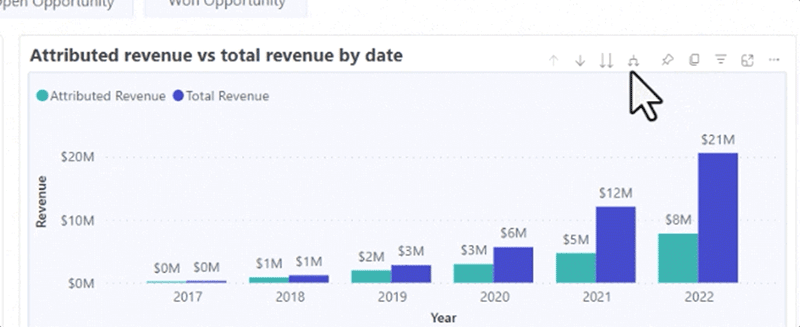

# 대시보드 기본 사항 살펴보기 {#discover-dashboard-basics}

이 문서는 다시 설계된 인터페이스의 기본 기능을 안내하므로 데이터를 쉽게 액세스하고 해석할 수 있습니다. 필터 창의 역학을 자세히 살펴보고 드릴 기능, 교차 필터링 및 툴팁과 같은 향상된 보고 기능의 복잡성을 찾아냅니다.

## 필터 창 {#filter-pane}

모든 대시보드에는 원활한 탐색 및 맞춤화를 위한 다음 컨트롤과 함께 다양한 필터가 있습니다.

<table style="table-layout:auto"> 
 <tbody> 
  <tr> 
   <th>이름</th> 
   <th>아이콘</th>
   <th>설명</th>
  </tr> 
  <tr> 
   <td>햄버거 단추</td> 
   <td></td>
   <td>필터 창을 열거나 닫으려면 전환합니다.</td>
  </tr>
  <tr> 
   <td>재설정</td> 
   <td></td>
   <td>필터를 기본 설정으로 되돌립니다.</td>
  </tr>
   <tr> 
   <td>시각화에 대한 필터</td> 
   <td></td>
   <td>시각화의 오른쪽 상단 모서리로 마우스를 가져간 다음 버튼을 클릭하여 활성 필터를 확인합니다.</td>
  </tr>
 </tbody> 
</table>

## 보고서 기능 {#report-capabilities}

### 드릴다운 및 위로 {#drill-down-and-up}

* 시각화에 계층을 표시하는지 확인합니다. 작업 표시줄에 드릴 제어 옵션이 있으면 이를 나타냅니다.

* 회색 배경으로 강조 표시된 단일 아래쪽 화살표를 클릭하여 드릴다운을 활성화합니다. 되돌리려면 드릴업 아이콘을 사용합니다.

한 번에 한 필드씩 드릴다운하려면 드릴다운 아이콘을 켜고 막대와 같은 시각적 요소를 선택합니다.

이중 화살표 드릴다운 아이콘을 사용하여 다음 계층 레벨로 이동합니다.

포크와 유사한 아이콘을 사용하여 현재 보기에 추가적인 계층 수준을 추가할 수 있습니다.

### 드릴스루 {#drill-through}

* 시각적 요소 뒤의 데이터를 탐색하려면 시각적 요소를 마우스 오른쪽 단추로 클릭하고 &quot;드릴스루&quot; 옵션을 선택합니다.

* 기본 데이터를 내보내려면 드릴스루 페이지의 오른쪽 상단 모서리로 마우스를 가져간 후 &quot;추가 옵션&quot; 단추를 누르고 &quot;데이터 내보내기&quot;를 선택합니다.

* 특정 시각적 또는 타일을 확대하려면 오른쪽 상단 모서리로 마우스를 가져간 후 &quot;포커스&quot; 버튼을 선택합니다.

### 교차 필터링 {#cross-filtering}

기본적으로 하나의 시각화에서 값 또는 축 레이블을 선택하면 보고서 페이지의 다른 시각화가 교차 필터링되어 관련성 있고 필터링된 데이터만 표시됩니다.

### 툴팁 {#tooltips}

툴팁은 표시된 데이터에 대한 추가 세부 정보를 제공합니다. 간단히 시각적 요소에 마우스를 가져다 대면 상황별 툴팁이 팝업되어 특정 데이터 포인트와 관련된 통찰력이나 설명을 제공할 수 있습니다.

